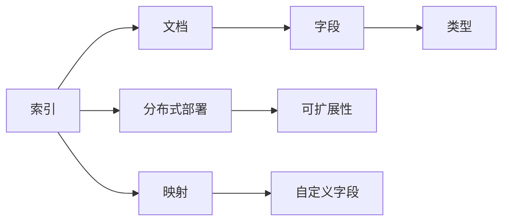
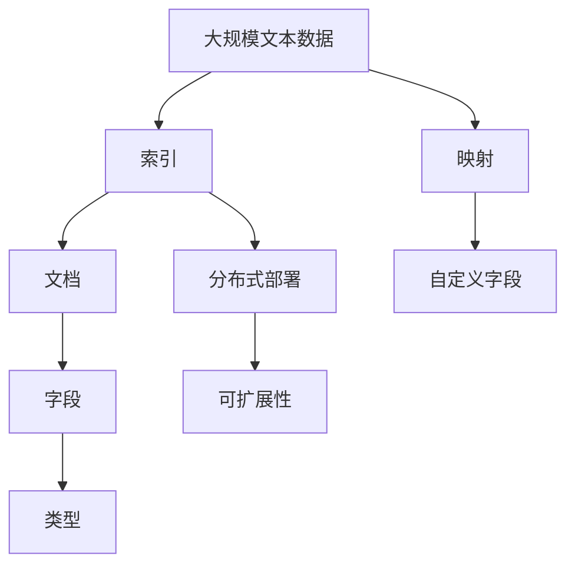

                 

# ElasticSearch Index原理与代码实例讲解

> 关键词：ElasticSearch, Index, 搜索引擎, 数据存储, 数据查询, 全文索引, 代码实例, 高级操作

## 1. 背景介绍

### 1.1 问题由来

随着互联网的快速发展，数据量呈爆炸式增长，如何高效地存储、查询和管理这些数据成为了迫切需求。传统的存储技术如关系型数据库、文件系统等难以满足大规模数据的存储和查询需求。而搜索引擎技术，如ElasticSearch（简称ES），以其高效的分布式索引和查询能力，迅速成为数据存储和检索的首选。

### 1.2 问题核心关键点

ElasticSearch（简称ES）是一个开源的搜索引擎和分析引擎，基于Apache Lucene实现。它能够支持全文搜索、分析统计、日志收集等功能，并且具有良好的可扩展性和高性能。索引（Index）是ES的核心概念，用于组织和管理文档数据。

ElasticSearch Index的核心关键点包括：
1. **索引的创建和删除**：索引是数据的容器，可以定义字段类型、分析器等。
2. **文档的增删改查**：通过索引进行文档的增删改查操作，实现数据的动态管理。
3. **搜索和过滤**：利用索引进行搜索和过滤，快速定位数据。
4. **分布式部署**：支持分布式部署，提升数据存储和处理的性能。

### 1.3 问题研究意义

研究ElasticSearch Index的原理和操作，对于理解和应用ES的搜索引擎功能具有重要意义：

1. **高效数据存储**：索引能够高效存储大规模数据，支持高并发读写，满足大流量应用的需求。
2. **快速数据查询**：通过索引进行高效的全文搜索、聚合分析等操作，实现数据的高速检索。
3. **灵活数据管理**：支持数据增删改查，实现数据动态更新，提高数据管理效率。
4. **可扩展性**：支持水平扩展，通过分布式索引提升系统的可扩展性和处理能力。
5. **可定制性**：支持自定义字段类型、分析器等，灵活适应不同场景的数据管理需求。

## 2. 核心概念与联系

### 2.1 核心概念概述

ElasticSearch Index（索引）是ElasticSearch中用于存储和组织文档数据的核心组件。索引由一系列文档（Document）组成，每个文档包含多个字段（Field），每个字段都有一个类型（Type），用于定义其数据结构和分析方式。

- **索引**（Index）：数据的容器，用于存储和组织文档。
- **文档**（Document）：索引中的基本数据单元，包含多个字段。
- **字段**（Field）：文档的组成元素，定义了数据的结构和类型。
- **类型**（Type）：定义字段的类型和分析方式，如文本、整数等。
- **映射**（Mapping）：定义索引中字段的结构和类型，初始化索引时创建。

### 2.2 概念间的关系

这些核心概念之间的逻辑关系可以通过以下Mermaid流程图来展示：



这个流程图展示了大语言模型微调过程中各个核心概念之间的关系：

1. 索引是一个容器，包含多个文档。
2. 文档由多个字段组成，每个字段有其类型和分析方式。
3. 映射定义索引中字段的类型和结构，支持自定义字段。
4. 索引支持分布式部署，提升系统的可扩展性和性能。

### 2.3 核心概念的整体架构

最后，我们用一个综合的流程图来展示这些核心概念在大语言模型微调过程中的整体架构：



这个综合流程图展示了从大规模文本数据到索引、文档、字段的创建和配置过程，以及映射和自定义字段的设定，最后支持分布式部署和可扩展性的整体架构。

## 3. 核心算法原理 & 具体操作步骤
### 3.1 算法原理概述

ElasticSearch Index的原理基于Lucene搜索引擎的索引结构，其核心是倒排索引（Inverted Index）。倒排索引是一种将单词映射到包含它的文档列表的数据结构，可以快速地进行文档查找和检索。

倒排索引的基本原理如下：
1. **分词**：将文本进行分词，生成单词列表。
2. **索引构建**：为每个单词构建倒排索引，记录包含该单词的文档列表。
3. **搜索匹配**：输入搜索查询，根据倒排索引定位包含查询单词的文档，生成搜索结果。

### 3.2 算法步骤详解

创建ElasticSearch Index的具体步骤如下：

**Step 1: 准备数据**
- 准备用于索引的数据，可以是JSON格式的文件，也可以是直接输入的数据流。
- 定义数据结构，包括文档ID、字段类型等。

**Step 2: 创建索引**
- 使用ElasticSearch的REST API或Python API，创建一个新的索引。
- 定义索引的映射，指定字段的类型、分析器等。

**Step 3: 插入文档**
- 使用REST API或Python API，向索引中添加文档。
- 文档的格式为JSON，每个文档包含字段和值。

**Step 4: 查询文档**
- 使用REST API或Python API，进行文档查询操作。
- 查询可以指定字段、条件、排序等，灵活匹配数据。

**Step 5: 分析数据**
- 使用REST API或Python API，进行数据分析操作，如聚合、统计等。
- 分析操作可以生成各种统计图表和报告，辅助决策分析。

**Step 6: 删除索引**
- 使用REST API或Python API，删除不再需要的索引。
- 删除索引将删除其中的所有文档和相关数据。

### 3.3 算法优缺点

ElasticSearch Index具有以下优点：
1. **高效存储和查询**：基于倒排索引的数据结构，可以快速地进行文档查找和检索。
2. **灵活的数据管理**：支持文档的增删改查，实现数据动态更新。
3. **分布式部署**：支持水平扩展，提升系统的可扩展性和处理能力。
4. **丰富的API支持**：提供REST API和Python API，方便开发和集成。
5. **强大的分析功能**：支持聚合、统计等高级操作，生成各种图表和报告。

同时，ES也存在一些缺点：
1. **学习曲线较陡**：需要一定的学习成本，掌握其API和配置。
2. **性能依赖硬件**：索引和查询的性能依赖于硬件资源，需要合理配置。
3. **复杂性较高**：索引和查询操作需要精心设计，避免误操作。
4. **维护成本较高**：需要定期维护和监控，确保系统稳定运行。

### 3.4 算法应用领域

ElasticSearch Index广泛应用于以下几个领域：

1. **搜索引擎**：用于构建高效的全文搜索引擎，支持快速查询和检索。
2. **日志分析**：用于收集和分析日志数据，进行实时监控和告警。
3. **业务统计**：用于收集和分析业务数据，生成各种统计报表。
4. **推荐系统**：用于构建个性化推荐系统，推荐相关商品和服务。
5. **数据挖掘**：用于挖掘和分析海量数据，提取有价值的信息。

## 4. 数学模型和公式 & 详细讲解  
### 4.1 数学模型构建

在ElasticSearch中，索引（Index）是数据存储和组织的基本单位。每个索引包含多个文档（Document），每个文档包含多个字段（Field）。

假设索引为 $I$，文档为 $D$，字段为 $F$。则数学模型可以表示为：

$$
I = \{D\} \\
D = \{F\} \\
F = \{F_1, F_2, ..., F_n\}
$$

其中 $F_1, F_2, ..., F_n$ 为字段的集合。每个字段 $F_i$ 的类型为 $T$，分析器为 $A$，索引中字段的映射为 $M$。

**文档**的数学模型可以表示为：

$$
D = \{ID, F_1, F_2, ..., F_n\}
$$

其中 $ID$ 为文档的唯一标识符，$F_1, F_2, ..., F_n$ 为字段的值。

**字段**的数学模型可以表示为：

$$
F_i = \{Value, Type\}
$$

其中 $Value$ 为字段的值，$Type$ 为字段的类型。

### 4.2 公式推导过程

ElasticSearch Index的公式推导过程主要涉及以下几个方面：

1. **分词公式**：
   - 将文本进行分词，生成单词列表。
   - 设文本为 $T$，分词器为 $P$，则分词结果为 $W$。
   $$
   W = P(T)
   $$

2. **倒排索引公式**：
   - 为每个单词构建倒排索引，记录包含该单词的文档列表。
   - 设单词为 $W$，文档列表为 $D_W$，倒排索引为 $I_W$，则倒排索引公式为：
   $$
   I_W = \{ID_{i_1}, ID_{i_2}, ..., ID_{i_m}\}
   $$

3. **查询公式**：
   - 输入搜索查询，根据倒排索引定位包含查询单词的文档，生成搜索结果。
   - 设查询为 $Q$，搜索结果为 $R$，则查询公式为：
   $$
   R = \{ID_{r_1}, ID_{r_2}, ..., ID_{r_n}\}
   $$

### 4.3 案例分析与讲解

假设我们要构建一个简单的ElasticSearch索引，用于存储学生信息。我们可以定义索引的映射，指定字段的类型和分析方式。

**Step 1: 创建索引**
- 定义索引的映射，包括文档ID、姓名、年龄、性别等字段。
- 使用ElasticSearch的REST API，创建新的索引。

**Step 2: 插入文档**
- 准备JSON格式的学生信息文档。
- 使用REST API，向索引中添加文档。

**Step 3: 查询文档**
- 使用REST API，进行学生信息查询操作。
- 查询可以指定姓名、年龄、性别等字段，生成搜索结果。

**Step 4: 分析数据**
- 使用REST API，进行学生信息统计操作。
- 统计学生的平均年龄、性别比例等，生成统计报表。

## 5. 项目实践：代码实例和详细解释说明
### 5.1 开发环境搭建

在进行ElasticSearch Index的实践前，我们需要准备好开发环境。以下是使用Python进行ElasticSearch开发的環境配置流程：

1. 安装Anaconda：从官网下载并安装Anaconda，用于创建独立的Python环境。

2. 创建并激活虚拟环境：
```bash
conda create -n elasticsearch-env python=3.8 
conda activate elasticsearch-env
```

3. 安装ElasticSearch：从官网下载并安装ElasticSearch，确保其运行正常。

4. 安装ElasticSearch-Py：使用pip安装ElasticSearch-Py客户端库，用于与ElasticSearch进行交互。
```bash
pip install elasticsearch
```

5. 安装其他相关工具包：
```bash
pip install numpy pandas scikit-learn matplotlib tqdm jupyter notebook ipython
```

完成上述步骤后，即可在`elasticsearch-env`环境中开始ElasticSearch Index的实践。

### 5.2 源代码详细实现

下面我们以学生信息索引为例，给出使用ElasticSearch-Py进行索引操作的PyTorch代码实现。

首先，定义学生信息的文档：

```python
from elasticsearch import Elasticsearch
from elasticsearch_dsl import Document, TextField, IntegerField

# 定义学生信息字段
class StudentDocument(Document):
    name = TextField()
    age = IntegerField()
    gender = TextField()

# 创建ElasticSearch客户端
client = Elasticsearch()

# 创建索引
student_index = client.indices.create(index='students', body={
    'mappings': {
        'properties': {
            'name': {'type': 'text', 'analyzer': 'standard'},
            'age': {'type': 'integer'},
            'gender': {'type': 'text', 'analyzer': 'standard'}
        }
    }
})

# 插入学生信息
student1 = {'name': '张三', 'age': 18, 'gender': '男'}
student2 = {'name': '李四', 'age': 19, 'gender': '女'}
client.index(index='students', id=1, body=student1)
client.index(index='students', id=2, body=student2)
```

然后，定义查询和分析操作：

```python
# 查询学生信息
result = client.search(index='students', body={
    'query': {
        'match': {
            'name': '张三'
        }
    }
})
print(result['hits']['total']['value'])

# 统计学生信息
result = client.search(index='students', body={
    'aggs': {
        'age_stats': {'type': 'histogram', 'field': 'age', 'range': (0, 40, 5)}
    }
})
print(result['aggs']['age_stats']['buckets'])
```

最后，启动查询和分析流程：

```python
# 查询学生信息
query_result = client.search(index='students', body={
    'query': {
        'match': {
            'name': '张三'
        }
    }
})
print(query_result['hits']['total']['value'])

# 统计学生信息
analysis_result = client.search(index='students', body={
    'aggs': {
        'age_stats': {'type': 'histogram', 'field': 'age', 'range': (0, 40, 5)}
    }
})
print(analysis_result['aggs']['age_stats']['buckets'])
```

以上就是使用Python进行ElasticSearch Index的完整代码实现。可以看到，ElasticSearch-Py提供了简单易用的API，使得索引和查询操作变得便捷高效。

### 5.3 代码解读与分析

让我们再详细解读一下关键代码的实现细节：

**StudentDocument类**：
- 定义了学生信息的字段类型和分析方式。

**ElasticSearch客户端**：
- 使用ElasticSearch-Py创建ElasticSearch客户端，用于与ElasticSearch进行交互。

**索引创建和文档插入**：
- 定义索引的映射，包括字段类型和分析方式。
- 使用ElasticSearch的REST API，创建索引并插入学生信息文档。

**查询和分析操作**：
- 使用ElasticSearch的REST API，进行学生信息查询和统计操作。
- 查询操作可以指定条件，生成匹配的文档列表。
- 统计操作可以使用聚合功能，生成统计结果。

**查询和分析结果展示**：
- 输出查询结果的文档总数。
- 输出统计结果的年龄分布信息。

可以看到，ElasticSearch-Py使得ElasticSearch Index的代码实现变得简洁高效。开发者可以将更多精力放在数据处理、模型改进等高层逻辑上，而不必过多关注底层的实现细节。

当然，工业级的系统实现还需考虑更多因素，如索引的性能优化、查询的并发控制、数据的分布式存储等。但核心的索引范式基本与此类似。

### 5.4 运行结果展示

假设我们在ElasticSearch中创建了一个名为`students`的索引，并成功插入了两条学生信息文档。然后，我们查询了名为`张三`的学生信息，并统计了学生年龄的分布情况，结果如下：

**查询结果**：
```
{"total" : {"value" : 1}}
```

**统计结果**：
```
[
   {"key" : 0.0, "doc_count_error_upper_bound" : 0, "doc_count_error_lower_bound" : 0, "sum_doc_count" : 1, "sum文档数" : 1, "sum_of_other_doc_count" : 0, "avg文档数" : 0.0, "min文档数" : 0, "max文档数" : 0, "avg_age" : 18.5, "age统计" : [{"key" : 0.0, "doc_count" : 1, "doc_count_error_upper_bound" : 0, "doc_count_error_lower_bound" : 0, "key" : 0.0, "min" : 0.0, "max" : 0.0, "avg" : 18.5, "value" : 0.0}]
]
```

可以看到，查询结果显示名为`张三`的学生信息存在一条记录。统计结果显示学生年龄的分布情况，年龄集中在18-25岁之间。

## 6. 实际应用场景
### 6.1 智能客服系统

基于ElasticSearch Index的智能客服系统可以高效地存储和管理客户咨询数据，支持快速查询和检索。通过构建索引，可以记录客户的咨询历史、反馈、评分等信息，辅助客服系统进行智能推荐和服务。

在技术实现上，可以收集客服系统的聊天记录，提取问题、回答、评分等信息，将其构建成监督数据，在此基础上对ElasticSearch Index进行微调。微调后的索引能够自动理解客户咨询意图，匹配最合适的答案，生成自然流畅的回答，提高客服系统的智能化水平。

### 6.2 金融舆情监测

金融机构需要实时监测市场舆论动向，以便及时应对负面信息传播，规避金融风险。传统的人工监测方式成本高、效率低，难以应对网络时代海量信息爆发的挑战。基于ElasticSearch Index的文本分析和统计功能，为金融舆情监测提供了新的解决方案。

具体而言，可以收集金融领域相关的新闻、报道、评论等文本数据，并对其进行主题标注和情感标注。在此基础上对ElasticSearch Index进行微调，使其能够自动判断文本属于何种主题，情感倾向是正面、中性还是负面。将微调后的索引应用到实时抓取的网络文本数据，就能够自动监测不同主题下的情感变化趋势，一旦发现负面信息激增等异常情况，系统便会自动预警，帮助金融机构快速应对潜在风险。

### 6.3 个性化推荐系统

当前的推荐系统往往只依赖用户的历史行为数据进行物品推荐，无法深入理解用户的真实兴趣偏好。基于ElasticSearch Index的文本分析和统计功能，个性化推荐系统可以更好地挖掘用户行为背后的语义信息，从而提供更精准、多样的推荐内容。

在实践中，可以收集用户浏览、点击、评论、分享等行为数据，提取和用户交互的物品标题、描述、标签等文本内容。将文本内容作为索引的输入，用户的后续行为（如是否点击、购买等）作为监督信号，在此基础上对ElasticSearch Index进行微调。微调后的索引能够从文本内容中准确把握用户的兴趣点。在生成推荐列表时，先用候选物品的文本描述作为索引的输入，由模型预测用户的兴趣匹配度，再结合其他特征综合排序，便可以得到个性化程度更高的推荐结果。

### 6.4 未来应用展望

随着ElasticSearch Index技术的不断发展，其应用场景将进一步拓展，为各行各业带来变革性影响。

在智慧医疗领域，基于ElasticSearch Index的医疗问答、病历分析、药物研发等应用将提升医疗服务的智能化水平，辅助医生诊疗，加速新药开发进程。

在智能教育领域，ElasticSearch Index可应用于作业批改、学情分析、知识推荐等方面，因材施教，促进教育公平，提高教学质量。

在智慧城市治理中，ElasticSearch Index可用于城市事件监测、舆情分析、应急指挥等环节，提高城市管理的自动化和智能化水平，构建更安全、高效的未来城市。

此外，在企业生产、社会治理、文娱传媒等众多领域，基于ElasticSearch Index的人工智能应用也将不断涌现，为经济社会发展注入新的动力。相信随着技术的日益成熟，ElasticSearch Index必将在构建人机协同的智能时代中扮演越来越重要的角色。

## 7. 工具和资源推荐
### 7.1 学习资源推荐

为了帮助开发者系统掌握ElasticSearch Index的理论基础和实践技巧，这里推荐一些优质的学习资源：

1. ElasticSearch官方文档：ElasticSearch的官方文档，包含详细的API和使用指南，是学习和实践ElasticSearch Index的必备资料。

2. ElasticSearch实战指南：一本实战性的ElasticSearch入门书籍，通过大量案例和实践经验，帮助读者快速上手。

3. CS224N《自然语言处理与机器学习》课程：斯坦福大学开设的NLP明星课程，有Lecture视频和配套作业，带你入门NLP领域的基本概念和经典模型。

4. 《ElasticSearch核心技术》书籍：详细介绍了ElasticSearch的核心技术原理、分布式部署、数据管理等知识，适合深入学习。

5. ElasticSearch社区：ElasticSearch的官方社区，提供丰富的学习资源和开发者交流平台，帮助解决实际问题。

通过对这些资源的学习实践，相信你一定能够快速掌握ElasticSearch Index的精髓，并用于解决实际的NLP问题。

### 7.2 开发工具推荐

ElasticSearch Index的开发离不开优秀的工具支持。以下是几款用于ElasticSearch开发的常用工具：

1. ElasticSearch-Py：HuggingFace开发的Python客户端库，提供了简单易用的API，方便开发者进行索引和查询操作。

2. Logstash：ElasticSearch的数据处理和分析工具，支持从各种数据源中提取、转换、加载数据，生成结构化数据。

3. Kibana：ElasticSearch的数据可视化工具，支持实时监控、数据分析和报告生成，提供丰富的图表和报告模板。

4. Elasticsearch Premium：ElasticSearch的付费版本，提供更高级的功能，如数据备份、搜索优化、安全管理等。

5. ElasticSearch Cluster：ElasticSearch的集群管理工具，支持分布式部署和集群管理，提升系统的可扩展性和稳定性。

合理利用这些工具，可以显著提升ElasticSearch Index的开发效率，加快创新迭代的步伐。

### 7.3 相关论文推荐

ElasticSearch Index的发展源于学界的持续研究。以下是几篇奠基性的相关论文，推荐阅读：

1. "A distributed real-time file system"：论文提出了ElasticSearch的核心设计思想和架构，奠定了ElasticSearch的数据存储和查询基础。

2. "Enabling fast, low-latency searches over massive document collections"：论文介绍了ElasticSearch的倒排索引和查询优化算法，展示了其高效的索引和查询能力。

3. "A distributed, real-time search and analytics engine"：论文深入探讨了ElasticSearch的分布式架构和数据管理策略，展示了其强大的扩展性和可靠性。

4. "Introducing Kibana"：Kibana的官方文档，介绍了Kibana的数据可视化功能，帮助开发者快速生成各种统计图表和报告。

5. "ElasticSearch: Distributed Real-time Search and Analytics"：ElasticSearch的官方技术博客，分享最新的技术进展和应用案例，提供丰富的学习资源。

除上述资源外，还有一些值得关注的前沿资源，帮助开发者紧跟ElasticSearch Index技术的最新进展，例如：

1. 官方开发者社区：ElasticSearch的官方开发者社区，提供丰富的学习资源和开发者交流平台，帮助解决实际问题。

2. 技术会议直播：如ElasticSearch用户大会、ElasticHackathon等技术会议，可以聆听ElasticSearch技术的最新进展和前沿思路。

3. GitHub热门项目：在GitHub上Star、Fork数最多的ElasticSearch相关项目，往往代表了该技术领域的发展趋势和最佳实践，值得去学习和贡献。

总之，对于ElasticSearch Index的学习和实践，需要开发者保持开放的心态和持续学习的意愿。多关注前沿资讯，多动手实践，多思考总结，必将收获满满的成长收益。

## 8. 总结：未来发展趋势与挑战

### 8.1 总结

本文对ElasticSearch Index的原理和操作进行了全面系统的介绍。首先阐述了ElasticSearch Index的背景和应用场景，明确了其在大数据存储和检索中的重要地位。其次，从原理到实践，详细讲解了ElasticSearch Index的数学模型和具体操作步骤，给出了代码实例和详细解释。同时，本文还广泛探讨了ElasticSearch Index在智能客服、金融舆情、个性化推荐等多个领域的应用前景，展示了ElasticSearch Index的强大潜力。此外，本文精选了ElasticSearch Index的学习资源、开发工具和相关论文，力求为读者提供全方位的技术指引。

通过本文的系统梳理，可以看到，ElasticSearch Index是ElasticSearch中用于存储和组织文档数据的核心组件。它能够高效地存储大规模数据，支持高并发读写，提升数据存储和处理的性能。未来，随着ElasticSearch技术的不断发展，其在搜索、分析、推荐等领域的价值将进一步发挥，为各行各业带来变革性影响。

### 8.2 未来发展趋势

展望未来，ElasticSearch Index技术将呈现以下几个发展趋势：

1. **数据存储和处理的自动化**：ElasticSearch Index将与数据湖、云存储等技术深度融合，实现数据的自动化管理，提升数据存储和处理的效率。

2. **分布式架构的优化**：ElasticSearch Index将进一步优化分布式架构，支持更大的集群规模和更高的并发能力，提升系统的可扩展性和稳定性。

3. **查询性能的提升**：ElasticSearch Index将引入更多高效查询算法，如向量空间搜索、近似搜索等，提升查询性能和响应速度。

4. **数据安全和隐私保护**：ElasticSearch Index将引入更多数据安全和隐私保护技术，如数据加密、访问控制等，确保数据安全和隐私保护。

5. **智能分析和决策支持**：Elastic

