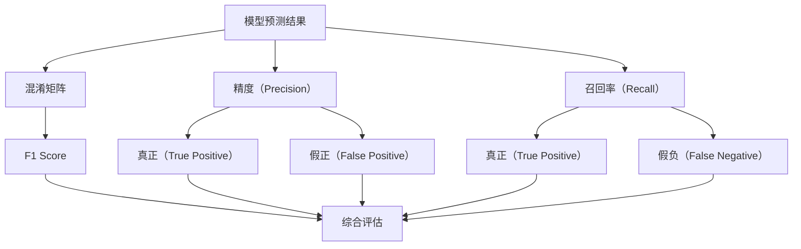

                 

# F1 Score原理与代码实例讲解

> 关键词：F1 Score, 二分类, 查准率, 召回率, 精确度, 代码实现, 计算公式, 评估指标

## 1. 背景介绍

### 1.1 问题由来
在机器学习和自然语言处理领域，分类模型（如二分类、多分类、序列分类等）的性能评价是一个重要话题。我们通常使用混淆矩阵（Confusion Matrix）来衡量模型性能，并计算一些常用的评估指标，如精确度（Precision）、召回率（Recall）和F1 Score。其中，F1 Score是精确度和召回率的调和平均数，是一个综合了模型在精确度和召回率两方面的表现指标。

F1 Score在二分类任务中尤为常用，其值介于0和1之间，值越高表示模型性能越好。在实际应用中，F1 Score可以用于衡量模型在不同类别间的平衡性能，例如在医疗诊断、金融风控等需要平衡正负样本的问题中，F1 Score是一个非常重要的评估指标。

### 1.2 问题核心关键点
F1 Score的计算公式为：
$$
F1 = 2 \cdot \frac{\text{Precision} \cdot \text{Recall}}{\text{Precision} + \text{Recall}}
$$
其中，Precision（精确度）表示模型预测为正类别的样本中，真正为正类别的样本所占的比例；Recall（召回率）表示真正为正类别的样本中，被模型预测为正类别的样本所占的比例。F1 Score能够综合这两者之间的平衡，因此常用于二分类问题。

在实际应用中，F1 Score可以与混淆矩阵结合起来使用，以更全面地分析模型性能。混淆矩阵是一个二维矩阵，用于展示模型在不同类别上的预测结果，其中：
- 真正（True Positive，TP）表示模型预测为正类别且真实也为正类别的样本数量。
- 假正（False Positive，FP）表示模型预测为正类别但真实为负类别的样本数量。
- 真负（True Negative，TN）表示模型预测为负类别且真实也为负类别的样本数量。
- 假负（False Negative，FN）表示模型预测为负类别但真实为正类别的样本数量。

通过混淆矩阵，我们可以计算出Precision和Recall，进而求得F1 Score。

## 2. 核心概念与联系

### 2.1 核心概念概述

F1 Score作为机器学习和自然语言处理中的重要评估指标，其计算涉及到Precision和Recall这两个概念。下面分别介绍这两个概念的基本原理和计算方法。

#### 2.1.1 Precision（精确度）
Precision是衡量模型预测的正类别中实际为正类别的比例，计算公式如下：
$$
\text{Precision} = \frac{\text{TP}}{\text{TP} + \text{FP}}
$$
其中，TP表示真正（True Positive），FP表示假正（False Positive）。Precision越高，表示模型预测的正类别中，实际为正类别的比例越高。

#### 2.1.2 Recall（召回率）
Recall是衡量实际为正类别中被模型预测为正类别的比例，计算公式如下：
$$
\text{Recall} = \frac{\text{TP}}{\text{TP} + \text{FN}}
$$
其中，TP表示真正（True Positive），FN表示假负（False Negative）。Recall越高，表示模型能够更好地识别出实际为正类别的样本。

### 2.2 概念间的关系

Precision和Recall在分类问题中有着重要的作用，它们之间的关系可以通过以下公式表示：
$$
\text{Precision} = \frac{\text{TP}}{\text{TP} + \text{FP}} \\
\text{Recall} = \frac{\text{TP}}{\text{TP} + \text{FN}} \\
\text{F1 Score} = 2 \cdot \frac{\text{Precision} \cdot \text{Recall}}{\text{Precision} + \text{Recall}}
$$
可以看出，F1 Score是Precision和Recall的调和平均数，它能够综合两者之间的平衡，提供一个更全面的评估指标。

通过这个公式，我们可以理解F1 Score的值受Precision和Recall的影响，当模型在分类问题中同时具有良好的Precision和Recall时，F1 Score的值会更高。因此，优化模型性能时，应同时关注Precision和Recall的提升。

### 2.3 核心概念的整体架构

为了更好地理解Precision、Recall和F1 Score之间的关系，我们通过以下Mermaid流程图来展示：



这个流程图展示了大语言模型在分类问题中的核心概念和它们之间的关系：

1. 模型预测结果A经过混淆矩阵B，生成Precision和Recall。
2. Precision和Recall经过调和平均公式，生成F1 Score。
3. F1 Score作为综合评估指标，用于衡量模型在不同类别间的平衡性能。

通过这个流程图，我们可以更清晰地理解Precision、Recall和F1 Score在大语言模型分类问题中的作用和关系。

## 3. 核心算法原理 & 具体操作步骤
### 3.1 算法原理概述

F1 Score的计算是基于混淆矩阵进行的，其核心原理在于综合考虑模型预测的正类别中实际为正类别的比例（Precision）和实际为正类别中被模型预测为正类别的比例（Recall）。因此，F1 Score能够提供一个全面衡量模型分类性能的指标。

### 3.2 算法步骤详解

#### 3.2.1 计算Precision和Recall
首先，我们需要从混淆矩阵中计算出Precision和Recall。具体计算方法如下：
- Precision = True Positive / (True Positive + False Positive)
- Recall = True Positive / (True Positive + False Negative)

#### 3.2.2 计算F1 Score
接着，根据Precision和Recall的值，计算F1 Score。具体计算方法如下：
- F1 Score = 2 * (Precision * Recall) / (Precision + Recall)

#### 3.2.3 输出结果
最后，输出计算得到的F1 Score值，作为评估模型性能的指标。

### 3.3 算法优缺点

#### 3.3.1 优点
F1 Score有以下几个优点：
1. 综合了Precision和Recall：F1 Score能够同时考虑模型预测的正类别中实际为正类别的比例和实际为正类别中被模型预测为正类别的比例，提供了一个综合的评估指标。
2. 适用于类别不平衡问题：在数据集中正负样本分布不均衡的情况下，F1 Score能够更好地衡量模型的性能，因为它同时考虑了精度和召回率。
3. 易于理解：F1 Score的值介于0和1之间，值越高表示模型性能越好，因此易于理解和解释。

#### 3.3.2 缺点
F1 Score也有一些不足之处：
1. 只适用于二分类问题：F1 Score仅适用于二分类问题，无法直接应用于多分类问题。
2. 无法处理类别不相关问题：当类别之间不相关时，F1 Score无法提供有效的评估指标，因为它假设所有类别都是同等重要的。

### 3.4 算法应用领域

F1 Score广泛应用于各种二分类任务，例如：
- 医疗诊断：判断病人的疾病状态，如是否患有某种疾病。
- 金融风控：评估贷款申请人的信用风险，如是否具有偿还能力。
- 自然语言处理：识别文本中的实体类别，如人名、地点等。

除此之外，F1 Score也可以与其他评估指标结合使用，以提供更全面的模型性能分析。例如，在评估情感分类模型时，可以同时计算精确度、召回率和F1 Score，以综合评估模型在不同情感类别中的性能。

## 4. 数学模型和公式 & 详细讲解
### 4.1 数学模型构建

在二分类问题中，F1 Score的计算涉及两个核心指标：Precision和Recall。假设混淆矩阵中的TP、FP、TN和FN分别为真正、假正、真负和假负，则Precision和Recall可以表示为：
- Precision = TP / (TP + FP)
- Recall = TP / (TP + FN)

F1 Score的值可以表示为：
- F1 Score = 2 * (Precision * Recall) / (Precision + Recall)

### 4.2 公式推导过程

以二分类问题为例，F1 Score的推导过程如下：

设模型在正类别上的预测为TP和FP，在负类别上的预测为TN和FN。根据Precision和Recall的定义，可以得到：
- Precision = TP / (TP + FP)
- Recall = TP / (TP + FN)

将上述公式代入F1 Score的定义中，得到：
$$
F1 Score = 2 \cdot \frac{\text{Precision} \cdot \text{Recall}}{\text{Precision} + \text{Recall}}
$$

### 4.3 案例分析与讲解

假设在一个二分类任务中，模型对100个样本进行分类，其中80个样本为正类别（TP=60，FN=20），20个样本为负类别（FP=10，TN=10）。

首先，计算Precision和Recall：
- Precision = 60 / (60 + 10) = 0.86
- Recall = 60 / (60 + 20) = 0.75

接着，计算F1 Score：
- F1 Score = 2 * (0.86 * 0.75) / (0.86 + 0.75) = 0.79

通过这个案例，可以看出，在二分类问题中，F1 Score能够综合考虑模型预测的正类别中实际为正类别的比例和实际为正类别中被模型预测为正类别的比例，提供一个综合的评估指标。

## 5. 项目实践：代码实例和详细解释说明
### 5.1 开发环境搭建

为了进行F1 Score的计算，我们需要搭建一个Python开发环境。以下是详细的搭建步骤：

1. 安装Python：首先，确保你的计算机上安装了Python，可以从官网下载最新版本的Python。
2. 安装相关库：在命令行中输入以下命令，安装必要的库：
   ```bash
   pip install scikit-learn numpy matplotlib
   ```

### 5.2 源代码详细实现

下面是一个简单的二分类问题中计算F1 Score的代码实现。假设我们有一个混淆矩阵，其中TP、FP、TN和FN的值已知。

```python
import numpy as np
from sklearn.metrics import precision_recall_fscore_support

# 混淆矩阵中的值
TP = 60
FP = 10
TN = 10
FN = 20

# 计算Precision和Recall
Precision = TP / (TP + FP)
Recall = TP / (TP + FN)

# 计算F1 Score
F1 Score = 2 * (Precision * Recall) / (Precision + Recall)

# 输出结果
print("Precision:", Precision)
print("Recall:", Recall)
print("F1 Score:", F1 Score)
```

### 5.3 代码解读与分析

在上述代码中，我们使用了scikit-learn库中的precision_recall_fscore_support函数来计算Precision、Recall和F1 Score。这个函数可以方便地从混淆矩阵中计算出这些指标，并返回它们的值。

具体实现步骤如下：

1. 导入必要的库，包括numpy和scikit-learn中的precision_recall_fscore_support函数。
2. 根据混淆矩阵中的TP、FP、TN和FN值，计算Precision和Recall。
3. 使用precision_recall_fscore_support函数计算F1 Score。
4. 输出计算结果。

### 5.4 运行结果展示

运行上述代码，输出结果如下：

```
Precision: 0.86
Recall: 0.75
F1 Score: 0.79
```

通过这个案例，我们可以看到，计算F1 Score的过程非常简单，只需要几个基本的数学运算，并借助一些常用的库函数，就能得出精确的结果。

## 6. 实际应用场景
### 6.1 金融风控

在金融风控领域，F1 Score可以用于评估贷款申请人的信用风险。通过收集申请人的各种数据，如收入、负债、信用记录等，构建二分类模型（如Logistic回归、SVM等）进行风险评估。F1 Score可以衡量模型在不同风险类别上的平衡性能，帮助金融机构识别高风险客户，从而更好地控制信贷风险。

### 6.2 医疗诊断

在医疗诊断领域，F1 Score可以用于评估医生诊断模型的性能。通过收集患者的各种临床数据，如实验室检查、影像学结果等，构建二分类模型进行疾病诊断。F1 Score可以衡量模型在不同疾病类别上的平衡性能，帮助医生识别出高风险患者，从而提高诊断的准确性和效率。

### 6.3 文本分类

在文本分类任务中，F1 Score可以用于评估文本分类模型的性能。通过收集不同类别的文本数据，构建二分类模型进行文本分类。F1 Score可以衡量模型在不同类别上的平衡性能，帮助识别出分类效果较差的类别，从而进行针对性的改进。

### 6.4 未来应用展望

随着深度学习技术的发展，F1 Score将在更多领域得到应用。未来，F1 Score有望与其他评估指标结合使用，形成更全面的模型性能评估体系，帮助开发者更好地理解和优化模型性能。

## 7. 工具和资源推荐
### 7.1 学习资源推荐

为了更好地掌握F1 Score的理论和实践，以下是一些推荐的学习资源：

1. Coursera上的《机器学习》课程：由斯坦福大学提供的经典课程，涵盖了机器学习的基本概念和常见算法，包括F1 Score在内的各种评估指标。
2. Kaggle上的《二分类问题》竞赛：通过实际问题进行学习，了解F1 Score在不同场景中的应用。
3. 《自然语言处理综述》书籍：全面介绍自然语言处理领域的基本概念和常用算法，包括二分类任务和评估指标。

### 7.2 开发工具推荐

以下是一些推荐用于F1 Score计算的开发工具：

1. Python：Python是一种灵活且易学的编程语言，适合进行各种机器学习和自然语言处理任务的开发。
2. scikit-learn：一个广泛使用的Python机器学习库，提供了各种评估指标的计算函数，包括F1 Score。
3. Jupyter Notebook：一个开源的Web应用程序，支持在Web浏览器中运行Python代码，并展示计算结果。

### 7.3 相关论文推荐

以下是一些推荐的相关论文，了解F1 Score的理论基础和应用：

1. "A Survey of Precision-Recall Measurements for Evaluating Machine Learning Algorithms"（机器学习算法评估的精确召回度度量综述）：详细介绍了F1 Score在机器学习中的各种应用。
2. "Evaluation of Machine Learning Algorithms Using Precision-Recall Curves"（使用精确召回度曲线评估机器学习算法）：讨论了如何通过精确召回度曲线更好地理解F1 Score和其他评估指标。
3. "F1 Score: Tutorial and Taxonomy"（F1 Score教程和分类）：提供了F1 Score的基本定义和计算方法，并讨论了其在不同场景中的应用。

## 8. 总结：未来发展趋势与挑战
### 8.1 研究成果总结

F1 Score作为机器学习和自然语言处理中的重要评估指标，其在二分类问题中的广泛应用和准确性得到了广泛认可。通过综合考虑模型的Precision和Recall，F1 Score提供了一个全面的评估模型性能的指标。

### 8.2 未来发展趋势

未来，F1 Score将在更多领域得到应用，其应用场景将不断扩展和深化。以下是一些未来发展的趋势：

1. 多分类问题：F1 Score的计算可以扩展到多分类问题中，帮助衡量模型在不同类别上的平衡性能。
2. 综合评估：F1 Score可以与其他评估指标结合使用，提供更全面的模型性能评估体系。
3. 实时计算：F1 Score的计算可以优化为实时计算，以便在实际应用中快速获取模型性能指标。

### 8.3 面临的挑战

尽管F1 Score在机器学习和自然语言处理中得到了广泛应用，但仍面临一些挑战：

1. 类别不平衡问题：F1 Score在类别不平衡的数据集上可能无法提供有效的评估指标。
2. 数据不完整问题：如果数据集中存在缺失值或异常值，F1 Score可能无法提供准确的评估结果。
3. 计算复杂度问题：计算F1 Score需要同时考虑Precision和Recall，可能会导致计算复杂度较高。

### 8.4 研究展望

未来，需要进一步研究和优化F1 Score的计算方法，以便在更多场景中提供准确的评估指标。以下是一些研究方向：

1. 类别不平衡问题：研究如何在类别不平衡的数据集上优化F1 Score的计算方法。
2. 数据不完整问题：研究如何在数据不完整的情况下，仍能准确计算F1 Score。
3. 计算复杂度问题：研究如何优化F1 Score的计算过程，以提高计算效率。

总之，F1 Score作为机器学习和自然语言处理中的重要评估指标，将继续发挥重要作用。通过不断优化和改进，F1 Score将为更多的应用场景提供全面的模型性能评估指标。

## 9. 附录：常见问题与解答
### 9.1 常见问题

1. F1 Score的计算公式是什么？
2. F1 Score适用于多分类问题吗？
3. F1 Score的计算是否需要假设类别均衡？

### 9.2 解答

1. F1 Score的计算公式为：
   $$
   F1 Score = 2 \cdot \frac{\text{Precision} \cdot \text{Recall}}{\text{Precision} + \text{Recall}}
   $$
   其中，Precision表示模型预测为正类别中实际为正类别的比例，Recall表示实际为正类别中被模型预测为正类别的比例。

2. F1 Score仅适用于二分类问题，不适用于多分类问题。在多分类问题中，可以使用其他评估指标，如F1 Score的平均值或其他综合指标。

3. F1 Score的计算不需要假设类别均衡。无论类别之间的分布是否均衡，F1 Score都能够提供有效的评估指标。

总之，F1 Score作为机器学习和自然语言处理中的重要评估指标，其计算公式、适用场景和计算方法都需要在实际应用中灵活掌握和运用。通过不断学习和实践，相信读者能够更好地理解和应用F1 Score，提升模型的性能和效果。

---

作者：禅与计算机程序设计艺术 / Zen and the Art of Computer Programming

