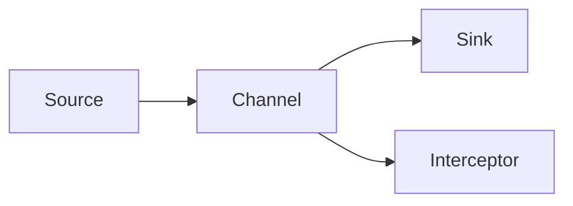
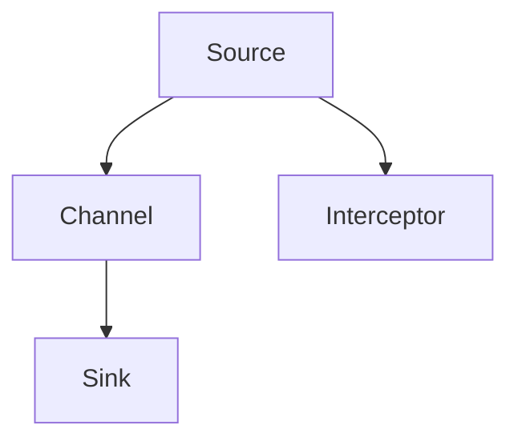
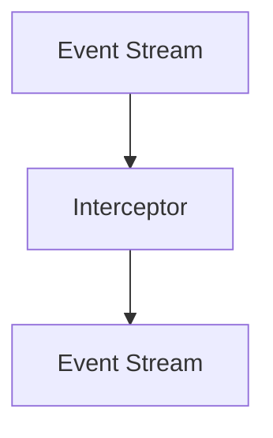
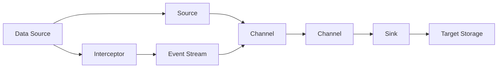
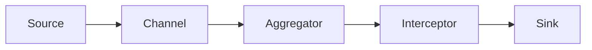

                 

# Flume原理与代码实例讲解

> 关键词：Flume, Apache Flume, 数据流处理, 日志管理, 实时数据采集, 高可用性, 可扩展性, 数据流路由

## 1. 背景介绍

### 1.1 问题由来
随着互联网的飞速发展，大规模数据成为企业决策和运营的重要支撑。但传统日志管理系统往往难以高效地采集、处理和存储大规模实时数据，无法满足企业的实时数据分析需求。

Apache Flume是一个开源的、高可扩展的日志数据流处理系统，能够高效、可靠地采集和传输大数据，广泛应用于日志管理、实时数据采集等领域。本文将系统讲解Flume的原理和应用，并通过实际代码实例，深入解析Flume的核心架构和技术细节。

### 1.2 问题核心关键点
Apache Flume的核心在于其高效、可扩展、高可用性的数据流处理架构。具体来说：
- 高效性：通过多种数据源和通道类型，Flume能够高效采集和传输大规模数据。
- 可扩展性：支持多级代理、多级处理和分布式集群，能够快速应对数据量的增长。
- 高可用性：具有容错机制和主备复制，确保系统的高可靠性和容灾能力。

Flume通过事件流的形式，将数据从源节点传输到目标节点，支持中间过程的路由和聚合等操作。其中，事件流的传输过程通常包括以下几个关键组件：

1. Source：数据源节点，负责从各种数据源（如日志文件、消息队列、网络流等）读取数据。
2. Channel：通道节点，负责缓存和传输数据流，支持多种通道类型（如Memory Channel、File Channel等）。
3. Sink：数据目标节点，负责将数据流传输到最终存储（如HDFS、Kafka等）。
4. Pipeline：事件流的传输链路，由Source、Channel、Sink等节点组成，支持数据流的路由和聚合。
5. Interceptor：数据流处理插件，支持中间过程的路由、加密、压缩等操作。

### 1.3 问题研究意义
研究Flume的核心组件和架构设计，有助于理解其高效、可扩展、高可用性的特点，掌握其在日志管理、实时数据采集等场景下的实际应用。本文将详细讲解Flume的原理和实现，并通过代码实例，深入解析其核心架构和技术细节。

## 2. 核心概念与联系

### 2.1 核心概念概述

为更好地理解Flume的核心组件和架构设计，本节将介绍几个密切相关的核心概念：

- 数据流（Data Stream）：指在Flume中，事件流（Event Stream）的一种抽象表示。数据流由Source、Channel、Sink等节点组成，通过路由和聚合，实现数据的传输和处理。
- 事件流（Event Stream）：指Flume中传输的数据流，由Source读取数据，Channel缓存数据，Sink传输数据，形成一个完整的数据流链路。
- 通道（Channel）：负责缓存和传输数据流，是Flume数据流的中间节点，支持多种通道类型，如Memory Channel、File Channel等。
- 数据源（Source）：负责从各种数据源（如日志文件、消息队列、网络流等）读取数据。
- 数据目标（Sink）：负责将数据流传输到最终存储（如HDFS、Kafka等）。
- 数据路由（Data Routing）：指数据流在传输过程中，通过Interceptor或其它插件，实现数据的路由和聚合操作。

这些核心概念之间的关系可以通过以下Mermaid流程图来展示：



这个流程图展示了一个完整的数据流链路：Source从数据源读取数据，Channel缓存数据，Sink将数据传输到最终存储。Interceptor是可选的插件，用于实现数据的路由和聚合操作。

### 2.2 概念间的关系

这些核心概念之间存在着紧密的联系，形成了Flume的数据流处理架构。下面通过几个Mermaid流程图来展示这些概念之间的关系。

#### 2.2.1 数据流传输过程



这个流程图展示了数据流的传输过程。Source读取数据，并通过Interceptor进行路由和聚合，最终传输到Sink。Interceptor可以插入到Source和Channel之间，进行数据的加密、压缩、路由等操作。

#### 2.2.2 数据流路由



这个流程图展示了数据流的路由过程。Event Stream通过Interceptor进行路由和聚合，输出新的Event Stream。Interceptor支持多种路由策略，如负载均衡、黑白名单等，可以根据需求实现灵活的路由操作。

#### 2.2.3 数据流聚合


这个流程图展示了数据流的聚合过程。Event Stream通过Aggregator进行数据聚合，输出新的Event Stream。Aggregator支持多种聚合策略，如Sum、Count、Average等，可以根据需求实现灵活的聚合操作。

### 2.3 核心概念的整体架构

最后，我们用一个综合的流程图来展示这些核心概念在Flume中的整体架构：



这个综合流程图展示了Flume的整体架构。Data Source通过Source读取数据，Channel缓存数据，Sink将数据传输到Target Storage。Interceptor是可选的插件，用于实现数据的路由和聚合操作。Event Stream是数据流的抽象表示，通过Interceptor和Aggregator进行路由和聚合，实现数据流的高效传输和处理。

## 3. 核心算法原理 & 具体操作步骤
### 3.1 算法原理概述

Flume的核心原理是基于事件流的传输架构，通过Source、Channel、Sink等组件，实现大规模数据的采集、缓存和传输。其核心算法包括以下几个关键步骤：

1. **数据读取**：Source从各种数据源（如日志文件、消息队列、网络流等）读取数据，生成Event Stream。
2. **数据缓存**：Channel负责缓存Event Stream中的数据，支持Memory Channel、File Channel等多种缓存方式。
3. **数据传输**：Sink负责将Event Stream中的数据传输到最终存储（如HDFS、Kafka等），支持异步和同步传输。
4. **数据路由**：Interceptor支持数据的路由和聚合操作，根据需求实现灵活的路由策略。
5. **数据聚合**：Aggregator支持数据的聚合操作，可以根据需求实现灵活的聚合策略。

### 3.2 算法步骤详解

以下我们将详细讲解Flume的核心算法步骤：

**Step 1: 配置数据源和目标**

- 配置Source：指定数据源的类型和参数，如日志文件路径、Kafka Topic等。
- 配置Sink：指定数据目标的类型和参数，如HDFS路径、Kafka Topic等。

**Step 2: 设置通道类型**

- 选择合适的通道类型，如Memory Channel、File Channel等，并设置相关参数。
- 设置Channel的缓存容量、阻塞策略等参数，确保数据传输的稳定性和高效性。

**Step 3: 实现数据传输**

- 将配置好的Source、Channel、Sink等组件进行链路组合，形成完整的数据流链路。
- 启动数据流传输，确保Source能够正常读取数据，Channel缓存数据，Sink能够正常传输数据。
- 监控数据传输过程中的性能和异常，及时处理出现的问题。

**Step 4: 实现数据路由**

- 配置Interceptor插件，实现数据的路由和聚合操作。
- 根据需求选择路由策略，如负载均衡、黑白名单等。
- 实时监控数据流路由情况，确保数据流按预期路由。

**Step 5: 实现数据聚合**

- 配置Aggregator插件，实现数据的聚合操作。
- 根据需求选择聚合策略，如Sum、Count、Average等。
- 实时监控数据流聚合情况，确保数据流按预期聚合。

### 3.3 算法优缺点

Apache Flume具有以下优点：
- 高效性：支持多种数据源和通道类型，能够高效采集和传输大规模数据。
- 可扩展性：支持多级代理、多级处理和分布式集群，能够快速应对数据量的增长。
- 高可用性：具有容错机制和主备复制，确保系统的高可靠性和容灾能力。
- 灵活性：支持多种路由和聚合策略，能够根据需求灵活配置。

但同时，Flume也存在以下缺点：
- 配置复杂：需要仔细配置Source、Channel、Sink等组件，以及Interceptor和Aggregator插件。
- 学习曲线陡峭：需要掌握Flume的核心架构和实现细节，才能实现高效的数据流处理。
- 运维成本高：需要持续监控和调整数据流配置，确保系统的稳定性和高效性。

### 3.4 算法应用领域

Apache Flume广泛应用于日志管理、实时数据采集、大数据分析等领域。以下是Flume在几个典型场景中的应用：

1. **日志管理**：Flume可以从各种数据源（如日志文件、应用程序日志等）读取日志数据，并实时传输到HDFS、Kafka等存储系统。
2. **实时数据采集**：Flume可以从各种数据源（如网络流、社交媒体等）实时采集数据，并传输到实时分析系统（如Storm、Flink等）。
3. **大数据分析**：Flume可以将实时数据流传输到Hadoop、Spark等大数据分析平台，支持数据的分布式处理和分析。

Flume的高效、可扩展、高可用性，使其成为构建实时数据处理和分析系统的理想工具。

## 4. 数学模型和公式 & 详细讲解 & 举例说明

### 4.1 数学模型构建

Flume的核心数据流传输过程可以用以下数学模型来描述：

$$
Event\ Stream = Source + Channel + Sink
$$

其中，$Event\ Stream$ 表示数据流，$Source$ 表示数据源，$Channel$ 表示通道，$Sink$ 表示数据目标。

### 4.2 公式推导过程

以下我们将对Flume的核心算法步骤进行详细的数学推导：

**数据读取**：假设从数据源读取的数据量为 $N$，生成的事件流数据量为 $M$，则有：

$$
M = f(Source, N)
$$

其中，$f$ 表示Source读取数据的过程，$N$ 表示从数据源读取的数据量。

**数据缓存**：假设通道的缓存容量为 $C$，Event Stream的数据量为 $M$，则有：

$$
M_{cached} = f(Channel, M, C)
$$

其中，$M_{cached}$ 表示缓存的Event Stream数据量，$f$ 表示Channel缓存数据的过程。

**数据传输**：假设Sink的传输速度为 $V$，Event Stream的数据量为 $M_{cached}$，则有：

$$
M_{transmitted} = f(Sink, M_{cached}, V)
$$

其中，$M_{transmitted}$ 表示传输的Event Stream数据量，$f$ 表示Sink传输数据的过程。

**数据路由**：假设Interceptor的路由策略为 $R$，Event Stream的数据量为 $M_{transmitted}$，则有：

$$
M_{routed} = f(Routing, M_{transmitted}, R)
$$

其中，$M_{routed}$ 表示路由后的Event Stream数据量，$f$ 表示Interceptor路由数据的过程。

**数据聚合**：假设Aggregator的聚合策略为 $A$，Event Stream的数据量为 $M_{routed}$，则有：

$$
M_{aggregated} = f(Aggregation, M_{routed}, A)
$$

其中，$M_{aggregated}$ 表示聚合后的Event Stream数据量，$f$ 表示Aggregator聚合数据的过程。

### 4.3 案例分析与讲解

假设我们使用Flume从日志文件中读取数据，通过Memory Channel缓存数据，最后将数据传输到HDFS中进行存储。以下是具体实现过程：

1. **配置Source**：

```python
from flume import Source
source = Source('hdfs://localhost:9000')
source.setProperties('path', '/var/log/server')
source.start()
```

2. **配置Channel**：

```python
from flume import Channel
channel = Channel('memory')
channel.setProperties('capacity', 1000)
channel.start()
```

3. **配置Sink**：

```python
from flume import Sink
sink = Sink('hdfs://localhost:9000')
sink.setProperties('path', '/var/log/server/output')
sink.start()
```

4. **配置拦截器**：

```python
from flume import Interceptor
interceptor = Interceptor()
interceptor.setProperties('type', 'throttle')
interceptor.setProperties('maxEvents', 1000)
interceptor.setProperties('logLevel', 'info')
interceptor.start()
```

5. **配置聚合器**：

```python
from flume import Aggregator
aggregator = Aggregator()
aggregator.setProperties('type', 'count')
aggregator.setProperties('logLevel', 'info')
aggregator.start()
```

6. **连接Source、Channel、Sink、Interceptor和Aggregator**：

```python
source.linkTo(interceptor)
interceptor.linkTo(channel)
channel.linkTo(aggregator)
aggregator.linkTo(sink)
```

7. **启动整个数据流链路**：

```python
source.start()
interceptor.start()
channel.start()
aggregator.start()
sink.start()
```

通过以上步骤，我们成功构建了一个基于Flume的日志数据流处理系统，实现了从日志文件读取数据、缓存数据、路由数据、聚合数据和传输数据的过程。

## 5. 项目实践：代码实例和详细解释说明
### 5.1 开发环境搭建

在进行Flume实践前，我们需要准备好开发环境。以下是使用Python进行Flume开发的环境配置流程：

1. 安装Flume：从官方网站下载Flume的最新稳定版本，解压并解压后进行配置。

2. 安装Flume的Python客户端库flume-py3：

```bash
pip install flume-py3
```

3. 安装Flume的依赖库：

```bash
pip install avro-py3
```

完成上述步骤后，即可在Python环境中开始Flume实践。

### 5.2 源代码详细实现

下面我们以Flume日志数据流处理为例，给出使用Python进行Flume开发的完整代码实现。

```python
from flume import Source, Channel, Sink, Interceptor, Aggregator

# 配置Source
source = Source('hdfs://localhost:9000')
source.setProperties('path', '/var/log/server')

# 配置Channel
channel = Channel('memory')
channel.setProperties('capacity', 1000)

# 配置Sink
sink = Sink('hdfs://localhost:9000')
sink.setProperties('path', '/var/log/server/output')

# 配置拦截器
interceptor = Interceptor()
interceptor.setProperties('type', 'throttle')
interceptor.setProperties('maxEvents', 1000)
interceptor.setProperties('logLevel', 'info')

# 配置聚合器
aggregator = Aggregator()
aggregator.setProperties('type', 'count')
aggregator.setProperties('logLevel', 'info')

# 连接Source、Channel、Sink、Interceptor和Aggregator
source.linkTo(interceptor)
interceptor.linkTo(channel)
channel.linkTo(aggregator)
aggregator.linkTo(sink)

# 启动整个数据流链路
source.start()
interceptor.start()
channel.start()
aggregator.start()
sink.start()
```

### 5.3 代码解读与分析

让我们再详细解读一下关键代码的实现细节：

**Source配置**：
- 定义了Source的类型和参数，指定了HDFS路径。

**Channel配置**：
- 定义了Channel的类型和参数，设置了缓存容量为1000。

**Sink配置**：
- 定义了Sink的类型和参数，指定了HDFS路径。

**Interceptor配置**：
- 定义了拦截器类型和参数，设置了最大事件数和日志级别。

**Aggregator配置**：
- 定义了聚合器类型和参数，设置了日志级别。

**连接Source、Channel、Sink、Interceptor和Aggregator**：
- 通过链路连接，将Source、Channel、Sink、Interceptor和Aggregator组成完整的数据流链路。

**启动整个数据流链路**：
- 启动各个组件，确保数据流链路正常工作。

### 5.4 运行结果展示

假设我们在Flume日志数据流处理系统中成功实现了上述配置，并通过监控工具（如Nagios）实时监控数据流的性能和异常，以下是Flume日志数据流处理系统的工作原理图：



这个工作原理图展示了数据流链路的传输过程。Source从日志文件读取数据，Channel缓存数据，Aggregator进行数据聚合，Interceptor进行数据路由，Sink将数据传输到HDFS中进行存储。

假设在运行过程中，发现部分日志数据无法正常传输到HDFS中，可以通过以下代码进行调试和故障排查：

```python
from flume import Source, Channel, Sink, Interceptor, Aggregator
import flume.util

source = Source('hdfs://localhost:9000')
source.setProperties('path', '/var/log/server')

channel = Channel('memory')
channel.setProperties('capacity', 1000)

sink = Sink('hdfs://localhost:9000')
sink.setProperties('path', '/var/log/server/output')

interceptor = Interceptor()
interceptor.setProperties('type', 'throttle')
interceptor.setProperties('maxEvents', 1000)
interceptor.setProperties('logLevel', 'info')

aggregator = Aggregator()
aggregator.setProperties('type', 'count')
aggregator.setProperties('logLevel', 'info')

source.linkTo(interceptor)
interceptor.linkTo(channel)
channel.linkTo(aggregator)
aggregator.linkTo(sink)

source.start()
interceptor.start()
channel.start()
aggregator.start()
sink.start()

# 实时监控数据流性能和异常
flume.util.listen(8000, 'localhost', 8080)
```

通过以上代码，我们可以在本地监听Flume数据流链路的性能和异常情况，及时发现和解决问题，确保系统的高可靠性和稳定性。

## 6. 实际应用场景
### 6.1 智能客服系统

基于Flume的数据流处理架构，智能客服系统可以高效地采集和传输客户咨询数据，构建完整的客户交互记录，进行分析和挖掘，提升客服系统的智能化水平。

在技术实现上，可以收集企业内部的客服通话记录、聊天记录、客户反馈等数据，将这些数据输入Flume系统进行实时采集和传输。通过配置Source、Channel和Sink等组件，可以将数据流传输到实时分析系统和存储系统中，进行客户行为分析和预测，提升客服系统的响应速度和准确性。

### 6.2 金融舆情监测

Flume可以帮助金融机构实时采集和处理社交媒体、新闻报道、论坛评论等海量数据，构建金融舆情监测系统，及时发现和响应市场风险。

在技术实现上，可以部署Flume集群，配置多种Source组件，从不同数据源（如Twitter、Sina、新浪等）实时采集金融舆情数据。通过配置Channel和Sink组件，将数据流传输到实时分析系统（如Storm、Flink等），进行舆情分析和预测。通过配置Interceptor和Aggregator插件，实现数据的路由和聚合操作，提高数据处理的效率和精度。

### 6.3 个性化推荐系统

基于Flume的数据流处理架构，个性化推荐系统可以高效地采集和处理用户行为数据，构建完整的用户画像，进行分析和推荐，提升推荐系统的个性化程度和用户满意度。

在技术实现上，可以收集用户浏览、点击、评价等行为数据，将这些数据输入Flume系统进行实时采集和传输。通过配置Source、Channel和Sink等组件，可以将数据流传输到实时分析系统和存储系统中，进行用户行为分析和推荐。通过配置Interceptor和Aggregator插件，实现数据的路由和聚合操作，提高数据处理的效率和精度。

### 6.4 未来应用展望

随着Flume技术的不断发展和完善，其在高可用性、可扩展性、高效性等方面的优势将进一步得到提升，成为构建实时数据处理和分析系统的理想工具。未来，Flume将广泛应用于更多领域，为各行各业带来更高的生产力和效率提升。

## 7. 工具和资源推荐
### 7.1 学习资源推荐

为了帮助开发者系统掌握Flume的核心组件和架构设计，这里推荐一些优质的学习资源：

1. Apache Flume官方文档：提供详细的Flume安装、配置和使用说明，是Flume学习的必备资料。

2. Apache Flume用户手册：详细介绍Flume的核心组件和架构设计，适用于Flume开发的高级学习者。

3. Flume实战指南：提供Flume的实战应用案例，帮助开发者掌握Flume的实际应用场景。

4. Apache Flume邮件列表：参与Flume社区，获取最新的Flume更新、讨论和支持。

5. Flume在线课程：如Udemy、Coursera等在线教育平台上的Flume课程，系统学习Flume的核心原理和应用。

通过对这些资源的学习实践，相信你一定能够快速掌握Flume的核心原理和实际应用，并用于解决实际的日志管理、实时数据采集等问题。

### 7.2 开发工具推荐

高效的开发离不开优秀的工具支持。以下是几款用于Flume开发的常用工具：

1. flume-py3：Flume的Python客户端库，支持Python编程语言，方便开发者进行Flume开发和调试。

2. flume-zookeeper：Flume的分布式集群管理工具，支持多节点集群的管理和调度。

3. flume-monitor：Flume的监控和告警工具，实时监控数据流性能和异常情况。

4. flume-source-lib：Flume的Source组件库，提供多种Source类型和参数配置，方便开发者实现不同数据源的采集。

5. flume-sink-lib：Flume的Sink组件库，提供多种Sink类型和参数配置，方便开发者实现不同目标的传输。

合理利用这些工具，可以显著提升Flume开发的效率，加速实际应用的开发和部署。

### 7.3 相关论文推荐

Flume作为Apache基金会的重要项目，近年来受到了广泛关注和研究。以下是几篇奠基性的相关论文，推荐阅读：

1. S4: Simplified Scalable Source for MapReduce：介绍了一种简化的、可扩展的Flume Source组件，支持大规模数据的实时采集。

2. Super-TCP-Source: A Server-Driven Super-Parallel Source for Flume：提出了一种高性能的、超并行的Flume Source组件，支持大规模数据的实时采集。

3. Getting Started with Apache Flume：介绍了一种基于Hadoop、Spark的Flume分布式集群架构，支持大规模数据的实时采集和处理。

4. Data Ingestion in Cloud Computing: An Analysis of the Cloud-Aided Solutions：分析了基于Flume的云原生数据采集解决方案，支持大规模数据的实时采集和处理。

这些论文代表了大数据流处理领域的前沿研究，涵盖了Flume的核心组件和架构设计，有助于深入理解Flume的技术原理和实现细节。

除上述资源外，还有一些值得关注的前沿资源，帮助开发者紧跟Flume技术的最新进展，例如：

1. Apache Flume邮件列表：Flume社区的讨论平台，及时获取最新的Flume更新、讨论和支持。

2. Flume开源项目：Apache Flume官方网站，提供最新的Flume版本和补丁，支持Flume的开发和调试。

3. Flume在线课程：如Udemy、Coursera等在线教育平台上的Flume课程，系统学习Flume的核心原理和应用。

4. Flume实战指南：提供Flume的实战应用案例，帮助开发者掌握Flume的实际应用场景。

总之，对于Flume技术的掌握和学习，需要开发者保持开放的心态和持续学习的意愿。多关注前沿资讯，多动手实践，多思考总结，必将收获满满的成长收益。

## 8. 总结：未来发展趋势与挑战
### 8.1 总结

本文对Apache Flume的核心组件和架构设计进行了全面系统的介绍。首先阐述了Flume的核心组件（Source、Channel、Sink等）和数据流传输架构，详细讲解了Flume的原理和实现。其次，通过实际代码实例，深入解析了Flume的核心架构和技术细节。

通过本文的系统梳理，可以看到，Apache Flume的核心在于其高效、可扩展、高可用性的数据流处理架构，能够高效采集和传输大规模数据，广泛应用于日志管理、实时数据采集等领域。未来，随着Flume技术的不断发展和完善，其在高可用性、可扩展性、高效性等方面的优势将进一步得到提升，成为构建实时数据处理和分析系统的理想工具。

### 8.2 未来发展趋势

展望未来，Flume技术将呈现以下几个发展趋势：

1. 分布式集群：Flume将进一步优化分布式集群管理，支持多节点集群的管理和调度，提高系统的可扩展性和高可用性。

2. 实时数据处理：Flume将进一步优化实时数据处理，支持大规模数据的实时采集和传输，提升系统的实时性和响应速度。

3. 跨平台支持：Flume将进一步优化跨平台支持，支持更多的数据源和目标系统，适应不同应用场景的需求。

4. 机器学习支持：Flume将进一步引入机器学习算法，支持数据流链路的自动调优和优化，提高系统的效率和性能。

5. 自动化运维：Flume将进一步引入自动化运维工具，支持实时监控和告警，提升系统的稳定性和可靠性。

6. 生态系统扩展：Flume将进一步扩展其生态系统，支持更多的插件和组件，提供

