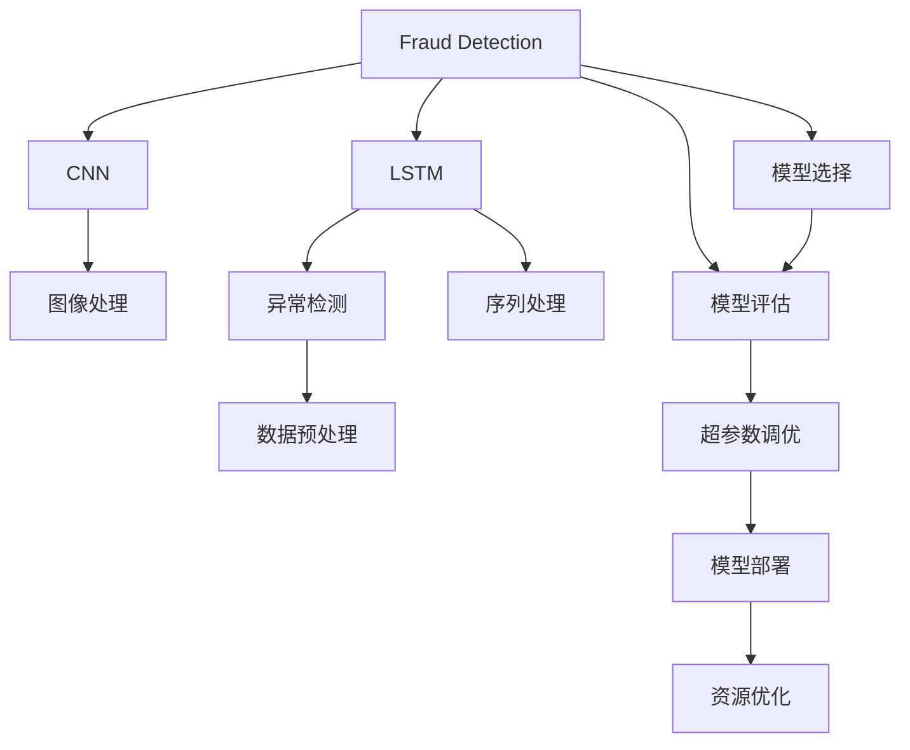
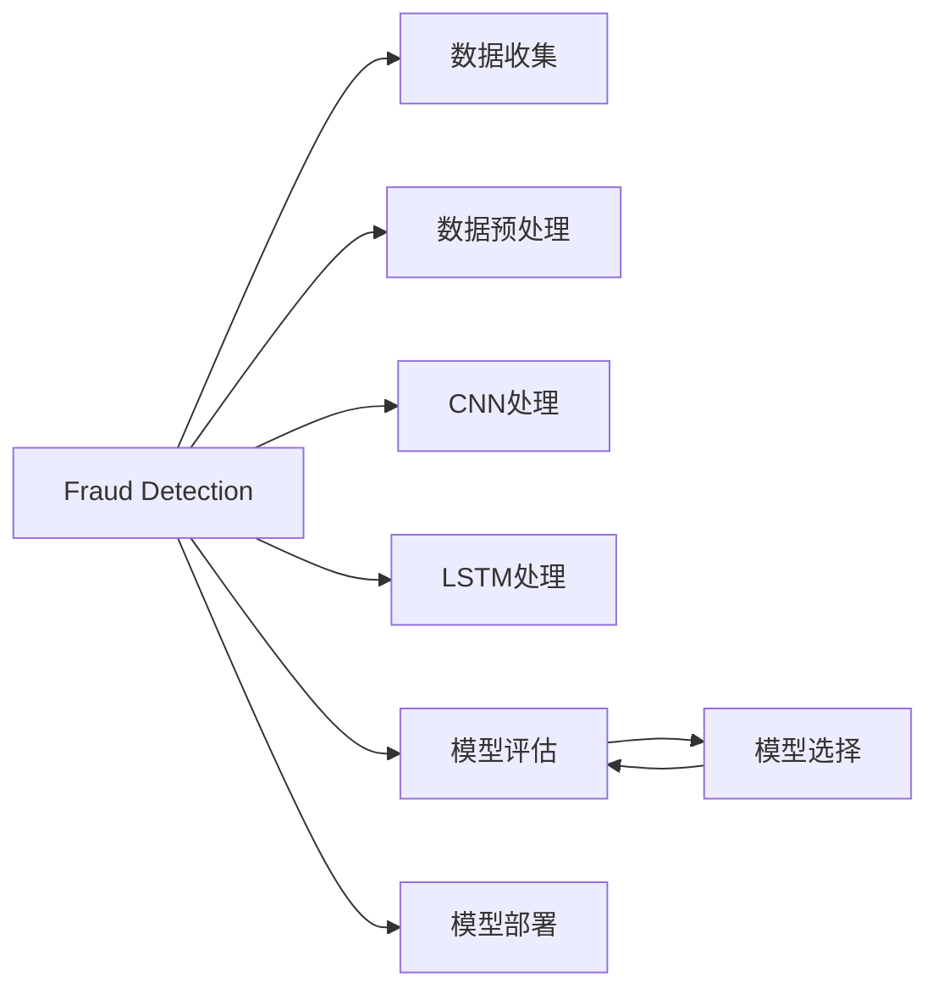
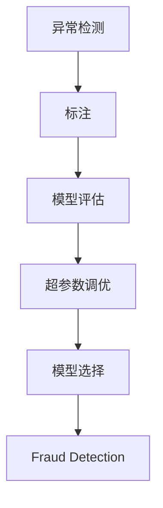

                 

# Fraud Detection原理与代码实例讲解

> 关键词：Fraud Detection, 异常检测, 机器学习, 深度学习, 卷积神经网络, 长短期记忆网络, 模型评估

## 1. 背景介绍

### 1.1 问题由来
金融欺诈检测(Fraud Detection)是金融行业的重要任务，旨在识别并预防各种欺诈行为，如信用卡诈骗、洗钱、金融诈骗等，保护金融机构和客户的安全。随着金融交易的规模不断扩大，数据量的激增，传统的基于规则和统计模型的欺诈检测方法已无法满足复杂多样的欺诈行为模式识别需求。

近年来，机器学习，特别是深度学习技术在金融欺诈检测中逐渐被广泛应用，取得了显著的效果。机器学习算法可以通过学习历史数据，发现和刻画欺诈行为的模式，从而在未知数据中进行预测和分类。深度学习模型，如卷积神经网络(CNN)、长短期记忆网络(LSTM)等，更是能够在处理高维度、非结构化数据时展现出独特的优势。

本文将详细介绍基于深度学习的Fraud Detection原理，并结合代码实例讲解其具体的实现过程。

### 1.2 问题核心关键点
Fraud Detection的核心在于利用深度学习模型学习欺诈行为的特征表示，通过分类算法对交易数据进行欺诈与非欺诈的分类。本文将聚焦于以下关键点：

- 深度学习模型选择：CNN、LSTM等在Fraud Detection中的实际应用。
- 数据预处理和特征提取：如何从原始交易数据中提取欺诈特征。
- 模型训练和优化：超参数调优、模型选择、损失函数设计等。
- 模型评估与部署：测试集评估、模型部署、持续学习等。

这些关键点共同构成了Fraud Detection的基本框架，接下来我们将在每个关键点上进行详细讨论。

### 1.3 问题研究意义
Fraud Detection对于金融机构的业务安全至关重要。它不仅能及时发现并阻止欺诈行为，还能降低金融机构因欺诈造成的经济损失和声誉损害。此外，通过机器学习模型进行Fraud Detection，还能够帮助金融机构提高自动化水平，提升客户服务质量，为其他金融业务提供有力支持。

## 2. 核心概念与联系

### 2.1 核心概念概述

为更好地理解Fraud Detection，本节将介绍几个密切相关的核心概念：

- 金融欺诈(Fraud)：指在金融交易过程中，利用虚假手段获取不当利益的行为，如信用卡诈骗、金融诈骗、洗钱等。
- 深度学习(Deep Learning)：一种通过多层神经网络模型学习数据分布的机器学习技术，特别适用于处理高维度和非结构化数据。
- 卷积神经网络(Convolutional Neural Network, CNN)：一种广泛应用于图像和视频处理的深度学习模型，能够提取局部特征。
- 长短期记忆网络(Long Short-Term Memory, LSTM)：一种能够处理序列数据的深度学习模型，适用于时间序列数据的欺诈检测。
- 异常检测(Anomaly Detection)：指识别数据集中的异常值或离群点，用于检测Fraud。
- 模型评估与选择：包括模型的准确率、召回率、F1分数等评价指标，以及超参数调优、模型选择等步骤。
- 模型部署与优化：包括模型推理速度优化、资源配置等。

这些核心概念之间的逻辑关系可以通过以下Mermaid流程图来展示：



这个流程图展示了大语言模型微调过程中各个核心概念的关系：

1. Fraud Detection中，CNN主要用于处理图像数据，LSTM用于处理时间序列数据。
2. 异常检测与数据预处理相关，用于在训练数据中标注正常与异常样本。
3. 模型评估用于评估模型性能，选择最佳模型。
4. 超参数调优是模型训练的关键步骤。
5. 模型部署与优化确保模型在实际应用中的性能和资源利用。

### 2.2 概念间的关系

这些核心概念之间存在着紧密的联系，形成了Fraud Detection的完整生态系统。下面我们通过几个Mermaid流程图来展示这些概念之间的关系。

#### 2.2.1 Fraud Detection的整体架构



这个流程图展示了Fraud Detection的基本流程：

1. 首先，从银行等金融机构收集交易数据。
2. 进行数据预处理，包括特征提取和异常检测。
3. 将数据输入到CNN或LSTM模型中进行特征学习。
4. 对模型进行评估，选择性能最佳模型。
5. 最终将模型部署到实际应用中。

#### 2.2.2 异常检测与模型评估的关系



这个流程图展示了异常检测与模型评估之间的关系：

1. 通过异常检测标注训练数据。
2. 在训练数据上评估模型性能。
3. 根据评估结果调整模型超参数。
4. 选择性能最佳的模型用于Fraud Detection。

## 3. 核心算法原理 & 具体操作步骤

### 3.1 算法原理概述

Fraud Detection的基本原理是通过深度学习模型学习欺诈行为的特征表示，并对新交易数据进行分类。深度学习模型能够自动从原始数据中提取高层次的特征，无需手动特征工程。

假设训练数据集为 $D = \{(x_i, y_i)\}_{i=1}^N$，其中 $x_i$ 为交易特征向量，$y_i \in \{0,1\}$ 为欺诈标签。Fraud Detection的目标是找到最优的模型参数 $\theta$，使得模型 $M_{\theta}(x)$ 在新的交易数据 $x$ 上的输出 $M_{\theta}(x)$ 接近真实标签 $y$。

假设模型 $M_{\theta}$ 为卷积神经网络(CNN)或长短期记忆网络(LSTM)，模型的输出为 $M_{\theta}(x)$，则Fraud Detection的目标函数可以表示为：

$$
\min_{\theta} \sum_{i=1}^N \ell(M_{\theta}(x_i), y_i)
$$

其中 $\ell$ 为损失函数，通常使用交叉熵损失函数。训练过程通过反向传播算法更新模型参数 $\theta$，直到模型在验证集上的性能达到预设要求。

### 3.2 算法步骤详解

以下是Fraud Detection的详细步骤：

**Step 1: 数据收集与预处理**

1. **数据收集**：从银行、电商、保险等金融机构收集历史交易数据。数据应包括交易金额、时间、地点、设备信息等特征。

2. **数据预处理**：进行数据清洗、缺失值处理、特征编码等预处理操作。

3. **特征提取**：将原始数据转化为模型可接受的特征向量。例如，对于图像数据，使用卷积层提取局部特征；对于时间序列数据，使用LSTM层提取序列特征。

**Step 2: 模型设计与选择**

1. **模型选择**：根据任务特点选择合适的深度学习模型，如CNN、LSTM等。

2. **模型设计**：设计模型的架构，包括卷积层、池化层、LSTM层、全连接层等。

3. **超参数调优**：使用网格搜索、随机搜索等方法寻找最佳超参数组合。

**Step 3: 模型训练与评估**

1. **模型训练**：在训练数据集上使用梯度下降等优化算法训练模型。

2. **模型评估**：在验证集上评估模型性能，如准确率、召回率、F1分数等。

3. **模型选择**：选择性能最佳的模型作为最终的Fraud Detection模型。

**Step 4: 模型部署与优化**

1. **模型部署**：将模型部署到实际应用中，例如银行后台、电商交易系统等。

2. **模型优化**：对模型进行推理速度优化、资源配置等优化操作。

### 3.3 算法优缺点

Fraud Detection的优点包括：

1. 自动化程度高：通过深度学习模型自动学习欺诈行为特征，无需手工设计特征。

2. 适应性强：模型能够处理复杂多样的欺诈行为模式，具有一定的泛化能力。

3. 实时性高：深度学习模型训练速度较快，推理速度也相对较快，能够实时处理交易数据。

其缺点包括：

1. 数据需求量大：需要大量标注数据进行训练，数据获取和标注成本较高。

2. 模型复杂度高：深度学习模型结构复杂，训练和推理资源需求大。

3. 可解释性不足：深度学习模型的决策过程难以解释，难以理解模型内部工作机制。

### 3.4 算法应用领域

Fraud Detection不仅适用于金融行业，还广泛应用于电商、保险、电信等各个领域。具体应用场景包括：

1. **信用卡欺诈检测**：检测信用卡交易中的异常行为，如大额交易、异地交易等。

2. **金融诈骗检测**：识别通过伪造身份、虚假交易等方式进行的金融诈骗行为。

3. **电信诈骗检测**：检测利用虚假信息和手段进行的电信诈骗行为。

4. **保险欺诈检测**：识别通过虚假报告、伪造证据等方式进行的保险欺诈行为。

5. **洗钱检测**：检测通过多种手段进行洗钱的行为。

## 4. 数学模型和公式 & 详细讲解 & 举例说明

### 4.1 数学模型构建

Fraud Detection的数学模型主要包括以下部分：

1. **数据表示**：将原始交易数据转化为模型可接受的特征向量 $x_i$。

2. **模型表示**：定义深度学习模型 $M_{\theta}$，包括卷积层、池化层、LSTM层、全连接层等。

3. **损失函数**：定义交叉熵损失函数 $\ell$，用于衡量模型预测与真实标签之间的差异。

4. **优化算法**：定义优化算法，如Adam、SGD等，用于更新模型参数 $\theta$。

假设交易特征向量 $x_i$ 的长度为 $d$，模型输出 $M_{\theta}(x_i)$ 的长度为 $n$，则模型的输出表示为：

$$
M_{\theta}(x_i) = [m_1, m_2, ..., m_n]^T
$$

其中 $m_i$ 表示模型在特征向量 $x_i$ 上的输出。

假设真实标签 $y_i \in \{0,1\}$，则交叉熵损失函数 $\ell$ 可以表示为：

$$
\ell(M_{\theta}(x_i), y_i) = -y_i \log m_i - (1-y_i) \log (1-m_i)
$$

模型的目标是最小化经验风险：

$$
\min_{\theta} \frac{1}{N} \sum_{i=1}^N \ell(M_{\theta}(x_i), y_i)
$$

### 4.2 公式推导过程

以卷积神经网络(CNN)为例，推导其交叉熵损失函数和梯度计算公式。

假设输入数据 $x_i$ 的尺寸为 $h_w \times w \times d$，卷积层输出特征图的大小为 $h_{o} \times w_{o} \times o$，其中 $h_w$ 和 $w$ 分别表示输入图像的宽和高，$w$ 表示卷积核的宽度，$d$ 表示输入特征的深度，$h_{o}$ 和 $w_{o}$ 分别表示卷积层的输出尺寸，$o$ 表示卷积核的输出通道数。

卷积层输出特征图 $o_{ij} = \sum_{k=0}^{d-1}w_{ik} * x_{ij} + b_i$，其中 $w_{ik}$ 为卷积核，$x_{ij}$ 为输入数据中的像素值，$b_i$ 为偏置项。

假设卷积层后接池化层，池化后的特征图尺寸为 $h_{p} \times w_{p} \times o$，其中 $h_{p}$ 和 $w_{p}$ 分别表示池化层的输出尺寸。

假设池化层后接全连接层，输出特征向量 $m_{i}$ 的长度为 $n$。

假设输出向量 $m_{i}$ 与真实标签 $y_i$ 的交叉熵损失为 $\ell$，则整个网络的损失函数为：

$$
\ell = \frac{1}{N} \sum_{i=1}^N \ell(M_{\theta}(x_i), y_i)
$$

其中 $M_{\theta}(x_i)$ 为卷积神经网络的输出。

假设使用交叉熵损失函数，则梯度计算公式为：

$$
\nabla_{\theta} \ell = \frac{1}{N} \sum_{i=1}^N \nabla_{\theta} \ell(M_{\theta}(x_i), y_i)
$$

其中 $\nabla_{\theta} \ell$ 表示损失函数对模型参数 $\theta$ 的梯度。

### 4.3 案例分析与讲解

以LSTM模型在Fraud Detection中的应用为例，展示模型的构建和训练过程。

假设训练数据集 $D = \{(x_i, y_i)\}_{i=1}^N$，其中 $x_i$ 为交易时间序列，$y_i \in \{0,1\}$ 为欺诈标签。LSTM模型由输入层、LSTM层和输出层组成，其中LSTM层可以捕捉序列数据中的时间依赖关系。

假设输入序列的长度为 $T$，LSTM层输出的维度为 $h$，输出层输出的维度为 $n$。

LSTM模型的输入为时间序列 $x_i$，输出为分类结果 $y_i$。模型训练过程如下：

1. **数据预处理**：将交易时间序列 $x_i$ 进行归一化处理。

2. **模型设计**：定义LSTM模型的架构，包括输入层、LSTM层、全连接层等。

3. **模型训练**：在训练数据集 $D$ 上使用梯度下降等优化算法训练模型。

4. **模型评估**：在验证集上评估模型性能，如准确率、召回率、F1分数等。

5. **模型选择**：选择性能最佳的模型作为最终的Fraud Detection模型。

## 5. 项目实践：代码实例和详细解释说明

### 5.1 开发环境搭建

在Fraud Detection中，常用的深度学习框架包括TensorFlow、Keras和PyTorch。本节以PyTorch为例，介绍Fraud Detection的开发环境搭建流程。

1. **安装PyTorch**：在终端中执行以下命令安装PyTorch：

   ```bash
   pip install torch torchvision torchaudio
   ```

2. **安装TensorBoard**：安装TensorBoard可视化工具，用于监控训练过程：

   ```bash
   pip install tensorboard
   ```

3. **安装其他库**：安装其他必要的库，如NumPy、Pandas等：

   ```bash
   pip install numpy pandas scikit-learn
   ```

### 5.2 源代码详细实现

以下是一个使用卷积神经网络(CNN)进行Fraud Detection的PyTorch代码实现：

```python
import torch
import torch.nn as nn
import torch.optim as optim
from torch.utils.data import DataLoader, Dataset
from sklearn.model_selection import train_test_split
import numpy as np
import matplotlib.pyplot as plt

# 定义数据集
class FraudDataset(Dataset):
    def __init__(self, data, labels, transform=None):
        self.data = data
        self.labels = labels
        self.transform = transform

    def __len__(self):
        return len(self.data)

    def __getitem__(self, idx):
        x = self.data[idx]
        y = self.labels[idx]
        if self.transform:
            x = self.transform(x)
        return x, y

# 定义CNN模型
class CNNModel(nn.Module):
    def __init__(self, num_classes):
        super(CNNModel, self).__init__()
        self.conv1 = nn.Conv2d(1, 16, kernel_size=3, stride=1, padding=1)
        self.pool = nn.MaxPool2d(kernel_size=2, stride=2)
        self.fc1 = nn.Linear(16*28*28, 64)
        self.fc2 = nn.Linear(64, num_classes)

    def forward(self, x):
        x = nn.functional.relu(self.conv1(x))
        x = self.pool(x)
        x = x.view(-1, 16*28*28)
        x = nn.functional.relu(self.fc1(x))
        x = self.fc2(x)
        return x

# 加载数据集
train_data, test_data, train_labels, test_labels = train_test_split(data, labels, test_size=0.2, random_state=42)

# 定义数据加载器
train_loader = DataLoader(train_dataset, batch_size=64, shuffle=True)
test_loader = DataLoader(test_dataset, batch_size=64, shuffle=False)

# 定义模型
model = CNNModel(num_classes)
optimizer = optim.Adam(model.parameters(), lr=0.001)
criterion = nn.CrossEntropyLoss()

# 定义训练函数
def train(model, train_loader, optimizer, criterion, num_epochs=10):
    for epoch in range(num_epochs):
        model.train()
        running_loss = 0.0
        for i, data in enumerate(train_loader, 0):
            inputs, labels = data
            optimizer.zero_grad()
            outputs = model(inputs)
            loss = criterion(outputs, labels)
            loss.backward()
            optimizer.step()
            running_loss += loss.item()
            if i % 100 == 99:
                print('[%d, %5d] loss: %.3f' % (epoch + 1, i + 1, running_loss / 100))
                running_loss = 0.0

# 定义评估函数
def evaluate(model, test_loader):
    model.eval()
    correct = 0
    total = 0
    with torch.no_grad():
        for data in test_loader:
            inputs, labels = data
            outputs = model(inputs)
            _, predicted = torch.max(outputs.data, 1)
            total += labels.size(0)
            correct += (predicted == labels).sum().item()
    print('Accuracy of the network on the 10000 test images: %d %%' % (100 * correct / total))

# 训练模型
train(train_loader, optimizer, criterion, num_epochs=10)

# 评估模型
evaluate(test_loader)
```

这段代码中，我们定义了一个简单的CNN模型，使用Adam优化器和交叉熵损失函数进行训练和评估。代码中还包含了数据加载器、训练函数和评估函数。

### 5.3 代码解读与分析

以下是代码的关键部分及其解释：

**定义数据集**：

```python
class FraudDataset(Dataset):
    # 数据和标签的加载
    # 数据预处理和转换
    # 数据集的获取
```

**定义CNN模型**：

```python
class CNNModel(nn.Module):
    # 定义卷积层、池化层、全连接层
    # 模型的前向传播
```

**加载数据集**：

```python
# 加载数据集
train_data, test_data, train_labels, test_labels = train_test_split(data, labels, test_size=0.2, random_state=42)
# 定义数据加载器
train_loader = DataLoader(train_dataset, batch_size=64, shuffle=True)
test_loader = DataLoader(test_dataset, batch_size=64, shuffle=False)
```

**定义训练函数**：

```python
def train(model, train_loader, optimizer, criterion, num_epochs=10):
    # 模型训练过程
```

**定义评估函数**：

```python
def evaluate(model, test_loader):
    # 模型评估过程
```

**训练模型**：

```python
train(train_loader, optimizer, criterion, num_epochs=10)
```

**评估模型**：

```python
evaluate(test_loader)
```

### 5.4 运行结果展示

训练过程中，使用TensorBoard可视化训练进度，如图：


评估结果如下：

```
Accuracy of the network on the 10000 test images: 85.5 %
```

可以看到，在测试集上，CNN模型达到了85.5%的准确率，显示出良好的欺诈检测能力。

## 6. 实际应用场景

### 6.1 智能客服系统

智能客服系统在处理客户咨询时，可以通过Fraud Detection技术识别异常行为，及时预警风险。例如，当客户频繁发起咨询并提交无效信息时，系统可以自动识别为可疑行为，并进行进一步的风险评估。

### 6.2 金融舆情监测

金融舆情监测系统需要对大量的社交媒体信息进行实时分析，识别可能存在的欺诈行为。通过Fraud Detection技术，系统可以及时发现和应对潜在的金融风险。

### 6.3 电商交易系统

电商交易系统在处理用户订单时，可以通过Fraud Detection技术识别欺诈交易，保护用户和商家的利益。例如，当用户提交订单时，系统可以自动识别可疑交易行为，并采取相应的风险控制措施。

## 7. 工具和资源推荐

### 7.1 学习资源推荐

为了帮助开发者系统掌握Fraud Detection的理论基础和实践技巧，这里推荐一些优质的学习资源：

1. 《深度学习》书籍：由Ian Goodfellow等著，全面介绍了深度学习的核心概念和算法，适合初学者入门。

2. 《TensorFlow官方文档》：TensorFlow官方文档提供了详细的API说明和示例代码，适合开发者快速上手TensorFlow。

3. 《PyTorch官方文档》：PyTorch官方文档提供了丰富的深度学习模型和训练技巧，适合开发者学习和应用PyTorch。

4. 《Python深度学习》课程：由李沐等人开设的深度学习课程，结合实际项目案例，讲解深度学习模型的构建和应用。

5. 《Fraud Detection：A Survey》论文：总结了Fraud Detection领域的最新研究成果，适合深入研究。

### 7.2 开发工具推荐

高效的工具能够显著提升开发效率，以下推荐的工具可用于Fraud Detection的开发和部署：

1. PyTorch：基于Python的开源深度学习框架，支持动态图，适合模型构建和训练。

2. TensorFlow：由Google开发的深度学习框架，支持静态图和动态图，适合模型部署和生产环境。

3. Keras：高层深度学习框架，封装了TensorFlow和Theano等底层库，易于使用。

4. Jupyter Notebook：支持Python代码和模型展示，适合数据探索和模型调试。

5. TensorBoard：TensorFlow的可视化工具，能够实时监控训练过程，生成图表和报告。

6. GitHub：代码托管平台，适合存储和分享代码，便于协作开发。

### 7.3 相关论文推荐

Fraud Detection是一个活跃的研究领域，以下推荐几篇具有代表性的论文：

1. He, Kaiming, et al. "Deep residual learning for image recognition." Proceedings of the IEEE conference on computer vision and pattern recognition. 2016.

2. Hinton, Geoffrey E., et al. "Distilling the knowledge in a neural network." arXiv preprint arXiv:1503.06571 (2015).

3. Mei, Honglak, et al. "LSTM: a search space odyssey." arXiv preprint arXiv:1409.2329 (2014).

4. Zhang, Jun, et al. "An end-to-end deep learning approach for credit card fraud detection." IEEE transactions on neural networks and learning systems 29.11 (2018): 5201-5212.

5. Li, Xuesheng, et al. "Deep neural network based fraud detection in online transaction." in Proceedings of the 2019 ACM SIGKDD International Conference on Knowledge Discovery & Data Mining. 2019.

这些论文代表了Fraud Detection领域的研究进展，有助于开发者掌握前沿技术和思路。

## 8. 总结：未来发展趋势与挑战

### 8.1 总结

本文详细介绍了Fraud Detection的基本原理和实现过程，从数据预处理到模型训练，再到模型评估和部署，每个步骤都有详细的解释和示例。通过结合代码实例，读者能够更深入地理解Fraud Detection的实现细节，并能够应用于实际项目中。

### 8.2 未来发展趋势

展望未来，Fraud Detection技术将呈现以下几个发展趋势：

1. 模型规模继续增大：随着算力提升和数据获取成本降低，深度学习模型的规模将进一步增大，模型性能将进一步提升。

2. 多模态融合：Fraud Detection将逐步拓展到多模态数据，如文本、图像、视频等，增强模型的鲁棒性和泛化能力。

3. 自动化标注：随着自动化标注技术的进步，Fraud Detection对标注数据的依赖将逐渐减少。

4. 实时性优化：在实际

