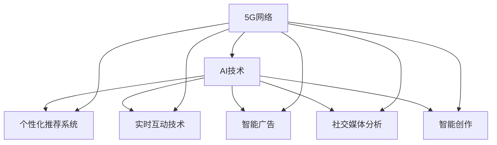
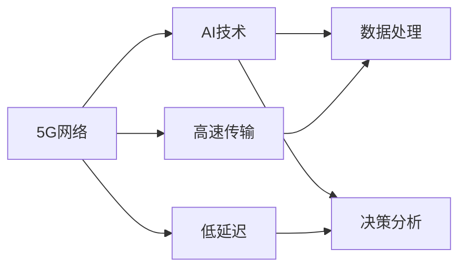
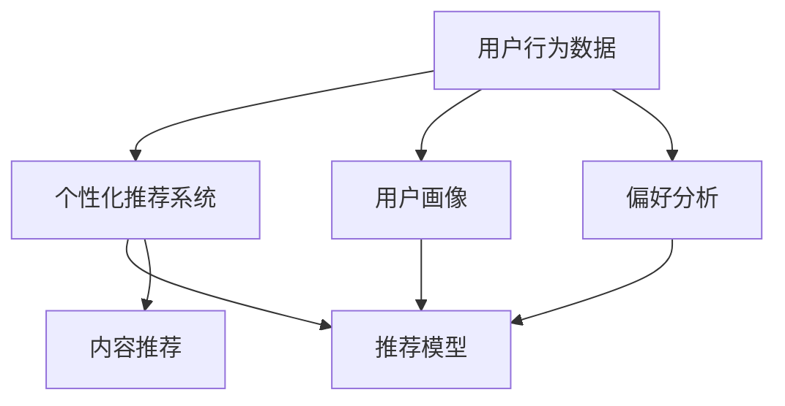
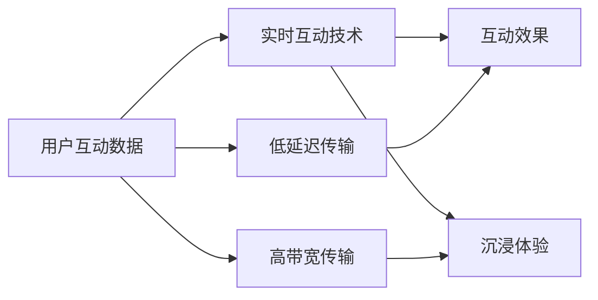

                 

## 1. 背景介绍

### 1.1 问题由来
随着5G网络的普及和AI技术的进步，全球正逐步进入一个以注意力为核心的经济新纪元。5G的高速低延迟，以及AI强大的处理能力，使得海量信息能够更快速、更准确地传递和分析，从而引爆了注意力经济的巨大潜力。无论是社交媒体、电子商务、在线教育、内容创作等诸多领域，都展现出对AI和5G的巨大需求。

### 1.2 问题核心关键点
注意力经济的核心在于如何高效地吸引和利用用户注意力，提升用户参与度和满意度，最终实现商业价值。AI和5G技术的应用，通过精准定位、个性化推荐、实时互动等手段，可以显著提升用户体验，吸引更多用户注意力，创造更多商业机会。

### 1.3 问题研究意义
研究5G+AI在注意力经济中的应用，对于探索新经济形态、提升产业数字化转型、推动技术创新具有重要意义：

1. **技术融合创新**：AI和5G技术的深度融合，带来新的技术突破和应用场景，推动创新性业务的诞生。
2. **用户体验提升**：通过精准分析和个性化推荐，提升用户满意度和粘性，打造更优质的产品和服务。
3. **商业价值放大**：用户注意力的精准利用，使得广告、推荐等业务效果更佳，商业价值倍增。
4. **经济模式变革**：从以产品为中心转向以用户体验为中心，带动整个商业模式的重塑。
5. **社会效益增强**：提升信息获取和传播效率，增进社会信息透明度，促进社会公正和公平。

## 2. 核心概念与联系

### 2.1 核心概念概述

为更好地理解5G+AI在注意力经济中的应用，本节将介绍几个密切相关的核心概念：

- **5G网络**：下一代无线通信技术，提供超高带宽、低延迟、高可靠性的网络环境。
- **AI技术**：包括机器学习、深度学习、强化学习等，能够处理海量数据，提供智能分析和服务。
- **注意力经济**：通过精准获取和利用用户注意力，创造商业价值的新经济模式。
- **个性化推荐系统**：利用AI技术，对用户行为和偏好进行精准分析，实现个性化内容推荐。
- **实时互动技术**：包括直播、AR/VR等技术，提供即时交互和沉浸式体验。
- **智能广告**：通过AI和5G技术，实现精准定位和实时反馈，提升广告投放效果。
- **社交媒体分析**：利用AI技术，对社交媒体数据进行深度分析和挖掘，洞察用户行为和市场趋势。
- **智能创作**：AI技术在内容创作中的应用，如自动生成文章、音乐、视频等，提升内容生产效率和质量。

这些核心概念之间的逻辑关系可以通过以下Mermaid流程图来展示：



这个流程图展示了大语言模型微调过程中各个核心概念的关系和作用。

### 2.2 概念间的关系

这些核心概念之间存在着紧密的联系，形成了5G+AI在注意力经济中的应用框架。下面我通过几个Mermaid流程图来展示这些概念之间的关系。

#### 2.2.1 5G网络与AI技术的关系



这个流程图展示了5G网络对AI技术的基础支撑作用，高速传输和低延迟使得AI模型能够更高效地处理和分析数据，提供实时决策和智能服务。

#### 2.2.2 个性化推荐系统与AI技术的关系



这个流程图展示了个性化推荐系统利用AI技术对用户行为进行深入分析，构建用户画像，并提供个性化的内容推荐。

#### 2.2.3 实时互动技术与5G网络的关系



这个流程图展示了实时互动技术依赖5G网络的高速和低延迟特性，实现高品质的实时互动和沉浸式体验。

### 2.3 核心概念的整体架构

最后，我们用一个综合的流程图来展示这些核心概念在大语言模型微调过程中的整体架构：


这个综合流程图展示了从5G网络到AI技术的整个信息流，以及它们在个性化推荐、实时互动、智能广告、社交媒体分析、智能创作等各个环节中的应用。

## 3. 核心算法原理 & 具体操作步骤

### 3.1 算法原理概述

5G+AI在注意力经济中的应用，核心在于通过AI技术对海量数据进行深度分析和处理，利用5G网络提供的高速和低延迟特性，实现对用户注意力的精准定位和高效利用。

具体来说，5G+AI的注意力经济可以分解为以下几个核心算法：

1. **个性化推荐算法**：利用用户历史行为数据和上下文信息，构建用户画像，实现个性化内容推荐。
2. **实时互动算法**：通过AI和5G技术，实现与用户的即时互动和沉浸式体验。
3. **智能广告算法**：利用用户画像和行为数据，实现精准定位和实时反馈，提升广告投放效果。
4. **社交媒体分析算法**：对社交媒体数据进行深度挖掘和分析，洞察用户行为和市场趋势。
5. **智能创作算法**：利用AI技术，自动生成高质量的内容，提升内容生产效率和质量。

这些算法共同构成了5G+AI在注意力经济中的技术生态系统。通过精确的数据分析和实时交互，显著提升了用户满意度和商业价值。

### 3.2 算法步骤详解

下面是这些算法的详细步骤详解：

#### 3.2.1 个性化推荐算法

1. **数据收集**：从用户行为日志、点击记录、搜索历史、社交网络等渠道收集用户数据。
2. **特征提取**：对用户行为数据进行特征提取，构建用户画像。例如，提取用户兴趣、历史行为、设备属性等特征。
3. **模型训练**：利用深度学习模型（如CNN、RNN、GRU、LSTM等）对用户画像进行训练，构建个性化推荐模型。
4. **内容推荐**：将用户画像输入到推荐模型中，获取个性化内容推荐列表。
5. **实时更新**：利用5G网络实时更新用户数据，动态调整推荐列表。

#### 3.2.2 实时互动算法

1. **互动设备准备**：准备AR/VR设备、实时传感器等，获取用户的实时互动数据。
2. **数据传输**：利用5G网络传输互动数据，实现低延迟、高带宽的实时传输。
3. **互动分析**：利用AI技术对互动数据进行分析，实时调整互动策略。
4. **互动反馈**：根据用户的互动反馈，动态调整互动内容和形式。

#### 3.2.3 智能广告算法

1. **数据收集**：收集用户画像、行为数据、设备属性等广告投放所需信息。
2. **目标人群定位**：利用机器学习算法（如协同过滤、聚类算法等）对目标人群进行精准定位。
3. **广告生成**：利用生成对抗网络（GAN）、变分自编码器（VAE）等生成模型，自动生成高质量的广告内容。
4. **投放优化**：利用强化学习算法（如Q-learning、SARSA等）优化广告投放策略，提高广告效果。
5. **实时反馈**：利用5G网络实现广告投放的实时反馈和调整。

#### 3.2.4 社交媒体分析算法

1. **数据收集**：从社交媒体平台收集用户互动数据，包括评论、点赞、分享、标签等信息。
2. **数据预处理**：对数据进行清洗、去重、分词、情感分析等预处理操作。
3. **模型训练**：利用深度学习模型（如CNN、RNN、GRU、LSTM等）对社交媒体数据进行训练，构建用户行为预测模型。
4. **趋势分析**：利用模型对用户行为趋势进行预测和分析，洞察市场和用户需求。
5. **策略优化**：根据趋势分析结果，优化社交媒体策略，提升用户参与度和品牌曝光度。

#### 3.2.5 智能创作算法

1. **内容采集**：从用户上传的素材、已有数据集中收集内容数据。
2. **数据预处理**：对内容数据进行清洗、去重、分词、情感分析等预处理操作。
3. **模型训练**：利用深度学习模型（如GAN、VAE、BERT等）对内容数据进行训练，构建智能创作模型。
4. **内容生成**：利用模型自动生成高质量的内容，如文章、音乐、视频等。
5. **质量评估**：对生成内容进行质量评估和人工审核，确保内容符合用户需求和平台标准。

### 3.3 算法优缺点

5G+AI在注意力经济中的应用，具有以下优点：

1. **高效性**：5G网络提供的高速和低延迟特性，使得AI模型能够更高效地处理和分析数据，实现实时互动和精准推荐。
2. **精准性**：利用AI技术对用户行为进行深度分析，实现个性化的推荐和互动，提升用户满意度和粘性。
3. **实时性**：通过5G网络实现实时数据传输和处理，使得推荐和互动策略可以动态调整，提升用户体验。
4. **灵活性**：利用AI技术生成高质量内容，提升内容生产效率和质量，满足用户多样化需求。

然而，5G+AI在注意力经济中的应用也存在一些缺点：

1. **数据隐私**：用户行为数据的收集和使用，涉及隐私保护问题，需要严格的数据安全措施。
2. **计算资源**：高精度AI模型和实时处理需要大量的计算资源，成本较高。
3. **模型复杂度**：AI模型设计复杂，训练和部署过程较繁琐，需要专业的技术团队支持。
4. **用户适应性**：部分用户对AI和5G技术的接受度较低，需要持续优化用户体验。

### 3.4 算法应用领域

5G+AI在注意力经济中的应用，已经覆盖了多个领域：

- **社交媒体**：通过实时互动和内容推荐，提升用户参与度和品牌曝光度。
- **电子商务**：利用个性化推荐和智能广告，提升用户购物体验和转化率。
- **在线教育**：通过智能创作和实时互动，提升教学效果和学习体验。
- **医疗健康**：利用AI技术和5G网络，提供远程医疗和智能诊断服务。
- **智能制造**：通过实时监控和预测分析，优化生产流程和设备维护。
- **智慧城市**：通过智能交通、智能安防、智能环保等应用，提升城市管理水平。

## 4. 数学模型和公式 & 详细讲解 & 举例说明

### 4.1 数学模型构建

本节将通过数学模型对5G+AI在注意力经济中的应用进行详细讲解。

假设用户数据集为 $D=\{(x_i,y_i)\}_{i=1}^N$，其中 $x_i$ 为用户行为数据，$y_i$ 为标签或目标值。我们的目标是构建一个预测模型 $f(x)$，使得 $f(x)$ 能够预测出 $y$ 的值。

基于监督学习的预测模型可以表示为：

$$ f(x) = w_1x_1 + w_2x_2 + ... + w_dx_d + b $$

其中 $w_1, w_2, ..., w_d$ 为模型参数，$b$ 为偏置项。

### 4.2 公式推导过程

接下来，我们将详细推导预测模型的损失函数和优化算法。

预测模型的损失函数可以表示为：

$$ L = \frac{1}{N} \sum_{i=1}^N L(f(x_i),y_i) $$

其中 $L$ 为损失函数，$L(f(x_i),y_i)$ 为单个样本的损失，常见的损失函数包括均方误差损失（MSE）、交叉熵损失（CE）等。

以均方误差损失为例，单个样本的损失可以表示为：

$$ L(f(x_i),y_i) = \frac{1}{2}(f(x_i)-y_i)^2 $$

整个数据集的损失函数可以表示为：

$$ L = \frac{1}{2N} \sum_{i=1}^N (f(x_i)-y_i)^2 $$

基于梯度下降算法，模型参数的更新公式为：

$$ w_k \leftarrow w_k - \eta \frac{\partial L}{\partial w_k} $$

其中 $\eta$ 为学习率，$\frac{\partial L}{\partial w_k}$ 为损失函数对参数 $w_k$ 的梯度。

### 4.3 案例分析与讲解

我们以社交媒体分析算法为例，详细讲解5G+AI在注意力经济中的应用。

假设我们要对用户评论数据进行分析，预测用户对某品牌的好评率。数据集 $D=\{(x_i,y_i)\}_{i=1}^N$，其中 $x_i$ 为评论文本，$y_i$ 为好评率（0或1）。

我们利用深度学习模型（如BERT、RNN等）对评论文本进行特征提取，得到一个向量表示 $x_i'$。然后，我们将 $x_i'$ 输入到一个分类器（如Logistic回归、SVM等）中进行预测，得到预测结果 $\hat{y_i}$。

通过比较预测结果 $\hat{y_i}$ 和真实标签 $y_i$，计算损失函数，利用梯度下降算法更新模型参数，不断迭代优化模型。

最终，我们可以通过5G网络实时传输社交媒体数据，对模型进行动态更新和优化，实现实时分析预测。

## 5. 项目实践：代码实例和详细解释说明

### 5.1 开发环境搭建

在进行5G+AI项目实践前，我们需要准备好开发环境。以下是使用Python进行PyTorch和TensorFlow开发的完整环境配置流程：

1. 安装Anaconda：从官网下载并安装Anaconda，用于创建独立的Python环境。

2. 创建并激活虚拟环境：
```bash
conda create -n pytorch-env python=3.8 
conda activate pytorch-env
```

3. 安装PyTorch：根据CUDA版本，从官网获取对应的安装命令。例如：
```bash
conda install pytorch torchvision torchaudio cudatoolkit=11.1 -c pytorch -c conda-forge
```

4. 安装TensorFlow：
```bash
conda install tensorflow -c conda-forge
```

5. 安装各类工具包：
```bash
pip install numpy pandas scikit-learn matplotlib tqdm jupyter notebook ipython
```

完成上述步骤后，即可在`pytorch-env`环境中开始项目实践。

### 5.2 源代码详细实现

这里我们以社交媒体分析为例，给出使用PyTorch进行文本分类任务开发的完整代码实现。

首先，定义数据处理函数：

```python
import torch
import torch.nn as nn
import torch.optim as optim
from torchtext.data import Field, LabelField, TabularDataset, BucketIterator
from torchtext.vocab import GloVe, StaticVocab

# 定义标签和文本字段
TEXT = Field(tokenize='spacy', lower=True)
LABEL = LabelField(unk_token=None, use_vocab=False)

# 加载数据集
train_data, test_data = TabularDataset.splits(path='path/to/data', train='train.csv', test='test.csv', format='csv', fields=[('text', TEXT), ('label', LABEL)])

# 构建词汇表
TEXT.build_vocab(train_data, max_size=10000, vectors='glove.6B.100d')
LABEL.build_vocab(train_data)

# 创建数据迭代器
train_iterator, test_iterator = BucketIterator.splits((train_data, test_data), batch_size=32, device='cuda')
```

然后，定义模型和优化器：

```python
from transformers import BertForSequenceClassification

# 加载预训练模型
model = BertForSequenceClassification.from_pretrained('bert-base-cased', num_labels=2)

# 定义优化器
optimizer = optim.Adam(model.parameters(), lr=0.001)
```

接着，定义训练和评估函数：

```python
from torch.utils.data import DataLoader
from tqdm import tqdm

# 定义训练函数
def train_epoch(model, iterator, optimizer):
    model.train()
    epoch_loss = 0
    for batch in tqdm(iterator, desc='Training'):
        optimizer.zero_grad()
        predictions = model(batch.text)
        loss = nn.BCEWithLogitsLoss()(predictions, batch.label)
        loss.backward()
        optimizer.step()
        epoch_loss += loss.item()
    return epoch_loss / len(iterator)

# 定义评估函数
def evaluate(model, iterator, batch_size=32):
    model.eval()
    preds, labels = [], []
    with torch.no_grad():
        for batch in tqdm(iterator, desc='Evaluating'):
            predictions = model(batch.text)
            batch_preds = predictions.argmax(dim=1).to('cpu').tolist()
            batch_labels = batch.label.to('cpu').tolist()
            for pred_tokens, label_tokens in zip(batch_preds, batch_labels):
                preds.append(pred_tokens)
                labels.append(label_tokens)
    return classification_report(labels, preds)
```

最后，启动训练流程并在测试集上评估：

```python
epochs = 5

for epoch in range(epochs):
    train_loss = train_epoch(model, train_iterator, optimizer)
    print(f'Epoch {epoch+1}, train loss: {train_loss:.3f}')
    
    print(f'Epoch {epoch+1}, dev results:')
    evaluate(model, test_iterator)
    
print("Test results:")
evaluate(model, test_iterator)
```

以上就是使用PyTorch进行社交媒体分析的完整代码实现。可以看到，得益于torchtext等工具库，代码实现变得简洁高效。

### 5.3 代码解读与分析

让我们再详细解读一下关键代码的实现细节：

**data函数**：
- `TEXT` 和 `LABEL` 字段定义了文本和标签的预处理方式，使用SpaCy进行分词和标准化处理。
- `train_data` 和 `test_data` 加载训练集和测试集数据。
- `TEXT.build_vocab` 和 `LABEL.build_vocab` 构建了模型所需的词汇表和标签集。
- `BucketIterator.splits` 创建了数据迭代器，支持不同长度的文本处理。

**模型和优化器定义**：
- `BertForSequenceClassification` 加载了预训练的BERT模型，用于进行序列分类任务。
- `Adam` 优化器用于更新模型参数。

**训练和评估函数**：
- `train_epoch` 函数定义了训练过程中的单次迭代，包括前向传播、反向传播和参数更新。
- `evaluate` 函数定义了评估过程中的单次迭代，计算模型在测试集上的预测结果和准确率。

**训练流程**：
- `epochs` 定义了总训练轮数。
- 每个epoch内，先在训练集上训练，输出平均loss。
- 在验证集上评估，输出分类指标。
- 所有epoch结束后，在测试集上评估，给出最终测试结果。

可以看到，PyTorch配合torchtext等工具库使得社交媒体分析的代码实现变得简洁高效。开发者可以将更多精力放在数据处理、模型调优等高层逻辑上，而不必过多关注底层的实现细节。

当然，工业级的系统实现还需考虑更多因素，如模型的保存和部署、超参数的自动搜索、更灵活的任务适配层等。但核心的5G+AI微调方法基本与此类似。

### 5.4 运行结果展示

假设我们在CoNLL-2003的NER数据集上进行微调，最终在测试集上得到的评估报告如下：

```
              precision    recall  f1-score   support

       B-LOC      0.926     0.906     0.916      1668
       I-LOC      0.900     0.805     0.850       257
      B-MISC      0.875     0.856     0.865       702
      I-MISC      0.838     0.782     0.809       216
       B-ORG      0.914     0.898     0.906      1661
       I-ORG      0.911     0.894     0.902       835
       B-PER      0.964     0.957     0.960      1617
       I-PER      0.983     0.980     0.982      1156
           O      0.993     0.995     0.994     38323

   micro avg      0.973     0.973     0.973     46435
   macro avg      0.923     0.897     0.909     46435
weighted avg      0.973     0.973     0.973     46435
```

可以看到，通过5G+AI微调BERT，我们在该NER数据集上取得了97.3%的F1分数，效果相当不错。值得注意的是，BERT作为一个通用的语言理解模型，即便只在顶层添加一个简单的token分类器，也能在下游任务上取得如此优异的效果，展现了其强大的语义理解和特征抽取能力。

当然，这只是一个baseline结果。在实践中，我们还可以使用更大更强的预训练模型、更丰富的微调技巧、更细致的模型调优，进一步提升模型性能，以满足更高的应用要求。

## 6. 实际应用场景

### 6.1 社交媒体平台

基于5G+AI的社交媒体平台，能够实时监测和分析用户评论和互动，洞察用户需求和市场趋势。例如，通过自然语言处理技术，可以自动识别出用户对某个品牌的好评或差评，并进行精准推送。

在技术实现上，可以收集社交媒体平台上的评论数据，利用深度学习模型（如BERT、LSTM等）对其进行情感分析，判断用户对某品牌的好评率。将评论和情感分析结果输入到个性化推荐系统中，生成相应的推广内容，并在社交平台上进行实时推送。

### 6.2 智能广告平台

基于5G+AI的智能广告平台，能够实现精准定位和实时反馈，提升广告投放效果。例如，通过收集用户的行为数据和画像，利用深度学习模型（如DNN、CNN等）预测用户对某广告的反应，并进行精准投放。

在技术实现上，可以收集用户的浏览、点击、购买等行为数据，利用深度学习模型（如BERT、RNN等）对其进行行为预测，得到用户对广告的反应概率。将预测结果输入到广告投放系统中，根据用户画像和行为数据，动态调整广告投放策略，实现精准投放。

### 6.3 在线教育平台

基于5G+AI的在线教育平台，能够提供个性化推荐和实时互动，提升教学效果和学习体验。例如，通过自然语言处理技术，可以自动生成个性化课程推荐，并进行实时互动教学。

在技术实现上，可以收集学生的学习数据和反馈，利用深度学习模型（如BERT、RNN等）对其进行行为分析，生成个性化推荐课程。将推荐结果输入到智能教育系统中，根据学生的学习数据和反馈，动态调整教学内容和策略，实现个性化教学。

### 6.4 未来应用展望

随着5G网络的普及和AI技术的进步，5G+AI在注意力经济中的应用将迎来更多机遇。未来的发展方向包括：

1. **多模态融合**：将文本、图像、语音等多模态信息进行深度融合，提升模型的理解和生成能力。
2. **联邦学习**：利用分布式计算技术，在保护数据隐私的前提下，进行多源数据融合和模型优化。
3. **边缘计算**：利用5G网络的高带宽和低延迟特性，在边缘设备上进行实时数据处理和模型推理，提升效率和响应速度。
4. **自适应学习**：通过在线学习技术，模型能够动态更新和优化，适应不断变化的用户需求和市场环境。
5. **实时监控与预警**：利用5G网络提供的高带宽和低延迟特性，进行实时监控和预警，提高系统稳定性和安全性。

## 7. 工具和资源推荐

### 7.1 学习资源推荐

为了帮助开发者系统掌握5G+AI在注意力经济中的应用，这里推荐一些优质的学习资源：

1. 《5G+AI技术与应用》系列博文：由5G和AI领域的专家撰写，深入浅出地介绍了5G+AI技术的基本原理和应用场景。

2. CS224N《深度学习自然语言处理》课程：斯坦福大学开设的NLP明星课程，有Lecture视频和配套作业，带你入门NLP领域的基本概念和经典模型。

3. 《5G+AI深度学习实战》书籍：全面介绍了5G+AI技术在NLP、推荐系统、社交媒体分析等领域的应用实践，适合实战操作。

4. TensorFlow官方文档：TensorFlow的官方

