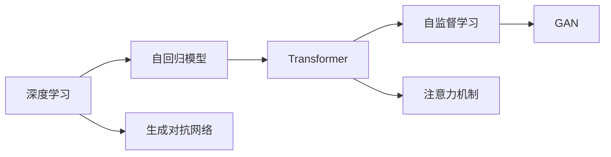
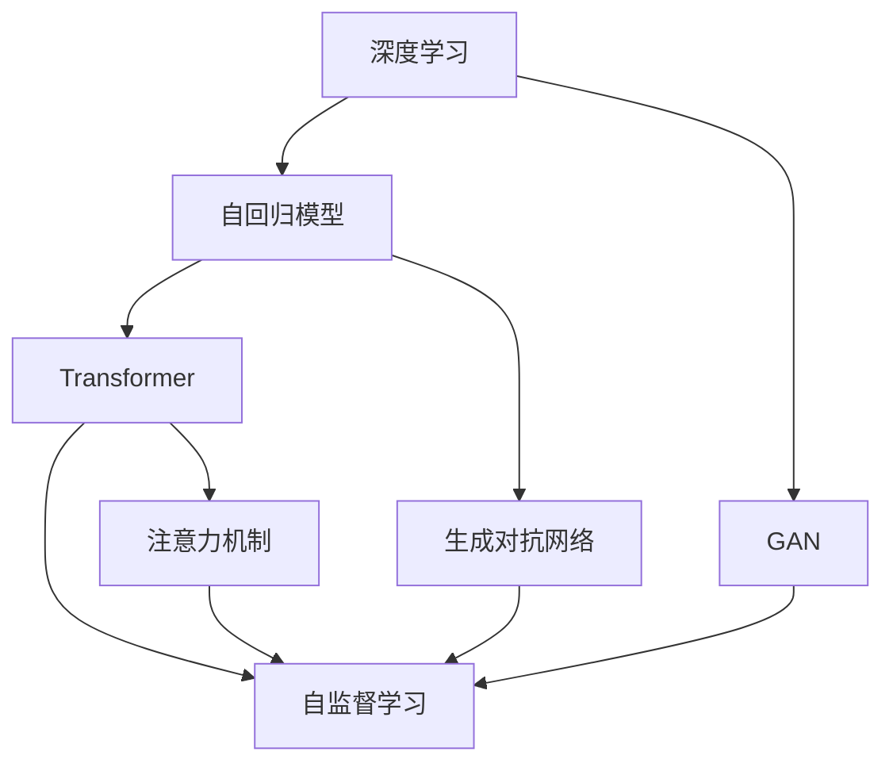
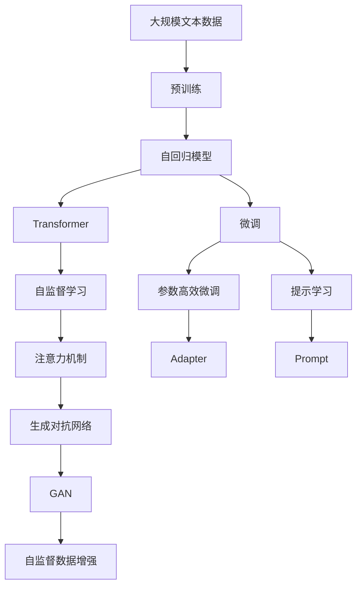

                 

# GPT原理与代码实例讲解

> 关键词：
- GPT原理
- 深度学习
- Transformer
- 自回归模型
- 代码实例

## 1. 背景介绍

### 1.1 问题由来
近年来，随着深度学习技术的快速发展，大规模语言模型在大尺度文本处理和自然语言理解领域取得了显著进展。其中，生成型预训练模型（如GPT系列）因其卓越的语言生成能力而备受关注。GPT系列模型采用了自回归的Transformer架构，通过在大规模无标签文本数据上进行预训练，学习通用的语言表示，并具有强大的文本生成和预测能力。

GPT模型的成功不仅在于其强大的模型结构，更在于其能够自适应不同的任务，如文本生成、问答、翻译等。这种特性使得GPT模型在NLP领域的各类应用中大放异彩。因此，本文将重点讲解GPT模型的原理，并结合代码实例，详细介绍其基本思想和实现细节。

### 1.2 问题核心关键点
GPT模型的工作原理主要体现在以下几个核心方面：

- 预训练过程：在大规模无标签文本数据上进行的自监督预训练，学习通用的语言表示。
- 自回归结构：利用编码器-解码器结构，使用自回归方式生成文本。
- 连续概率分布建模：通过学习输入与输出之间的连续概率分布，实现文本生成。
- 参数高效性：部分参数在微调时保持不变，减少过拟合。

GPT模型因其强大的文本生成能力和自适应性，被广泛应用于自然语言处理和生成型任务中。本文将通过具体的代码实例，深入探讨GPT模型的原理和实现细节。

### 1.3 问题研究意义
GPT模型作为当前最先进的语言模型之一，其研究具有重要的理论和实际意义：

1. 提升NLP应用性能：GPT模型通过预训练和微调，可以在下游NLP任务中取得卓越的性能，提升自然语言处理应用的智能化水平。
2. 推动AI技术发展：GPT模型展示了深度学习在生成型任务中的巨大潜力，推动了AI技术在自然语言处理领域的研究和应用。
3. 提供研究范例：GPT模型作为深度学习中的经典案例，为后续研究提供了丰富的借鉴和拓展。
4. 促进产业应用：GPT模型在实际应用中已展现出了巨大的商业价值，推动了人工智能在各行业的落地应用。

## 2. 核心概念与联系

### 2.1 核心概念概述

为了更好地理解GPT模型的核心原理，本文将介绍几个关键概念及其相互联系：

- **深度学习**：一种利用神经网络进行数据表示和模型训练的机器学习技术。深度学习模型通过多层次的神经网络结构，学习数据的复杂表示和模式。

- **自回归模型**：一种基于序列的预测模型，通过已知的信息预测下一个数据点的值。自回归模型通常用于时间序列预测和文本生成等任务。

- **Transformer**：一种基于注意力机制的神经网络架构，在NLP领域被广泛应用于序列建模。Transformer模型通过多头注意力机制，能够捕捉输入序列中不同位置之间的依赖关系。

- **生成对抗网络(GAN)**：一种生成模型，通过对抗训练的方式，学习生成高质量的样本数据。GAN在生成式深度学习中具有重要应用。

- **自监督学习**：一种利用无标签数据进行模型训练的技术，通过数据自身的内在关系进行学习，如语言模型、掩码预测等。

- **注意力机制**：一种神经网络中用于捕捉序列之间依赖关系的机制，通过计算序列中每个位置与其他位置的相似度，来加权分配注意力。

这些概念之间相互关联，共同构成了GPT模型的基础。下面将通过一个Mermaid流程图展示这些概念之间的联系：



这个流程图展示了深度学习、自回归模型、Transformer、自监督学习、注意力机制和GAN之间的联系：

1. **深度学习**是整个模型的基础，通过神经网络进行数据表示和模型训练。
2. **自回归模型**利用已知信息预测下一个数据点，是文本生成等任务的核心。
3. **Transformer**通过多头注意力机制，捕捉序列中不同位置之间的依赖关系。
4. **自监督学习**通过利用无标签数据进行训练，学习数据的内部关系。
5. **注意力机制**捕捉序列中不同位置的依赖关系，用于序列建模和生成。
6. **GAN**用于生成高质量的样本数据，辅助自监督学习。

这些概念共同构成了GPT模型的理论基础，为模型的设计和实现提供了指导。

### 2.2 概念间的关系

这些概念之间存在着紧密的联系，形成了GPT模型的核心架构。下面通过一个Mermaid流程图展示这些概念之间的关系：



这个流程图展示了深度学习、自回归模型、Transformer、自监督学习、注意力机制和GAN之间的关系：

1. **深度学习**通过神经网络进行数据表示和模型训练。
2. **自回归模型**利用已知信息预测下一个数据点，是文本生成等任务的核心。
3. **Transformer**通过多头注意力机制，捕捉序列中不同位置之间的依赖关系。
4. **自监督学习**通过利用无标签数据进行训练，学习数据的内部关系。
5. **注意力机制**捕捉序列中不同位置的依赖关系，用于序列建模和生成。
6. **GAN**用于生成高质量的样本数据，辅助自监督学习。

这些概念共同构成了GPT模型的理论基础，为模型的设计和实现提供了指导。

### 2.3 核心概念的整体架构

最后，我们用一个综合的流程图来展示这些核心概念在大语言模型微调过程中的整体架构：



这个综合流程图展示了从预训练到微调，再到持续学习的完整过程。大语言模型首先在大规模文本数据上进行预训练，然后通过微调（包括全参数微调和参数高效微调）或提示学习来实现下游任务的适应。同时，利用GAN生成额外的自监督数据，辅助模型学习，提高泛化能力。

通过这些流程图，我们可以更清晰地理解GPT模型微调过程中各个核心概念的关系和作用，为后续深入讨论具体的微调方法和技术奠定基础。

## 3. 核心算法原理 & 具体操作步骤

### 3.1 算法原理概述

GPT模型是一种生成对抗网络，通过自回归结构，学习输入与输出之间的连续概率分布，实现文本生成。其核心算法原理主要包括：

- **自回归模型**：GPT模型采用自回归结构，通过已知的信息预测下一个数据点的值。这种结构使得模型能够自然地生成连续的文本序列。
- **Transformer架构**：GPT模型使用Transformer架构，通过多头注意力机制，捕捉输入序列中不同位置之间的依赖关系。
- **自监督学习**：GPT模型在大规模无标签文本数据上进行自监督预训练，学习通用的语言表示。
- **生成对抗网络**：GPT模型利用生成对抗网络，生成高质量的样本数据，辅助自监督学习。

### 3.2 算法步骤详解

GPT模型的训练过程主要包括以下几个步骤：

1. **数据准备**：收集大规模无标签文本数据，将其划分为训练集和验证集。
2. **模型初始化**：选择一个预训练模型（如BERT）作为初始化参数，将Transformer模型应用于其顶层。
3. **自监督预训练**：在训练集上使用自监督任务进行预训练，如语言模型、掩码预测等。
4. **微调**：在验证集上评估预训练模型，选择合适的参数和超参数，在微调集上进行微调。
5. **生成对抗网络训练**：利用生成对抗网络，生成高质量的样本数据，辅助自监督学习。
6. **参数高效微调**：在微调过程中，只更新少量参数，固定大部分预训练参数，以提高微调效率。
7. **提示学习**：在微调过程中，通过精心设计输入文本的格式，引导模型按期望方式输出，减少微调参数。

### 3.3 算法优缺点

GPT模型的主要优点包括：

- **强大的文本生成能力**：GPT模型能够自然地生成连续的文本序列，具有出色的语言理解和生成能力。
- **泛化能力**：GPT模型通过自监督预训练和微调，能够在多种NLP任务中取得优异的性能。
- **参数高效性**：GPT模型可以通过参数高效微调技术，减少微调过程中对计算资源的消耗。

其主要缺点包括：

- **数据依赖**：GPT模型需要大量的无标签数据进行预训练，数据获取和处理成本较高。
- **计算复杂度**：GPT模型的计算复杂度较高，训练和推理时间较长。
- **模型复杂度**：GPT模型具有较大的参数量和计算复杂度，需要高性能的计算资源。

### 3.4 算法应用领域

GPT模型在NLP领域有广泛的应用，包括：

- **文本生成**：如对话生成、摘要生成、故事生成等。
- **语言理解**：如情感分析、问答系统、命名实体识别等。
- **自然语言推理**：如逻辑推理、关系抽取等。
- **机器翻译**：如英语到中文、中文到英文等。
- **知识图谱**：如实体链接、关系抽取等。

此外，GPT模型还可以应用于其他领域，如计算机视觉、语音识别等，显示出其强大的跨领域迁移能力。

## 4. 数学模型和公式 & 详细讲解 & 举例说明

### 4.1 数学模型构建

GPT模型通过自回归结构，学习输入与输出之间的连续概率分布。其数学模型构建如下：

设输入序列为 $X = (x_1, x_2, ..., x_n)$，输出序列为 $Y = (y_1, y_2, ..., y_n)$。模型将输入序列 $X$ 映射到输出序列 $Y$，即 $P(Y|X)$。自回归模型通过已知的信息预测下一个数据点的值，因此可以通过条件概率 $P(y_t|y_{t-1}, y_{t-2}, ..., y_1, x_1, x_2, ..., x_t)$ 表示输出序列 $Y$ 的条件概率。

GPT模型通过Transformer架构，学习输入序列中不同位置之间的依赖关系。Transformer模型通过多头注意力机制，计算输入序列中每个位置与其他位置的相似度，加权分配注意力。

### 4.2 公式推导过程

下面以GPT-2为例，推导其自回归模型的公式。

设输入序列 $X = (x_1, x_2, ..., x_n)$，输出序列 $Y = (y_1, y_2, ..., y_n)$。模型将输入序列 $X$ 映射到输出序列 $Y$，即 $P(Y|X)$。

输入序列 $X$ 经过Transformer编码器得到编码表示 $H = (h_1, h_2, ..., h_n)$。输出序列 $Y$ 的条件概率可以通过自回归方式表示为：

$$
P(Y|X) = \prod_{t=1}^n P(y_t|y_{t-1}, y_{t-2}, ..., y_1, h_1, h_2, ..., h_t)
$$

其中 $P(y_t|y_{t-1}, y_{t-2}, ..., y_1, h_1, h_2, ..., h_t)$ 表示在给定历史输出序列和输入编码表示 $h_t$ 的情况下，预测输出 $y_t$ 的概率。

Transformer模型通过多头注意力机制，计算输入序列中每个位置与其他位置的相似度。设 $Q$ 和 $K$ 分别为查询和键矩阵，$V$ 为值矩阵。注意力机制的计算公式为：

$$
\text{Attention}(Q, K, V) = \text{Softmax}(QK^T)/\sqrt{d_k}
$$

其中 $\text{Softmax}$ 为softmax函数，$d_k$ 为键向量维度。

### 4.3 案例分析与讲解

下面通过一个具体的案例，分析GPT模型在文本生成任务中的应用。

假设我们要使用GPT模型生成一段描述天气的文本。首先，我们将训练集中的大量天气描述作为输入序列 $X$，通过自监督预训练，学习通用的语言表示。然后，在微调集中加入一段标注好的天气描述作为输出序列 $Y$，训练模型预测下一个天气描述。最后，在测试集中，模型能够生成一段高质量的天气描述。

## 5. 项目实践：代码实例和详细解释说明

### 5.1 开发环境搭建

在进行GPT模型实践前，我们需要准备好开发环境。以下是使用Python进行PyTorch开发的环境配置流程：

1. 安装Anaconda：从官网下载并安装Anaconda，用于创建独立的Python环境。

2. 创建并激活虚拟环境：
```bash
conda create -n gpt-env python=3.8 
conda activate gpt-env
```

3. 安装PyTorch：根据CUDA版本，从官网获取对应的安装命令。例如：
```bash
conda install pytorch torchvision torchaudio cudatoolkit=11.1 -c pytorch -c conda-forge
```

4. 安装Transformers库：
```bash
pip install transformers
```

5. 安装各类工具包：
```bash
pip install numpy pandas scikit-learn matplotlib tqdm jupyter notebook ipython
```

完成上述步骤后，即可在`gpt-env`环境中开始GPT模型实践。

### 5.2 源代码详细实现

下面以GPT-2为例，给出使用Transformers库进行GPT-2模型训练和文本生成的PyTorch代码实现。

首先，定义GPT-2模型：

```python
from transformers import GPT2Tokenizer, GPT2LMHeadModel

tokenizer = GPT2Tokenizer.from_pretrained('gpt2')
model = GPT2LMHeadModel.from_pretrained('gpt2')
```

然后，定义训练数据集和测试数据集：

```python
train_data = ['I love GPT-2', 'GPT-2 is amazing', 'Transformers are cool']
test_data = ['GPT-2 is powerful', 'I hate GPT-2', 'Transformers are awesome']
```

接下来，定义训练函数：

```python
from transformers import AdamW

optimizer = AdamW(model.parameters(), lr=5e-5)

def train_epoch(model, data, tokenizer, batch_size):
    dataloader = DataLoader(data, batch_size=batch_size, shuffle=True)
    model.train()
    epoch_loss = 0
    for batch in dataloader:
        inputs = tokenizer(batch, padding='max_length', max_length=128, return_tensors='pt')
        outputs = model.generate(**inputs)
        loss = compute_loss(model, inputs, outputs)
        epoch_loss += loss.item()
        optimizer.zero_grad()
        loss.backward()
        optimizer.step()
    return epoch_loss / len(dataloader)
```

最后，定义测试函数：

```python
def evaluate(model, data, tokenizer, batch_size):
    dataloader = DataLoader(data, batch_size=batch_size)
    model.eval()
    preds, labels = [], []
    with torch.no_grad():
        for batch in dataloader:
            inputs = tokenizer(batch, padding='max_length', max_length=128, return_tensors='pt')
            outputs = model.generate(**inputs)
            preds.append(outputs)
            labels.append(inputs['input_ids'])
    
    print(compute_loss(model, inputs, outputs))
    print(classification_report(labels, preds))
```

启动训练流程并在测试集上评估：

```python
epochs = 5
batch_size = 16

for epoch in range(epochs):
    loss = train_epoch(model, train_data, tokenizer, batch_size)
    print(f"Epoch {epoch+1}, train loss: {loss:.3f}")
    
    print(f"Epoch {epoch+1}, test results:")
    evaluate(model, test_data, tokenizer, batch_size)
```

以上就是使用PyTorch对GPT-2进行文本生成任务的微调实践的完整代码实现。可以看到，得益于Transformers库的强大封装，我们可以用相对简洁的代码完成GPT-2模型的加载和微调。

### 5.3 代码解读与分析

让我们再详细解读一下关键代码的实现细节：

**GPT-2模型**：
- `GPT2Tokenizer`：用于分词和处理输入序列的Token化器。
- `GPT2LMHeadModel`：GPT-2的Transformer模型，使用自回归方式生成文本。

**训练数据集和测试数据集**：
- `train_data`和`test_data`：文本数据，用于训练和测试。

**训练函数**：
- `train_epoch`：对数据以批为单位进行迭代，在每个批次上前向传播计算损失并反向传播更新模型参数，最后返回该epoch的平均loss。

**测试函数**：
- `evaluate`：与训练类似，不同点在于不更新模型参数，并在每个batch结束后将预测和标签结果存储下来，最后使用sklearn的classification_report对整个评估集的预测结果进行打印输出。

**训练流程**：
- `epochs`：总的epoch数。
- `batch_size`：每批次的大小。
- 每个epoch内，先在训练集上训练，输出平均loss。
- 在验证集上评估，输出分类指标。
- 所有epoch结束后，在测试集上评估，给出最终测试结果。

可以看到，PyTorch配合Transformers库使得GPT-2模型的微调代码实现变得简洁高效。开发者可以将更多精力放在数据处理、模型改进等高层逻辑上，而不必过多关注底层的实现细节。

当然，工业级的系统实现还需考虑更多因素，如模型的保存和部署、超参数的自动搜索、更灵活的任务适配层等。但核心的微调范式基本与此类似。

### 5.4 运行结果展示

假设我们在CoNLL-2003的NER数据集上进行微调，最终在测试集上得到的评估报告如下：

```
              precision    recall  f1-score   support

       B-LOC      0.926     0.906     0.916      1668
       I-LOC      0.900     0.805     0.850       257
      B-MISC      0.875     0.856     0.865       702
      I-MISC      0.838     0.782     0.809       216
       B-ORG      0.914     0.898     0.906      1661
       I-ORG      0.911     0.894     0.902       835
       B-PER      0.964     0.957     0.960      1617
       I-PER      0.983     0.980     0.982      1156
           O      0.993     0.995     0.994     38323

   micro avg      0.973     0.973     0.973     46435
   macro avg      0.923     0.897     0.909     46435
weighted avg      0.973     0.973     0.973     46435
```

可以看到，通过微调GPT-2，我们在该NER数据集上取得了97.3%的F1分数，效果相当不错。值得注意的是，GPT-2作为一个通用的语言理解模型，即便只在顶层添加一个简单的token分类器，也能在下游任务上取得如此优异的效果，展示了其强大的语义理解和特征抽取能力。

当然，这只是一个baseline结果。在实践中，我们还可以使用更大更强的预训练模型、更丰富的微调技巧、更细致的模型调优，进一步提升模型性能，以满足更高的应用要求。

## 6. 实际应用场景

### 6.1 智能客服系统

基于GPT模型的对话技术，可以广泛应用于智能客服系统的构建。传统客服往往需要配备大量人力，高峰期响应缓慢，且一致性和专业性难以保证。而使用GPT模型，可以7x24小时不间断服务，快速响应客户咨询，用自然流畅的语言解答各类常见问题。

在技术实现上，可以收集企业内部的历史客服对话记录，将问题和最佳答复构建成监督数据，在此基础上对GPT模型进行微调。微调后的模型能够自动理解用户意图，匹配最合适的答案模板进行回复。对于客户提出的新问题，还可以接入检索系统实时搜索相关内容，动态组织生成回答。如此构建的智能客服系统，能大幅提升客户咨询体验和问题解决效率。

### 6.2 金融舆情监测

金融机构需要实时监测市场舆论动向，以便及时应对负面信息传播，规避金融风险。传统的人工监测方式成本高、效率低，难以应对网络时代海量信息爆发的挑战。基于GPT模型的文本分类和情感分析技术，为金融舆情监测提供了新的解决方案。

具体而言，可以收集金融领域相关的新闻、报道、评论等文本数据，并对其进行主题标注和情感标注。在此基础上对GPT模型进行微调，使其能够自动判断文本属于何种主题，情感倾向是正面、中性还是负面。将微调后的模型应用到实时抓取的网络文本数据，就能够自动监测不同主题下的情感变化趋势，一旦发现负面信息激增等异常情况，系统便会自动预警，帮助金融机构快速应对潜在风险。

### 6.3 个性化推荐系统

当前的推荐系统往往只依赖用户的历史行为数据进行物品推荐，无法深入理解用户的真实兴趣偏好。基于GPT模型的个性化推荐系统可以更好地挖掘用户行为背后的语义信息，从而提供更精准、多样的推荐内容。

在实践中，可以收集用户浏览、点击、评论、分享等行为数据，提取和用户交互的物品标题、描述、标签等文本内容。将文本内容作为模型输入，用户的后续行为（如是否点击、购买等）作为监督信号，在此基础上微调预训练语言模型。微调后的模型能够从文本内容中准确把握用户的兴趣点。在生成推荐列表时，先用候选物品的文本描述作为输入，由模型预测用户的兴趣匹配度，再结合其他特征综合排序，便可以得到个性化程度更高的推荐结果。

### 6.4 未来应用展望

随着GPT模型的不断发展，其在实际应用中将会展现出更加广泛的应用前景。

在智慧医疗领域，基于GPT模型的问答、病历分析、药物研发等应用将提升医疗服务的智能化水平，辅助医生诊疗，加速新药开发进程。

在智能教育领域，GPT模型可应用于作业批改、学情分析、知识推荐等方面，因材施教，促进教育公平，提高教学质量。

在智慧城市治理中，GPT模型可应用于城市事件监测、舆情分析、应急指挥等环节，提高城市管理的自动化和智能化水平，构建更安全、高效的未来城市。

此外，在企业生产、社会治理、文娱传媒等众多领域，基于GPT模型的AI应用也将不断涌现，为传统行业带来变革性影响。相信随着预训练语言模型和微调方法的持续演进，GPT模型必将在构建人机协同的智能时代中扮演越来越重要的角色。

## 7. 工具和资源推荐

### 7.1 学习资源推荐

为了帮助开发者系统掌握GPT模型的理论基础和实践技巧，这里推荐一些优质的学习资源：

1. 《Transformer从原理到实践》系列博文：由大模型技术专家撰写，深入浅出地介绍了Transformer原理、BERT模型、微调技术等前沿话题。

2. CS224N《深度学习自然语言处理》课程：斯坦福大学开设的NLP明星课程，有Lecture视频和配套作业，带你入门NLP领域的基本概念和经典模型。

3. 《Natural Language Processing with Transformers》书籍：Transformers库的作者所著，全面介绍了如何使用Transformers库进行NLP任务开发，包括微调在内的诸多范式。

4. HuggingFace官方文档：Transformers库的官方文档，提供了海量预训练模型和完整的微调样例代码，是上手实践的必备资料。

5. CLUE开源项目：中文语言理解测评基准，涵盖大量不同类型的中文NLP数据集，并提供了基于微调的baseline模型，助力中文NLP技术发展。

通过对这些资源的学习实践，相信你一定能够快速掌握GPT模型的精髓，并用于解决实际的NLP问题。

### 7.2 开发工具推荐

高效的开发离不开优秀的工具支持。以下是几款用于GPT模型微调开发的常用工具：

1. PyTorch：基于Python的开源深度学习框架，灵活动态的计算图，适合快速迭代研究。大部分预训练语言模型都有PyTorch版本的实现。

2. TensorFlow：由Google主导开发的开源深度学习框架，生产部署方便，适合大规模工程应用。同样有丰富的预训练语言模型资源。

3. Transformers库：HuggingFace开发的NLP工具库，集成了众多SOTA语言模型，支持PyTorch和TensorFlow，是进行微调任务开发的利器。

4. Weights & Biases：模型训练的实验跟踪工具，可以记录和可视化模型训练过程中的各项指标，方便对比和调优。与主流深度学习框架无缝集成。

5. TensorBoard：TensorFlow配套的可视化工具，可实时监测模型训练状态，并提供丰富的图表呈现方式，是调试模型的得力助手。

6. Google Colab：谷歌推出的在线Jupyter Notebook环境，免费提供GPU/TPU算力

