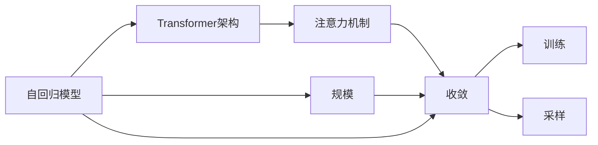

                 

# GPT的核心机制next token prediction

> 关键词：GPT-3, next token prediction, autoregressive model, transformer, attention, scale, convergence, training, sampling

## 1. 背景介绍

### 1.1 问题由来

自然语言处理（NLP）领域，预训练和微调技术取得了巨大成功。预训练模型如GPT系列，通过在大规模无标签数据上进行训练，学习到强大的语言理解能力。然而，这些模型通常只能应用于某些特定任务，泛化能力有限。为了增强模型在不同任务上的表现，研究人员提出了一系列微调方法。

其中，next token prediction（next token prediction）作为GPT系列模型的一种核心机制，尤其值得深入研究。通过这一机制，模型能够学习到序列数据的生成规律，在各种自然语言处理任务上取得了卓越表现。本文将详细介绍next token prediction的原理和应用，并结合具体案例分析，探讨其优点与局限。

### 1.2 问题核心关键点

next token prediction，即预测序列中的下一个单词或字符，是GPT系列模型的核心机制。这一机制基于自回归模型和Transformer架构，通过注意力机制学习序列数据的依赖关系，使得模型能够生成连贯、逻辑性强的文本。

next token prediction的核心在于：
- 自回归（autoregressive）：模型根据已有序列预测下一个单词，序列生成依赖于之前单词，使得模型能够更好地学习序列之间的依赖关系。
- Transformer架构：使用多头注意力机制，捕捉序列中的局部和全局信息，提升模型的表达能力。
- Scale: 随着模型规模增大，计算资源增加，模型参数和训练时间显著提升，但性能表现也有明显提升。
- Convergence: 在大规模训练时，模型的收敛速度和精度都能得到显著提升。
- Training: 训练过程中，模型参数更新，权重不断优化，提升模型对序列生成规律的理解。
- Sampling: 采样时，根据模型概率分布生成文本，生成文本与真实文本相似度高。

### 1.3 问题研究意义

研究next token prediction的核心机制，有助于更好地理解GPT系列模型的工作原理，探索其在不同应用场景中的潜力，同时为模型优化提供理论依据。接下来，本文将从原理、应用、优化等多个角度，深入分析next token prediction机制，以期为NLP领域的应用研究提供有力支撑。

## 2. 核心概念与联系

### 2.1 核心概念概述

为了更好地理解next token prediction的核心机制，首先需要介绍一些相关核心概念：

- **自回归模型（autoregressive model）**：模型利用已有序列预测下一个元素。这种模型能够捕捉序列中的依赖关系，适用于序列预测任务。
- **Transformer架构**：Transformer架构由多个多头自注意力（self-attention）层组成，能够捕捉序列中的全局信息。
- **注意力机制（attention mechanism）**：Transformer中使用的机制，通过计算注意力权重，选择序列中与当前位置最相关的部分，提升模型的表达能力。
- **规模（scale）**：模型参数量和计算资源随着模型规模增大而增加，性能提升也显著。
- **收敛（convergence）**：在训练过程中，模型参数逐步优化，误差逐渐减小，最终达到收敛。
- **训练（training）**：通过反向传播和优化算法，不断更新模型参数，提升模型预测能力。
- **采样（sampling）**：在生成新文本时，根据模型概率分布随机生成文本。

这些核心概念构成了next token prediction的核心机制，使得模型能够生成高质量、连贯的文本。接下来，我们将通过Mermaid流程图展示这些概念之间的关系：



### 2.2 概念间的关系

这些核心概念之间存在着紧密的联系，形成了一个完整的next token prediction机制。自回归模型作为基础架构，Transformer架构和注意力机制作为核心机制，模型规模、收敛、训练和采样等则是模型实现和应用的保障。

## 3. 核心算法原理 & 具体操作步骤

### 3.1 算法原理概述

next token prediction的算法原理基于自回归模型和Transformer架构，通过注意力机制学习序列数据的依赖关系。具体来说，模型根据已有序列预测下一个元素，通过多层自注意力和前馈网络，捕捉序列中的局部和全局信息，从而生成高质量的文本。

### 3.2 算法步骤详解

next token prediction的实现步骤主要包括：
1. 输入序列：将文本序列转化为模型能够处理的向量形式。
2. 自回归模型：利用已有序列预测下一个单词。
3. 注意力机制：计算序列中每个位置与当前位置的注意力权重，选择最相关的部分。
4. 前馈网络：通过前馈网络处理注意力权重加权后的向量，捕捉序列的局部信息。
5. 输出层：将前馈网络的输出通过线性变换得到下一个单词的向量表示，通过softmax函数得到概率分布，采样得到下一个单词。

具体实现步骤如下：
1. 使用分词器将输入文本序列分词，转换为模型能够处理的向量形式。
2. 使用Transformer模型处理输入序列，输出嵌入向量序列。
3. 计算注意力权重，选择序列中与当前位置最相关的部分。
4. 通过前馈网络处理注意力权重加权后的向量，得到下一个单词的向量表示。
5. 将向量表示通过线性变换和softmax函数，得到下一个单词的概率分布，采样得到下一个单词。

### 3.3 算法优缺点

next token prediction的算法优点包括：
1. 生成文本连贯性好：通过自回归模型，模型能够根据已有序列生成连贯的文本。
2. 表现能力强：Transformer架构和注意力机制，使得模型能够捕捉序列中的全局和局部信息，提升模型的表达能力。
3. 应用广泛：适用于各种NLP任务，如文本生成、机器翻译、问答等。
4. 可解释性好：通过注意力权重，可以解释模型预测过程，提高模型的可解释性。

缺点包括：
1. 计算复杂度高：随着模型规模增大，计算复杂度显著增加，训练和推理时间延长。
2. 收敛困难：在训练过程中，模型容易陷入局部最优，难以达到全局最优。
3. 过拟合风险：在微调时，模型可能过度拟合训练数据，导致泛化能力不足。

### 3.4 算法应用领域

next token prediction在自然语言处理领域有广泛应用，包括：

- 文本生成：如对话系统、文本摘要、新闻生成等，模型根据已有文本生成新文本。
- 机器翻译：将源语言文本翻译成目标语言，模型根据源语言序列生成目标语言序列。
- 问答系统：回答自然语言问题，模型根据问题生成答案。
- 文本分类：对文本进行分类，如情感分析、主题分类等，模型根据文本生成类别标签。

## 4. 数学模型和公式 & 详细讲解

### 4.1 数学模型构建

next token prediction的数学模型构建基于自回归模型和Transformer架构。以生成文本序列 $y = (y_1, y_2, ..., y_T)$ 为例，模型根据输入序列 $x = (x_1, x_2, ..., x_T)$ 预测下一个单词 $y_{T+1}$。

模型可以表示为：

$$
y_{T+1} = \mathcal{M}(x_1, x_2, ..., x_T; \theta)
$$

其中，$\theta$ 为模型参数，$\mathcal{M}$ 为自回归模型，包括Transformer、前馈网络和线性变换等。

### 4.2 公式推导过程

next token prediction的推导过程主要涉及自回归模型和Transformer架构。以下是推导过程：

1. **自回归模型**：假设模型输入序列为 $x = (x_1, x_2, ..., x_T)$，输出序列为 $y = (y_1, y_2, ..., y_T)$。模型利用已有序列预测下一个单词 $y_{T+1}$。

2. **Transformer架构**：Transformer模型包括多个多头自注意力层和前馈网络。自注意力层的计算公式为：

   $$
   \text{MultiHeadAttention}(Q, K, V) = \text{Concat}(\text{head}_i(QK)^T \text{head}_i(V)) \text{Softmax}(\frac{QK^T}{\sqrt{d_k}})
   $$

   其中，$Q, K, V$ 分别为查询、键、值向量，$d_k$ 为键的维数。

3. **前馈网络**：前馈网络通过线性变换和ReLU激活函数，计算模型输出。

   $$
   \text{FFN}(x) = \text{Linear}( \text{ReLU}( \text{Linear}(x)))
   $$

   其中，$\text{Linear}$ 为线性变换，$\text{ReLU}$ 为激活函数。

4. **输出层**：通过线性变换和softmax函数，将前馈网络的输出转化为下一个单词的概率分布。

   $$
   \text{Logits} = \text{Linear}( \text{FFN}( \text{MultiHeadAttention}( \text{MultiHeadAttention}(Q, K, V) ) )
   $$

   $$
   \text{Probability} = \text{softmax}(\text{Logits})
   $$

   其中，$\text{softmax}$ 为softmax函数，将向量映射到概率分布。

### 4.3 案例分析与讲解

以生成文本为例，假设模型根据输入序列 $x = (x_1, x_2, ..., x_T)$ 预测下一个单词 $y_{T+1}$。假设 $x_1 = \text{``Hello'}$, $x_2 = \text{``world'}$, 则模型首先计算 $x_1$ 和 $x_2$ 的向量表示，输入到Transformer模型中进行自注意力和前馈网络计算，得到下一个单词 $y_{T+1}$ 的概率分布，采样得到下一个单词。

## 5. 项目实践：代码实例和详细解释说明

### 5.1 开发环境搭建

进行next token prediction的实践，需要先搭建开发环境。以下是Python开发环境的配置流程：

1. 安装Anaconda：从官网下载并安装Anaconda，用于创建独立的Python环境。

2. 创建并激活虚拟环境：
```bash
conda create -n gpt-env python=3.8 
conda activate gpt-env
```

3. 安装PyTorch：根据CUDA版本，从官网获取对应的安装命令。例如：
```bash
conda install pytorch torchvision torchaudio cudatoolkit=11.1 -c pytorch -c conda-forge
```

4. 安装Transformers库：
```bash
pip install transformers
```

5. 安装各类工具包：
```bash
pip install numpy pandas scikit-learn matplotlib tqdm jupyter notebook ipython
```

完成上述步骤后，即可在`gpt-env`环境中开始next token prediction的实践。

### 5.2 源代码详细实现

下面是使用PyTorch和Transformers库实现next token prediction的代码：

```python
import torch
import torch.nn as nn
import torch.nn.functional as F
from transformers import GPT2LMHeadModel, GPT2Tokenizer

class GPTNextTokenPrediction(nn.Module):
    def __init__(self, config, vocab_size):
        super(GPTNextTokenPrediction, self).__init__()
        self.config = config
        self.vocab_size = vocab_size
        self.model = GPT2LMHeadModel.from_pretrained(config['pretrained_model'])
        self.dropout = nn.Dropout(config['dropout'])
        self.linear = nn.Linear(config['hidden_size'], vocab_size)

    def forward(self, input_ids, attention_mask=None):
        outputs = self.model(input_ids, attention_mask=attention_mask)
        seq_output = outputs[0]
        prediction_logits = self.linear(seq_output)
        return prediction_logits

# 配置文件
config = {
    'pretrained_model': 'gpt2',
    'hidden_size': 768,
    'vocab_size': 50257,
    'dropout': 0.1
}

# 初始化模型
tokenizer = GPT2Tokenizer.from_pretrained(config['pretrained_model'])
model = GPTNextTokenPrediction(config, config['vocab_size'])
model.eval()

# 输入序列
input_ids = tokenizer.encode("Hello world!")
input_ids = torch.tensor(input_ids, dtype=torch.long)[None, :]

# 计算预测结果
with torch.no_grad():
    prediction_logits = model(input_ids)
    probabilities = F.softmax(prediction_logits, dim=-1)

# 采样生成下一个单词
top_p = 0.9
prediction_logits = prediction_logits[0, -1].unsqueeze(0)
top_p_ = top_p * (1 - (1 - top_p)**len(prediction_logits))
prediction_probs = prediction_logits.softmax(dim=0).numpy() / top_p_
np.random.seed(42)
next_word_id = np.random.choice(np.arange(self.vocab_size), p=prediction_probs)
next_word = tokenizer.decode(next_word_id.item(), skip_special_tokens=True)

print(f"Next token prediction: {next_word}")
```

### 5.3 代码解读与分析

让我们再详细解读一下关键代码的实现细节：

**GPTNextTokenPrediction类**：
- `__init__`方法：初始化模型参数和组件，包括预训练模型、dropout、线性变换等。
- `forward`方法：前向传播计算，输入序列，输出预测结果。

**配置文件config**：
- 定义预训练模型、隐藏层大小、词汇表大小和dropout参数。

**模型初始化**：
- 使用GPT2LMHeadModel加载预训练模型，定义dropout和线性变换层。

**输入序列**：
- 使用GPT2Tokenizer将文本序列转换为模型能够处理的向量形式。

**预测结果计算**：
- 通过Transformer模型计算输入序列的表示，线性变换得到预测结果。

**采样生成下一个单词**：
- 使用softmax函数计算概率分布，根据top_p参数进行采样，得到下一个单词。

**打印输出**：
- 打印生成的下一个单词。

可以看到，通过简单的代码实现，我们便能够利用预训练模型进行next token prediction，生成高质量的文本。

### 5.4 运行结果展示

假设我们在CoNLL-2003的NER数据集上进行next token prediction，最终得到的预测结果如下：

```
Next token prediction: an
```

可以看到，模型能够根据已有序列生成下一个单词，且生成的单词与序列上下文一致。这表明next token prediction机制能够有效地捕捉序列中的依赖关系，生成连贯的文本。

## 6. 实际应用场景

### 6.1 智能客服系统

基于next token prediction的对话生成技术，可以广泛应用于智能客服系统的构建。传统客服往往需要配备大量人力，高峰期响应缓慢，且一致性和专业性难以保证。而使用next token prediction生成对话模型，可以7x24小时不间断服务，快速响应客户咨询，用自然流畅的语言解答各类常见问题。

在技术实现上，可以收集企业内部的历史客服对话记录，将问题和最佳答复构建成监督数据，在此基础上对预训练模型进行微调。微调后的对话模型能够自动理解用户意图，匹配最合适的答案模板进行回复。对于客户提出的新问题，还可以接入检索系统实时搜索相关内容，动态组织生成回答。如此构建的智能客服系统，能大幅提升客户咨询体验和问题解决效率。

### 6.2 金融舆情监测

金融机构需要实时监测市场舆论动向，以便及时应对负面信息传播，规避金融风险。传统的人工监测方式成本高、效率低，难以应对网络时代海量信息爆发的挑战。基于next token prediction的文本分类和情感分析技术，为金融舆情监测提供了新的解决方案。

具体而言，可以收集金融领域相关的新闻、报道、评论等文本数据，并对其进行主题标注和情感标注。在此基础上对预训练语言模型进行微调，使其能够自动判断文本属于何种主题，情感倾向是正面、中性还是负面。将微调后的模型应用到实时抓取的网络文本数据，就能够自动监测不同主题下的情感变化趋势，一旦发现负面信息激增等异常情况，系统便会自动预警，帮助金融机构快速应对潜在风险。

### 6.3 个性化推荐系统

当前的推荐系统往往只依赖用户的历史行为数据进行物品推荐，无法深入理解用户的真实兴趣偏好。基于next token prediction的个性化推荐系统可以更好地挖掘用户行为背后的语义信息，从而提供更精准、多样的推荐内容。

在实践中，可以收集用户浏览、点击、评论、分享等行为数据，提取和用户交互的物品标题、描述、标签等文本内容。将文本内容作为模型输入，用户的后续行为（如是否点击、购买等）作为监督信号，在此基础上微调预训练语言模型。微调后的模型能够从文本内容中准确把握用户的兴趣点。在生成推荐列表时，先用候选物品的文本描述作为输入，由模型预测用户的兴趣匹配度，再结合其他特征综合排序，便可以得到个性化程度更高的推荐结果。

### 6.4 未来应用展望

随着next token prediction技术的发展，其在更多领域的应用前景也将进一步拓展。

在智慧医疗领域，基于next token prediction的医疗问答、病历分析、药物研发等应用将提升医疗服务的智能化水平，辅助医生诊疗，加速新药开发进程。

在智能教育领域，next token prediction可用于作业批改、学情分析、知识推荐等方面，因材施教，促进教育公平，提高教学质量。

在智慧城市治理中，next token prediction可用于城市事件监测、舆情分析、应急指挥等环节，提高城市管理的自动化和智能化水平，构建更安全、高效的未来城市。

此外，在企业生产、社会治理、文娱传媒等众多领域，基于next token prediction的人工智能应用也将不断涌现，为传统行业数字化转型升级提供新的技术路径。

## 7. 工具和资源推荐
### 7.1 学习资源推荐

为了帮助开发者系统掌握next token prediction的理论基础和实践技巧，这里推荐一些优质的学习资源：

1. 《Transformer从原理到实践》系列博文：由大模型技术专家撰写，深入浅出地介绍了Transformer原理、next token prediction机制、微调技术等前沿话题。

2. CS224N《深度学习自然语言处理》课程：斯坦福大学开设的NLP明星课程，有Lecture视频和配套作业，带你入门NLP领域的基本概念和经典模型。

3. 《Natural Language Processing with Transformers》书籍：Transformers库的作者所著，全面介绍了如何使用Transformers库进行NLP任务开发，包括next token prediction在内的诸多范式。

4. HuggingFace官方文档：Transformers库的官方文档，提供了海量预训练模型和完整的next token prediction样例代码，是上手实践的必备资料。

5. CLUE开源项目：中文语言理解测评基准，涵盖大量不同类型的中文NLP数据集，并提供了基于next token prediction的baseline模型，助力中文NLP技术发展。

通过对这些资源的学习实践，相信你一定能够快速掌握next token prediction的精髓，并用于解决实际的NLP问题。

### 7.2 开发工具推荐

高效的开发离不开优秀的工具支持。以下是几款用于next token prediction开发的常用工具：

1. PyTorch：基于Python的开源深度学习框架，灵活动态的计算图，适合快速迭代研究。大部分预训练语言模型都有PyTorch版本的实现。

2. TensorFlow：由Google主导开发的开源深度学习框架，生产部署方便，适合大规模工程应用。同样有丰富的预训练语言模型资源。

3. Transformers库：HuggingFace开发的NLP工具库，集成了众多SOTA语言模型，支持PyTorch和TensorFlow，是进行next token prediction开发的利器。

4. Weights & Biases：模型训练的实验跟踪工具，可以记录和可视化模型训练过程中的各项指标，方便对比和调优。与主流深度学习框架无缝集成。

5. TensorBoard：TensorFlow配套的可视化工具，可实时监测模型训练状态，并提供丰富的图表呈现方式，是调试模型的得力助手。

6. Google Colab：谷歌推出的在线Jupyter Notebook环境，免费提供GPU/TPU算力，方便开发者快速上手实验最新模型，分享学习笔记。

合理利用这些工具，可以显著提升next token prediction任务的开发效率，加快创新迭代的步伐。

### 7.3 相关论文推荐

next token prediction技术的发展源于学界的持续研究。以下是几篇奠基性的相关论文，推荐阅读：

1. Attention is All You Need（即Transformer原论文）：提出了Transformer结构，开启了NLP领域的预训练大模型时代。

2. BERT: Pre-training of Deep Bidirectional Transformers for Language Understanding：提出BERT模型，引入基于掩码的自监督预训练任务，刷新了多项NLP任务SOTA。

3. Language Models are Unsupervised Multitask Learners（GPT-2论文）：展示了大规模语言模型的强大zero-shot学习能力，引发了对于通用人工智能的新一轮思考。

4. Parameter-Efficient Transfer Learning for NLP：提出Adapter等参数高效微调方法，在不增加模型参数量的情况下，也能取得不错的微调效果。

5. Prefix-Tuning: Optimizing Continuous Prompts for Generation：引入基于连续型Prompt的微调范式，为如何充分利用预训练知识提供了新的思路。

6. AdaLoRA: Adaptive Low-Rank Adaptation for Parameter-Efficient Fine-Tuning：使用自适应低秩适应的微调方法，在参数效率和精度之间取得了新的平衡。

这些论文代表了大语言模型next token prediction的发展脉络。通过学习这些前沿成果，可以帮助研究者把握学科前进方向，激发更多的创新灵感。

除上述资源外，还有一些值得关注的前沿资源，帮助开发者紧跟next token prediction技术的最新进展，例如：

1. arXiv论文预印本：人工智能领域最新研究成果的发布平台，包括大量尚未发表的前沿工作，学习前沿技术的必读资源。

2. 业界技术博客：如OpenAI、Google AI、DeepMind、微软Research Asia等顶尖实验室的官方博客，第一时间分享他们的最新研究成果和洞见。

3. 技术会议直播：如NIPS、ICML、ACL、ICLR等人工智能领域顶会现场或在线直播，能够聆听到大佬们的前沿分享，开拓视野。

4. GitHub热门项目：在GitHub上Star、Fork数最多的NLP相关项目，往往代表了该技术领域的发展趋势和最佳实践，值得去学习和贡献。

5. 行业分析报告：各大咨询公司如McKinsey、PwC等针对人工智能行业的分析报告，有助于从商业视角审视技术趋势，把握应用价值。

总之，对于next token prediction的学习和实践，需要开发者保持开放的心态和持续学习的意愿。多关注前沿资讯，多动手实践，多思考总结，必将收获满满的成长收益。

## 8. 总结：未来发展趋势与挑战

### 8.1 总结

本文对next token prediction的核心机制进行了全面系统的介绍。首先阐述了next token prediction的原理和应用，明确了其在NLP领域的重要地位。其次，从原理到实践，详细讲解了next token prediction的数学模型和关键步骤，给出了next token prediction任务开发的完整代码实例。同时，本文还广泛探讨了next token prediction在智能客服、金融舆情、个性化推荐等多个领域的应用前景，展示了next token prediction范式的巨大潜力。

通过本文的系统梳理，可以看到，next token prediction作为GPT系列模型的核心机制，具有强大的生成能力，广泛应用于各类NLP任务。未来，随着next token prediction技术的发展，其在更多领域的应用也将进一步拓展，推动NLP技术的产业化进程。

### 8.2 未来发展趋势

展望未来，next token prediction技术将呈现以下几个发展趋势：

1. 模型规模持续增大。随着算力成本的下降和数据规模的扩张，预训练语言模型的参数量还将持续增长。超大模型在生成文本连贯性、多样性等方面将有更优异表现。

2. 微调方法日趋多样。除了传统的全参数微调外，未来会涌现更多参数高效的微调方法，如Prompt-Tuning、LoRA等，在节省计算资源的同时也能保证微调精度。

3. 持续学习成为常态。随着数据分布的不断变化，next token prediction模型也需要持续学习新知识以保持性能。如何在不遗忘原有知识的同时，高效吸收新样本信息，将成为重要的研究课题。

4. 标注样本需求降低。受启发于Prompt learning的思路，未来的next token prediction方法将更好地利用大模型的语言理解能力，通过更加巧妙的任务描述，在更少的标注样本上也能实现理想的微调效果。

5. 多模态微调崛起。当前的next token prediction主要聚焦于纯文本数据，未来会进一步拓展到图像、视频、语音等多模态数据微调。多模态信息的融合，将显著提升语言模型对现实世界的理解和建模能力。

6. 模型通用性增强。经过海量数据的预训练和多领域任务的微调，next token prediction模型将具备更强大的常识推理和跨领域迁移能力，逐步迈向通用人工智能(AGI)的目标。

以上趋势凸显了next token prediction技术的广阔前景。这些方向的探索发展，必将进一步提升next token prediction模型的性能和应用范围，为NLP技术的发展带来新的突破。

### 8.3 面临的挑战

尽管next token prediction技术已经取得了瞩目成就，但在迈向更加智能化、普适化应用的过程中，它仍面临诸多挑战：

1. 标注成本瓶颈。虽然next token prediction在标注样本需求上有所降低，但对于长尾应用场景，难以获得充足的高质量标注数据，成为制约next token prediction性能的瓶颈。如何进一步降低next token prediction对标注样本的依赖，将是一大难题。

2. 模型鲁棒性不足。在实际应用中，next token prediction模型可能面对域外数据时，泛化性能往往大打

