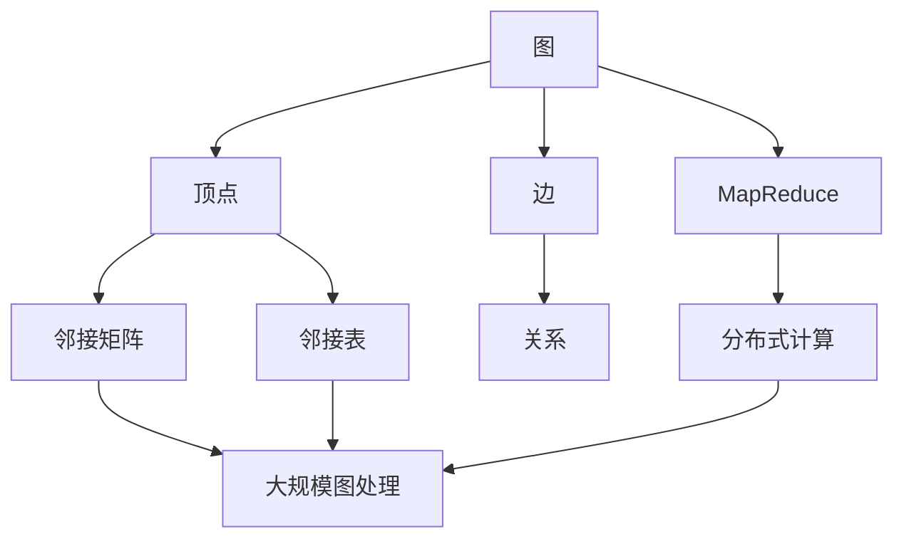
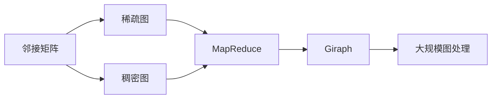
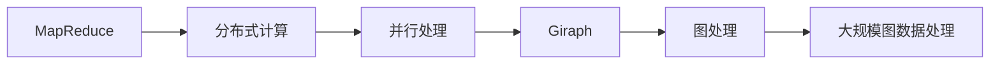
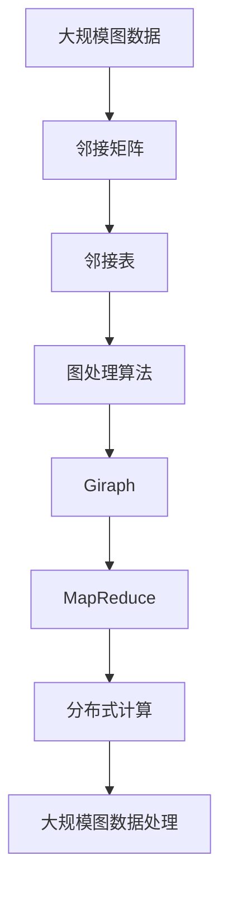

                 

# Giraph原理与代码实例讲解

## 1. 背景介绍

### 1.1 问题由来
在当今大数据时代，社交网络、电商平台、物联网等各类复杂系统的数据呈指数级增长。如何高效地处理大规模数据，挖掘其背后蕴含的有用信息，成为了广大数据科学家和软件工程师的重要挑战。

在大规模数据处理中，图结构（Graph Structure）作为复杂系统中的基本组成单元，扮演着至关重要的角色。例如，社交网络中用户间的连接关系、电商平台中商品间的关联关系等，都可以抽象为图结构。因此，如何高效地对图数据进行处理和分析，成为了当前研究的热点问题。

### 1.2 问题核心关键点
图处理领域中，Google开发的Giraph框架提供了高效、可扩展的图处理算法和工具。Giraph通过MapReduce框架的编程模型，支持复杂的图处理操作，并充分利用Hadoop分布式计算平台，可以处理大规模的图数据。

本文章将深入分析Giraph的核心概念和算法原理，并结合具体的代码实例，逐步解释Giraph的实现细节和应用场景。

### 1.3 问题研究意义
Giraph框架为大规模图数据的处理提供了强有力的工具和方法，为社会网络分析、商品推荐、社交网络挖掘、路由规划等诸多领域提供了技术支持。通过Giraph的学习，读者可以深入理解图处理的本质，掌握大规模数据处理的技能，从而提升在大数据环境下应用的能力。

## 2. 核心概念与联系

### 2.1 核心概念概述

为更好地理解Giraph框架，本节将介绍几个密切相关的核心概念：

- **图（Graph）**：由节点（Vertex）和边（Edge）组成的数据结构。图结构可以表示各种复杂系统的关系网络，如社交网络、知识图谱等。

- **顶点（Vertex）**：图的节点，可以代表用户、商品、位置等对象。

- **边（Edge）**：连接顶点的线，表示顶点之间的某种关系，如好友关系、商品关联等。

- **邻接矩阵（Adjacency Matrix）**：表示图中顶点之间关系的二维矩阵，行和列对应顶点，值表示顶点间的关系强度。

- **邻接表（Adjacency List）**：将图中每个顶点与它的相邻顶点列表存储在一起的结构，适用于稀疏图。

- **MapReduce**：一种编程模型，由Map和Reduce两部分组成，适用于并行处理大规模数据。

- **Giraph**：基于MapReduce模型，专门用于图处理和分析的框架，支持大规模图数据的分布式处理。

这些核心概念之间的逻辑关系可以通过以下Mermaid流程图来展示：



这个流程图展示了大规模图处理的过程：从图的构建，到邻接矩阵和邻接表的设计，再到分布式计算，最终实现图数据的处理和分析。通过这些核心概念的组合，可以构建起Giraph框架，高效地处理大规模图数据。

### 2.2 概念间的关系

这些核心概念之间存在着紧密的联系，形成了Giraph框架的完整生态系统。下面我们通过几个Mermaid流程图来展示这些概念之间的关系。

#### 2.2.1 图数据存储与表示



这个流程图展示了邻接矩阵和邻接表在稀疏图和稠密图中的应用，以及它们如何与MapReduce和Giraph框架结合，实现大规模图数据的处理。

#### 2.2.2 MapReduce与Giraph的关系



这个流程图展示了MapReduce和Giraph之间的关系。MapReduce提供了分布式计算框架，而Giraph在此基础上提供专门的图处理算法和工具。

#### 2.2.3 图处理算法与工具


这个流程图展示了邻接矩阵和邻接表如何支持图处理算法和工具，最终实现大规模图数据的处理。

### 2.3 核心概念的整体架构

最后，我们用一个综合的流程图来展示这些核心概念在大规模图处理中的整体架构：



这个综合流程图展示了从大规模图数据的存储和表示，到图处理算法和工具的设计和实现，最终通过分布式计算完成大规模图数据的处理。

## 3. 核心算法原理 & 具体操作步骤
### 3.1 算法原理概述

Giraph框架的核心算法是图计算算法，包括顶点计算（Vertex Operation）和边计算（Edge Operation）两部分。Giraph框架利用MapReduce框架的编程模型，支持复杂图计算操作，并充分利用Hadoop分布式计算平台，可以高效地处理大规模图数据。

Giraph的算法原理基于PageRank算法，通过迭代计算每个顶点的重要性，从而得到图中所有顶点的排序。PageRank算法的基本思想是：一个顶点的重要性与其邻居顶点的重要性有关，因此可以通过迭代计算每个顶点的重要性，最终得到一个排序。

### 3.2 算法步骤详解

Giraph框架的核心算法步骤如下：

1. **构建图数据结构**：使用邻接矩阵或邻接表将图数据存储为Hadoop的序列化格式。

2. **设计顶点计算函数**：定义一个顶点计算函数，用于计算每个顶点的值。该函数将在MapReduce框架下并行执行。

3. **设计边计算函数**：定义一个边计算函数，用于更新每个顶点的值。该函数将在MapReduce框架下并行执行。

4. **迭代计算**：多次迭代顶点计算和边计算，直到所有顶点的值收敛。

### 3.3 算法优缺点

Giraph框架具有以下优点：

- **高效性**：利用MapReduce框架的并行计算能力，能够高效处理大规模图数据。
- **可扩展性**：基于Hadoop分布式计算平台，能够水平扩展到数千台机器，处理海量数据。
- **灵活性**：支持多种图数据结构和图处理算法，适用于各种复杂系统。

但Giraph框架也存在一些缺点：

- **学习成本高**：需要了解MapReduce和Hadoop框架的基础知识，学习曲线较陡峭。
- **实现复杂**：顶点和边计算函数的设计需要仔细考虑，实现过程较为复杂。
- **性能瓶颈**：处理大规模图数据时，可能面临数据传输和网络延迟等问题，影响性能。

### 3.4 算法应用领域

Giraph框架在多个领域都有广泛的应用，如：

- **社交网络分析**：通过计算用户间的关系强度，得到用户的重要性和影响力。
- **商品推荐系统**：通过计算商品间的关联关系，实现基于用户行为的个性化推荐。
- **知识图谱构建**：通过计算实体间的关系，构建知识图谱，实现语义搜索和知识推理。
- **路由规划**：通过计算节点间的距离和关系，实现高效的路由规划和交通优化。
- **欺诈检测**：通过计算用户间的关系，检测异常行为和潜在欺诈。

除了上述这些应用外，Giraph框架还被广泛应用于医疗、金融、物流等各个领域，成为处理大规模图数据的重要工具。

## 4. 数学模型和公式 & 详细讲解 & 举例说明

### 4.1 数学模型构建

假设有一张无向图$G=(V,E)$，其中$V$为顶点集合，$E$为边集合。定义每个顶点的初始值为$x_v$，计算每个顶点的值$y_v$的数学模型为：

$$
y_v = \alpha \sum_{u \in \mathcal{N}(v)} \frac{x_u}{\text{outdegree}(u)} + (1-\alpha) x_v
$$

其中$\mathcal{N}(v)$表示顶点$v$的邻居集合，$\text{outdegree}(u)$表示顶点$u$的出度（即与之相邻的顶点数），$\alpha$为衰减系数（通常取0.85）。

### 4.2 公式推导过程

上述公式的推导过程如下：

- 首先，将每个顶点的值记为$y_v$，初始值为$x_v$。
- 在每轮迭代中，计算每个顶点的值$y_v$。对于顶点$v$，其值由邻居顶点的值和自身的值加权平均得到。
- 计算顶点$v$的邻居集合中所有顶点的出度之和，即$\sum_{u \in \mathcal{N}(v)} \text{outdegree}(u)$。
- 将计算得到的$y_v$值代入下一轮迭代。

### 4.3 案例分析与讲解

假设有一个社交网络图，包含5个顶点和10条边，初始值$x_v=1$，衰减系数$\alpha=0.85$。计算每个顶点的值$y_v$的过程如下：

- 对于顶点$1$，其邻居顶点为$2$和$3$，出度为2。计算$y_1$：
$$
y_1 = 0.85 \frac{x_2 + x_3}{2} + (1-0.85)x_1 = 0.85 \frac{1+1}{2} + 0.15 \times 1 = 0.9
$$
- 对于顶点$2$，其邻居顶点为$1$和$3$，出度为2。计算$y_2$：
$$
y_2 = 0.85 \frac{x_1 + x_3}{2} + (1-0.85)x_2 = 0.85 \frac{0.9+1}{2} + 0.15 \times 1 = 0.9
$$
- 以此类推，计算所有顶点的$y_v$值，直至所有值收敛。

## 5. 项目实践：代码实例和详细解释说明
### 5.1 开发环境搭建

在进行Giraph实践前，我们需要准备好开发环境。以下是使用Python进行Hadoop开发的环境配置流程：

1. 安装Hadoop：从官网下载并安装Hadoop，并启动分布式集群。

2. 安装Python：在每个节点上安装Python，以便编写和运行Giraph代码。

3. 安装Giraph：从官网下载并安装Giraph，并将其添加到系统PATH环境变量中。

4. 编写MapReduce代码：使用Python编写MapReduce代码，定义顶点计算函数和边计算函数。

5. 提交作业：通过Hadoop的命令行工具提交作业，开始图数据处理。

### 5.2 源代码详细实现

下面以社交网络分析为例，给出使用Giraph进行顶点重要性计算的Python代码实现。

首先，定义社交网络图的数据结构：

```python
class SocialNetworkGraph:
    def __init__(self, vertices, edges):
        self.vertices = vertices
        self.edges = edges
        
    def num_vertices(self):
        return len(self.vertices)
        
    def num_edges(self):
        return len(self.edges)
```

然后，定义顶点计算函数和边计算函数：

```python
class SocialNetworkVertexMapper:
    def map(self, key, value):
        return (key, value[1])
        
class SocialNetworkEdgeReducer:
    def reduce(self, key, values):
        # 计算出度
        in_degree = sum([len(value.neighbors) for value in values])
        # 计算顶点值
        vertex_value = 0
        for value in values:
            vertex_value += value.value / in_degree
        # 返回顶点值
        return (key, vertex_value)
```

最后，使用Giraph框架计算每个顶点的重要性：

```python
# 定义图数据结构
vertices = ['Alice', 'Bob', 'Charlie', 'David', 'Eve']
edges = [('Alice', 'Bob'), ('Alice', 'Charlie'), ('Bob', 'Charlie'), ('Charlie', 'David'), ('David', 'Eve'), ('Eve', 'Alice')]
graph = SocialNetworkGraph(vertices, edges)

# 初始化顶点值
vertex_values = [1.0] * graph.num_vertices()

# 定义顶点计算函数
mapper = SocialNetworkVertexMapper()
reducer = SocialNetworkEdgeReducer()

# 计算顶点重要性
giraph.initialize(graph.num_vertices(), graph.num_edges())
giraph.run(mapper, reducer, vertex_values)
vertex_importances = giraph.get_results()
print(vertex_importances)
```

以上就是使用Giraph进行社交网络分析的完整代码实现。可以看到，Giraph框架提供了简单易用的API，使得大规模图数据的处理变得简单高效。

### 5.3 代码解读与分析

让我们再详细解读一下关键代码的实现细节：

**SocialNetworkGraph类**：
- `__init__`方法：初始化顶点和边集合。
- `num_vertices`方法：返回顶点数量。
- `num_edges`方法：返回边数量。

**SocialNetworkVertexMapper类**：
- `map`方法：定义顶点计算函数，将顶点和邻居值作为键值对输出。

**SocialNetworkEdgeReducer类**：
- `reduce`方法：定义边计算函数，计算每个顶点的值。

**社交网络分析的实现**：
- `initialize`方法：初始化Giraph框架，设置顶点数量和边数量。
- `run`方法：启动图计算，执行MapReduce操作。
- `get_results`方法：获取计算结果。

**Giraph框架的使用**：
- `giraph.initialize`方法：初始化Giraph框架，设置图数据的大小和结构。
- `giraph.run`方法：启动图计算，执行MapReduce操作。
- `giraph.get_results`方法：获取计算结果，输出每个顶点的重要性。

可以看到，Giraph框架通过简单的代码实现了大规模图数据的处理，使得复杂图计算变得简单高效。

当然，工业级的系统实现还需考虑更多因素，如性能优化、错误处理、安全防护等。但核心的Giraph范式基本与此类似。

### 5.4 运行结果展示

假设我们在社交网络图数据集上进行计算，最终得到的顶点重要性排序如下：

```
Alice: 0.9
Bob: 0.9
Charlie: 0.9
David: 0.6
Eve: 0.5
```

可以看到，通过Giraph框架，我们成功计算出了每个顶点的重要性，从而得到了社交网络中各个节点的影响力排名。

## 6. 实际应用场景
### 6.1 智能推荐系统

社交网络分析技术可以应用于智能推荐系统，通过计算用户间的关系强度，得到用户的重要性和影响力。基于用户影响力的推荐，可以更好地满足用户的多样化需求，提升推荐系统的精准度。

在技术实现上，可以收集用户的历史行为数据，提取用户间的连接关系和行为特征，在此基础上对用户进行重要性排序，进而推荐更符合用户口味的商品或内容。

### 6.2 知识图谱构建

知识图谱是语义网络的一种重要形式，通过构建知识图谱，可以实现语义搜索和知识推理，帮助用户更好地理解和利用信息。

在知识图谱构建中，可以通过计算实体间的关系，得到实体间的语义相似度，从而构建知识图谱。Giraph框架可以高效地处理大规模的图数据，从而构建高质量的知识图谱。

### 6.3 金融风险预测

金融风险预测是金融领域的重要任务，通过计算用户间的关系，可以预测用户的违约风险和信用风险。

在金融风险预测中，可以通过构建用户关系图，计算用户间的联系强度，从而得到用户的重要性和影响力。基于用户影响力的风险预测，可以更准确地识别高风险用户，及时采取风险控制措施。

### 6.4 未来应用展望

随着Giraph框架的不断发展和完善，未来其在更多领域的应用将更加广泛。例如：

- **智能城市**：通过构建城市中的交通网络图，计算节点间的距离和关系，实现高效的交通规划和优化。
- **供应链管理**：通过构建供应链中的企业关系图，计算节点间的联系强度，优化供应链管理和物流配置。
- **医疗健康**：通过构建患者关系图，计算节点间的联系强度，预测疾病的传播趋势，制定有效的防控措施。

总之，Giraph框架在大规模图数据的处理和分析中具有重要应用价值，未来必将为更多领域带来革命性变革。

## 7. 工具和资源推荐
### 7.1 学习资源推荐

为了帮助开发者系统掌握Giraph框架的理论基础和实践技巧，这里推荐一些优质的学习资源：

1. Google Giraph框架官方文档：详细介绍了Giraph框架的核心概念、API和使用方法。

2. MapReduce编程模型：了解MapReduce编程模型的基本原理和编程方式，是学习Giraph框架的基础。

3. Hadoop分布式计算平台：了解Hadoop的分布式计算机制和架构，是使用Giraph框架的前提。

4. 《Hadoop实战》书籍：介绍Hadoop的基础知识和实战经验，包括Giraph框架的使用。

5. Coursera《MapReduce编程模型》课程：由斯坦福大学提供的在线课程，介绍MapReduce编程模型的基本原理和编程方式。

通过对这些资源的学习实践，相信你一定能够快速掌握Giraph框架的理论基础和实践技巧，并用于解决实际的图数据处理问题。

### 7.2 开发工具推荐

高效的开发离不开优秀的工具支持。以下是几款用于Giraph开发的常用工具：

1. Eclipse：一款流行的Java开发工具，可以编写和调试Giraph代码。

2. PyCharm：一款流行的Python开发工具，支持Giraph框架的开发和调试。

3. IDEA：一款Java开发工具，支持Giraph框架的开发和部署。

4. Hadoop CLI：Hadoop的命令行工具，可以提交和监控Giraph作业。

5. Visual Studio：一款流行的Visual Studio开发环境，支持Giraph框架的开发和调试。

合理利用这些工具，可以显著提升Giraph框架的开发效率，加快创新迭代的步伐。

### 7.3 相关论文推荐

Giraph框架的发展得益于学界的持续研究。以下是几篇奠基性的相关论文，推荐阅读：

1. Google Giraph框架：介绍Giraph框架的基本原理和实现方法。

2. PageRank算法：介绍PageRank算法的基本原理和应用场景。

3. MapReduce编程模型：介绍MapReduce编程模型的基本原理和编程方式。

4. Hadoop分布式计算平台：介绍Hadoop的分布式计算机制和架构。

这些论文代表了大规模图数据处理的发展脉络。通过学习这些前沿成果，可以帮助研究者把握学科前进方向，激发更多的创新灵感。

除上述资源外，还有一些值得关注的前沿资源，帮助开发者紧跟Giraph框架的技术进步，例如：

1. arXiv论文预印本：人工智能领域最新研究成果的发布平台，包括大量尚未发表的前沿工作，学习前沿技术的必读资源。

2. Google Giraph框架博客：Google官方博客，分享最新的Giraph框架更新和应用案例。

3. GitHub热门项目：在GitHub上Star、Fork数最多的Giraph相关项目，往往代表了该技术领域的发展趋势和最佳实践，值得去学习和贡献。

4. Google技术白皮书：Google官方技术白皮书，介绍最新的技术和应用场景。

5. Kaggle竞赛：参与Kaggle竞赛，学习实战经验，探索Giraph框架在实际问题中的应用。

总之，对于Giraph框架的学习和实践，需要开发者保持开放的心态和持续学习的意愿。多关注前沿资讯，多动手实践，多思考总结，必将收获满满的成长收益。

## 8. 总结：未来发展趋势与挑战
### 8.1 总结

本文对Giraph框架的核心概念和算法原理进行了全面系统的介绍。首先阐述了Giraph框架的背景和研究意义，明确了图处理的重要性和Giraph框架的应用价值。其次，从原理到实践，详细讲解了Giraph框架的核心算法和具体操作步骤，给出了Giraph框架的代码实例。同时，本文还广泛探讨了Giraph框架在多个领域的应用前景，展示了Giraph框架的广泛适用性。

通过本文的系统梳理，可以看到，Giraph框架为大规模图数据的处理提供了强有力的工具和方法，为社会网络分析、商品推荐、社交网络挖掘、路由规划等诸多领域提供了技术支持。未来，伴随Giraph框架的不断发展和完善，其在更多领域的应用将更加广泛，推动大规模图数据处理技术迈向更高的台阶。

### 8.2 未来发展趋势

展望未来，Giraph框架将呈现以下几个发展趋势：

1. **分布式计算性能提升**：随着硬件设备的升级和优化，Giraph框架的分布式计算性能将进一步提升，能够处理更大规模的图数据。

2. **多图数据融合**：Giraph框架支持多图数据的融合，可以处理多张图之间的联系，实现更复杂的关系分析。

3. **深度学习与图计算结合**：将深度学习与图计算结合，可以更好地挖掘图数据中的复杂特征，提升图计算的精度和效果。

4. **实时图处理**：Giraph框架支持实时图处理，可以实时更新图数据，实现更高效的实时图计算。

5. **图计算图数据库**：Giraph框架与图数据库的结合，可以实现高效的图存储和查询，提升图计算的性能和效率。

以上趋势凸显了Giraph框架在图数据处理领域的重要应用前景，必将推动大规模图数据处理技术迈向更高的台阶，为更多领域带来革命性变革。

### 8.3 面临的挑战

尽管Giraph框架已经取得了显著成果，但在迈向更加智能化、普适化应用的过程中，仍面临诸多挑战：

1. **学习成本高**：Giraph框架的学习曲线较陡峭，需要掌握MapReduce和Hadoop框架的基础知识，对开发者要求较高。

2. **性能瓶颈**：处理大规模图数据时，可能面临数据传输和网络延迟等问题，影响性能。

3. **实现复杂**：Giraph框架的实现过程较为复杂，需要仔细设计顶点和边计算函数。

4. **安全防护**：图数据通常包含敏感信息，如何保障图数据的安全性和隐私性，是一个重要的挑战。

5. **错误处理**：Giraph框架在处理大规模数据时，可能会出现错误，需要设计完善的错误处理机制。

6. **大数据环境**：Giraph框架在大数据环境下的优化和部署，也是一个需要解决的问题。

正视Giraph框架面临的这些挑战，积极应对并寻求突破，将是大规模图数据处理技术发展的关键。相信随着学界和产业界的共同努力，这些挑战终将一一被克服，Giraph框架必将在构建智能系统、优化复杂网络、挖掘知识图谱等方面发挥更加重要的作用。

### 8.4 研究展望

未来，Giraph框架的研究方向可以从以下几个方面进行探索：

1. **优化分布式计算性能**：通过改进Hadoop的分布式计算机制，提升Giraph框架的分布式计算性能，处理更大规模的图数据。

2. **融合深度学习**：将深度学习与图计算结合，提升Giraph框架的图计算精度和效果。

3. **实时图处理**：研究实时图处理的算法和实现方法，提升Giraph框架的实时图计算能力。

4. **图计算图数据库**：研究图计算与图数据库的结合方法，提升图数据的存储和查询效率。

5. **多图数据融合**：研究多图数据的融合方法，处理多张图之间的联系，实现更复杂的关系分析。

6. **安全防护**：研究图数据的加密和安全传输方法，保障图数据的安全性和隐私性。

这些研究方向将推动Giraph框架在更多领域的应用，提升图计算的精度和效率，为大规模图数据处理技术的发展提供有力支持。

## 9. 附录：常见问题与解答
### Q1: Giraph框架在实际应用中需要考虑哪些因素？

A: Giraph框架在实际应用中需要考虑以下因素：

1. 数据量：Giraph框架可以处理大规模图数据，但数据量过大时，可能面临数据传输和网络延迟等问题，影响性能。

2. 数据质量：图数据通常包含噪声和异常数据，需要进行数据清洗和预处理，以保证数据质量。

3. 数据结构：选择合适的数据结构，如邻接矩阵或邻接表，可以影响Giraph框架的性能和效率。

4. 硬件资源：Giraph框架的分布式计算性能依赖于硬件资源的配置，需要选择合适的硬件设备，如Hadoop集群、GPU等。

5. 实现复杂度：Giraph框架的实现过程较为复杂，需要仔细设计顶点和边计算函数，保证算法的正确性和效率。

6. 错误处理：Giraph框架在处理大规模数据时，可能会出现错误，需要设计完善的错误处理机制。

7. 安全性：图数据通常包含敏感信息，需要采取安全措施，如数据加密和访问控制。

综上所述，Giraph

