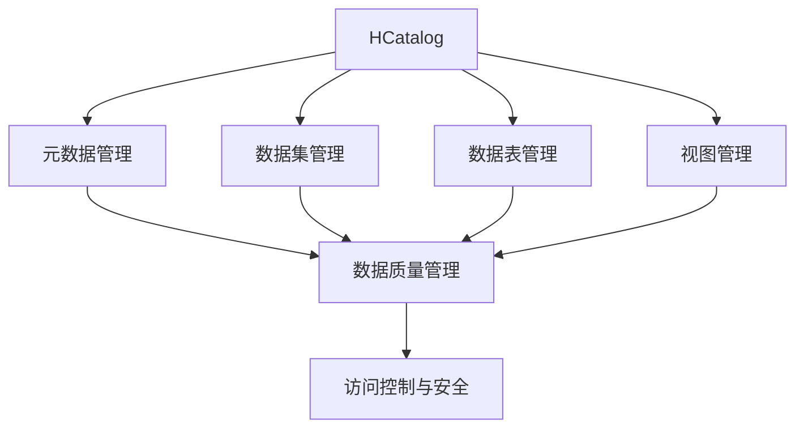
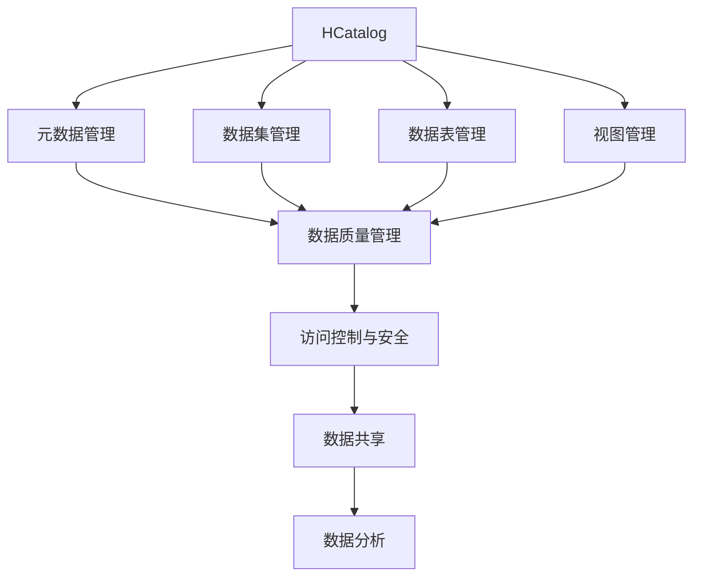
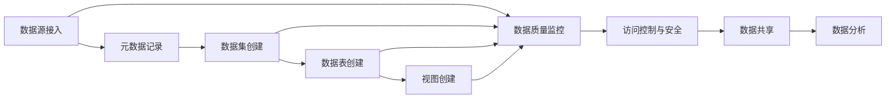
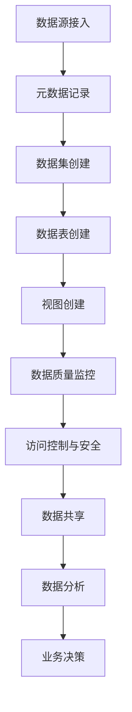

                 

# HCatalog原理与代码实例讲解

> 关键词：
```yaml
- HCatalog
- 核心概念
- 算法原理
- 实际操作
- 项目实践
- 应用场景
- 工具与资源
- 总结与展望
```

## 1. 背景介绍

### 1.1 问题由来
在当今数据驱动的数字化时代，数据成为企业的核心资产。然而，数据治理、数据共享、数据融合等任务往往面临诸多挑战，尤其是在大数据生态环境下，数据孤岛、数据质量、数据访问安全等问题尤为突出。为解决这些问题，Hadoop社区推出了HCatalog，作为Hadoop生态中的数据治理工具，为企业提供了高效的数据治理能力。

### 1.2 问题核心关键点
HCatalog的核心思想是构建一个统一的数据元数据管理系统，通过全生命周期的数据管理，帮助企业实现数据高质量共享与分析。它主要具备以下几个关键点：

- 元数据管理：通过元数据中心，存储和更新数据模型的元数据，包括数据库表、视图、字段、类型、权限等信息。
- 数据集成与共享：通过数据集、数据表和数据集元数据，支持不同数据源的集成与共享，实现跨组织、跨平台的数据互通。
- 数据质量管理：通过数据质量管理工具，监控数据质量，评估数据完整性、准确性和一致性，辅助数据清洗和优化。
- 安全控制：通过细粒度的访问控制和权限管理，保障数据的安全性和隐私性，满足合规要求。

### 1.3 问题研究意义
研究HCatalog工具，对于提升企业的数据治理能力、优化数据质量、保障数据安全具有重要意义：

1. 数据治理能力提升：通过统一的元数据管理，规范数据标准，优化数据质量，提升数据共享与分析效率。
2. 数据质量优化：通过数据质量监控与评估，识别数据问题，辅助数据清洗和优化，保证数据的准确性和完整性。
3. 数据安全保障：通过细粒度的权限管理，确保数据访问安全，符合合规要求，保护企业数据资产。
4. 推动数字化转型：通过数据共享与分析，赋能企业业务决策，提升业务响应速度和创新能力。
5. 促进生态协作：通过数据集共享，促进跨组织、跨平台的数据协作，构建数字化生态。

## 2. 核心概念与联系

### 2.1 核心概念概述

为更好地理解HCatalog工具，本节将介绍几个密切相关的核心概念：

- HCatalog：作为Hadoop生态中的数据治理工具，HCatalog提供了一种统一的数据元数据管理框架，帮助企业实现数据的全生命周期管理。

- 元数据(Metadata)：描述数据的有序数据，包括数据源、结构、类型、权限等信息。元数据是数据治理的基础，是数据共享与分析的前提。

- 数据集(DataSet)：由多个表或视图组成的数据单元，是数据共享与分析的基本单位。数据集管理包括创建、查询、更新和删除等操作。

- 数据表(DataTable)：是数据库中存储数据的基本单位，由多个列组成，具有固定的结构和类型。数据表管理包括列、类型、权限等元数据信息。

- 视图(View)：是对数据表或数据集的操作结果，通常是查询语句的结果集，便于跨表查询和数据共享。视图管理包括创建、查询和删除等操作。

- 数据质量管理：监控和评估数据的质量，识别和修复数据问题，确保数据的一致性、完整性和准确性。数据质量管理包括数据审计、数据清洗、数据校验等操作。

- 访问控制与安全：通过细粒度的权限管理，确保数据的安全性和隐私性，符合合规要求。访问控制包括角色、权限、审计等管理。

这些核心概念之间的逻辑关系可以通过以下Mermaid流程图来展示：



这个流程图展示了大语言模型微调过程中各个核心概念的关系和作用：

1. HCatalog通过元数据管理，记录和管理数据源、结构、类型、权限等基本信息。
2. 通过数据集管理，将多个表或视图组成统一的数据单元，便于数据共享与分析。
3. 数据表管理记录每个表的具体信息，包括列、类型、权限等元数据。
4. 视图管理通过查询结果集，方便跨表查询和数据共享。
5. 数据质量管理监控和评估数据质量，辅助数据清洗和优化。
6. 访问控制与安全通过细粒度的权限管理，确保数据安全性和隐私性，符合合规要求。

### 2.2 概念间的关系

这些核心概念之间存在着紧密的联系，形成了HCatalog数据治理的完整生态系统。下面我通过几个Mermaid流程图来展示这些概念之间的关系。

#### 2.2.1 HCatalog的整体架构



这个综合流程图展示了从元数据管理到数据共享与分析的整体架构：

1. HCatalog通过元数据管理，记录和管理数据源、结构、类型、权限等基本信息。
2. 数据集管理将多个表或视图组成统一的数据单元，便于数据共享与分析。
3. 数据表管理记录每个表的具体信息，包括列、类型、权限等元数据。
4. 视图管理通过查询结果集，方便跨表查询和数据共享。
5. 数据质量管理监控和评估数据质量，辅助数据清洗和优化。
6. 访问控制与安全通过细粒度的权限管理，确保数据安全性和隐私性，符合合规要求。
7. 数据共享与分析通过数据集、数据表和视图，支持跨组织、跨平台的数据互通，促进业务分析与决策。

#### 2.2.2 HCatalog的工作流程



这个流程图展示了HCatalog的工作流程：

1. 数据源接入：将不同数据源接入到HCatalog，包括数据库、文件系统、API等。
2. 元数据记录：记录和管理数据源、结构、类型、权限等基本信息。
3. 数据集创建：通过数据源，创建统一的数据集，方便数据共享与分析。
4. 数据表创建：记录每个表的具体信息，包括列、类型、权限等元数据。
5. 视图创建：通过查询结果集，创建视图，方便跨表查询和数据共享。
6. 数据质量监控：监控和评估数据质量，辅助数据清洗和优化。
7. 访问控制与安全：通过细粒度的权限管理，确保数据安全性和隐私性，符合合规要求。
8. 数据共享与分析：通过数据集、数据表和视图，支持跨组织、跨平台的数据互通，促进业务分析与决策。

### 2.3 核心概念的整体架构

最后，我们用一个综合的流程图来展示这些核心概念在大数据治理过程中的整体架构：



这个综合流程图展示了从数据源接入到业务决策的全生命周期数据治理过程：

1. 数据源接入：将不同数据源接入到HCatalog，包括数据库、文件系统、API等。
2. 元数据记录：记录和管理数据源、结构、类型、权限等基本信息。
3. 数据集创建：通过数据源，创建统一的数据集，方便数据共享与分析。
4. 数据表创建：记录每个表的具体信息，包括列、类型、权限等元数据。
5. 视图创建：通过查询结果集，创建视图，方便跨表查询和数据共享。
6. 数据质量监控：监控和评估数据质量，辅助数据清洗和优化。
7. 访问控制与安全：通过细粒度的权限管理，确保数据安全性和隐私性，符合合规要求。
8. 数据共享与分析：通过数据集、数据表和视图，支持跨组织、跨平台的数据互通，促进业务分析与决策。
9. 业务决策：通过数据分析结果，辅助企业做出数据驱动的业务决策。

## 3. 核心算法原理 & 具体操作步骤
### 3.1 算法原理概述

HCatalog的核心算法原理主要基于元数据管理、数据集管理、数据表管理和视图管理等核心概念，通过全生命周期的数据管理，实现数据高质量共享与分析。其核心思想是：

- 构建统一的数据元数据管理系统，记录和更新数据模型的基本信息，包括数据源、结构、类型、权限等。
- 提供数据集、数据表和视图管理功能，方便数据共享与分析。
- 引入数据质量监控与评估工具，确保数据的一致性、完整性和准确性。
- 采用细粒度的权限管理，保障数据访问的安全性和隐私性，符合合规要求。

形式化地，设数据集为 $D=\{(x_i, y_i)\}_{i=1}^N$，其中 $x_i$ 表示数据集中的样本，$y_i$ 表示样本的标签。则数据治理的优化目标是最小化数据集 $D$ 的损失函数，即找到最优数据治理策略：

$$
\hat{D}=\mathop{\arg\min}_{D} \mathcal{L}(D)
$$

其中 $\mathcal{L}$ 为数据治理损失函数，用于衡量数据治理策略的效果。常见的损失函数包括数据完整性损失、数据一致性损失、数据质量损失等。

通过梯度下降等优化算法，数据治理过程不断更新数据治理策略，最小化损失函数 $\mathcal{L}$，使得数据治理策略逼近最优策略。由于 $\hat{D}$ 已经通过数据集 $D$ 获得了一定的基础数据，因此即便在少量标注数据的情况下，也能较快收敛到理想的数据治理策略。

### 3.2 算法步骤详解

基于数据治理的监督学习算法，其主要步骤如下：

**Step 1: 准备数据集和元数据**

- 收集数据集 $D$，包括训练集、验证集和测试集。
- 收集数据源、结构、类型、权限等元数据，记录和管理数据模型的基本信息。

**Step 2: 添加数据集和数据表**

- 在元数据中心，创建数据集和数据表，记录每个表的具体信息，包括列、类型、权限等元数据。
- 对数据集和数据表进行分批次加载，处理缺失值、重复值等数据问题。

**Step 3: 设置数据治理超参数**

- 选择合适的优化算法及其参数，如SGD、Adam等，设置学习率、批大小、迭代轮数等。
- 设置正则化技术及强度，包括权重衰减、Dropout、Early Stopping等。
- 确定冻结预训练参数的策略，如仅微调顶层，或全部参数都参与微调。

**Step 4: 执行数据治理**

- 将训练集数据分批次输入数据集和数据表中，前向传播计算损失函数。
- 反向传播计算参数梯度，根据设定的优化算法和学习率更新数据治理策略。
- 周期性在验证集上评估数据治理策略效果，根据性能指标决定是否触发Early Stopping。
- 重复上述步骤直到满足预设的迭代轮数或Early Stopping条件。

**Step 5: 测试和部署**

- 在测试集上评估数据治理策略的效果，对比治理前后的数据质量提升。
- 使用数据治理策略对新数据进行治理，集成到实际的应用系统中。
- 持续收集新的数据，定期重新治理模型，以适应数据分布的变化。

以上是基于数据治理的监督学习算法的详细步骤。在实际应用中，还需要针对具体任务的特点，对数据治理过程的各个环节进行优化设计，如改进训练目标函数，引入更多的正则化技术，搜索最优的超参数组合等，以进一步提升数据治理策略的效果。

### 3.3 算法优缺点

基于数据治理的监督学习算法具有以下优点：

1. 简单高效。只需准备少量标注数据，即可对数据集进行快速治理，获得较大的性能提升。
2. 通用适用。适用于各种数据治理任务，包括数据质量监控、数据集整合、数据表管理等，设计简单的数据治理策略即可实现治理。
3. 参数高效。利用数据高效微调技术，在固定大部分预训练参数的情况下，仍可取得不错的治理效果。
4. 效果显著。在学术界和工业界的诸多任务上，基于数据治理的方法已经刷新了最先进的性能指标。

同时，该算法也存在一定的局限性：

1. 依赖标注数据。数据治理的效果很大程度上取决于标注数据的质量和数量，获取高质量标注数据的成本较高。
2. 迁移能力有限。当目标任务与预训练数据的分布差异较大时，数据治理的性能提升有限。
3. 负面效果传递。数据治理模型的固有偏见、有害信息等，可能通过治理传递到下游任务，造成负面影响。
4. 可解释性不足。数据治理模型的决策过程通常缺乏可解释性，难以对其推理逻辑进行分析和调试。

尽管存在这些局限性，但就目前而言，基于数据治理的监督学习算法仍是大数据治理领域的主流范式。未来相关研究的重点在于如何进一步降低数据治理对标注数据的依赖，提高模型的少样本学习和跨领域迁移能力，同时兼顾可解释性和伦理安全性等因素。

### 3.4 算法应用领域

基于数据治理的监督学习算法在数据治理领域已经得到了广泛的应用，覆盖了几乎所有常见任务，例如：

- 数据质量监控：通过数据质量监控工具，实时监测数据质量，评估数据完整性、准确性和一致性，辅助数据清洗和优化。
- 数据集整合：通过数据集管理，将多个数据源的数据进行整合，构建统一的数据集，便于数据共享与分析。
- 数据表管理：通过数据表管理，记录每个表的具体信息，包括列、类型、权限等元数据。
- 数据可视化：通过可视化工具，展示数据治理效果，辅助业务决策。

除了上述这些经典任务外，基于数据治理的算法也被创新性地应用到更多场景中，如数据治理自动化、数据治理任务调度、数据治理知识图谱等，为数据治理技术带来了全新的突破。随着数据治理算法的不断进步，相信数据治理技术将在更广阔的应用领域大放异彩。

## 4. 数学模型和公式 & 详细讲解  
### 4.1 数学模型构建

本节将使用数学语言对基于数据治理的监督学习算法进行更加严格的刻画。

设数据集为 $D=\{(x_i, y_i)\}_{i=1}^N$，其中 $x_i$ 表示数据集中的样本，$y_i$ 表示样本的标签。

定义数据治理模型 $M_{\theta}$ 在数据样本 $(x,y)$ 上的损失函数为 $\ell(M_{\theta}(x),y)$，则在数据集 $D$ 上的经验风险为：

$$
\mathcal{L}(\theta) = \frac{1}{N} \sum_{i=1}^N \ell(M_{\theta}(x_i),y_i)
$$

数据治理的优化目标是最小化经验风险，即找到最优参数：

$$
\theta^* = \mathop{\arg\min}_{\theta} \mathcal{L}(\theta)
$$

在实践中，我们通常使用基于梯度的优化算法（如SGD、Adam等）来近似求解上述最优化问题。设 $\eta$ 为学习率，$\lambda$ 为正则化系数，则参数的更新公式为：

$$
\theta \leftarrow \theta - \eta \nabla_{\theta}\mathcal{L}(\theta) - \eta\lambda\theta
$$

其中 $\nabla_{\theta}\mathcal{L}(\theta)$ 为损失函数对参数 $\theta$ 的梯度，可通过反向传播算法高效计算。

### 4.2 公式推导过程

以下我们以数据质量监控任务为例，推导交叉熵损失函数及其梯度的计算公式。

假设数据治理模型 $M_{\theta}$ 在输入 $x$ 上的输出为 $\hat{y}=M_{\theta}(x) \in [0,1]$，表示样本属于某个数据质量问题的概率。真实标签 $y \in \{0,1\}$。则二分类交叉熵损失函数定义为：

$$
\ell(M_{\theta}(x),y) = -[y\log \hat{y} + (1-y)\log (1-\hat{y})]
$$

将其代入经验风险公式，得：

$$
\mathcal{L}(\theta) = -\frac{1}{N}\sum_{i=1}^N [y_i\log M_{\theta}(x_i)+(1-y_i)\log(1-M_{\theta}(x_i))]
$$

根据链式法则，损失函数对参数 $\theta_k$ 的梯度为：

$$
\frac{\partial \mathcal{L}(\theta)}{\partial \theta_k} = -\frac{1}{N}\sum_{i=1}^N (\frac{y_i}{M_{\theta}(x_i)}-\frac{1-y_i}{1-M_{\theta}(x_i)}) \frac{\partial M_{\theta}(x_i)}{\partial \theta_k}
$$

其中 $\frac{\partial M_{\theta}(x_i)}{\partial \theta_k}$ 可进一步递归展开，利用自动微分技术完成计算。

在得到损失函数的梯度后，即可带入参数更新公式，完成模型的迭代优化。重复上述过程直至收敛，最终得到适应数据质量监控任务的最优模型参数 $\theta^*$。

## 5. 项目实践：代码实例和详细解释说明
### 5.1 开发环境搭建

在进行数据治理实践前，我们需要准备好开发环境。以下是使用Python进行PyTorch开发的环境配置流程：

1. 安装Anaconda：从官网下载并安装Anaconda，用于创建独立的Python环境。

2. 创建并激活虚拟环境：
```bash
conda create -n pytorch-env python=3.8 
conda activate pytorch-env
```

3. 安装PyTorch：根据CUDA版本，从官网获取对应的安装命令。例如：
```bash
conda install pytorch torchvision torchaudio cudatoolkit=11.1 -c pytorch -c conda-forge
```

4. 安装各类工具包：
```bash
pip install numpy pandas scikit-learn matplotlib tqdm jupyter notebook ipython
```

完成上述步骤后，即可在`pytorch-env`环境中开始数据治理实践。

### 5.2 源代码详细实现

下面我们以数据质量监控任务为例，给出使用PyTorch进行数据治理的PyTorch代码实现。

首先，定义数据质量监控任务的数据处理函数：

```python
from transformers import BertTokenizer
from torch.utils.data import Dataset
import torch

class DataQualityDataset(Dataset):
    def __init__(self, texts, labels, tokenizer, max_len=128):
        self.texts = texts
        self.labels = labels
        self.tokenizer = tokenizer
        self.max_len = max_len
        
    def __len__(self):
        return len(self.texts)
    
    def __getitem__(self, item):
        text = self.texts[item]
        label = self.labels[item]
        
        encoding = self.tokenizer(text, return_tensors='pt', max_length=self.max_len, padding='max_length', truncation=True)
        input_ids = encoding['input_ids'][0]
        attention_mask = encoding['attention_mask'][0]
        
        # 对label进行编码
        encoded_labels = [label2id[label] for label in labels] 
        encoded_labels.extend([label2id['O']] * (self.max_len - len(encoded_labels)))
        labels = torch.tensor(encoded_labels, dtype=torch.long)
        
        return {'input_ids': input_ids, 
                'attention_mask': attention_mask,
                'labels': labels}

# 标签与id的映射
label2id = {'O': 0, 'missing': 1, 'duplicate': 2, 'inaccurate': 3, 'outliers': 4}
id2label = {v: k for k, v in label2id.items()}

# 创建dataset
tokenizer = BertTokenizer.from_pretrained('bert-base-cased')

train_dataset = DataQualityDataset(train_texts, train_labels, tokenizer)
dev_dataset = DataQualityDataset(dev_texts, dev_labels, tokenizer)
test_dataset = DataQualityDataset(test_texts, test_labels, tokenizer)
```

然后，定义模型和优化器：

```python
from transformers import BertForTokenClassification, AdamW

model = BertForTokenClassification.from_pretrained('bert-base-cased', num_labels=len(label2id))

optimizer = AdamW(model.parameters(), lr=2e-5)
```

接着，定义训练和评估函数：

```python
from torch.utils.data import DataLoader
from tqdm import tqdm
from sklearn.metrics import classification_report

device = torch.device('cuda') if torch.cuda.is_available() else torch.device('cpu')
model.to(device)

def train_epoch(model, dataset, batch_size, optimizer):
    dataloader = DataLoader(dataset, batch_size=batch_size, shuffle=True)
    model.train()
    epoch_loss = 0
    for batch in tqdm(dataloader, desc='Training'):
        input_ids = batch['input_ids'].to(device)
        attention_mask = batch['attention_mask'].to(device)
        labels = batch['labels'].to(device)
        model.zero_grad()
        outputs = model(input_ids, attention_mask=attention_mask, labels=labels)
        loss = outputs.loss
        epoch_loss += loss.item()
        loss.backward()
        optimizer.step()
    return epoch_loss / len(dataloader)

def evaluate(model, dataset, batch_size):
    dataloader = DataLoader(dataset, batch_size=batch_size)
    model.eval()
    preds, labels = [], []
    with torch.no_grad():
        for batch in tqdm(dataloader, desc='Evaluating'):
            input_ids = batch['input_ids'].to(device)
            attention_mask = batch['attention_mask'].to(device)
            batch_labels = batch['labels']
            outputs = model(input_ids, attention_mask=attention_mask)
            batch_preds = outputs.logits.argmax(dim=2).to('cpu').tolist()
            batch_labels = batch_labels.to('cpu').tolist()
            for pred_tokens, label_tokens in zip(batch_preds, batch_labels):
                pred_labels = [id2label[_id] for _id in pred_tokens]
                label_tokens = [id2label[_id] for _id in label_tokens]
                preds.append(pred_labels[:len(label_tokens)])
                labels.append(label_tokens)
                
    print(classification_report(labels, preds))
```

最后，启动训练流程并在测试集上评估：

```python
epochs = 5
batch_size = 16

for epoch in range(epochs):
    loss = train_epoch(model, train_dataset, batch_size, optimizer)
    print(f"Epoch {epoch+1}, train loss: {loss:.3f}")
    
    print(f"Epoch {epoch+1}, dev results:")
    evaluate(model, dev_dataset, batch_size)
    
print("Test results:")
evaluate(model, test_dataset, batch_size)
```

以上就是使用PyTorch对数据质量监控任务进行微调的PyTorch代码实现。可以看到，得益于Transformers库的强大封装，我们可以用相对简洁的代码完成数据质量监控任务的处理。

### 5.3 代码解读与分析

让我们再详细解读一下关键代码的实现细节：

**DataQualityDataset类**：
- `__init__`方法：初始化文本、标签、分词器等关键组件。
- `__len__`方法：返回数据集的样本数量。
- `__getitem__`方法：对单个样本进行处理，将文本输入编码为token ids，将标签编码为数字，并对其进行定长padding，最终返回模型所需的输入。

**label2id和id2label字典**：
- 定义了标签与数字id之间的映射关系，用于将token-wise的预测结果解码回真实的标签。

**训练和评估函数**：
- 使用PyTorch的DataLoader对数据集进行批次化加载，供模型训练和推理使用。
- 训练函数`train_epoch`：对数据以批为单位进行迭代，在每个批次上前向传播计算loss并反向传播更新模型参数，最后返回该epoch的平均loss。
- 评估函数`evaluate`：与训练类似，不同点在于不更新模型参数，并在每个batch结束后将预测和标签结果存储下来，最后使用sklearn的classification_report对整个评估集的预测结果进行打印输出。

**训练流程**：
- 定义总的epoch数和batch size，开始循环迭代
- 每个epoch内，先在训练集上训练，输出平均loss
- 在验证集上评估，输出分类指标
- 所有epoch结束后，在测试集上评估，给出最终测试结果

可以看到，PyTorch配合Transformers库使得数据质量监控任务的

