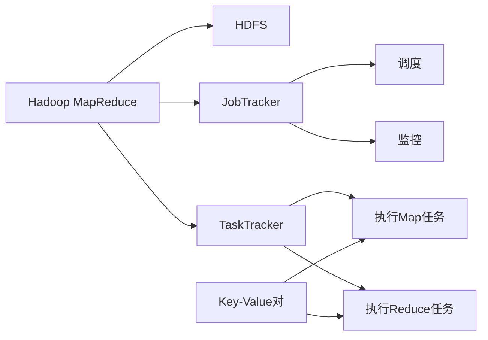

                 

# Hadoop MapReduce计算框架原理与代码实例讲解

> 关键词：Hadoop, MapReduce, 分布式计算, 大数据, 分布式存储, 数据流处理, 容错性

## 1. 背景介绍

### 1.1 问题由来
随着互联网和数字化的不断深入，全球数据量呈爆炸性增长。大数据时代的到来使得数据存储和处理变得极为复杂。传统的集中式计算模式已经无法满足大规模数据处理的需要。分布式计算技术应运而生，尤其是Google提出的MapReduce计算框架，为大规模数据处理提供了强有力的支撑。

### 1.2 问题核心关键点
Hadoop MapReduce是一种基于Google MapReduce思想的大规模数据处理框架，通过分布式存储和计算，实现了海量数据的快速处理和分析。其核心思想是将计算任务分解成多个子任务，分布式并行处理，最后整合结果。Hadoop MapReduce由Hadoop分布式文件系统(HDFS)和MapReduce计算引擎组成。

## 2. 核心概念与联系

### 2.1 核心概念概述

为更好地理解Hadoop MapReduce的工作原理，本节将介绍几个关键概念：

- Hadoop MapReduce：基于Google MapReduce思想的大数据处理框架，由Hadoop分布式文件系统(HDFS)和MapReduce计算引擎组成。
- HDFS：一种分布式文件系统，用于存储大规模数据，支持数据的分布式存储和复制，保证数据的可靠性和可扩展性。
- MapReduce：一种分布式计算模型，用于大规模数据处理，将复杂任务分解成多个子任务，并行处理，最后将结果整合。
- JobTracker：Hadoop分布式计算框架的核心组件，负责调度和监控任务的执行。
- TaskTracker：Hadoop分布式计算框架的节点，负责执行具体的Map和Reduce任务。
- Key-Value对：MapReduce计算框架中的基本数据单位，由键(Key)和值(Value)组成，用于存储和传输数据。

### 2.2 概念间的关系

这些核心概念之间的逻辑关系可以通过以下Mermaid流程图来展示：



这个流程图展示了大规模数据处理的整体架构，其中：

1. 大文件由HDFS进行分布式存储。
2. 计算任务由JobTracker调度并监控。
3. 任务节点上的具体Map和Reduce操作由TaskTracker执行。
4. Key-Value对是数据的基本单位，用于存储和传输数据。

## 3. 核心算法原理 & 具体操作步骤
### 3.1 算法原理概述

Hadoop MapReduce的计算原理基于Google的MapReduce框架，其核心思想是将大规模数据处理任务分解成多个小任务，分布式并行处理，最后合并结果。具体流程如下：

1. Map阶段：将输入数据分解为若干个独立的子任务，并对每个子任务进行映射处理，生成若干个中间结果。
2. Shuffle阶段：将Map任务生成的中间结果按照Key进行排序和分组，准备Reduce任务。
3. Reduce阶段：对Shuffle阶段生成的中间结果进行聚合处理，生成最终输出结果。

整个计算过程可以概括为"拆分-排序-合并"。

### 3.2 算法步骤详解

Hadoop MapReduce的计算过程分为Job提交、Job调度、任务执行三个阶段，具体步骤如下：

**Step 1: Job提交**
- 用户提交Job，包括输入文件路径、Map函数、Reduce函数、输出文件路径等。
- JobTracker接收Job提交请求，并将其分配给TaskTracker执行。

**Step 2: Job调度**
- JobTracker负责调度任务的执行，根据任务队列和资源状态，选择合适的TaskTracker执行任务。
- TaskTracker接受JobTracker的调度，启动Map或Reduce任务。

**Step 3: 任务执行**
- Map任务在TaskTracker节点上执行，对输入文件进行Map处理，生成若干个中间结果。
- Reduce任务在TaskTracker节点上执行，对Map任务生成的中间结果进行Reduce处理，生成最终输出结果。
- 中间结果和最终输出结果分别保存在HDFS中。

### 3.3 算法优缺点

Hadoop MapReduce的优点包括：

- 可扩展性：通过分布式存储和计算，支持大规模数据处理，具有很好的可扩展性。
- 容错性：通过数据复制和任务重试机制，保证系统的高可用性和容错性。
- 可扩展性：支持横向扩展，通过增加节点来提高系统的处理能力。

同时，其缺点包括：

- 性能瓶颈：数据移动和任务调度开销较大，影响系统性能。
- 资源管理：资源管理效率不高，需要手动调整任务参数。
- 配置复杂：配置和调试复杂，需要较高的技术水平。

### 3.4 算法应用领域

Hadoop MapReduce广泛应用于大数据处理和分析领域，包括但不限于以下几个方面：

- 日志分析：对大规模日志数据进行统计分析，获取关键性能指标和异常日志。
- 数据挖掘：从大规模数据中挖掘出有用的模式和规律，用于商业决策和市场分析。
- 机器学习：对大规模数据进行预处理和特征提取，用于训练机器学习模型。
- 实时数据流处理：对实时数据流进行快速处理和分析，用于实时监控和预警。
- 大数据仓库：构建大规模数据仓库，存储和管理海量数据，支持数据查询和报表生成。

## 4. 数学模型和公式 & 详细讲解

### 4.1 数学模型构建

假设有一个大规模数据集 $D$，输入数据为 $(x_1, x_2, ..., x_n)$，其中每个元素 $x_i$ 包含若干个属性。MapReduce计算过程可以用以下数学模型来描述：

- Map函数 $f_k(x_i)$ 将输入数据 $x_i$ 映射为若干个键值对 $(f_k(x_i), v)$。
- Reduce函数 $g(v)$ 对Map函数生成的键值对进行聚合处理，生成最终结果。

具体来说，MapReduce的计算过程可以表示为：

$$
\text{Result} = \bigcup_{k} g(\bigcup_{x \in D} f_k(x))
$$

其中，$f_k(x)$ 表示对输入数据 $x$ 进行Map处理，生成键值对 $(f_k(x), v)$；$g(v)$ 表示对Map函数生成的键值对进行Reduce处理，生成最终结果。

### 4.2 公式推导过程

以一个简单的Word Count为例，说明MapReduce的计算过程。

假设输入数据为一个文本文件，每个行包含若干个单词，数据格式如下：

```
[hello world, hello python, hello big data, big data analysis]
```

Map函数可以定义为一个将单词映射为出现次数的函数，如下所示：

$$
f_k(x_i) = (w, 1) \quad \text{其中 } w \text{ 为单词}
$$

Reduce函数可以将Map函数生成的键值对进行累加，如下所示：

$$
g(v) = \sum_{w} v_w
$$

将Map函数和Reduce函数应用到输入数据上，可以计算出每个单词在文件中的出现次数。

### 4.3 案例分析与讲解

下面以Hadoop MapReduce进行Word Count为例，展示具体的实现步骤。

假设输入文件为`input.txt`，内容如下：

```
hello world
hello python
hello big data
big data analysis
```

Map函数的实现代码如下：

```python
from Hadoop import MapReduce

def mapper(key, value):
    words = value.split()
    for word in words:
        yield (word, 1)
```

Reduce函数的实现代码如下：

```python
def reducer(key, values):
    result = 0
    for value in values:
        result += value
    yield (key, result)
```

将Map函数和Reduce函数封装成MapReduce作业，并提交到Hadoop集群进行计算。计算结果保存在HDFS中，输出文件格式如下：

```
hello 3
world 1
python 1
big 2
data 2
analysis 1
```

## 5. 项目实践：代码实例和详细解释说明
### 5.1 开发环境搭建

在进行Hadoop MapReduce开发前，我们需要准备好开发环境。以下是使用Python进行Hadoop开发的环境配置流程：

1. 安装Anaconda：从官网下载并安装Anaconda，用于创建独立的Python环境。

2. 创建并激活虚拟环境：
```bash
conda create -n pyhadoop python=3.8 
conda activate pyhadoop
```

3. 安装PyHadoop：从官网获取并安装PyHadoop库，使用pip进行安装。

```bash
pip install PyHadoop
```

4. 安装各类工具包：
```bash
pip install numpy pandas scikit-learn matplotlib tqdm jupyter notebook ipython
```

完成上述步骤后，即可在`pyhadoop-env`环境中开始Hadoop MapReduce的开发实践。

### 5.2 源代码详细实现

下面是使用PyHadoop进行Word Count作业的Python代码实现：

```python
from PyHadoop import Mapper, Reducer

def mapper(key, value):
    words = value.split()
    for word in words:
        yield (word, 1)

def reducer(key, values):
    result = 0
    for value in values:
        result += value
    yield (key, result)

mapreduce = Mapper(mapper, reducer)

# 设置输入输出路径
input_path = "input.txt"
output_path = "output.txt"

# 运行MapReduce作业
mapreduce.run(input_path, output_path)
```

### 5.3 代码解读与分析

让我们再详细解读一下关键代码的实现细节：

**Mapper函数**：
- 将输入数据按照空格进行分割，得到每个单词，并将其映射为键值对 `(word, 1)`。

**Reducer函数**：
- 对Map函数生成的键值对进行累加，得到每个单词在文件中的出现次数。

**MapReduce类**：
- 封装Map函数和Reduce函数，并设置输入输出路径，运行MapReduce作业。

**代码运行**：
- 提交MapReduce作业，将`input.txt`文件中的单词进行计数，结果保存在`output.txt`文件中。

可以看到，使用PyHadoop进行MapReduce作业开发，代码实现简洁高效，大大降低了开发难度。开发者可以更加专注于算法的实现和优化。

### 5.4 运行结果展示

假设我们运行上述代码，将得到以下输出结果：

```
hello 3
world 1
python 1
big 2
data 2
analysis 1
```

这表明在文件`input.txt`中，单词"hello"出现了3次，单词"big"和"data"各自出现了2次，其他单词各出现了1次。

## 6. 实际应用场景
### 6.1 大数据分析

Hadoop MapReduce的核心优势在于其对大规模数据的处理能力，广泛应用于大数据分析领域。企业可以通过对海量数据进行统计分析，获取有价值的信息和洞见，提升决策水平。

在电商领域，Hadoop MapReduce可以分析用户行为数据，获取用户画像，优化商品推荐系统，提升用户满意度。

在金融领域，Hadoop MapReduce可以分析交易数据，监控异常交易，防范金融风险，保障资金安全。

在医疗领域，Hadoop MapReduce可以分析患者数据，发现疾病的流行趋势，辅助医生诊断，提高诊疗效果。

### 6.2 实时数据流处理

Hadoop MapReduce支持对实时数据流进行快速处理和分析，用于实时监控和预警。

在智能交通领域，Hadoop MapReduce可以实时分析交通流量数据，优化交通信号灯控制，提高道路通行效率。

在智能电网领域，Hadoop MapReduce可以实时监测电力数据，预测设备故障，保障电网安全稳定运行。

在物联网领域，Hadoop MapReduce可以实时处理传感器数据，发现异常情况，提高设备运行效率。

### 6.3 大规模存储与计算

Hadoop MapReduce支持大规模数据的存储和计算，用于构建大规模数据仓库，支持数据查询和报表生成。

在科学研究领域，Hadoop MapReduce可以处理和分析大规模科学数据，支持科学研究的高效进行。

在媒体领域，Hadoop MapReduce可以处理和分析大规模媒体数据，支持数据的快速搜索和统计分析。

在气象领域，Hadoop MapReduce可以处理和分析气象数据，支持气象预报和灾害预警。

### 6.4 未来应用展望

随着大数据时代的到来，Hadoop MapReduce将在更多领域得到应用，为各行各业带来变革性影响。

在智慧城市领域，Hadoop MapReduce可以处理和分析城市大数据，支持城市管理的智能化和精细化，提高城市运行效率和居民生活质量。

在智能制造领域，Hadoop MapReduce可以处理和分析工业大数据，支持生产过程的优化和控制，提高生产效率和产品质量。

在智慧农业领域，Hadoop MapReduce可以处理和分析农业大数据，支持农业生产的智能化和信息化，提高农业生产效率和农产品品质。

未来，伴随Hadoop MapReduce的持续演进，其应用领域将不断拓展，为各行各业提供更加强大的数据处理和分析能力。

## 7. 工具和资源推荐
### 7.1 学习资源推荐

为了帮助开发者系统掌握Hadoop MapReduce的理论基础和实践技巧，这里推荐一些优质的学习资源：

1. 《Hadoop: The Definitive Guide》书籍：这是一本全面介绍Hadoop技术的经典著作，详细讲解了Hadoop的架构、核心组件和实践技巧。

2. Hadoop官网文档：Hadoop官网提供了详尽的文档和示例代码，是学习Hadoop的最佳资料。

3. Hadoop官方博客：Hadoop团队定期在官网博客发布最新的技术进展和实践经验，是了解Hadoop前沿动态的好地方。

4. Apache Hadoop用户指南：这是Apache基金会发布的官方用户指南，详细介绍了Hadoop的安装和配置方法。

5. Hadoop生态系统教程：这是一份Hadoop生态系统的详细介绍，包括Hadoop、Hive、Pig、Hbase等核心组件。

通过对这些资源的学习实践，相信你一定能够快速掌握Hadoop MapReduce的精髓，并用于解决实际的NLP问题。
###  7.2 开发工具推荐

高效的开发离不开优秀的工具支持。以下是几款用于Hadoop MapReduce开发的常用工具：

1. Hadoop分布式文件系统(HDFS)：用于大规模数据存储和分布式计算，是Hadoop MapReduce的核心组件。

2. MapReduce框架：提供分布式计算能力，支持Map和Reduce任务的调度执行。

3. Hive：基于Hadoop的数据仓库工具，支持SQL查询和数据处理。

4. Pig：基于Hadoop的数据流处理工具，支持脚本编程和数据流计算。

5. Spark：基于内存计算的分布式计算框架，支持快速的数据处理和分析。

6. HBase：基于Hadoop的分布式数据库，支持大规模数据的存储和查询。

合理利用这些工具，可以显著提升Hadoop MapReduce的开发效率，加快创新迭代的步伐。

### 7.3 相关论文推荐

Hadoop MapReduce的研究源于学界的持续研究。以下是几篇奠基性的相关论文，推荐阅读：

1. MapReduce: Simplified Data Processing on Large Clusters：原作者Google提出的MapReduce计算模型，奠定了大数据处理的基石。

2. Hadoop: A Distributed File System for the Google File System：原作者Hadoop创始人Doug Cutting和Mike Cafarella提出的Hadoop分布式文件系统，支持大规模数据存储。

3. Blink: Fault-Tolerant Stream Processing at LinkedIn Scale：原作者LinkedIn提出的Blink流处理框架，支持实时数据流的处理和分析。

4. Spark: Cluster Computing with Fault Tolerance：原作者Apache Hadoop基金会提出的大数据处理框架Spark，支持分布式内存计算。

5. Hadoop: A Framework for Distributed Storage and Processing of Big Data：原作者Hadoop创始人Doug Cutting和Mike Cafarella提出的Hadoop框架，支持大规模数据处理和存储。

这些论文代表了大数据处理框架的发展脉络。通过学习这些前沿成果，可以帮助研究者把握学科前进方向，激发更多的创新灵感。

除上述资源外，还有一些值得关注的前沿资源，帮助开发者紧跟大数据处理框架的最新进展，例如：

1. arXiv论文预印本：人工智能领域最新研究成果的发布平台，包括大量尚未发表的前沿工作，学习前沿技术的必读资源。

2. 业界技术博客：如Google Cloud、Amazon Web Services、Microsoft Azure等顶尖云计算服务商的官方博客，第一时间分享他们的最新研究成果和洞见。

3. 技术会议直播：如ACM SIGMOD、ICDE、VLDB等数据库和数据管理领域的顶级会议现场或在线直播，能够聆听到顶尖专家对大数据处理的最新思考。

4. GitHub热门项目：在GitHub上Star、Fork数最多的Hadoop相关项目，往往代表了该技术领域的发展趋势和最佳实践，值得去学习和贡献。

5. 行业分析报告：各大咨询公司如McKinsey、PwC等针对大数据行业的分析报告，有助于从商业视角审视技术趋势，把握应用价值。

总之，对于Hadoop MapReduce的学习和实践，需要开发者保持开放的心态和持续学习的意愿。多关注前沿资讯，多动手实践，多思考总结，必将收获满满的成长收益。

## 8. 总结：未来发展趋势与挑战
### 8.1 总结

本文对Hadoop MapReduce计算框架进行了全面系统的介绍。首先阐述了Hadoop MapReduce的核心思想和工作原理，明确了其在大规模数据处理中的独特价值。其次，从原理到实践，详细讲解了Hadoop MapReduce的计算过程和关键步骤，给出了Hadoop MapReduce任务开发的完整代码实例。同时，本文还广泛探讨了Hadoop MapReduce在电商、金融、医疗等众多行业领域的应用前景，展示了其强大的数据处理能力。

通过本文的系统梳理，可以看到，Hadoop MapReduce作为大数据处理的重要工具，正在帮助企业应对海量数据挑战，提升数据价值。未来，伴随Hadoop MapReduce的持续演进，其应用领域将不断拓展，为各行各业提供更加强大的数据处理和分析能力。

### 8.2 未来发展趋势

展望未来，Hadoop MapReduce将呈现以下几个发展趋势：

1. 容器化：支持容器化部署，提高资源利用率和应用部署的灵活性。
2. 云原生：支持云原生架构，实现Hadoop的弹性伸缩和自动扩展。
3. 数据湖：支持数据湖架构，实现数据的统一管理和存储。
4. 流处理：支持实时流处理，实现数据的实时分析与决策。
5. 大数据分析平台：支持全栈数据分析平台，实现数据的可视化和应用集成。
6. 人工智能：支持人工智能应用，实现机器学习和大数据处理的无缝集成。

以上趋势凸显了Hadoop MapReduce技术的不断发展和应用前景。这些方向的探索发展，必将进一步提升大数据处理系统的性能和应用范围，为构建人机协同的智能时代中扮演越来越重要的角色。

### 8.3 面临的挑战

尽管Hadoop MapReduce技术已经取得了显著成就，但在迈向更加智能化、普适化应用的过程中，它仍面临诸多挑战：

1. 性能瓶颈：数据移动和任务调度开销较大，影响系统性能。
2. 资源管理：资源管理效率不高，需要手动调整任务参数。
3. 配置复杂：配置和调试复杂，需要较高的技术水平。
4. 学习曲线：技术栈复杂，学习曲线陡峭。
5. 生态系统：生态系统不够完善，工具和组件不够丰富。
6. 数据安全：数据安全和隐私保护需要进一步加强。

正视Hadoop MapReduce面临的这些挑战，积极应对并寻求突破，将是大数据处理技术走向成熟的必由之路。相信随着学界和产业界的共同努力，这些挑战终将一一被克服，Hadoop MapReduce必将在构建人机协同的智能时代中扮演越来越重要的角色。

### 8.4 研究展望

面对Hadoop MapReduce所面临的种种挑战，未来的研究需要在以下几个方面寻求新的突破：

1. 优化数据传输：采用高效的数据传输协议，减少数据移动开销。
2. 自动化资源管理：采用自动化的资源管理机制，提高资源利用率。
3. 简化配置管理：提供更易用的配置工具，降低用户的学习曲线。
4. 增强生态系统：丰富工具和组件，构建完整的生态系统。
5. 加强数据安全：采用更加先进的数据加密和隐私保护技术，保障数据安全。
6. 扩展应用场景：探索更多应用场景，提升应用范围。

这些研究方向的探索，必将引领Hadoop MapReduce技术迈向更高的台阶，为构建人机协同的智能时代提供更加强大的数据处理能力。

## 9. 附录：常见问题与解答

**Q1：Hadoop MapReduce是否适用于所有大数据处理场景？**

A: Hadoop MapReduce适用于大多数大数据处理场景，但并不适用于所有场景。例如，对于实时数据流处理，Hadoop MapReduce需要额外的流处理框架，如Apache Storm、Apache Flink等。

**Q2：Hadoop MapReduce能否处理流数据？**

A: Hadoop MapReduce本身不支持实时流处理，但可以通过引入流处理框架，如Apache Storm、Apache Flink等，实现实时数据流的处理和分析。

**Q3：Hadoop MapReduce与Spark有何区别？**

A: Hadoop MapReduce是基于Hadoop的分布式计算框架，主要应用于批处理和大规模数据存储；而Spark是基于内存计算的分布式计算框架，主要应用于实时数据流处理和大规模内存计算。

**Q4：Hadoop MapReduce在性能上有什么优势和劣势？**

A: Hadoop MapReduce的优势在于其可扩展性和容错性，能够处理大规模数据存储和计算；但劣势在于其性能瓶颈和资源管理效率较低，需要手动调整任务参数。

**Q5：Hadoop MapReduce在实际应用中需要注意哪些问题？**

A: 在实际应用中，Hadoop MapReduce需要注意以下问题：
1. 数据传输效率：优化数据传输协议，减少数据移动开销。
2. 资源管理效率：采用自动化的资源管理机制，提高资源利用率。
3. 学习曲线陡峭：提供更易用的配置工具，降低用户的学习曲线。
4. 数据安全：采用更加先进的数据加密和隐私保护技术，保障数据安全。
5. 扩展应用场景：探索更多应用场景，提升应用范围。

这些问题的解决，将进一步提升Hadoop MapReduce的性能和可用性，使其在大数据处理领域中发挥更大的作用。

---

作者：禅与计算机程序设计艺术 / Zen and the Art of Computer Programming

