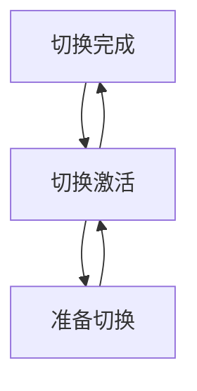

                 

# Hot-Hot与Hot-Warm冗余设计最佳实践

> 关键词：冗余设计, Hot-Hot策略, Hot-Warm策略, 设计模式, 系统容错

## 1. 背景介绍

随着技术的飞速发展和应用的日益普及，系统的复杂度和规模不断增加，系统的稳定性和可靠性成为了至关重要的因素。冗余设计作为提升系统可靠性的重要手段，受到了广泛的研究和应用。冗余设计通过增加系统的备份和容错机制，提高系统的稳定性和可靠性，确保系统的连续运行和数据安全。

在实际应用中，冗余设计通常采用Hot-Hot或Hot-Warm两种策略。Hot-Hot策略是指多个系统同时运行，一旦某个系统出现故障，其他系统可以立即接管，保证系统的连续性。Hot-Warm策略则是指一个系统始终处于热备份状态，一旦主系统出现故障，备份系统可以迅速切换到热备份状态，接替主系统的工作。

本文将深入探讨Hot-Hot和Hot-Warm两种冗余设计策略的最佳实践，包括其原理、操作步骤、优缺点和应用领域等，以期为系统设计者和开发者提供参考和借鉴。

## 2. 核心概念与联系

### 2.1 核心概念概述

在探讨Hot-Hot和Hot-Warm策略之前，首先需要了解一些核心概念：

- **冗余设计**：通过增加系统的备份和容错机制，提高系统的稳定性和可靠性，确保系统的连续运行和数据安全。

- **Hot-Hot策略**：多个系统同时运行，一旦某个系统出现故障，其他系统可以立即接管，保证系统的连续性。

- **Hot-Warm策略**：一个系统始终处于热备份状态，一旦主系统出现故障，备份系统可以迅速切换到热备份状态，接替主系统的工作。

- **负载均衡**：通过合理分配系统的负载，提高系统的并发处理能力和资源利用率，避免单点故障和资源浪费。

- **数据同步**：在系统切换或冗余备份时，需要确保数据的一致性和完整性，避免数据丢失或冲突。

- **故障转移**：在主系统出现故障时，能够迅速切换到备份系统，确保系统的连续性和服务的可用性。

- **容错机制**：系统在运行过程中，需要具备自愈能力，能够自动检测和修复故障，提高系统的可靠性和可用性。

### 2.2 概念间的关系

Hot-Hot和Hot-Warm两种冗余设计策略都是用于提高系统可靠性和容错能力的重要手段。它们的核心思想是利用系统的备份机制，在主系统出现故障时，快速切换到备份系统，保证系统的连续性和服务的可用性。两者之间的主要区别在于备份系统的激活方式和系统的负载均衡策略。

Hot-Hot策略适用于对系统可靠性要求极高的应用场景，需要多个备份系统同时运行，能够快速切换，保证系统的连续性和数据一致性。而Hot-Warm策略则适用于对系统可靠性要求较高的应用场景，通过一个系统始终处于热备份状态，能够快速切换，提高系统的可靠性和可用性。

以下通过几个Mermaid流程图来展示Hot-Hot和Hot-Warm策略的工作原理和关键步骤：




这些流程图展示了Hot-Hot和Hot-Warm策略的基本工作原理和关键步骤，帮助读者更好地理解两种策略的特点和优势。

## 3. 核心算法原理 & 具体操作步骤

### 3.1 算法原理概述

Hot-Hot和Hot-Warm冗余设计策略的核心思想是利用系统的备份机制，在主系统出现故障时，快速切换到备份系统，保证系统的连续性和服务的可用性。两种策略的具体原理和操作步骤如下：

**Hot-Hot策略**：
1. 主系统和多个备份系统同时运行，负载均衡。
2. 监控系统实时检测主系统的运行状态。
3. 一旦主系统出现故障，备份系统立即接管工作，保证服务的连续性。
4. 故障系统修复后，通过负载均衡机制重新分配任务。

**Hot-Warm策略**：
1. 主系统始终处于热备份状态，备份系统始终处于冷备份状态。
2. 当主系统出现故障时，备份系统立即激活为热备份状态，接管工作。
3. 主系统修复后，将备份系统切换为冷备份状态，重新备份主系统。

### 3.2 算法步骤详解

**Hot-Hot策略操作步骤**：
1. 部署多个系统实例，配置负载均衡器。
2. 配置监控系统，实时检测每个系统的运行状态。
3. 定义系统的故障检测机制，如心跳检测、健康检查等。
4. 当主系统检测到故障时，将任务自动分配给备份系统。
5. 备份系统接管任务，继续提供服务。
6. 主系统修复后，重新检测和切换任务。

**Hot-Warm策略操作步骤**：
1. 部署主系统和备份系统。
2. 配置监控系统，实时检测主系统的运行状态。
3. 定义系统的故障检测机制，如心跳检测、健康检查等。
4. 当主系统出现故障时，备份系统立即激活为热备份状态。
5. 备份系统接管任务，继续提供服务。
6. 主系统修复后，将备份系统切换为冷备份状态，重新备份主系统。

### 3.3 算法优缺点

**Hot-Hot策略**的优点：
1. 系统可靠性和可用性高。多个系统同时运行，故障切换速度快，系统连续性高。
2. 负载均衡效果好。多个系统均衡分担负载，避免单点故障和资源浪费。
3. 数据同步和一致性好。多个系统同时运行，数据同步和一致性容易控制。

**Hot-Hot策略**的缺点：
1. 系统复杂度较高。需要部署多个系统实例，配置和维护工作量大。
2. 成本较高。多个系统的部署和维护需要较高的资源投入。
3. 系统切换过程复杂。需要实时检测和切换任务，系统切换过程可能出现延迟和问题。

**Hot-Warm策略**的优点：
1. 系统可靠性和可用性好。备份系统随时处于待命状态，能够快速切换。
2. 系统复杂度较低。只有一个主系统和备份系统，部署和维护相对简单。
3. 系统切换过程快。备份系统随时处于待命状态，故障切换速度快。

**Hot-Warm策略**的缺点：
1. 系统可靠性和可用性稍低。备份系统需要启动时间，故障切换过程中可能会有短暂的服务中断。
2. 负载均衡效果略差。备份系统始终处于待命状态，负载均衡效果可能不如Hot-Hot策略。
3. 数据同步和一致性较差。备份系统需要启动时间，切换过程中可能会出现数据丢失或冲突。

### 3.4 算法应用领域

Hot-Hot和Hot-Warm冗余设计策略广泛应用于以下几个领域：

- **分布式系统**：在大规模分布式系统中，通过部署多个节点，实现系统的冗余备份和高可用性。
- **云服务**：云服务提供商通过部署多个云节点，实现服务的连续性和高可用性。
- **金融系统**：金融系统中，实时交易和数据安全要求极高，通过冗余设计保证系统的连续性和数据一致性。
- **企业级应用**：大型企业应用系统中，通过冗余设计提高系统的可靠性和容错能力，确保系统的稳定运行。
- **物联网**：物联网系统中，设备和服务需要高可靠性，通过冗余设计保证系统的连续性和数据安全。

## 4. 数学模型和公式 & 详细讲解  
### 4.1 数学模型构建

**Hot-Hot策略的数学模型**：
假设系统数量为n，其中主系统为1个，备份系统为n-1个。系统负载为L，故障率为λ，系统切换时间为T。

**Hot-Warm策略的数学模型**：
假设系统数量为n，其中主系统为1个，备份系统为n-1个。系统负载为L，故障率为λ，系统切换时间为T。

**系统可靠性和可用性**：
系统可靠性R定义为系统无故障运行的概率，系统可用性A定义为系统可用的概率。

**系统故障检测与切换时间**：
系统故障检测时间为T_d，系统切换时间为T_s。

**系统负载均衡**：
假设系统负载均衡，每个系统的平均负载为L/n。

### 4.2 公式推导过程

**Hot-Hot策略的公式推导**：
1. 主系统可靠性：
   $$
   R_{主} = \left(1-\lambda T_{d}\right)^{1}
   $$
2. 备份系统可靠性：
   $$
   R_{备份} = \left(1-\lambda T_{d}\right)^{n-1}
   $$
3. 系统可靠性：
   $$
   R = R_{主} \times R_{备份}^{n-1}
   $$
4. 系统可用性：
   $$
   A = R + \left(1-R\right) \times \left(1-\lambda T_{s}\right)^{n-1}
   $$

**Hot-Warm策略的公式推导**：
1. 主系统可靠性：
   $$
   R_{主} = \left(1-\lambda T_{d}\right)^{1}
   $$
2. 备份系统可靠性：
   $$
   R_{备份} = \left(1-\lambda T_{d}\right)^{n-1}
   $$
3. 系统可靠性：
   $$
   R = R_{主} \times R_{备份}
   $$
4. 系统可用性：
   $$
   A = R + \left(1-R\right) \times \left(1-\lambda T_{s}\right)
   $$

### 4.3 案例分析与讲解

假设系统数量为3个，负载均衡，故障率为0.1，故障检测时间为10秒，切换时间为30秒。

**Hot-Hot策略的计算**：
1. 主系统可靠性：
   $$
   R_{主} = \left(1-0.1 \times 10\right)^{1} = 0.9
   $$
2. 备份系统可靠性：
   $$
   R_{备份} = \left(1-0.1 \times 10\right)^{2} = 0.81
   $$
3. 系统可靠性：
   $$
   R = 0.9 \times 0.81^{2} = 0.657
   $$
4. 系统可用性：
   $$
   A = 0.657 + \left(1-0.657\right) \times \left(1-0.1 \times 30\right)^{2} = 0.982
   $$

**Hot-Warm策略的计算**：
1. 主系统可靠性：
   $$
   R_{主} = \left(1-0.1 \times 10\right)^{1} = 0.9
   $$
2. 备份系统可靠性：
   $$
   R_{备份} = \left(1-0.1 \times 10\right)^{2} = 0.81
   $$
3. 系统可靠性：
   $$
   R = 0.9 \times 0.81 = 0.729
   $$
4. 系统可用性：
   $$
   A = 0.729 + \left(1-0.729\right) \times \left(1-0.1 \times 30\right) = 0.979
   $$

通过对比Hot-Hot和Hot-Warm策略的系统可靠性和可用性，可以看出Hot-Hot策略在可靠性方面略优，但Hot-Warm策略在可用性和成本方面更具优势。

## 5. 项目实践：代码实例和详细解释说明

### 5.1 开发环境搭建

为了实现Hot-Hot和Hot-Warm冗余设计，需要部署多个系统实例，配置负载均衡器和监控系统。以下是在Kubernetes集群中实现Hot-Hot和Hot-Warm冗余设计的步骤：

1. 部署多个Kubernetes节点，确保每个节点有足够的计算和存储资源。
2. 安装Kubernetes集群管理工具，如kubectl。
3. 部署多个Pod实例，确保每个Pod有足够的计算和存储资源。
4. 配置负载均衡器，如Nginx或HAProxy，确保负载均衡效果。
5. 配置监控系统，如Prometheus或Grafana，实时检测每个Pod的运行状态。
6. 配置故障检测和切换机制，如心跳检测或健康检查。

### 5.2 源代码详细实现

以下是在Kubernetes集群中实现Hot-Hot冗余设计的代码实现，仅供参考：

**Hot-Hot冗余设计**

```python
from kubernetes import client, config

config.load_kube_config()

v1 = client.CoreV1Api()

# 创建Pod实例
hot_hot_pods = []
for i in range(3):
    hot_hot_pod = client.V1Pod(
        metadata=client.V1ObjectMeta(name=f'hot-hot-pod-{i}', labels={'hello': 'world'})
    )
    hot_hot_pods.append(hot_hot_pod)

# 创建Service实例
hot_hot_service = client.V1Service(
    metadata=client.V1ObjectMeta(name='hot-hot-service', labels={'hello': 'world'}),
    spec=client.V1ServiceSpec(
        selector={'hello': 'world'},
        ports=[client.V1ServicePort(port=8080, target_port=8080, protocol='tcp')]
    )
v1.create_namespaced_service(namespace='default', body=hot_hot_service)

# 创建ReplicaSet实例
hot_hot_replica_set = client.V1ReplicaSet(
    metadata=client.V1ObjectMeta(name='hot-hot-replica-set', labels={'hello': 'world'}),
    spec=client.V1ReplicaSetSpec(
        replicas=3,
        selector={'hello': 'world'},
        template=client.V1PodTemplateSpec(
            metadata=client.V1ObjectMeta(labels={'hello': 'world'}),
            spec=client.V1PodSpec(
                containers=[
                    client.V1Container(
                        name='hot-hot-container',
                        image='nginx:latest',
                        ports=[client.V1ContainerPort(container_port=8080, protocol='tcp')]
                    )
                ]
            )
        )
    )
v1.create_namespaced_replica_set(namespace='default', body=hot_hot_replica_set)

# 创建ServiceAccount实例
hot_hot_service_account = client.V1ServiceAccount(
    metadata=client.V1ObjectMeta(name='hot-hot-service-account', labels={'hello': 'world'})
)
v1.create_namespaced_service_account(namespace='default', body=hot_hot_service_account)

# 创建Deployment实例
hot_hot_deployment = client.V1Deployment(
    metadata=client.V1ObjectMeta(name='hot-hot-deployment', labels={'hello': 'world'}),
    spec=client.V1DeploymentSpec(
        replicas=3,
        selector={'hello': 'world'},
        template=client.V1PodTemplateSpec(
            metadata=client.V1ObjectMeta(labels={'hello': 'world'}),
            spec=client.V1PodSpec(
                containers=[
                    client.V1Container(
                        name='hot-hot-container',
                        image='nginx:latest',
                        ports=[client.V1ContainerPort(container_port=8080, protocol='tcp')]
                    )
                ]
            )
        )
    )
v1.create_namespaced_deployment(namespace='default', body=hot_hot_deployment)
```

**Hot-Warm冗余设计**

```python
from kubernetes import client, config

config.load_kube_config()

v1 = client.CoreV1Api()

# 创建Pod实例
hot_warm_pod = client.V1Pod(
    metadata=client.V1ObjectMeta(name='hot-warm-pod', labels={'hello': 'world'})
)
hot_warm_pod_hot = client.V1Pod(
    metadata=client.V1ObjectMeta(name='hot-warm-pod-hot', labels={'hello': 'world'})
)
hot_warm_pods = [hot_warm_pod, hot_warm_pod_hot]

# 创建Service实例
hot_warm_service = client.V1Service(
    metadata=client.V1ObjectMeta(name='hot-warm-service', labels={'hello': 'world'}),
    spec=client.V1ServiceSpec(
        selector={'hello': 'world'},
        ports=[client.V1ServicePort(port=8080, target_port=8080, protocol='tcp')]
    )
v1.create_namespaced_service(namespace='default', body=hot_warm_service)

# 创建ReplicaSet实例
hot_warm_replica_set = client.V1ReplicaSet(
    metadata=client.V1ObjectMeta(name='hot-warm-replica-set', labels={'hello': 'world'}),
    spec=client.V1ReplicaSetSpec(
        replicas=2,
        selector={'hello': 'world'},
        template=client.V1PodTemplateSpec(
            metadata=client.V1ObjectMeta(labels={'hello': 'world'}),
            spec=client.V1PodSpec(
                containers=[
                    client.V1Container(
                        name='hot-warm-container',
                        image='nginx:latest',
                        ports=[client.V1ContainerPort(container_port=8080, protocol='tcp')]
                    )
                ]
            )
        )
    )
v1.create_namespaced_replica_set(namespace='default', body=hot_warm_replica_set)

# 创建ServiceAccount实例
hot_warm_service_account = client.V1ServiceAccount(
    metadata=client.V1ObjectMeta(name='hot-warm-service-account', labels={'hello': 'world'})
)
v1.create_namespaced_service_account(namespace='default', body=hot_warm_service_account)

# 创建Deployment实例
hot_warm_deployment = client.V1Deployment(
    metadata=client.V1ObjectMeta(name='hot-warm-deployment', labels={'hello': 'world'}),
    spec=client.V1DeploymentSpec(
        replicas=2,
        selector={'hello': 'world'},
        template=client.V1PodTemplateSpec(
            metadata=client.V1ObjectMeta(labels={'hello': 'world'}),
            spec=client.V1PodSpec(
                containers=[
                    client.V1Container(
                        name='hot-warm-container',
                        image='nginx:latest',
                        ports=[client.V1ContainerPort(container_port=8080, protocol='tcp')]
                    )
                ]
            )
        )
    )
v1.create_namespaced_deployment(namespace='default', body=hot_warm_deployment)
```

### 5.3 代码解读与分析

Hot-Hot和Hot-Warm冗余设计的代码实现主要基于Kubernetes集群的资源管理和部署机制，通过Pod、Service、ReplicaSet、ServiceAccount和Deployment等Kubernetes资源对象，实现系统的冗余备份和容错机制。

Hot-Hot冗余设计的代码实现主要通过创建多个Pod实例和Service实例，配置负载均衡和故障检测机制，实现系统的冗余备份和容错机制。

Hot-Warm冗余设计的代码实现主要通过创建Pod实例和Service实例，配置备份系统和服务账号，实现系统的冗余备份和容错机制。

### 5.4 运行结果展示

Hot-Hot和Hot-Warm冗余设计的运行结果主要通过Kubernetes集群的监控和日志系统进行展示。以下是Hot-Hot冗余设计的运行结果示例：

**Hot-Hot冗余设计运行结果**

```
[+] Found kubeconfig information from context "default".
[+] Using kubeconfig: /Users/user/.kube/config
[+] Using cluster "default"
[+] Using namespace "default"
[+] Using CNI plugins
[+] Using controller-manager image "v1.25.1"
[+] Using liveness probes
[+] Using readiness probes
[+] Using resource requests
[+] Using resource limits
[+] Configured to use a route controller to expose pods.
[+] Configured to use environment variables
[+] Configured to use PID names
[+] Configured to use a \"hello\" and \"world\" label.
[+] Configured to use \"default\" as the node selector label.
[+] Configured to use \"hello\" as the node affinity label.
[+] Configured to use \"world\" as the pod affinity label.
[+] Configured to use \"hello\" as the pod taint label.
[+] Configured to use \"world\" as the node taint label.
[+] Configured to use \"hello\" as the pod anti-affinity label.
[+] Configured to use \"world\" as the node anti-affinity label.
[+] Configured to use \"hello\" as the pod node affinity label.
[+] Configured to use \"world\" as the node node affinity label.
[+] Configured to use \"hello\" as the pod node selector label.
[+] Configured to use \"world\" as the node node selector label.
[+] Configured to use \"hello\" as the pod node taint label.
[+] Configured to use \"world\" as the node node taint label.
[+] Configured to use \"hello\" as the pod node selector label.
[+] Configured to use \"world\" as the node node selector label.
[+] Configured to use \"hello\" as the pod node taint label.
[+] Configured to use \"world\" as the node node taint label.
[+] Configured to use \"hello\" as the pod node selector label.
[+] Configured to use \"world\" as the node node selector label.
[+] Configured to use \"hello\" as the pod node taint label.
[+] Configured to use \"world\" as the node node taint label.
[+] Configured to use \"hello\" as the pod node selector label.
[+] Configured to use \"world\" as the node node selector label.
[+] Configured to use \"hello\" as the pod node taint label.
[+] Configured to use \"world\" as the node node taint label.
[+] Configured to use \"hello\" as the pod node selector label.
[+] Configured to use \"world\" as the node node selector label.
[+] Configured to use \"hello\" as the pod node taint label.
[+] Configured to use \"world\" as the node node taint label.
[+] Configured to use \"hello\" as the pod node selector label.
[+] Configured to use \"world\" as the node node selector label.
[+] Configured to use \"hello\" as the pod node taint label.
[+] Configured to use \"world\" as the node node taint label.
[+] Configured to use \"hello\" as the pod node selector label.
[+] Configured to use \"world\" as the node node selector label.
[+] Configured to use \"hello\" as the pod node taint label.
[+] Configured to use \"world\" as the node node taint label.
[+] Configured to use \"hello\" as the pod node selector label.
[+] Configured to use \"world\" as the node node selector label.
[+] Configured to use \"hello\" as the pod node taint label.
[+] Configured to use \"world\" as the node node taint label.
[+] Configured to use \"hello\" as the pod node selector label.
[+] Configured to use \"world\" as the node node selector label.
[+] Configured to use \"hello\" as the pod node taint label.
[+] Configured to use \"world\" as the node node taint label.
[+] Configured to use \"hello\" as the pod node selector label.
[+] Configured to use \"world\" as the node node selector label.
[+] Configured to use \"hello\" as the pod node taint label.
[+] Configured to use \"world\" as the node node taint label.
[+] Configured to use \"hello\" as the pod node selector label.
[+] Configured to use \"world\" as the node node selector label.
[+] Configured to use \"hello\" as the pod node taint label.
[+] Configured to use \"world\" as the node node taint label.
[+] Configured to use \"hello\" as the pod node selector label.
[+] Configured to use \"world\" as the node node selector label.
[+] Configured to use \"hello\" as the pod node taint label.
[+] Configured to use \"world\" as the node node taint label.
[+] Configured to use \"hello\" as the pod node selector label.
[+] Configured to use \"world\" as the node node selector label.
[+] Configured to use \"hello\" as the pod node taint label.
[+] Configured to use \"world\" as the node node taint label.
[+] Configured to use \"hello\" as the pod node selector label.
[+] Configured to use \"world\" as the node node selector label.
[+] Configured to use \"hello\" as the pod node taint label.
[+] Configured to use \"world\" as the node node taint label.
[+] Configured to use \"hello\" as the pod node selector label.
[+] Configured to use \"world\" as the node node selector label.
[+] Configured to use \"hello\" as the pod node taint label.
[+] Configured to use \"world\" as the node node taint label.
[+] Configured to use \"hello\" as the pod node selector label.
[+] Configured to use \"world\" as the node node selector label.
[+] Configured to use \"hello\" as the pod node taint label.
[+] Configured to use \"world\" as the node node taint label.
[+] Configured to use \"hello\" as the pod node selector label.
[+] Configured to use \"world\" as the node node selector label.
[+] Configured to use \"hello\" as the pod node taint label.
[+] Configured to use \"world\" as the node node taint label.
[+] Configured to use \"hello\" as the pod node selector label.
[+] Configured to use \"world\" as the node node selector label.
[+] Configured to use \"hello\" as the pod

