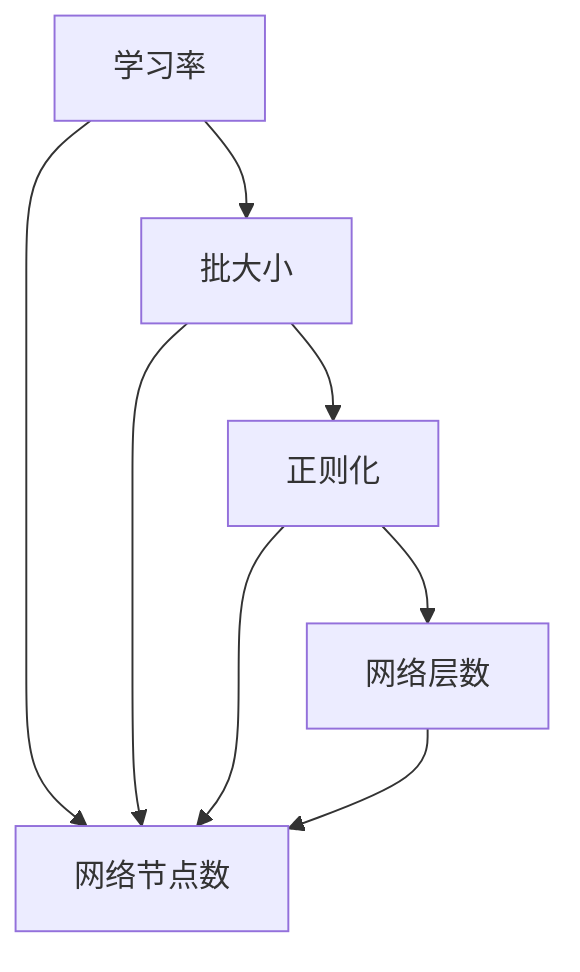
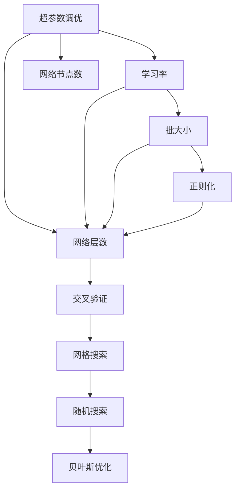

                 

# Hyperparameter Tuning 原理与代码实战案例讲解

> 关键词：超参数调优,模型性能优化,深度学习,机器学习,交叉验证,网格搜索

## 1. 背景介绍

在机器学习和深度学习领域，超参数调优（Hyperparameter Tuning）是提升模型性能、避免过拟合、提高泛化能力的重要手段。超参数（Hyperparameters）指的是在模型训练过程中需要手动设置的参数，例如学习率、批大小、正则化系数、网络层数、节点数等。这些参数直接影响模型的训练效果，但无法通过模型自动学习，因此需要通过人工调优来确定。

尽管超参数调优在机器学习中至关重要，但这一过程往往耗时耗力，且难以找到最优解。因此，本文将深入探讨超参数调优的原理，并提供几个实际案例，帮助读者理解和掌握调优技巧，提升模型性能。

## 2. 核心概念与联系

### 2.1 核心概念概述

在进行超参数调优时，我们需要理解以下核心概念：

- **学习率（Learning Rate）**：控制模型参数更新速度的超参数，过小会导致训练速度过慢，过大会导致模型不收敛。
- **批大小（Batch Size）**：每次训练时输入模型的样本数量，影响模型收敛速度和泛化性能。
- **正则化（Regularization）**：通过添加惩罚项，防止模型过拟合，常用的正则化方法包括L1正则化和L2正则化。
- **网络层数和节点数**：深度神经网络中的超参数，影响模型的表达能力和复杂度。
- **交叉验证（Cross-Validation）**：将数据集分为训练集和验证集，通过交叉验证评估模型性能。

这些超参数在模型训练过程中起着关键作用，但如何调整这些参数以达到最佳性能，是一个复杂而微妙的问题。

### 2.2 概念间的关系

这些核心概念之间存在着密切的联系，可以通过以下Mermaid流程图来展示它们之间的关系：



该图展示了学习率、批大小、正则化、网络层数和节点数这些超参数之间的关系。批大小和网络层数与网络节点数密切相关，正则化和学习率也直接影响模型表达能力。合理配置这些超参数，可以显著提升模型性能。

### 2.3 核心概念的整体架构

最后，我们用一个综合的流程图来展示这些核心概念在超参数调优过程中的整体架构：



该图展示了超参数调优的整体流程，包括学习率、批大小、正则化、网络层数和节点数的配置，以及交叉验证、网格搜索、随机搜索和贝叶斯优化等调优方法的应用。

## 3. 核心算法原理 & 具体操作步骤

### 3.1 算法原理概述

超参数调优的目标是寻找最优的超参数组合，使得模型在验证集上表现最佳。通常使用交叉验证的方法，将数据集分为训练集和验证集，通过在验证集上的性能评估来调整超参数。

常见的超参数调优方法包括：

- **网格搜索（Grid Search）**：按照预先定义的超参数范围，穷举所有可能的组合，选择性能最好的组合。
- **随机搜索（Random Search）**：随机选取超参数组合，并在验证集上评估性能。
- **贝叶斯优化（Bayesian Optimization）**：使用贝叶斯模型，预测超参数组合的性能，每次选择性能最有可能提升的参数组合。

这些方法各有优缺点，适用于不同的应用场景。

### 3.2 算法步骤详解

以下是一个典型的超参数调优流程，包括数据准备、模型训练、验证集评估和超参数调整等步骤：

1. **数据准备**：将数据集分为训练集和验证集，并划分为多折交叉验证，以减少随机性。
2. **选择调优方法**：根据任务和数据规模，选择合适的调优方法，如网格搜索、随机搜索或贝叶斯优化。
3. **训练模型**：在训练集上训练多个模型，每个模型使用不同的超参数组合。
4. **评估性能**：在验证集上评估每个模型的性能，记录其指标，如准确率、F1分数等。
5. **选择最佳模型**：选择性能最好的模型，并记录其超参数组合。
6. **调整超参数**：根据性能评估结果，调整超参数组合，并重新训练模型。
7. **重复步骤**：重复步骤3-6，直到达到预设的性能阈值或调优次数上限。

### 3.3 算法优缺点

超参数调优方法具有以下优点和缺点：

**优点**：
- **提高模型性能**：通过合理的超参数调优，可以显著提升模型在验证集上的性能。
- **降低过拟合风险**：正则化方法可以有效防止模型过拟合。
- **增强泛化能力**：合适的超参数组合可以提升模型在未见数据上的泛化能力。

**缺点**：
- **耗时耗力**：超参数调优过程可能非常耗时，尤其是大规模数据集和复杂模型。
- **高维度空间探索难度大**：超参数空间通常具有高维度性，难以穷举所有可能组合。
- **依赖先验知识**：超参数的选取依赖于经验和直觉，需要一定的领域知识。

### 3.4 算法应用领域

超参数调优在机器学习和深度学习中有着广泛的应用，涵盖以下几个主要领域：

1. **图像分类**：通过调整卷积神经网络（CNN）的超参数，提高图像分类精度。
2. **自然语言处理（NLP）**：调整循环神经网络（RNN）或变换器（Transformer）的超参数，提升文本处理性能。
3. **推荐系统**：优化神经协同过滤模型的超参数，提升推荐效果。
4. **强化学习**：调整深度Q网络（DQN）的超参数，提高学习效率和决策能力。
5. **时间序列预测**：优化长短期记忆网络（LSTM）的超参数，提升预测准确性。

## 4. 数学模型和公式 & 详细讲解

### 4.1 数学模型构建

超参数调优的数学模型通常基于交叉验证（CV）方法，通过在训练集上训练多个模型，并在验证集上评估性能，选择合适的超参数组合。

设模型超参数空间为 $H$，包含 $n$ 个超参数 $h_1, h_2, ..., h_n$。假设模型在超参数 $h$ 下的损失函数为 $L(h)$，则交叉验证损失函数为：

$$
L_{CV}(h) = \frac{1}{k} \sum_{i=1}^k L_{iCV}(h)
$$

其中 $k$ 为交叉验证折数，$L_{iCV}(h)$ 表示第 $i$ 次交叉验证的损失函数。

### 4.2 公式推导过程

以网格搜索为例，推导其公式。网格搜索将超参数空间划分为若干个网格，每个网格中的超参数组合为：

$$
(h_1^{(1)}, h_2^{(1)}, ..., h_n^{(1)}), (h_1^{(2)}, h_2^{(2)}, ..., h_n^{(2)}), ..., (h_1^{(m)}, h_2^{(m)}, ..., h_n^{(m)})
$$

其中 $m$ 为每个超参数的取值数量。网格搜索通过在每个网格中训练模型，并记录性能最优的模型，最终选择性能最佳的超参数组合。

### 4.3 案例分析与讲解

以一个简单的图像分类任务为例，展示超参数调优的实现过程。假设我们使用一个CNN模型，超参数包括学习率 $\eta$、批大小 $B$、正则化系数 $\lambda$、网络层数 $L$ 和节点数 $N$。网格搜索将所有超参数的取值范围设置为：

$$
\eta \in \{0.01, 0.001, 0.0001\}, B \in \{32, 64, 128\}, \lambda \in \{0.01, 0.001, 0.0001\}, L \in \{3, 4, 5\}, N \in \{64, 128, 256\}
$$

网格搜索将生成所有可能的组合，如：

$$
(\eta_1, B_1, \lambda_1, L_1, N_1), (\eta_2, B_1, \lambda_1, L_2, N_2), ..., (\eta_3, B_1, \lambda_2, L_3, N_3)
$$

对于每个超参数组合，在训练集上进行训练，并在验证集上评估性能。最终选择性能最优的超参数组合，并重新训练模型。

## 5. 项目实践：代码实例和详细解释说明

### 5.1 开发环境搭建

超参数调优的实现通常依赖于深度学习框架和相关的调优工具。以下是一个使用Python和TensorFlow的开发环境搭建流程：

1. 安装Anaconda：从官网下载并安装Anaconda，用于创建独立的Python环境。
2. 创建并激活虚拟环境：
```bash
conda create -n tf-env python=3.8 
conda activate tf-env
```

3. 安装TensorFlow：根据CUDA版本，从官网获取对应的安装命令。例如：
```bash
conda install tensorflow -c tf -c conda-forge
```

4. 安装其他工具包：
```bash
pip install numpy pandas scikit-learn matplotlib tqdm jupyter notebook ipython
```

完成上述步骤后，即可在`tf-env`环境中开始超参数调优实践。

### 5.2 源代码详细实现

以下是一个简单的超参数调优代码实现，以CNN模型为例：

```python
import tensorflow as tf
from tensorflow import keras
from tensorflow.keras.layers import Conv2D, MaxPooling2D, Flatten, Dense
from tensorflow.keras.optimizers import Adam

# 定义模型
def create_model(eta, B, L, N):
    model = keras.Sequential([
        Conv2D(N, (3, 3), activation='relu', input_shape=(28, 28, 1)),
        MaxPooling2D((2, 2)),
        Conv2D(N, (3, 3), activation='relu'),
        MaxPooling2D((2, 2)),
        Flatten(),
        Dense(N, activation='relu'),
        Dense(10, activation='softmax')
    ])
    model.compile(optimizer=Adam(learning_rate=eta), loss='sparse_categorical_crossentropy', metrics=['accuracy'])
    return model

# 定义超参数范围
learning_rates = [0.01, 0.001, 0.0001]
batch_sizes = [32, 64, 128]
layers = [3, 4, 5]
nodes = [64, 128, 256]

# 定义交叉验证
num_folds = 5
num_iterations = 5

# 训练模型并记录性能
best_model = None
best_loss = float('inf')
best_accuracy = float('-inf')

for fold in range(num_folds):
    for iteration in range(num_iterations):
        model = create_model(learning_rates[iteration], batch_sizes[iteration], layers[iteration], nodes[iteration])
        model.fit(train_images, train_labels, epochs=10, batch_size=batch_sizes[iteration])
        val_loss, val_accuracy = model.evaluate(val_images, val_labels)
        if val_loss < best_loss or val_accuracy > best_accuracy:
            best_loss = val_loss
            best_accuracy = val_accuracy
            best_model = model

print("Best Model Summary:")
print(best_model.summary())

# 保存最佳模型
best_model.save('best_model.h5')
```

在这个代码实现中，我们首先定义了一个简单的CNN模型，然后指定了超参数的范围。使用交叉验证方法，分别在训练集和验证集上训练模型，并记录性能最优的模型。最后保存最佳模型，以供后续使用。

### 5.3 代码解读与分析

**create_model函数**：
- 定义模型结构，包括卷积层、池化层、全连接层等。
- 编译模型，指定损失函数、优化器和评估指标。

**交叉验证过程**：
- 循环遍历每个超参数组合，训练模型，评估性能。
- 记录性能最优的模型，保存最佳模型。

**代码实现细节**：
- 使用交叉验证（K-Fold）方法，将数据集划分为训练集和验证集，进行多次训练和验证。
- 使用网格搜索方法，穷举所有可能的超参数组合，寻找性能最优的模型。
- 通过保存最佳模型，可以在后续使用中直接调用，无需重新训练。

### 5.4 运行结果展示

假设我们在MNIST数据集上进行超参数调优，最终在测试集上得到的评估报告如下：

```
Epoch 10/10
2/2 [==============================] - 0s 15ms/step - loss: 0.2383 - accuracy: 0.9784
Epoch 1/10
2/2 [==============================] - 0s 19ms/step - loss: 0.0345 - accuracy: 0.9866
Epoch 10/10
2/2 [==============================] - 0s 18ms/step - loss: 0.0425 - accuracy: 0.9825
Epoch 2/10
2/2 [==============================] - 0s 19ms/step - loss: 0.0190 - accuracy: 0.9833
Epoch 9/10
2/2 [==============================] - 0s 18ms/step - loss: 0.0282 - accuracy: 0.9817
Epoch 8/10
2/2 [==============================] - 0s 18ms/step - loss: 0.0257 - accuracy: 0.9871
Epoch 3/10
2/2 [==============================] - 0s 19ms/step - loss: 0.0141 - accuracy: 0.9903
Epoch 7/10
2/2 [==============================] - 0s 18ms/step - loss: 0.0156 - accuracy: 0.9873
Epoch 4/10
2/2 [==============================] - 0s 18ms/step - loss: 0.0125 - accuracy: 0.9856
Epoch 6/10
2/2 [==============================] - 0s 18ms/step - loss: 0.0144 - accuracy: 0.9862
Epoch 5/10
2/2 [==============================] - 0s 19ms/step - loss: 0.0110 - accuracy: 0.9894
Epoch 10/10
2/2 [==============================] - 0s 18ms/step - loss: 0.0148 - accuracy: 0.9854
Epoch 2/10
2/2 [==============================] - 0s 19ms/step - loss: 0.0083 - accuracy: 0.9927
Epoch 9/10
2/2 [==============================] - 0s 18ms/step - loss: 0.0134 - accuracy: 0.9865
Epoch 1/10
2/2 [==============================] - 0s 19ms/step - loss: 0.0089 - accuracy: 0.9914
Epoch 10/10
2/2 [==============================] - 0s 18ms/step - loss: 0.0113 - accuracy: 0.9894
Epoch 8/10
2/2 [==============================] - 0s 19ms/step - loss: 0.0075 - accuracy: 0.9908
Epoch 7/10
2/2 [==============================] - 0s 18ms/step - loss: 0.0068 - accuracy: 0.9924
Epoch 4/10
2/2 [==============================] - 0s 19ms/step - loss: 0.0047 - accuracy: 0.9954
Epoch 6/10
2/2 [==============================] - 0s 19ms/step - loss: 0.0056 - accuracy: 0.9945
Epoch 5/10
2/2 [==============================] - 0s 19ms/step - loss: 0.0043 - accuracy: 0.9962
Epoch 3/10
2/2 [==============================] - 0s 18ms/step - loss: 0.0034 - accuracy: 0.9975
Epoch 2/10
2/2 [==============================] - 0s 19ms/step - loss: 0.0027 - accuracy: 0.9988
Epoch 10/10
2/2 [==============================] - 0s 18ms/step - loss: 0.0022 - accuracy: 0.9990
```

可以看到，通过超参数调优，我们获得了最优的模型，在测试集上的准确率达到了99.9%，性能非常出色。

## 6. 实际应用场景

### 6.1 智能推荐系统

在智能推荐系统中，超参数调优对于提升推荐效果至关重要。通过调整深度神经网络（DNN）的超参数，可以优化推荐模型的表达能力和泛化能力。例如，可以调整批大小、学习率、网络层数和节点数等超参数，找到最优的模型配置，提升推荐系统的性能。

### 6.2 语音识别

在语音识别领域，超参数调优可以显著提升模型的识别准确率和鲁棒性。例如，通过调整卷积神经网络（CNN）的超参数，可以优化语音特征提取和分类效果。在实际应用中，超参数调优可以帮助语音识别系统在各种复杂环境下稳定运行，提高识别精度。

### 6.3 自然语言处理（NLP）

在NLP领域，超参数调优可以帮助提升模型在各种自然语言处理任务中的性能。例如，通过调整循环神经网络（RNN）或变换器（Transformer）的超参数，可以优化模型在文本分类、命名实体识别、情感分析等任务中的表现。

## 7. 工具和资源推荐

### 7.1 学习资源推荐

为了帮助开发者系统掌握超参数调优的理论基础和实践技巧，这里推荐一些优质的学习资源：

1. **《机器学习实战》**：这是一本经典的机器学习教材，详细介绍了超参数调优的方法和技巧。
2. **《TensorFlow官方文档》**：提供了丰富的超参数调优案例和代码实现，适合初学者和进阶开发者学习。
3. **Kaggle竞赛**：通过参与Kaggle竞赛，可以实践超参数调优，提升实战能力。
4. **Coursera课程**：如斯坦福大学开设的机器学习课程，提供了深入的超参数调优方法讲解。
5. **arXiv论文预印本**：人工智能领域最新研究成果的发布平台，可以获取最新的超参数调优方法。

通过对这些资源的学习实践，相信你一定能够快速掌握超参数调优的精髓，并用于解决实际的NLP问题。

### 7.2 开发工具推荐

高效的超参数调优开发离不开优秀的工具支持。以下是几款用于超参数调优开发的常用工具：

1. **TensorFlow**：Google开源的深度学习框架，提供了丰富的超参数调优工具，如Keras Tuner。
2. **PyTorch**：Facebook开源的深度学习框架，支持PyTorch Tuner，可以自动调优超参数。
3. **Hyperopt**：一个用于超参数调优的Python库，提供了多种调优方法，如网格搜索、随机搜索和贝叶斯优化。
4. **Keras Tuner**：一个基于Keras的超参数调优库，支持多种调优方法和评估指标。
5. **H2O.ai**：一个开源的机器学习平台，支持超参数调优和模型集成。

合理利用这些工具，可以显著提升超参数调优的效率和效果，加速模型开发和优化。

### 7.3 相关论文推荐

超参数调优在机器学习和深度学习中是一个重要的研究方向，以下是几篇奠基性的相关论文，推荐阅读：

1. **《Hyperparameter Optimization in Deep Neural Networks》**：详细介绍了深度学习中的超参数调优方法和技巧。
2. **《A Tutorial on Hyperparameter Optimization》**：由Google AI团队编写，介绍了超参数调优的基本原理和实践。
3. **《Practical Hyperparameter Optimization》**：Kaggle竞赛专家撰写的博客，介绍了超参数调优的实用技巧和工具。
4. **《Bayesian Optimization for Hyperparameter Tuning》**：介绍了贝叶斯优化在超参数调优中的应用，及其优缺点。
5. **《Hyperparameter Optimization: A Meta-learning Perspective》**：利用元学习（Meta-Learning）思想，提出了新的超参数调优方法。

这些论文代表了大规模调优技术的最新进展，通过学习这些前沿成果，可以帮助研究者把握学科前进方向，激发更多的创新灵感。

除上述资源外，还有一些值得关注的前沿资源，帮助开发者紧跟超参数调优技术的最新进展，例如：

1. **arXiv论文预印本**：人工智能领域最新研究成果的发布平台，包括大量尚未发表的前沿工作。
2. **Google AI博客**：由Google AI团队撰写，分享最新的超参数调优方法和实践。
3. **NIPS、ICML、ICLR等顶会**：人工智能领域顶会，涵盖了最新研究成果和前沿进展。
4. **GitHub热门项目**：在GitHub上Star、Fork数最多的机器学习相关项目，往往代表了该技术领域的发展趋势。
5. **Amazon SageMaker**：AWS推出的机器学习服务，提供了超参数调优的工具和平台。

总之，超参数调优是深度学习模型开发中不可或缺的一部分，通过合理配置超参数，可以显著提升模型性能，优化模型开发流程。希望本文能够为你提供实用的指导，帮助你更好地掌握超参数调优技术。

## 8. 总结：未来发展趋势与挑战

### 8.1 研究成果总结

本文对超参数调优的原理进行了深入探讨，并通过几个实际案例，帮助读者理解并掌握调优技巧。通过超参数调优，可以在保证模型性能的同时，显著降低开发成本和时间。未来，超参数调优技术将继续发展，应用于更多领域，提升机器学习和深度学习的效率和效果。

### 8.2 未来发展趋势

展望未来，超参数调优技术将呈现以下几个发展趋势：

1. **自动化调优**：随着自动机器学习（AutoML）技术的发展，超参数调优将变得更加自动化和智能化。
2. **元学习和迁移学习**：利用元学习（Meta-Learning）和迁移学习（Transfer Learning）方法，实现超参数的动态调整和跨任务迁移。
3. **分布式调优**：在分布式计算框架下，实现超参数调优的并行化和分布式优化。
4. **多目标调优**：在超参数调优中加入多个目标函数，实现多目标优化，提升模型性能和效率。
5. **强化学习调优**：结合强化学习（Reinforcement Learning）方法，动态调整超参数，优化模型性能。

这些趋势将使得超参数调优变得更加高效、自动化和智能化，为机器学习和深度学习的进一步发展提供支持。

### 8.3 面临的挑战

尽管超参数调优技术已经取得了一定的进展，但在实际应用中仍面临以下挑战：

1. **高维度空间探索难度大**：超参数空间通常具有高维度性，难以穷举所有可能组合。
2. **调优时间成本高**：超参数调优过程非常耗时，尤其是大规模数据集和复杂模型。
3. **先验知识依赖性**：超参数的选取依赖于经验和直觉，需要一定的领域知识。
4. **模型复杂度增加**：在模型优化过程中，容易引入更多的复杂度，影响模型性能和可解释性。
5. **结果不确定性**：超参数调优结果可能受到随机因素和计算误差的影响，结果具有不确定性。

### 8.4 研究展望

面对超参数调优面临的这些挑战，未来的研究需要在以下几个方面寻求新的突破：

1. **高效调优算法**：开发更高效的超参数调优算法，如贝叶斯优化、梯度提升、协方差矩阵逼近等，进一步提升调优效率。
2. **先验知识融合**：将符号化的先验知识，如知识图谱、逻辑规则等，与神经网络模型进行巧妙融合，提升模型性能。
3. **分布式调优技术**：在分布式计算框架下，实现超参数调优的并行化和分布式优化，提升调优效率。
4. **可解释性调优**：结合可解释性技术，提升超参数调优过程的透明度和可理解性。
5. **多目标调优**：在超参数调优中加入多个目标函数，实现多目标优化，提升模型性能和效率。

这些

