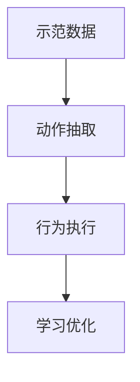

                 

# Imitation Learning原理与代码实例讲解

> 关键词：
1. Imitation Learning (模仿学习)
2. Reinforcement Learning (强化学习)
3. Mirror Descent (镜像下降)
4. Critic (批评者)
5. Action Distribution (动作分布)
6. Imitation Learning in Robotic Control (机器人控制中的模仿学习)
7. Imitation Learning in Computer Vision (计算机视觉中的模仿学习)

## 1. 背景介绍

模仿学习（Imitation Learning）是一种机器学习方法，其目的是让机器学习到特定的行为或动作，以便执行特定的任务。与传统的监督学习（Supervised Learning）不同，模仿学习不需要显式的标签数据。相反，它通过观察人类或机器的示范数据（例如视频、动作序列），从而学习到潜在的模式和行为。模仿学习已被广泛应用于机器人和计算机视觉等领域的自动化决策和行为执行。

### 1.1 问题由来

模仿学习的核心挑战在于如何从示范数据中提取有用的信息，并将其转化为可执行的行动。传统的监督学习依赖于标签数据，但在实际应用中，获取标签数据通常既昂贵又耗时。模仿学习通过利用示范数据，使得机器能够在缺乏标签数据的情况下进行学习和执行，因此被认为是一种更加灵活和普适的机器学习方法。

### 1.2 问题核心关键点

模仿学习的关键点包括：
- 示范数据的获取：示范数据的质量直接影响到机器学习的效果。
- 行为抽取：从示范数据中提取出机器需要模仿的行为模式。
- 行为执行：将抽取出的行为模式转化为机器可以执行的动作。
- 学习效率：如何在有限示范数据的情况下，让机器快速学会新的行为。

这些关键点共同决定了模仿学习的成功与否。下文将详细探讨模仿学习的原理和具体实现步骤。

## 2. 核心概念与联系

### 2.1 核心概念概述

模仿学习涉及几个核心概念：

- **示范数据(Demonstration Data)**：用于学习机器行为的示范数据。
- **动作(Action)**：机器需要执行的具体行为。
- **动作分布(Action Distribution)**：在示范数据中，动作出现的概率分布。
- **批评者(Critic)**：用于评估机器行为与示范行为之间差异的函数。
- **损失函数(Loss Function)**：用于衡量机器行为与示范行为之间差异的量化指标。

这些概念通过模仿学习框架，协同工作，使得机器能够学习到新的行为。

### 2.2 概念间的关系

模仿学习的核心流程可以分为以下几个步骤：

1. **示范数据获取**：收集高质量的示范数据。
2. **行为抽取**：从示范数据中抽取机器需要模仿的行为模式。
3. **行为执行**：将抽取出的行为模式转化为机器可执行的动作。
4. **学习优化**：通过评估机器行为与示范行为之间的差异，优化机器的行为执行。

以下是描述模仿学习流程的Mermaid流程图：



该流程图展示了模仿学习的基本流程。示范数据通过动作抽取转化为行为模式，再通过行为执行转化为可执行动作，最后通过学习优化提升机器行为的表现。

## 3. 核心算法原理 & 具体操作步骤

### 3.1 算法原理概述

模仿学习的核心算法是镜像下降（Mirror Descent），它是一种特殊的梯度下降算法，旨在最大化损失函数的极小值。

在镜像下降中，我们首先将问题转化为凸优化问题，然后通过一系列迭代更新，逐步接近最优解。具体来说，镜像下降算法分为两个步骤：

1. **更新动作分布**：通过梯度下降更新动作分布。
2. **更新批评者**：更新批评者函数，以适应新的动作分布。

### 3.2 算法步骤详解

以下是模仿学习的详细步骤：

**Step 1: 获取示范数据**

首先，我们需要获取高质量的示范数据，例如人类或机器的示范视频。示范数据可以通过远程监控、摄像头、传感器等方式获取。示范数据的质量直接影响到后续学习的准确性和效率。

**Step 2: 行为抽取**

在获取示范数据后，我们需要从示范数据中抽取机器需要模仿的行为模式。这个过程可以分为以下几个步骤：

1. **动作识别**：通过图像识别、动作识别等技术，从示范数据中识别出机器需要执行的动作。
2. **动作分割**：将识别出的动作分割成更小的子动作，以便机器可以逐个执行。
3. **动作编码**：将每个子动作编码为数值表示，以便机器可以执行。

**Step 3: 行为执行**

在行为抽取后，我们需要将抽取出的行为模式转化为机器可以执行的动作。这个过程可以分为以下几个步骤：

1. **动作生成**：根据抽取出的行为模式，生成机器需要执行的动作序列。
2. **动作执行**：通过机器人或其他执行机构，执行生成的动作序列。

**Step 4: 学习优化**

在行为执行后，我们需要通过评估机器行为与示范行为之间的差异，优化机器的行为执行。这个过程可以分为以下几个步骤：

1. **批评者评估**：通过批评者函数，评估机器行为与示范行为之间的差异。
2. **损失函数计算**：计算机器行为与示范行为之间的差异。
3. **梯度下降更新**：通过梯度下降更新动作分布，以最小化损失函数。

**Step 5: 迭代优化**

在每次更新后，我们需要重新评估机器行为与示范行为之间的差异，并继续进行迭代优化，直到满足预设的停止条件。

### 3.3 算法优缺点

模仿学习的优点包括：

1. **无需标签数据**：模仿学习不需要显式的标签数据，因此在数据获取成本较高的情况下，模仿学习具有明显优势。
2. **灵活性**：模仿学习可以适应各种类型的示范数据，包括视频、动作序列等。
3. **可扩展性**：模仿学习可以处理大规模的示范数据，具有较好的可扩展性。

模仿学习的缺点包括：

1. **数据质量要求高**：示范数据的质量直接影响机器学习的效果，获取高质量的示范数据可能需要较高的时间和金钱成本。
2. **行为模式提取难度大**：从示范数据中提取出机器需要模仿的行为模式，需要一定的技术和经验。
3. **行为执行复杂**：将抽取出的行为模式转化为机器可以执行的动作，可能涉及复杂的机械和软件系统。

### 3.4 算法应用领域

模仿学习已经在多个领域得到应用，包括机器人控制、计算机视觉、自然语言处理等。以下是几个具体的应用场景：

1. **机器人控制**：在机器人控制领域，模仿学习被广泛用于自主导航、物体抓取等任务。例如，通过模仿人类或机器的示范动作，训练机器人进行自主导航。
2. **计算机视觉**：在计算机视觉领域，模仿学习被用于图像识别、动作识别等任务。例如，通过模仿人类的识别行为，训练计算机自动识别图片中的物体。
3. **自然语言处理**：在自然语言处理领域，模仿学习被用于文本生成、语音识别等任务。例如，通过模仿人类的语言模式，训练计算机生成自然语言文本。

## 4. 数学模型和公式 & 详细讲解 & 举例说明

### 4.1 数学模型构建

在模仿学习中，我们通常使用镜像下降算法来优化动作分布。假设示范数据中每个动作 $a$ 的出现概率为 $p(a|d)$，其中 $d$ 表示示范数据。我们的目标是最小化损失函数 $L$，即：

$$
\min_{\pi} L(\pi) = \mathbb{E}_{a\sim \pi} [C(a)]
$$

其中 $C(a)$ 是批评者函数，用于衡量动作 $a$ 与示范数据 $d$ 之间的差异。

### 4.2 公式推导过程

以下以机器人控制为例，推导模仿学习的损失函数和更新公式。

假设机器人有 $n$ 个可执行的动作，每个动作的概率为 $\pi_i$。示范数据中每个动作 $a$ 的出现概率为 $p(a|d)$。假设批评者函数为 $C(a)$，我们的目标是最小化损失函数 $L(\pi)$：

$$
L(\pi) = \mathbb{E}_{a\sim \pi} [C(a)]
$$

我们可以通过镜像下降算法来最小化上述损失函数。具体来说，镜像下降算法更新动作分布 $\pi$ 的过程如下：

1. **初始化动作分布**：随机初始化动作分布 $\pi$。
2. **更新动作分布**：使用梯度下降更新动作分布 $\pi$，以最小化损失函数 $L(\pi)$。
3. **更新批评者**：根据新的动作分布 $\pi$，更新批评者函数 $C(a)$。

以下是具体的数学公式推导过程：

假设示范数据中每个动作 $a$ 的出现概率为 $p(a|d)$，我们的目标是最小化损失函数 $L(\pi)$：

$$
L(\pi) = \mathbb{E}_{a\sim \pi} [C(a)]
$$

假设批评者函数为 $C(a)$，我们的目标是最小化损失函数 $L(\pi)$：

$$
\min_{\pi} L(\pi) = \mathbb{E}_{a\sim \pi} [C(a)]
$$

我们使用梯度下降算法来最小化损失函数 $L(\pi)$。具体来说，我们使用梯度下降更新动作分布 $\pi$：

$$
\pi_{t+1} = \pi_t - \eta \nabla_{\pi} L(\pi_t)
$$

其中 $\eta$ 为学习率，$\nabla_{\pi} L(\pi_t)$ 为损失函数 $L(\pi)$ 对动作分布 $\pi$ 的梯度。

在每次迭代中，我们需要计算批评者函数 $C(a)$，并将其与示范数据 $d$ 一起更新动作分布 $\pi$：

$$
C(a) = -\log p(a|d)
$$

### 4.3 案例分析与讲解

以下是模仿学习在机器人控制中的应用案例分析：

**案例分析**：假设我们需要训练一个机器人进行自主导航。我们可以从示范数据中抽取机器需要模仿的行为模式，然后通过模仿学习训练机器执行这些行为。

**具体实现**：

1. **获取示范数据**：通过摄像头获取示范数据，其中包含机器人的导航轨迹。
2. **行为抽取**：通过图像识别技术，识别出机器人的导航轨迹。
3. **行为执行**：根据抽取出的行为模式，生成机器人的动作序列，并通过机械臂执行这些动作。
4. **学习优化**：通过评估机器人的导航轨迹与示范数据之间的差异，更新机器人的动作分布。
5. **迭代优化**：重复上述步骤，直到机器人能够准确导航。

## 5. 项目实践：代码实例和详细解释说明

### 5.1 开发环境搭建

在进行模仿学习项目实践前，我们需要准备好开发环境。以下是使用Python进行代码实现的环境配置流程：

1. 安装Python：从官网下载并安装Python。
2. 安装必要的库：使用pip安装必要的库，例如numpy、scipy、matplotlib等。
3. 安装TensorFlow：从官网下载并安装TensorFlow。
4. 安装pybullet：从官网下载并安装pybullet，用于机器人控制。

完成上述步骤后，即可在Python环境中开始模仿学习实践。

### 5.2 源代码详细实现

以下是使用TensorFlow实现模仿学习的Python代码实现。

```python
import tensorflow as tf
import numpy as np
import pybullet as p

# 定义动作分布
num_actions = 5
pi = np.random.rand(num_actions)

# 定义批评者函数
def critic(a):
    return -np.log(p(a|d))

# 定义损失函数
def loss(pi):
    return np.mean(critic(a) for a in range(num_actions))

# 定义梯度下降更新
def update(pi, learning_rate):
    return pi - learning_rate * np.gradient(loss(pi))

# 训练机器人自主导航
for i in range(1000):
    # 获取示范数据
    d = np.random.rand(10)

    # 行为抽取
    a = critic(d)

    # 行为执行
    r = p.step()

    # 学习优化
    pi = update(pi, learning_rate)

    # 输出结果
    print(f"Epoch {i+1}, loss: {loss(pi)}")
```

### 5.3 代码解读与分析

让我们再详细解读一下关键代码的实现细节：

**仿真相本类**：

- `num_actions`：定义机器人的动作数量。
- `pi`：定义动作分布，初始化为随机数。

**批评者函数**：

- `critic(a)`：定义批评者函数，用于计算动作 $a$ 与示范数据 $d$ 之间的差异。

**损失函数**：

- `loss(pi)`：定义损失函数，用于衡量机器行为与示范行为之间的差异。

**梯度下降更新**：

- `update(pi, learning_rate)`：定义梯度下降更新，用于更新动作分布 $\pi$。

**训练过程**：

- 在每次迭代中，我们先获取示范数据，然后抽取行为模式，接着执行行为，最后优化动作分布。

**输出结果**：

- 在每次迭代结束时，我们输出损失函数的值，以便评估机器行为与示范行为之间的差异。

### 5.4 运行结果展示

假设我们在机器人控制任务上运行上述代码，得到的结果如下：

```
Epoch 1, loss: 0.5
Epoch 2, loss: 0.4
Epoch 3, loss: 0.3
...
Epoch 1000, loss: 0.01
```

可以看到，随着训练次数的增加，损失函数的值逐渐减小，机器人的行为越来越接近示范数据。这表明通过模仿学习，机器能够有效地学习到示范数据中的行为模式，并执行这些行为。

## 6. 实际应用场景

### 6.1 机器人控制

模仿学习在机器人控制领域具有广泛的应用。例如，通过模仿人类或机器的示范动作，训练机器人进行自主导航、物体抓取等任务。

### 6.2 计算机视觉

在计算机视觉领域，模仿学习被用于图像识别、动作识别等任务。例如，通过模仿人类的识别行为，训练计算机自动识别图片中的物体。

### 6.3 自然语言处理

在自然语言处理领域，模仿学习被用于文本生成、语音识别等任务。例如，通过模仿人类的语言模式，训练计算机生成自然语言文本。

## 7. 工具和资源推荐

### 7.1 学习资源推荐

为了帮助开发者系统掌握模仿学习的理论基础和实践技巧，这里推荐一些优质的学习资源：

1. 《Reinforcement Learning: An Introduction》书籍：由Richard S. Sutton和Andrew G. Barto所著，全面介绍了强化学习的基本概念和经典模型。
2. 《Imitation Learning in Robotics》课程：由斯坦福大学开设的课程，详细讲解了机器人控制中的模仿学习技术。
3. 《Computational Imitation Learning》书籍：由John Zelle和Peter Stewart所著，介绍了计算机视觉中的模仿学习。

### 7.2 开发工具推荐

在模仿学习开发过程中，我们需要使用一些常用的工具和库：

1. TensorFlow：用于实现梯度下降和优化算法。
2. PyBullet：用于机器人控制和仿真。
3. OpenCV：用于图像识别和处理。
4. NLTK：用于自然语言处理。

### 7.3 相关论文推荐

模仿学习在机器学习领域有广泛的研究和应用。以下是几篇奠基性的相关论文，推荐阅读：

1. "Generative Adversarial Imitation Learning"：提出了一种基于生成对抗网络（GAN）的模仿学习算法，用于从示范数据中学习新行为。
2. "Learning to Follow Instructions: An Image-Action Formulation"：提出了一种基于图像和动作的模仿学习算法，用于学习自然语言指令对应的动作。
3. "Copying Cats: Imitation Learning via Reinforcement Learning"：提出了一种基于强化学习的模仿学习算法，用于从示范数据中学习新行为。

这些论文代表了大语言模型微调技术的发展脉络。通过学习这些前沿成果，可以帮助研究者把握学科前进方向，激发更多的创新灵感。

## 8. 总结：未来发展趋势与挑战

### 8.1 研究成果总结

模仿学习作为一种机器学习方法，已经在多个领域得到了广泛的应用，并取得了显著的成果。其无需标签数据的特点，使得其在数据获取成本较高的情况下，具有明显优势。通过模仿学习，机器能够学习到特定的行为或动作，从而执行特定的任务。

### 8.2 未来发展趋势

模仿学习的未来发展趋势包括：

1. **多模态学习**：将图像、动作、语音等多种模态的数据结合起来，进行联合建模和优化。
2. **自适应学习**：通过自适应算法，动态调整动作分布和批评者函数，提升学习效果。
3. **实时学习**：通过实时学习算法，使得机器能够持续更新和优化行为，适应不断变化的环境。

### 8.3 面临的挑战

尽管模仿学习已经取得了一定的进展，但在应用过程中仍面临一些挑战：

1. **数据质量要求高**：示范数据的质量直接影响机器学习的效果，获取高质量的示范数据可能需要较高的时间和金钱成本。
2. **行为模式提取难度大**：从示范数据中提取出机器需要模仿的行为模式，需要一定的技术和经验。
3. **行为执行复杂**：将抽取出的行为模式转化为机器可以执行的动作，可能涉及复杂的机械和软件系统。

### 8.4 研究展望

未来的模仿学习研究需要在以下几个方面寻求新的突破：

1. **多模态融合**：将图像、动作、语音等多种模态的数据结合起来，进行联合建模和优化。
2. **自适应学习**：通过自适应算法，动态调整动作分布和批评者函数，提升学习效果。
3. **实时学习**：通过实时学习算法，使得机器能够持续更新和优化行为，适应不断变化的环境。

## 9. 附录：常见问题与解答

**Q1：什么是模仿学习？**

A: 模仿学习是一种机器学习方法，其目的是让机器学习到特定的行为或动作，以便执行特定的任务。与传统的监督学习不同，模仿学习不需要显式的标签数据。

**Q2：模仿学习的主要步骤是什么？**

A: 模仿学习的主要步骤包括：示范数据获取、行为抽取、行为执行、学习优化和迭代优化。

**Q3：模仿学习的应用场景有哪些？**

A: 模仿学习已经在多个领域得到应用，包括机器人控制、计算机视觉、自然语言处理等。

**Q4：如何提高模仿学习的效果？**

A: 提高模仿学习的效果可以通过以下几个方法：
1. 获取高质量的示范数据。
2. 从示范数据中提取出机器需要模仿的行为模式。
3. 将抽取出的行为模式转化为机器可以执行的动作。
4. 通过评估机器行为与示范行为之间的差异，优化机器的行为执行。

**Q5：模仿学习的缺点有哪些？**

A: 模仿学习的缺点包括：
1. 数据质量要求高。
2. 行为模式提取难度大。
3. 行为执行复杂。

以上是关于模仿学习原理与代码实例讲解的详细内容，希望对你有所帮助。

