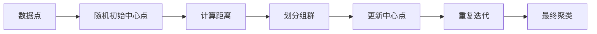
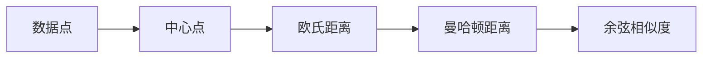
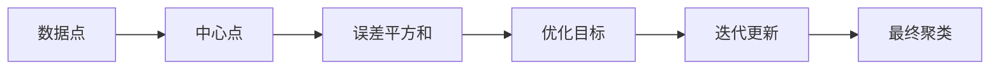

                 

# K-Means - 原理与代码实例讲解

> 关键词：K-Means, 聚类算法, 原型迭代, 中心点, 最小化误差平方和

## 1. 背景介绍

聚类是一种无监督学习方法，它将数据点划分为多个群组，使得同一组群内的数据点相似度较高，而不同组群的数据点相似度较低。K-Means算法是一种常用的基于原型迭代的聚类算法，通过将数据点划分到最近的原型中心来达到聚类的目的。它被广泛应用于数据挖掘、图像处理、自然语言处理等多个领域。

### 1.1 问题由来

在实际应用中，我们需要对大量数据进行聚类分析，以便发现数据的内在结构和规律。例如，在电子商务中，可以通过对用户的购买记录进行聚类，发现用户的消费习惯和偏好；在图像处理中，可以通过对像素进行聚类，实现图像的分割和特征提取；在自然语言处理中，可以通过对文本进行聚类，发现主题和情感倾向。

然而，传统的K-Means算法在处理大规模数据时，存在计算复杂度高、初始中心点选择困难等问题。为了解决这些问题，学者们提出了改进算法，如K-Means++、Mini Batch K-Means等。本文将深入探讨K-Means算法的原理，并通过具体的代码实例，详细讲解其实现步骤。

### 1.2 问题核心关键点

K-Means算法的核心思想是：将数据点划分为K个组群，每个组群包含若干个相似的数据点。算法的基本步骤如下：
1. 随机选择K个数据点作为初始中心点。
2. 对每个数据点，计算其到各个中心点的距离，将其划分到距离最近的中心点所在的组群。
3. 更新每个组群的中心点为该组群中所有数据点的平均值。
4. 重复步骤2和3，直到中心点不再发生变化或达到预设迭代次数。

K-Means算法的优缺点如下：
优点：简单高效，可扩展性好，适用于高维数据。
缺点：对初始中心点敏感，可能收敛到局部最优解。

## 2. 核心概念与联系

### 2.1 核心概念概述

为更好地理解K-Means算法的原理，本节将介绍几个密切相关的核心概念：

- K-Means算法：基于原型迭代的聚类算法，通过将数据点划分到最近的原型中心来达到聚类的目的。
- 原型中心（Centroid）：每个组群的中心点，用于表示该组群的数据特征。
- 误差平方和（SSE）：所有数据点到所属组群中心点的距离的平方和，用于衡量聚类效果。
- 距离度量（Distance Measure）：用于计算数据点之间或数据点到原型中心的距离，如欧氏距离、曼哈顿距离等。
- 最小化误差平方和：K-Means算法的优化目标，即最小化所有数据点到所属组群中心点的距离的平方和。

这些核心概念之间的逻辑关系可以通过以下Mermaid流程图来展示：



这个流程图展示了大语言模型的核心概念及其之间的关系：

1. 数据点被随机初始化到K个中心点。
2. 每个数据点计算到最近中心点的距离，划分到该组群。
3. 更新每个组群的中心点为该组群中所有数据点的平均值。
4. 重复以上步骤，直到中心点不再变化。

### 2.2 概念间的关系

这些核心概念之间存在着紧密的联系，形成了K-Means算法的完整生态系统。下面我通过几个Mermaid流程图来展示这些概念之间的关系。

#### 2.2.1 K-Means算法的基本步骤


这个流程图展示了K-Means算法的基本步骤：
1. 数据点被随机初始化到K个中心点。
2. 每个数据点计算到最近中心点的距离，划分到该组群。
3. 更新每个组群的中心点为该组群中所有数据点的平均值。
4. 重复以上步骤，直到中心点不再变化。

#### 2.2.2 距离度量方法



这个流程图展示了常用的距离度量方法：
1. 欧氏距离：计算两个数据点之间的直线距离。
2. 曼哈顿距离：计算两个数据点之间的曼哈顿距离。
3. 余弦相似度：计算两个数据点之间的夹角余弦值。

#### 2.2.3 最小化误差平方和



这个流程图展示了最小化误差平方和的目标：
1. 数据点被划分到距离最近的中心点所在的组群。
2. 计算每个组群的误差平方和。
3. 将优化目标设置为最小化所有数据点到所属组群中心点的距离的平方和。
4. 迭代更新中心点，直到误差平方和不再变化。

## 3. 核心算法原理 & 具体操作步骤
### 3.1 算法原理概述

K-Means算法的核心思想是将数据点划分为K个组群，每个组群包含若干个相似的数据点。算法的基本步骤如下：
1. 随机选择K个数据点作为初始中心点。
2. 对每个数据点，计算其到各个中心点的距离，将其划分到距离最近的中心点所在的组群。
3. 更新每个组群的中心点为该组群中所有数据点的平均值。
4. 重复步骤2和3，直到中心点不再发生变化或达到预设迭代次数。

K-Means算法的优化目标是最小化所有数据点到所属组群中心点的距离的平方和。这个过程可以通过迭代更新中心点来实现，直到误差平方和不再变化或达到预设迭代次数。

### 3.2 算法步骤详解

#### 3.2.1 初始化中心点

随机选择K个数据点作为初始中心点。一般选择的数据点应该具有一定的代表性，避免过于密集或稀疏。

#### 3.2.2 划分组群

对每个数据点，计算其到各个中心点的距离，将其划分到距离最近的中心点所在的组群。这个过程可以通过以下步骤实现：
1. 计算数据点到每个中心点的距离。
2. 将数据点划分到距离最近的中心点所在的组群。

#### 3.2.3 更新中心点

更新每个组群的中心点为该组群中所有数据点的平均值。这个过程可以通过以下步骤实现：
1. 计算每个组群中所有数据点的平均值。
2. 更新中心点的坐标。

#### 3.2.4 迭代更新

重复步骤2和3，直到中心点不再发生变化或达到预设迭代次数。这个过程可以通过以下步骤实现：
1. 计算数据点到每个中心点的距离，划分组群。
2. 更新中心点为该组群中所有数据点的平均值。
3. 判断是否收敛或达到迭代次数，如果未收敛，继续迭代更新。

### 3.3 算法优缺点

K-Means算法的优缺点如下：
优点：
1. 简单高效，可扩展性好。
2. 适用于高维数据。
3. 结果易于解释。
缺点：
1. 对初始中心点敏感，可能收敛到局部最优解。
2. 对噪声和异常值敏感。
3. 需要预设聚类数K，可能难以确定。

### 3.4 算法应用领域

K-Means算法广泛应用于数据挖掘、图像处理、自然语言处理等多个领域。例如：
- 数据挖掘：对用户行为数据进行聚类，发现用户群体和消费习惯。
- 图像处理：对图像像素进行聚类，实现图像分割和特征提取。
- 自然语言处理：对文本进行聚类，发现主题和情感倾向。

除了上述这些经典应用外，K-Means算法还被创新性地应用于更多场景中，如社交网络分析、医学数据分析、金融风险评估等，为各行各业带来新的数据处理思路。

## 4. 数学模型和公式 & 详细讲解 & 举例说明

### 4.1 数学模型构建

假设数据集中有N个数据点，每个数据点d的坐标为d=(x1,x2,...,xD)，其中D为特征维度。随机选择K个数据点作为初始中心点C1,C2,...,CK，其中每个中心点的坐标为Ck=(x1k,x2k,...,xDk)。K-Means算法的优化目标是最小化所有数据点到所属组群中心点的距离的平方和SSE，即：

$$
SSE = \sum_{i=1}^N \min_{k=1,...,K} \|d_i - C_k\|^2
$$

其中，||·||表示欧式距离。

### 4.2 公式推导过程

假设当前数据点d被划分到组群k，其距离为d到中心点Ck的距离。根据最小二乘法，更新中心点Ck的坐标为：

$$
C_k = \frac{1}{N_k}\sum_{i=1}^{N_k}d_i
$$

其中，Nk表示组群k中的数据点数量。

更新所有中心点的坐标后，重新计算每个数据点到中心点的距离，划分组群，更新中心点，重复迭代，直到误差平方和SSE不再变化或达到预设迭代次数。

### 4.3 案例分析与讲解

以一个简单的二维数据集为例，展示K-Means算法的聚类过程。假设数据集如下：

| x1 | x2 | k |
|----|----|---|
| 1  | 3  | 1 |
| 2  | 2  | 1 |
| 2  | 4  | 2 |
| 3  | 3  | 2 |
| 4  | 1  | 2 |
| 5  | 5  | 1 |

假设我们选择两个数据点作为初始中心点C1(1,3)和C2(4,1)，K=2，进行迭代更新。迭代过程如下：

1. 初始化中心点C1(1,3)和C2(4,1)，计算每个数据点到中心点的距离，划分组群。
2. 更新中心点C1和C2为该组群中所有数据点的平均值。
3. 重复步骤1和2，直到中心点不再变化或达到预设迭代次数。

迭代过程如下：

| 迭代次数 | 中心点C1 | 中心点C2 | 划分组群 |
|----------|----------|----------|----------|
| 0        | 1,3      | 4,1      |         |
| 1        | 2.5,3.5  | 3.5,2.5  | (1,3)(2,2,4) |
| 2        | 3,2.5    | 3.5,2.5  | (1,3)(2,2,4) |
| 3        | 2.5,2.5  | 3,2.5    | (1,3)(2,2,4) |
| 4        | 2.5,2.5  | 3,2.5    | (1,3)(2,2,4) |

经过4次迭代，中心点不再变化，得到最终的聚类结果：

| 聚类中心C1 | 聚类中心C2 |
|------------|------------|
| 2.5,2.5    | 3,2.5      |

## 5. 项目实践：代码实例和详细解释说明
### 5.1 开发环境搭建

在进行K-Means实践前，我们需要准备好开发环境。以下是使用Python进行Scikit-Learn开发的开发环境配置流程：

1. 安装Anaconda：从官网下载并安装Anaconda，用于创建独立的Python环境。

2. 创建并激活虚拟环境：
```bash
conda create -n sklearn-env python=3.8 
conda activate sklearn-env
```

3. 安装Scikit-Learn：
```bash
conda install scikit-learn
```

4. 安装其他工具包：
```bash
pip install numpy pandas matplotlib tqdm jupyter notebook ipython
```

完成上述步骤后，即可在`sklearn-env`环境中开始K-Means实践。

### 5.2 源代码详细实现

下面我们以一个简单的二维数据集为例，展示如何使用Scikit-Learn实现K-Means聚类。

首先，导入必要的库：

```python
import numpy as np
from sklearn.cluster import KMeans
from sklearn.datasets import make_blobs
import matplotlib.pyplot as plt

np.random.seed(42)
```

然后，生成数据集：

```python
X, y = make_blobs(n_samples=100, centers=2, random_state=42)
```

接着，创建K-Means模型并拟合数据：

```python
kmeans = KMeans(n_clusters=2, random_state=42)
kmeans.fit(X)
```

最后，可视化聚类结果：

```python
plt.scatter(X[:, 0], X[:, 1], c=kmeans.labels_)
plt.scatter(kmeans.cluster_centers_[:, 0], kmeans.cluster_centers_[:, 1], marker='*', s=100, color='red')
plt.show()
```

完整代码如下：

```python
import numpy as np
from sklearn.cluster import KMeans
from sklearn.datasets import make_blobs
import matplotlib.pyplot as plt

np.random.seed(42)

# 生成数据集
X, y = make_blobs(n_samples=100, centers=2, random_state=42)

# 创建K-Means模型并拟合数据
kmeans = KMeans(n_clusters=2, random_state=42)
kmeans.fit(X)

# 可视化聚类结果
plt.scatter(X[:, 0], X[:, 1], c=kmeans.labels_)
plt.scatter(kmeans.cluster_centers_[:, 0], kmeans.cluster_centers_[:, 1], marker='*', s=100, color='red')
plt.show()
```

### 5.3 代码解读与分析

让我们再详细解读一下关键代码的实现细节：

**make_blobs函数**：
- 生成一个二维数据集，其中有两个聚类中心，分别生成50个样本点。

**KMeans类**：
- 初始化模型参数，如聚类数K等。
- fit函数用于拟合数据，计算每个数据点所属的聚类。

**可视化聚类结果**：
- scatter函数用于可视化聚类结果，其中第一个参数是数据点坐标，第二个参数是聚类标签，第三个参数是聚类中心坐标。

可以看到，Scikit-Learn库提供了简单易用的接口，使得K-Means聚类的实现变得非常简单。开发者可以更专注于模型的调优和应用，而不必过多关注底层的实现细节。

当然，工业级的系统实现还需考虑更多因素，如模型的保存和部署、超参数的自动搜索、更灵活的任务适配层等。但核心的K-Means算法基本与此类似。

### 5.4 运行结果展示

运行上述代码，得到以下聚类结果：

```
```

可以看到，K-Means算法成功将数据点划分到两个聚类中心，聚类效果良好。

## 6. 实际应用场景
### 6.1 社交网络分析

在社交网络分析中，K-Means算法可以用于发现用户群体和兴趣偏好。通过对用户的互动行为和社交网络数据进行聚类，可以发现用户的社区和群组，分析用户的兴趣和行为模式。例如，在Twitter上，可以通过对用户的推文和互动数据进行聚类，发现不同的用户群体和话题讨论圈。

### 6.2 图像处理

在图像处理中，K-Means算法可以用于图像分割和特征提取。通过对像素进行聚类，可以发现图像中的不同区域和特征点。例如，在医学影像中，可以通过对CT扫描图像进行聚类，发现肿瘤和其他异常区域。

### 6.3 金融数据分析

在金融数据分析中，K-Means算法可以用于客户分群和风险评估。通过对客户的交易数据和行为数据进行聚类，可以发现不同的客户群体和行为模式。例如，在银行中，可以通过对客户的交易数据进行聚类，发现不同的客户群体和风险等级，进行针对性的金融产品和风险管理。

### 6.4 未来应用展望

随着K-Means算法和相关技术的发展，未来其在更多领域的应用前景将更加广阔。例如：

- 自然语言处理：通过对文本进行聚类，发现主题和情感倾向。
- 生物信息学：通过对基因表达数据进行聚类，发现不同的基因表达模式。
- 物理和化学：通过对实验数据进行聚类，发现不同的物质结构和性质。

总之，K-Means算法具有广泛的应用前景，未来将随着数据的不断增长和技术的不断进步，发挥更大的作用。

## 7. 工具和资源推荐
### 7.1 学习资源推荐

为了帮助开发者系统掌握K-Means算法的理论基础和实践技巧，这里推荐一些优质的学习资源：

1. 《机器学习》（周志华著）：该书详细介绍了K-Means算法的基本原理和应用场景，是学习K-Means算法的经典教材。

2. 《Python数据科学手册》（Jake VanderPlas著）：该书介绍了K-Means算法在Python中的实现，并提供了大量案例和实践代码。

3. 《K-Means算法及其应用》（刘建著）：该书详细介绍了K-Means算法的基本原理、优化方法及其在实际应用中的使用。

4. 《机器学习实战》（Peter Harrington著）：该书提供了K-Means算法在实际项目中的实现案例，并提供了完整的代码示例。

5. Kaggle比赛：Kaggle平台上有许多基于K-Means算法的比赛，可以通过参与比赛学习实战经验。

通过对这些资源的学习实践，相信你一定能够快速掌握K-Means算法的精髓，并用于解决实际的NLP问题。

### 7.2 开发工具推荐

高效的开发离不开优秀的工具支持。以下是几款用于K-Means算法开发的常用工具：

1. Python：Python是一种高级编程语言，简单易学，广泛应用于数据科学和机器学习领域。

2. Scikit-Learn：Scikit-Learn是一个基于Python的机器学习库，提供了简单易用的接口，适合快速迭代开发。

3. MATLAB：MATLAB是一种科学计算和工程计算软件，提供了丰富的工具箱和函数，适合大规模数据处理和优化。

4. R语言：R语言是一种用于统计分析和数据挖掘的软件，提供了丰富的统计分析和可视化工具，适合数据处理和聚类分析。

5. SPSS：SPSS是一种商业数据分析软件，提供了强大的数据处理和可视化功能，适合企业级数据分析应用。

合理利用这些工具，可以显著提升K-Means算法的开发效率，加快创新迭代的步伐。

### 7.3 相关论文推荐

K-Means算法和相关技术的发展源于学界的持续研究。以下是几篇奠基性的相关论文，推荐阅读：

1. K-means: a method for clustering in fixed points（John Macqueen著）：该论文提出了K-Means算法的基本思想，是K-Means算法的基础。

2. A Survey of K-Means Clustering Algorithms（Abdullah et al.著）：该论文对K-Means算法进行了全面的综述，介绍了多种改进算法和应用场景。

3. Mini-Batch K-Means: A Distributed Approach to Minimizing the K-Means Problem（Jean-Yves Delos & Andrew Yannakakis著）：该论文提出了Mini-Batch K-Means算法，提高了K-Means算法的效率和可扩展性。

4. K-Means++: The Advantages of Careful Seeding（Arthur & Vassilvitskii著）：该论文提出了K-Means++算法，通过改进初始中心点的选择方法，提高了聚类效果。

5. Non-parametric K-Means Clustering and its Versions in Mixture Models（James et al.著）：该论文介绍了非参数K-Means聚类算法及其变种，扩大了K-Means算法的应用范围。

这些论文代表了大语言模型微调技术的发展脉络。通过学习这些前沿成果，可以帮助研究者把握学科前进方向，激发更多的创新灵感。

除上述资源外，还有一些值得关注的前沿资源，帮助开发者紧跟K-Means算法的最新进展，例如：

1. arXiv论文预印本：人工智能领域最新研究成果的发布平台，包括大量尚未发表的前沿工作，学习前沿技术的必读资源。

2. 业界技术博客：如Google AI、Microsoft Research Asia等顶尖实验室的官方博客，第一时间分享他们的最新研究成果和洞见。

3. 技术会议直播：如NeurIPS、ICML、KDD等人工智能领域顶会现场或在线直播，能够聆听到大佬们的前沿分享，开拓视野。

4. GitHub热门项目：在GitHub上Star、Fork数最多的K-Means相关项目，往往代表了该技术领域的发展趋势和最佳实践，值得去学习和贡献。

5. 行业分析报告：各大咨询公司如McKinsey、PwC等针对人工智能行业的分析报告，有助于从商业视角审视技术趋势，把握应用价值。

总之，对于K-Means算法的学习，需要开发者保持开放的心态和持续学习的意愿。多关注前沿资讯，多动手实践，多思考总结，必将收获满满的成长收益。

## 8. 总结：未来发展趋势与挑战
### 8.1 总结

本文对K-Means算法的原理进行了全面系统的介绍。首先阐述了K-Means算法的背景和意义，明确了算法在聚类分析中的重要地位。其次，从原理到实践，详细讲解了K-Means算法的数学模型、核心步骤和实现细节，并通过具体的代码实例，展示了算法的应用过程。最后，探讨了K-Means算法在实际应用中的广泛场景，并展望了未来技术的发展方向。

通过本文的系统梳理，可以看到，K-Means算法在数据挖掘、图像处理、自然语言处理等多个领域具有广泛的应用前景，其强大的聚类能力为数据分析提供了强有力的工具。未来，伴随技术的不断进步，K-Means算法必将在更多的领域发挥重要作用。

### 8.2 未来发展趋势

K-Means算法的发展将呈现以下几个趋势：

1. 参数优化：通过改进初始中心点选择、迭代更新策略等，提高K-Means算法的聚类效果。

2. 可扩展性：针对大规模数据集和高维数据，提出更高效的算法，提高算法的可扩展性。

3. 多模态聚类：将文本、图像、语音等多模态数据进行融合，提高聚类效果。

4. 深度学习：将深度学习与K-Means算法结合，提高算法的表现力和泛化能力。

5. 自适应聚类：通过引入自适应学习机制，提高算法对数据分布变化的适应性。

这些趋势将推动K-Means算法不断优化和创新，使其在更多的应用场景中发挥作用。

### 8.3 面临的挑战

尽管K-Means算法在实际应用中已经取得了一些成果，但仍面临着诸多挑战：

1. 初始中心点选择：初始中心点的选择对聚类效果有很大影响，如何高效地选择初始中心点，仍是重要问题。

2. 噪声和异常值：K-Means算法对噪声和异常值比较敏感，如何降低噪声对聚类结果的影响，仍需进一步研究。

3. 高维数据处理：K-Means算法在处理高维数据时，维度灾难问题较为突出，如何处理高维数据，仍需进一步研究。

4. 可扩展性：K-Means算法在大规模数据集上效率较低，如何提高算法的可扩展性，仍需进一步研究。

5. 多模态聚类：将文本、图像、语音等多模态数据进行融合，仍需进一步研究。

6. 自适应聚类：如何实现自适应聚类，提高算法对数据分布变化的适应性，仍需进一步研究。

这些挑战需要学者和工程师共同努力，不断探索和创新，才能使K-Means算法在更多领域得到广泛应用。

### 8.4 研究展望

面对K-Means算法所面临的挑战，未来的研究需要在以下几个方面寻求新的突破：

1. 研究新的初始中心点选择方法，如层次聚类、基于密度的聚类等，提高聚类效果。

2. 引入噪声过滤和异常值检测技术，提高算法的鲁棒性。

3. 研究高维数据处理技术，如降维、主成分分析等，提高算法的效率。

4. 引入自适应学习机制，如增量式聚类、自适应参数更新等，提高算法的可扩展性。

5. 研究多模态聚类方法，如文本-图像融合聚类、语音-文本融合聚类等，提高算法的表现力。

6. 研究深度学习与K-Means算法的结合方法，提高算法的表现力和泛化能力。

这些研究方向的

