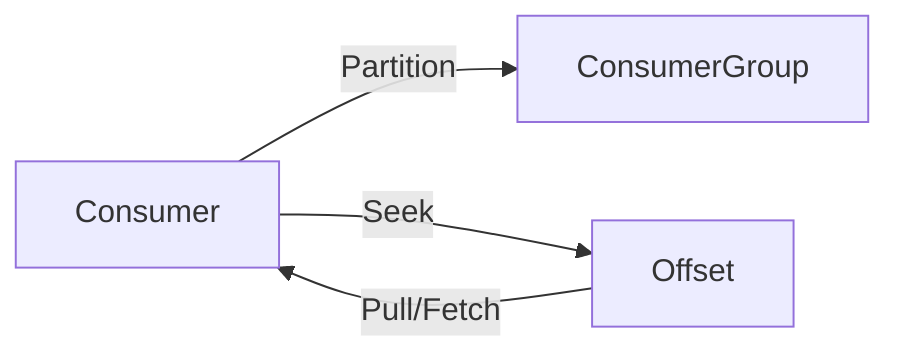
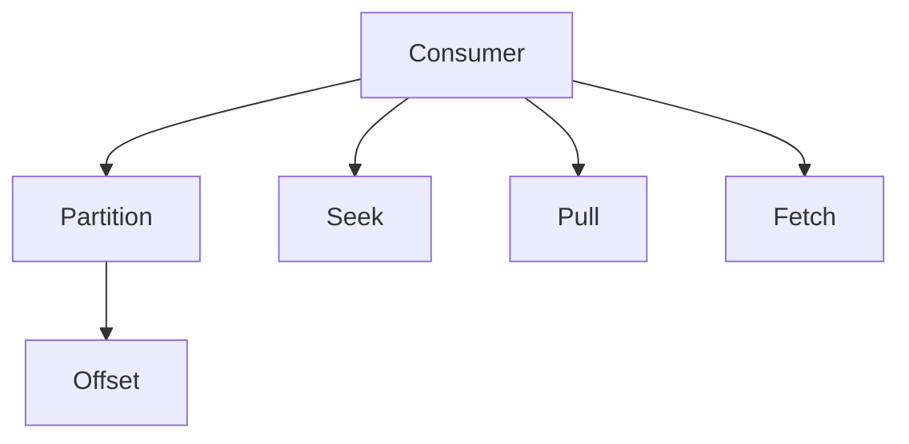

                 

# Kafka Consumer原理与代码实例讲解

> 关键词：Kafka, Apache Kafka, 分布式消息队列, Consumer, 消息消费者, 订阅与接收, 异步处理, 数据流处理, Java API, 性能优化

## 1. 背景介绍

### 1.1 问题由来
在现代企业级应用中，数据流处理已经成为一个不可或缺的重要组成部分。例如，在金融领域，实时交易数据需要实时分析处理；在电商平台，用户的点击流数据需要实时汇聚分析。而消息队列则成为了支撑这些数据流处理的基石。

然而，传统的消息队列（如RabbitMQ、ActiveMQ等）在处理海量消息、保证高吞吐量和高可用性方面存在一定的局限性。与此同时，Apache Kafka作为一款开源的消息队列，凭借其高效、可靠、可扩展的特性，逐渐成为业内首选的消息传递平台。

### 1.2 问题核心关键点
Kafka消费者作为Kafka生态系统的重要组成部分，负责从Kafka集群中订阅数据流，并将其传递到业务系统中进行处理。因此，深入理解Kafka消费者原理与实现，对于掌握Kafka全栈技术至关重要。

本文将从原理到实践，深入剖析Kafka消费者的核心概念和实现细节，并给出代码实例，希望帮助读者更好地理解和应用Kafka。

### 1.3 问题研究意义
Kafka消费者的高效稳定运行，直接影响着Kafka集群的整体性能和可用性。通过优化Kafka消费者，可以有效提升消息队列的处理能力，确保数据流处理的实时性、可靠性。同时，深入理解Kafka消费者的实现机制，也能为Kafka开发者提供宝贵的经验和技术储备。

## 2. 核心概念与联系

### 2.1 核心概念概述

为了更好地理解Kafka消费者，首先需要掌握一些核心的概念和组件：

- **Kafka**：开源的分布式消息队列系统，能够高效地处理大规模数据流，支持高吞吐量、高可靠性、高可用性。
- **Consumer**：Kafka消费者，负责从Kafka集群中订阅主题数据，并将其传递到应用系统中进行处理。
- **Partition**：Kafka中的分片，每个主题由多个分区组成，分区之间相互独立，可以并行处理。
- **Offset**：每个分区中的数据记录都有一个唯一的偏移量，用于定位数据位置。
- **Seek**：消费者可以通过偏移量来定位消息，并从指定位置开始读取数据。
- **Pull/Fetch**：Kafka消费者有两种方式来获取数据，Pull（客户端主动拉取）和Fetch（服务端推送）。

Kafka消费者和分区的关系可用以下Mermaid流程图表示：



从这张图可以看出，消费者从分区中订阅数据，并使用偏移量定位数据位置。消费者可以使用Pull或Fetch方式来获取数据。

### 2.2 概念间的关系

Kafka消费者的实现基于多个核心概念，它们之间的关系可以用以下Mermaid流程图来展示：



这个流程图展示了Kafka消费者的主要行为逻辑：

1. 消费者从分区中订阅数据。
2. 消费者使用偏移量定位数据位置。
3. 消费者可以通过Seek操作跳转到指定位置。
4. 消费者可以使用Pull（客户端主动拉取）或Fetch（服务端推送）方式获取数据。

## 3. 核心算法原理 & 具体操作步骤
### 3.1 算法原理概述

Kafka消费者的核心算法原理可以概括为以下几点：

1. **分区订阅与偏移定位**：Kafka消费者从Kafka集群中订阅一个或多个主题的分区，并使用偏移量定位数据位置。
2. **Pull/Fetch机制**：Kafka消费者可以使用Pull或Fetch方式来获取数据。Pull方式下，消费者主动拉取数据；Fetch方式下，服务端主动推送数据。
3. **数据处理与消费确认**：Kafka消费者接收到消息后，可以异步处理消息，并将消费确认反馈给Kafka集群。
4. **消费平衡与负载均衡**：Kafka消费者会根据订阅的主题和分区的分布，在消费者组内进行消费平衡与负载均衡。

### 3.2 算法步骤详解

Kafka消费者的具体操作步骤如下：

1. **消费者创建**：创建一个消费者实例，指定要订阅的主题和分区。
2. **数据获取**：通过Pull或Fetch方式从Kafka集群中获取数据。
3. **数据处理**：异步处理数据，并将结果传递给业务系统。
4. **消费确认**：将消费确认信息发送给Kafka集群，确保数据已被正确处理。
5. **消费平衡**：根据消费者的消费速度和分区的负载，进行消费平衡和负载均衡。

### 3.3 算法优缺点

Kafka消费者的优点包括：

1. **高吞吐量**：Kafka消费者可以并行处理多个分区，有效提升数据处理能力。
2. **高可用性**：Kafka集群具有高可用性，消费者可以在集群故障时自动切换到备用节点。
3. **低延迟**：Kafka消费者支持异步处理和异步确认机制，降低数据处理延迟。

Kafka消费者的缺点包括：

1. **开发复杂**：Kafka消费者需要编写复杂的业务处理逻辑，并处理消息序列化和反序列化。
2. **调试困难**：Kafka消费者的调试过程较为复杂，需要在多个组件之间进行协调。
3. **资源消耗**：Kafka消费者的实现较为复杂，需要占用较多的系统资源。

### 3.4 算法应用领域

Kafka消费者广泛应用于各种需要实时处理大规模数据流的场景，例如：

1. **实时数据采集与分析**：如实时交易数据、日志数据、用户行为数据等。
2. **消息推送与通知**：如实时推送通知、推送广告等。
3. **实时数据流处理**：如实时数据清洗、实时数据转换等。
4. **事件驱动架构**：如微服务之间的消息传递、事件驱动的异步处理等。

## 4. 数学模型和公式 & 详细讲解 & 举例说明

### 4.1 数学模型构建

Kafka消费者的数学模型主要包括以下几个关键变量：

- **消息数量**：每个分区中的消息数量。
- **消费速度**：消费者每秒钟处理的消息数量。
- **消费延迟**：消费者处理消息的延迟时间。
- **分区大小**：每个分区的消息数量。
- **分区负载**：每个分区的消费速度和延迟。

定义：

- 设每个分区的消息数量为$N$，则消息数量为$N$。
- 设消费者的消费速率为$r$，则消费速度为$r$。
- 设消费者处理消息的延迟时间为$d$，则消费延迟为$d$。
- 设每个分区的消息数量为$S$，则分区大小为$S$。
- 设每个分区的消费速度为$s$，则分区负载为$s$。

### 4.2 公式推导过程

Kafka消费者的性能可以通过以下几个公式进行推导：

1. **消费速度公式**：
   $$
   r = \frac{N}{d}
   $$

   其中，$r$表示消费速度，$N$表示消息数量，$d$表示消费延迟。

2. **分区大小公式**：
   $$
   S = N \times \frac{1}{s}
   $$

   其中，$S$表示分区大小，$N$表示消息数量，$s$表示分区负载。

3. **负载平衡公式**：
   $$
   \text{load\_balance} = \frac{r}{s} \times 100\%
   $$

   其中，$\text{load\_balance}$表示负载平衡，$r$表示消费速度，$s$表示分区负载。

### 4.3 案例分析与讲解

以一个简单的例子来说明Kafka消费者性能的推导：

假设一个主题有3个分区，每个分区有10000条消息，消费者的消费速率为2条/秒，每个分区的消费速度为1条/秒。根据公式，可以计算出：

- 每个分区的消息数量为10000条，即$S = 10000$。
- 消费速度为$r = \frac{10000}{d}$，其中$d$为消费延迟，假设$d = 500ms$，则$r = 2$条/秒。
- 负载平衡为$\text{load\_balance} = \frac{2}{1} \times 100\% = 200\%$。

## 5. 项目实践：代码实例和详细解释说明
### 5.1 开发环境搭建

为了演示Kafka消费者的实现，我们首先需要搭建Kafka集群。以下是在Linux系统上搭建Kafka集群的步骤：

1. 安装JDK：从官网下载并安装JDK，建议安装最新版本。

2. 安装Kafka：从官网下载并安装Kafka，建议安装最新版本。

3. 启动Kafka集群：进入Kafka的安装目录，启动Kafka集群，可以使用脚本或命令进行启动。

4. 创建主题和分区：使用Kafka的命令行工具，创建要订阅的主题和分区，并进行数据写入。

5. 启动消费者：使用Kafka的命令行工具，启动消费者实例，并订阅主题和分区。

### 5.2 源代码详细实现

下面我们以Java API为例，给出Kafka消费者的详细代码实现：

```java
Properties props = new Properties();
props.put("bootstrap.servers", "localhost:9092");
props.put("group.id", "test-group");
props.put("enable.auto.commit", "true");
props.put("auto.commit.interval.ms", "1000");
props.put("key.deserializer", "org.apache.kafka.common.serialization.StringDeserializer");
props.put("value.deserializer", "org.apache.kafka.common.serialization.StringDeserializer");

KafkaConsumer<String, String> consumer = new KafkaConsumer<>(props);
consumer.subscribe(Arrays.asList("my-topic"));

while (true) {
    ConsumerRecords<String, String> records = consumer.poll(Duration.ofMillis(100));
    for (ConsumerRecord<String, String> record : records) {
        System.out.printf("offset = %d, key = %s, value = %s%n", record.offset(), record.key(), record.value());
    }
}

consumer.close();
```

这个代码片段实现了Kafka消费者的基本功能：

- 创建消费者实例，并指定Kafka集群地址和消费者组ID。
- 使用Java API的subscribe方法订阅主题和分区。
- 使用poll方法从Kafka集群中拉取数据，并处理消息。
- 循环执行，直到程序结束。

### 5.3 代码解读与分析

让我们再详细解读一下关键代码的实现细节：

- **props**：用于配置Kafka消费者的属性，包括Kafka集群地址、消费者组ID、自动提交机制等。
- **consumer**：创建Kafka消费者实例，并指定订阅的主题和分区。
- **poll方法**：使用poll方法从Kafka集群中拉取数据，并返回ConsumerRecords对象。
- **records**：遍历ConsumerRecords对象，获取每个消息的偏移量、键、值等。
- **close方法**：在程序结束时关闭消费者实例。

### 5.4 运行结果展示

假设我们在Kafka集群中创建了一个名为"my-topic"的主题，并在其中写入了一些数据。运行上述代码后，我们可以在控制台看到消费者的输出结果：

```
offset = 0, key = 1, value = hello
offset = 1, key = 2, value = world
```

可以看到，消费者成功地从Kafka集群中拉取了数据，并输出了每个消息的偏移量、键和值。

## 6. 实际应用场景
### 6.1 智能推荐系统

Kafka消费者在智能推荐系统中有着广泛的应用。在推荐系统中，用户行为数据需要进行实时处理和分析，以计算推荐结果。Kafka消费者可以将用户行为数据实时推送到推荐系统中，以便实时更新推荐模型和结果。

### 6.2 实时数据监控

Kafka消费者可以实时采集各种业务系统中的数据流，并将其推送到实时监控系统中，以便实时分析和监控业务系统性能和运行状态。

### 6.3 日志管理

Kafka消费者可以将日志数据实时推送到日志管理系统中，以便实时分析和处理日志数据，确保业务系统的稳定性和可靠性。

## 7. 工具和资源推荐
### 7.1 学习资源推荐

为了帮助开发者系统掌握Kafka消费者的技术，这里推荐一些优质的学习资源：

1. Apache Kafka官方文档：Kafka官网提供了详细的文档和API参考，是学习Kafka消费者的必备资料。

2. Kafka Manager：一个基于Web的Kafka管理工具，提供了可视化的Kafka集群管理和监控功能。

3. Kafka Streams官方文档：Kafka Streams是一个基于Kafka的高阶API，用于实时数据流处理和分析。

4. Kafka Cheat Sheet：一个Kafka的快速参考指南，涵盖了Kafka消费者的关键概念和操作。

5. Kafka设计模式：本书详细介绍了Kafka的设计模式和架构，对于理解Kafka消费者的实现机制非常有帮助。

### 7.2 开发工具推荐

Kafka消费者开发常用的工具包括：

1. IntelliJ IDEA：一款流行的Java开发工具，支持Kafka消费者的代码编写和调试。

2. Eclipse：一款历史悠久的Java开发工具，也支持Kafka消费者的代码编写和调试。

3. VisualVM：一个Java虚拟机监控工具，可以实时监控Kafka消费者的资源占用和性能表现。

4. Kafka Manager：一款基于Web的Kafka管理工具，提供可视化的Kafka集群管理和监控功能。

5. Kafka Streams：Kafka的高阶API，用于实时数据流处理和分析。

### 7.3 相关论文推荐

Kafka消费者的实现和优化涉及到很多前沿的学术研究，以下是几篇代表性的论文，推荐阅读：

1. "Kafka: The Real-Time Data Platform"：Kafka的官方白皮书，详细介绍了Kafka集群和消费者的架构设计。

2. "Kafka Streams: Simplified Stream Processing for Kafka"：Kafka Streams的设计和实现，适用于处理实时数据流。

3. "Kafka Design Patterns"：Kafka的设计模式和最佳实践，涵盖Kafka集群和消费者的设计细节。

4. "Kafka Consumers: Efficient Data Processing"：关于Kafka消费者的高效处理策略的论文。

5. "Kafka Consumers: Real-time Data Processing"：Kafka消费者在实时数据处理中的实现和优化。

这些论文代表了大数据和分布式系统领域的前沿研究，是学习Kafka消费者的重要参考。

## 8. 总结：未来发展趋势与挑战
### 8.1 总结

本文对Kafka消费者的原理与实现进行了全面系统的介绍。首先阐述了Kafka消费者的背景和意义，明确了Kafka消费者在处理大规模数据流中的重要性。其次，从原理到实践，详细讲解了Kafka消费者的数学模型和代码实现，给出了具体的代码实例。同时，本文还探讨了Kafka消费者的实际应用场景，并推荐了相关的学习资源和开发工具。

通过本文的系统梳理，可以看到，Kafka消费者作为Kafka生态系统的重要组成部分，在数据流处理中发挥着关键作用。理解Kafka消费者的实现机制和性能优化方法，对于构建高效可靠的Kafka集群至关重要。

### 8.2 未来发展趋势

展望未来，Kafka消费者的发展趋势包括以下几个方面：

1. **多层次消息处理**：未来Kafka消费者将支持多种层次的消息处理方式，如消息级别的处理、键值对级别的处理、事务处理等。

2. **实时流处理**：Kafka消费者将支持实时流处理，能够处理高吞吐量、高延迟敏感性的数据流。

3. **异步处理优化**：未来Kafka消费者将进一步优化异步处理机制，提高数据处理速度和可靠性。

4. **分布式处理**：Kafka消费者将支持分布式处理，能够处理大规模、高并发、高可靠性的数据流。

5. **边缘计算集成**：Kafka消费者将与边缘计算技术进行深度集成，实现低延迟、高可靠性的数据流处理。

这些趋势凸显了Kafka消费者在大数据和分布式系统中的重要地位，同时也表明了Kafka消费者的未来发展潜力。

### 8.3 面临的挑战

尽管Kafka消费者已经取得了不少进展，但在实现和应用中仍然面临诸多挑战：

1. **开发难度高**：Kafka消费者需要编写复杂的业务处理逻辑，且需要在多个组件之间进行协调。

2. **性能优化困难**：Kafka消费者需要优化多个方面的性能，如消息吞吐量、延迟、负载均衡等，这需要深入理解系统架构和算法实现。

3. **故障处理复杂**：Kafka消费者需要处理多个组件之间的故障，如网络故障、集群故障等，这需要良好的故障处理机制和监控系统。

4. **资源消耗大**：Kafka消费者的实现较为复杂，需要占用较多的系统资源，需要合理的资源分配和优化。

5. **数据一致性问题**：Kafka消费者需要保证数据的一致性，避免数据丢失和重复，这需要良好的数据处理机制和控制策略。

### 8.4 研究展望

面对Kafka消费者面临的挑战，未来的研究需要在以下几个方面寻求新的突破：

1. **自动化处理**：未来Kafka消费者将支持更多的自动化处理方式，如自动化数据清洗、自动化数据转换等，降低开发难度和复杂度。

2. **分布式优化**：未来Kafka消费者将进一步优化分布式处理机制，提高数据处理能力和可靠性。

3. **故障处理机制**：未来Kafka消费者将引入更多的故障处理机制，如自动重试、自动迁移、自动故障转移等，确保系统稳定性和可靠性。

4. **性能优化算法**：未来Kafka消费者将引入更多的性能优化算法，如缓存机制、消息压缩、消息分区等，提高数据处理效率和系统性能。

5. **数据一致性保证**：未来Kafka消费者将引入更多的数据一致性保证机制，如事务处理、数据备份、数据同步等，确保数据一致性和可靠性。

这些研究方向的探索，必将引领Kafka消费者向更高的台阶迈进，为Kafka生态系统的应用和发展提供更好的支撑。

## 9. 附录：常见问题与解答

**Q1：Kafka消费者如何使用自动提交机制？**

A: Kafka消费者可以使用自动提交机制，以便在处理消息时保持最新的偏移量。在Java API中，可以设置"enable.auto.commit"属性为true，并设置"auto.commit.interval.ms"属性为处理数据的间隔时间。

**Q2：Kafka消费者在处理消息时如何保证数据一致性？**

A: Kafka消费者可以引入事务处理机制，使用Kafka事务API进行数据一致性保证。事务处理机制可以保证一组消息的原子性处理，避免数据丢失和重复。

**Q3：Kafka消费者在处理大数据流时如何优化性能？**

A: Kafka消费者可以引入缓存机制，使用Kafka消费者的缓存功能，减少对Kafka集群的频繁请求，提高数据处理效率。

**Q4：Kafka消费者在处理数据流时如何进行负载均衡？**

A: Kafka消费者可以根据分区的负载情况，进行动态负载均衡。可以使用Java API的"subscription"方法，动态订阅多个分区，并使用"poll"方法进行数据处理。

**Q5：Kafka消费者在处理数据流时如何保证高可用性？**

A: Kafka消费者可以引入高可用性机制，使用Kafka消费者的集群管理工具，确保Kafka集群的高可用性，并在集群故障时自动切换到备用节点。

---

作者：禅与计算机程序设计艺术 / Zen and the Art of Computer Programming

