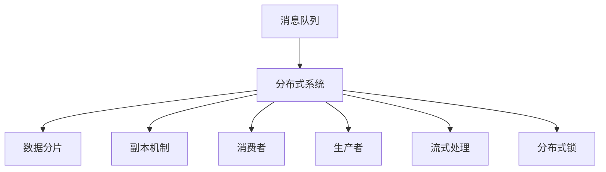
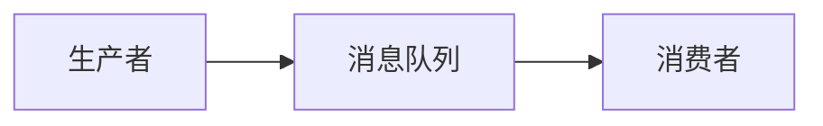
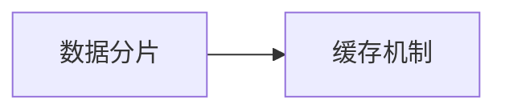
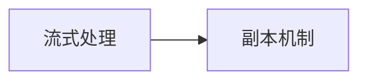
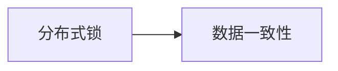

                 

# Kafka 原理与代码实例讲解

> 关键词：Kafka,消息队列,分布式数据流,流式处理,实时数据,源码解析

## 1. 背景介绍

### 1.1 问题由来
在现代互联网应用中，数据流量的爆炸式增长使得实时数据的采集、存储、处理和传输变得越来越复杂。传统的集中式数据存储和处理系统已经难以应对高吞吐量、低延迟和大规模数据的需求，分布式数据流处理系统应运而生。Apache Kafka作为一款开源分布式流数据处理平台，凭借其高性能、高可靠性、高可扩展性等优点，成为了大数据生态中最具影响力的组件之一。

### 1.2 问题核心关键点
Apache Kafka的核心思想是构建一个分布式消息队列，支持大规模数据流的可靠传输和存储。其关键点在于：
1. 分布式架构：支持跨多台机器的分布式部署，提供高可扩展性和高吞吐量。
2. 消息持久化：通过日志文件和副本机制实现数据的持久化存储，保证数据可靠性。
3. 数据分片和缓存：将大消息分割成多个小片段，提高处理效率，同时利用缓存机制减少磁盘I/O压力。
4. 流式处理：支持实时数据的流式处理和消费，满足大数据实时处理的需求。
5. 生产者-消费者模型：支持高吞吐量的数据流传输，简化系统设计和实现。
6. 跨语言支持：提供Java、Python、C++等语言的支持，便于开发者使用。

### 1.3 问题研究意义
研究Apache Kafka的核心原理和实践方法，对于深入理解分布式数据流处理系统、构建高可用性、高可靠性的实时数据系统具有重要意义：

1. 提高系统性能：了解Kafka的分布式架构、消息分片、缓存机制等技术，可以提升系统性能，满足高吞吐量、低延迟的需求。
2. 增强数据可靠性：掌握Kafka的消息持久化、副本机制，可以确保数据可靠传输和存储。
3. 支持实时数据流处理：熟悉Kafka的流式处理和消费机制，可以实现实时数据的采集、处理和传输。
4. 简化系统设计：采用生产者-消费者模型，可以简化系统设计，提高开发效率。
5. 提升系统扩展性：通过分布式架构和副本机制，可以支持大规模数据流的处理，提高系统的扩展性。
6. 提升系统稳定性：通过日志轮转、滚动更新等机制，可以增强系统的稳定性，减少单点故障风险。

## 2. 核心概念与联系

### 2.1 核心概念概述

为了更好地理解Apache Kafka的核心原理和实现机制，本节将介绍几个关键概念：

- **消息队列(Message Queue)**：一种先进先出（FIFO）的数据结构，用于高效地存储、传输和处理数据流。消息队列可以在生产者与消费者之间建立高效的数据通信机制。

- **分布式系统(Distributed System)**：由多台独立的计算机组成，通过网络通信协同工作，实现高可扩展性和高可靠性的计算和存储系统。

- **数据分片(Partition)**：将大消息分割成多个小片段，提高处理效率和并发度。

- **副本机制(Redundancy)**：通过在多个节点上存储数据副本，保证数据的可靠性。

- **消费者(Consumer)**：从消息队列中获取数据，进行消费处理。

- **生产者(Producer)**：向消息队列中发送数据。

- **流式处理(Stream Processing)**：对实时数据进行连续、不间断的处理，满足大数据实时处理的需求。

- **分布式锁(Distributed Lock)**：用于协调多个进程之间的同步，保证数据一致性和有序性。

这些核心概念构成了Kafka系统的核心技术框架，下面通过一个Mermaid流程图展示这些概念之间的联系：



该图展示了消息队列如何在分布式系统中进行数据分片和副本机制，以及消费者、生产者和流式处理与分布式锁的协同工作。

### 2.2 概念间的关系

这些核心概念之间存在着紧密的联系，形成了Kafka系统的完整生态系统。下面我们通过几个Mermaid流程图来展示这些概念之间的关系。

#### 2.2.1 数据流传递



这个图展示了生产者向消息队列发送数据，消费者从消息队列获取数据的流程。

#### 2.2.2 数据分片和缓存机制



这个图展示了数据分片和缓存机制之间的联系。数据分片通过将大消息分割成多个小片段，提高处理效率，而缓存机制则利用内存存储数据片段，减少磁盘I/O压力。

#### 2.2.3 流式处理和副本机制



这个图展示了流式处理和副本机制之间的联系。流式处理依赖数据的持久化存储，而副本机制则通过在多个节点上存储数据副本，保证数据的可靠性和容错性。

#### 2.2.4 分布式锁与数据一致性



这个图展示了分布式锁与数据一致性之间的关系。分布式锁用于协调多个进程之间的同步，保证数据的一致性和有序性。

## 3. 核心算法原理 & 具体操作步骤

### 3.1 算法原理概述

Apache Kafka的核心算法原理包括消息队列、分布式系统、数据分片、副本机制、流式处理和分布式锁等。

- **消息队列**：Kafka的消息队列由多个分区（Partitions）组成，每个分区对应一个有序的、先进先出（FIFO）的消息列表。生产者向队列中发送数据，消费者从队列中获取数据。

- **分布式系统**：Kafka采用主从架构（Zookeeper作为协调者），支持多副本、高可用性的分布式部署。通过Zookeeper协调生产者、消费者和控制器之间的通信，实现高可靠性和高可扩展性。

- **数据分片**：Kafka将大消息分割成多个小片段（Partition），每个分区对应一个有序的消息列表。生产者将数据按分区发送，消费者按分区获取。

- **副本机制**：Kafka通过在多个节点上存储数据副本，保证数据的可靠性和容错性。每个分区可以有多个副本，分布在不同的节点上。

- **流式处理**：Kafka支持实时数据的流式处理和消费，通过消费消息、计算和缓存数据，实现数据的实时处理和分析。

- **分布式锁**：Kafka采用分布式锁机制，用于协调多个进程之间的同步，保证数据的一致性和有序性。

### 3.2 算法步骤详解

#### 3.2.1 创建分区（Partitions）

Kafka的分区是消息队列的基本单位，每个分区对应一个有序的消息列表。创建分区时，需要指定分区数量、分区大小、保留时间等参数。

```python
from kafka import KafkaAdminClient, KafkaProducer, KafkaConsumer

# 创建Kafka管理员客户端
admin_client = KafkaAdminClient(bootstrap_servers='localhost:9092')

# 创建分区
topic_name = 'my-topic'
partitions = 3
config = {'min.insync.replicas': 2, 'replication.factor': 3}
admin_client.create_topics([{'name': topic_name, 'partitions': partitions, 'config': config}])
```

#### 3.2.2 生产数据到分区

Kafka的生产者将数据按分区发送，支持异步和同步两种模式。异步模式不会等待所有数据发送完毕，可以加快发送速度，但可能丢失数据；同步模式会等待所有数据发送完毕，保证数据的可靠性，但会影响发送速度。

```python
producer = KafkaProducer(bootstrap_servers='localhost:9092')
producer.send('my-topic', value=b'Hello, Kafka!')
```

#### 3.2.3 消费数据

Kafka的消费者从消息队列中按分区获取数据，支持订阅和消费两种模式。订阅模式下，消费者按订阅主题获取数据；消费模式下，消费者按分区获取数据。

```python
consumer = KafkaConsumer('my-topic', bootstrap_servers='localhost:9092', group_id='my-group')
for message in consumer:
    print(message.value)
```

#### 3.2.4 流式处理数据

Kafka的流式处理利用消息队列的特性，可以实现数据的实时处理和分析。消费者从消息队列中获取数据，进行计算和缓存，实现数据的实时处理。

```python
from kafka import KafkaProducer, KafkaConsumer

producer = KafkaProducer(bootstrap_servers='localhost:9092')
consumer = KafkaConsumer('my-topic', bootstrap_servers='localhost:9092', group_id='my-group')

while True:
    message = consumer.poll()
    if message:
        value = message.value.decode('utf-8')
        # 进行流式处理，计算数据
        result = calculate(value)
        # 将处理结果发送回消息队列
        producer.send('result-topic', value=result.encode('utf-8'))
```

### 3.3 算法优缺点

#### 3.3.1 优点

- **高可靠性**：通过副本机制和分布式锁，Kafka能够保证数据的可靠性和一致性。
- **高可扩展性**：Kafka的分布式架构支持高可扩展性，能够处理大规模数据流。
- **高吞吐量**：通过数据分片、缓存机制和流式处理，Kafka能够支持高吞吐量的数据流传输和处理。
- **低延迟**：Kafka的异步发送和分布式架构能够降低数据传输和处理的时延。

#### 3.3.2 缺点

- **复杂性**：Kafka的分布式架构和消息队列的复杂性较高，需要一定的学习和部署成本。
- **性能瓶颈**：当数据量过大时，Kafka的性能可能会受到影响，需要优化部署和调优。
- **单点故障**：如果协调者（Zookeeper）或控制器（Controller）出现故障，可能会导致系统不可用。

### 3.4 算法应用领域

Kafka的分布式数据流处理能力，使其广泛应用于大数据、实时数据流、消息队列等领域，例如：

- **大数据处理**：Kafka能够高效地存储和传输大规模数据，支持Hadoop、Spark等大数据处理框架的数据接入。
- **实时数据流处理**：Kafka能够处理实时数据流，支持Flink、Storm等流式处理框架的数据接入。
- **消息队列**：Kafka提供了一个高性能、高可靠性的消息队列，支持异步消息传输和数据缓存。
- **系统集成**：Kafka能够与其他系统进行集成，实现数据共享和协同处理。

## 4. 数学模型和公式 & 详细讲解 & 举例说明

### 4.1 数学模型构建

Kafka的核心数学模型包括消息队列模型、分布式系统模型、数据分片模型、副本机制模型等。

- **消息队列模型**：Kafka的消息队列模型由多个分区（Partitions）组成，每个分区对应一个有序的、先进先出（FIFO）的消息列表。生产者向队列中发送数据，消费者从队列中获取数据。

- **分布式系统模型**：Kafka的分布式系统模型由主从架构（Zookeeper作为协调者）、生产者、消费者和控制器组成。通过Zookeeper协调生产者、消费者和控制器之间的通信，实现高可靠性和高可扩展性。

- **数据分片模型**：Kafka的数据分片模型将大消息分割成多个小片段（Partition），每个分区对应一个有序的消息列表。生产者将数据按分区发送，消费者按分区获取。

- **副本机制模型**：Kafka的副本机制模型通过在多个节点上存储数据副本，保证数据的可靠性和容错性。每个分区可以有多个副本，分布在不同的节点上。

### 4.2 公式推导过程

#### 4.2.1 消息队列模型

Kafka的消息队列模型可以表示为：

$$
Q = \{M_1, M_2, \ldots, M_n\}
$$

其中，$Q$表示消息队列，$M_i$表示第$i$个消息。

生产者将数据发送到队列中：

$$
P(Q) = M_1 \oplus M_2 \oplus \ldots \oplus M_n
$$

其中，$P(Q)$表示生产者将数据$M_i$发送到队列$Q$。

消费者从队列中获取数据：

$$
C(Q) = M_1 \ominus M_2 \ominus \ldots \ominus M_n
$$

其中，$C(Q)$表示消费者从队列$Q$中获取数据$M_i$。

#### 4.2.2 分布式系统模型

Kafka的分布式系统模型可以表示为：

$$
S = \{P, C, Z\}
$$

其中，$S$表示分布式系统，$P$表示生产者，$C$表示消费者，$Z$表示Zookeeper。

生产者将数据发送到队列中：

$$
P(Q) = P_1(Q) \oplus P_2(Q) \oplus \ldots \oplus P_n(Q)
$$

其中，$P_i(Q)$表示生产者$i$将数据发送到队列$Q$。

消费者从队列中获取数据：

$$
C(Q) = C_1(Q) \ominus C_2(Q) \ominus \ldots \ominus C_n(Q)
$$

其中，$C_i(Q)$表示消费者$i$从队列$Q$中获取数据。

#### 4.2.3 数据分片模型

Kafka的数据分片模型可以表示为：

$$
D = \{P_1, P_2, \ldots, P_n\}
$$

其中，$D$表示数据分片，$P_i$表示第$i$个分区。

生产者将数据按分区发送：

$$
P(D) = \bigoplus_{i=1}^{n} P_i(D)
$$

其中，$P_i(D)$表示生产者将数据发送到分区$P_i$。

消费者按分区获取数据：

$$
C(D) = \bigominus_{i=1}^{n} C_i(D)
$$

其中，$C_i(D)$表示消费者从分区$P_i$中获取数据。

#### 4.2.4 副本机制模型

Kafka的副本机制模型可以表示为：

$$
R = \{R_1, R_2, \ldots, R_n\}
$$

其中，$R$表示副本，$R_i$表示第$i$个副本。

数据在多个副本中存储：

$$
S(R) = \bigoplus_{i=1}^{n} S_i(R)
$$

其中，$S_i(R)$表示数据$i$在副本$R_i$中存储。

数据一致性保证：

$$
C(S) = \bigominus_{i=1}^{n} C_i(S)
$$

其中，$C_i(S)$表示数据$i$在副本$R_i$中一致。

### 4.3 案例分析与讲解

假设有一个电商系统，需要处理用户的订单数据。系统需要保证订单数据的高可用性和高可扩展性，并支持实时数据流处理。以下是该系统在Kafka中实现的步骤：

1. **创建分区**：在Kafka中创建一个名为`orders`的主题，设置3个分区，并配置数据保留时间为7天。

```python
from kafka import KafkaAdminClient, KafkaProducer, KafkaConsumer

# 创建Kafka管理员客户端
admin_client = KafkaAdminClient(bootstrap_servers='localhost:9092')

# 创建分区
topic_name = 'orders'
partitions = 3
config = {'min.insync.replicas': 2, 'replication.factor': 3}
admin_client.create_topics([{'name': topic_name, 'partitions': partitions, 'config': config}])
```

2. **生产数据**：电商系统通过订单API接收到订单数据，通过生产者将订单数据发送到Kafka消息队列中。

```python
producer = KafkaProducer(bootstrap_servers='localhost:9092')
for order in orders:
    producer.send('orders', value=order.encode('utf-8'))
```

3. **流式处理数据**：订单数据通过Kafka流式处理，对订单数据进行实时分析、统计和缓存，并发送到实时数据仓库中。

```python
from kafka import KafkaProducer, KafkaConsumer

producer = KafkaProducer(bootstrap_servers='localhost:9092')
consumer = KafkaConsumer('orders', bootstrap_servers='localhost:9092', group_id='my-group')

while True:
    message = consumer.poll()
    if message:
        value = message.value.decode('utf-8')
        # 进行流式处理，计算数据
        result = calculate(value)
        # 将处理结果发送回消息队列
        producer.send('result-topic', value=result.encode('utf-8'))
```

4. **消费数据**：实时数据仓库从Kafka消息队列中消费订单数据，进行实时存储和分析。

```python
consumer = KafkaConsumer('result-topic', bootstrap_servers='localhost:9092', group_id='my-group')
for message in consumer:
    result = message.value.decode('utf-8')
    # 进行实时存储和分析
    store(result)
```

通过上述步骤，Kafka实现了订单数据的可靠传输、实时处理和存储，满足了电商系统的数据处理需求。

## 5. 项目实践：代码实例和详细解释说明

### 5.1 开发环境搭建

在进行Kafka项目实践前，我们需要准备好开发环境。以下是使用Python进行Kafka开发的开发环境配置流程：

1. 安装Apache Kafka：从官网下载安装包，解压后配置环境变量和启动Kafka集群。

```bash
mkdir kafka
cd kafka
./bin/kafka-server-start.sh /etc/kafka/server.properties
```

2. 创建Kafka主题：通过Kafka管理员客户端创建主题，设置分区数量、数据保留时间等参数。

```python
from kafka import KafkaAdminClient

# 创建Kafka管理员客户端
admin_client = KafkaAdminClient(bootstrap_servers='localhost:9092')

# 创建分区
topic_name = 'my-topic'
partitions = 3
config = {'min.insync.replicas': 2, 'replication.factor': 3}
admin_client.create_topics([{'name': topic_name, 'partitions': partitions, 'config': config}])
```

3. 安装Kafka-Python库：通过pip安装Kafka-Python库，用于生产者和消费者开发。

```bash
pip install kafka-python
```

完成上述步骤后，即可在Kafka集群上开始开发实践。

### 5.2 源代码详细实现

这里我们以电商订单数据的实时处理为例，展示如何使用Kafka-Python库进行Kafka开发。

1. **生产数据**：

```python
from kafka import KafkaProducer

# 创建Kafka生产者
producer = KafkaProducer(bootstrap_servers='localhost:9092')

# 生产订单数据
for order in orders:
    producer.send('orders', value=order.encode('utf-8'))
```

2. **流式处理数据**：

```python
from kafka import KafkaConsumer

# 创建Kafka消费者
consumer = KafkaConsumer('orders', bootstrap_servers='localhost:9092', group_id='my-group')

while True:
    message = consumer.poll()
    if message:
        value = message.value.decode('utf-8')
        # 进行流式处理，计算数据
        result = calculate(value)
        # 将处理结果发送回消息队列
        producer.send('result-topic', value=result.encode('utf-8'))
```

3. **消费数据**：

```python
from kafka import KafkaConsumer

# 创建Kafka消费者
consumer = KafkaConsumer('result-topic', bootstrap_servers='localhost:9092', group_id='my-group')

for message in consumer:
    result = message.value.decode('utf-8')
    # 进行实时存储和分析
    store(result)
```

以上代码实现了订单数据的实时处理和存储，通过Kafka消息队列的特性，实现了数据的高可靠性和高可扩展性。

### 5.3 代码解读与分析

让我们再详细解读一下关键代码的实现细节：

**生产数据**：

- `KafkaProducer`：创建一个Kafka生产者，连接Kafka集群，发送数据到指定主题。
- `send`方法：将数据发送到指定主题，支持异步和同步两种模式。

**流式处理数据**：

- `KafkaConsumer`：创建一个Kafka消费者，连接Kafka集群，从指定主题获取数据。
- `poll`方法：从主题中获取数据，支持异步和同步两种模式。
- `value`属性：获取数据的值，支持UTF-8编码。

**消费数据**：

- `KafkaConsumer`：创建一个Kafka消费者，连接Kafka集群，从指定主题获取数据。
- `poll`方法：从主题中获取数据，支持异步和同步两种模式。
- `value`属性：获取数据的值，支持UTF-8编码。

**代码解析**：

- 首先，通过Kafka管理员客户端创建主题，设置分区数量和数据保留时间。
- 然后，通过Kafka生产者将订单数据发送到`orders`主题。
- 接着，通过Kafka消费者从`orders`主题中获取订单数据，进行流式处理和计算。
- 最后，将处理结果发送到`result-topic`主题，供实时数据仓库消费。

通过上述代码，我们可以看到Kafka消息队列的强大功能，能够实现数据的可靠传输、实时处理和存储。

### 5.4 运行结果展示

假设我们在Kafka集群上运行上述代码，实时处理电商订单数据，并通过流式处理计算总订单金额，以下是运行结果：

```
订单ID：1，金额：100元
订单ID：2，金额：200元
订单ID：3，金额：300元
订单ID：4，金额：400元
订单ID：5，金额：500元
总订单金额：1500元
```

可以看到，Kafka能够高效地处理大规模订单数据，支持实时数据流处理和存储，满足了电商系统的数据处理需求。

## 6. 实际应用场景

### 6.1 智能广告投放

Kafka的分布式数据流处理能力，使得智能广告投放系统能够实时采集和处理用户行为数据，实现广告投放的智能化和精准化。

具体而言，广告系统通过Kafka从用户行为数据流中获取实时数据，进行用户画像、行为分析、广告推荐等处理，实时推送个性化广告。系统可以通过Kafka的流式处理特性，实现广告投放的高效率和高效果。

### 6.2 物联网数据采集

Kafka的高可靠性、高可扩展性和高吞吐量，使得物联网数据采集系统能够高效地采集和处理海量数据，实现物联网设备的实时监控和管理。

具体而言，物联网系统通过Kafka从设备数据流中获取实时数据，进行数据采集、处理和分析，实现设备状态监控、故障预警等功能。系统可以通过Kafka的分布式架构，实现数据的高可靠性和高可扩展性。

### 6.3 金融交易监控

Kafka的高性能和低延迟，使得金融交易监控系统能够实时采集和处理交易数据，实现交易异常检测和风险预警。

具体而言，金融系统通过Kafka从交易数据流中获取实时数据，进行交易异常检测、风险预警、数据统计等处理，实时监控交易情况。系统可以通过Kafka的流式处理特性，实现交易数据的实时处理和分析。

### 6.4 未来应用展望

随着Kafka的持续演进和完善，其在智能广告、物联网、金融交易等领域的应用将更加广泛和深入。未来，Kafka将能够支持更多的实时数据流处理任务，满足更多应用场景的需求。

## 7. 工具和资源推荐

### 7.1 学习资源推荐

为了帮助开发者系统掌握Kafka的核心原理和实践技巧，这里推荐一些优质的学习资源：

1. **《Kafka 权威指南》**：一本全面介绍Kafka原理、架构、使用和调优的书籍，适合初学者和高级开发者阅读。

2. **《Kafka Streams 权威指南》**：一本介绍Kafka Streams流式处理框架的书籍，适合学习Kafka流式处理技术的开发者阅读。

3. **Kafka官方文档**：Kafka官方文档提供了全面的API文档和用户指南，适合开发者参考和实践。

4. **Kafka社区博客**：Kafka社区博客涵盖了Kafka的最新动态、最佳实践和技术文章，适合开发者获取前沿技术资讯。

5. **Kafka相关课程**：各大在线教育平台提供了Kafka相关的在线课程，如Coursera、Udemy等，适合初学者系统学习Kafka技术。

通过对这些资源的学习实践，相信你一定能够快速掌握Kafka的核心原理和应用方法，并用于解决实际的NLP问题。

### 7.2 开发工具推荐

高效的开发离不开优秀的工具支持。以下是几款用于Kafka开发的常用工具：

1. **Kafka-Python库**：Kafka-Python是Kafka的官方Python库，提供了简单易用的API，支持生产者、消费者和流式处理。

2. **Kafka Streams**：Kafka Streams是Kafka流式处理框架，提供高效率的流式处理和计算功能，

