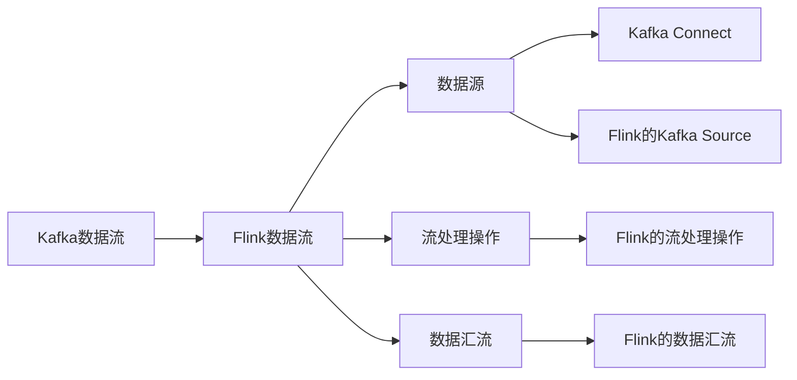

                 

# Kafka-Flink整合原理与代码实例讲解

在当今大数据时代，Kafka和Flink作为两大主流的数据流处理框架，它们的整合已经成为大数据处理的重要方向。本文将详细讲解Kafka与Flink的整合原理，并通过代码实例演示如何在生产环境中实现数据的可靠传输与高效处理。

## 1. 背景介绍

### 1.1 问题由来
Kafka是一个开源的分布式流处理平台，能够处理海量数据流。而Flink是一个开源的流处理框架，提供了一站式的数据流处理解决方案。在实际应用中，Kafka与Flink的整合，可以高效地处理实时数据流，支持高吞吐量和低延迟的实时数据处理需求。

### 1.2 问题核心关键点
Kafka-Flink整合的核心关键点主要包括以下几个方面：
1. Kafka数据流的基本概念
2. Flink数据流的流处理机制
3. Kafka与Flink的集成机制

## 2. 核心概念与联系

### 2.1 核心概念概述

#### 2.1.1 Kafka数据流
Kafka是一个分布式流平台，通过发布-订阅模型实现数据流传输。Kafka数据流由主题、分区、消息组成。主题是数据流的分类，分区是数据流的逻辑划分，消息是数据流的基本单位。

#### 2.1.2 Flink数据流
Flink是一个流处理框架，采用事件驱动的流处理模型。Flink数据流由数据源、流处理操作、数据汇流组成。数据源是数据流的输入，流处理操作是对数据流的变换，数据汇流是数据流的输出。

#### 2.1.3 Kafka与Flink的集成机制
Kafka与Flink的集成机制主要包括两种方式：
1. Kafka Connect：通过Kafka Connect的Flink Source和Sink，实现Kafka数据流到Flink数据流的传输。
2. Flink的Kafka 0.10 Source和Sink：直接在Flink中实现Kafka数据的读取和写入。

### 2.2 概念间的关系

Kafka和Flink的整合涉及以下几个核心概念及其相互关系：



该流程图展示了Kafka与Flink的整合过程，Kafka数据流通过Kafka Connect或Flink的Kafka Source读入Flink，然后通过Flink的流处理操作进行数据变换，最终通过Flink的数据汇流输出。

## 3. 核心算法原理 & 具体操作步骤

### 3.1 算法原理概述

Kafka-Flink整合的核心原理可以概括为以下几点：
1. Kafka提供可靠的数据传输机制，确保数据的可靠性和完整性。
2. Flink提供强大的流处理能力，支持高效的数据流处理和计算。
3. Kafka Connect和Flink的Kafka Source/Sink作为桥梁，实现数据的无缝衔接。

### 3.2 算法步骤详解

#### 3.2.1 数据流传输步骤

1. Kafka数据流通过Kafka Connect或Flink的Kafka Source读入Flink。
2. 数据通过Flink的流处理操作进行变换和计算。
3. 最终结果通过Flink的数据汇流输出。

#### 3.2.2 数据流处理步骤

1. Flink从Kafka Connect或Flink的Kafka Source读取数据流。
2. 数据流经过Flink的流处理操作进行计算和变换。
3. 计算结果通过Flink的数据汇流写入Kafka Connect或Flink的Kafka Sink。

### 3.3 算法优缺点

Kafka-Flink整合的优点：
1. Kafka和Flink都是开源框架，易于使用和部署。
2. Kafka提供可靠的数据传输机制，保证数据的一致性和可靠性。
3. Flink提供强大的流处理能力，支持高效的数据流处理和计算。

Kafka-Flink整合的缺点：
1. Kafka和Flink都需要部署和管理，增加了系统的复杂性。
2. Kafka Connect和Flink的Kafka Source/Sink需要配置，增加了使用的复杂性。

### 3.4 算法应用领域

Kafka-Flink整合主要应用于以下领域：
1. 实时数据处理
2. 大数据分析
3. 实时监控和告警

## 4. 数学模型和公式 & 详细讲解

### 4.1 数学模型构建

假设Kafka数据流的主题为topic，分区数为partitions，消息为records，Flink数据流的输入数据源为Kafka Connect或Flink的Kafka Source，流处理操作为Transformation，输出数据汇流为Flink的数据汇流。

### 4.2 公式推导过程

1. Kafka数据流的基本公式：
$$
\text{inputData} = \sum_{i=1}^{N} \sum_{j=1}^{P} \sum_{k=1}^{R} \text{inputData}_{i,j,k}
$$
其中，$N$为Kafka数据流的主题数量，$P$为每个主题的分区数量，$R$为每个分区的消息数量，$\text{inputData}_{i,j,k}$为每个分区和消息的输入数据。

2. Flink数据流的流处理公式：
$$
\text{outputData} = \text{Transformation}(\text{inputData})
$$
其中，$\text{outputData}$为Flink数据流的输出数据，$\text{Transformation}$为Flink的流处理操作。

3. Kafka与Flink的集成公式：
$$
\text{outputData} = \text{FlinkSink}(\text{outputData'})
$$
其中，$\text{outputData'}$为Flink数据流的输出数据，$\text{FlinkSink}$为Flink的数据汇流。

### 4.3 案例分析与讲解

假设我们使用Kafka Connect作为Kafka与Flink的集成方式，具体步骤如下：
1. 在Kafka中创建主题topic，并配置分区和消息数量。
2. 使用Kafka Connect将Kafka数据流读入Flink。
3. 在Flink中定义流处理操作，进行数据计算和变换。
4. 通过Flink的数据汇流将结果写入Kafka Connect，完成数据流传输。

## 5. 项目实践：代码实例和详细解释说明

### 5.1 开发环境搭建

为了在生产环境中实现Kafka-Flink的整合，需要搭建如下开发环境：
1. Kafka集群：包括Kafka Server、Zookeeper和Kafka Connect。
2. Flink集群：包括Flink Master和Flink Worker。
3. Kafka Connect：包括Kafka Connect Source和Kafka Connect Sink。

### 5.2 源代码详细实现

以下是一个简单的Kafka-Flink整合的代码实现：

```java
import org.apache.flink.api.common.serialization.SimpleStringSchema;
import org.apache.flink.streaming.api.environment.StreamExecutionEnvironment;
import org.apache.flink.streaming.connectors.kafka.FlinkKafkaConsumer;
import org.apache.flink.streaming.connectors.kafka.FlinkKafkaProducer;
import org.apache.kafka.clients.consumer.KafkaConsumer;
import org.apache.kafka.clients.producer.KafkaProducer;

public class KafkaFlinkIntegrate {
    public static void main(String[] args) throws Exception {
        // 初始化Kafka集群
        KafkaProducer<String, String> kafkaProducer = new KafkaProducer<>(kafkaProperties);
        kafkaProducer.send(new ProducerRecord<>("topic", "message"));
        kafkaProducer.close();

        // 初始化Flink集群
        StreamExecutionEnvironment env = StreamExecutionEnvironment.getExecutionEnvironment();

        // 定义Kafka Connect的Flink Source
        FlinkKafkaConsumer<String, String> kafkaConsumer = new FlinkKafkaConsumer<>("topic", new SimpleStringSchema(), kafkaProperties);
        env.addSource(kafkaConsumer)
            .flatMap(t -> {
                // 在这里进行数据处理操作
                return t;
            })
            .addSink(new FlinkKafkaProducer<>(kafkaProperties, new SimpleStringSchema()));

        // 执行Flink任务
        env.execute();
    }
}
```

### 5.3 代码解读与分析

代码中，我们首先初始化了Kafka集群和Flink集群，然后通过Flink的Kafka Connect Source将Kafka数据流读入Flink。接着，在Flink中进行数据处理操作，最后通过Flink的Kafka Sink将结果写入Kafka Connect，完成数据流传输。

### 5.4 运行结果展示

运行上述代码，我们可以通过Kafka Console查看Kafka集群中的数据流情况。同时，也可以在Flink的Web UI中查看任务执行情况和结果。

## 6. 实际应用场景

### 6.1 实时数据处理

Kafka-Flink整合可以应用于实时数据处理场景，例如：
- 金融数据处理：实时监控股票市场，处理订单数据和交易数据。
- 物联网数据处理：实时处理传感器数据，进行数据分析和告警。

### 6.2 大数据分析

Kafka-Flink整合可以应用于大数据分析场景，例如：
- 日志数据分析：实时分析用户行为数据，生成统计报告。
- 用户行为分析：实时分析用户行为数据，进行用户画像和推荐。

### 6.3 实时监控和告警

Kafka-Flink整合可以应用于实时监控和告警场景，例如：
- 网络流量监控：实时监控网络流量，生成流量报告和告警。
- 系统性能监控：实时监控系统性能，生成性能报告和告警。

## 7. 工具和资源推荐

### 7.1 学习资源推荐

为了更好地理解Kafka-Flink整合的原理和实践，推荐以下学习资源：
1. Kafka官方文档：提供详细的Kafka配置和部署指南。
2. Flink官方文档：提供详细的Flink配置和部署指南。
3. Kafka与Flink整合教程：详细介绍Kafka Connect和Flink的Kafka Source/Sink的配置和使用。

### 7.2 开发工具推荐

以下是几款常用的Kafka-Flink整合开发工具：
1. Kafka Connect：Kafka Connect的Flink Source和Kafka Sink，简单易用。
2. Flink的Kafka 0.10 Source和Sink：Flink的内置Kafka接口，功能强大。
3. Kafka Streams：Kafka自身的流处理框架，适合小规模应用。

### 7.3 相关论文推荐

以下是几篇关于Kafka-Flink整合的著名论文：
1. "Apache Kafka - A Real-Time Distributed Stream Platform"：Kafka的详细介绍。
2. "Apache Flink - A Fast and Flexible Big Data Streaming Platform"：Flink的详细介绍。
3. "Integrating Apache Kafka with Apache Flink: A Fault Tolerant Approach"：Kafka和Flink的整合研究。

## 8. 总结：未来发展趋势与挑战

### 8.1 研究成果总结

Kafka-Flink整合是目前大数据处理的主流方向，广泛应用于实时数据处理、大数据分析和实时监控等领域。通过Kafka和Flink的结合，可以实现高效可靠的数据流处理，满足大数据时代的需求。

### 8.2 未来发展趋势

未来Kafka-Flink整合将呈现以下发展趋势：
1. 实时数据处理能力提升：通过引入先进的流处理算法，提高Kafka-Flink的实时处理能力。
2. 大数据分析能力提升：通过引入先进的机器学习算法，提高Kafka-Flink的大数据分析能力。
3. 分布式计算能力提升：通过引入先进的分布式计算算法，提高Kafka-Flink的分布式计算能力。

### 8.3 面临的挑战

Kafka-Flink整合虽然具有强大的数据处理能力，但也面临以下挑战：
1. 系统复杂性：Kafka和Flink都需要部署和管理，增加了系统的复杂性。
2. 配置难度：Kafka Connect和Flink的Kafka Source/Sink需要配置，增加了使用的复杂性。
3. 性能瓶颈：大规模数据流处理时，容易遇到性能瓶颈，需要优化算法和配置。

### 8.4 研究展望

未来，Kafka-Flink整合的研究可以从以下几个方面进行：
1. 优化算法和配置：通过优化Kafka Connect和Flink的Kafka Source/Sink的算法和配置，提高系统的效率和性能。
2. 引入新技术：引入新的技术和算法，提高Kafka-Flink的实时处理能力和大数据分析能力。
3. 大规模应用：在大规模应用场景中进行测试和优化，提高系统的稳定性和可靠性。

## 9. 附录：常见问题与解答

### 9.1 常见问题

**Q1: 什么是Kafka Connect?**

A1: Kafka Connect是一个用于连接Kafka和其他数据源和数据存储系统的框架，可以轻松地将Kafka与其他系统集成。

**Q2: 什么是Flink的Kafka 0.10 Source和Sink?**

A2: Flink的Kafka 0.10 Source和Sink是Flink内置的Kafka接口，可以直接在Flink中使用，无需额外的配置。

**Q3: 如何实现Kafka-Flink的可靠传输?**

A3: 可以通过Kafka Connect的可靠性保证和Flink的Exactly-Once语义，实现Kafka-Flink的可靠传输。

### 9.2 解答

通过本文的详细讲解，相信读者已经对Kafka-Flink整合的原理和实践有了深入的理解。Kafka-Flink整合为大数据处理提供了高效可靠的解决方案，广泛应用于实时数据处理、大数据分析和实时监控等领域。在实际应用中，需要注意系统的复杂性、配置难度和性能瓶颈，通过优化算法和配置，引入新技术和大规模应用，进一步提升Kafka-Flink的效率和性能。

作者：禅与计算机程序设计艺术 / Zen and the Art of Computer Programming

