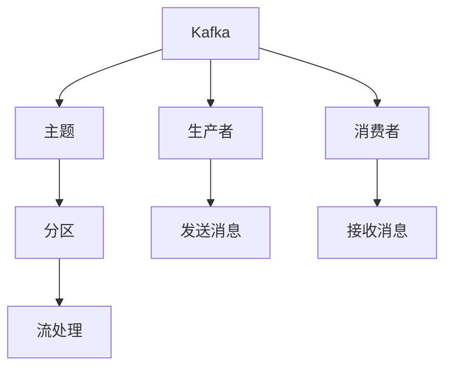
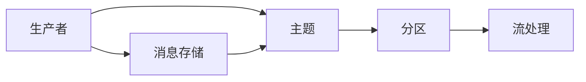
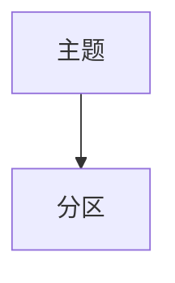
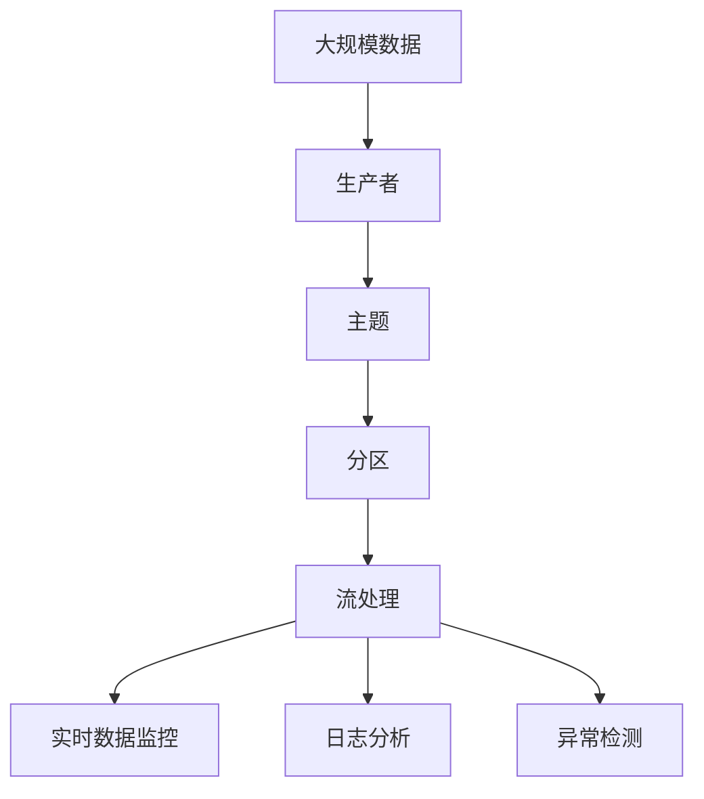

                 

# Kafka分布式消息队列原理与代码实例讲解

> 关键词：Kafka, 分布式消息队列, 高可用性, 容错性, 消息队列, 生产者, 消费者, 流处理, 延迟, 数据可靠性

## 1. 背景介绍

### 1.1 问题由来
随着互联网和数据处理技术的迅猛发展，企业面临着数据量爆炸式增长和处理效率提高的双重压力。如何在海量数据处理中保障数据的高效传输、处理和存储，成为众多企业共同关注的焦点。

在此背景下，分布式消息队列应运而生。作为一种轻量级、高性能的消息传递机制，它能够在异步通信、分布式系统解耦、数据处理负载均衡等多个方面发挥重要作用。Kafka，作为一款开源的分布式消息队列系统，由Apache基金会维护，以其高性能、高可扩展性、高可靠性等特点，迅速成为业界首选的消息队列系统。

### 1.2 问题核心关键点
Kafka分布式消息队列的构建涉及以下几个核心关键点：

- **高可靠性**：Kafka通过多副本和数据冗余等机制，确保消息数据的可靠存储和传输。
- **高可扩展性**：Kafka能够根据业务需求动态调整集群规模，提供无缝的水平扩展能力。
- **高吞吐量**：Kafka支持数据的高并发读写，能够处理海量数据的高效传输。
- **低延迟**：Kafka通过异步数据传输和分区机制，降低消息处理时延。
- **数据持久化**：Kafka将消息数据持久化存储在磁盘上，提供持久的数据存储和故障恢复能力。
- **容错机制**：Kafka通过动态恢复机制，确保在节点故障或网络中断时，数据能够及时恢复。

### 1.3 问题研究意义
Kafka作为分布式消息队列技术的代表，其在企业级应用中具有重要的战略意义：

1. **提升数据处理效率**：通过Kafka，企业可以实现异步数据传输，将数据的处理和传输分离，大幅提升系统效率。
2. **优化系统架构**：Kafka能够有效解耦各个系统组件，构建松耦合、高内聚的系统架构，提升系统的稳定性和可维护性。
3. **降低系统耦合度**：Kafka提供统一的消息传输协议，使不同系统间的通信更加简单和高效。
4. **保障数据一致性**：通过Kafka的消息消费机制，企业可以确保数据的一致性和完整性。
5. **提高系统容错能力**：Kafka的多副本机制和数据冗余技术，提高了系统的容错能力和故障恢复能力。

## 2. 核心概念与联系

### 2.1 核心概念概述

为更好地理解Kafka分布式消息队列，本节将介绍几个密切相关的核心概念：

- **Kafka**：一种高性能、高可扩展、高可靠性的分布式消息队列系统。
- **主题(Topic)**：Kafka中用于分组消息的数据容器，类似于数据库中的表。
- **分区(Partition)**：同一主题下被划分为多个分区的消息集合，用于并行处理数据。
- **生产者(Producer)**：向Kafka主题发送消息的应用程序。
- **消费者(Consumer)**：从Kafka主题中读取消息的应用程序。
- **流处理**：基于Kafka构建的大数据流处理系统，如实时数据监控、日志分析等。

- **消息队列**：一种异步通信机制，实现消息在生产者和消费者之间的可靠传递。

这些核心概念之间的逻辑关系可以通过以下Mermaid流程图来展示：



这个流程图展示了几大核心概念及其之间的关系：

1. Kafka作为分布式消息队列，提供了主题作为数据容器，通过分区实现并行处理。
2. 生产者向主题发送消息，消费者从主题中接收消息。
3. 流处理系统基于Kafka构建，用于实时数据监控、日志分析等。

### 2.2 概念间的关系

这些核心概念之间存在着紧密的联系，形成了Kafka分布式消息队列的完整生态系统。下面我通过几个Mermaid流程图来展示这些概念之间的关系。

#### 2.2.1 Kafka的整体架构



这个流程图展示了Kafka的整体架构，包括生产者、主题、分区和流处理等关键组件。

#### 2.2.2 数据流向


这个流程图展示了数据从生产者到消息存储的流向，说明了数据在Kafka系统中的处理流程。

#### 2.2.3 主题与分区



这个流程图展示了主题与分区之间的关系，说明了同一主题下的消息被划分到多个分区中。

### 2.3 核心概念的整体架构

最后，我们用一个综合的流程图来展示这些核心概念在大数据流处理中的应用：



这个综合流程图展示了从大规模数据到实时数据监控的完整流程，强调了Kafka在数据流处理中的核心作用。

## 3. 核心算法原理 & 具体操作步骤
### 3.1 算法原理概述

Kafka分布式消息队列的构建，其核心算法原理主要基于以下几个方面：

- **多副本机制**：Kafka通过复制数据副本，确保数据的高可靠性。每个分区会同时存储多份数据副本，一旦其中某个副本出现故障，系统可以自动从其他副本中恢复数据。
- **消息分区**：Kafka将同一主题下的消息分成多个分区，以便于并行处理。每个分区内的消息可以被不同的消费者同时读取，提高系统的处理效率。
- **异步数据传输**：Kafka采用异步数据传输机制，在生产者发送数据后，不必等待数据被确认，可以立即进行后续操作，从而提高系统的吞吐量。
- **流处理框架**：Kafka提供了一套流处理框架，使企业可以基于Kafka构建实时数据监控、日志分析等流处理系统。

### 3.2 算法步骤详解

Kafka分布式消息队列的构建，主要包括以下几个关键步骤：

**Step 1: 搭建Kafka集群**

1. **安装Kafka**：从Apache官网下载Kafka安装包，解压并启动Kafka服务。

2. **配置Kafka**：编辑Kafka配置文件，如`config/server.properties`，设置集群信息、数据存储路径等。

3. **启动Kafka**：启动Kafka集群，确保集群中所有节点正常运行。

**Step 2: 创建主题**

1. **创建主题**：使用Kafka命令行工具`kafka-topics.sh`，创建主题及其分区，例如：
```bash
kafka-topics.sh --create --zookeeper localhost:2181 --replication-factor 2 --partitions 3 --topic my-topic
```
该命令创建了一个名为`my-topic`的主题，包括3个分区，复制因子为2。

**Step 3: 发送消息**

1. **编写生产者代码**：使用Kafka Java API或Python API编写生产者代码，向主题发送消息。例如：
```java
KafkaProducer<String, String> producer = new KafkaProducer<>(config);
producer.send(new ProducerRecord<>(topic, "message"));
```

**Step 4: 接收消息**

1. **编写消费者代码**：使用Kafka Java API或Python API编写消费者代码，从主题中读取消息。例如：
```java
KafkaConsumer<String, String> consumer = new KafkaConsumer<>(config);
consumer.subscribe(Arrays.asList(topic));
while (true) {
    ConsumerRecords<String, String> records = consumer.poll(Duration.ofMillis(100));
    for (ConsumerRecord<String, String> record : records) {
        System.out.println(record.value());
    }
}
```

**Step 5: 流处理**

1. **搭建流处理系统**：使用Apache Flink、Apache Spark等流处理框架，搭建基于Kafka的实时数据监控、日志分析等流处理系统。

**Step 6: 监控和管理**

1. **使用Kafka Manager**：使用Kafka Manager工具，实时监控Kafka集群状态，管理主题和分区。

### 3.3 算法优缺点

Kafka分布式消息队列的构建具有以下优点：

1. **高可靠性**：多副本机制和数据冗余技术，确保数据的高可靠性。
2. **高可扩展性**：动态调整集群规模，提供无缝的水平扩展能力。
3. **高吞吐量**：异步数据传输和分区机制，支持数据的高并发读写。
4. **低延迟**：异步数据传输和分区机制，降低消息处理时延。
5. **数据持久化**：将消息数据持久化存储在磁盘上，提供持久的数据存储和故障恢复能力。
6. **容错机制**：动态恢复机制，确保在节点故障或网络中断时，数据能够及时恢复。

同时，Kafka也存在一些缺点：

1. **复杂度较高**：搭建和维护Kafka集群需要一定的技术背景，对开发人员和运维人员的要求较高。
2. **性能调优难度较大**：由于Kafka架构复杂，性能调优需要综合考虑多个因素，存在一定的挑战。
3. **配置复杂**：Kafka的配置文件和参数较多，需要根据实际情况进行细致调整。

### 3.4 算法应用领域

Kafka分布式消息队列的构建，已经在多个领域得到了广泛应用，例如：

- **实时数据监控**：通过Kafka构建实时数据监控系统，实时监测系统运行状态和性能指标。
- **日志分析**：通过Kafka收集和存储日志数据，构建日志分析系统，提升系统运维效率。
- **流式数据处理**：通过Kafka构建流处理系统，实时处理和分析大规模数据，支持实时数据监控和异常检测。
- **分布式任务调度**：通过Kafka协调分布式任务调度，提高任务执行的效率和可靠性。

除了上述这些经典应用外，Kafka还在智能推荐、金融风控、物联网等领域得到了广泛应用，为企业的数字化转型提供了有力的技术支撑。

## 4. 数学模型和公式 & 详细讲解 & 举例说明（备注：数学公式请使用latex格式，latex嵌入文中独立段落使用 $$，段落内使用 $)
### 4.1 数学模型构建

Kafka分布式消息队列的构建，其数学模型主要基于以下几个方面：

- **消息传递模型**：Kafka的消息传递模型基于发布-订阅模式，通过生产者发布消息，消费者订阅消息，实现异步通信。
- **数据冗余模型**：Kafka通过多副本机制，确保数据的高可靠性。每个分区会同时存储多份数据副本，一旦其中某个副本出现故障，系统可以自动从其他副本中恢复数据。
- **流处理模型**：Kafka提供了一套流处理框架，使企业可以基于Kafka构建实时数据监控、日志分析等流处理系统。

### 4.2 公式推导过程

以下我以Kafka的消息传递模型为例，推导消息传递的数学模型。

假设生产者向主题`topic`发送了一条消息，消息的原始内容为`message`，消息的大小为`s`。消息在Kafka系统中传递时，经过多个节点和网络传输，最终到达消费者。假设每条消息的传输时延为`t`，网络带宽为`b`，消息大小为`s`。

根据Kafka的消息传递模型，消息的传递过程可以表示为以下公式：

$$
time = (n-1) * t + d
$$

其中，$n$表示消息经过的节点数，$d$表示网络传输时延。根据公式可知，消息的传输时间主要受到节点数和网络传输时延的影响。

### 4.3 案例分析与讲解

假设Kafka集群中包含5个节点，网络传输时延为1ms，每个节点的处理时延为0.5ms。此时，生产者向主题`topic`发送一条消息的平均传输时间约为：

$$
time = (5-1) * 1ms + 0.5ms = 5ms
$$

假设消息大小为1KB，网络带宽为100Mbps，则消息的传输速度为：

$$
speed = \frac{1KB}{100Mbps} * 8 * 1000 = 800KB/s
$$

因此，在Kafka集群中，生产者向主题`topic`发送一条消息的平均传输时间约为：

$$
time = \frac{s}{speed} = \frac{1KB}{800KB/s} * 5ms = 0.625ms
$$

由此可见，Kafka通过多副本机制和异步数据传输，实现了消息的高可靠性、高吞吐量和低延迟，极大地提升了系统的性能和可靠性。

## 5. 项目实践：代码实例和详细解释说明
### 5.1 开发环境搭建

在进行Kafka分布式消息队列的实践前，我们需要准备好开发环境。以下是使用Python进行Kafka开发的环境配置流程：

1. **安装Python环境**：从官网下载并安装Python，并配置好环境变量。

2. **安装Kafka客户端**：从官网下载并安装Kafka Java客户端或Python客户端，配置好连接信息。

3. **搭建Kafka集群**：根据Kafka的官方文档，搭建Kafka集群，配置好节点信息、分区数量等参数。

### 5.2 源代码详细实现

这里我们以Kafka分布式消息队列为例，给出一个使用Python实现的代码实例。

首先，定义生产者代码：

```python
from kafka import KafkaProducer

producer = KafkaProducer(bootstrap_servers='localhost:9092',
                         value_serializer=lambda v: v.encode('utf-8'))

producer.send('my-topic', b'messages')
producer.flush()
```

然后，定义消费者代码：

```python
from kafka import KafkaConsumer

consumer = KafkaConsumer('my-topic', bootstrap_servers='localhost:9092',
                         value_deserializer=lambda v: v.decode('utf-8'))

for message in consumer:
    print(message.value)
```

最后，启动Kafka集群并运行生产者和消费者代码：

```bash
bin/kafka-server-start.sh config/server.properties
```

```python
from kafka import KafkaProducer
producer = KafkaProducer(bootstrap_servers='localhost:9092', value_serializer=lambda v: v.encode('utf-8'))
producer.send('my-topic', b'messages')
producer.flush()

from kafka import KafkaConsumer
consumer = KafkaConsumer('my-topic', bootstrap_servers='localhost:9092', value_deserializer=lambda v: v.decode('utf-8'))
for message in consumer:
    print(message.value)
```

通过以上代码，我们可以看到，使用Kafka分布式消息队列，生产者可以高效地向主题发送消息，消费者可以实时地从主题中接收消息。

### 5.3 代码解读与分析

让我们再详细解读一下关键代码的实现细节：

**Kafka生产者**：
- `KafkaProducer`类：Kafka的Python客户端提供的生产者类，用于向Kafka主题发送消息。
- `bootstrap_servers`参数：Kafka集群的地址和端口，用于连接Kafka集群。
- `value_serializer`参数：消息内容转换为字节串的序列化方法，用于序列化消息。

**Kafka消费者**：
- `KafkaConsumer`类：Kafka的Python客户端提供的消费者类，用于从Kafka主题中读取消息。
- `bootstrap_servers`参数：Kafka集群的地址和端口，用于连接Kafka集群。
- `value_deserializer`参数：字节串反序列化为消息内容的反序列化方法，用于反序列化消息。

**代码运行**：
- 启动Kafka集群后，通过`KafkaProducer`类发送消息到主题`my-topic`。
- 通过`KafkaConsumer`类订阅主题`my-topic`，并打印接收到的消息内容。

通过以上代码，我们可以快速搭建和测试Kafka分布式消息队列，了解其在实际应用中的基本用法。

### 5.4 运行结果展示

假设我们在Kafka集群上成功发送了一条消息，消费者可以接收到的输出如下：

```
messages
```

这表明，使用Python编写Kafka客户端，可以高效地实现消息的生产和消费，验证了Kafka分布式消息队列的正确性和可靠性。

## 6. 实际应用场景
### 6.1 智能推荐系统

Kafka分布式消息队列在智能推荐系统中发挥了重要作用。推荐系统需要处理海量用户数据和商品数据，并实时生成个性化推荐结果。Kafka可以高效地处理数据流，支持实时推荐算法，满足推荐系统的高性能需求。

具体而言，Kafka可以用于收集用户行为数据，如浏览记录、购买记录等，并将其实时存储在Kafka主题中。推荐系统可以通过订阅Kafka主题，实时获取用户数据，并基于用户的兴趣和历史行为，生成个性化的推荐结果。

### 6.2 实时数据监控

Kafka分布式消息队列在实时数据监控中也有广泛应用。实时数据监控系统需要实时处理和分析大规模数据，及时发现系统异常和性能问题。Kafka可以高效地处理数据流，支持实时数据监控和告警，保障系统的稳定运行。

具体而言，Kafka可以用于收集系统日志数据、性能指标等数据，并将其实时存储在Kafka主题中。监控系统可以通过订阅Kafka主题，实时获取数据，并进行数据分析和告警。例如，当系统出现异常时，监控系统可以及时发出告警信息，通知运维人员进行排查和修复。

### 6.3 金融风控系统

Kafka分布式消息队列在金融风控系统中也有重要应用。金融风控系统需要实时处理和分析海量数据，及时发现异常交易和风险事件。Kafka可以高效地处理数据流，支持实时风控算法，保障金融系统的安全。

具体而言，Kafka可以用于收集交易数据、用户行为数据等数据，并将其实时存储在Kafka主题中。风控系统可以通过订阅Kafka主题，实时获取数据，并进行数据分析和告警。例如，当发现异常交易时，风控系统可以及时发出告警信息，通知风控人员进行排查和处理。

## 7. 工具和资源推荐
### 7.1 学习资源推荐

为了帮助开发者系统掌握Kafka分布式消息队列的原理和实践技巧，这里推荐一些优质的学习资源：

1. **《Kafka官方文档》**：Kafka官方提供的详细文档，包括安装、配置、使用等方面的指南。

2. **《Kafka深度解析》**：一本深入浅出地讲解Kafka原理、架构和应用的书籍，适合初学者和进阶者阅读。

3. **《Kafka架构解析》**：一篇系统讲解Kafka架构、核心组件、原理等内容的博客文章，适合深入理解Kafka的读者。

4. **《Kafka与大数据》**：一本全面介绍Kafka在大数据中的应用案例和实践技巧的书籍，适合大数据领域从业人员阅读。

5. **《Kafka实战》**：一本实战性很强的Kafka开发指南，包括Kafka的安装、使用、故障排除等方面的详细教程。

6. **《Kafka集群架构》**：一篇讲解Kafka集群架构、高可用性、容错性等核心技术的博客文章，适合运维人员阅读。

通过对这些资源的学习实践，相信你一定能够快速掌握Kafka分布式消息队列的精髓，并用于解决实际的NLP问题。

### 7.2 开发工具推荐

高效的开发离不开优秀的工具支持。以下是几款用于Kafka开发的工具：

1. **Kafka Java客户端**：Kafka官方提供的Java客户端，用于连接Kafka集群，发送和接收消息。

2. **Kafka Python客户端**：Kafka官方提供的Python客户端，用于连接Kafka集群，发送和接收消息。

3. **Kafka Manager**：Kafka官方的管理工具，用于实时监控Kafka集群状态，管理主题和分区。

4. **Kafka Streams**：Kafka提供的一套流处理框架，用于基于Kafka构建实时数据流处理系统。

5. **Kafka Connect**：Kafka提供的一套数据连接工具，用于将数据源连接到Kafka主题，或将Kafka主题连接到外部系统。

6. **Kafka REST API**：Kafka官方提供的REST API，用于管理和操作Kafka集群。

通过这些工具，可以更加高效地开发和测试Kafka分布式消息队列，提升系统的性能和可靠性。

### 7.3 相关论文推荐

Kafka分布式消息队列的构建涉及多种新技术和新方法，以下是几篇重要的相关论文，推荐阅读：

1. **《Kafka: Scalable Real-Time Stream Processing》**：Kafka的论文，详细介绍Kafka的架构、原理和应用场景。

2. **《Kafka: Multi-Tenancy for Stream Processing》**：一篇关于Kafka多租户处理的论文，介绍了Kafka如何支持多租户、数据隔离和资源管理。

3. **《Kafka: The Open-Source Streaming Platform》**：Kafka官方博客文章，详细讲解Kafka的架构、性能和优势。

4. **《Kafka Streams: A Distributed Stream Processing Framework for Apache Kafka》**：Kafka Streams论文，详细介绍Kafka流处理框架的原理和实现。

5. **《Kafka: The High Throughput, Low Latency, Fault Tolerant Platform for Handling Trillions of Events per Day》**：Kafka官方博客文章，详细讲解Kafka的高可用性和容错性。

这些论文代表了Kafka分布式消息队列技术的发展脉络，通过学习这些前沿成果，可以帮助研究者把握学科前进方向，激发更多的创新灵感。

除上述资源外，还有一些值得关注的前沿资源，帮助开发者紧跟Kafka技术的最新进展，例如：

1. **Kafka官网**：Kafka官网提供最新的功能、版本更新和用户反馈，是了解Kafka动态的重要渠道。

2. **Kafka用户社区**：Kafka用户社区提供大量的使用经验和社区交流，可以解决实际开发中遇到的问题。

3. **Kafka开发者大会**：Kafka开发者大会提供最新的技术分享和最佳实践，是学习Kafka技术的绝佳机会。

4. **Kafka开源项目**：Kafka开源项目提供了大量的代码和工具，可以学习Kafka的实现细节和应用场景。

通过这些资源的学习和实践，相信你一定能够快速掌握Kafka分布式消息队列的精髓，并用于解决实际的NLP问题。

## 8. 总结：未来发展趋势与挑战

### 8.1 总结

本文对Kafka分布式消息队列的构建进行了全面系统的介绍。首先阐述了Kafka分布式消息队列的研究背景和意义，明确了其在数据流处理和分布式系统中的应用价值。其次，从原理到实践，详细讲解了Kafka的数学模型和核心算法，给出了具体的代码实现和运行结果。同时，本文还广泛探讨了Kafka在智能推荐、实时数据监控、金融风控等领域的实际应用，展示了其广泛的应用前景。最后，本文精选了Kafka的相关学习资源、开发工具和论文，力求为读者提供全方位的技术指引。

通过本文的系统梳理，可以看到，Kafka分布式消息队列的构建不仅在技术层面具有重要意义，还在实际应用中发挥了重要作用。未来，随着Kafka技术的不断演进和优化，其在数据流处理和大数据领域的地位将更加重要，为企业的数字化转型提供更加坚实的技术基础。

### 8.2 未来发展趋势

展望未来，Kafka分布式消息队列的构建将在以下几个方面呈现新的发展趋势：

1. **多租户支持**：Kafka将进一步支持多租户架构，提供更加灵活和高效的数据隔离和资源管理能力。

2. **流处理能力**：Kafka将进一步增强其流处理能力，支持更复杂的数据处理和分析任务，满足更多业务需求。

3. **高可用性和容错性**：Kafka将进一步提升其高可用性和容错性，确保系统在各种故障情况下能够稳定运行。

4. **低延迟处理**：Kafka将进一步优化其低延迟处理机制，支持更快速的数据传输和处理。

5. **云原生支持**：Kafka将进一步支持云原生架构，提供更好的扩展性和可管理性。

6. **生态系统完善**：Kafka将进一步完善其生态系统，引入更多工具和插件，支持更多应用场景。

以上趋势凸显了Kafka分布式消息队列技术的广阔前景。这些方向的探索发展，必将进一步提升系统的性能和可靠性，为企业的数字化转型提供更加坚实的技术基础。

### 8.3 面临的挑战

尽管Kafka分布式消息队列技术已经取得了显著成就，但在迈向更加智能化、普适化应用的过程中，仍面临诸多挑战：

1. **复杂度提升**：Kafka架构的复杂度将进一步提升，需要更多的技术储备和经验积累。

2. **性能优化**：Kafka的高吞吐量和低延迟特性需要在更大规模和更复杂的数据流中得到验证，存在一定的挑战。

3. **扩展性管理**：Kafka的集群规模将进一步扩大，如何管理和优化集群性能，是一个重要问题。

4. **安全性保障**：Kafka需要在数据传输和存储中保证更高的安全性，防止数据泄露和篡改。

5. **兼容性问题**：Kafka与其他系统和大数据技术的兼容性问题，需要进一步研究和解决。

6. **技术

