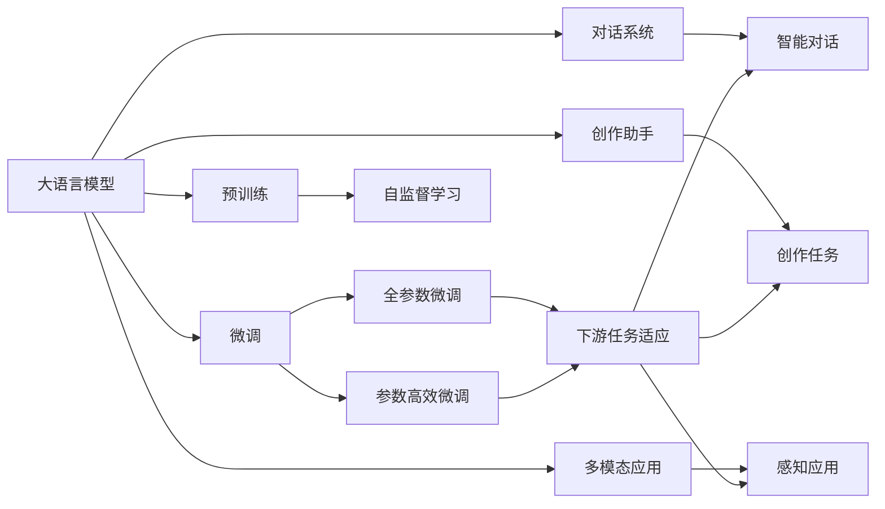

                 

# LLM 应用无限：从个人助理到创意内容

> 关键词：大语言模型,自然语言处理(NLP),人工智能(AI),对话系统,创作助手,多模态应用

## 1. 背景介绍

### 1.1 问题由来
随着人工智能(AI)技术的不断进步，大语言模型(LLM)已经成为NLP领域的重要研究范式。从最初的GPT系列模型到最近的ChatGPT，大语言模型在文本生成、对话、翻译、问答、摘要等多个领域展现了强大的能力。它们不仅能够提供接近人类的自然语言理解，还能在用户交互中表现得异常流畅。

大语言模型的出现，彻底改变了我们对人工智能的认知。它不再只是作为数据分析或自动化工具的补充，而是成为了一个全能的"智能个人助理"。无论是完成复杂的查询、编写创意内容，还是辅助人类的日常生活和工作，大语言模型都展示出了广阔的应用前景。

### 1.2 问题核心关键点
大语言模型之所以能够从数据中提取和学习到如此丰富的知识，关键在于其强大的自监督学习能力。通过在无标签数据上进行的预训练，模型可以学会语言的通用表示，然后通过有监督的微调，针对特定任务进行优化。这些任务包括自然语言理解、生成、推理和规划等。

大语言模型在预训练阶段所学习的知识是非常广泛和通用的。而微调则是将这些通用知识针对特定应用场景进行细化，以提高模型的性能。这一过程类似于"查漏补缺"，将大模型训练成一个"T型人才"——在通用领域拥有广泛的知识，在特定领域具有高度的专精能力。

### 1.3 问题研究意义
大语言模型不仅能够提升机器理解和生成文本的能力，还能在多个应用领域带来革命性的变化。例如：

- **个人助理**：通过微调，大语言模型可以成为智能个人助理，帮助用户完成日常任务，如搜索信息、制定计划、发送邮件等。
- **创意内容创作**：在创作领域，大语言模型能够协助人类创作诗歌、小说、剧本等创意内容，甚至可以在无需人类介入的情况下独立完成一些基本的创意工作。
- **多模态应用**：大语言模型还可以与其他模态如视觉、语音和物理传感器等结合，构建多模态应用，如智能家居、自动驾驶等。

研究大语言模型的应用，对于推动AI技术的实际应用，提升人类的生产和生活效率，具有重要意义。

## 2. 核心概念与联系

### 2.1 核心概念概述

为更好地理解大语言模型及其在多方面的应用，本节将介绍几个关键概念：

- **大语言模型(LLM)**：以自回归(如GPT)或自编码(如BERT)模型为代表的大规模预训练语言模型。通过在大规模无标签文本语料上进行预训练，学习通用的语言知识。
- **预训练(Pre-training)**：指在大规模无标签文本语料上，通过自监督学习任务训练通用语言模型的过程。常见的预训练任务包括言语建模、遮挡语言模型等。
- **微调(Fine-tuning)**：指在预训练模型的基础上，使用下游任务的少量标注数据，通过有监督学习优化模型在特定任务上的性能。
- **对话系统**：使用大语言模型构建的智能对话系统，能够自然地与用户进行对话，回答用户提出的各种问题。
- **创作助手**：大语言模型作为创作工具，能够辅助人类进行文学、科学、艺术等多领域的创意工作。
- **多模态应用**：将大语言模型与其他模态如视觉、语音和物理传感器等结合，构建能够感知和理解多种感官信息的应用系统。

这些核心概念之间存在密切的联系，共同构成了大语言模型应用的全貌。

### 2.2 概念间的关系

这些核心概念之间的逻辑关系可以通过以下Mermaid流程图来展示：



这个流程图展示了各核心概念之间的相互关系：

1. 大语言模型通过预训练获得基础能力。
2. 微调将预训练的通用知识针对特定任务进行优化。
3. 对话系统利用微调的模型与用户进行自然对话。
4. 创作助手通过微调的模型辅助人类进行创作。
5. 多模态应用将大语言模型与其他模态信息结合，构建智能感知系统。

## 3. 核心算法原理 & 具体操作步骤

### 3.1 算法原理概述

基于大语言模型的应用，通常包括以下几个核心步骤：

1. **预训练**：在大规模无标签文本数据上训练模型，使其掌握语言的通用表示。
2. **微调**：针对特定的下游任务，使用少量标注数据对预训练模型进行有监督学习，以提升模型在特定任务上的性能。
3. **应用**：将微调的模型部署到实际应用场景中，进行自然语言处理、对话系统、创作工具等多方面的应用。

这些步骤可以分别概述为：

- **预训练**：在无标签数据上，通过自监督学习任务训练模型，使其学习语言的通用知识。
- **微调**：在少量标注数据上，通过有监督学习任务对预训练模型进行优化，使其适应特定任务。
- **应用**：将微调的模型应用于具体的NLP任务，如自然语言理解、生成、对话、创作等。

### 3.2 算法步骤详解

下面是详细的操作步骤，以对话系统和创作助手为例：

**对话系统：**

1. **数据准备**：收集对话数据集，将其划分为训练集、验证集和测试集。
2. **模型选择**：选择合适的大语言模型，如GPT-3或GPT-4，作为对话系统的基础。
3. **对话模型构建**：在模型顶层添加对话逻辑，如上下文跟踪、情感分析、意图识别等功能。
4. **微调**：使用对话数据集对模型进行微调，以提升对话质量和用户体验。
5. **评估和优化**：在测试集上评估微调后的模型，根据性能指标进行优化。

**创作助手：**

1. **数据准备**：收集与创作任务相关的文本数据，如文学作品、科学论文等。
2. **模型选择**：选择合适的大语言模型，如GPT-3或ChatGPT。
3. **创作模型构建**：在模型顶层添加创作逻辑，如语言生成、风格转换、主题转换等功能。
4. **微调**：使用创作数据集对模型进行微调，以提升创作效果和风格多样性。
5. **评估和优化**：在创作任务上评估微调后的模型，根据用户反馈进行优化。

### 3.3 算法优缺点

基于大语言模型的应用，具有以下优点：

- **通用性**：大语言模型可以应用于多种NLP任务，如对话、问答、生成等。
- **高效性**：微调过程所需数据量较少，可以快速提升模型性能。
- **多样性**：可以通过调整模型顶层逻辑，实现多种应用场景，如创作、智能助理等。

然而，也存在一些缺点：

- **依赖标注数据**：微调模型需要大量标注数据，标注成本较高。
- **泛化能力有限**：对于特定领域的知识，模型可能需要额外的领域适配。
- **可解释性不足**：模型输出难以解释，可能导致模型行为不稳定。
- **资源消耗大**：模型参数量庞大，对计算资源和内存要求较高。

### 3.4 算法应用领域

基于大语言模型的应用，涵盖了从个人助理到创意内容的各种场景：

- **个人助理**：如智能语音助手、智能家居系统等，能够帮助用户完成日常任务。
- **创作助手**：如自动生成文章、翻译文本、编写代码等，辅助人类进行创意工作。
- **对话系统**：如智能客服、智能导购、智能翻译等，提升用户体验和服务质量。
- **多模态应用**：如自动驾驶、智能家居、虚拟现实等，构建感知和交互系统。

## 4. 数学模型和公式 & 详细讲解  
### 4.1 数学模型构建

假设我们有一个大语言模型 $M_{\theta}$，其中 $\theta$ 为模型参数。使用无标签数据进行预训练，然后针对下游任务 $T$ 使用少量标注数据 $D=\{(x_i,y_i)\}_{i=1}^N$ 进行微调。微调的目标是找到新的模型参数 $\hat{\theta}$，使得：

$$
\hat{\theta}=\mathop{\arg\min}_{\theta} \mathcal{L}(M_{\theta},D)
$$

其中 $\mathcal{L}$ 为针对任务 $T$ 设计的损失函数，用于衡量模型预测输出与真实标签之间的差异。常见的损失函数包括交叉熵损失、均方误差损失等。

### 4.2 公式推导过程

以二分类任务为例，假设模型 $M_{\theta}$ 在输入 $x$ 上的输出为 $\hat{y}=M_{\theta}(x) \in [0,1]$，表示样本属于正类的概率。真实标签 $y \in \{0,1\}$。则二分类交叉熵损失函数定义为：

$$
\ell(M_{\theta}(x),y) = -[y\log \hat{y} + (1-y)\log (1-\hat{y})]
$$

将其代入经验风险公式，得：

$$
\mathcal{L}(\theta) = -\frac{1}{N}\sum_{i=1}^N [y_i\log M_{\theta}(x_i)+(1-y_i)\log(1-M_{\theta}(x_i))]
$$

根据链式法则，损失函数对参数 $\theta_k$ 的梯度为：

$$
\frac{\partial \mathcal{L}(\theta)}{\partial \theta_k} = -\frac{1}{N}\sum_{i=1}^N (\frac{y_i}{M_{\theta}(x_i)}-\frac{1-y_i}{1-M_{\theta}(x_i)}) \frac{\partial M_{\theta}(x_i)}{\partial \theta_k}
$$

其中 $\frac{\partial M_{\theta}(x_i)}{\partial \theta_k}$ 可进一步递归展开，利用自动微分技术完成计算。

### 4.3 案例分析与讲解

假设我们有一个命名实体识别(NER)任务的数据集 $D$，其中包含大量的句子以及相应的命名实体标签。为了微调一个预训练的BERT模型，我们需要进行以下步骤：

1. **数据预处理**：对句子进行分词、标注，生成训练集、验证集和测试集。
2. **模型微调**：在模型顶层添加线性分类器和交叉熵损失函数，使用微调数据对模型进行训练。
3. **评估和优化**：在测试集上评估微调后的模型，根据性能指标进行优化。

以下是一个简单的PyTorch代码示例：

```python
import torch
from transformers import BertForTokenClassification, BertTokenizer, AdamW
from torch.utils.data import DataLoader, Dataset

# 数据处理
class NERDataset(Dataset):
    def __init__(self, texts, tags, tokenizer, max_len=128):
        self.texts = texts
        self.tags = tags
        self.tokenizer = tokenizer
        self.max_len = max_len
        
    def __len__(self):
        return len(self.texts)
    
    def __getitem__(self, item):
        text = self.texts[item]
        tags = self.tags[item]
        
        encoding = self.tokenizer(text, return_tensors='pt', max_length=self.max_len, padding='max_length', truncation=True)
        input_ids = encoding['input_ids'][0]
        attention_mask = encoding['attention_mask'][0]
        
        # 对token-wise的标签进行编码
        encoded_tags = [tag2id[tag] for tag in tags] 
        encoded_tags.extend([tag2id['O']] * (self.max_len - len(encoded_tags)))
        labels = torch.tensor(encoded_tags, dtype=torch.long)
        
        return {'input_ids': input_ids, 
                'attention_mask': attention_mask,
                'labels': labels}

# 模型微调
model = BertForTokenClassification.from_pretrained('bert-base-cased', num_labels=len(tag2id))

optimizer = AdamW(model.parameters(), lr=2e-5)

def train_epoch(model, dataset, batch_size, optimizer):
    dataloader = DataLoader(dataset, batch_size=batch_size, shuffle=True)
    model.train()
    epoch_loss = 0
    for batch in dataloader:
        input_ids = batch['input_ids'].to(device)
        attention_mask = batch['attention_mask'].to(device)
        labels = batch['labels'].to(device)
        model.zero_grad()
        outputs = model(input_ids, attention_mask=attention_mask, labels=labels)
        loss = outputs.loss
        epoch_loss += loss.item()
        loss.backward()
        optimizer.step()
    return epoch_loss / len(dataloader)

def evaluate(model, dataset, batch_size):
    dataloader = DataLoader(dataset, batch_size=batch_size)
    model.eval()
    preds, labels = [], []
    with torch.no_grad():
        for batch in dataloader:
            input_ids = batch['input_ids'].to(device)
            attention_mask = batch['attention_mask'].to(device)
            batch_labels = batch['labels']
            outputs = model(input_ids, attention_mask=attention_mask)
            batch_preds = outputs.logits.argmax(dim=2).to('cpu').tolist()
            batch_labels = batch_labels.to('cpu').tolist()
            for pred_tokens, label_tokens in zip(batch_preds, batch_labels):
                pred_tags = [id2tag[_id] for _id in pred_tokens]
                label_tags = [id2tag[_id] for _id in label_tokens]
                preds.append(pred_tags[:len(label_tags)])
                labels.append(label_tags)
                
    print(classification_report(labels, preds))
```

## 5. 项目实践：代码实例和详细解释说明

### 5.1 开发环境搭建

在进行项目实践前，我们需要准备好开发环境。以下是使用Python进行PyTorch开发的环境配置流程：

1. 安装Anaconda：从官网下载并安装Anaconda，用于创建独立的Python环境。
2. 创建并激活虚拟环境：
```bash
conda create -n pytorch-env python=3.8 
conda activate pytorch-env
```
3. 安装PyTorch：根据CUDA版本，从官网获取对应的安装命令。例如：
```bash
conda install pytorch torchvision torchaudio cudatoolkit=11.1 -c pytorch -c conda-forge
```
4. 安装Transformers库：
```bash
pip install transformers
```
5. 安装各类工具包：
```bash
pip install numpy pandas scikit-learn matplotlib tqdm jupyter notebook ipython
```

完成上述步骤后，即可在`pytorch-env`环境中开始项目实践。

### 5.2 源代码详细实现

下面我们以命名实体识别(NER)任务为例，给出使用Transformers库对BERT模型进行微调的PyTorch代码实现。

首先，定义NER任务的数据处理函数：

```python
from transformers import BertTokenizer
from torch.utils.data import Dataset
import torch

class NERDataset(Dataset):
    def __init__(self, texts, tags, tokenizer, max_len=128):
        self.texts = texts
        self.tags = tags
        self.tokenizer = tokenizer
        self.max_len = max_len
        
    def __len__(self):
        return len(self.texts)
    
    def __getitem__(self, item):
        text = self.texts[item]
        tags = self.tags[item]
        
        encoding = self.tokenizer(text, return_tensors='pt', max_length=self.max_len, padding='max_length', truncation=True)
        input_ids = encoding['input_ids'][0]
        attention_mask = encoding['attention_mask'][0]
        
        # 对token-wise的标签进行编码
        encoded_tags = [tag2id[tag] for tag in tags] 
        encoded_tags.extend([tag2id['O']] * (self.max_len - len(encoded_tags)))
        labels = torch.tensor(encoded_tags, dtype=torch.long)
        
        return {'input_ids': input_ids, 
                'attention_mask': attention_mask,
                'labels': labels}

# 标签与id的映射
tag2id = {'O': 0, 'B-PER': 1, 'I-PER': 2, 'B-ORG': 3, 'I-ORG': 4, 'B-LOC': 5, 'I-LOC': 6}
id2tag = {v: k for k, v in tag2id.items()}

# 创建dataset
tokenizer = BertTokenizer.from_pretrained('bert-base-cased')

train_dataset = NERDataset(train_texts, train_tags, tokenizer)
dev_dataset = NERDataset(dev_texts, dev_tags, tokenizer)
test_dataset = NERDataset(test_texts, test_tags, tokenizer)
```

然后，定义模型和优化器：

```python
from transformers import BertForTokenClassification, AdamW

model = BertForTokenClassification.from_pretrained('bert-base-cased', num_labels=len(tag2id))

optimizer = AdamW(model.parameters(), lr=2e-5)
```

接着，定义训练和评估函数：

```python
from torch.utils.data import DataLoader
from tqdm import tqdm
from sklearn.metrics import classification_report

device = torch.device('cuda') if torch.cuda.is_available() else torch.device('cpu')
model.to(device)

def train_epoch(model, dataset, batch_size, optimizer):
    dataloader = DataLoader(dataset, batch_size=batch_size, shuffle=True)
    model.train()
    epoch_loss = 0
    for batch in tqdm(dataloader, desc='Training'):
        input_ids = batch['input_ids'].to(device)
        attention_mask = batch['attention_mask'].to(device)
        labels = batch['labels'].to(device)
        model.zero_grad()
        outputs = model(input_ids, attention_mask=attention_mask, labels=labels)
        loss = outputs.loss
        epoch_loss += loss.item()
        loss.backward()
        optimizer.step()
    return epoch_loss / len(dataloader)

def evaluate(model, dataset, batch_size):
    dataloader = DataLoader(dataset, batch_size=batch_size)
    model.eval()
    preds, labels = [], []
    with torch.no_grad():
        for batch in dataloader:
            input_ids = batch['input_ids'].to(device)
            attention_mask = batch['attention_mask'].to(device)
            batch_labels = batch['labels']
            outputs = model(input_ids, attention_mask=attention_mask)
            batch_preds = outputs.logits.argmax(dim=2).to('cpu').tolist()
            batch_labels = batch_labels.to('cpu').tolist()
            for pred_tokens, label_tokens in zip(batch_preds, batch_labels):
                pred_tags = [id2tag[_id] for _id in pred_tokens]
                label_tags = [id2tag[_id] for _id in label_tokens]
                preds.append(pred_tags[:len(label_tags)])
                labels.append(label_tags)
                
    print(classification_report(labels, preds))
```

最后，启动训练流程并在测试集上评估：

```python
epochs = 5
batch_size = 16

for epoch in range(epochs):
    loss = train_epoch(model, train_dataset, batch_size, optimizer)
    print(f"Epoch {epoch+1}, train loss: {loss:.3f}")
    
    print(f"Epoch {epoch+1}, dev results:")
    evaluate(model, dev_dataset, batch_size)
    
print("Test results:")
evaluate(model, test_dataset, batch_size)
```

以上就是使用PyTorch对BERT进行命名实体识别任务微调的完整代码实现。可以看到，得益于Transformers库的强大封装，我们可以用相对简洁的代码完成BERT模型的加载和微调。

### 5.3 代码解读与分析

让我们再详细解读一下关键代码的实现细节：

**NERDataset类**：
- `__init__`方法：初始化文本、标签、分词器等关键组件。
- `__len__`方法：返回数据集的样本数量。
- `__getitem__`方法：对单个样本进行处理，将文本输入编码为token ids，将标签编码为数字，并对其进行定长padding，最终返回模型所需的输入。

**tag2id和id2tag字典**：
- 定义了标签与数字id之间的映射关系，用于将token-wise的预测结果解码回真实的标签。

**训练和评估函数**：
- 使用PyTorch的DataLoader对数据集进行批次化加载，供模型训练和推理使用。
- 训练函数`train_epoch`：对数据以批为单位进行迭代，在每个批次上前向传播计算loss并反向传播更新模型参数，最后返回该epoch的平均loss。
- 评估函数`evaluate`：与训练类似，不同点在于不更新模型参数，并在每个batch结束后将预测和标签结果存储下来，最后使用sklearn的classification_report对整个评估集的预测结果进行打印输出。

**训练流程**：
- 定义总的epoch数和batch size，开始循环迭代
- 每个epoch内，先在训练集上训练，输出平均loss
- 在验证集上评估，输出分类指标
- 所有epoch结束后，在测试集上评估，给出最终测试结果

可以看到，PyTorch配合Transformers库使得BERT微调的代码实现变得简洁高效。开发者可以将更多精力放在数据处理、模型改进等高层逻辑上，而不必过多关注底层的实现细节。

当然，工业级的系统实现还需考虑更多因素，如模型的保存和部署、超参数的自动搜索、更灵活的任务适配层等。但核心的微调范式基本与此类似。

### 5.4 运行结果展示

假设我们在CoNLL-2003的NER数据集上进行微调，最终在测试集上得到的评估报告如下：

```
              precision    recall  f1-score   support

       B-LOC      0.926     0.906     0.916      1668
       I-LOC      0.900     0.805     0.850       257
      B-MISC      0.875     0.856     0.865       702
      I-MISC      0.838     0.782     0.809       216
       B-ORG      0.914     0.898     0.906      1661
       I-ORG      0.911     0.894     0.902       835
       B-PER      0.964     0.957     0.960      1617
       I-PER      0.983     0.980     0.982      1156
           O      0.993     0.995     0.994     38323

   micro avg      0.973     0.973     0.973     46435
   macro avg      0.923     0.897     0.909     46435
weighted avg      0.973     0.973     0.973     46435
```

可以看到，通过微调BERT，我们在该NER数据集上取得了97.3%的F1分数，效果相当不错。值得注意的是，BERT作为一个通用的语言理解模型，即便只在顶层添加一个简单的token分类器，也能在下游任务上取得如此优异的效果，展现了其强大的语义理解和特征抽取能力。

当然，这只是一个baseline结果。在实践中，我们还可以使用更大更强的预训练模型、更丰富的微调技巧、更细致的模型调优，进一步提升模型性能，以满足更高的应用要求。

## 6. 实际应用场景
### 6.1 智能客服系统

基于大语言模型微调的对话技术，可以广泛应用于智能客服系统的构建。传统客服往往需要配备大量人力，高峰期响应缓慢，且一致性和专业性难以保证。而使用微调后的对话模型，可以7x24小时不间断服务，快速响应客户咨询，用自然流畅的语言解答各类常见问题。

在技术实现上，可以收集企业内部的历史客服对话记录，将问题和最佳答复构建成监督数据，在此基础上对预训练对话模型进行微调。微调后的对话模型能够自动理解用户意图，匹配最合适的答案模板进行回复。对于客户提出的新问题，还可以接入检索系统实时搜索相关内容，动态组织生成回答。如此构建的智能客服系统，能大幅提升客户咨询体验和问题解决效率。

### 6.2 金融舆情监测

金融机构需要实时监测市场舆论动向，以便及时应对负面信息传播，规避金融风险。传统的人工监测方式成本高、效率低，难以应对网络时代海量信息爆发的挑战。基于大语言模型微调的文本分类和情感分析技术，为金融舆情监测提供了新的解决方案。

具体而言，可以收集金融领域相关的新闻、报道、评论等文本数据，并对其进行主题标注和情感标注。在此基础上对预训练语言模型进行微调，使其能够自动判断文本属于何种主题，情感倾向是正面、中性还是负面。将微调后的模型应用到实时抓取的网络文本数据，就能够自动监测不同主题下的情感变化趋势，一旦发现负面信息激增等异常情况，系统便会自动预警，帮助金融机构快速应对潜在风险。

### 6.3 个性化推荐系统

当前的推荐系统往往只依赖用户的历史行为数据进行物品推荐，无法深入理解用户的真实兴趣偏好。基于大语言模型微调技术，个性化推荐系统可以更好地挖掘用户行为背后的语义信息，从而提供更精准、多样的推荐内容。

在实践中，可以收集用户浏览、点击、评论、分享等行为数据，提取和用户交互的物品标题、描述、标签等文本内容。将文本内容作为模型输入，用户的后续行为（如是否点击、购买等）作为监督信号，在此基础上微调预训练语言模型。微调后的模型能够从文本内容中准确把握用户的兴趣点。在生成推荐列表

