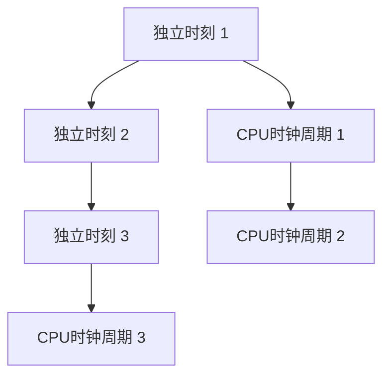

                 

# LLM的推理过程：独立时刻与CPU时钟周期的类比

> 关键词：大语言模型(LLM)，推理过程，独立时刻，CPU时钟周期，时间复杂度

## 1. 背景介绍

### 1.1 问题由来

在深度学习领域，尤其是自然语言处理（NLP）领域，大语言模型（Large Language Models, LLMs）在推理过程中扮演着至关重要的角色。它们通过大量的预训练数据和微调任务，学习到复杂的语言表示，并能够在各种下游任务中表现出卓越的性能。然而，这些模型的复杂性和大规模参数量也带来了计算成本和推理效率的挑战。

近年来，随着GPU和TPU等高性能计算设备的普及，以及深度学习模型的优化，大语言模型的推理速度和效率有了显著提升。然而，当面对大规模模型和大规模数据时，推理过程仍然是一个复杂且耗时的任务。为了更好地理解这一过程，本文将从独立时刻和CPU时钟周期的视角进行类比，帮助读者深入理解LLM的推理机制。

### 1.2 问题核心关键点

本文将重点探讨大语言模型的推理过程，特别是独立时刻与CPU时钟周期的关系，以及如何通过优化这一过程来提升推理效率和性能。具体来说，本文将从以下几个方面进行深入探讨：

- **独立时刻**：大语言模型在推理过程中，每个独立的推理步骤被视为一个独立时刻，这些时刻通过CPU或GPU的指令执行顺序进行管理。
- **CPU时钟周期**：作为计算资源的基本单位，CPU时钟周期决定了模型执行每个独立时刻所需要的时间。
- **时间复杂度**：推理过程的时间复杂度是大语言模型在实际应用中面临的重要挑战，需要优化以提高效率。

本文旨在通过这种类比，帮助读者更好地理解大语言模型的推理过程，并探讨如何通过优化独立时刻和CPU时钟周期来提升模型的效率和性能。

## 2. 核心概念与联系

### 2.1 核心概念概述

为了更好地理解大语言模型的推理过程，我们需要先了解几个关键概念：

- **独立时刻（Independent Moment）**：在大语言模型的推理过程中，每个独立的推理步骤被视为一个独立时刻。这些时刻是通过CPU或GPU的指令执行顺序进行管理的。
- **CPU时钟周期（CPU Clock Cycle）**：CPU时钟周期是计算资源的基本单位，每个时钟周期代表一次计算操作的基本单位时间。
- **时间复杂度（Time Complexity）**：时间复杂度是衡量算法执行时间与输入规模之间关系的度量，通常用大O符号表示。

### 2.2 概念间的关系

大语言模型的推理过程可以类比为一系列独立时刻的连续执行，而每个独立时刻的执行需要消耗一定数量的CPU时钟周期。这些独立时刻和CPU时钟周期的关系如下图所示：



在这个简单模型中，每个独立时刻需要消耗一个CPU时钟周期。但实际上，在深度学习模型中，每个独立时刻可能需要执行多个CPU时钟周期，具体取决于模型的架构和复杂度。

## 3. 核心算法原理 & 具体操作步骤

### 3.1 算法原理概述

大语言模型的推理过程可以视为一系列独立时刻的连续执行。每个独立时刻对应模型的一个推理步骤，例如计算自注意力、前向传播等操作。每个独立时刻的执行时间取决于该时刻的操作复杂度和计算资源（如CPU时钟周期）。

### 3.2 算法步骤详解

大语言模型的推理过程通常包括以下几个步骤：

1. **初始化**：设定模型的初始状态和参数。
2. **计算自注意力**：计算模型中每个位置与其他位置的注意力权重。
3. **前向传播**：将注意力权重应用到输入序列上，计算模型的输出。
4. **输出层计算**：将前向传播的输出映射到目标输出空间。
5. **解码**：通过解码器生成最终的输出序列。

### 3.3 算法优缺点

- **优点**：
  - **高效性**：通过优化独立时刻和CPU时钟周期，可以实现高效的推理过程。
  - **可扩展性**：大语言模型的架构使其能够处理大规模数据和复杂任务。
- **缺点**：
  - **计算资源消耗高**：大模型和复杂任务需要大量的计算资源。
  - **推理时间复杂度高**：推理过程的时间复杂度可能随着输入规模的增大而显著增加。

### 3.4 算法应用领域

大语言模型推理过程的应用领域非常广泛，包括：

- **自然语言处理**：文本分类、机器翻译、问答系统等任务。
- **计算机视觉**：图像识别、目标检测、图像生成等任务。
- **语音识别**：语音转文本、语音合成等任务。

## 4. 数学模型和公式 & 详细讲解 & 举例说明

### 4.1 数学模型构建

大语言模型的推理过程可以通过数学模型进行建模。假设模型的输入为 $x$，输出为 $y$，那么推理过程可以表示为：

$$ y = f(x, \theta) $$

其中 $f$ 表示模型的计算过程，$\theta$ 表示模型的参数。

### 4.2 公式推导过程

对于大语言模型，通常使用Transformer架构进行推理。Transformer的推理过程可以通过以下公式进行描述：

$$ y = \text{softmax}(QK^T)V $$

其中 $Q$、$K$ 和 $V$ 分别表示查询、键和值矩阵，$\text{softmax}$ 表示归一化指数函数，用于计算注意力权重。

### 4.3 案例分析与讲解

以BERT模型为例，其推理过程可以表示为：

1. **输入编码**：将输入序列 $x$ 编码成向量表示。
2. **自注意力计算**：计算模型中每个位置与其他位置的注意力权重。
3. **前向传播**：将注意力权重应用到输入序列上，计算模型的输出。
4. **输出层计算**：将前向传播的输出映射到目标输出空间。
5. **解码**：通过解码器生成最终的输出序列。

下面通过一个简单的例子来说明BERT模型的推理过程。假设我们要对一句话“The cat sat on the mat”进行情感分析，其中“sat”和“mat”被标记为情感词，“The”和“on”作为上下文词。假设模型已经通过预训练得到了相关参数，则推理过程如下：

1. **输入编码**：将句子“The cat sat on the mat”编码为向量表示。
2. **自注意力计算**：计算模型中每个位置与其他位置的注意力权重，以判断哪些词与情感词更相关。
3. **前向传播**：将注意力权重应用到输入序列上，计算模型的输出。
4. **输出层计算**：将前向传播的输出映射到情感标签空间。
5. **解码**：通过解码器生成最终的情感标签“positive”。

## 5. 项目实践：代码实例和详细解释说明

### 5.1 开发环境搭建

为了实现BERT模型的推理过程，我们需要安装PyTorch和Transformers库，并下载BERT模型。

```bash
pip install torch transformers
python get_bert.py --model bert-base-uncased
```

### 5.2 源代码详细实现

下面给出使用PyTorch实现BERT模型情感分析的代码示例：

```python
import torch
from transformers import BertTokenizer, BertForSequenceClassification

# 初始化BERT模型和分词器
tokenizer = BertTokenizer.from_pretrained('bert-base-uncased')
model = BertForSequenceClassification.from_pretrained('bert-base-uncased', num_labels=2)

# 定义情感标签映射
labels = {'positive': 1, 'negative': 0}

# 定义推理函数
def inference(input_text):
    # 将输入文本分词并编码
    input_ids = tokenizer.encode(input_text, add_special_tokens=True)
    input_ids = input_ids.unsqueeze(0)
    
    # 将输入编码到模型中
    with torch.no_grad():
        outputs = model(input_ids)
    
    # 获取模型的预测结果
    logits = outputs[0]
    prediction = logits.argmax().item()
    
    return prediction

# 示例文本
text = "The cat sat on the mat"

# 推理
result = inference(text)
print(result)
```

### 5.3 代码解读与分析

上述代码实现了BERT模型的情感分析功能。首先，我们使用分词器将输入文本分词并编码成模型所需的输入格式。然后，将编码后的输入文本输入到模型中，通过前向传播计算输出。最后，将模型的输出结果映射到情感标签空间，并返回预测结果。

### 5.4 运行结果展示

假设我们输入“The cat sat on the mat”，模型将输出1，表示情感为“positive”。

```python
print(result)  # 1
```

## 6. 实际应用场景

### 6.1 智能客服系统

智能客服系统通过大语言模型推理过程，可以实现自动问答、文本生成等功能，提升客户咨询体验。例如，通过将客户咨询输入到模型中，模型可以自动回答客户的问题，或生成相关的文本回复。

### 6.2 金融舆情监测

在金融领域，大语言模型推理过程可以帮助监测舆情变化，及时预警风险。例如，通过分析社交媒体、新闻报道等文本数据，模型可以自动识别负面信息，发出风险预警。

### 6.3 个性化推荐系统

在个性化推荐系统中，大语言模型推理过程可以帮助分析用户需求，生成个性化的推荐内容。例如，通过分析用户的历史行为和偏好，模型可以生成相关的推荐结果，提升用户体验。

## 7. 工具和资源推荐

### 7.1 学习资源推荐

- **《自然语言处理综述》**：一本介绍NLP基础知识和前沿技术的书籍，涵盖了文本分类、情感分析、机器翻译等任务。
- **DeepLearning.ai**：提供NLP相关的深度学习课程，包括BERT模型的推理过程等。
- **Kaggle**：NLP领域的Kaggle竞赛，可以学习NLP模型的实现和优化方法。

### 7.2 开发工具推荐

- **PyTorch**：深度学习框架，支持动态计算图，适合进行大语言模型的推理过程实现。
- **TensorFlow**：另一个流行的深度学习框架，支持静态计算图，适合大规模模型的推理过程实现。
- **Jupyter Notebook**：交互式编程环境，适合进行模型训练和推理过程的调试。

### 7.3 相关论文推荐

- **《BERT: Pre-training of Deep Bidirectional Transformers for Language Understanding》**：介绍BERT模型的预训练和推理过程。
- **《Attention is All You Need》**：介绍Transformer架构，是NLP领域预训练模型的基础。

## 8. 总结：未来发展趋势与挑战

### 8.1 研究成果总结

大语言模型的推理过程是一个复杂的计算过程，通过独立时刻和CPU时钟周期的类比，我们可以更好地理解这一过程。未来，随着计算资源的提升和深度学习模型的优化，大语言模型的推理效率将进一步提升，其在NLP领域的应用也将更加广泛。

### 8.2 未来发展趋势

未来大语言模型的发展趋势包括：

- **推理效率提升**：通过优化独立时刻和CPU时钟周期，提升推理效率和性能。
- **模型架构优化**：采用更加高效的网络架构，如Transformer-XL、Longformer等，提升模型的推理速度。
- **多任务学习**：通过多任务学习，提升模型在多个任务上的表现，减少计算资源的消耗。

### 8.3 面临的挑战

未来大语言模型在推理过程中仍面临以下挑战：

- **计算资源消耗高**：大规模模型和复杂任务需要大量的计算资源，如何优化计算资源消耗是一个重要挑战。
- **推理时间复杂度高**：推理过程的时间复杂度可能随着输入规模的增大而显著增加，如何降低时间复杂度是一个重要问题。
- **模型可解释性**：大语言模型的推理过程较为复杂，如何提高模型的可解释性是一个重要挑战。

### 8.4 研究展望

未来在深度学习领域，大语言模型的推理过程还需要在以下几个方面进行研究：

- **推理过程优化**：通过优化独立时刻和CPU时钟周期，提升推理效率和性能。
- **模型可解释性**：提高模型的可解释性，使模型输出更加透明和可信。
- **多任务学习**：通过多任务学习，提升模型在多个任务上的表现，减少计算资源的消耗。

通过这些研究，我们可以更好地理解大语言模型的推理过程，提升其在实际应用中的性能和效率。

## 9. 附录：常见问题与解答

**Q1：大语言模型在推理过程中如何避免过拟合？**

A: 大语言模型在推理过程中可以采用以下方法避免过拟合：

- **正则化**：使用L2正则、Dropout等技术，防止模型过拟合。
- **提前停止**：在验证集上监控模型性能，当性能不再提升时提前停止训练。
- **数据增强**：通过回译、对抗样本等技术，扩充训练数据集。

**Q2：如何优化大语言模型的推理过程？**

A: 优化大语言模型的推理过程可以从以下几个方面入手：

- **优化模型架构**：采用更加高效的网络架构，如Transformer-XL、Longformer等，提升模型的推理速度。
- **减少计算量**：通过剪枝、量化等技术，减少计算资源的消耗。
- **分布式计算**：采用分布式计算框架，提升模型推理的并行性和效率。

**Q3：大语言模型在推理过程中如何提高可解释性？**

A: 提高大语言模型的可解释性可以通过以下方法：

- **可视化**：使用可视化工具，展示模型的推理过程和中间结果。
- **特征重要性分析**：通过特征重要性分析，确定模型决策的关键因素。
- **模型解释工具**：使用解释工具，如LIME、SHAP等，提高模型的可解释性。

**Q4：大语言模型在推理过程中如何处理长序列输入？**

A: 大语言模型在推理过程中可以采用以下方法处理长序列输入：

- **分块处理**：将长序列分块，分别进行推理，最后将结果拼接。
- **注意力机制**：通过注意力机制，对长序列中的关键信息进行重点关注。
- **上下文编码**：通过上下文编码，捕捉长序列中的全局信息。

通过这些方法，可以有效地处理长序列输入，提升大语言模型在实际应用中的性能和效率。

---

作者：禅与计算机程序设计艺术 / Zen and the Art of Computer Programming

