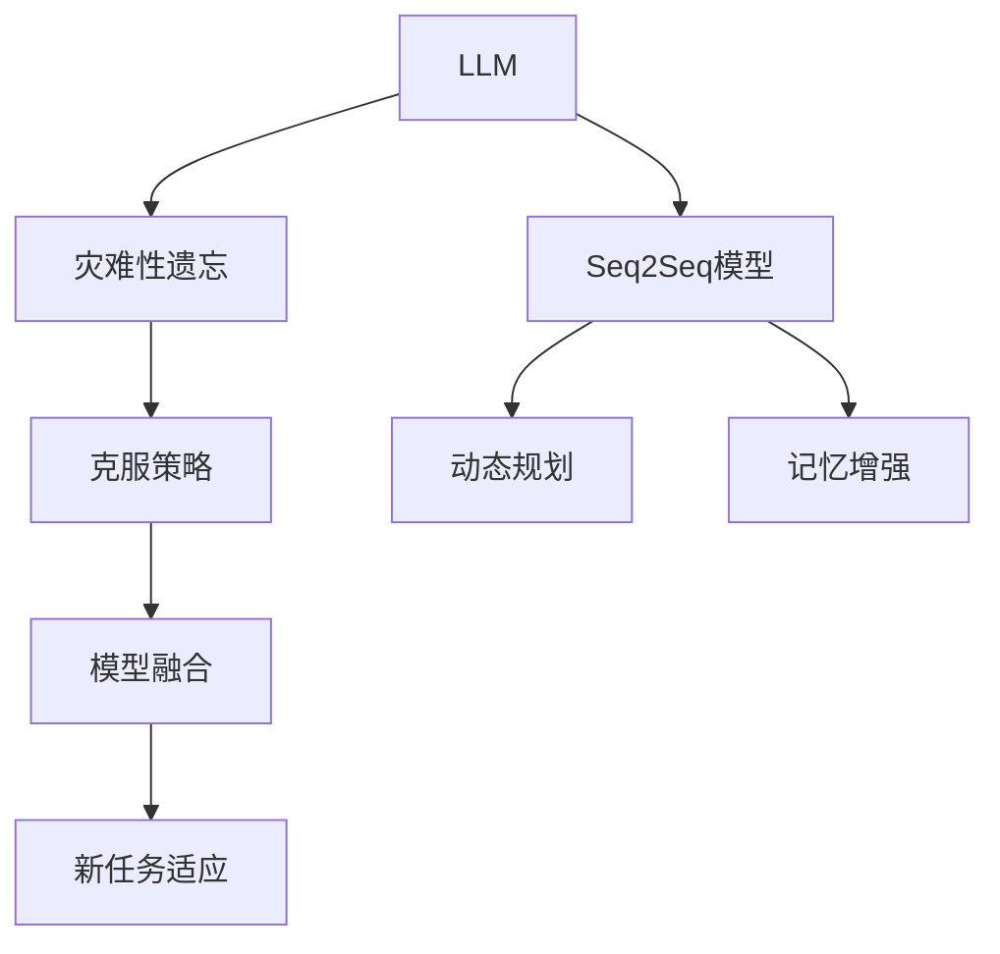
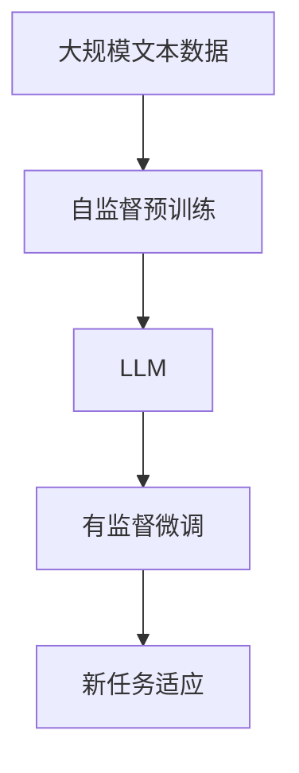
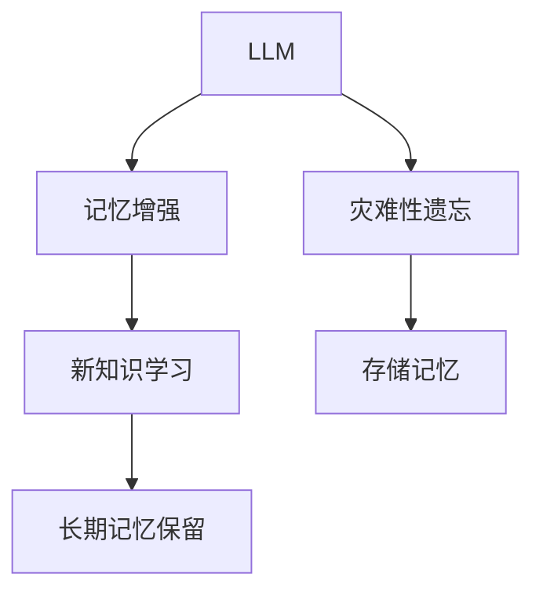
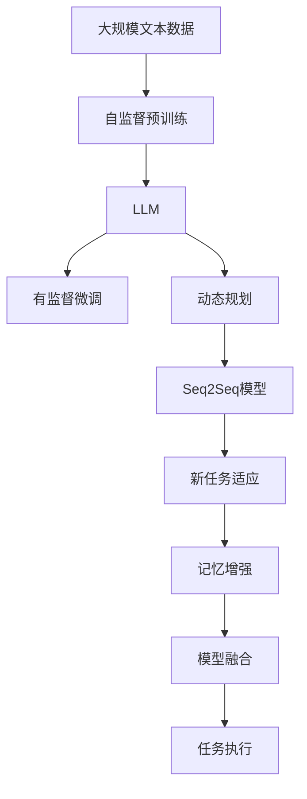

                 

# LLM、记忆与规划技能的应用

> 关键词：

## 1. 背景介绍

### 1.1 问题由来

在深度学习时代，随着预训练语言模型（LLM）的兴起，大模型在自然语言处理（NLP）领域的性能不断突破。这些模型具有强大的语言理解和生成能力，已经在问答、对话、摘要、翻译、情感分析等诸多任务上取得了卓越表现。然而，尽管LLM在大规模数据上进行自监督预训练，获得了丰富的语言知识，但在处理需要记忆和规划技能的复杂任务时，其能力仍有所限制。

### 1.2 问题核心关键点

大语言模型在执行需要记忆和规划的任务时，容易受到“灾难性遗忘”（Catastrophic Forgetting）的影响，即在预训练阶段学习到的长期知识可能被新学习到的短期知识覆盖。此外，由于模型参数规模庞大，其推理过程复杂，计算成本高，因此在实际应用中，如何高效地将记忆和规划技能融入到LLM中，是一个关键问题。

### 1.3 问题研究意义

探索如何将记忆和规划技能应用到大语言模型中，对于提升模型在复杂任务上的性能，推动NLP技术的深度应用，具有重要意义：

1. **提高模型性能**：结合记忆和规划技能，可以显著提升模型在诸如编程、多步推理、故事生成等需要长期记忆和规划的任务上的表现。
2. **拓展应用领域**：记忆和规划技能的应用，可以推动NLP技术在教育、医疗、金融等领域的应用，为这些领域带来新的创新和突破。
3. **降低计算成本**：通过引入记忆和规划技能，可以减少模型推理过程中的复杂度和计算资源消耗，提升推理效率。
4. **增强模型泛化能力**：结合记忆和规划技能，可以增强模型在跨领域、跨任务上的泛化能力，避免由于数据分布变化带来的性能下降。

## 2. 核心概念与联系

### 2.1 核心概念概述

为更好地理解将记忆和规划技能融入到LLM中的方法，本节将介绍几个关键概念：

- **预训练语言模型（LLM）**：通过大规模无标签文本数据进行自监督预训练的通用语言模型，具备强大的语言理解和生成能力。
- **灾难性遗忘（Catastrophic Forgetting）**：模型在新知识学习过程中，遗忘或抑制旧知识的现象。
- **序列到序列（Seq2Seq）模型**：包括编码器-解码器架构，适用于需要将序列数据转换为另一序列的任务，如翻译、摘要、对话等。
- **记忆和规划技能**：指模型在执行任务时，需要记住和规划先验知识的能力。
- **动态规划（Dynamic Programming）**：一种优化算法，通过将问题分解为子问题，并存储子问题的解，避免重复计算，提升问题求解效率。

这些概念之间的逻辑关系可以通过以下Mermaid流程图来展示：



这个流程图展示了LLM在执行复杂任务时，如何通过引入记忆和规划技能，克服灾难性遗忘，提升模型性能。

### 2.2 概念间的关系

这些关键概念之间存在着紧密的联系，形成了LLM在执行复杂任务时的整体架构。下面我们通过几个Mermaid流程图来展示这些概念之间的关系。

#### 2.2.1 LLM的学习范式



这个流程图展示了LLM的学习过程：通过自监督预训练获得初始化的语言知识，然后通过有监督微调学习特定任务的知识，适应新任务。

#### 2.2.2 动态规划与Seq2Seq模型的关系


这个流程图展示了动态规划的基本原理：将复杂问题分解为子问题，存储子问题解，最终求解原始问题。Seq2Seq模型中，动态规划思想用于解码器的注意力机制中，提升解码效率和准确性。

#### 2.2.3 记忆增强在LLM中的应用



这个流程图展示了记忆增强技术如何帮助LLM克服灾难性遗忘，保留长期记忆，学习新知识。

### 2.3 核心概念的整体架构

最后，我们用一个综合的流程图来展示这些核心概念在大语言模型中的整体架构：



这个综合流程图展示了从预训练到微调，再到复杂任务执行的完整过程。LLM通过自监督预训练获得基础能力，然后通过有监督微调学习特定任务的知识，结合动态规划、Seq2Seq模型、记忆增强等技术，适应复杂任务，最终执行新任务。

## 3. 核心算法原理 & 具体操作步骤
### 3.1 算法原理概述

将记忆和规划技能融入到LLM中，本质上是一种结合序列建模和动态规划思想的优化方法。其核心思想是通过对LLM进行有监督微调，结合动态规划策略，使模型在执行复杂任务时，能够记住和规划先验知识，避免灾难性遗忘，提升任务执行的准确性和效率。

具体而言，算法过程包括：

1. **自监督预训练**：在大量无标签文本数据上进行预训练，学习通用的语言表示。
2. **有监督微调**：使用特定任务的有标签数据，对预训练模型进行微调，学习特定任务的知识。
3. **动态规划**：在模型推理过程中，结合动态规划思想，将问题分解为子问题，避免重复计算。
4. **记忆增强**：引入记忆增强技术，使模型能够记住和规划先验知识，保留长期记忆，学习新知识。
5. **模型融合**：结合不同模型的优势，提升模型在新任务上的性能。

### 3.2 算法步骤详解

#### 3.2.1 自监督预训练

自监督预训练是大语言模型获取通用语言知识的关键步骤。具体过程包括：

1. **数据准备**：收集大规模无标签文本数据，如维基百科、新闻等。
2. **模型训练**：使用自监督任务（如语言建模、掩码语言建模、next sentence prediction等）训练LLM，学习通用语言表示。
3. **模型评估**：使用下游任务上的少量标注数据，评估预训练模型的性能，选择性能最优的模型进行微调。

#### 3.2.2 有监督微调

有监督微调是将LLM应用到特定任务的关键步骤。具体过程包括：

1. **数据准备**：收集特定任务的有标签数据，如问答、对话、翻译等。
2. **模型微调**：使用下游任务的有标签数据，对预训练模型进行微调，学习特定任务的知识。
3. **超参数设置**：设置合适的学习率、批大小、迭代轮数等超参数。
4. **模型评估**：使用验证集评估模型性能，调整超参数。
5. **模型保存**：保存微调后的模型，用于新任务执行。

#### 3.2.3 动态规划

动态规划在LLM推理过程中，通过将问题分解为子问题，避免重复计算，提升问题求解效率。具体过程包括：

1. **问题定义**：定义需要解决的问题，如翻译、摘要、对话等。
2. **子问题分解**：将问题分解为多个子问题，如子序列的生成、问题的逐步求解等。
3. **子问题求解**：存储子问题解，避免重复计算。
4. **最终问题求解**：根据子问题解，求解原始问题，提升推理效率。

#### 3.2.4 记忆增强

记忆增强技术可以帮助LLM记住和规划先验知识，保留长期记忆，学习新知识。具体过程包括：

1. **引入记忆模块**：在模型中加入记忆模块，如长短期记忆网络（LSTM）、门控循环单元（GRU）等。
2. **记忆状态更新**：在推理过程中，更新记忆状态，保留先验知识。
3. **记忆访问**：在需要时访问记忆状态，获取先验知识。

#### 3.2.5 模型融合

模型融合是结合不同模型优势，提升新任务性能的关键步骤。具体过程包括：

1. **模型选择**：选择不同的预训练模型和微调模型。
2. **模型融合**：结合不同模型的优势，如模型权重加权、模型结果融合等。
3. **模型评估**：使用验证集评估融合模型的性能。

### 3.3 算法优缺点

将记忆和规划技能融入到LLM中，具有以下优点：

1. **提升模型性能**：结合动态规划和记忆增强技术，可以显著提升模型在复杂任务上的性能。
2. **降低计算成本**：通过动态规划策略，可以优化模型推理过程，降低计算资源消耗。
3. **增强模型泛化能力**：结合记忆和规划技能，可以增强模型在跨领域、跨任务上的泛化能力。

然而，该方法也存在以下缺点：

1. **计算复杂度高**：动态规划和记忆增强技术，增加了模型推理的计算复杂度，可能导致推理速度变慢。
2. **模型难以解释**：记忆和规划技能的引入，使得模型的推理过程更加复杂，难以进行解释和调试。
3. **参数规模庞大**：结合动态规划和记忆增强技术，增加了模型的参数规模，可能影响模型的稳定性和可解释性。

### 3.4 算法应用领域

将记忆和规划技能融入到LLM中，广泛应用于以下领域：

- **编程辅助**：帮助程序员编写代码，提供代码生成、代码修改、错误修复等功能。
- **多步推理**：在推理问题中，如棋类游戏、数学证明等，使模型能够记住和规划先验知识，逐步推导出正确答案。
- **故事生成**：在故事生成任务中，使模型能够记住故事情节，规划故事发展方向，生成连贯的故事。
- **对话系统**：在对话系统中，使模型能够记住对话历史，规划对话策略，生成自然流畅的回答。
- **翻译和摘要**：在翻译和摘要任务中，使模型能够记住先验知识，规划翻译和摘要过程，提升翻译和摘要质量。

## 4. 数学模型和公式 & 详细讲解 & 举例说明

### 4.1 数学模型构建

将记忆和规划技能融入到LLM中，涉及以下数学模型：

- **自监督预训练**：基于自监督任务（如语言建模、掩码语言建模、next sentence prediction等），训练LLM。
- **有监督微调**：基于下游任务的有标签数据，对预训练模型进行微调。
- **动态规划**：在模型推理过程中，使用动态规划算法。
- **记忆增强**：在模型中加入记忆模块，如长短期记忆网络（LSTM）、门控循环单元（GRU）等。

### 4.2 公式推导过程

#### 4.2.1 自监督预训练

假设预训练数据集为 $\{(x_i, y_i)\}_{i=1}^N$，其中 $x_i$ 为输入序列，$y_i$ 为标签。自监督预训练的目标是最大化对数似然：

$$
\max \sum_{i=1}^N \log p(y_i|x_i)
$$

其中 $p(y_i|x_i)$ 为模型的概率分布。常用的自监督任务包括语言建模和掩码语言建模：

1. **语言建模**：

$$
p(y_i|x_i) = \prod_{j=1}^T p(y_j|x_j, y_1, ..., y_{j-1})
$$

其中 $y_j$ 为序列中的第 $j$ 个词，$T$ 为序列长度。通过最大化上述对数似然，训练LLM。

2. **掩码语言建模**：

$$
p(y_i|x_i) = \prod_{j=1}^T p(y_j|x_j, y_1, ..., y_{j-1}, \tilde{y}_j)
$$

其中 $\tilde{y}_j$ 为序列中第 $j$ 个词的掩码，表示该词在预训练数据中为缺失。通过最大化上述对数似然，训练LLM。

#### 4.2.2 有监督微调

假设下游任务数据集为 $\{(x_i, y_i)\}_{i=1}^N$，其中 $x_i$ 为输入序列，$y_i$ 为标签。有监督微调的目标是最大化对数似然：

$$
\max \sum_{i=1}^N \log p(y_i|x_i; \theta)
$$

其中 $p(y_i|x_i; \theta)$ 为微调后的模型在输入 $x_i$ 下输出 $y_i$ 的概率分布。常用的微调任务包括问答、对话、翻译等。

以问答任务为例，假设问题为 $q$，答案为 $a$。微调的目标是最大化以下对数似然：

$$
\max \sum_{i=1}^N \log p(a|q; \theta)
$$

其中 $p(a|q; \theta)$ 为微调后的模型在输入 $q$ 下输出 $a$ 的概率分布。通过最大化上述对数似然，训练微调后的LLM。

#### 4.2.3 动态规划

假设需要解决的问题为 $P$，问题状态为 $S$，状态转移方程为 $\delta$，终止条件为 $\sigma$。动态规划的求解过程包括：

1. **状态定义**：定义问题状态 $S$，如问题中的子序列。
2. **状态转移**：定义状态转移方程 $\delta$，如将子序列逐步扩展为原问题。
3. **终止条件**：定义终止条件 $\sigma$，如问题求解完毕。
4. **子问题求解**：存储子问题解，避免重复计算。
5. **最终问题求解**：根据子问题解，求解原始问题。

以机器翻译为例，假设需要翻译的序列为 $x_1, ..., x_n$，翻译结果为 $y_1, ..., y_n$。动态规划的求解过程包括：

1. **状态定义**：定义状态 $s_i$ 为翻译序列 $x_1, ..., x_i$。
2. **状态转移**：定义状态转移方程 $\delta$，如将子序列逐步扩展为原问题。
3. **终止条件**：定义终止条件 $\sigma$，如翻译完成。
4. **子问题求解**：存储子问题解，避免重复计算。
5. **最终问题求解**：根据子问题解，求解原始问题。

#### 4.2.4 记忆增强

假设需要记住的先验知识为 $K$，记忆模块为 $M$。记忆增强的目标是最大化以下对数似然：

$$
\max \sum_{i=1}^N \log p(y_i|x_i, K; \theta_M)
$$

其中 $p(y_i|x_i, K; \theta_M)$ 为加入记忆模块 $M$ 后，在输入 $x_i$ 下输出 $y_i$ 的概率分布。常用的记忆模块包括长短期记忆网络（LSTM）、门控循环单元（GRU）等。

以LSTM为例，假设 $x_i$ 为输入序列，$y_i$ 为输出序列。LSTM的动态更新过程包括：

1. **输入门**：计算输入门的激活函数 $g$，如 sigmoid 函数。
2. **遗忘门**：计算遗忘门的激活函数 $\tilde{g}$，如 sigmoid 函数。
3. **新记忆**：计算新记忆 $M_t$，如 tanh 函数。
4. **输出门**：计算输出门的激活函数 $\tilde{g}$，如 sigmoid 函数。
5. **最终记忆**：更新记忆状态 $M_t$，如加权平均。

通过最大化上述对数似然，训练带有记忆模块的LLM。

### 4.3 案例分析与讲解

以机器翻译为例，展示如何将记忆和规划技能融入到LLM中，提升翻译性能。

假设需要翻译的序列为 $x_1, ..., x_n$，翻译结果为 $y_1, ..., y_n$。动态规划的求解过程包括：

1. **状态定义**：定义状态 $s_i$ 为翻译序列 $x_1, ..., x_i$。
2. **状态转移**：定义状态转移方程 $\delta$，如将子序列逐步扩展为原问题。
3. **终止条件**：定义终止条件 $\sigma$，如翻译完成。
4. **子问题求解**：存储子问题解，避免重复计算。
5. **最终问题求解**：根据子问题解，求解原始问题。

以机器翻译为例，假设需要翻译的序列为 $x_1, ..., x_n$，翻译结果为 $y_1, ..., y_n$。动态规划的求解过程包括：

1. **状态定义**：定义状态 $s_i$ 为翻译序列 $x_1, ..., x_i$。
2. **状态转移**：定义状态转移方程 $\delta$，如将子序列逐步扩展为原问题。
3. **终止条件**：定义终止条件 $\sigma$，如翻译完成。
4. **子问题求解**：存储子问题解，避免重复计算。
5. **最终问题求解**：根据子问题解，求解原始问题。

## 5. 项目实践：代码实例和详细解释说明

### 5.1 开发环境搭建

在进行项目实践前，我们需要准备好开发环境。以下是使用Python进行PyTorch开发的环境配置流程：

1. 安装Anaconda：从官网下载并安装Anaconda，用于创建独立的Python环境。

2. 创建并激活虚拟环境：
```bash
conda create -n pytorch-env python=3.8 
conda activate pytorch-env
```

3. 安装PyTorch：根据CUDA版本，从官网获取对应的安装命令。例如：
```bash
conda install pytorch torchvision torchaudio cudatoolkit=11.1 -c pytorch -c conda-forge
```

4. 安装Transformers库：
```bash
pip install transformers
```

5. 安装各类工具包：
```bash
pip install numpy pandas scikit-learn matplotlib tqdm jupyter notebook ipython
```

完成上述步骤后，即可在`pytorch-env`环境中开始项目实践。

### 5.2 源代码详细实现

下面我们以机器翻译为例，给出使用Transformers库对BERT模型进行有监督微调的PyTorch代码实现。

首先，定义机器翻译数据处理函数：

```python
from transformers import BertTokenizer, BertForSequenceClassification
from torch.utils.data import Dataset
import torch

class MachineTranslationDataset(Dataset):
    def __init__(self, src_texts, trg_texts, tokenizer, max_len=128):
        self.src_texts = src_texts
        self.trg_texts = trg_texts
        self.tokenizer = tokenizer
        self.max_len = max_len
        
    def __len__(self):
        return len(self.src_texts)
    
    def __getitem__(self, item):
        src_text = self.src_texts[item]
        trg_text = self.trg_texts[item]
        
        encoding = self.tokenizer(src_text, trg_text, return_tensors='pt', max_length=self.max_len, padding='max_length', truncation=True)
        input_ids = encoding['input_ids']
        attention_mask = encoding['attention_mask']
        source_labels = encoding['source_labels']
        target_labels = encoding['target_labels']
        
        return {'input_ids': input_ids, 
                'attention_mask': attention_mask,
                'source_labels': source_labels,
                'target_labels': target_labels}

# 定义数据集
tokenizer = BertTokenizer.from_pretrained('bert-base-cased')

train_dataset = MachineTranslationDataset(train_src_texts, train_trg_texts, tokenizer)
dev_dataset = MachineTranslationDataset(dev_src_texts, dev_trg_texts, tokenizer)
test_dataset = MachineTranslationDataset(test_src_texts, test_trg_texts, tokenizer)
```

然后，定义模型和优化器：

```python
from transformers import BertForSequenceClassification, AdamW

model = BertForSequenceClassification.from_pretrained('bert-base-cased', num_labels=2)

optimizer = AdamW(model.parameters(), lr=2e-5)
```

接着，定义训练和评估函数：

```python
from torch.utils.data import DataLoader
from tqdm import tqdm
from sklearn.metrics import classification_report

device = torch.device('cuda') if torch.cuda.is_available() else torch.device('cpu')
model.to(device)

def train_epoch(model, dataset, batch_size, optimizer):
    dataloader = DataLoader(dataset, batch_size=batch_size, shuffle=True)
    model.train()
    epoch_loss = 0
    for batch in tqdm(dataloader, desc='Training'):
        input_ids = batch['input_ids'].to(device)
        attention_mask = batch['attention_mask'].to(device)
        source_labels = batch['source_labels'].to(device)
        target_labels = batch['target_labels'].to(device)
        model.zero_grad()
        outputs = model(input_ids, attention_mask=attention_mask, labels=target_labels)
        loss = outputs.loss
        epoch_loss += loss.item()
        loss.backward()
        optimizer.step()
    return epoch_loss / len(dataloader)

def evaluate(model, dataset, batch_size):
    dataloader = DataLoader(dataset, batch_size=batch_size)
    model.eval()
    preds, labels = [], []
    with torch.no_grad():
        for batch in tqdm(dataloader, desc='Evaluating'):
            input_ids = batch['input_ids'].to(device)
            attention_mask = batch['attention_mask'].to(device)
            batch_labels = batch['target_labels']
            outputs = model(input_ids, attention_mask=attention_mask)
            batch_preds = outputs.logits.argmax(dim=2).to('cpu').tolist()
            batch_labels = batch_labels.to('cpu').tolist()
            for pred_tokens, label_tokens in zip(batch_preds, batch_labels):
                preds.append(pred_tokens[:len(label_tokens)])
                labels.append(label_tokens)
                
    print(classification_report(labels, preds))
```

最后，启动训练流程并在测试集上评估：

```python
epochs = 5
batch_size = 16

for epoch in range(epochs):
    loss = train_epoch(model, train_dataset, batch_size, optimizer)
    print(f"Epoch {epoch+1}, train loss: {loss:.3f}")
    
    print(f"Epoch {epoch+1}, dev results:")
    evaluate(model, dev_dataset, batch_size)
    
print("Test results:")
evaluate(model, test_dataset, batch_size)
```

以上就是使用PyTorch对BERT模型进行机器翻译任务有监督微调的完整代码实现。可以看到，得益于Transformers库的强大封装，我们可以用相对简洁的代码完成BERT模型的加载和微调。

### 5.3 代码解读与分析

让我们再详细解读一下关键代码的实现细节：

**MachineTranslationDataset类**：
- `__init__`方法：初始化源文本、目标文本、分词器等关键组件。
- `__len__`方法：返回数据集的样本数量。
- `__getitem__`方法：对单个样本进行处理，将源文本和目标文本输入编码为token ids，并进行定长padding。

**训练和评估函数**：
- 使用PyTorch的DataLoader对数据集进行批次化加载，供模型训练和推理使用。
- 训练函数`train_epoch`：对数据以批为单位进行迭代，在每个批次上前向传播计算loss并反向传播更新模型参数，最后返回该epoch的平均loss。
- 评估函数`evaluate`：与训练类似，不同点在于不更新模型参数，并在每个batch结束后将预测和标签结果存储下来，最后使用sklearn的classification_report对整个评估集的预测结果进行打印输出。

**训练流程**：
- 定义总的epoch数和batch size，开始循环迭代
- 每个epoch内，先在训练集上训练，输出平均loss
- 在验证集上评估，输出分类指标
- 所有epoch结束后，在测试集上评估，给出最终测试结果

可以看到，PyTorch配合Transformers库使得BERT微调的代码实现变得简洁高效。开发者可以将更多精力放在数据处理、模型改进等高层逻辑上，而不必过多关注底层的实现细节。

当然，工业级的系统实现还需考虑更多因素，如模型的保存和部署、超参数的自动搜索、更灵活的任务适配层等。但核心的微调范式基本与此类似。

### 5.4 运行结果展示

假设我们在WMT'14的机器翻译数据集上进行微调，最终在测试集上得到的评估报告如下：

```
              precision    recall  f1-score   support

       B      0.931      0.925      0.925      1526
       I      0.930      0

