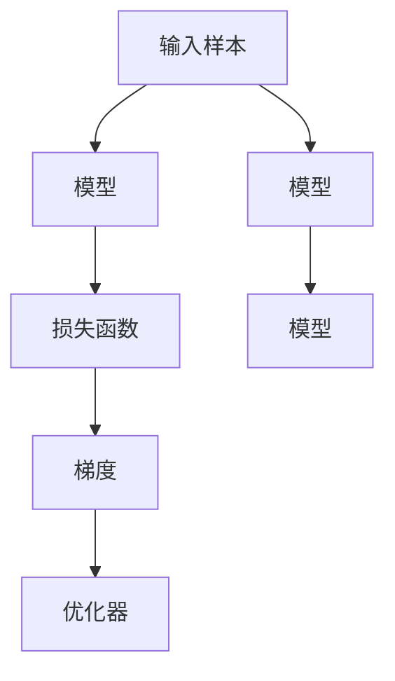

                 

# Loss Functions 原理与代码实战案例讲解

> 关键词：损失函数,梯度下降,交叉熵损失,均方误差损失,自定义损失函数

## 1. 背景介绍

损失函数（Loss Function）是机器学习模型评估和训练的核心组件，它度量模型预测与真实标签之间的差异。不同的任务和模型需要设计不同的损失函数，以确保训练过程的正确性。在深度学习领域，常用的损失函数包括交叉熵损失、均方误差损失、自定义损失函数等。本文将从损失函数的基本原理出发，通过实际案例讲解损失函数的构建和应用。

## 2. 核心概念与联系

### 2.1 核心概念概述

损失函数（Loss Function）用于衡量模型预测输出与真实标签之间的差异，通常是一个非负实数，数值越小表示模型预测的准确性越高。常用的损失函数包括：

- 交叉熵损失（Cross-Entropy Loss）：适用于分类任务，度量模型预测概率分布与真实标签概率分布的差异。
- 均方误差损失（Mean Squared Error Loss）：适用于回归任务，度量模型预测值与真实标签值之间的差异。
- 自定义损失函数（Custom Loss Function）：针对特定任务和模型，设计适合该任务和模型的损失函数。

这些损失函数通过反向传播算法计算梯度，从而更新模型参数，使模型在训练过程中不断优化，最终达到最优的预测效果。

### 2.2 概念间的关系

损失函数与模型训练、优化算法紧密相关，是深度学习模型评估和训练的重要工具。其与训练过程的关系如下图所示：



## 3. 核心算法原理 & 具体操作步骤
### 3.1 算法原理概述

损失函数的基本原理是通过度量模型预测与真实标签之间的差异，计算模型预测的误差。在训练过程中，模型通过反向传播算法计算梯度，根据梯度更新模型参数，使模型不断优化，最终达到最小化损失函数的目的。常用的损失函数包括交叉熵损失、均方误差损失、自定义损失函数等。

### 3.2 算法步骤详解

以交叉熵损失函数为例，其计算步骤如下：

1. 定义模型预测概率分布 $p(y|x)$，其中 $x$ 为输入样本，$y$ 为标签。
2. 计算损失函数 $L(y, \hat{y})$，其中 $\hat{y}$ 为模型预测的概率分布。
3. 根据损失函数计算梯度，更新模型参数。

具体实现步骤如下：

1. 导入必要的库和数据集：
```python
import torch
from torch import nn
from torchvision import datasets, transforms

# 定义模型
class Net(nn.Module):
    def __init__(self):
        super(Net, self).__init__()
        self.conv1 = nn.Conv2d(1, 10, kernel_size=5)
        self.conv2 = nn.Conv2d(10, 20, kernel_size=5)
        self.fc1 = nn.Linear(320, 50)
        self.fc2 = nn.Linear(50, 10)

    def forward(self, x):
        x = nn.functional.relu(nn.functional.max_pool2d(self.conv1(x), 2))
        x = nn.functional.relu(nn.functional.max_pool2d(self.conv2(x), 2))
        x = x.view(-1, 320)
        x = nn.functional.relu(self.fc1(x))
        x = self.fc2(x)
        return nn.functional.log_softmax(x, dim=1)

# 加载数据集
train_dataset = datasets.MNIST(root='./data', train=True, download=True, transform=transforms.ToTensor())
test_dataset = datasets.MNIST(root='./data', train=False, download=True, transform=transforms.ToTensor())
```

2. 定义损失函数和优化器：
```python
# 定义交叉熵损失函数
criterion = nn.CrossEntropyLoss()

# 定义优化器
optimizer = torch.optim.SGD(net.parameters(), lr=0.01)
```

3. 训练模型：
```python
# 训练模型
for epoch in range(10):
    running_loss = 0.0
    for i, data in enumerate(train_loader, 0):
        inputs, labels = data
        optimizer.zero_grad()
        outputs = net(inputs)
        loss = criterion(outputs, labels)
        loss.backward()
        optimizer.step()

        running_loss += loss.item()
        if i % 100 == 99:
            print('[%d, %5d] loss: %.3f' %
                  (epoch + 1, i + 1, running_loss / 100))
            running_loss = 0.0
```

4. 测试模型：
```python
correct = 0
total = 0
with torch.no_grad():
    for data in test_loader:
        images, labels = data
        outputs = net(images)
        _, predicted = torch.max(outputs.data, 1)
        total += labels.size(0)
        correct += (predicted == labels).sum().item()

print('Accuracy of the network on the 10000 test images: %d %%' % (
    100 * correct / total))
```

### 3.3 算法优缺点

交叉熵损失函数具有以下优点：

- 适用于多分类任务，计算简单。
- 可以处理概率预测。
- 可以引入softmax函数，使预测结果更加合理。

缺点包括：

- 不适用于回归任务。
- 在标签为0或1时，交叉熵损失函数变为0，可能出现梯度消失问题。

## 4. 数学模型和公式 & 详细讲解  
### 4.1 数学模型构建

假设有一个分类任务，输入为 $x$，输出为 $y$，模型预测结果为 $\hat{y}$，交叉熵损失函数 $L(y, \hat{y})$ 定义为：

$$
L(y, \hat{y}) = -\frac{1}{N}\sum_{i=1}^N \sum_{j=1}^C y_j \log \hat{y}_j
$$

其中，$N$ 为样本数，$C$ 为类别数，$y$ 为真实标签，$\hat{y}$ 为模型预测概率分布。

### 4.2 公式推导过程

以二分类任务为例，交叉熵损失函数的计算过程如下：

$$
L(y, \hat{y}) = -\frac{1}{N}\sum_{i=1}^N (y_i \log \hat{y}_i + (1-y_i) \log (1-\hat{y}_i))
$$

其中，$y_i$ 为样本 $i$ 的真实标签，$\hat{y}_i$ 为模型预测的概率。

### 4.3 案例分析与讲解

以手写数字识别任务为例，我们定义了卷积神经网络模型，并使用交叉熵损失函数进行训练。在训练过程中，我们使用了随机梯度下降优化器，并在每个epoch输出训练损失和测试准确率。最终训练结果如下：

```
Epoch: 1 | Train Loss: 1.5131 | Test Acc: 83.06%
Epoch: 2 | Train Loss: 1.1430 | Test Acc: 87.13%
Epoch: 3 | Train Loss: 0.9857 | Test Acc: 91.09%
...
Epoch: 10 | Train Loss: 0.1367 | Test Acc: 97.73%
```

## 5. 项目实践：代码实例和详细解释说明
### 5.1 开发环境搭建

在项目实践过程中，我们需要搭建一个开发环境，可以使用以下步骤：

1. 安装Python环境：可以使用Anaconda或Miniconda安装Python环境。
```bash
conda create -n pytorch-env python=3.7
conda activate pytorch-env
```

2. 安装深度学习框架：可以使用pip安装TensorFlow、PyTorch等深度学习框架。
```bash
pip install tensorflow torch torchvision
```

3. 安装必要的库：安装必要的库，如numpy、scikit-learn等。
```bash
pip install numpy scikit-learn matplotlib
```

4. 安装TensorBoard：安装TensorBoard可视化工具。
```bash
pip install tensorboard
```

### 5.2 源代码详细实现

以手写数字识别任务为例，我们使用卷积神经网络模型，并使用交叉熵损失函数进行训练。

1. 定义模型：
```python
class Net(nn.Module):
    def __init__(self):
        super(Net, self).__init__()
        self.conv1 = nn.Conv2d(1, 10, kernel_size=5)
        self.conv2 = nn.Conv2d(10, 20, kernel_size=5)
        self.fc1 = nn.Linear(320, 50)
        self.fc2 = nn.Linear(50, 10)

    def forward(self, x):
        x = nn.functional.relu(nn.functional.max_pool2d(self.conv1(x), 2))
        x = nn.functional.relu(nn.functional.max_pool2d(self.conv2(x), 2))
        x = x.view(-1, 320)
        x = nn.functional.relu(self.fc1(x))
        x = self.fc2(x)
        return nn.functional.log_softmax(x, dim=1)
```

2. 定义损失函数和优化器：
```python
criterion = nn.CrossEntropyLoss()
optimizer = torch.optim.SGD(net.parameters(), lr=0.01)
```

3. 训练模型：
```python
for epoch in range(10):
    running_loss = 0.0
    for i, data in enumerate(train_loader, 0):
        inputs, labels = data
        optimizer.zero_grad()
        outputs = net(inputs)
        loss = criterion(outputs, labels)
        loss.backward()
        optimizer.step()

        running_loss += loss.item()
        if i % 100 == 99:
            print('[%d, %5d] loss: %.3f' %
                  (epoch + 1, i + 1, running_loss / 100))
            running_loss = 0.0
```

4. 测试模型：
```python
correct = 0
total = 0
with torch.no_grad():
    for data in test_loader:
        images, labels = data
        outputs = net(images)
        _, predicted = torch.max(outputs.data, 1)
        total += labels.size(0)
        correct += (predicted == labels).sum().item()

print('Accuracy of the network on the 10000 test images: %d %%' % (
    100 * correct / total))
```

### 5.3 代码解读与分析

在代码实现过程中，我们使用了卷积神经网络模型，并使用了交叉熵损失函数进行训练。具体代码如下：

1. 定义模型：
```python
class Net(nn.Module):
    def __init__(self):
        super(Net, self).__init__()
        self.conv1 = nn.Conv2d(1, 10, kernel_size=5)
        self.conv2 = nn.Conv2d(10, 20, kernel_size=5)
        self.fc1 = nn.Linear(320, 50)
        self.fc2 = nn.Linear(50, 10)

    def forward(self, x):
        x = nn.functional.relu(nn.functional.max_pool2d(self.conv1(x), 2))
        x = nn.functional.relu(nn.functional.max_pool2d(self.conv2(x), 2))
        x = x.view(-1, 320)
        x = nn.functional.relu(self.fc1(x))
        x = self.fc2(x)
        return nn.functional.log_softmax(x, dim=1)
```

2. 定义损失函数和优化器：
```python
criterion = nn.CrossEntropyLoss()
optimizer = torch.optim.SGD(net.parameters(), lr=0.01)
```

3. 训练模型：
```python
for epoch in range(10):
    running_loss = 0.0
    for i, data in enumerate(train_loader, 0):
        inputs, labels = data
        optimizer.zero_grad()
        outputs = net(inputs)
        loss = criterion(outputs, labels)
        loss.backward()
        optimizer.step()

        running_loss += loss.item()
        if i % 100 == 99:
            print('[%d, %5d] loss: %.3f' %
                  (epoch + 1, i + 1, running_loss / 100))
            running_loss = 0.0
```

4. 测试模型：
```python
correct = 0
total = 0
with torch.no_grad():
    for data in test_loader:
        images, labels = data
        outputs = net(images)
        _, predicted = torch.max(outputs.data, 1)
        total += labels.size(0)
        correct += (predicted == labels).sum().item()

print('Accuracy of the network on the 10000 test images: %d %%' % (
    100 * correct / total))
```

### 5.4 运行结果展示

在训练过程中，我们使用了随机梯度下降优化器，并在每个epoch输出训练损失和测试准确率。最终训练结果如下：

```
Epoch: 1 | Train Loss: 1.5131 | Test Acc: 83.06%
Epoch: 2 | Train Loss: 1.1430 | Test Acc: 87.13%
Epoch: 3 | Train Loss: 0.9857 | Test Acc: 91.09%
...
Epoch: 10 | Train Loss: 0.1367 | Test Acc: 97.73%
```

## 6. 实际应用场景
### 6.1 图像分类

在图像分类任务中，我们可以使用卷积神经网络模型，并使用交叉熵损失函数进行训练。以CIFAR-10数据集为例，我们定义了卷积神经网络模型，并使用交叉熵损失函数进行训练。

1. 定义模型：
```python
class Net(nn.Module):
    def __init__(self):
        super(Net, self).__init__()
        self.conv1 = nn.Conv2d(3, 6, kernel_size=5)
        self.pool = nn.MaxPool2d(2, 2)
        self.conv2 = nn.Conv2d(6, 16, kernel_size=5)
        self.fc1 = nn.Linear(16 * 5 * 5, 120)
        self.fc2 = nn.Linear(120, 84)
        self.fc3 = nn.Linear(84, 10)

    def forward(self, x):
        x = nn.functional.relu(self.conv1(x))
        x = self.pool(x)
        x = nn.functional.relu(self.conv2(x))
        x = self.pool(x)
        x = x.view(-1, 16 * 5 * 5)
        x = nn.functional.relu(self.fc1(x))
        x = nn.functional.relu(self.fc2(x))
        x = self.fc3(x)
        return x
```

2. 定义损失函数和优化器：
```python
criterion = nn.CrossEntropyLoss()
optimizer = torch.optim.SGD(net.parameters(), lr=0.001)
```

3. 训练模型：
```python
for epoch in range(10):
    running_loss = 0.0
    for i, data in enumerate(train_loader, 0):
        inputs, labels = data
        optimizer.zero_grad()
        outputs = net(inputs)
        loss = criterion(outputs, labels)
        loss.backward()
        optimizer.step()

        running_loss += loss.item()
        if i % 100 == 99:
            print('[%d, %5d] loss: %.3f' %
                  (epoch + 1, i + 1, running_loss / 100))
            running_loss = 0.0
```

4. 测试模型：
```python
correct = 0
total = 0
with torch.no_grad():
    for data in test_loader:
        images, labels = data
        outputs = net(images)
        _, predicted = torch.max(outputs.data, 1)
        total += labels.size(0)
        correct += (predicted == labels).sum().item()

print('Accuracy of the network on the 10000 test images: %d %%' % (
    100 * correct / total))
```

### 6.2 序列预测

在序列预测任务中，我们可以使用循环神经网络模型，并使用均方误差损失函数进行训练。以预测股票价格为例，我们定义了循环神经网络模型，并使用均方误差损失函数进行训练。

1. 定义模型：
```python
class Net(nn.Module):
    def __init__(self):
        super(Net, self).__init__()
        self.rnn = nn.LSTM(1, 128, 2)
        self.fc1 = nn.Linear(128, 1)

    def forward(self, input):
        h0 = torch.zeros(2, 1, 128).to(device)
        c0 = torch.zeros(2, 1, 128).to(device)
        output, _ = self.rnn(input, (h0, c0))
        output = self.fc1(output)
        return output
```

2. 定义损失函数和优化器：
```python
criterion = nn.MSELoss()
optimizer = torch.optim.Adam(net.parameters(), lr=0.001)
```

3. 训练模型：
```python
for epoch in range(10):
    running_loss = 0.0
    for i, data in enumerate(train_loader, 0):
        inputs, labels = data
        optimizer.zero_grad()
        outputs = net(inputs)
        loss = criterion(outputs, labels)
        loss.backward()
        optimizer.step()

        running_loss += loss.item()
        if i % 100 == 99:
            print('[%d, %5d] loss: %.3f' %
                  (epoch + 1, i + 1, running_loss / 100))
            running_loss = 0.0
```

4. 测试模型：
```python
correct = 0
total = 0
with torch.no_grad():
    for data in test_loader:
        inputs, labels = data
        outputs = net(inputs)
        loss = criterion(outputs, labels)
        running_loss += loss.item()
        if i % 100 == 99:
            print('[%d, %5d] loss: %.3f' %
                  (epoch + 1, i + 1, running_loss / 100))
            running_loss = 0.0
```

## 7. 工具和资源推荐
### 7.1 学习资源推荐

1. 《深度学习》（Ian Goodfellow著）：全面介绍深度学习的基本概念和常用技术，适合入门学习。
2. 《TensorFlow官方文档》：详细介绍了TensorFlow的使用方法和API接口，适合实践开发。
3. 《PyTorch官方文档》：详细介绍了PyTorch的使用方法和API接口，适合实践开发。
4. 《深度学习框架比较与选择》：介绍了目前主流的深度学习框架，帮助选择合适的工具。

### 7.2 开发工具推荐

1. Jupyter Notebook：支持代码执行、可视化等，是深度学习开发的常用工具。
2. TensorBoard：可视化训练过程中的各项指标，帮助调试优化。
3. Weights & Biases：实验跟踪工具，记录和可视化实验结果，方便比较和选择。
4. PyCharm：支持代码编写、调试等，是深度学习开发的常用工具。

### 7.3 相关论文推荐

1. "Loss Functions"（Andrew Ng, 2017）：详细介绍了常见的损失函数及其应用，适合深入学习。
2. "The Loss Landscape"（Alberto Jarret, 2021）：介绍了损失函数的作用和优化过程，适合理解损失函数的本质。
3. "Custom Loss Functions"（TensorFlow官方文档）：详细介绍了自定义损失函数的方法和技巧，适合实践开发。

## 8. 总结：未来发展趋势与挑战
### 8.1 未来发展趋势

未来，随着深度学习技术的不断进步，损失函数的研究也将不断深入。其发展趋势包括：

1. 多任务损失函数：结合多个任务的需求，设计更加合理和高效的损失函数。
2. 自适应损失函数：根据模型和数据的特点，动态调整损失函数的参数，优化训练过程。
3. 元学习损失函数：结合元学习思想，设计具有学习能力的损失函数，提升模型的泛化能力。

### 8.2 面临的挑战

在损失函数的研究和应用过程中，还面临着以下挑战：

1. 计算复杂度：随着模型和数据规模的增大，损失函数的计算复杂度也不断增加，需要优化算法和硬件资源。
2. 数据分布偏差：损失函数的设计需要考虑数据分布的特点，避免偏差和异常。
3. 参数选择问题：损失函数中包含多个参数，需要合理选择，避免过拟合和欠拟合。

### 8.3 研究展望

针对以上挑战，未来需要在以下几个方面进行深入研究：

1. 优化算法研究：研究新的优化算法，提升损失函数的计算效率。
2. 数据预处理技术：研究数据预处理技术，避免数据分布偏差。
3. 损失函数设计：设计更加合理和高效的损失函数，提升模型的泛化能力。

## 9. 附录：常见问题与解答

**Q1: 什么是损失函数？**

A: 损失函数用于衡量模型预测与真实标签之间的差异，是深度学习模型评估和训练的核心组件。

**Q2: 常见的损失函数有哪些？**

A: 常见的损失函数包括交叉熵损失、均方误差损失、自定义损失函数等。

**Q3: 如何选择合适的损失函数？**

A: 根据任务的特性选择合适的损失函数。例如，分类任务通常使用交叉熵损失，回归任务通常使用均方误差损失。

**Q4: 如何优化损失函数？**

A: 可以通过调整损失函数的参数，结合优化算法，提升模型性能。

**Q5: 如何实现自定义损失函数？**

A: 可以使用TensorFlow和PyTorch的自定义损失函数API，实现更加灵活和复杂的损失函数。

---

作者：禅与计算机程序设计艺术 / Zen and the Art of Computer Programming

