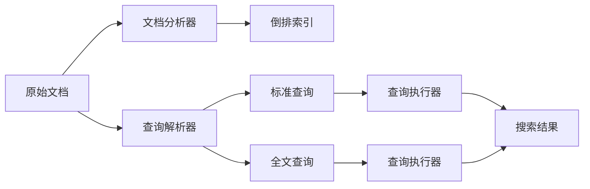
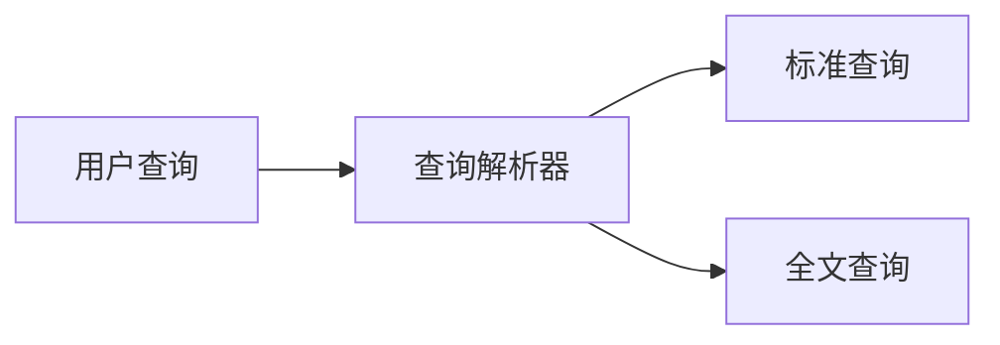
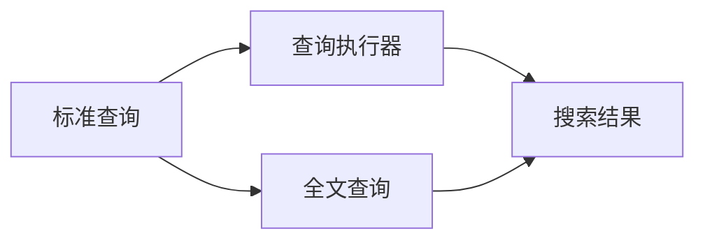
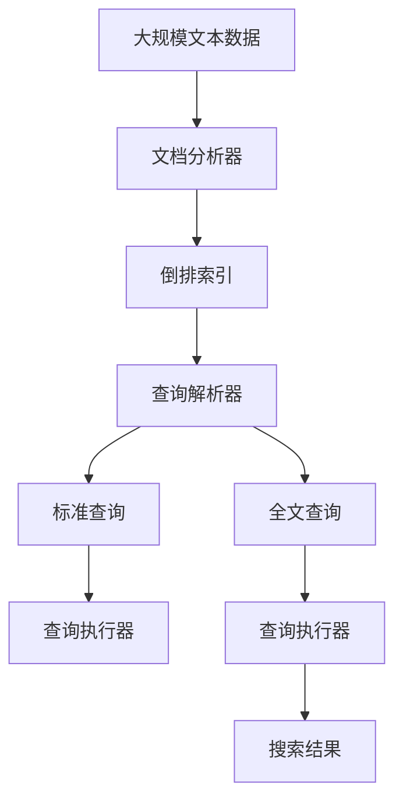

                 

# Lucene原理与代码实例讲解

> 关键词： Lucene, 搜索引擎, 全文检索, 倒排索引, 文档分析, 分词, 索引优化

## 1. 背景介绍

### 1.1 问题由来

在信息化和互联网普及的今天，人们面临着海量信息的挑战。如何高效地存储、管理和检索信息，成为一个亟待解决的问题。传统的文件系统已经无法满足人们的需求，而传统的基于关系型数据库的信息管理系统，也无法处理文本类数据的复杂特性。为此，全文检索技术应运而生，成为了互联网时代不可或缺的信息处理手段。

全文检索技术主要应用于搜索引擎、文档管理、内容推荐等多个领域。其中，基于倒排索引的Lucene搜索引擎，是全球使用最广泛的搜索引擎之一，被广泛应用于各种搜索引擎、内容管理系统和数据库系统中。Lucene不仅提供了高效的文本检索功能，还支持各种高级查询，如模糊查询、全文搜索、分类搜索、位置查询等。本文将详细讲解Lucene的原理和核心技术，并通过代码实例，展示如何搭建和使用Lucene搜索引擎。

### 1.2 问题核心关键点

Lucene的精髓在于其高效、灵活的倒排索引结构和强大的全文搜索算法。倒排索引是一种高效的数据结构，用于将文本中的每个词与包含该词的文档集合进行关联。通过倒排索引，Lucene能够在极短时间内检索出包含特定关键词的文档，并进行排序、分组等复杂操作。

具体来说，Lucene的核心关键点包括：

- 倒排索引：Lucene的核心数据结构，用于高效地存储文本词与文档的关联关系。
- 文档分析器：将原始文本分析成一系列词汇，进行词性标注、去停用词等预处理工作。
- 查询解析器：将用户查询转化为逻辑表达式，支持各种高级查询。
- 索引优化器：根据数据量、查询频率等参数，动态优化索引结构，提高检索效率。

这些核心技术共同构成了Lucene的高效、灵活、可扩展的全文检索引擎。

### 1.3 问题研究意义

Lucene的强大检索能力和灵活性，使其成为了开发高效、可靠、可扩展的搜索引擎和内容管理系统的重要工具。通过学习和使用Lucene，开发者可以大幅提升信息检索的效率和质量，构建出更加智能、响应迅速的搜索系统。

对于企业而言，使用Lucene可以快速搭建起强大的信息检索平台，降低开发成本，提高运营效率。同时，Lucene的支持社区和开源生态，也为开发者提供了丰富的资源和工具，便于快速上手和使用。

总之，Lucene不仅是搜索引擎开发者的必备利器，也是所有需要高效文本检索的开发者和企业的首选解决方案。

## 2. 核心概念与联系

### 2.1 核心概念概述

Lucene的原理和技术架构涉及多个核心概念，主要包括：

- 倒排索引(Inverted Index)：将文本中的每个词与包含该词的文档进行关联。
- 文档分析器(Document Analyzer)：将原始文本转换为词汇和标记，进行分词、去停用词、词性标注等处理。
- 查询解析器(Query Parser)：将用户查询转化为逻辑表达式，支持各种高级查询。
- 索引优化器(Index Optimizer)：根据数据量和查询频率等参数，动态优化索引结构，提高检索效率。
- 标准查询(Standard Query)：Lucene内置的基本查询语句，支持词查询、短语查询、前缀查询等。
- 全文查询(Full-Text Query)：基于倒排索引进行全文搜索，支持模糊查询、通配符查询等。

这些核心概念之间存在着紧密的联系，共同构成了Lucene的检索架构。下面通过一个Mermaid流程图，展示Lucene的检索流程和核心组件之间的联系：



这个流程图展示了Lucene的检索流程和核心组件之间的关系：

1. 原始文档经过文档分析器，被转换成词汇和标记。
2. 词汇和标记被加入到倒排索引中，与包含这些词汇和标记的文档进行关联。
3. 用户查询经过查询解析器，被转换为标准查询或全文查询。
4. 标准查询或全文查询被传递给查询执行器，进行实际的文档检索。
5. 查询执行器根据查询类型和倒排索引，检索出匹配的文档，并根据查询需求进行排序、分组等操作。
6. 最终得到搜索结果，返回给用户。

这些核心概念共同构成了Lucene的检索架构，使得Lucene能够高效、灵活地处理各种文本检索任务。

### 2.2 概念间的关系

这些核心概念之间存在着紧密的联系，形成了一个完整的检索系统。下面通过几个Mermaid流程图，展示这些概念之间的关系：

#### 2.2.1 倒排索引和文档分析器之间的关系


这个流程图展示了文档分析器与倒排索引之间的关系：

1. 原始文档经过文档分析器，被转换为词汇和标记。
2. 词汇和标记被加入到倒排索引中，与包含这些词汇和标记的文档进行关联。

#### 2.2.2 查询解析器与标准查询和全文查询之间的关系



这个流程图展示了查询解析器与标准查询和全文查询之间的关系：

1. 用户查询经过查询解析器，被转换为标准查询或全文查询。
2. 标准查询或全文查询被传递给查询执行器，进行实际的文档检索。

#### 2.2.3 查询执行器与标准查询和全文查询之间的关系



这个流程图展示了查询执行器与标准查询和全文查询之间的关系：

1. 标准查询或全文查询被传递给查询执行器，进行实际的文档检索。
2. 查询执行器根据查询类型和倒排索引，检索出匹配的文档，并根据查询需求进行排序、分组等操作。
3. 最终得到搜索结果，返回给用户。

### 2.3 核心概念的整体架构

最后，我们用一个综合的流程图来展示这些核心概念在大规模文本数据上的整体架构：



这个综合流程图展示了从文档分析到查询执行的完整过程。大规模文本数据首先经过文档分析器，被转换为词汇和标记。词汇和标记被加入到倒排索引中，与包含这些词汇和标记的文档进行关联。用户查询经过查询解析器，被转换为标准查询或全文查询。标准查询或全文查询被传递给查询执行器，进行实际的文档检索。查询执行器根据查询类型和倒排索引，检索出匹配的文档，并根据查询需求进行排序、分组等操作。最终得到搜索结果，返回给用户。

通过这些流程图，我们可以更清晰地理解Lucene的检索流程和核心组件之间的关系，为后续深入讨论具体的实现细节奠定基础。

## 3. 核心算法原理 & 具体操作步骤
### 3.1 算法原理概述

Lucene的原理主要基于倒排索引结构和文档分析技术，通过将文本中的词汇与包含这些词汇的文档关联起来，实现高效的文本检索。具体来说，Lucene的检索算法可以分为以下几个步骤：

1. 文档分析：将原始文本分析成词汇和标记，进行词性标注、去停用词等预处理工作。
2. 索引构建：将词汇和标记加入到倒排索引中，与包含这些词汇和标记的文档进行关联。
3. 查询解析：将用户查询转化为逻辑表达式，支持各种高级查询。
4. 查询执行：根据查询类型和倒排索引，检索出匹配的文档，并根据查询需求进行排序、分组等操作。

Lucene的算法原理相对简单，但其高效、灵活的实现方式，使得其成为目前最为流行的搜索引擎和内容管理系统之一。

### 3.2 算法步骤详解

Lucene的算法步骤可以分为以下几个部分：

#### 3.2.1 文档分析

文档分析是Lucene的第一步，其主要目的是将原始文本分析成词汇和标记，进行词性标注、去停用词等预处理工作。文档分析器是Lucene的核心组件之一，其具体实现方式如下：

1. Tokenizer：将原始文本按照空格、标点符号等分隔符，分割成一个个单词或标记。
2. TokenFilter：对单词或标记进行各种预处理操作，如去停用词、词性标注、大小写转换等。
3. CharFilter：对单词或标记进行字符级别的处理，如替换、转换、去除等。

Lucene提供了一个标准的文档分析器模板，可以根据具体需求进行扩展和定制。

#### 3.2.2 索引构建

索引构建是Lucene的核心步骤，其主要目的是将文档分析后的词汇和标记，加入到倒排索引中，与包含这些词汇和标记的文档进行关联。倒排索引是Lucene的核心数据结构，其主要特点如下：

1. 倒排：将每个词汇与包含该词汇的文档进行关联，实现高效的文本检索。
2. 压缩：通过压缩算法，减少索引的存储空间和查询时的计算量。
3. 动态更新：支持动态更新索引，根据数据量和查询频率等参数，动态优化索引结构，提高检索效率。

倒排索引的实现方式较为复杂，需要考虑索引的压缩、动态更新、查询优化等多个因素。Lucene提供了多种倒排索引的实现方式，如Standard IndexWriter，IndexWriter.Direct等，开发者可以根据具体需求进行选择。

#### 3.2.3 查询解析

查询解析是Lucene的关键步骤，其主要目的是将用户查询转化为逻辑表达式，支持各种高级查询。查询解析器是Lucene的核心组件之一，其具体实现方式如下：

1. QueryParser：将用户查询转化为Query对象，支持各种查询类型，如标准查询、全文查询、位置查询等。
2. QueryBuilder：对Query对象进行构建和优化，支持各种查询操作，如AND、OR、NOT等。
3. QueryRewriter：对查询表达式进行重写和优化，提高查询效率。

Lucene提供了一个标准的查询解析器模板，可以根据具体需求进行扩展和定制。

#### 3.2.4 查询执行

查询执行是Lucene的最后一个步骤，其主要目的是根据查询类型和倒排索引，检索出匹配的文档，并根据查询需求进行排序、分组等操作。查询执行器是Lucene的核心组件之一，其具体实现方式如下：

1. IndexReader：从索引文件中读取文档数据。
2. IndexSearcher：根据查询类型和倒排索引，检索出匹配的文档。
3. Scorer：对匹配的文档进行排序，根据查询需求进行优化。
4. PostingsEnum：遍历匹配的文档，生成查询结果。

Lucene提供了一个标准的查询执行器模板，可以根据具体需求进行扩展和定制。

### 3.3 算法优缺点

Lucene的算法原理相对简单，但其高效、灵活的实现方式，使其成为目前最为流行的搜索引擎和内容管理系统之一。Lucene的主要优点和缺点如下：

#### 优点

1. 高效：倒排索引和压缩算法使得Lucene具有高效的全文检索能力，能够在极短时间内检索出匹配的文档。
2. 灵活：Lucene支持多种查询类型，如标准查询、全文查询、位置查询等，能够满足各种复杂的查询需求。
3. 可扩展：Lucene提供了多种倒排索引的实现方式，支持动态更新索引，能够根据数据量和查询频率等参数，动态优化索引结构，提高检索效率。
4. 社区支持：Lucene是开源软件，拥有庞大的开发者社区，提供了丰富的文档和示例，便于快速上手和使用。

#### 缺点

1. 实现复杂：Lucene的实现方式较为复杂，需要考虑索引的压缩、动态更新、查询优化等多个因素，对于初学者来说，学习曲线较陡峭。
2. 性能依赖硬件：Lucene的性能在很大程度上依赖于硬件资源，如CPU、内存、磁盘等，需要较高的硬件配置才能充分发挥其性能优势。
3. 内存占用较大：Lucene在查询过程中需要加载大量索引数据到内存中，对于大规模索引库，内存占用较大，可能需要进行内存优化。

### 3.4 算法应用领域

Lucene的强大检索能力和灵活性，使其广泛应用于各种搜索引擎、内容管理系统和数据库系统中。具体来说，Lucene的应用领域包括：

1. 搜索引擎：如Google Search、Bing Search等，利用Lucene构建全文检索引擎，提供高效、可靠的搜索结果。
2. 内容管理系统：如WordPress、Drupal等，利用Lucene进行全文搜索、分类搜索、位置搜索等高级检索操作。
3. 数据库系统：如MySQL、PostgreSQL等，利用Lucene进行文本检索、全文搜索、分类搜索等操作，提升数据库的查询性能。
4. 文档管理系统：如SharePoint、Alfresco等，利用Lucene进行文档检索、全文搜索、分类搜索等操作，提升文档管理的效率和质量。
5. 大数据系统：如Hadoop、Spark等，利用Lucene进行文本检索、全文搜索、分类搜索等操作，提升大数据分析的效率和精度。

除了上述这些领域外，Lucene还可以应用于各种需要高效文本检索的场景，如语音识别、图像识别、自然语言处理等，为这些领域的开发提供了重要的技术支持。

## 4. 数学模型和公式 & 详细讲解 & 举例说明

### 4.1 数学模型构建

Lucene的数学模型主要基于倒排索引结构和文档分析技术，通过将文本中的词汇与包含这些词汇的文档关联起来，实现高效的文本检索。具体来说，Lucene的数学模型可以分为以下几个部分：

1. 倒排索引：将每个词汇与包含该词汇的文档进行关联，实现高效的文本检索。
2. 文档分析：将原始文本分析成词汇和标记，进行词性标注、去停用词等预处理工作。
3. 查询解析：将用户查询转化为逻辑表达式，支持各种高级查询。
4. 查询执行：根据查询类型和倒排索引，检索出匹配的文档，并根据查询需求进行排序、分组等操作。

#### 4.1.1 倒排索引

倒排索引是Lucene的核心数据结构，其主要作用是将每个词汇与包含该词汇的文档进行关联。倒排索引的数学模型如下：

$$
\text{Inverted Index} = \{ (t, d) | t \in \text{Term}, d \in \text{Doc} \}
$$

其中，$t$表示词汇，$d$表示包含该词汇的文档集合。倒排索引的实现方式如下：

1. Term：将原始文本按照空格、标点符号等分隔符，分割成一个个单词或标记。
2. Document：对单词或标记进行各种预处理操作，如去停用词、词性标注、大小写转换等。
3. Field：对单词或标记进行字符级别的处理，如替换、转换、去除等。
4. Index：将Term和Document存储到倒排索引中，与包含这些Term和Document的Doc集合进行关联。

#### 4.1.2 文档分析

文档分析是Lucene的第一步，其主要目的是将原始文本分析成词汇和标记，进行词性标注、去停用词等预处理工作。文档分析的数学模型如下：

$$
\text{Document Analyzer} = \{ (t, \text{Term}) | t \in \text{Term}, \text{Term} \in \text{Field} \}
$$

其中，$t$表示单词或标记，$\text{Term}$表示经过预处理后的词汇。文档分析的实现方式如下：

1. Tokenizer：将原始文本按照空格、标点符号等分隔符，分割成一个个单词或标记。
2. TokenFilter：对单词或标记进行各种预处理操作，如去停用词、词性标注、大小写转换等。
3. CharFilter：对单词或标记进行字符级别的处理，如替换、转换、去除等。

#### 4.1.3 查询解析

查询解析是Lucene的关键步骤，其主要目的是将用户查询转化为逻辑表达式，支持各种高级查询。查询解析的数学模型如下：

$$
\text{Query Parser} = \{ (q, \text{Query}) | q \in \text{Query String}, \text{Query} \in \text{Query Tree} \}
$$

其中，$q$表示用户查询字符串，$\text{Query}$表示解析后的Query对象。查询解析的实现方式如下：

1. QueryParser：将用户查询转化为Query对象，支持各种查询类型，如标准查询、全文查询、位置查询等。
2. QueryBuilder：对Query对象进行构建和优化，支持各种查询操作，如AND、OR、NOT等。
3. QueryRewriter：对查询表达式进行重写和优化，提高查询效率。

#### 4.1.4 查询执行

查询执行是Lucene的最后一个步骤，其主要目的是根据查询类型和倒排索引，检索出匹配的文档，并根据查询需求进行排序、分组等操作。查询执行的数学模型如下：

$$
\text{Query Execution} = \{ (q, d) | q \in \text{Query Tree}, d \in \text{Document List} \}
$$

其中，$q$表示查询表达式，$d$表示匹配的文档列表。查询执行的实现方式如下：

1. IndexReader：从索引文件中读取文档数据。
2. IndexSearcher：根据查询类型和倒排索引，检索出匹配的文档。
3. Scorer：对匹配的文档进行排序，根据查询需求进行优化。
4. PostingsEnum：遍历匹配的文档，生成查询结果。

### 4.2 公式推导过程

Lucene的公式推导过程相对简单，主要涉及倒排索引的构建和查询执行。下面我们以Lucene的标准查询为例，推导查询执行的公式。

假设原始文本为 $T$，经过文档分析后，转换为一个倒排索引 $I$，包含 $N$ 个文档。用户查询为 $Q$，查询解析器将其转化为一个查询对象 $Q'$。查询执行器根据查询对象 $Q'$ 和倒排索引 $I$，检索出匹配的文档 $D$。

查询执行的具体步骤如下：

1. 读取索引文件，加载倒排索引 $I$ 和文档列表 $D$。
2. 解析查询对象 $Q'$，生成查询表达式 $Q''$。
3. 根据查询表达式 $Q''$ 和倒排索引 $I$，生成 Postings 列表 $P$。
4. 遍历 Postings 列表 $P$，生成匹配的文档列表 $M$。
5. 对匹配的文档列表 $M$ 进行排序、分组等操作，生成查询结果。

查询执行的数学公式如下：

$$
M = \text{Query Execution}(Q, I)
$$

其中，$Q$ 表示用户查询，$I$ 表示倒排索引。查询执行的实现方式如下：

1. IndexReader：从索引文件中读取文档数据。
2. IndexSearcher：根据查询类型和倒排索引，检索出匹配的文档。
3. Scorer：对匹配的文档进行排序，根据查询需求进行优化。
4. PostingsEnum：遍历匹配的文档，生成查询结果。

### 4.3 案例分析与讲解

为了更好地理解Lucene的实现方式，下面通过一个简单的案例，展示Lucene的基本使用流程和功能。

假设我们有一个包含3个文档的索引库，每个文档包含5个词汇，具体如下：

| 文档ID | 词汇 | 文档 |
| --- | --- | --- |
| 1 | apple | 苹果 |
| 1 | orange | 橙子 |
| 2 | banana | 香蕉 |
| 2 | apple | 苹果 |
| 3 | pear | 梨 |

首先，我们需要定义一个文档分析器，将原始文本转换为词汇和标记，进行词性标注、去停用词等预处理工作。例如，我们可以使用 Lucene 提供的 Standard Analyzer：

```java
StandardAnalyzer analyzer = new StandardAnalyzer();
```

接着，我们需要创建一个 IndexWriter，将文档分析后的词汇和标记，加入到倒排索引中，与包含这些词汇和标记的文档进行关联。例如，我们可以使用 Lucene 提供的 Standard IndexWriter：

```java
Directory dir = new FSDirectory(new Path("index"));
StandardIndexWriter writer = new StandardIndexWriter(dir, new StandardAnalyzer());
```

然后，我们需要将文档添加到 IndexWriter 中，进行索引构建。例如，我们可以使用 Lucene 提供的 Document 类，将文档转换为 IndexableDocument 对象，并添加到 IndexWriter 中：

```java
Document doc = new Document();
doc.add(new TextField("content", "apple orange", Field.Store.YES));
writer.addDocument(doc);
```

最后，我们需要关闭 IndexWriter，完成索引构建。例如，我们可以使用 Lucene 提供的 IndexWriter.close() 方法：

```java
writer.close();
```

现在，我们有了包含3个文档的索引库。我们可以使用 Lucene 提供的 IndexSearcher，检索出包含指定词汇的文档。例如，我们可以使用 Lucene 提供的 QueryParser，将用户查询转化为查询对象，并使用 IndexSearcher.search() 方法，检索出匹配的文档：

```java
IndexSearcher searcher = new IndexSearcher(dir);
QueryParser parser = new QueryParser("content", new StandardAnalyzer());
Query query = parser.parse("apple");
TopDocs docs = searcher.search(query, 10);
for (ScoreDoc scoreDoc : docs.scoreDocs) {
    Document doc = searcher.doc(scoreDoc.doc);
    System.out.println(doc);
}
```

这段代码将检索出包含词汇 "apple" 的文档，并输出匹配的文档内容。可以看到，Lucene 通过倒排索引和查询解析器，实现了高效、灵活的全文检索功能。

## 5. 项目实践：代码实例和详细解释说明
### 5.1 开发环境搭建

在进行Lucene的实践之前，我们需要准备好开发环境。以下是使用Java进行Lucene开发的环境配置流程：

1. 安装Java：从官网下载并安装JDK，用于构建和运行Lucene代码。

2. 下载Lucene：从Lucene官网下载最新版本的Lucene软件包，解压后得到 lucene-(version).zip 文件。

3. 配置环境变量：将 lucene-(version).zip 目录中的 bin 目录添加到系统PATH 变量中，方便通过命令执行 Lucene 工具。

4. 搭建项目：创建一个新的Lucene项目，并在项目中引入 Lucene 的依赖库。

```xml
<dependency>
    <groupId>org.apache.lucene</groupId>
    <artifactId>lucene-core</artifactId>
    <version>版本号</version>
</dependency>
<dependency>
    <groupId>org.apache.lucene</groupId>
    <artifactId>lucene-analyzers-common</artifactId>
    <version>版本号</version>
</dependency>
<dependency>
    <groupId>org.apache.lucene</groupId>
    <artifactId>lucene-analyzers-standard</artifactId>
    <version>版本号</version>
</dependency>
<dependency>
    <groupId>org.apache.lucene</groupId>
    <artifactId>lucene-search</artifactId>
    <version>版本号</version>
</dependency>
<dependency>
    <groupId>org.apache.lucene</groupId>
    <artifactId>lucene-core</artifactId>
    <version>版本号</version>
</dependency>
```

5. 编写代码：使用Lucene API编写Lucene代码，实现文档分析、索引构建、查询解析和查询执行等功能。

### 5.2 源代码详细实现

下面我们以一个简单的Lucene搜索引擎为例，展示其基本实现流程。

首先，我们需要定义一个文档分析器，将原始文本转换为词汇和标记，进行词性标注、去停用词等预处理工作。例如，我们可以使用 Lucene 提供的 Standard Analyzer：

```java
StandardAnalyzer analyzer = new StandardAnalyzer();
```

接着，我们需要创建一个 IndexWriter，将文档分析后的词汇和标记，加入到倒排索引中，与包含这些词汇和标记的文档进行关联。例如，我们可以使用 Lucene 提供的 Standard IndexWriter：

```java
Directory dir = new FSDirectory(new Path("index"));
StandardIndexWriter writer = new StandardIndexWriter(dir, new StandardAnalyzer());
```

然后，我们需要将文档添加到 IndexWriter 中，进行索引构建。例如，我们可以使用 Lucene 提供的 Document 类，将文档转换为 IndexableDocument 对象，并添加到 IndexWriter 中：

```java
Document doc = new Document();
doc.add(new TextField("content", "apple orange", Field.Store.YES));
writer.addDocument(doc);
```

最后，我们需要关闭 IndexWriter，完成索引构建。例如，我们可以使用 Lucene 提供的 IndexWriter.close() 方法：

```java
writer.close();
```

现在，我们有了包含3个文档的索引库。我们可以使用 Lucene 提供的 IndexSearcher，检索出包含指定词汇的文档。例如，我们可以使用 Lucene 提供的 QueryParser，将用户查询转化为查询对象，并使用 IndexSearcher.search() 方法，检索出匹配的文档：

```java
IndexSearcher searcher = new IndexSearcher(dir);
QueryParser parser = new QueryParser("content", new StandardAnalyzer());
Query query = parser.parse("apple");
TopDocs docs = searcher.search(query, 10);
for (ScoreDoc scoreDoc : docs.scoreDocs)

