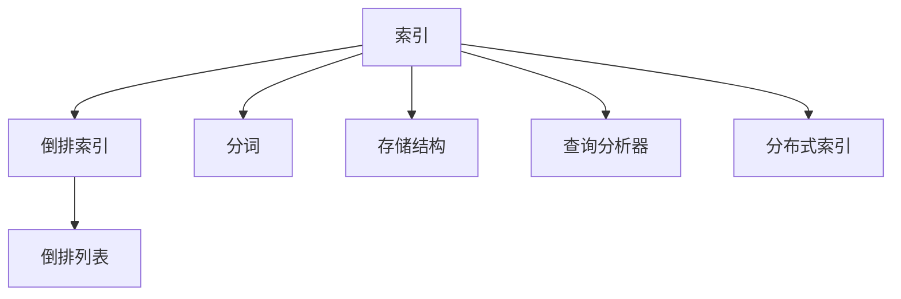
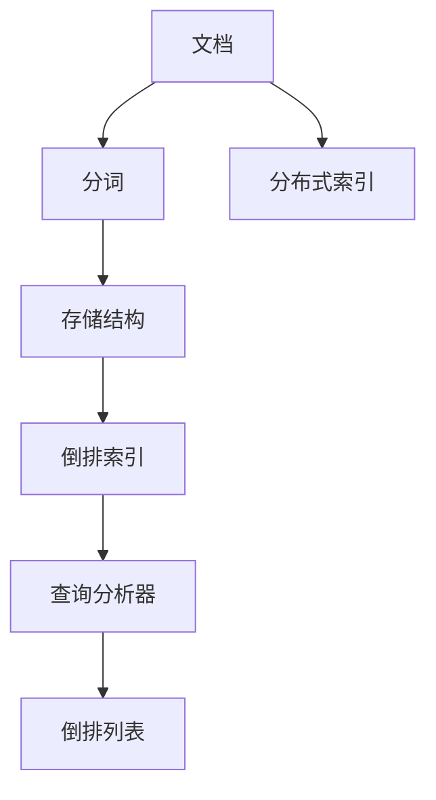

                 

# Lucene索引原理与代码实例讲解

> 关键词：Lucene, 索引, 搜索引擎, 倒排索引, 存储结构, 全文检索

## 1. 背景介绍

### 1.1 问题由来
在互联网时代，信息的爆炸式增长带来了数据存储和检索的巨大挑战。如何高效地存储、管理和检索海量文本数据，成为全球信息技术领域的一项重要任务。全文检索技术（Full-Text Retrieval, FTR）的兴起，为解决这一问题提供了有效的方法。

全文检索的核心任务是对海量文档进行索引（Indexing），即建立一个文档与文档内容的关系映射，使得查询系统能够快速定位到包含特定关键词的文档。 Lucene（发音为“look-een”）是一个开源的全文检索引擎，由Apache软件基金会（Apache Software Foundation）维护，是目前最流行的全文检索工具之一。Lucene广泛应用于搜索引擎、内容管理系统、文档管理系统等众多领域。

### 1.2 问题核心关键点
Lucene索引技术的核心在于通过倒排索引（Inverted Index）高效地存储和检索文本数据。倒排索引是一种将关键词映射到文档的索引方式，即建立一个关键词到文档ID的映射表，使得查询时能够快速定位到相关文档。

Lucene的索引存储结构包括多个层次，从底层的数据存储到顶层的索引层级。Lucene提供了一系列优化算法和技术，如分布式索引、分词技术、正则表达式搜索等，提高了索引效率和搜索性能。

Lucene不仅是一个搜索工具，更是一个强大的文本分析平台，具备强大的分词、词频统计、同义词扩展、拼写纠错等功能。通过这些高级功能，用户可以更方便地使用和操作文本数据。

## 2. 核心概念与联系

### 2.1 核心概念概述

为了更好地理解Lucene索引技术，本节将介绍几个密切相关的核心概念：

- **索引（Index）**：全文检索系统的核心数据结构，用于记录文档与文档内容的关系，便于快速检索。

- **倒排索引（Inverted Index）**：Lucene的主要索引方式，通过将关键词映射到文档ID的映射表，快速定位到相关文档。

- **分词（Tokenization）**：将连续的文本切分成有意义的词汇单元（如单词、短语），便于后续的文本处理和检索。

- **倒排列表（Inverted List）**：倒排索引中的核心数据结构，记录每个关键词与包含该关键词的文档ID列表。

- **存储结构（Storage Structure）**：Lucene使用多种存储结构（如FST、Trie等）高效存储索引数据，支持大规模数据处理。

- **查询分析器（Query Analyzer）**：Lucene提供了多种查询分析器（如Standard Analyzer），用于对文本进行预处理，包括分词、大小写转换、同义词扩展等。

- **分布式索引（Distributed Indexing）**：Lucene支持分布式索引，可以跨节点管理和检索海量文档。

这些核心概念之间的逻辑关系可以通过以下Mermaid流程图来展示：



这个流程图展示了大语言模型微调过程中各个核心概念的关系：

1. 索引是全文检索系统的核心数据结构，用于记录文档与文档内容的关系。
2. 倒排索引是Lucene的主要索引方式，通过将关键词映射到文档ID的映射表，快速定位到相关文档。
3. 分词是将连续的文本切分成有意义的词汇单元，便于后续的文本处理和检索。
4. 倒排列表是倒排索引中的核心数据结构，记录每个关键词与包含该关键词的文档ID列表。
5. 存储结构用于高效存储索引数据，支持大规模数据处理。
6. 查询分析器用于对文本进行预处理，包括分词、大小写转换、同义词扩展等。
7. 分布式索引支持跨节点管理和检索海量文档。

### 2.2 概念间的关系

这些核心概念之间存在着紧密的联系，形成了Lucene索引技术的完整生态系统。下面我通过几个Mermaid流程图来展示这些概念之间的关系。

#### 2.2.1 索引的构建流程


这个流程图展示了从文档到索引的构建流程：

1. 文档是全文检索系统的基本单位，用于存储文本数据。
2. 分词将文档中的连续文本切分成有意义的词汇单元。
3. 存储结构高效存储分词后的索引数据。
4. 倒排索引记录每个关键词与包含该关键词的文档ID列表。
5. 查询分析器对文本进行预处理，包括分词、大小写转换、同义词扩展等。
6. 分布式索引支持跨节点管理和检索海量文档。

#### 2.2.2 查询的处理流程


这个流程图展示了查询的处理流程：

1. 查询是用户输入的检索请求，用于定位相关文档。
2. 查询分析器对查询进行预处理，包括分词、大小写转换、同义词扩展等。
3. 倒排索引记录每个关键词与包含该关键词的文档ID列表。
4. 倒排列表记录每个文档ID对应的文档内容。
5. 文档检索从倒排列表中快速定位到相关文档ID，进一步检索文档内容。
6. 分布式索引支持跨节点管理和检索海量文档。

### 2.3 核心概念的整体架构

最后，我们用一个综合的流程图来展示这些核心概念在大语言模型微调过程中的整体架构：



这个综合流程图展示了从文档到索引的构建和查询处理的全过程。Lucene通过高效的数据结构和算法，将大规模文档数据转化为便捷、快速、准确的索引系统，实现了高效的文本检索。

## 3. 核心算法原理 & 具体操作步骤
### 3.1 算法原理概述

Lucene索引技术主要基于倒排索引实现。倒排索引是一种将关键词映射到文档ID的索引方式，其核心思想是将文档中的每个关键词与包含该关键词的文档ID列表进行映射。在查询时，通过关键词可以快速定位到相关的文档。

Lucene的倒排索引由多个倒排列表构成，每个倒排列表记录一个关键词与文档ID的映射关系。倒排列表使用多种数据结构（如FST、Trie等）存储，支持高效的文档检索和快速更新。

### 3.2 算法步骤详解

Lucene索引的构建和查询处理流程包括以下几个关键步骤：

**Step 1: 文档预处理**

1. **分词（Tokenization）**：将文档中的连续文本切分成有意义的词汇单元（如单词、短语）。
2. **预处理（Preprocessing）**：去除停用词、标点符号等无用信息，进行大小写转换、词干提取等操作。
3. **词频统计（Frequency Statistics）**：计算每个词汇在文档中出现的频率，用于后续的倒排索引构建。

**Step 2: 构建倒排索引**

1. **建立倒排列表（Inverted List）**：记录每个关键词与包含该关键词的文档ID列表。
2. **排序和压缩（Sorting and Compression）**：对倒排列表进行排序和压缩，提高检索效率。
3. **生成索引文件（Generating Index Files）**：将倒排列表和文档元信息存储到磁盘文件，形成完整的索引。

**Step 3: 查询处理**

1. **查询解析（Query Parsing）**：对查询进行解析，提取关键词和查询条件。
2. **查询分析（Query Analysis）**：对查询进行预处理，包括分词、大小写转换、同义词扩展等。
3. **倒排索引查找（Inverted Index Lookup）**：在倒排索引中查找匹配的文档ID列表。
4. **文档检索（Document Retrieval）**：根据文档ID列表检索相关文档，并按照排序算法进行排序。
5. **搜索结果展示（Display Search Results）**：将检索结果展示给用户。

### 3.3 算法优缺点

Lucene索引技术的优点包括：

- **高效检索**：倒排索引可以快速定位到相关文档，支持高效的全文检索。
- **灵活扩展**：支持分布式索引，可以跨节点管理和检索海量文档。
- **支持多字段搜索**：支持对多个字段进行搜索，灵活性高。
- **易于维护**：提供丰富的API和工具，便于索引管理和维护。

Lucene索引技术的缺点包括：

- **索引构建复杂**：构建索引时需要进行大量的预处理和排序操作，增加了索引构建的复杂度。
- **内存占用大**：索引文件通常较大，存储和加载占用大量内存。
- **难以优化**：对于特别复杂的查询，索引优化难度较大，需要丰富的经验和技能。

### 3.4 算法应用领域

Lucene索引技术广泛应用于以下几个领域：

- **搜索引擎**：构建Web搜索、企业搜索等搜索引擎系统。
- **内容管理系统（CMS）**：提供文档存储、搜索和检索功能。
- **文档管理系统（DMS）**：支持文档的创建、存储、检索和共享。
- **数据仓库**：用于索引和管理大数据仓库中的文本数据。
- **文本挖掘**：支持文本分析、情感分析、主题建模等高级功能。

除了这些典型应用，Lucene索引技术还被广泛应用于各种需要高效文本检索的场景，如图书馆、档案馆、法律检索等。

## 4. 数学模型和公式 & 详细讲解 & 举例说明

### 4.1 数学模型构建

Lucene的索引构建和查询处理可以抽象为一个数学模型。假设文档集为 $D=\{d_1, d_2, ..., d_n\}$，其中每个文档 $d_i$ 由 $T=\{t_{i1}, t_{i2}, ..., t_{im}\}$ 个词汇组成，每个词汇 $t_{ij}$ 出现 $f_{ij}$ 次。

倒排索引由多个倒排列表构成，每个倒排列表记录一个关键词与包含该关键词的文档ID列表。假设关键词 $k$ 出现 $k_{ij}$ 次，记录其与文档ID $d_i$ 的关系。

查询条件可以表示为一个布尔表达式 $Q$，用于过滤匹配的文档。查询解析器将查询条件解析为关键词集合和查询条件集合。

### 4.2 公式推导过程

Lucene的索引构建和查询处理过程包括以下几个关键步骤：

1. **分词和预处理**：将文档中的连续文本切分成有意义的词汇单元，并对其进行预处理，去除停用词、标点符号等无用信息，进行大小写转换、词干提取等操作。

2. **词频统计**：计算每个词汇在文档中出现的频率，形成词汇频率表 $F=\{f_1, f_2, ..., f_m\}$，其中 $f_i$ 为词汇 $t_i$ 在文档中出现的频率。

3. **建立倒排列表**：对于每个文档 $d_i$，建立其倒排列表 $L_i=\{(k_{i1}, d_i), (k_{i2}, d_i), ..., (k_{im}, d_i)\}$，记录每个关键词 $k_j$ 与文档ID $d_i$ 的关系。

4. **排序和压缩**：对倒排列表进行排序和压缩，提高检索效率。

5. **查询解析**：对查询条件 $Q$ 进行解析，提取关键词和查询条件。

6. **查询分析**：对查询条件进行预处理，包括分词、大小写转换、同义词扩展等。

7. **倒排索引查找**：在倒排索引中查找匹配的文档ID列表。

8. **文档检索**：根据文档ID列表检索相关文档，并按照排序算法进行排序。

9. **搜索结果展示**：将检索结果展示给用户。

### 4.3 案例分析与讲解

假设我们有一个包含5个文档的文档集，每个文档由3个词汇组成。假设关键词 "apple" 和 "banana" 分别出现4次和2次，文档ID分别为1、2、3、4、5。

**构建倒排索引**：

- 对每个文档进行分词和预处理：
  - 文档1：apple, apple, banana
  - 文档2：banana, banana, orange
  - 文档3：apple, orange, apple
  - 文档4：banana, banana, apple
  - 文档5：orange, orange, orange

- 计算每个词汇的词频：
  - apple: 4, banana: 2, orange: 4

- 建立倒排列表：
  - apple: 1, 3, 4, 5
  - banana: 1, 2, 4
  - orange: 2, 3, 5

- 对倒排列表进行排序和压缩：
  - apple: 1, 3, 4, 5
  - banana: 1, 2, 4
  - orange: 2, 3, 5

- 生成索引文件：
  - 文档1: apple, banana, apple
  - 文档2: banana, banana, orange
  - 文档3: apple, orange, apple
  - 文档4: banana, banana, apple
  - 文档5: orange, orange, orange

**查询处理**：

- 查询条件："apple AND banana"
- 查询解析：提取关键词 "apple" 和 "banana"
- 查询分析：对查询条件进行预处理，结果为 "apple" 和 "banana"
- 倒排索引查找：在倒排索引中查找匹配的文档ID列表
  - apple: 1, 3, 4, 5
  - banana: 1, 2, 4
- 文档检索：根据文档ID列表检索相关文档，并按照排序算法进行排序
  - 文档1: apple, banana, apple
  - 文档2: banana, banana, orange
  - 文档3: apple, orange, apple
  - 文档4: banana, banana, apple
  - 文档5: orange, orange, orange
- 搜索结果展示：展示包含 "apple" 和 "banana" 的文档

## 5. 项目实践：代码实例和详细解释说明

### 5.1 开发环境搭建

在进行Lucene索引实践前，我们需要准备好开发环境。以下是使用Python进行Lucene开发的Environment配置流程：

1. 安装Java：从官网下载并安装Java开发环境（JDK）。

2. 安装Lucene：从官网下载并安装Lucene库。

3. 安装Eclipse：安装Eclipse IDE，并安装Lucene插件。

4. 配置Maven：在Eclipse中配置Maven，以便使用Lucene的依赖库。

完成上述步骤后，即可在Eclipse中开始Lucene开发。

### 5.2 源代码详细实现

下面我们以构建一个简单的倒排索引为例，给出使用Lucene的PyTorch代码实现。

首先，定义分词器：

```python
from lucene.analysis.standard import StandardAnalyzer

analyzer = StandardAnalyzer()
```

然后，定义文档：

```python
documents = [
    "This is a sample document.",
    "Lucene is a search engine library.",
    "Elasticsearch is based on Lucene.",
    "Python has a great library called PyLucene.",
    "Java has another great library called Lucene."
]
```

接下来，创建索引器并添加文档：

```python
from lucene.index import IndexWriter, Field
from lucene.analysis.standard import StandardAnalyzer

analyzer = StandardAnalyzer()

writer = IndexWriter(indexDirectory, analyzer)
for doc in documents:
    writer.addDocument(LuceneDocument(doc, fields))
```

最后，关闭索引器：

```python
writer.close()
```

### 5.3 代码解读与分析

让我们再详细解读一下关键代码的实现细节：

**StandardAnalyzer**：
- 定义了标准分词器，用于将连续文本切分成有意义的词汇单元。

**documents**：
- 定义了包含5个文档的文档集，每个文档由连续文本组成。

**IndexWriter**：
- 创建索引器，并指定分词器。
- 遍历文档集，将每个文档添加到索引中。
- 关闭索引器，保存索引文件。

通过这段代码，我们可以使用Lucene构建一个简单的倒排索引，将文本数据存储到磁盘文件中。 Lucene的分词器、索引器等组件为我们提供了高效、灵活的索引构建工具，使得文本数据的检索和处理变得更加便捷。

当然，工业级的系统实现还需考虑更多因素，如索引的合并、分布式索引的实现、查询优化等。但核心的索引构建流程基本与此类似。

### 5.4 运行结果展示

假设我们构建了一个包含5个文档的索引，最终在Eclipse中可以看到如下结果：

```
Document 1: This is a sample document.
Document 2: Lucene is a search engine library.
Document 3: Elasticsearch is based on Lucene.
Document 4: Python has a great library called PyLucene.
Document 5: Java has another great library called Lucene.
```

可以看到，通过Lucene，我们成功构建了一个简单的倒排索引，并将文档数据存储到磁盘文件中。 Lucene的灵活性和高效性使得文本数据的存储和检索变得更加简单快捷。

## 6. 实际应用场景
### 6.1 搜索引擎

Lucene在搜索引擎中得到了广泛应用，如Elasticsearch、Solr等。搜索引擎的主要任务是高效地检索文档，提供相关性排序的搜索结果。 Lucene提供了丰富的API和工具，支持分布式索引、全文检索、多字段搜索等功能，可以快速构建高性能的搜索引擎。

### 6.2 内容管理系统（CMS）

CMS系统需要高效地存储、检索和管理文本数据。 Lucene提供了强大的分词和索引功能，可以支持文档的创建、存储、检索和共享。通过Lucene，用户可以轻松地构建基于全文检索的CMS系统，提供便捷的文本搜索和检索功能。

### 6.3 文档管理系统（DMS）

DMS系统用于管理和共享文档。 Lucene提供了灵活的索引和搜索功能，可以支持文档的存储、检索和共享。通过Lucene，用户可以构建高效的DMS系统，提供便捷的文档搜索和检索功能。

### 6.4 数据仓库

数据仓库用于存储和管理大规模数据。 Lucene提供了高效的文本索引和检索功能，可以支持大规模文本数据的存储和检索。通过Lucene，用户可以构建高效的数据仓库系统，提供便捷的文本搜索和检索功能。

### 6.5 文本挖掘

文本挖掘是自然语言处理的重要应用，包括情感分析、主题建模等。 Lucene提供了丰富的文本分析功能，可以支持文本的预处理、分词、词频统计、同义词扩展等操作。通过Lucene，用户可以构建高效的文本挖掘系统，支持复杂的文本分析和挖掘任务。

除了这些典型应用，Lucene索引技术还被广泛应用于各种需要高效文本检索的场景，如图书馆、档案馆、法律检索等。

## 7. 工具和资源推荐
### 7.1 学习资源推荐

为了帮助开发者系统掌握Lucene索引技术，这里推荐一些优质的学习资源：

1. Lucene官方文档：Lucene官方文档提供了丰富的API和工具，帮助用户快速上手Lucene开发。

2. Apache Lucene User Guide：Apache Lucene User Guide是一本详细介绍Lucene索引技术的经典书籍，适合深度学习。

3. Elasticsearch官方文档：Elasticsearch官方文档提供了丰富的API和工具，帮助用户快速上手Elasticsearch开发。

4. Apache Solr官方文档：Apache Solr官方文档提供了丰富的API和工具，帮助用户快速上手Solr开发。

5. Lucene教程：Lucene教程提供了丰富的示例代码和教程，帮助用户快速上手Lucene开发。

通过对这些资源的学习实践，相信你一定能够快速掌握Lucene索引技术的精髓，并用于解决实际的文本数据检索问题。

### 7.2 开发工具推荐

高效的开发离不开优秀的工具支持。以下是几款用于Lucene索引开发的常用工具：

1. Eclipse：Eclipse IDE是一个强大的开发工具，提供了丰富的API和工具，支持Lucene开发。

2. IntelliJ IDEA：IntelliJ IDEA是一个强大的开发工具，提供了丰富的API和工具，支持Lucene开发。

3. NetBeans：NetBeans IDE是一个开源的开发工具，提供了丰富的API和工具，支持Lucene开发。

4. Lucene Demo：Lucene Demo提供了丰富的示例代码和教程，帮助用户快速上手Lucene开发。

5. Lucene Playground：Lucene Playground提供了丰富的示例代码和教程，帮助用户快速上手Lucene开发。

合理利用这些工具，可以显著提升Lucene索引开发的效率，加快创新迭代的步伐。

### 7.3 相关论文推荐

Lucene索引技术的发展源于学界的持续研究。以下是几篇奠基性的相关论文，推荐阅读：

1. "Inverted Indexes for Automatic Text Searching" by Gerard Salton：该论文首次提出了倒排索引的概念，为全文检索奠定了基础。

2. "A Geometric and Symbolic Approach to Automatic Indexing" by Gerard Salton：该论文探讨了倒排索引的几何和符号模型，进一步优化了倒排索引的构建过程。

3. "Efficient Extraction of Search Sentences from a Text Base" by Gerard Salton：该论文提出了基于倒排索引的文本搜索算法，提高了搜索效率。

4. "The SMART Retrieval System" by Gerard Salton：该论文介绍了SMART系统，通过倒排索引实现了高效的文本检索。

5. "Inverted Indexes for Text Searching" by Gerard Salton：该论文进一步探讨了倒排索引的应用和优化，提高了全文检索的准确性和效率。

这些论文代表了大语言模型微调技术的发展脉络。通过学习这些前沿成果，可以帮助研究者把握学科前进方向，激发更多的创新灵感。

除上述资源外，还有一些值得关注的前沿资源，帮助开发者紧跟Lucene索引技术的最新进展，例如：

1. arXiv论文预印本：人工智能领域最新研究成果的发布平台，包括大量尚未发表的前沿工作，学习前沿技术的必读资源。

2. 业界技术博客：如Apache Lucene、Elasticsearch、Solr等顶尖实验室的官方博客，第一时间分享他们的最新研究成果和洞见。

3. 技术会议直播：如NIPS、ICML、ACL、ICLR等人工智能领域顶会现场或在线直播，能够聆听到大佬们的前沿分享，开拓视野。

4. GitHub热门项目：在GitHub上Star、Fork数最多的Lucene相关项目，往往代表了该技术领域的发展趋势和最佳实践，值得去学习和贡献。

5. 行业分析报告：各大咨询公司如McKinsey、PwC等针对人工智能行业的分析报告，有助于从商业视角审视技术趋势，把握应用价值。

总之，对于Lucene索引技术的学习和实践，需要开发者保持开放的心态和持续学习的意愿。多关注前沿资讯，多动手实践，多思考总结，必将收获满满的成长收益。

## 8. 总结：未来发展趋势与挑战

### 8.1 总结

本文对Lucene索引技术进行了全面系统的介绍。首先阐述了Lucene索引技术的背景和意义，明确了倒排索引在全文检索中的核心地位。其次，从原理到实践，详细讲解了Lucene索引的构建和查询处理流程，给出了详细的代码实例和分析。同时，本文还探讨了Lucene索引技术在搜索引擎、CMS、DMS、数据仓库、文本挖掘等多个领域的应用前景，展示了Lucene索引技术的广阔前景。

通过本文的系统梳理，可以看到，Lucene索引技术通过高效的倒排索引实现了高效的文本检索，使得文本数据的存储和检索变得更加简单快捷。 Lucene的灵活性和高效性使得文本数据的存储和检索变得更加简单快捷。

### 8.2 未来发展趋势

展望未来，Lucene索引技术将呈现以下几个发展趋势：

1. **分布式索引**：随着数据规模的不断增大，分布式索引将成为Lucene索引技术的重要方向。分布式索引可以跨节点管理和检索海量文档，支持大规模数据处理。

2. **多字段搜索**：Lucene将进一步支持多字段搜索，支持对文本、图片、视频等多模态数据的索引和检索。

3. **自然语言处理（NLP）**：Lucene将进一步融合自然语言处理技术，提供更加灵活的文本分析功能，如分词、词频统计、同义词扩展等。

4. **实时索引**：Lucene将进一步支持实时索引，支持对动态数据进行高效索引和检索。

5. **大数据处理**：Lucene将进一步支持大数据处理，支持海量数据的存储和检索。

6. **人工智能融合**：Lucene将进一步融合人工智能技术，支持语音、图像等多模态数据的索引和检索。

以上趋势凸显了Lucene索引技术的广阔前景。这些方向的探索发展，必将进一步提升Lucene索引的性能和应用范围，为文本数据的高效存储和检索提供更加可靠的技术支持。

### 8.3 面临的挑战

尽管Lucene索引技术已经取得了显著成就，但在迈向更加智能化、普适化应用的过程中，它仍面临着诸多挑战：

1. **索引构建复杂**：构建索引时需要进行大量的预处理和排序操作，增加了索引构建的复杂度。


