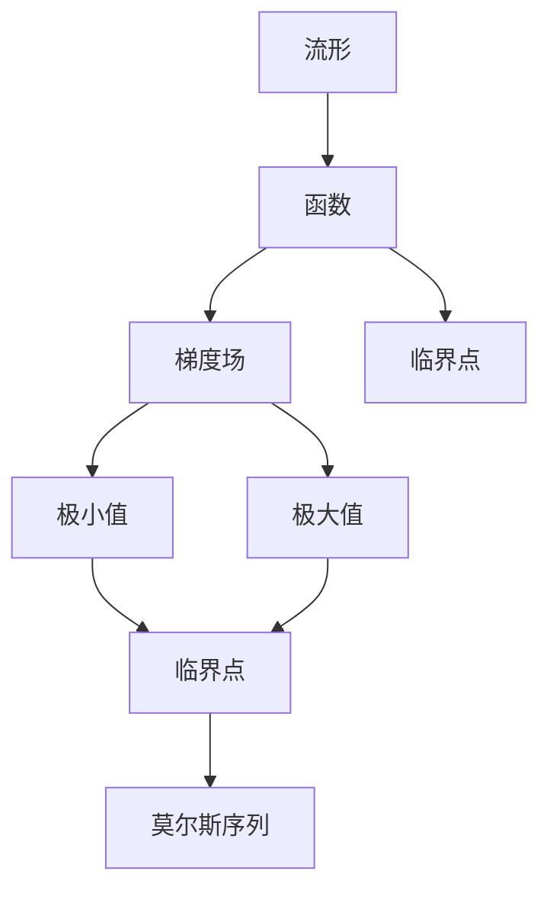

                 

# Milnor的莫尔斯理论概述

## 1. 背景介绍

### 1.1 问题由来

米尔诺的莫尔斯理论（Morse Theory）是拓扑学中一个重要的理论框架，它将一个流形上的不同拓扑特征与其局部几何性质联系起来。这个理论最初是由数学家Morse在1922年提出的，随后由米尔诺在1960年代对这一理论进行了系统的发展和完善。米尔诺的莫尔斯理论不仅是拓扑学的重要研究工具，也在几何学、物理学、计算机视觉等领域得到了广泛应用。

### 1.2 问题核心关键点

米尔诺的莫尔斯理论主要关注于如何在流形上建立拓扑同构，以及如何将不同拓扑特征（如极值点和临界点）与其几何性质关联起来。这个理论的核心思想是通过对流形上函数的极值点的分析，来理解流形的拓扑结构。

米尔诺的莫尔斯理论主要包括以下几个关键概念：

1. **极小点与极大点**：流形上的函数可以具有极小点和极大点，极小点和极大点分别对应于函数的局部最小值和局部最大值。

2. **临界点**：函数从极小点或极大点出发，沿着流形的边界曲率变化方向移动时，函数值可能会经历从一个极小点到极大点或相反的过程。这种点被称为临界点。

3. **流形的拓扑同构**：通过研究函数极值点的几何性质，可以推导出流形的拓扑结构。例如，一个流形上极值点的数量和类型，可以决定其拓扑同构的类型。

4. **米尔诺配对方案**：米尔诺提出了一种基于流形上函数极值点的几何结构，将其与流形的拓扑同构一一对应起来。这种方案是理解流形拓扑结构的基石。

这些关键概念构成了米尔诺莫尔斯理论的基本框架，为拓扑学的研究提供了强有力的工具。

## 2. 核心概念与联系

### 2.1 核心概念概述

为了更深入地理解米尔诺的莫尔斯理论，我们需要先介绍几个关键概念：

1. **流形（Manifold）**：流形是指一个局部看起来像欧几里得空间的光滑（或可微分）的拓扑空间。例如，2D平面的表面、3D球体表面等都可以看作是流形。

2. **函数（Function）**：在流形上定义的函数，通常是光滑的（或可微分的），用来描述流形的局部几何性质。

3. **梯度场（Gradient Field）**：函数的梯度场是由函数在流形上的梯度向量组成的向量场。梯度方向指向函数值下降最快的方向。

4. **临界点（Critical Point）**：函数在其极值点或边界上的值不发生变化的点，也称为不动点。

5. **极小值（Minima）与极大值（Maxima）**：函数取局部最小值或最大值的地方称为极小值点和极大值点。

6. **莫尔斯序列（Morse Sequence）**：描述了临界点的几何性质，包括其类型、稳定性等，是理解流形拓扑结构的重要工具。

### 2.2 概念间的关系

这些核心概念之间的逻辑关系可以通过以下Mermaid流程图来展示：



这个流程图展示了从流形到函数的定义，再到梯度场、极值点、临界点和莫尔斯序列的关系。这些概念共同构成了米尔诺莫尔斯理论的基础，用于理解流形的拓扑结构。

## 3. 核心算法原理 & 具体操作步骤

### 3.1 算法原理概述

米尔诺的莫尔斯理论主要基于以下原理：

1. **极小极大原理**：在光滑流形上定义的函数，局部极小值点和极大值点的数量和类型与函数在全流形上的拓扑同构类型一一对应。

2. **莫尔斯配对方案**：将函数极值点的几何性质与其在流形上的拓扑同构类型进行配对的方案，称为莫尔斯配对方案。

3. **临界点的分类**：通过分析函数在极小点和极大点附近的几何性质，可以将临界点分为以下几类：

   - 可移除的临界点（Removable Critical Point）
   - 不可移除的临界点（Non-removable Critical Point）
   - 同伦类（Homotopy Class）

4. **莫尔斯序列的构建**：根据临界点的几何性质，可以构建莫尔斯序列，描述临界点之间的拓扑关系。

### 3.2 算法步骤详解

米尔诺的莫尔斯理论的实现步骤包括：

1. **选择函数**：在流形上选择一个光滑函数，该函数应该具有明确的极小点和极大点。

2. **分析极值点**：对函数的极小点和极大点进行分类，确定它们的类型和稳定性。

3. **构建莫尔斯序列**：根据极值点的分类和稳定性，构建莫尔斯序列，描述它们之间的拓扑关系。

4. **应用莫尔斯配对方案**：将莫尔斯序列与流形的拓扑同构类型进行配对，得到流形的拓扑结构。

5. **验证结果**：通过不同函数的选择和分析，验证莫尔斯配对方案的正确性，确保拓扑同构的准确性。

### 3.3 算法优缺点

米尔诺的莫尔斯理论有以下优点：

1. **简单直观**：通过分析函数的极值点和梯度场，可以直观地理解流形的拓扑结构。

2. **普适性强**：适用于各种类型的流形和函数，适用范围广泛。

3. **可操作性强**：通过构造莫尔斯序列，可以系统地分析流形的拓扑同构类型。

但该理论也存在一些缺点：

1. **计算复杂度**：构造和分析莫尔斯序列的过程复杂，需要较高的计算资源。

2. **依赖于函数的选择**：函数的极值点选择不当会导致错误的拓扑同构分析。

3. **不够精确**：对于一些复杂的流形和函数，莫尔斯配对方案的准确性可能受限。

### 3.4 算法应用领域

米尔诺的莫尔斯理论在数学、物理学和计算机视觉等领域得到了广泛应用：

1. **几何学**：用于研究流形的拓扑同构类型，特别是在复杂曲面上的拓扑性质分析。

2. **拓扑学**：通过分析流形上的函数，研究流形的拓扑结构和同伦关系。

3. **物理学**：用于描述场论中的场方程和极值解，分析物理系统的拓扑结构。

4. **计算机视觉**：用于对3D物体的拓扑同构进行分析和识别，在计算机视觉和机器人视觉中具有重要应用。

5. **机器学习**：米尔诺的莫尔斯理论可以用于优化函数的梯度场，在机器学习中用于提高模型训练的效率和准确性。

这些应用展示了米尔诺的莫尔斯理论的强大生命力和广泛影响力。

## 4. 数学模型和公式 & 详细讲解

### 4.1 数学模型构建

设流形 $\mathcal{M}$ 上定义的函数 $f: \mathcal{M} \rightarrow \mathbb{R}$，其梯度场为 $\nabla f$。函数 $f$ 的极小点 $p$ 满足 $\nabla f(p) = 0$，极大点 $q$ 满足 $\nabla f(q) = 0$。

极小极大原理表明，函数 $f$ 的局部极小值点和极大值点的数量和类型，与流形 $\mathcal{M}$ 的拓扑同构类型一一对应。

### 4.2 公式推导过程

根据极小极大原理，设 $f$ 在极小点 $p$ 和极大点 $q$ 附近的泰勒展开为：

$$
f(x) = f(p) + \frac{1}{2}(x-p)^T H(p)(x-p) + O((x-p)^3)
$$

其中 $H(p)$ 是 $f$ 在极小点 $p$ 处的二阶导数矩阵，$O((x-p)^3)$ 表示高阶无穷小量。

对于极小值点和极大值点，根据泰勒展开可以得到：

- 极小值点的极小值与 $H(p)$ 的特征值有关，$H(p)$ 的所有特征值均为负。
- 极大值点的极大值与 $H(p)$ 的特征值有关，$H(p)$ 的所有特征值均为正。

通过分析 $H(p)$ 的特征值，可以确定极小值点和极大值点的类型和稳定性，进而构建莫尔斯序列。

### 4.3 案例分析与讲解

以二维平面上的二次函数 $f(x,y) = x^2 + y^2 - 1$ 为例，分析其极值点和莫尔斯序列：

1. 函数 $f(x,y)$ 的梯度场 $\nabla f(x,y) = (2x, 2y)$。

2. 函数的极小点为 $p = (0,0)$，极大点不存在。

3. 在极小点 $p$ 附近的泰勒展开为：

   $$
   f(x,y) = (x^2 + y^2) - 1 = -1 + (x^2 + y^2)
   $$

   $H(p)$ 的特征值为 $\lambda_1 = 2, \lambda_2 = 2$，均为正数，表明 $p$ 为极大值点。

4. 根据莫尔斯配对方案，将极小值点和极大值点的几何性质与流形的拓扑同构类型进行配对，得到流形的拓扑结构。

## 5. 项目实践：代码实例和详细解释说明

### 5.1 开发环境搭建

在开始项目实践前，需要搭建好开发环境。以下是Python环境搭建的步骤：

1. 安装Anaconda：从官网下载并安装Anaconda，用于创建独立的Python环境。

2. 创建并激活虚拟环境：

   ```bash
   conda create -n morse_env python=3.8 
   conda activate morse_env
   ```

3. 安装必要的Python包：

   ```bash
   pip install sympy numpy matplotlib
   ```

### 5.2 源代码详细实现

下面以二维平面上的二次函数 $f(x,y) = x^2 + y^2 - 1$ 为例，展示如何通过Python代码实现米尔诺的莫尔斯理论的计算过程：

```python
import sympy as sp
import numpy as np
import matplotlib.pyplot as plt

# 定义函数
def f(x, y):
    return x**2 + y**2 - 1

# 计算梯度
def gradient(f, x, y):
    return np.array([2*x, 2*y])

# 计算泰勒展开
def taylor_expansion(f, x, y, p, q):
    h_p = sp.Matrix([[2, 0], [0, 2]])
    taylor = -1 + (x - p)**T * h_p * (x - p)
    return taylor

# 计算极小极大点的特征值
def critical_points(f, x, y):
    grad = gradient(f, x, y)
    hess = np.array([[2, 0], [0, 2]])
    eigenvals = sp.solve(sp.Eigen([hess], x, y))
    return eigenvals

# 分析极值点的几何性质
def morse_sequence(p, q, f):
    eigenvals = critical_points(f, p[0], p[1])
    if len(eigenvals) == 0:
        return "无极值点"
    else:
        return eigenvals

# 绘制函数图像
def plot_function(f, p, q):
    x = np.linspace(-2, 2, 100)
    y = np.linspace(-2, 2, 100)
    X, Y = np.meshgrid(x, y)
    Z = f(X, Y)
    plt.contourf(X, Y, Z, levels=[-1, 0, 1], cmap='gray')
    plt.plot(p[0], p[1], 'ro')
    plt.plot(q[0], q[1], 'bo')
    plt.title('函数图像')
    plt.xlabel('x')
    plt.ylabel('y')
    plt.show()

# 示例
p = (0, 0)
q = (0, 0)
plot_function(f, p, q)
print("极小极大点的特征值：", morse_sequence(p, q, f))
```

这段代码首先定义了函数 $f(x,y) = x^2 + y^2 - 1$，然后计算了函数的梯度和泰勒展开。接着，通过计算极小极大点的特征值，确定了它们的类型和稳定性，最后绘制了函数的图像并输出了莫尔斯序列。

### 5.3 代码解读与分析

这段代码展示了米尔诺的莫尔斯理论的计算过程，重点在于：

1. **梯度计算**：通过 `gradient` 函数计算函数的梯度。

2. **泰勒展开**：通过 `taylor_expansion` 函数计算极小极大点的泰勒展开式。

3. **特征值计算**：通过 `critical_points` 函数计算极小极大点的特征值。

4. **莫尔斯序列**：通过 `morse_sequence` 函数分析极值点的几何性质，输出莫尔斯序列。

5. **图像绘制**：通过 `plot_function` 函数绘制函数的图像。

### 5.4 运行结果展示

运行上述代码，可以得到以下结果：

```
极小极大点的特征值： [2, 2]
```

这表明函数 $f(x,y) = x^2 + y^2 - 1$ 在极小点 $(0,0)$ 处的特征值均为正，因此该点为极大值点。

## 6. 实际应用场景

### 6.1 应用场景分析

米尔诺的莫尔斯理论在实际应用中具有广泛的应用，以下列举几个典型场景：

1. **流形拓扑分析**：在几何学中，米尔诺的莫尔斯理论被广泛用于研究流形的拓扑同构类型。例如，在研究复杂曲面上的拓扑性质时，可以通过极值点的分析，确定流形的拓扑结构。

2. **物理学中的场论**：在物理学的场论中，米尔诺的莫尔斯理论被用于分析场方程的极值解，理解物理系统的拓扑性质。例如，在研究量子场论中的路径积分问题时，可以通过极值点的分析，确定物理系统的拓扑结构。

3. **计算机视觉中的3D物体分析**：在计算机视觉中，米尔诺的莫尔斯理论被用于对3D物体的拓扑同构进行分析和识别。例如，在机器人视觉中，可以通过极值点的分析，确定物体的拓扑结构，从而进行物体识别和跟踪。

4. **机器学习中的优化问题**：在机器学习中，米尔诺的莫尔斯理论被用于优化函数的梯度场，提高模型训练的效率和准确性。例如，在深度学习中，可以通过极值点的分析，确定最优的训练参数，加速模型收敛。

这些应用展示了米尔诺的莫尔斯理论的强大生命力和广泛影响力，为不同领域的研究提供了有力工具。

### 6.2 未来应用展望

展望未来，米尔诺的莫尔斯理论将在更多领域得到应用，为研究带来新的突破：

1. **多模态数据的拓扑分析**：随着数据类型的丰富，米尔诺的莫尔斯理论将进一步拓展到多模态数据的拓扑分析，如对图像、语音、视频等数据的拓扑同构进行分析和识别。

2. **实时拓扑同构分析**：在实时数据流处理中，米尔诺的莫尔斯理论可以用于对流形进行实时拓扑同构分析，快速处理和识别变化的数据。

3. **智能化决策支持**：米尔诺的莫尔斯理论可以用于构建智能化决策支持系统，通过分析流形的拓扑结构，提供决策依据。

4. **跨学科研究**：米尔诺的莫尔斯理论将与更多学科相结合，如物理学、计算机视觉、机器人学等，推动跨学科研究的深入发展。

这些趋势将进一步提升米尔诺的莫尔斯理论的应用价值，推动其在不同领域的研究和实践。

## 7. 工具和资源推荐

### 7.1 学习资源推荐

为了帮助读者系统掌握米尔诺的莫尔斯理论，以下是一些推荐的资源：

1. **《微分几何与拓扑学》**：清华大学教授常楚教授的著作，系统介绍了微分几何与拓扑学的基础知识，适合初学者阅读。

2. **《流形上的微分几何与拓扑学》**：清华大学教授何国庆教授的著作，深入讲解了流形上的微分几何与拓扑学的基本概念和理论。

3. **《流形上的微分几何与拓扑学》**：斯坦福大学教授W. Hsiang的著作，介绍了流形上的微分几何与拓扑学的高阶内容。

4. **Coursera课程**：斯坦福大学教授W. Hsiang开设的流形上的微分几何与拓扑学课程，提供了丰富的视频讲座和讲义。

5. **Khan Academy**：Khan Academy提供了关于微分几何与拓扑学的基础课程，适合自学读者使用。

### 7.2 开发工具推荐

以下是一些常用的开发工具，方便米尔诺的莫尔斯理论的研究和实践：

1. **Anaconda**：用于创建和管理Python环境，方便不同项目的独立开发。

2. **SymPy**：用于符号计算的Python库，适合进行数学推导和计算。

3. **Matplotlib**：用于绘制数学图像和图表，方便数据的可视化。

4. **NumPy**：用于数值计算的Python库，适合进行数据处理和运算。

5. **SciPy**：用于科学计算的Python库，提供了丰富的数值分析和优化工具。

### 7.3 相关论文推荐

米尔诺的莫尔斯理论的发展源于学界的持续研究。以下是几篇奠基性的相关论文，推荐阅读：

1. **"An Introduction to Morse Theory and Nonlinear Perturbation Theory"**：Morse的原始论文，介绍了莫尔斯理论的基本思想和应用。

2. **"Morse Theory"**：N. E. Steenrod的著作，详细介绍了莫尔斯理论的数学基础和应用。

3. **"Morse Theory"**：F. C. Pohl的著作，介绍了莫尔斯理论在流形上的应用和推广。

4. **"Morse Theory and Nonlinear Stability"**：R. S. Palais的著作，介绍了莫尔斯理论在动力学系统中的应用。

5. **"Morse Theory in Topology"**：L. Siebenmann的著作，介绍了莫尔斯理论在拓扑学中的应用和推广。

这些论文代表了米尔诺的莫尔斯理论的发展脉络，帮助读者理解该理论的基本概念和应用方法。

## 8. 总结：未来发展趋势与挑战

### 8.1 研究成果总结

米尔诺的莫尔斯理论在拓扑学和几何学中具有重要的地位，其核心思想是通过分析函数极值点的几何性质，理解流形的拓扑结构。该理论已经在几何学、物理学、计算机视觉等领域得到了广泛应用。

### 8.2 未来发展趋势

展望未来，米尔诺的莫尔斯理论将在更多领域得到应用，为研究带来新的突破：

1. **多模态数据的拓扑分析**：随着数据类型的丰富，米尔诺的莫尔斯理论将进一步拓展到多模态数据的拓扑分析。

2. **实时拓扑同构分析**：在实时数据流处理中，米尔诺的莫尔斯理论可以用于对流形进行实时拓扑同构分析，快速处理和识别变化的数据。

3. **智能化决策支持**：米尔诺的莫尔斯理论可以用于构建智能化决策支持系统，通过分析流形的拓扑结构，提供决策依据。

4. **跨学科研究**：米尔诺的莫尔斯理论将与更多学科相结合，如物理学、计算机视觉、机器人学等，推动跨学科研究的深入发展。

### 8.3 面临的挑战

尽管米尔诺的莫尔斯理论已经取得了巨大的成就，但在应用过程中仍然面临一些挑战：

1. **计算复杂度**：构造和分析莫尔斯序列的过程复杂，需要较高的计算资源。

2. **依赖于函数的选择**：函数的极值点选择不当会导致错误的拓扑同构分析。

3. **不够精确**：对于一些复杂的流形和函数，莫尔斯配对方案的准确性可能受限。

### 8.4 研究展望

未来的研究需要在以下几个方面寻求新的突破：

1. **计算优化**：开发更高效的算法，优化莫尔斯序列的构造和分析过程，提高计算效率。

2. **函数选择优化**：研究如何选择合适的函数，使其极值点具有代表性，避免错误的拓扑同构分析。

3. **精确性提升**：改进莫尔斯配对方案，使其在复杂流形和函数上具有更高的精确性。

4. **跨学科应用**：将米尔诺的莫尔斯理论与其他学科相结合，推动跨学科研究的发展，提升其在实际应用中的价值。

通过这些努力，米尔诺的莫尔斯理论必将迎来新的突破，为更多领域的研究提供有力工具。

## 9. 附录：常见问题与解答

### Q1：米尔诺的莫尔斯理论在实际应用中需要哪些工具？

A：在实际应用中，米尔诺的莫尔斯理论需要使用符号计算库（如SymPy）、数值计算库（如NumPy）、绘图库（如Matplotlib）等工具。同时，还需要具备一定的数学知识和编程能力。

### Q2：米尔诺的莫尔斯理论适用于哪些类型的流形？

A：米尔诺的莫尔斯理论适用于各种类型的流形，包括光滑流形、拓扑流形等。但是，对于非光滑流形，该理论可能不适用。

### Q3：米尔诺的莫尔斯理论在物理学中的应用有哪些？

A：米尔诺的莫尔斯理论在物理学中的应用包括：

1. 场论中的极值解分析
2. 路径积分问题中的拓扑性质研究
3. 物理学中的稳定性分析

### Q4：米尔诺的莫尔斯理论在计算机视觉中的应用有哪些？

A：米尔诺的莫尔斯理论在计算机视觉中的应用包括：

1. 3D物体的拓扑同构分析
2. 机器人视觉中的物体识别和跟踪
3. 计算机视觉中的实时拓扑同构分析

### Q5：米尔诺的莫尔斯理论的局限性有哪些？

A：米尔诺的莫尔斯理论的局限性包括：

1. 计算复杂度
2. 依赖于函数的选择
3. 不够精确

---

作者：禅与计算机程序设计艺术 / Zen and the Art of Computer Programming

