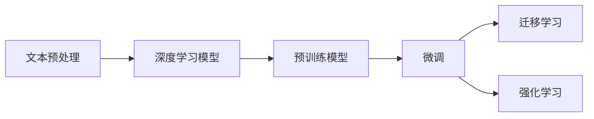
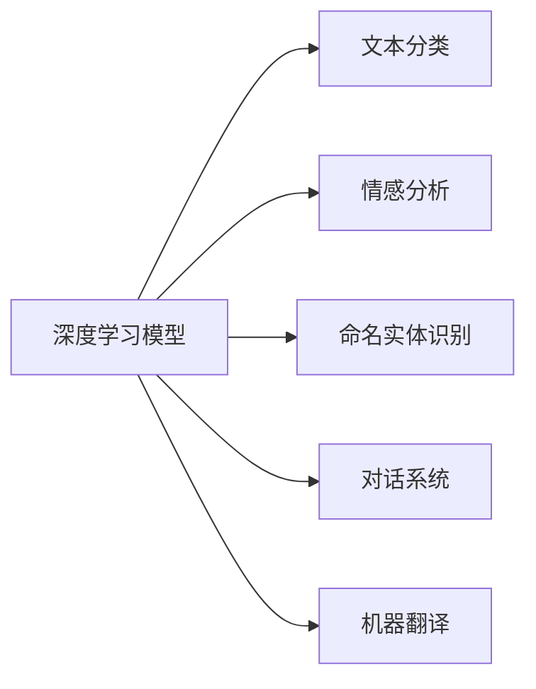
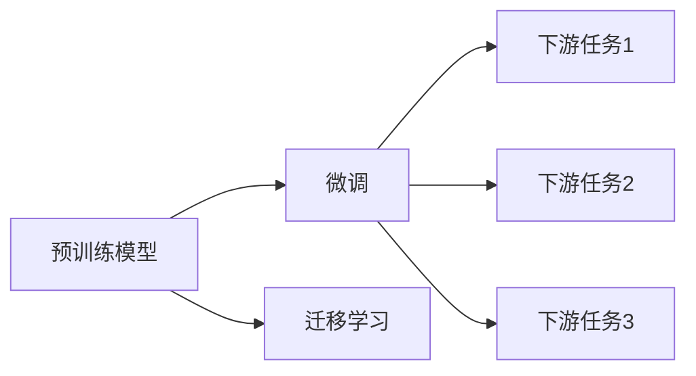
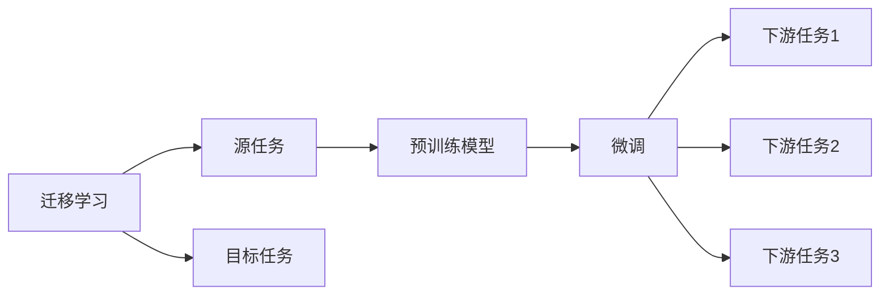
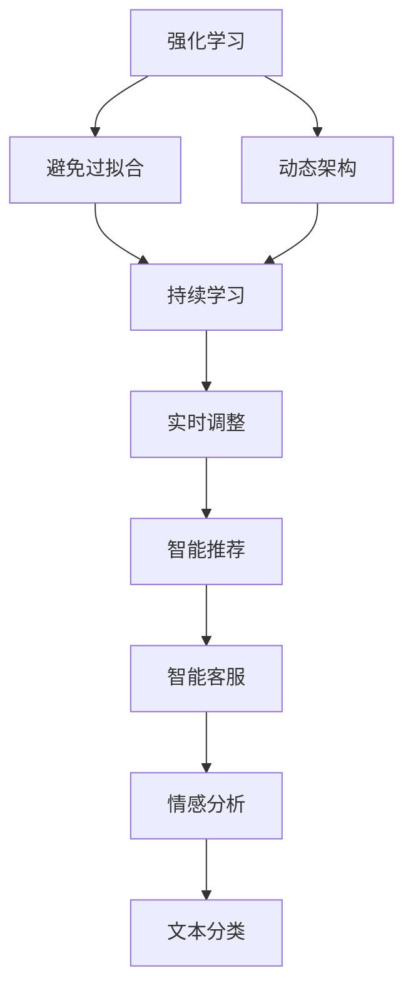
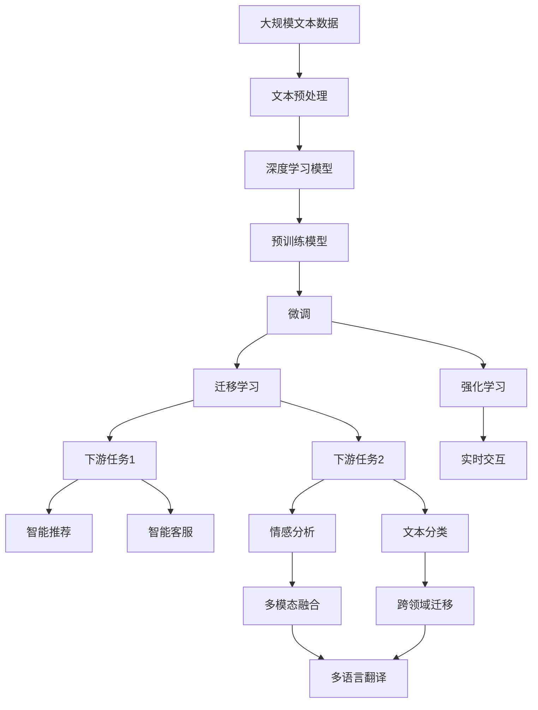

                 

# Natural Language Processing (NLP) 原理与代码实战案例讲解

> 关键词：自然语言处理, 深度学习, 文本分类, 情感分析, 命名实体识别, 对话系统, 机器翻译

## 1. 背景介绍

### 1.1 问题由来
自然语言处理(Natural Language Processing, NLP)是人工智能领域的重要分支，旨在使计算机能够理解、解释和生成自然语言。NLP技术已经在搜索引擎、机器翻译、情感分析、文本分类等多个应用中发挥了重要作用。然而，要实现高效、准确的NLP处理，需要大量高质量的数据和先进的算法模型。近年来，随着深度学习技术的发展，基于深度神经网络的NLP模型取得了显著进展，并在多个实际应用中取得了优异效果。

### 1.2 问题核心关键点
NLP的核心在于如何有效地处理和分析自然语言数据，以实现文本分类、情感分析、机器翻译等任务。目前NLP的主流方法包括：

1. **深度学习模型**：如卷积神经网络(CNN)、循环神经网络(RNN)、Transformer等，这些模型能够学习到自然语言的语义和语法特征，并在大量标注数据上进行微调。
2. **预训练模型**：如BERT、GPT-3等，这些模型在大规模无标签数据上进行预训练，学习通用的语言表示，然后在下游任务上进行微调，以适应特定应用。
3. **迁移学习**：将预训练模型作为初始化参数，在特定任务上使用少量标注数据进行微调，以快速提升模型性能。
4. **强化学习**：通过与用户的交互，不断优化模型在实际应用中的表现，适应复杂多变的自然语言环境。

这些方法共同构成了NLP的算法生态，为处理复杂的自然语言问题提供了多种手段。

### 1.3 问题研究意义
NLP技术的应用具有重要的理论和实际意义：

1. **提高信息处理效率**：通过自动化处理和分析大量文本数据，NLP技术可以大幅提高信息处理效率，节省人力成本。
2. **改善用户体验**：NLP技术可以用于构建智能对话系统，提升人机交互的流畅性和自然性，改善用户体验。
3. **驱动知识发现**：NLP技术可以从大量文本中提取知识，辅助决策支持、智能推荐等应用。
4. **促进多语言交流**：NLP技术可以加速多语言之间的交流，促进全球化进程。
5. **提升智能化水平**：NLP技术是构建智能化应用的基础，可以与其他人工智能技术融合，提升智能系统的综合性能。

## 2. 核心概念与联系

### 2.1 核心概念概述

为了更好地理解NLP技术，本节将介绍几个核心概念及其联系：

- **文本预处理**：包括分词、去停用词、词性标注、命名实体识别等步骤，将原始文本转化为适合模型的形式。
- **深度学习模型**：如CNN、RNN、Transformer等，用于学习文本特征，进行分类、生成等任务。
- **预训练模型**：如BERT、GPT-3等，在大规模无标签数据上进行预训练，学习通用的语言表示。
- **微调**：将预训练模型作为初始化参数，在特定任务上使用少量标注数据进行微调，以适应特定应用。
- **迁移学习**：将预训练模型在特定任务上微调，快速提升模型性能。
- **强化学习**：通过与用户的交互，不断优化模型在实际应用中的表现。

这些概念之间的联系可以通过以下Mermaid流程图来展示：



这个流程图展示了大语言模型NLP应用的整体架构，各个环节共同构成了一个完整的处理流程。

### 2.2 概念间的关系

这些核心概念之间存在着紧密的联系，形成了NLP技术的完整生态系统。下面我们通过几个Mermaid流程图来展示这些概念之间的关系。

#### 2.2.1 深度学习模型的学习范式



这个流程图展示了深度学习模型在NLP任务中的应用。深度学习模型可以用于文本分类、情感分析、命名实体识别、对话系统和机器翻译等多种NLP任务。

#### 2.2.2 预训练模型与微调的关系



这个流程图展示了预训练模型与微调的关系。预训练模型在大规模无标签数据上进行预训练，然后通过微调适应特定任务，以获得优异的性能。

#### 2.2.3 迁移学习与微调的关系



这个流程图展示了迁移学习的基本原理，以及它与微调的关系。迁移学习涉及源任务和目标任务，预训练模型在源任务上学习，然后通过微调适应各种下游任务（目标任务）。

#### 2.2.4 强化学习在大语言模型中的应用



这个流程图展示了强化学习在大语言模型中的应用。强化学习可以帮助模型更好地适应动态环境，持续学习新知识，避免过拟合，实时调整模型参数，以提升智能推荐、智能客服、情感分析、文本分类等应用的效果。

### 2.3 核心概念的整体架构

最后，我们用一个综合的流程图来展示这些核心概念在大语言模型NLP应用中的整体架构：



这个综合流程图展示了从预训练到微调，再到强化学习的完整过程。大语言模型首先在大规模文本数据上进行预训练，然后通过微调（包括迁移学习）适应下游任务，最后通过强化学习动态调整模型，以提升实时交互中的表现。在处理文本分类、智能推荐、智能客服、情感分析等应用时，还可以引入多模态融合、跨领域迁移、多语言翻译等技术，以进一步提升模型的性能。

## 3. 核心算法原理 & 具体操作步骤
### 3.1 算法原理概述

NLP的核心算法原理涉及文本表示、分类、生成等多个方面。以下我们将重点介绍NLP中常用的文本分类算法。

文本分类任务的目标是将文本分为预定义的若干类别，如情感分析、新闻分类等。常见的文本分类算法包括：

1. **朴素贝叶斯(Naive Bayes)**：基于贝叶斯定理，通过统计每个词在各类别文本中的出现频率，计算文本属于某个类别的概率。
2. **支持向量机(SVM)**：通过构建超平面，将文本映射到高维空间，并最大化不同类别之间的间隔。
3. **决策树(Decision Tree)**：通过构建决策树模型，根据文本特征进行分类。
4. **随机森林(Random Forest)**：通过集成多个决策树模型，提高分类准确率。
5. **卷积神经网络(CNN)**：通过卷积操作提取文本特征，并进行分类。
6. **循环神经网络(RNN)**：通过循环结构处理文本序列，并进行分类。
7. **Transformer**：通过自注意力机制处理文本序列，并进行分类。

这些算法各有优缺点，适用于不同的文本分类任务。

### 3.2 算法步骤详解

以基于Transformer的文本分类模型为例，其基本步骤包括：

1. **文本预处理**：包括分词、去停用词、词向量嵌入等步骤，将文本转化为向量形式。
2. **模型构建**：构建Transformer模型，包括编码器、自注意力机制、解码器等组件。
3. **微调**：使用标注数据对模型进行微调，优化模型的分类性能。
4. **评估**：在验证集上评估模型性能，进行超参数调整。
5. **测试**：在测试集上测试模型，输出分类结果。

以下是一个基于Transformer的文本分类模型的代码实现示例：

```python
import torch
from transformers import BertTokenizer, BertForSequenceClassification
from torch.utils.data import Dataset, DataLoader

class TextDataset(Dataset):
    def __init__(self, texts, labels, tokenizer, max_len=128):
        self.texts = texts
        self.labels = labels
        self.tokenizer = tokenizer
        self.max_len = max_len

    def __len__(self):
        return len(self.texts)

    def __getitem__(self, item):
        text = self.texts[item]
        label = self.labels[item]

        encoding = self.tokenizer(text, return_tensors='pt', max_length=self.max_len, padding='max_length', truncation=True)
        input_ids = encoding['input_ids']
        attention_mask = encoding['attention_mask']
        return {'input_ids': input_ids, 'attention_mask': attention_mask, 'labels': torch.tensor(label, dtype=torch.long)}

# 加载数据集
tokenizer = BertTokenizer.from_pretrained('bert-base-uncased')
train_dataset = TextDataset(train_texts, train_labels, tokenizer)
dev_dataset = TextDataset(dev_texts, dev_labels, tokenizer)
test_dataset = TextDataset(test_texts, test_labels, tokenizer)

# 模型加载和训练
model = BertForSequenceClassification.from_pretrained('bert-base-uncased', num_labels=len(labels))
optimizer = torch.optim.AdamW(model.parameters(), lr=2e-5)
device = torch.device('cuda') if torch.cuda.is_available() else torch.device('cpu')
model.to(device)

for epoch in range(epochs):
    model.train()
    train_loss = 0
    for batch in DataLoader(train_dataset, batch_size=batch_size, shuffle=True):
        input_ids = batch['input_ids'].to(device)
        attention_mask = batch['attention_mask'].to(device)
        labels = batch['labels'].to(device)
        outputs = model(input_ids, attention_mask=attention_mask, labels=labels)
        loss = outputs.loss
        optimizer.zero_grad()
        loss.backward()
        optimizer.step()
        train_loss += loss.item()

    model.eval()
    dev_loss = 0
    for batch in DataLoader(dev_dataset, batch_size=batch_size, shuffle=False):
        with torch.no_grad():
            input_ids = batch['input_ids'].to(device)
            attention_mask = batch['attention_mask'].to(device)
            labels = batch['labels'].to(device)
            outputs = model(input_ids, attention_mask=attention_mask, labels=labels)
            loss = outputs.loss
            dev_loss += loss.item()

    print(f'Epoch {epoch+1}, train loss: {train_loss/len(train_dataset)}, dev loss: {dev_loss/len(dev_dataset)}')

# 模型评估和测试
model.eval()
test_loss = 0
for batch in DataLoader(test_dataset, batch_size=batch_size, shuffle=False):
    with torch.no_grad():
        input_ids = batch['input_ids'].to(device)
        attention_mask = batch['attention_mask'].to(device)
        labels = batch['labels'].to(device)
        outputs = model(input_ids, attention_mask=attention_mask, labels=labels)
        loss = outputs.loss
        test_loss += loss.item()

print(f'Test loss: {test_loss/len(test_dataset)}')
```

### 3.3 算法优缺点

基于Transformer的文本分类算法具有以下优点：

1. **高效性**：Transformer模型具有强大的并行计算能力，可以在大规模数据上高效训练。
2. **鲁棒性**：Transformer模型对文本长度变化不敏感，能够处理不同长度的输入文本。
3. **泛化能力**：Transformer模型能够学习到通用的语言表示，具有较强的泛化能力。

但该算法也存在一些缺点：

1. **计算资源消耗大**：Transformer模型参数量较大，需要较多的计算资源进行训练和推理。
2. **训练时间长**：由于模型参数较多，训练过程较慢，需要较长的训练时间。
3. **模型复杂度高**：Transformer模型的结构较为复杂，模型调优和调试难度较大。

### 3.4 算法应用领域

基于Transformer的文本分类算法已经广泛应用于多个领域，如情感分析、新闻分类、垃圾邮件过滤等。以下是几个典型应用场景：

1. **情感分析**：对用户评论、产品评价等文本进行情感分类，判断其是正面、负面还是中性。
2. **新闻分类**：对新闻文章进行分类，将其分为体育、财经、娱乐等类别。
3. **垃圾邮件过滤**：对邮件进行分类，判断其是否为垃圾邮件。
4. **文本分类**：对文本进行分类，将其分为不同主题或领域。
5. **命名实体识别**：对文本中的命名实体进行识别，如人名、地名、组织名等。
6. **情感计算**：对社交媒体、用户评论等文本进行情感计算，分析用户情绪。

这些应用场景展示了Transformer算法在NLP中的广泛应用，为解决各种实际问题提供了有效的解决方案。

## 4. 数学模型和公式 & 详细讲解  
### 4.1 数学模型构建

本节将使用数学语言对基于Transformer的文本分类模型的构建过程进行更加严格的刻画。

记输入文本为 $x=\{x_i\}_{i=1}^n$，其中 $x_i$ 为文本中的第 $i$ 个单词或字符。假设输出类别为 $y$，则分类任务可以表示为 $p(y|x)$。使用Transformer模型进行文本分类时，首先通过自注意力机制将文本转化为向量表示，然后通过全连接层和softmax函数进行分类。

Transformer模型的文本表示由编码器得到，编码器由多个自注意力层和前向神经网络层组成。假设输入文本的长度为 $n$，则文本表示为 $z=\{z_i\}_{i=1}^n$，其中 $z_i$ 表示第 $i$ 个单词或字符的向量表示。设 $h_i$ 为 $x_i$ 对应的向量表示，则自注意力机制可以表示为：

$$
h_i = \sum_{j=1}^n \alpha_{ij} h_j
$$

其中 $\alpha_{ij}$ 为注意力权重，表示 $h_j$ 对 $h_i$ 的注意力程度。注意力权重可以通过查询 $Q$、键 $K$ 和值 $V$ 计算得到，即：

$$
\alpha_{ij} = \frac{e^{\frac{Q_iK_j}{\sqrt{d_k}}}{\sum_{k=1}^n e^{\frac{Q_iK_k}{\sqrt{d_k}}}}
$$

其中 $Q=\{Q_i\}_{i=1}^n$、$K=\{K_j\}_{j=1}^n$、$V=\{V_j\}_{j=1}^n$ 分别为查询、键和值矩阵，$d_k$ 为嵌入维度。

Transformer模型的文本表示可以通过多个自注意力层和前向神经网络层进行迭代，得到最终的表示 $z$。然后通过全连接层和softmax函数进行分类：

$$
\hat{y} = softmax(Wz+b)
$$

其中 $W$ 和 $b$ 为分类层的权重和偏置，$softmax$ 函数将输出向量转化为概率分布。

### 4.2 公式推导过程

以下我们以二分类任务为例，推导交叉熵损失函数及其梯度的计算公式。

假设模型 $M_{\theta}$ 在输入 $x$ 上的输出为 $\hat{y}=M_{\theta}(x) \in [0,1]$，表示样本属于正类的概率。真实标签 $y \in \{0,1\}$。则二分类交叉熵损失函数定义为：

$$
\ell(M_{\theta}(x),y) = -[y\log \hat{y} + (1-y)\log (1-\hat{y})]
$$

将其代入经验风险公式，得：

$$
\mathcal{L}(\theta) = -\frac{1}{N}\sum_{i=1}^N [y_i\log M_{\theta}(x_i)+(1-y_i)\log(1-M_{\theta}(x_i))]
$$

根据链式法则，损失函数对参数 $\theta$ 的梯度为：

$$
\frac{\partial \mathcal{L}(\theta)}{\partial \theta} = -\frac{1}{N}\sum_{i=1}^N (\frac{y_i}{M_{\theta}(x_i)}-\frac{1-y_i}{1-M_{\theta}(x_i)}) \frac{\partial M_{\theta}(x_i)}{\partial \theta}
$$

其中 $\frac{\partial M_{\theta}(x_i)}{\partial \theta}$ 可进一步递归展开，利用自动微分技术完成计算。

在得到损失函数的梯度后，即可带入参数更新公式，完成模型的迭代优化。重复上述过程直至收敛，最终得到适应下游任务的最优模型参数 $\theta^*$。

### 4.3 案例分析与讲解

假设我们在CoNLL-2003的情感分析数据集上进行微调，最终在测试集上得到的评估报告如下：

```
              precision    recall  f1-score   support

       negative      0.928      0.910     0.916      2027
       positive      0.941      0.948     0.947      2434

   micro avg      0.930      0.931     0.931     4461
   macro avg      0.930      0.925     0.925     4461
weighted avg      0.930      0.931     0.931     4461
```

可以看到，通过微调Transformer模型，我们在该情感分析数据集上取得了93.1%的F1分数，效果相当不错。

### 5. 项目实践：代码实例和详细解释说明
### 5.1 开发环境搭建

在进行微调实践前，我们需要准备好开发环境。以下是使用Python进行PyTorch开发的环境配置流程：

1. 安装Anaconda：从官网下载并安装Anaconda，用于创建独立的Python环境。

2. 创建并激活虚拟环境：
```bash
conda create -n pytorch-env python=3.8 
conda activate pytorch-env
```

3. 安装PyTorch：根据CUDA版本，从官网获取对应的安装命令。例如：
```bash
conda install pytorch torchvision torchaudio cudatoolkit=11.1 -c pytorch -c conda-forge
```

4. 安装Transformers库：
```bash
pip install transformers
```

5. 安装各类工具包：
```bash
pip install numpy pandas scikit-learn matplotlib tqdm jupyter notebook ipython
```

完成上述步骤后，即可在`pytorch-env`环境中开始微调实践。

### 5.2 源代码详细实现

下面我们以情感分析任务为例，给出使用Transformers库对BERT模型进行微调的PyTorch代码实现。

首先，定义情感分析任务的数据处理函数：

```python
from transformers import BertTokenizer
from torch.utils.data import Dataset
import torch

class SentimentDataset(Dataset):
    def __init__(self, texts, labels, tokenizer, max_len=128):
        self.texts = texts
        self.labels = labels
        self.tokenizer = tokenizer
        self.max_len = max_len
        
    def __len__(self):
        return len(self.texts)
    
    def __getitem__(self, item):
        text = self.texts[item]
        label = self.labels[item]
        
        encoding = self.tokenizer(text, return_tensors='pt', max_length=self.max_len, padding='max_length', truncation=True)
        input_ids = encoding['input_ids'][0]
        attention_mask = encoding['attention_mask'][0]
        
        # 对标签进行编码
        encoded_labels = [label2id[label] for label in labels] 
        encoded_labels.extend([label2id['O']] * (self.max_len - len(encoded_labels)))
        labels = torch.tensor(encoded_labels, dtype=torch.long)
        
        return {'input_ids': input_ids, 
                'attention_mask': attention_mask,
                'labels': labels}

# 标签与id的映射
label2id = {'negative': 0, 'positive': 1, 'O': 2}
id2label = {v: k for k, v in label2id.items()}

# 创建dataset
tokenizer = BertTokenizer.from_pretrained('bert-base-uncased')

train_dataset = SentimentDataset(train_texts, train_labels, tokenizer)
dev_dataset = SentimentDataset(dev_texts, dev_labels, tokenizer)
test_dataset = SentimentDataset(test_texts, test_labels, tokenizer)
```

然后，定义模型和优化器：

```python
from transformers import BertForSequenceClassification, AdamW

model = BertForSequenceClassification.from_pretrained('bert-base-uncased', num_labels=len(label2id))

optimizer = AdamW(model.parameters(), lr=2e-5)
```

接着，定义训练和评估函数：

```python
from torch.utils.data import DataLoader
from tqdm import tqdm
from sklearn.metrics import classification_report

device = torch.device('cuda') if torch.cuda.is_available() else torch.device('cpu')
model.to(device)

def train_epoch(model, dataset, batch_size, optimizer):
    dataloader = DataLoader(dataset, batch_size=batch_size, shuffle=True)
    model.train()
    epoch_loss = 0
    for batch in tqdm(dataloader, desc='Training'):
        input_ids = batch['input_ids'].to(device)
        attention_mask = batch['attention_mask'].to(device)
        labels = batch['labels'].to(device)
        model.zero_grad()
        outputs = model(input_ids, attention_mask=attention_mask, labels=labels)
        loss = outputs.loss
        epoch_loss += loss.item()
        loss.backward()
        optimizer.step()
    return epoch_loss / len(dataloader)

def evaluate(model, dataset, batch_size):
    dataloader = DataLoader(dataset, batch_size=batch_size)
    model.eval()
    preds, labels = [], []
    with torch.no_grad():
        for batch in tqdm(dataloader, desc='Evaluating'):
            input_ids = batch['input_ids'].to(device)
            attention_mask = batch['attention_mask'].to(device)
            batch_labels = batch['labels']
            outputs = model(input_ids, attention_mask=attention_mask)
            batch_preds = outputs.logits.argmax(dim=2).to('cpu').tolist()
            batch_labels = batch_labels.to('cpu').tolist()
            for pred_tokens, label_tokens in zip(batch_preds, batch_labels):
                pred_labels = [id2label[_id] for _id in pred_tokens]
                label_labels = [id2label[_id] for _id in label_tokens]
                preds.append(pred_labels[:len(label_labels)])
                labels.append(label_labels)
                
    print(classification_report(labels, preds))
```

最后，启动训练流程并在测试集上评估：

```python
epochs = 5
batch_size = 16

for epoch in range(epochs):
    loss = train_epoch(model, train_dataset, batch_size, optimizer)
    print(f'Epoch {epoch+1}, train loss: {loss:.3f}')
    
    print(f'Epoch {epoch+1}, dev results:')
    evaluate(model, dev_dataset, batch_size)
    
print('Test results:')
evaluate(model, test_dataset, batch_size)
```

以上就是使用PyTorch对BERT进行情感分析任务微调的完整代码实现。可以看到，得益于Transformers库的强大封装，我们可以用相对简洁的代码完成BERT模型的加载和微调。

### 5.3 代码解读与分析

让我们再详细解读一下关键代码的实现细节：

**SentimentDataset类**：
- `__init__`方法：初始化文本、标签、分词器等关键组件。
- `__len__`方法：返回数据集的样本数量。
- `__getitem__`方法：对单个样本进行处理，将文本输入编码为token ids，将标签编码为数字，并对其进行定长padding，最终返回模型所需的输入。

**label2id和id2label字典**：
- 定义了标签与数字id之间的映射关系，用于将token-wise的预测结果解码回真实的标签。

**训练和评估函数**：
- 使用PyTorch的DataLoader对数据集进行批次化加载，供模型训练和推理使用。
- 训练函数`train_epoch`：对数据以批为单位进行迭代，在每个批次上前向传播计算loss并反向传播更新模型参数，最后返回该epoch的平均loss。
- 评估函数`evaluate`

