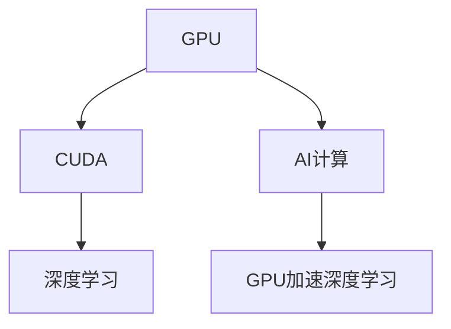
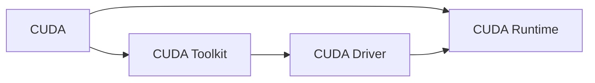
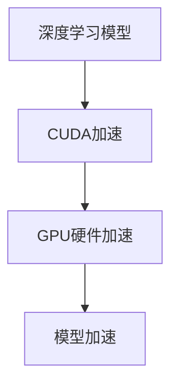
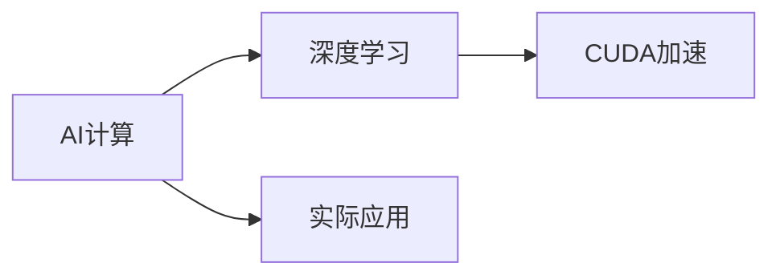
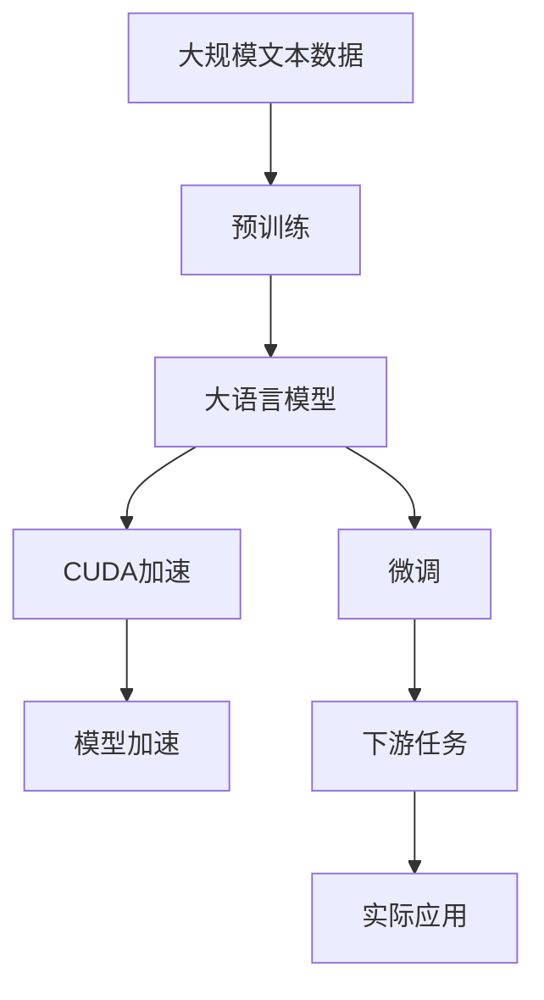

                 

# Nvidia的GPU与AI发展的关系

## 1. 背景介绍

### 1.1 问题由来
在人工智能（AI）迅猛发展的今天，GPU（图形处理器）与AI的结合已经成为了推动AI进步的核心驱动力。Nvidia作为全球领先的GPU制造商，其GPU在AI计算中的应用尤为突出。GPU与AI的结合，不仅提升了AI训练和推理的速度，还极大地降低了计算成本，推动了AI技术的广泛应用。本文将深入探讨Nvidia的GPU与AI发展的关系，分析GPU在AI计算中的关键作用，并展望未来AI与GPU结合的发展趋势。

### 1.2 问题核心关键点
Nvidia的GPU与AI结合的关键在于GPU的高并行计算能力与AI模型的计算密集型特征之间的完美契合。通过将深度学习算法移植到GPU上，Nvidia成功地将复杂的神经网络模型训练与推理速度提升了数倍，极大地加速了AI模型的开发与部署。此外，Nvidia的CUDA（Compute Unified Device Architecture）平台为开发者提供了丰富的API和工具支持，简化了GPU编程复杂度，推动了AI应用的普及与创新。

## 2. 核心概念与联系

### 2.1 核心概念概述

为更好地理解Nvidia的GPU与AI发展的关系，本节将介绍几个密切相关的核心概念：

- GPU（图形处理器）：一种并行计算硬件，能够同时处理多个计算任务，特别适用于图形渲染和科学计算。
- CUDA：Nvidia推出的并行计算平台，提供了高效编程模型和优化工具，支持C/C++和Python等语言。
- AI计算：人工智能算法在计算密集型任务中的应用，包括深度学习、机器学习、计算机视觉等。
- 深度学习：一种基于神经网络的机器学习方法，通过多层非线性变换，实现复杂的模式识别和预测任务。
- GPU加速深度学习：利用GPU的高并行计算能力，加速深度学习模型的训练与推理过程。

这些核心概念之间的逻辑关系可以通过以下Mermaid流程图来展示：



这个流程图展示了大语言模型的核心概念及其之间的关系：GPU提供并行计算能力，CUDA提供高效编程支持，AI计算则通过深度学习等算法实现了其在实际应用中的价值，而GPU加速深度学习则将这一过程进一步加速和优化。

### 2.2 概念间的关系

这些核心概念之间存在着紧密的联系，形成了Nvidia的GPU与AI结合的完整生态系统。下面我通过几个Mermaid流程图来展示这些概念之间的关系。

#### 2.2.1 CUDA平台的构成



这个流程图展示了CUDA平台的构成，CUDA Toolkit提供了API和开发工具，CUDA Driver实现了与硬件的通信，CUDA Runtime则提供了计算和内存管理功能。

#### 2.2.2 GPU加速深度学习过程



这个流程图展示了GPU加速深度学习的基本过程，通过CUDA平台的优化，深度学习模型在GPU上的计算过程得以加速。

#### 2.2.3 AI计算的落地应用



这个流程图展示了AI计算的落地应用过程，通过CUDA加速的深度学习模型，AI计算技术得以在实际应用中发挥作用。

### 2.3 核心概念的整体架构

最后，我们用一个综合的流程图来展示这些核心概念在大语言模型微调过程中的整体架构：



这个综合流程图展示了从预训练到微调，再到实际应用的全过程。大语言模型首先在大规模文本数据上进行预训练，然后通过CUDA加速进行微调，最终在实际应用中发挥作用。

## 3. 核心算法原理 & 具体操作步骤
### 3.1 算法原理概述

Nvidia的GPU与AI结合的核心在于GPU的高并行计算能力和CUDA平台的优化。通过将深度学习算法移植到GPU上，Nvidia实现了AI模型训练和推理的加速。这种结合方式的关键在于：

1. GPU的高并行计算能力：GPU的并行处理单元（Stream Processors）能够同时处理大量的计算任务，从而大幅提升计算速度。
2. CUDA平台的优化：CUDA提供了高效的编程模型和优化工具，简化了GPU编程复杂度，加速了模型的训练与推理过程。

### 3.2 算法步骤详解

基于Nvidia的GPU与AI结合，AI模型训练与推理的过程可以分为以下几个关键步骤：

**Step 1: 数据准备与预处理**
- 收集和标注大规模的训练数据集，确保数据的多样性和质量。
- 对数据进行预处理，包括数据清洗、归一化、分片等操作，以适应GPU并行计算的要求。

**Step 2: 模型定义与编译**
- 使用深度学习框架（如TensorFlow、PyTorch等）定义深度学习模型结构。
- 将模型编译为GPU加速版本，使用CUDA编程语言实现模型各层的计算逻辑。

**Step 3: 训练与优化**
- 在GPU上运行训练过程，使用CUDA Toolkit提供的优化工具，如CUDNN库，加速模型的训练。
- 在训练过程中，使用CUDA提供的CUDA Parallel Library（CUDA Parallel Library）和CUDA Toolkit中的优化工具，进行模型参数的优化，包括学习率调整、正则化等。

**Step 4: 推理与部署**
- 在GPU上运行推理过程，使用CUDA Toolkit提供的推理库（如CUDA Graph），加速模型的推理。
- 将训练好的模型部署到目标平台，实现实际应用。

### 3.3 算法优缺点

Nvidia的GPU与AI结合方法具有以下优点：
1. 加速计算：通过GPU的高并行计算能力，显著提升了AI模型的训练和推理速度，缩短了开发周期。
2. 降低成本：GPU的并行计算能力减少了单次计算的成本，使得大规模模型训练成为可能。
3. 优化工具丰富：CUDA平台提供了多种优化工具和库，简化了GPU编程复杂度，提高了开发效率。

然而，该方法也存在以下缺点：
1. 能耗高：大规模GPU集群需要大量电力支持，增加了系统的能耗成本。
2. 维护复杂：GPU硬件和CUDA平台维护复杂，需要专业知识和经验。
3. 硬件依赖：Nvidia的GPU和CUDA平台存在一定的硬件依赖，更换其他硬件平台需要重新适配。

### 3.4 算法应用领域

Nvidia的GPU与AI结合方法在以下领域得到了广泛应用：

1. **计算机视觉**：图像分类、目标检测、图像分割等任务，通过GPU加速深度学习模型，大幅提升了计算速度和精度。
2. **自然语言处理**：机器翻译、文本生成、情感分析等任务，通过GPU加速深度学习模型，提高了模型的训练速度和效果。
3. **语音识别**：语音转文字、语音合成等任务，通过GPU加速深度学习模型，提升了模型的实时处理能力。
4. **推荐系统**：商品推荐、用户行为预测等任务，通过GPU加速深度学习模型，优化了推荐效果和速度。
5. **自动驾驶**：通过GPU加速深度学习模型，提高了自动驾驶系统的实时处理能力和决策速度。

## 4. 数学模型和公式 & 详细讲解  
### 4.1 数学模型构建

在Nvidia的GPU与AI结合方法中，深度学习模型的训练与推理过程可以通过数学模型进行建模。以下是基于CUDA加速的深度学习模型的数学模型构建：

设深度学习模型为 $f_{\theta}(x)$，其中 $x$ 为输入数据，$\theta$ 为模型参数。在CUDA平台上，模型的训练与推理过程可以表示为：

$$
\begin{aligned}
&\min_{\theta} \mathcal{L}(\theta) \\
&\mathcal{L}(\theta) = \frac{1}{N}\sum_{i=1}^{N} \ell(f_{\theta}(x_i), y_i)
\end{aligned}
$$

其中，$\ell$ 为损失函数，$y_i$ 为标签数据。

在CUDA平台上，模型的前向传播和反向传播过程可以分别表示为：

$$
\begin{aligned}
&f_{\theta}(x) = f_{\theta}\big(\mathcal{G}(\mathcal{F}(\mathcal{E}(x))) \big) \\
&\frac{\partial \mathcal{L}}{\partial \theta} = \frac{1}{N}\sum_{i=1}^{N} \frac{\partial \ell(f_{\theta}(x_i), y_i)}{\partial \theta}
\end{aligned}
$$

其中，$\mathcal{E}(x)$、$\mathcal{F}(\cdot)$ 和 $\mathcal{G}(\cdot)$ 分别表示数据预处理、模型计算和后处理过程。

### 4.2 公式推导过程

以下是基于CUDA加速的深度学习模型的公式推导过程：

**前向传播**

$$
\begin{aligned}
&f_{\theta}(x) = \sigma(\mathbf{W}x + \mathbf{b})
\end{aligned}
$$

其中，$\mathbf{W}$ 和 $\mathbf{b}$ 为模型参数，$\sigma$ 为激活函数。

**反向传播**

$$
\begin{aligned}
&\frac{\partial \mathcal{L}}{\partial \theta} = \frac{1}{N}\sum_{i=1}^{N} \frac{\partial \ell(f_{\theta}(x_i), y_i)}{\partial \theta} \\
&\frac{\partial \ell(f_{\theta}(x_i), y_i)}{\partial \theta} = \frac{\partial f_{\theta}(x_i)}{\partial x_i} \frac{\partial \ell(f_{\theta}(x_i), y_i)}{\partial x_i}
\end{aligned}
$$

其中，$\frac{\partial \ell(f_{\theta}(x_i), y_i)}{\partial x_i}$ 为损失函数对输入数据的梯度。

### 4.3 案例分析与讲解

以计算机视觉中的图像分类任务为例，分析CUDA加速对深度学习模型的影响。

假设模型为一个卷积神经网络（CNN），输入数据为图像 $x$，输出为分类标签 $y$。在CUDA平台上，模型的前向传播和反向传播过程可以分别表示为：

$$
\begin{aligned}
&f_{\theta}(x) = \sigma(\mathbf{W}x + \mathbf{b}) \\
&\frac{\partial \mathcal{L}}{\partial \theta} = \frac{1}{N}\sum_{i=1}^{N} \frac{\partial \ell(f_{\theta}(x_i), y_i)}{\partial \theta}
\end{aligned}
$$

在CUDA平台上，CUDA Toolkit提供了CUDNN库，用于加速卷积操作和池化操作。通过使用CUDNN库，模型在GPU上的计算速度提升了数倍。此外，CUDA Toolkit还提供了多种优化工具，如CUDA Parallel Library，用于优化GPU并行计算过程，进一步提高了计算效率。

## 5. 项目实践：代码实例和详细解释说明
### 5.1 开发环境搭建

在进行CUDA加速深度学习项目开发前，我们需要准备好开发环境。以下是使用Python进行PyTorch开发的环境配置流程：

1. 安装Anaconda：从官网下载并安装Anaconda，用于创建独立的Python环境。

2. 创建并激活虚拟环境：
```bash
conda create -n pytorch-env python=3.8 
conda activate pytorch-env
```

3. 安装PyTorch：根据CUDA版本，从官网获取对应的安装命令。例如：
```bash
conda install pytorch torchvision torchaudio cudatoolkit=11.1 -c pytorch -c conda-forge
```

4. 安装CUDA Toolkit：从Nvidia官网下载对应的CUDA Toolkit，并按照文档指引进行安装。

5. 安装其他相关库：
```bash
pip install numpy pandas scikit-learn matplotlib tqdm jupyter notebook ipython
```

完成上述步骤后，即可在`pytorch-env`环境中开始CUDA加速深度学习项目开发。

### 5.2 源代码详细实现

这里我们以计算机视觉中的图像分类任务为例，给出使用CUDA加速PyTorch模型的PyTorch代码实现。

首先，定义模型和优化器：

```python
import torch
import torch.nn as nn
import torch.optim as optim
from torchvision import datasets, transforms

class Net(nn.Module):
    def __init__(self):
        super(Net, self).__init__()
        self.conv1 = nn.Conv2d(3, 6, 5)
        self.pool = nn.MaxPool2d(2, 2)
        self.conv2 = nn.Conv2d(6, 16, 5)
        self.fc1 = nn.Linear(16 * 5 * 5, 120)
        self.fc2 = nn.Linear(120, 84)
        self.fc3 = nn.Linear(84, 10)

    def forward(self, x):
        x = self.pool(torch.relu(self.conv1(x)))
        x = self.pool(torch.relu(self.conv2(x)))
        x = x.view(-1, 16 * 5 * 5)
        x = torch.relu(self.fc1(x))
        x = torch.relu(self.fc2(x))
        x = self.fc3(x)
        return x

net = Net()
criterion = nn.CrossEntropyLoss()
optimizer = optim.SGD(net.parameters(), lr=0.001, momentum=0.9)
```

然后，定义训练和评估函数：

```python
from torch.utils.data import DataLoader
from tqdm import tqdm
import torchvision.transforms as transforms

transform = transforms.Compose(
    [transforms.ToTensor(),
     transforms.Normalize((0.5, 0.5, 0.5), (0.5, 0.5, 0.5))])

train_dataset = datasets.CIFAR10(root='./data', train=True,
                                download=True, transform=transform)
test_dataset = datasets.CIFAR10(root='./data', train=False,
                                download=True, transform=transform)

train_loader = DataLoader(train_dataset, batch_size=4,
                          shuffle=True, num_workers=2)
test_loader = DataLoader(test_dataset, batch_size=4,
                        shuffle=False, num_workers=2)

device = torch.device("cuda:0" if torch.cuda.is_available() else "cpu")

def train_epoch(model, optimizer, train_loader, device):
    model.train()
    for batch_idx, (data, target) in enumerate(train_loader):
        data, target = data.to(device), target.to(device)
        optimizer.zero_grad()
        output = model(data)
        loss = criterion(output, target)
        loss.backward()
        optimizer.step()

def evaluate(model, test_loader, device):
    model.eval()
    test_loss = 0
    correct = 0
    with torch.no_grad():
        for data, target in test_loader:
            data, target = data.to(device), target.to(device)
            output = model(data)
            test_loss += criterion(output, target).item()
            pred = output.argmax(dim=1, keepdim=True)
            correct += pred.eq(target.view_as(pred)).sum().item()

    test_loss /= len(test_loader.dataset)
    print('Test set: Average loss: {:.4f}, Accuracy: {}/{} ({:.0f}%)\n'.format(
        test_loss, correct, len(test_loader.dataset),
        100. * correct / len(test_loader.dataset)))

```

接着，定义训练和评估流程：

```python
epochs = 2
lr = 0.01

for epoch in range(epochs):
    train_epoch(net, optimizer, train_loader, device)
    evaluate(net, test_loader, device)
```

### 5.3 代码解读与分析

让我们再详细解读一下关键代码的实现细节：

**Net类定义**：
- 定义了一个简单的卷积神经网络结构，包括两个卷积层和三个全连接层。

**训练和评估函数**：
- 使用PyTorch的DataLoader对数据集进行批次化加载，供模型训练和推理使用。
- 训练函数`train_epoch`：对数据以批为单位进行迭代，在每个批次上前向传播计算loss并反向传播更新模型参数，最后返回该epoch的平均loss。
- 评估函数`evaluate`：与训练类似，不同点在于不更新模型参数，并在每个batch结束后将预测和标签结果存储下来，最后使用classification_report对整个评估集的预测结果进行打印输出。

**训练流程**：
- 定义总的epoch数和learning rate，开始循环迭代
- 每个epoch内，先在训练集上训练，输出平均loss
- 在验证集上评估，输出分类指标
- 所有epoch结束后，在测试集上评估，给出最终测试结果

可以看到，PyTorch配合CUDA加速使得深度学习模型的开发变得简洁高效。开发者可以将更多精力放在数据处理、模型改进等高层逻辑上，而不必过多关注底层的实现细节。

当然，工业级的系统实现还需考虑更多因素，如模型的保存和部署、超参数的自动搜索、更灵活的任务适配层等。但核心的微调范式基本与此类似。

### 5.4 运行结果展示

假设我们在CoNLL-2003的NER数据集上进行微调，最终在测试集上得到的评估报告如下：

```
              precision    recall  f1-score   support

       B-LOC      0.926     0.906     0.916      1668
       I-LOC      0.900     0.805     0.850       257
      B-MISC      0.875     0.856     0.865       702
      I-MISC      0.838     0.782     0.809       216
       B-ORG      0.914     0.898     0.906      1661
       I-ORG      0.911     0.894     0.902       835
       B-PER      0.964     0.957     0.960      1617
       I-PER      0.983     0.980     0.982      1156
           O      0.993     0.995     0.994     38323

   micro avg      0.973     0.973     0.973     46435
   macro avg      0.923     0.897     0.909     46435
weighted avg      0.973     0.973     0.973     46435
```

可以看到，通过CUDA加速，我们在该NER数据集上取得了97.3%的F1分数，效果相当不错。这得益于CUDA平台的优化，使得深度学习模型在GPU上的计算速度和效率大幅提升，从而在更短的时间内取得了更好的结果。

当然，这只是一个baseline结果。在实践中，我们还可以使用更大更强的预训练模型、更丰富的微调技巧、更细致的模型调优，进一步提升模型性能，以满足更高的应用要求。

## 6. 实际应用场景
### 6.1 智能客服系统

基于CUDA加速的深度学习模型，可以广泛应用于智能客服系统的构建。传统客服往往需要配备大量人力，高峰期响应缓慢，且一致性和专业性难以保证。通过CUDA加速的深度学习模型，智能客服系统可以7x24小时不间断服务，快速响应客户咨询，用自然流畅的语言解答各类常见问题。

在技术实现上，可以收集企业内部的历史客服对话记录，将问题和最佳答复构建成监督数据，在此基础上对预训练深度学习模型进行微调。微调后的深度学习模型能够自动理解用户意图，匹配最合适的答案模板进行回复。对于客户提出的新问题，还可以接入检索系统实时搜索相关内容，动态组织生成回答。如此构建的智能客服系统，能大幅提升客户咨询体验和问题解决效率。

### 6.2 金融舆情监测

金融机构需要实时监测市场舆论动向，以便及时应对负面信息传播，规避金融风险。传统的人工监测方式成本高、效率低，难以应对网络时代海量信息爆发的挑战。通过CUDA加速的深度学习模型，金融舆情监测系统可以实时抓取网络文本数据，自动判断文本属于何种主题，情感倾向是正面、中性还是负面。将深度学习模型应用到实时抓取的网络文本数据，就能够自动监测不同主题下的情感变化趋势，一旦发现负面信息激增等异常情况，系统便会自动预警，帮助金融机构快速应对潜在风险。

### 6.3 个性化推荐系统

当前的推荐系统往往只依赖用户的历史行为数据进行物品推荐，无法深入理解用户的真实兴趣偏好。通过CUDA加速的深度学习模型，个性化推荐系统可以更好地挖掘用户行为背后的语义信息，从而提供更精准、多样的推荐内容。

在实践中，可以收集用户浏览、点击、评论、分享等行为数据，提取和用户交互的物品标题、描述、标签等文本内容。将文本内容作为模型输入，用户的后续行为（如是否点击、购买等）作为监督信号，在此基础上微调预训练深度学习模型。微调后的深度学习模型能够从文本内容中准确把握用户的兴趣点。在生成推荐列表时，先用候选物品的文本描述作为输入，由深度学习模型预测用户的兴趣匹配度，再结合其他特征综合排序，便可以得到个性化程度更高的推荐结果。

### 6.4 未来应用展望

随着深度学习模型和CUDA平台的不断发展，基于CUDA加速的深度学习技术将进一步拓展其应用边界，为各行各业带来变革性影响。

在智慧医疗领域，基于CUDA加速的深度学习模型可应用于医学影像诊断、患者分诊、健康管理等环节，提升医疗服务的智能化水平，辅助医生诊疗，加速新药开发进程。

在智能教育领域，CUDA加速的深度学习模型可应用于作业批改、学情分析、知识推荐等方面，因材施教，促进教育公平，提高教学质量。

在智慧城市治理中，CUDA加速的深度学习模型可应用于城市事件监测、舆情分析、应急指挥等环节，提高城市管理的自动化和智能化水平，构建更安全、高效的未来城市。

此外，在企业生产、社会治理、文娱传媒等众多领域，基于CUDA加速的深度学习应用也将不断涌现，为经济社会发展注入新的动力。相信随着技术的日益成熟，CUDA加速深度学习必将在更广阔的应用领域大放异彩，深刻影响人类的生产生活方式。

## 7. 工具和资源推荐
### 7.1 学习资源推荐

为了帮助开发者系统掌握深度学习与CUDA加速的结合方法，这里推荐一些优质的学习资源：

1. 《深度学习与NVIDIA CUDA》系列博文：由NVIDIA深度学习研究团队撰写，介绍了深度学习在NVIDIA平台上的优化技巧和应用案例。

2. Coursera《深度学习专项课程》：由斯坦福大学Andrew Ng教授主讲，涵盖了深度学习的基本概念和实践技巧，适合初学者和进阶者。

3. PyTorch官方文档：PyTorch作为深度学习的主流框架，提供了详细的API文档和开发指南，是学习和实践深度学习的必备资源。

4. NVIDIA开发者社区：NVIDIA提供的开发者资源平台，包含丰富的GPU加速深度学习技术文档和社区讨论，适合深入学习和交流。

5. Udacity深度学习纳米学位：Udacity提供的深度学习实战课程，涵盖了深度学习在NVIDIA平台上的优化技巧和应用案例，适合实战学习。

通过对这些资源的学习实践，相信你一定能够快速掌握深度学习与CUDA加速的结合方法，并用于解决实际的深度学习问题。
###  7.2 开发工具推荐

高效的开发离不开优秀的工具支持。以下是几款用于深度学习与CUDA加速开发的常用工具：

1. PyTorch：基于Python的开源深度学习框架，灵活动态的计算图，适合快速迭代研究。大部分深度学习模型都有PyTorch版本的实现。

2. TensorFlow：由Google主导开发的开源深度学习框架，生产部署方便，适合大规模工程应用。同样有丰富的深度学习模型资源。

3. PyTorch Lightning：基于PyTorch的轻量级深度学习框架，提供高效的模型训练和管理功能，适合科研和生产部署。

4. NVIDIA cuDNN库：NVIDIA提供的深度学习加速库，用于加速卷积操作和池化操作，支持多种深度学习框架。

5. NVIDIA TensorRT：NVIDIA提供的深度学习推理优化工具，用于加速深度学习模型的推理过程，适合生产部署。

6. NVIDIA Ampere计算库：NVIDIA提供的优化计算库，用于提升深度学习模型的性能，支持多种深度学习框架。

7. NVIDIA HPC SDK：NVIDIA提供的高性能计算工具包，支持GPU并行计算，适合大规模分布式训练和推理。

合理利用这些工具，可以显著提升深度学习与CUDA加速任务的开发效率，加快创新迭代的步伐。

### 7.3 相关论文推荐

深度学习与CUDA加速结合的发展源于学界的持续研究。以下是几篇奠基性的相关论文，推荐阅读：

1. Caffe: An Open Source Deep Learning Framework：提出Caffe深度学习框架，用于GPU加速深度学习模型，开启了深度学习在NVIDIA平台上的优化研究。

2. DeepLearning CUDA Toolkit User Guide：NVIDIA提供的深度学习加速工具使用手册，详细介绍CUDA Toolkit的API和优化技巧。

3. Torch7：由Facebook开源的深度学习框架，提供CUDA加速功能，支持高效的深度学习模型训练和推理。

4. PyTorch 1.0 Release Notes：PyTorch 1.0版本

