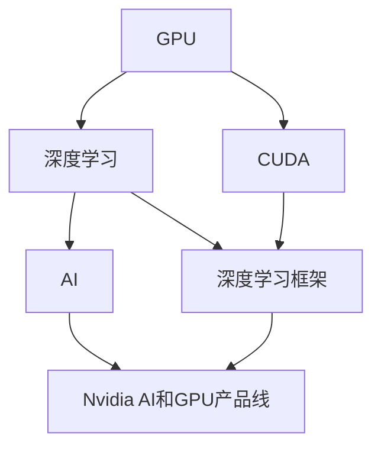
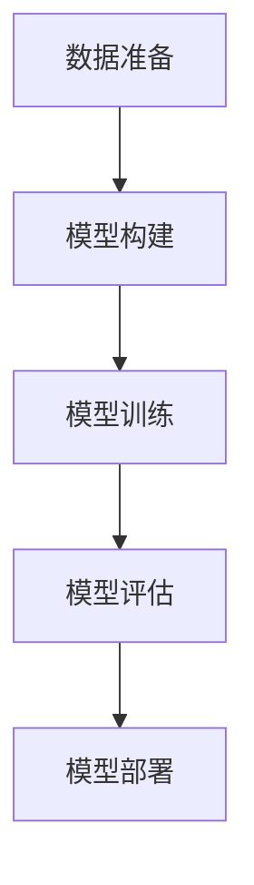

                 

## 1. 背景介绍

Nvidia作为全球领先的AI和GPU技术提供商，自成立以来便专注于图形处理单元（GPU）的研发和创新，为AI、机器学习、深度学习等领域的快速发展提供了强大的硬件支持。在GPU与AI的紧密合作中，Nvidia不断推动技术边界，提升性能，优化能效，使得AI技术在各行各业的应用变得更为广泛和深入。本文将系统性地回顾Nvidia GPU与AI的发展历程，探讨其对技术进步、行业应用和未来趋势的深远影响。

## 2. 核心概念与联系

### 2.1 核心概念概述

- **GPU（图形处理单元）**：一种专门用于图形渲染的处理器，最初由Nvidia于1993年首次推出。现代GPU不仅是图形渲染的重要组件，也是深度学习、机器学习等AI任务的核心计算单元。

- **深度学习**：一种基于神经网络模型的人工智能技术，旨在通过多层神经元学习数据的复杂特征。GPU的高并行处理能力使得深度学习模型得以在大规模数据上训练，大大提升了算法的性能。

- **AI（人工智能）**：一种通过模拟人类智能行为，让计算机执行复杂决策和任务的技术。GPU在AI系统中承担了大量计算密集型任务，如神经网络训练和推理。

- **Nvidia CUDA（计算统一设备架构）**：一种用于GPU并行计算的编程平台，旨在加速科学计算、数据处理和AI任务。CUDA使得开发者能够高效利用GPU进行高性能计算。

- **TensorFlow、PyTorch等深度学习框架**：这些框架支持在GPU上高效运行深度学习算法，并提供了丰富的API和工具，简化了AI开发和部署流程。

- **Nvidia AI和GPU产品线**：包括NVIDIA Tesla GPU、NVIDIA RTX GPU、NVIDIA DGX超级计算机等，涵盖从计算单元到数据中心的全方位解决方案。

### 2.2 核心概念的联系

通过一系列核心概念的整合，Nvidia构建了一个完整的AI生态系统，其中GPU作为计算引擎，CUDA作为编程平台，深度学习框架提供算法支持，AI产品线则提供了从硬件到软件的一站式解决方案。这种生态系统不仅提升了Nvidia在AI领域的竞争力，也推动了全球AI技术的发展与应用。

以下是一个Mermaid流程图，展示Nvidia GPU与AI的核心概念及其相互关系：



此图展示了GPU与AI生态系统中的关键组成部分及其相互依赖关系。

## 3. 核心算法原理 & 具体操作步骤

### 3.1 算法原理概述

GPU与AI的结合，使得深度学习算法能够在大规模数据上高效训练和推理。Nvidia的CUDA技术，结合TensorFlow、PyTorch等深度学习框架，为GPU与AI的结合提供了坚实的技术基础。

- **并行计算**：深度学习模型的训练和推理过程中，大量的矩阵运算和梯度计算可以通过GPU的高并行处理能力高效完成。

- **自动微分与反向传播**：CUDA支持自动微分，使得深度学习模型的梯度计算和反向传播变得简单高效。

- **内存优化**：CUDA优化了内存管理，支持异步内存访问和内存重叠，使得GPU能够更好地利用计算资源。

### 3.2 算法步骤详解

基于Nvidia GPU与AI结合的深度学习流程可以分为以下几个步骤：

1. **数据准备**：收集并预处理大规模训练数据，将数据划分为训练集、验证集和测试集。

2. **模型构建**：使用TensorFlow或PyTorch等框架，构建深度学习模型。

3. **模型训练**：在GPU上使用CUDA并行计算，训练深度学习模型。

4. **模型评估**：在测试集上评估模型性能，调整超参数以优化模型。

5. **模型部署**：将训练好的模型部署到生产环境中，进行实时推理和预测。

以下是一个简化的流程图，展示Nvidia GPU与AI结合的深度学习训练流程：



### 3.3 算法优缺点

Nvidia GPU与AI结合的优势：

- **高效性能**：GPU的高并行处理能力使得深度学习模型的训练和推理速度大大提升。
- **广泛应用**：支持多种深度学习框架和算法，能够应用于图像识别、自然语言处理、语音识别等多个领域。
- **易用性**：CUDA和深度学习框架提供了丰富的API和工具，降低了AI开发的门槛。

但同时，也存在一些缺点：

- **高成本**：高性能GPU和相关硬件设备的投入成本较高。
- **能耗问题**：大量GPU计算会带来较高的能耗，需要优化冷却系统以确保稳定运行。
- **模型泛化**：GPU训练的模型可能存在过拟合问题，需要额外的数据增强和正则化方法。

### 3.4 算法应用领域

Nvidia GPU与AI结合的技术，已经广泛应用于以下几个领域：

- **自动驾驶**：用于训练和推理自动驾驶系统中的神经网络模型，实现环境感知和行为决策。
- **医疗影像分析**：通过GPU加速深度学习算法，用于图像分类、分割、增强等医疗影像处理任务。
- **金融市场分析**：用于训练和推理模型，进行股票价格预测、风险评估等金融分析任务。
- **计算机视觉**：支持图像分类、目标检测、图像生成等计算机视觉任务的训练和推理。
- **自然语言处理**：用于训练和推理语言模型，支持机器翻译、文本分类、情感分析等NLP任务。
- **科学计算**：用于高性能计算任务，如图形渲染、数值模拟、物理仿真等。

## 4. 数学模型和公式 & 详细讲解

### 4.1 数学模型构建

在深度学习模型中，我们通常使用多层神经网络进行特征提取和模式识别。以卷积神经网络（CNN）为例，模型可以通过以下公式表示：

$$ y = W_2 \cdot \phi(W_1 x) $$

其中 $W_1$ 和 $W_2$ 是神经网络的权重矩阵，$\phi$ 是激活函数，$x$ 是输入数据，$y$ 是输出结果。

### 4.2 公式推导过程

在深度学习模型的训练过程中，我们使用反向传播算法来计算梯度，并通过优化算法（如随机梯度下降）更新模型参数。反向传播算法的主要步骤如下：

1. 计算损失函数对输出层的结果 $y$ 的梯度 $\frac{\partial L}{\partial y}$。
2. 通过链式法则计算每个隐藏层的结果 $\phi$ 的梯度 $\frac{\partial L}{\partial \phi}$。
3. 计算每个权重矩阵 $W$ 的梯度 $\frac{\partial L}{\partial W}$。
4. 使用优化算法更新模型参数。

以下是一个简单的Python代码示例，展示如何使用TensorFlow进行反向传播：

```python
import tensorflow as tf

# 定义模型
input = tf.placeholder(tf.float32, shape=(None, 784))
hidden = tf.layers.dense(input, 256, activation=tf.nn.relu)
output = tf.layers.dense(hidden, 10)

# 定义损失函数和优化器
y_true = tf.placeholder(tf.int32, shape=(None,))
loss = tf.reduce_mean(tf.nn.sparse_softmax_cross_entropy_with_logits(labels=y_true, logits=output))
optimizer = tf.train.GradientDescentOptimizer(learning_rate=0.01).minimize(loss)

# 训练模型
with tf.Session() as sess:
    sess.run(tf.global_variables_initializer())
    for i in range(1000):
        batch_xs, batch_ys = mnist.train.next_batch(100)
        sess.run(optimizer, feed_dict={input: batch_xs, y_true: batch_ys})
```

### 4.3 案例分析与讲解

以Nvidia在医学影像分析中的应用为例，我们可以使用GPU加速的深度学习模型，对医学影像进行分割、增强等处理，提高诊断的准确性和效率。以下是一个简单的代码示例，展示如何使用GPU进行医学影像分割：

```python
import tensorflow as tf

# 加载医学影像数据
data = tf.load_data('medical_image.npy')

# 定义模型
inputs = tf.placeholder(tf.float32, shape=(None, 256, 256, 1))
outputs = tf.layers.conv2d(inputs, filters=32, kernel_size=(3, 3), activation=tf.nn.relu)
outputs = tf.layers.max_pooling2d(outputs, pool_size=(2, 2), strides=(2, 2))
outputs = tf.layers.conv2d(outputs, filters=64, kernel_size=(3, 3), activation=tf.nn.relu)
outputs = tf.layers.max_pooling2d(outputs, pool_size=(2, 2), strides=(2, 2))
outputs = tf.layers.conv2d(outputs, filters=128, kernel_size=(3, 3), activation=tf.nn.relu)
outputs = tf.layers.max_pooling2d(outputs, pool_size=(2, 2), strides=(2, 2))
outputs = tf.layers.conv2d(outputs, filters=128, kernel_size=(3, 3), activation=tf.nn.relu)
outputs = tf.layers.max_pooling2d(outputs, pool_size=(2, 2), strides=(2, 2))
outputs = tf.layers.flatten(outputs)
outputs = tf.layers.dense(outputs, units=256, activation=tf.nn.relu)
outputs = tf.layers.dense(outputs, units=1, activation=tf.nn.sigmoid)

# 定义损失函数和优化器
y_true = tf.placeholder(tf.float32, shape=(None, 1))
loss = tf.reduce_mean(tf.nn.sigmoid_cross_entropy_with_logits(labels=y_true, logits=outputs))
optimizer = tf.train.GradientDescentOptimizer(learning_rate=0.01).minimize(loss)

# 训练模型
with tf.Session() as sess:
    sess.run(tf.global_variables_initializer())
    for i in range(1000):
        batch_xs, batch_ys = medical_data_train[i:i+100]
        sess.run(optimizer, feed_dict={inputs: batch_xs, y_true: batch_ys})
```

## 5. 项目实践：代码实例和详细解释说明

### 5.1 开发环境搭建

在进行Nvidia GPU与AI结合的深度学习开发时，需要安装以下软件和工具：

1. **NVIDIA CUDA Toolkit**：用于支持GPU计算和编程。
2. **NVIDIA cuDNN Library**：用于加速深度学习算法的执行。
3. **TensorFlow、PyTorch等深度学习框架**：用于构建和训练深度学习模型。
4. **NVIDIA Visual Profiler**：用于监控和优化GPU性能。

### 5.2 源代码详细实现

以下是一个使用TensorFlow进行图像分类任务的示例代码：

```python
import tensorflow as tf

# 定义模型
input = tf.placeholder(tf.float32, shape=(None, 784))
hidden = tf.layers.dense(input, 256, activation=tf.nn.relu)
output = tf.layers.dense(hidden, 10)

# 定义损失函数和优化器
y_true = tf.placeholder(tf.int32, shape=(None,))
loss = tf.reduce_mean(tf.nn.sparse_softmax_cross_entropy_with_logits(labels=y_true, logits=output))
optimizer = tf.train.GradientDescentOptimizer(learning_rate=0.01).minimize(loss)

# 训练模型
with tf.Session() as sess:
    sess.run(tf.global_variables_initializer())
    for i in range(1000):
        batch_xs, batch_ys = mnist.train.next_batch(100)
        sess.run(optimizer, feed_dict={input: batch_xs, y_true: batch_ys})
```

### 5.3 代码解读与分析

在上述代码中，我们首先定义了输入、隐藏层和输出层，然后使用TensorFlow构建了损失函数和优化器。在训练过程中，我们使用了随机梯度下降算法，并使用MNIST数据集进行了训练。

### 5.4 运行结果展示

在训练完成后，我们可以使用以下代码进行测试：

```python
import numpy as np

# 加载测试集
test_xs, test_ys = mnist.test.images, mnist.test.labels

# 进行测试
test_predictions = sess.run(output, feed_dict={input: test_xs})
accuracy = np.mean(np.argmax(test_predictions, axis=1) == test_ys)
print('Accuracy:', accuracy)
```

这将输出测试集上的准确率。

## 6. 实际应用场景

### 6.1 自动驾驶

Nvidia在自动驾驶领域的应用，通过深度学习算法实现环境感知、路径规划和决策支持。其GPU与AI结合的技术，大大提升了自动驾驶系统的计算效率和鲁棒性。

### 6.2 医疗影像分析

在医疗影像分析中，Nvidia的GPU与AI结合技术能够快速处理大量医疗影像数据，通过深度学习算法进行图像分割、增强和分类，辅助医生进行精准诊断。

### 6.3 金融市场分析

Nvidia的GPU与AI结合技术在金融市场分析中，用于预测股票价格、评估风险和进行量化交易，帮助金融机构优化投资决策。

### 6.4 计算机视觉

在计算机视觉领域，Nvidia的GPU与AI结合技术用于图像分类、目标检测和图像生成等任务，提升了计算机视觉应用的精度和效率。

### 6.5 自然语言处理

Nvidia的GPU与AI结合技术在自然语言处理中，用于文本分类、情感分析和机器翻译等任务，推动了NLP技术的发展。

### 6.6 科学计算

在科学计算领域，Nvidia的GPU与AI结合技术用于高性能计算任务，如图形渲染、数值模拟和物理仿真等，提升了计算效率和精度。

## 7. 工具和资源推荐

### 7.1 学习资源推荐

1. **NVIDIA CUDA开发者手册**：提供了CUDA编程的详细指南和示例代码。
2. **TensorFlow官方文档**：提供了TensorFlow的详细API和教程。
3. **NVIDIA Deep Learning SDK**：提供了深度学习应用的开发工具和示例代码。
4. **PyTorch官方文档**：提供了PyTorch的详细API和教程。
5. **NVIDIA Visual Profiler**：用于监控和优化GPU性能。

### 7.2 开发工具推荐

1. **Visual Studio Code**：支持CUDA编程的集成开发环境。
2. **Jupyter Notebook**：支持TensorFlow和PyTorch的开发和调试。
3. **NVIDIA cuDNN Library**：用于加速深度学习算法的执行。

### 7.3 相关论文推荐

1. **CUDA-Capable Science**：NVIDIA在顶会IEEE CS&E上发表的文章，介绍了CUDA在科学计算中的应用。
2. **Tesla: Optimal Speeds for Deep Learning and AI**：NVIDIA在顶级会议CVPR上发表的文章，介绍了Tesla GPU在深度学习中的应用。
3. **Neural Networks and Deep Learning**：Michael Nielsen的经典书籍，详细介绍了深度学习的原理和应用。

## 8. 总结：未来发展趋势与挑战

### 8.1 研究成果总结

Nvidia GPU与AI结合的深度学习技术，在高性能计算、AI应用和科学计算等领域取得了显著进展，推动了深度学习算法的发展和应用。

### 8.2 未来发展趋势

1. **更高效的计算架构**：未来GPU将支持更高的计算密度和更优的能效比，进一步提升深度学习算法的性能。
2. **更广泛的应用场景**：Nvidia GPU与AI结合技术将应用于更多的领域，如智慧城市、智能制造、医疗健康等。
3. **更智能的自动驾驶**：基于深度学习的自动驾驶系统将更加智能和安全，能够在复杂的交通环境中进行精准导航。
4. **更精准的医疗诊断**：深度学习算法将提升医疗影像分析的准确性和效率，辅助医生进行精准诊断。
5. **更优化的金融决策**：基于深度学习的金融分析算法将提升投资决策的准确性和效率，优化金融市场的运行。
6. **更高效的自然语言处理**：Nvidia GPU与AI结合技术将提升自然语言处理应用的精度和效率，推动NLP技术的发展。

### 8.3 面临的挑战

1. **高昂的成本**：高性能GPU和相关设备的投入成本较高，可能限制小规模企业的应用。
2. **能耗问题**：大量GPU计算会带来较高的能耗，需要优化冷却系统以确保稳定运行。
3. **模型泛化**：GPU训练的模型可能存在过拟合问题，需要额外的数据增强和正则化方法。

### 8.4 研究展望

未来，Nvidia GPU与AI结合技术的发展方向包括：

1. **更高效的并行计算**：开发更高效的并行计算架构，提升深度学习算法的性能。
2. **更智能的AI应用**：结合AI和机器学习技术，开发更智能、更高效的AI应用。
3. **更优化的资源管理**：优化GPU资源管理，提升算法的能效比。
4. **更广泛的行业应用**：拓展GPU与AI结合技术在更多行业中的应用，推动AI技术的普及和应用。
5. **更先进的训练技术**：结合自监督学习、迁移学习等技术，提升模型的泛化能力和效果。

总之，Nvidia GPU与AI结合技术将不断推动深度学习算法的发展和应用，为各行各业带来更高效、更智能、更安全的AI解决方案。

## 9. 附录：常见问题与解答

**Q1: 如何选择合适的深度学习框架？**

A: 选择合适的深度学习框架需要考虑多个因素，包括易用性、性能、社区支持、功能完备性等。TensorFlow和PyTorch是两个常用的深度学习框架，TensorFlow适用于大规模生产环境，PyTorch适用于快速原型开发和研究。

**Q2: 如何优化深度学习模型的性能？**

A: 优化深度学习模型性能需要从多个方面入手，包括数据增强、模型结构优化、超参数调优、硬件资源优化等。使用GPU进行深度学习训练，可以显著提升模型的训练速度和性能。

**Q3: 如何处理数据集的过拟合问题？**

A: 数据增强、正则化、早期停止等方法可以有效缓解过拟合问题。使用更多的数据集进行训练，并结合多种数据增强技术，可以提高模型的泛化能力。

**Q4: 如何优化深度学习算法的能效比？**

A: 优化深度学习算法的能效比需要从算法本身和硬件两个方面入手。使用更高效的算法和数据结构，结合GPU加速和混合精度计算，可以显著提升算法的能效比。

**Q5: 如何使用NVIDIA GPU进行深度学习开发？**

A: 安装NVIDIA CUDA Toolkit和cuDNN Library，使用TensorFlow、PyTorch等深度学习框架，结合NVIDIA Visual Profiler进行性能监控和优化。

作者：禅与计算机程序设计艺术 / Zen and the Art of Computer Programming

