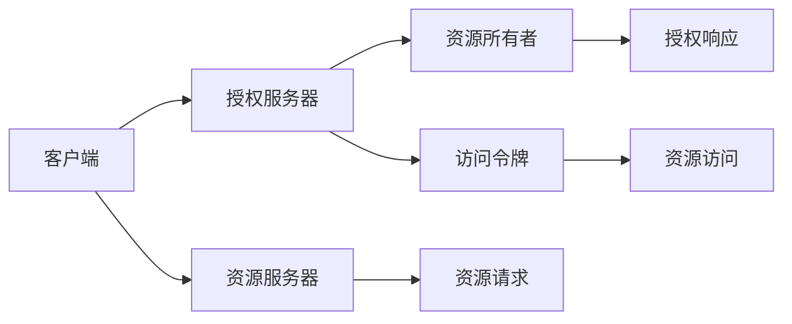
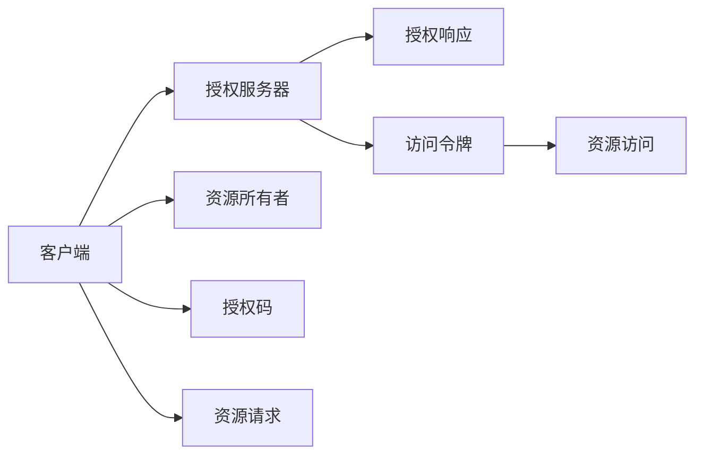

                 

# OAuth 2.0 的基本概念

在当代互联网生态系统中，用户数据的访问和使用成为了一个核心问题。为了平衡用户隐私保护与各类服务的便捷使用，OAuth 2.0 成为了目前最流行和广泛采用的标准。本文将详细介绍 OAuth 2.0 的基本概念、原理和实现步骤，并探讨其优缺点及应用领域。

## 1. 背景介绍

随着互联网的发展，用户数据变得越来越重要。例如，社交媒体平台存储了大量用户的个人信息和行为数据，这些数据在广告、推荐系统、数据科学等诸多领域具有极高的价值。然而，用户并不希望这些数据被未经授权的第三方使用。为了解决这个问题，OAuth 2.0 应运而生，提供了一种安全的用户授权机制，允许用户选择性地向第三方应用程序暴露其数据，同时保证了用户的数据安全。

OAuth 2.0 由一组协议和授权框架组成，最初由谷歌提出并由互联网工程任务组（IETF）标准化。它允许用户向第三方应用程序授予访问其资源的权限，而无需共享其密码等敏感信息。目前，OAuth 2.0 已经成为互联网授权的标准，广泛应用于各种场景，如社交媒体、在线存储、在线支付等。

## 2. 核心概念与联系

### 2.1 核心概念概述

为了更好地理解 OAuth 2.0，我们先定义几个核心概念：

- **资源所有者（Resource Owner）**：即用户，拥有某个资源的所有权。
- **客户端（Client）**：即第三方应用程序，需要访问资源所有者的资源。
- **授权服务器（Authorization Server）**：即认证服务，负责处理用户授权请求，并颁发访问令牌。
- **资源服务器（Resource Server）**：即资源提供者，提供用户资源，并验证访问令牌的有效性。

OAuth 2.0 的基本流程包括以下几个步骤：

1. **授权请求**：客户端向授权服务器提出授权请求，请求获得资源所有者的授权。
2. **用户授权**：授权服务器向资源所有者展示客户端的权限请求，并请求其授权。
3. **访问令牌获取**：如果资源所有者同意授权，授权服务器会颁发一个访问令牌给客户端。
4. **资源访问**：客户端使用访问令牌向资源服务器请求访问资源。
5. **资源验证**：资源服务器验证访问令牌的有效性，如果有效，则向客户端提供请求的资源。

这些概念和步骤构成了 OAuth 2.0 的基本框架，并通过一系列协议和机制确保授权过程的安全和可靠。

### 2.2 概念间的关系

OAuth 2.0 的核心概念和步骤可以通过以下 Mermaid 流程图来展示：



这个流程图展示了 OAuth 2.0 的主要流程：

1. 客户端向授权服务器请求授权。
2. 授权服务器向资源所有者展示客户端的请求。
3. 资源所有者授权或拒绝。
4. 如果授权，授权服务器颁发访问令牌。
5. 客户端使用令牌向资源服务器请求资源。
6. 资源服务器验证令牌，并提供资源。

通过这个流程图，我们可以更直观地理解 OAuth 2.0 的流程，接下来我们将深入探讨 OAuth 2.0 的原理和实现细节。

## 3. 核心算法原理 & 具体操作步骤

### 3.1 算法原理概述

OAuth 2.0 的核心原理基于委托授权模型，即资源所有者委托第三方客户端代理访问其资源。这个模型包括以下几个关键点：

- **认证（Authentication）**：客户端需要向授权服务器证明其身份，通常使用客户端 ID 和密码。
- **授权（Authorization）**：资源所有者向授权服务器提供其授权请求，授权服务器会根据请求颁发访问令牌。
- **访问（Access）**：客户端使用访问令牌向资源服务器请求访问资源，资源服务器验证令牌的有效性，并返回资源。

OAuth 2.0 使用多个协议和机制来确保这些步骤的安全性，包括 HTTPS、数字签名、访问令牌等。

### 3.2 算法步骤详解

OAuth 2.0 有四种授权流程，分别是授权码（Authorization Code）流程、隐式（Implicit）流程、密码（Password Credentials）流程和客户端凭证（Client Credentials）流程。下面我们以授权码流程为例，详细介绍具体的步骤。

#### 授权码流程

1. **授权请求**：客户端向授权服务器发送授权请求，请求访问资源所有者的资源。
2. **用户授权**：授权服务器向资源所有者展示客户端的请求，并请求其授权。
3. **授权响应**：如果资源所有者同意授权，授权服务器会生成一个授权码，并返回给客户端。
4. **访问令牌获取**：客户端使用授权码向授权服务器请求访问令牌，授权服务器验证授权码，并颁发访问令牌。
5. **资源访问**：客户端使用访问令牌向资源服务器请求访问资源。
6. **资源验证**：资源服务器验证访问令牌的有效性，如果有效，则向客户端提供请求的资源。

下面是一个更详细的授权码流程的 Mermaid 流程图：



### 3.3 算法优缺点

#### 优点

1. **用户隐私保护**：OAuth 2.0 通过授权流程确保用户数据不会泄露，用户只需要授权一次即可多次访问第三方应用程序，无需每次都输入密码。
2. **安全**：OAuth 2.0 使用 HTTPS、数字签名等技术，确保数据传输和存储的安全性。
3. **灵活性**：OAuth 2.0 支持多种授权流程和模式，适应不同的应用场景。

#### 缺点

1. **复杂性**：OAuth 2.0 需要理解多个协议和机制，对于开发者和管理员来说，可能有一定复杂度。
2. **令牌管理**：OAuth 2.0 需要管理多个令牌，容易出错。
3. **性能开销**：OAuth 2.0 需要进行多次网络通信，可能会影响性能。

### 3.4 算法应用领域

OAuth 2.0 广泛应用于以下场景：

- **社交媒体登录**：用户可以通过 OAuth 2.0 登录第三方社交媒体平台，无需输入用户名和密码。
- **应用程序授权**：用户可以通过 OAuth 2.0 授权第三方应用程序访问其个人资料、照片等资源。
- **在线支付**：用户可以通过 OAuth 2.0 授权第三方在线支付平台访问其银行卡信息，进行在线支付。
- **数据共享**：用户可以通过 OAuth 2.0 授权第三方应用程序访问其数据，进行数据分析和研究。

## 4. 数学模型和公式 & 详细讲解  
### 4.1 数学模型构建

OAuth 2.0 的授权流程涉及多个实体和交互，可以用一个简单的数学模型来表示：

设 $R$ 为资源所有者集合，$C$ 为客户端集合，$A$ 为授权服务器，$S$ 为资源服务器。客户端 $c \in C$ 希望访问资源所有者 $r \in R$ 的资源 $r$。

授权流程包括以下几个变量：

- $k$：客户端 ID。
- $p$：客户端密码。
- $t$：访问令牌。
- $u$：用户 ID。

授权流程可以表示为以下步骤：

1. 客户端向授权服务器请求授权，并展示其身份证明 $k$ 和 $p$。
2. 授权服务器向资源所有者展示请求，并请求其授权 $u$。
3. 如果资源所有者授权，授权服务器颁发访问令牌 $t$。
4. 客户端使用访问令牌向资源服务器请求访问资源。
5. 资源服务器验证访问令牌的有效性，并返回请求的资源。

### 4.2 公式推导过程

以授权码流程为例，推导其核心公式。

授权码流程的核心是授权码和访问令牌。授权码是一个一次性使用的字符串，用于在客户端向授权服务器请求访问令牌时，证明其之前已经向资源所有者展示了请求并获得了授权。

授权码流程的授权码生成公式为：

$$
\text{code} = \text{hash}( \text{client\_id}, \text{redirect\_uri}, \text{nonce}, \text{timestamp})
$$

其中：

- $\text{client\_id}$：客户端 ID。
- $\text{redirect\_uri}$：客户端重定向 URI。
- $\text{nonce}$：随机数。
- $\text{timestamp}$：时间戳。

授权码流程的访问令牌生成公式为：

$$
\text{token} = \text{hash}( \text{client\_secret}, \text{code}, \text{redirect\_uri}, \text{nonce}, \text{timestamp})
$$

其中：

- $\text{client\_secret}$：客户端密钥。

### 4.3 案例分析与讲解

考虑以下 OAuth 2.0 授权场景：

1. 用户 Alice 希望使用 Google 应用程序 A。
2. 应用程序 A 向 Google 授权服务器请求访问 Alice 的资源。
3. Google 授权服务器向 Alice 展示请求，并请求其授权。
4. Alice 授权，Google 授权服务器颁发访问令牌。
5. 应用程序 A 使用访问令牌向 Google 资源服务器请求 Alice 的资料。
6. Google 资源服务器验证令牌，并提供请求的资料。

### 5. 项目实践：代码实例和详细解释说明

下面以 Python 和 Flask 为例，实现一个简单的 OAuth 2.0 授权服务器。

#### 5.1 开发环境搭建

首先需要安装 Flask、Flask-OAuthlib 和 Flask-JWT 等库：

```bash
pip install flask flask-oauthlib flask-jwt
```

然后创建一个 Flask 应用程序，并在 app.py 中实现以下代码：

```python
from flask import Flask, request, jsonify
from flask_oauthlib.provider import OAuth2Provider
from flask_jwt import JWT, jwt_required, current_identity

app = Flask(__name__)
app.config['SECRET_KEY'] = 'your_secret_key'
app.config['OAUTH2_PROVIDER'] = {
    'authorize_url': '/authorize',
    'token_url': '/token',
    'client_id': 'your_client_id',
    'client_secret': 'your_client_secret',
    'endpoint': '/endpoint',
    'redirect_uris': ['http://localhost:5000/callback'],
    'scope': ['read', 'write']
}

oauth = OAuth2Provider(app)

def authenticate(username, password):
    if username == 'user' and password == 'pass':
        return username, '', True
    return None, '', False

def identity(payload):
    user_id = payload['identity']
    return {'id': user_id, 'name': 'User', 'active': True}

jwt = JWT(app, authenticate, identity)

@app.route('/protected')
@jwt_required()
def protected():
    return jsonify({'user': current_identity})

if __name__ == '__main__':
    app.run(debug=True)
```

#### 5.2 源代码详细实现

在 app.py 中，我们首先配置了 OAuth 2.0 提供商，包括授权请求 URL、令牌获取 URL、客户端 ID、密钥等。然后定义了 authenticate 和 identity 函数，用于验证用户身份和获取用户信息。

authenticate 函数会验证用户提供的用户名和密码，如果验证通过，则返回用户名、密钥和 True，表示验证成功。identity 函数用于获取用户信息，返回用户 ID、用户名和 True。

接下来，我们使用 JWT 实现基于令牌的认证。在 /protected 路由上，需要验证 JWT 令牌才能访问。如果令牌有效，则返回当前用户的身份信息。

最后，启动应用程序并监听请求。

#### 5.3 代码解读与分析

在实际应用中，OAuth 2.0 服务器需要处理多个请求，包括授权请求、令牌获取请求和资源请求等。这些请求需要设计良好的 API 接口，并采用 HTTPS 等安全措施来确保数据传输的安全性。

在上述代码中，我们使用了 Flask 和 Flask-JWT 来实现 OAuth 2.0 服务器。Flask-OAuthlib 提供了一个简单的 OAuth 2.0 提供商实现，帮助我们快速搭建 OAuth 2.0 服务器。JWT 用于实现基于令牌的认证，提高了系统的安全性和可扩展性。

实际应用中，OAuth 2.0 服务器需要处理更多的请求和数据，需要进行更复杂的处理和验证。例如，授权服务器需要处理资源所有者的授权请求，颁发访问令牌，并验证令牌的有效性。资源服务器需要验证令牌，并返回请求的资源。

#### 5.4 运行结果展示

假设我们运行上述代码，在浏览器中访问 http://localhost:5000/authorize，并按照流程授权应用程序 A。如果授权成功，可以访问 http://localhost:5000/protected，并看到当前用户的身份信息。

## 6. 实际应用场景

### 6.1 社交媒体登录

社交媒体平台广泛使用 OAuth 2.0 进行用户登录。用户只需要授权一次，就可以访问多个第三方应用程序，如邮件客户端、聊天应用等，而无需每次都输入密码。例如，Twitter、Facebook 等平台都支持 OAuth 2.0 登录。

### 6.2 在线支付

在线支付平台使用 OAuth 2.0 来授权第三方应用程序访问用户的支付信息。用户只需要授权一次，就可以使用第三方应用程序进行在线支付，无需每次都输入支付信息。例如，PayPal、Stripe 等支付平台都支持 OAuth 2.0 支付授权。

### 6.3 数据共享

数据共享平台使用 OAuth 2.0 来授权第三方应用程序访问用户的数据。用户只需要授权一次，就可以共享数据给多个应用程序，而无需每次都授权。例如，Google Analytics、Kaggle 等数据共享平台都支持 OAuth 2.0 数据共享。

## 7. 工具和资源推荐

### 7.1 学习资源推荐

- **OAuth 2.0 官方文档**：IETF 的 OAuth 2.0 标准文档，提供了详细的授权流程和规范。
- **OAuth 2.0 for Developers**：谷歌开发者文档，详细介绍了 OAuth 2.0 授权流程和实现方法。
- **Flask-OAuthlib**：Flask 插件，提供了 OAuth 2.0 提供商的实现，方便开发者快速搭建 OAuth 2.0 服务器。

### 7.2 开发工具推荐

- **Flask**：Python Web 框架，简单易用，适合实现 OAuth 2.0 服务器。
- **Flask-JWT**：Flask 插件，用于实现基于令牌的认证，提高了系统的安全性。
- **Jwt**：Python 库，用于实现 JWT 令牌，方便认证和授权。

### 7.3 相关论文推荐

- **OAuth 2.0 协议**：IETF 的 OAuth 2.0 标准文档，提供了详细的授权流程和规范。
- **OAuth 2.0 安全**：OAuth 2.0 安全最佳实践，帮助开发者确保授权过程的安全性。
- **OAuth 2.0 在金融服务中的应用**：探讨 OAuth 2.0 在金融服务中的应用，包括授权流程、令牌管理等。

## 8. 总结：未来发展趋势与挑战

### 8.1 未来发展趋势

OAuth 2.0 将继续作为互联网授权的标准，广泛应用在各种场景中。未来，OAuth 2.0 将向着更简单、更安全、更灵活的方向发展，解决当前存在的一些问题，例如：

- **简化授权流程**：OAuth 2.0 将不断简化授权流程，减少授权的复杂性和冗余性。
- **增强安全性**：OAuth 2.0 将加强对令牌的保护，防止令牌被劫持或伪造。
- **支持新兴技术**：OAuth 2.0 将支持新兴技术，如 WebAssembly、Serverless 等，以适应未来的应用场景。

### 8.2 面临的挑战

尽管 OAuth 2.0 在互联网授权中发挥了重要作用，但仍面临一些挑战：

- **安全性**：OAuth 2.0 的授权流程和令牌管理存在一些漏洞，容易被攻击者利用。
- **性能**：OAuth 2.0 需要处理大量的请求和数据，可能会导致性能瓶颈。
- **标准化**：不同平台和应用对 OAuth 2.0 的实现存在差异，可能会影响用户体验。

### 8.3 研究展望

未来，OAuth 2.0 的研究方向可能包括：

- **新兴技术**：OAuth 2.0 将支持新兴技术，如 WebAssembly、Serverless 等，以适应未来的应用场景。
- **身份验证**：OAuth 2.0 将引入更多的身份验证机制，如生物识别、多因素认证等，以提高安全性。
- **标准化**：OAuth 2.0 将进一步标准化，避免不同平台和应用的实现差异。

总之，OAuth 2.0 将继续在互联网授权中发挥重要作用，并不断向着更简单、更安全、更灵活的方向发展，以应对未来的挑战和需求。

## 9. 附录：常见问题与解答

**Q1: OAuth 2.0 如何防止授权请求被伪造？**

A: OAuth 2.0 使用客户端 ID、客户端密钥和随机数等机制，确保授权请求的真实性。如果客户端使用伪造的请求，授权服务器会拒绝授权。

**Q2: OAuth 2.0 如何防止令牌被劫持？**

A: OAuth 2.0 使用 HTTPS 和数字签名等技术，确保令牌在传输过程中的安全性。如果令牌被劫持，授权服务器会拒绝访问请求。

**Q3: OAuth 2.0 如何支持多因素认证？**

A: OAuth 2.0 可以通过引入多因素认证机制，如短信验证码、生物识别等，增强授权过程的安全性。

**Q4: OAuth 2.0 如何支持新兴技术？**

A: OAuth 2.0 将不断引入新兴技术，如 WebAssembly、Serverless 等，以适应未来的应用场景。例如，OAuth 2.0 可以通过 WebAssembly 实现客户端的本地认证和授权。

**Q5: OAuth 2.0 如何处理授权请求的超时问题？**

A: OAuth 2.0 可以使用时间戳等机制，确保授权请求的实时性。如果请求超时，授权服务器会拒绝授权。

**Q6: OAuth 2.0 如何支持多用户登录？**

A: OAuth 2.0 可以通过引入多用户登录机制，如多用户令牌、会话管理等，实现多用户登录。

总之，OAuth 2.0 将继续在互联网授权中发挥重要作用，并不断向着更简单、更安全、更灵活的方向发展，以应对未来的挑战和需求。

---

作者：禅与计算机程序设计艺术 / Zen and the Art of Computer Programming

