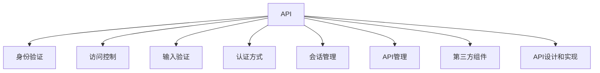
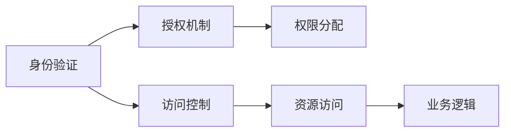
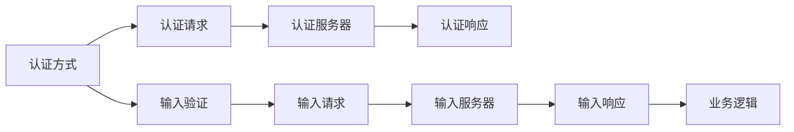
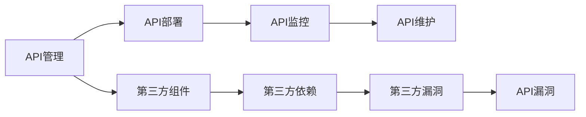
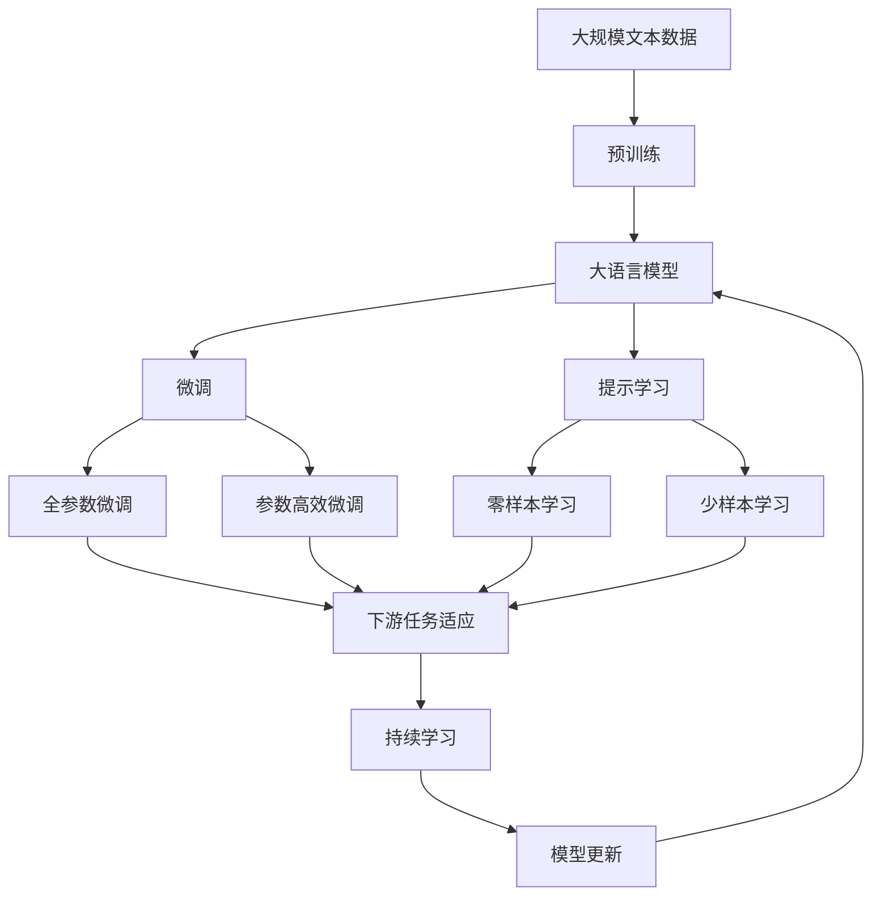

                 

# OWASP API 安全风险清单的详细解读

> 关键词：API 安全, 风险管理, 安全清单, OWASP, 安全漏洞, 安全审计

## 1. 背景介绍

### 1.1 问题由来
随着Web服务的普及和微服务的盛行，API（应用程序编程接口）安全问题日益凸显。API 不仅连接了Web应用和移动应用，还连接了各种云服务和第三方API，成为数据传输和业务协作的重要枢纽。然而，由于API自身复杂度高、访问权限分散、攻击面广，API安全问题频繁发生，严重威胁到了企业数据和业务的完整性、机密性和可用性。

为帮助企业应对日益复杂的API安全挑战，Open Web Application Security Project（OWASP）在2021年发布了第7版的OWASP API Security Top 10风险清单，将API安全风险归纳为十个关键问题。该清单通过对每个风险的详细介绍和案例分析，帮助开发者和架构师识别和防范API安全漏洞，提升API安全性。

### 1.2 问题核心关键点
OWASP API Security Top 10清单将API安全风险归纳为以下十个关键问题：

1. **身份验证和访问控制不正确**：API未正确实现身份验证和访问控制，导致未经授权的访问和数据泄露。
2. **无输入验证和攻击**：API未对用户输入进行充分验证，导致跨站脚本（XSS）、SQL注入、命令注入等攻击。
3. **未限制资源的使用**：API未限制资源的使用，导致拒绝服务（DoS）、恶意操作或滥用。
4. **无限制数据暴露**：API未正确控制数据暴露，导致敏感信息泄露或未授权的数据访问。
5. **未验证安全性首选项**：API未正确验证安全性首选项，导致安全控制失效。
6. **使用无限制的共享密钥验证**：API未使用安全的认证方式，导致认证数据泄露或被滥用。
7. **依赖第三方组件未验证**：API依赖的第三方组件未验证，导致第三方组件的漏洞被利用。
8. **不安全的认证和会话管理**：API未采用安全的认证和会话管理机制，导致认证数据泄露、会话劫持等安全问题。
9. **不安全的 API 管理**：API的部署、管理和维护过程未充分考虑安全问题，导致安全隐患。
10. **API 中的不安全设计和实现**：API的设计和实现未充分考虑安全性，导致安全漏洞。

这些风险问题覆盖了API的各个方面，从身份验证、输入验证、数据暴露、认证方式、第三方组件、会话管理、API管理到API设计和实现，全面反映了当前API安全的重要性和复杂性。

### 1.3 问题研究意义
了解和防范API安全风险清单中的问题，对于提升API安全防护水平，降低安全事件的发生频率和影响范围具有重要意义：

1. **提高安全性**：全面理解API安全风险，帮助企业提前识别潜在的安全问题，采取措施避免或减轻安全威胁。
2. **降低成本**：通过主动预防和及时修复安全漏洞，降低安全事件的响应和修复成本，减少企业损失。
3. **提升合规性**：遵循OWASP API Security Top 10清单，有助于企业符合国内外数据保护法规和行业标准，避免法律风险。
4. **增强信任度**：通过建立可靠的安全管理体系，增强客户和用户对API的信任度，提升企业品牌和市场竞争力。
5. **推动创新**：良好的API安全防护措施能够降低业务中断风险，为企业开发和部署新API提供保障，推动技术创新。

## 2. 核心概念与联系

### 2.1 核心概念概述

为更好地理解OWASP API Security Top 10清单的每个风险问题，本节将介绍几个密切相关的核心概念：

- **身份验证（Authentication）**：确保只有经过授权的用户才能访问API，是API安全的基础。
- **访问控制（Authorization）**：在身份验证的基础上，进一步限制用户的访问权限，确保用户只能访问其被授权的资源。
- **输入验证（Input Validation）**：确保API接收到的用户输入数据符合预期，防止各种攻击。
- **认证方式（Authentication Mechanism）**：用于验证用户身份的方法，如基本认证、OAuth2等。
- **会话管理（Session Management）**：管理用户会话的机制，确保会话数据的机密性和完整性。
- **API管理（API Management）**：API的部署、监控、维护等管理过程，确保API的持续安全性。
- **第三方组件（Third-party Components）**：API依赖的第三方库或服务，其安全性直接影响到API的安全性。
- **API设计和实现（API Design and Implementation）**：API的设计和代码实现过程中的安全性考量。

这些核心概念之间的逻辑关系可以通过以下Mermaid流程图来展示：



这个流程图展示了一个典型的API系统及其安全防护措施的架构：

1. API通过身份验证机制确保只有经过授权的用户可以访问。
2. 通过访问控制进一步限制用户的访问权限。
3. 接收到的用户输入数据通过输入验证机制进行严格过滤，防止攻击。
4. API采用安全的认证方式验证用户身份，确保认证数据的安全。
5. 通过会话管理机制确保会话数据的机密性和完整性。
6. API管理确保API的持续安全，包括部署、监控、维护等。
7. 第三方组件的安全性直接影响到API的安全性，需要严格验证和防护。
8. API设计和实现过程中的安全性考量，是API安全的基础。

### 2.2 概念间的关系

这些核心概念之间存在着紧密的联系，形成了API安全的完整生态系统。下面我们通过几个Mermaid流程图来展示这些概念之间的关系。

#### 2.2.1 身份验证与访问控制的联系



这个流程图展示了身份验证和访问控制的基本流程：

1. 用户通过身份验证机制进行身份识别。
2. 身份验证结果经过授权机制处理，根据用户角色和权限进行权限分配。
3. 分配后的权限用于控制用户对资源的访问，确保只有授权用户才能访问资源。
4. 资源访问过程中，通过业务逻辑处理，确保数据和操作的正确性和安全性。

#### 2.2.2 输入验证与认证方式的联系



这个流程图展示了输入验证和认证方式的基本流程：

1. 用户通过认证方式（如OAuth2）向认证服务器请求认证。
2. 认证服务器验证认证请求，返回认证响应。
3. API接收用户输入数据，通过输入验证机制进行严格过滤。
4. 过滤后的数据进入业务逻辑处理，确保数据正确性和安全性。
5. 认证服务器返回认证响应后，API根据认证结果进行后续处理。

#### 2.2.3 API管理与第三方组件的联系



这个流程图展示了API管理与第三方组件的基本流程：

1. API管理负责API的部署、监控和维护。
2. 部署过程中，需要考虑第三方组件的安全性，验证和处理第三方依赖。
3. 第三方依赖中存在的漏洞可能被利用，影响API的安全性。
4. API管理需要持续监控第三方组件的安全状态，及时处理安全问题。
5. 第三方组件的安全问题可能通过API暴露，影响API的安全性。

### 2.3 核心概念的整体架构

最后，我们用一个综合的流程图来展示这些核心概念在API安全中的整体架构：



这个综合流程图展示了从预训练到微调，再到持续学习的完整过程。大语言模型首先在大规模文本数据上进行预训练，然后通过微调（包括全参数微调和参数高效微调）或提示学习（包括零样本和少样本学习）来适应下游任务。最后，通过持续学习技术，模型可以不断更新和适应新的任务和数据。 通过这些流程图，我们可以更清晰地理解API安全的各个核心概念及其关系，为后续深入讨论具体的安全措施奠定基础。

## 3. 核心算法原理 & 具体操作步骤
### 3.1 算法原理概述

OWASP API Security Top 10清单中的每个风险问题，都可以通过以下基本算法原理进行理解和防范：

- **识别威胁**：通过分析API的使用情况和环境，识别潜在的安全威胁。
- **评估风险**：基于已识别的威胁，评估其对API的潜在影响。
- **制定措施**：根据风险评估结果，制定具体的安全防护措施。
- **实施防护**：通过代码、配置等手段实施防护措施。
- **监测和修复**：持续监测API的安全状态，及时修复发现的安全问题。

每个风险问题的具体算法原理和操作步骤在下一节将详细介绍。

### 3.2 算法步骤详解

#### 3.2.1 风险1：身份验证和访问控制不正确

**算法原理**：

1. 识别API中存在的身份验证和访问控制问题。
2. 评估这些问题的潜在影响，如数据泄露、未经授权的访问等。
3. 制定具体的身份验证和访问控制策略，如使用OAuth2、JWT等。
4. 在API设计和实现过程中，实施这些策略。
5. 持续监测API的访问日志，发现异常访问行为，及时采取措施。

**具体操作步骤**：

1. 检查API的认证和授权机制是否完整。
2. 确保API使用HTTPS等安全传输协议。
3. 采用强密码策略，确保用户密码的安全。
4. 使用OAuth2、JWT等安全的认证方式，确保认证数据的安全。
5. 根据用户角色和权限，合理分配访问权限，确保最小权限原则。
6. 持续监控API的访问日志，及时发现和处理异常访问行为。

#### 3.2.2 风险2：无输入验证和攻击

**算法原理**：

1. 识别API中存在的输入验证问题。
2. 评估这些问题的潜在影响，如XSS、SQL注入等攻击。
3. 制定输入验证策略，如输入白名单、长度限制等。
4. 在API设计和实现过程中，实施这些策略。
5. 持续监测API的输入日志，发现异常输入，及时采取措施。

**具体操作步骤**：

1. 对API接收的所有用户输入数据进行严格验证。
2. 禁止或限制特殊字符、特殊编码等恶意输入。
3. 对输入数据进行长度限制，避免缓冲区溢出等攻击。
4. 使用输入白名单，确保输入数据符合预期格式。
5. 对输入数据进行编码处理，防止XSS等攻击。
6. 持续监测API的输入日志，及时发现和处理异常输入。

#### 3.2.3 风险3：未限制资源的使用

**算法原理**：

1. 识别API中存在的资源限制问题。
2. 评估这些问题的潜在影响，如DoS攻击、恶意操作等。
3. 制定资源限制策略，如流量限制、并发限制等。
4. 在API设计和实现过程中，实施这些策略。
5. 持续监测API的资源使用情况，发现异常使用行为，及时采取措施。

**具体操作步骤**：

1. 对API的资源使用情况进行监控，如流量、并发等。
2. 设置合理的资源限制，如API请求频率、并发请求数等。
3. 对API调用进行限流，避免DoS攻击。
4. 使用分布式限流策略，确保系统稳定运行。
5. 持续监控API的资源使用情况，及时发现和处理异常使用行为。

#### 3.2.4 风险4：无限制数据暴露

**算法原理**：

1. 识别API中存在的敏感数据暴露问题。
2. 评估这些问题的潜在影响，如数据泄露、未授权访问等。
3. 制定数据暴露防护策略，如数据脱敏、数据加密等。
4. 在API设计和实现过程中，实施这些策略。
5. 持续监测API的数据使用情况，发现异常数据访问，及时采取措施。

**具体操作步骤**：

1. 对API暴露的所有数据进行分类，确定敏感数据的保护级别。
2. 对敏感数据进行脱敏处理，防止数据泄露。
3. 使用数据加密技术，确保数据在传输和存储过程中的安全。
4. 对API调用进行权限控制，确保只有授权用户可以访问敏感数据。
5. 持续监控API的数据使用情况，及时发现和处理异常数据访问。

#### 3.2.5 风险5：未验证安全性首选项

**算法原理**：

1. 识别API中存在的安全性首选项问题。
2. 评估这些问题的潜在影响，如安全控制失效等。
3. 制定安全性首选项验证策略，如输入验证、输出验证等。
4. 在API设计和实现过程中，实施这些策略。
5. 持续监测API的安全性首选项使用情况，发现异常情况，及时采取措施。

**具体操作步骤**：

1. 对API中使用的安全性首选项进行严格验证，确保其正确性和有效性。
2. 对API输出数据进行输出验证，确保数据不包含恶意代码。
3. 对API接收的输入数据进行输入验证，确保数据符合预期格式。
4. 使用安全的首选项设置，确保API的安全性。
5. 持续监测API的安全性首选项使用情况，及时发现和处理异常情况。

#### 3.2.6 风险6：使用无限制的共享密钥验证

**算法原理**：

1. 识别API中存在的共享密钥验证问题。
2. 评估这些问题的潜在影响，如认证数据泄露等。
3. 制定安全的共享密钥验证策略，如使用加密的共享密钥。
4. 在API设计和实现过程中，实施这些策略。
5. 持续监测API的认证数据使用情况，发现异常情况，及时采取措施。

**具体操作步骤**：

1. 对API使用的共享密钥进行加密处理，防止泄露。
2. 对共享密钥的使用进行严格的访问控制，确保只有授权用户可以访问。
3. 使用安全的认证方式，如OAuth2等，避免使用共享密钥进行认证。
4. 持续监测API的认证数据使用情况，及时发现和处理异常情况。

#### 3.2.7 风险7：依赖第三方组件未验证

**算法原理**：

1. 识别API中依赖的第三方组件。
2. 评估这些组件的潜在风险，如第三方组件漏洞被利用等。
3. 制定第三方组件验证策略，如依赖管理、漏洞检测等。
4. 在API设计和实现过程中，实施这些策略。
5. 持续监测第三方组件的安全状态，发现漏洞，及时采取措施。

**具体操作步骤**：

1. 对API依赖的第三方组件进行详细分析，确定其潜在的安全风险。
2. 使用依赖管理工具，如Maven、npm等，确保组件的来源可信。
3. 对第三方组件进行漏洞检测，确保其安全性。
4. 定期更新第三方组件，确保其版本安全。
5. 持续监测第三方组件的安全状态，及时发现和处理漏洞。

#### 3.2.8 风险8：不安全的认证和会话管理

**算法原理**：

1. 识别API中存在的认证和会话管理问题。
2. 评估这些问题的潜在影响，如认证数据泄露、会话劫持等。
3. 制定安全的认证和会话管理策略，如使用安全的会话机制、采用安全的认证方式等。
4. 在API设计和实现过程中，实施这些策略。
5. 持续监测API的认证和会话数据使用情况，发现异常情况，及时采取措施。

**具体操作步骤**：

1. 对API的认证和会话管理机制进行严格验证，确保其安全性。
2. 使用安全的认证方式，如OAuth2、JWT等，确保认证数据的安全。
3. 使用安全的会话机制，如SSL/TLS、HMAC等，确保会话数据的机密性和完整性。
4. 定期更换认证密钥，防止会话劫持等攻击。
5. 持续监测API的认证和会话数据使用情况，及时发现和处理异常情况。

#### 3.2.9 风险9：不安全的 API 管理

**算法原理**：

1. 识别API管理过程中存在的安全问题。
2. 评估这些问题的潜在影响，如API泄露、未经授权的API访问等。
3. 制定API管理策略，如API授权、API审计等。
4. 在API设计和实现过程中，实施这些策略。
5. 持续监测API的访问和使用情况，发现异常情况，及时采取措施。

**具体操作步骤**：

1. 对API的部署、监控、维护等过程进行严格控制，确保其安全性。
2. 使用API授权机制，确保只有授权用户可以访问API。
3. 定期对API进行安全审计，发现和修复安全漏洞。
4. 使用API管理工具，如Kubernetes、Swagger等，确保API的安全性。
5. 持续监测API的访问和使用情况，及时发现和处理异常情况。

#### 3.2.10 风险10：API 中的不安全设计和实现

**算法原理**：

1. 识别API设计和实现过程中存在的安全问题。
2. 评估这些问题的潜在影响，如安全漏洞、API攻击等。
3. 制定安全的API设计和实现策略，如代码审查、安全编码等。
4. 在API设计和实现过程中，实施这些策略。
5. 持续监测API的设计和实现过程，发现异常情况，及时采取措施。

**具体操作步骤**：

1. 对API的设计和实现过程进行详细审查，确保其安全性。
2. 使用安全编码规范，确保代码的安全性。
3. 进行代码审查，发现和修复安全漏洞。
4. 使用静态和动态代码分析工具，确保代码的安全性。
5. 持续监测API的设计和实现过程，及时发现和处理异常情况。

### 3.3 算法优缺点

**优点**：

- **全面覆盖**：OWASP API Security Top 10清单覆盖了API安全的所有重要方面，有助于全面提升API的安全性。
- **权威性**：由全球知名的安全组织OWASP发布，具有较高的权威性和可信度。
- **可操作性**：清单中每个风险问题都提供了具体的实施步骤和建议，易于操作。

**缺点**：

- **复杂度高**：清单中的每个风险问题涉及多个技术和配置层面的细节，实施难度较高。
- **适用性有限**：清单中提供的安全措施和方法可能不适用于所有场景，需要根据具体情况进行调整。
- **更新频率低**：清单内容相对静态，更新频率较低，无法及时反映最新的安全威胁和解决方案。

### 3.4 算法应用领域

OWASP API Security Top 10清单的应用领域广泛，几乎涵盖了所有需要安全防护的API场景：

- **Web应用**：包括社交媒体、电子商务、在线金融等Web应用，需要确保用户数据和业务逻辑的安全性。
- **移动应用**：移动应用通常需要通过API连接后台服务，确保数据传输和业务协作的安全性。
- **云服务**：云服务提供商通常提供API，用于数据存储、计算、监控等，需要确保API的安全性。
- **第三方API**：第三方API通常需要连接多个系统，确保其安全性是实现跨系统互操作性的基础。
- **IoT设备**：物联网设备通常需要通过API与云端或其他设备进行通信，确保API的安全性是实现设备安全的重要保障。
- **医疗健康**：医疗健康领域通常涉及敏感数据，需要确保API的安全性，保护患者隐私和数据安全。

## 4. 数学模型和公式 & 详细讲解  
### 4.1 数学模型构建

由于API安全风险清单涉及的技术问题具有多样性和复杂性，无法通过单一数学模型进行建模。但为了更好地理解其中的风险问题，我们尝试通过数学模型来简要描述一些常见的API安全问题。

以风险1“身份验证和访问控制不正确”为例，我们假设有$n$个用户访问API，每个用户有$k$个权限，每个权限有$c$种操作，则API的访问控制矩阵$A$可以表示为：

$$
A = \begin{bmatrix}
a_{1,1} & a_{1,2} & \ldots & a_{1,k} \\
a_{2,1} & a_{2,2} & \ldots & a_{2,k} \\
\vdots & \vdots & \ddots & \vdots \\
a_{n,1} & a_{n,2} & \ldots & a_{n,k}
\end{bmatrix}
$$

其中$a_{i,j}$表示用户$i$对于权限$j$的操作$c$的访问控制状态，值为0或1，0表示没有权限，1表示有权限。

在API设计和实现过程中，需要对访问控制矩阵$A$进行严格验证和监控，确保每个用户的访问权限正确且合理。

### 4.2 公式推导过程

以风险2“无输入验证和攻击”为例，我们假设API接收的用户输入数据为$X$，其格式为$(x_1, x_2, \ldots, x_n)$，其中每个$x_i$表示一个输入字段，可能包含SQL注入、XSS等攻击向量。则输入验证的数学模型可以表示为：

$$
F(X) = \begin{cases}
0, & \text{if } X \in S \\
1, & \text{if } X \notin S
\end{cases}
$$

其中$S$表示输入数据的安全集合，$F(X)$表示输入数据的验证结果，值为0表示输入数据合法，值为1表示输入数据存在安全风险。

在API设计和实现过程中，需要对输入数据$X$进行严格验证，确保其符合预期的安全集合$S$，从而防止SQL注入、XSS等攻击。

### 4.3 案例分析与讲解

以风险3“未限制资源的使用”为例，我们假设API的资源使用量为$R$，包括CPU使用率、内存使用量、网络流量等。则资源限制的数学模型可以表示为：

$$
L(R) = \begin{cases}
0, & \text{if } R \leq T \\
1, & \text{if } R > T
\end{cases}
$$

其中$T$表示资源限制阈值，$L(R)$表示资源限制的结果，值为0表示资源使用合法，值为1表示资源使用超出限制。

在API设计和实现过程中，需要对资源使用量$R$进行严格限制，确保其不超过预设的阈值$T$，从而防止DoS攻击和恶意操作。

## 5. 项目实践：代码实例和详细解释说明
### 5.1 开发环境搭建

在进行API安全实践前，我们需要准备好开发环境。以下是使用Python进行Flask框架开发的环境配置流程：

1. 安装Python：确保Python版本在3.7以上，可以通过官网下载安装包进行安装。
2. 安装Flask：在命令行中执行`pip install Flask`即可安装Flask框架。
3. 安装Flask-RESTful：在命令行中执行`pip install Flask-RESTful`即可安装Flask-RESTful扩展。
4. 安装Flask-Security：在命令行中执行`pip install Flask-Security`即可安装Flask-Security扩展，用于实现API的认证和授权。
5. 安装Flask-JWT-Extended：在命令行中执行`pip install Flask-JWT-Extended`即可安装Flask-JWT-Extended扩展，用于实现安全的API认证和会话管理。

完成上述步骤后，即可在Python环境下进行API安全实践。

### 5.2 源代码详细实现

下面是一个简单的Flask API示例，展示了如何实现基本的安全功能：

```python
from flask import Flask, request, jsonify
from flask_restful import Resource, Api
from flask_security import Security, SQLAlchemyUserDatastore, UserMixin, RoleMixin, login_required
from flask_jwt_extended import JWTManager, jwt_required, create_access_token

app = Flask(__name__)
api = Api(app)

class User(db.Model, UserMixin):
    id = db.Column(db.Integer, primary_key=True)
    email = db.Column(db.String(255), unique=True)
    password_hash = db.Column(db.String(255))
    active = db.Column(db.Boolean(), default=True)

    def __init__(self, email, password, active=True):
        self.email = email
        self.password_hash = password_hash(password)
        self.active = active

class Role(db.Model, RoleMixin

