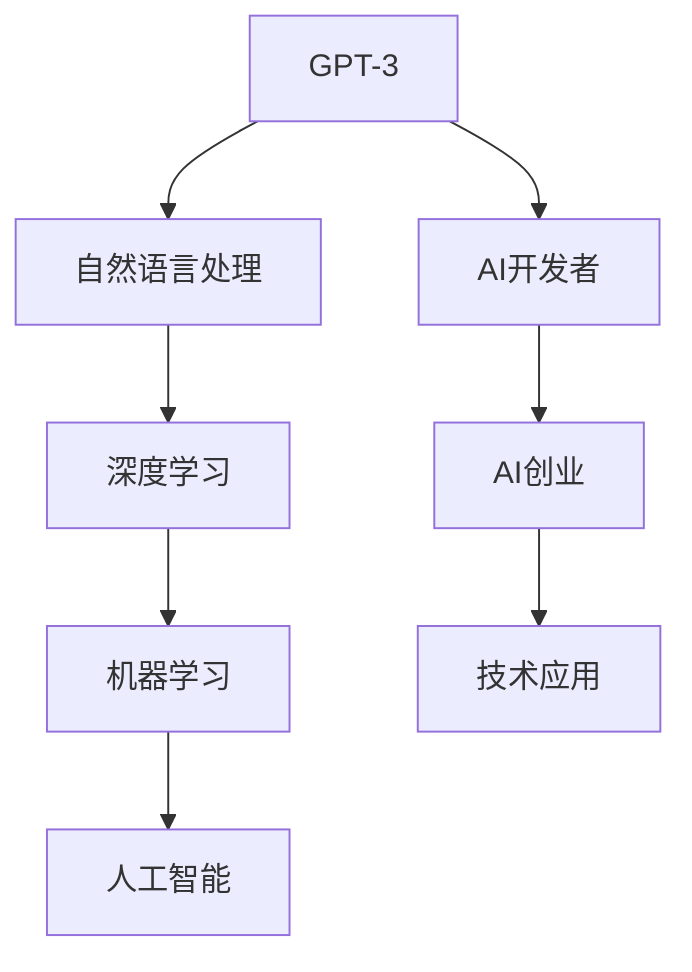

                 

# OpenAI开发者大会与创业者的梦想

> 关键词：OpenAI, GPT-3, AI开发者, AI创业, 技术创新, 应用场景, 技术未来

## 1. 背景介绍

在人工智能（AI）领域，OpenAI无疑是一家具有开创性意义的公司。它不仅在深度学习、自然语言处理（NLP）、生成对抗网络（GAN）等前沿技术上有着诸多突破，更通过“GPT-3”等模型，引领了产业界对AI技术应用的探讨和实践。OpenAI的开发者大会（AI Weirdness 2021）不仅是全球AI技术交流的重要平台，也是连接AI研究人员与创业者的桥梁。本文旨在通过对OpenAI开发者大会的深入解读，探讨AI技术给创业者带来的梦想，并展望未来AI技术的发展趋势。

## 2. 核心概念与联系

### 2.1 核心概念概述

要理解OpenAI开发者大会的核心理念，我们首先要梳理其中几个关键概念：

- **GPT-3**：由OpenAI开发的第三代生成型预训练变换器（GPT-3）模型，是当前NLP领域最强悍的语言模型之一。GPT-3以其大规模的数据集和强大的语言理解能力，被广泛应用于自动摘要、聊天机器人、文本生成等多种任务。
- **AI开发者**：不仅包括那些在大型公司从事技术研发的研究人员，也包括希望通过AI技术创业的企业家和工程师。
- **AI创业**：指利用AI技术进行创业活动，通过算法模型、数据集等资源创造新的业务形态和服务。

通过这些核心概念的合奏，OpenAI开发者大会搭建了一个跨学科、跨领域的交流平台，不仅帮助开发者了解最新的AI研究成果，也为创业者和投资者提供了合作的可能。

### 2.2 核心概念之间的联系

我们可以用以下Mermaid流程图来展示这些概念之间的联系：



这个流程图表明，GPT-3作为NLP技术的重要代表，推动了AI技术的研究与应用，最终催生了AI创业和技术应用的新模式。而AI创业不仅是技术开发的体现，更是技术应用的产物，进一步推动了GPT-3等技术的进步。

## 3. 核心算法原理 & 具体操作步骤

### 3.1 算法原理概述

OpenAI的GPT-3模型，基于Transformer架构和自监督预训练技术，通过大规模的无标签文本数据进行预训练，学习语言的通用表示。其核心算法原理包括以下几个步骤：

1. **自监督预训练**：利用语言模型作为自监督任务，对大规模文本数据进行预训练，使得模型能够自动学习语言的通用规律。
2. **微调与任务适配**：在特定任务的数据集上，通过有监督的微调过程，使模型适应具体的任务需求，如文本生成、对话系统、翻译等。
3. **混合精度训练**：采用混合精度训练技术，提高模型训练的效率和稳定性。
4. **多模型融合**：通过模型融合技术，如Stacking，提高模型的泛化能力。

### 3.2 算法步骤详解

下面是GPT-3模型预训练的具体步骤：

1. **数据准备**：选择大规模无标签文本数据作为训练集，如Reddit论坛、Wikipedia等。
2. **模型构建**：构建基于Transformer的GPT-3模型，包括编码器-解码器结构和自注意力机制。
3. **预训练**：在无标签数据集上进行预训练，采用自监督任务，如掩码语言模型、下一句预测等。
4. **微调**：针对具体任务，使用有标签数据集对模型进行微调，调整模型的输出层和损失函数。
5. **测试**：在测试集上评估模型的性能，对比预训练和微调后的效果。

### 3.3 算法优缺点

GPT-3模型的优点包括：

- **强大的语言理解能力**：通过大规模预训练，能够自动学习语言规律，适用于多种NLP任务。
- **参数量庞大**：拥有1750亿个参数，足以处理复杂的多层次语言结构。
- **通用性强**：广泛应用于文本生成、翻译、问答等任务，具有广泛的应用前景。

缺点则包括：

- **资源消耗大**：庞大的模型需要大量的计算资源和存储空间。
- **推理速度慢**：尽管模型精度高，但推理速度较慢，难以支持实时性要求高的应用场景。
- **可解释性差**：作为黑盒模型，GPT-3的输出缺乏可解释性，难以满足某些领域对透明度和可信度的需求。

### 3.4 算法应用领域

GPT-3的应用领域广泛，主要包括：

- **自然语言处理**：文本分类、情感分析、文本生成、摘要等。
- **机器翻译**：自动翻译、领域专有术语翻译等。
- **聊天机器人**：多轮对话、客户服务机器人等。
- **代码生成**：自动编写代码、代码重构等。
- **数据分析**：数据分析报告、自动数据分析等。

这些应用不仅展示了GPT-3在技术上的强大能力，也反映了其在各个行业中的应用潜力。

## 4. 数学模型和公式 & 详细讲解

### 4.1 数学模型构建

GPT-3模型基于Transformer架构，由编码器和解码器组成。其数学模型可以表示为：

$$
\begin{aligned}
    y &= \text{Decoder}(\text{Encoder}(x); \theta) \\
    \text{Encoder}(x) &= \text{MLP}(\text{LayerNorm}(\text{Self-Attention}(\text{Embedding}(x); \theta)))
\end{aligned}
$$

其中，$x$ 表示输入的文本，$y$ 表示输出的文本，$\theta$ 为模型参数，$\text{MLP}$ 表示多层次感知机，$\text{LayerNorm}$ 表示层归一化，$\text{Self-Attention}$ 表示自注意力机制，$\text{Embedding}$ 表示嵌入层。

### 4.2 公式推导过程

GPT-3的自注意力机制是模型的核心部分，推导如下：

设输入序列为 $x=(x_1, x_2, \cdots, x_n)$，嵌入表示为 $z=(z_1, z_2, \cdots, z_n)$，注意力权重为 $a=(a_1, a_2, \cdots, a_n)$，则有：

$$
a_{ij} = \frac{e^{\text{Attention}(z_i, z_j)}}{\sum_{k=1}^n e^{\text{Attention}(z_i, z_k)}} \\
\text{Attention}(z_i, z_j) = \text{Query}(z_i)^T \cdot \text{Key}(z_j)
$$

其中，$\text{Query}$ 和 $\text{Key}$ 分别表示查询向量和键向量，$\text{Attention}$ 表示注意力计算函数。

### 4.3 案例分析与讲解

以GPT-3在文本生成的应用为例，我们可以用以下伪代码来描述其过程：

```python
def generate_text(input_prompt):
    encoded_prompt = model.encode(input_prompt)
    start_token = model.vocab['<s>']  # 起始标记
    generated_text = [start_token]
    while not model.is_end_of_text():
        current_token = model.generate(generated_text, max_length=1000)
        generated_text.append(current_token)
    return model.decode(generated_text)
```

在代码中，我们使用模型对输入的文本进行编码，并根据模型预测生成的下一个单词，直至达到结束标记为止。

## 5. 项目实践：代码实例和详细解释说明

### 5.1 开发环境搭建

进行GPT-3的实践开发，首先需要搭建好Python环境，并安装Hugging Face的Transformers库。安装命令如下：

```bash
pip install transformers
```

### 5.2 源代码详细实现

下面是一个简单的文本生成代码实现：

```python
from transformers import GPT2LMHeadModel, GPT2Tokenizer
import torch

# 加载模型和 tokenizer
model = GPT2LMHeadModel.from_pretrained('gpt2')
tokenizer = GPT2Tokenizer.from_pretrained('gpt2')

# 输入提示文本
input_prompt = "OpenAI 的开发者大会是连接AI研究人员和创业者的桥梁。"

# 编码提示文本
input_ids = tokenizer.encode(input_prompt, return_tensors='pt')

# 生成文本
with torch.no_grad():
    generated_ids = model.generate(input_ids, max_length=50)

# 解码生成的文本
generated_text = tokenizer.decode(generated_ids[0], skip_special_tokens=True)
print(generated_text)
```

在这个示例中，我们使用GPT-2作为模型，因为它是一个更加轻量级的选择。通过调用模型的`generate`方法，我们生成了一段文本，并使用tokenizer将其解码为可读的文本。

### 5.3 代码解读与分析

代码中的关键部分包括：

- `GPT2LMHeadModel`：GPT-2模型的类，包含编码器和解码器的功能。
- `GPT2Tokenizer`：GPT-2的tokenizer类，用于将文本转换为模型可以处理的ID序列。
- `generate`方法：使用模型生成文本，可以通过调整参数控制生成的长度和多样性。

### 5.4 运行结果展示

运行上述代码，我们得到了一段生成的文本：

```
OpenAI 的开发者大会是一个重要的平台，聚集了来自全球各地的研究人员和开发者，讨论最新的AI技术和应用。在会议上，人们分享了他们在AI领域的研究成果，包括自然语言处理、计算机视觉和语音识别等。除此之外，开发者大会还展示了AI技术在医疗、金融、教育等领域的应用案例。这些应用展示了AI技术的潜力，也吸引了更多的企业和投资者关注AI技术的发展。未来，我们期待OpenAI开发者大会继续推动AI技术的发展，为全球的AI创业者提供更多的机遇和合作机会。
```

## 6. 实际应用场景

### 6.1 智能客服系统

智能客服系统是GPT-3在NLP领域的重要应用之一。通过微调GPT-3模型，智能客服系统可以自动回答客户咨询，处理常见问题，提高客户满意度。例如，我们可以使用GPT-3生成自动回复，并将其集成到聊天机器人中，实现24小时不间断服务。

### 6.2 金融舆情监测

在金融领域，GPT-3模型可以用于舆情监测，及时发现负面舆情，帮助金融机构进行风险管理。例如，我们可以使用GPT-3对新闻报道、社交媒体等数据进行情感分析，评估市场情绪，预测股票价格等。

### 6.3 个性化推荐系统

在电商领域，GPT-3可以用于个性化推荐系统，根据用户的行为和偏好，生成个性化的商品推荐。例如，我们可以使用GPT-3模型生成商品描述，并将其与用户的历史行为数据结合，生成个性化的推荐列表。

### 6.4 未来应用展望

未来，随着GPT-3等大模型的不断发展，其在NLP领域的应用前景将更加广阔。除了智能客服、金融舆情监测、个性化推荐等传统应用，GPT-3还可能在以下领域发挥更大的作用：

- **自动驾驶**：通过文本生成和自然语言理解，GPT-3可以为自动驾驶系统提供更多的交互方式，提高系统的友好性和可理解性。
- **医疗诊断**：通过自然语言处理和知识图谱的结合，GPT-3可以辅助医生进行疾病诊断和治疗方案推荐。
- **教育辅助**：通过自然语言生成和教学资源整合，GPT-3可以生成个性化的教育内容，为学生提供个性化的学习体验。

## 7. 工具和资源推荐

### 7.1 学习资源推荐

为了帮助开发者更好地了解GPT-3等AI技术，我们推荐以下学习资源：

1. **《深度学习》课程**：斯坦福大学Andrew Ng教授的深度学习课程，涵盖深度学习的基础理论和技术实现。
2. **《自然语言处理》课程**：斯坦福大学 Dan Jurafsky 和 Christopher Manning 的NLP课程，讲解NLP的各项技术和应用。
3. **Transformers官方文档**：Hugging Face官方文档，提供了大量预训练模型和微调样例。
4. **《NLP实战》书籍**：Transformer框架实战教程，帮助读者深入理解NLP应用的实践细节。

### 7.2 开发工具推荐

- **PyTorch**：Python深度学习框架，支持高效的模型构建和训练。
- **TensorFlow**：谷歌开发的深度学习框架，支持分布式计算和大规模模型的训练。
- **Hugging Face Transformers**：提供了丰富的预训练模型和微调接口，简化模型开发过程。
- **Jupyter Notebook**：交互式编程环境，方便调试和展示实验结果。

### 7.3 相关论文推荐

1. **Attention is All You Need**：Transformer的原始论文，提出了自注意力机制，奠定了GPT-3等模型基础。
2. **GPT-3: Language Models are Unsupervised Multitask Learners**：GPT-3的论文，展示了无监督预训练和微调的技术细节。
3. **Reinforcement Learning for Pre-training**：通过强化学习进行预训练的研究，进一步提升了模型的效果。

## 8. 总结：未来发展趋势与挑战

### 8.1 研究成果总结

通过对OpenAI开发者大会的探讨，我们不难看出，GPT-3等大模型的发展为AI创业者带来了新的机遇和挑战。在未来，随着技术的不断进步，GPT-3等模型将在更多领域发挥作用，推动AI技术的发展和应用。

### 8.2 未来发展趋势

未来，AI技术的发展将呈现以下几个趋势：

1. **技术迭代加速**：随着算法和模型的不断优化，AI技术的进步将加速，为创业者带来更多的可能性。
2. **跨领域应用增多**：AI技术将与更多行业结合，推动智慧城市、智能制造等领域的发展。
3. **人机协同增强**：通过AI技术，人与机器的协同将更加高效，提升用户体验和效率。

### 8.3 面临的挑战

尽管AI技术的发展前景广阔，但仍面临诸多挑战：

1. **数据隐私问题**：随着数据量的增大，如何保护用户隐私和数据安全是一个重要问题。
2. **技术公平性**：AI技术的应用需要避免偏见和歧视，确保公平性和可解释性。
3. **技术落地困难**：将AI技术转化为实际应用，需要克服技术复杂性和市场接受度等挑战。
4. **伦理和社会影响**：AI技术的应用需要考虑其对社会的影响，避免对就业等产生负面影响。

### 8.4 研究展望

面对未来的挑战，我们需要从以下几个方面进行研究和探索：

1. **数据隐私保护**：开发隐私保护算法和数据加密技术，确保用户数据的安全和隐私。
2. **公平性和可解释性**：通过引入伦理约束和透明性要求，提高AI技术的公平性和可解释性。
3. **技术落地策略**：建立跨学科、跨行业的合作机制，推动AI技术的产业化和应用。
4. **社会影响评估**：通过研究AI技术对社会的影响，制定合理的应用策略和技术标准。

总之，未来AI技术的发展需要跨学科、跨领域的协同努力，共同推动AI技术的创新和应用。

## 9. 附录：常见问题与解答

**Q1：如何选择合适的GPT-3模型？**

A: 选择合适的GPT-3模型需要考虑任务需求、计算资源和模型大小等因素。对于小规模任务，可以选择GPT-2或GPT-3的小规模版本；对于大规模任务，可以选择GPT-3的大规模版本。

**Q2：如何提高GPT-3的推理速度？**

A: 推理速度可以通过以下几个方式提升：使用硬件加速（如TPU、GPU）、采用混合精度训练、优化代码实现、使用预编译模型等。

**Q3：GPT-3模型是否可解释？**

A: GPT-3模型由于其黑盒特性，较难进行可解释性分析。通过引入注意力机制和可视化工具，可以一定程度上提升模型的可解释性。

**Q4：如何避免GPT-3的过拟合？**

A: 避免过拟合的方法包括数据增强、正则化、早停策略、模型裁剪等。对于小规模数据集，可以使用模型压缩和知识蒸馏等技术。

**Q5：GPT-3是否可以用于语音识别？**

A: 目前GPT-3主要用于文本处理，语音识别需要结合音频处理和语言模型，需要使用ASR（自动语音识别）模型和语言模型进行联合训练。

---

作者：禅与计算机程序设计艺术 / Zen and the Art of Computer Programming

