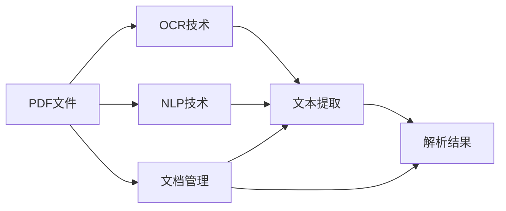
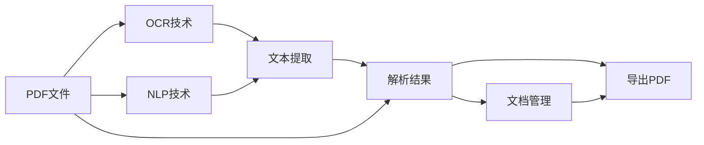
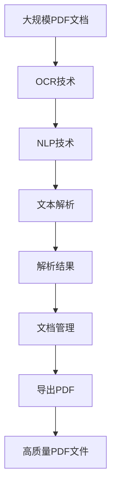

                 

# PDF 文档解析和导出模块

> 关键词：PDF解析，PDF导出，OCR技术，机器学习，自然语言处理，文档管理

## 1. 背景介绍

### 1.1 问题由来
在现代信息技术飞速发展的背景下，PDF文档作为一种广泛应用的文档格式，因其跨平台兼容性和高度结构化的特性，成为了许多行业和企业的首选文件格式。然而，PDF文档的处理并不总是简单直观的。对于文档中的大量文本信息，如何有效解析和提取，一直是文档管理、内容分析、搜索应用等场景中的难点问题。

此外，PDF文档的导出也是一个常见需求。无论是企业内部的文档管理，还是个人的数据存档，PDF格式的输出都是一种便捷且可靠的方式。但如何根据不同的需求，自动生成高质量的PDF文件，同样是一个复杂且重要的挑战。

针对这些需求，本文将详细介绍PDF文档的解析和导出模块，深入探讨其核心算法原理、具体操作步骤，并结合实际应用场景，给出全面的技术解决方案。

### 1.2 问题核心关键点
在解决PDF文档解析和导出问题时，以下关键点需要特别关注：

- PDF文档的结构解析：PDF文件通常包含丰富的层次结构，如页面、文本、图形、元数据等。如何有效地解析这些结构，提取关键信息，是问题的核心。
- PDF文档的文本提取：PDF文档中的文本信息通常经过OCR（Optical Character Recognition，光学字符识别）处理，需要优化OCR引擎，保证文本识别的准确性。
- PDF文档的导出质量：根据需求，生成高质量的PDF文件，需要在保持原有格式和内容的同时，进行必要的优化和调整。

解决这些问题，不仅可以提升PDF文档管理的效率，还能够在实际应用中创造出更多价值。

### 1.3 问题研究意义
研究PDF文档解析和导出模块，对于推动文档处理技术的进步，提升企业文档管理的智能化水平，具有重要意义：

1. **提高文档管理效率**：通过解析和导出模块，自动化处理大量PDF文档，减少人工操作，提高文档管理的效率和准确性。
2. **增强文档分析能力**：解析PDF文档中的文本和结构信息，提取关键数据，支持文本搜索、内容分析等高级应用。
3. **简化文档共享流程**：优化导出模块，生成符合标准的PDF文件，方便文档共享和分发，降低沟通成本。
4. **强化数据安全保障**：通过有效的文档管理，保护企业文档的安全性，防止敏感信息泄露。

在信息时代，文档处理技术是企业和组织实现数字化转型、提升业务运营效率的关键环节之一。通过深入研究PDF文档解析和导出的技术，可以为文档管理提供更高效、更智能的解决方案。

## 2. 核心概念与联系

### 2.1 核心概念概述

在进行PDF文档解析和导出模块的研究时，涉及以下几个关键概念：

- **PDF文件**：由Adobe公司制定的文件格式标准，支持文本、图像、向量图形等多种媒体内容，广泛应用于文档管理、打印、电子签名等领域。
- **OCR技术**：利用光学设备或软件，将印刷或手写的文字转换为数字格式的过程。在PDF文档解析中，OCR技术被广泛用于提取文本信息。
- **自然语言处理（NLP）**：计算机科学、人工智能领域的一个重要分支，旨在让计算机能够理解、处理和生成自然语言。在文本解析和导出模块中，NLP技术用于文本信息的提取和处理。
- **机器学习（ML）**：通过数据训练算法模型，使其能够自动学习和改进的领域。在PDF解析中，机器学习模型被用于优化OCR引擎和文本识别算法。
- **文档管理（DM）**：包括文档的创建、存储、检索、共享和销毁等全生命周期管理过程。在PDF解析和导出模块中，文档管理技术用于将解析结果和导出文件进行有效的组织和管理。

这些概念之间存在紧密的联系，构成了PDF文档解析和导出模块的核心框架。以下是一个Mermaid流程图，展示了这些概念之间的关系：



这个流程图展示了PDF文件如何通过OCR技术和NLP技术提取文本信息，并将解析结果进行文档管理，最终输出高质量的PDF文件。

### 2.2 概念间的关系

这些核心概念之间存在复杂的相互作用和依赖关系。以下是一个更详细的Mermaid流程图，展示它们之间的具体联系：



这个流程图展示了PDF文件的解析过程，首先通过OCR技术提取文本信息，接着NLP技术用于文本信息的进一步处理和提取，解析结果进入文档管理，最终通过导出PDF模块生成高质量的PDF文件。

### 2.3 核心概念的整体架构

最后，我们用一个综合的流程图来展示这些核心概念在大规模PDF文档解析和导出模块的整体架构：



这个综合流程图展示了从大规模PDF文档的处理开始，通过OCR技术和NLP技术的协同作用，完成文本信息的解析和提取，再通过文档管理模块进行组织和管理，最终生成高质量的PDF文件。

## 3. 核心算法原理 & 具体操作步骤

### 3.1 算法原理概述

PDF文档解析和导出模块的核心算法包括OCR技术、NLP技术和文档管理技术。以下是对这些算法的概述：

- **OCR技术**：基于光学设备或软件对印刷或手写文字进行识别，转换为可编辑的数字文本。在PDF解析中，OCR技术被用于提取文本信息。
- **NLP技术**：通过自然语言处理技术，提取文本中的关键信息，支持文本搜索、内容分析等高级应用。
- **文档管理技术**：包括文档的创建、存储、检索、共享和销毁等全生命周期管理过程。在PDF解析和导出模块中，文档管理技术用于将解析结果和导出文件进行有效的组织和管理。

这些技术通过协同工作，实现对PDF文档的高效解析和导出。

### 3.2 算法步骤详解

以下是对PDF文档解析和导出模块的详细步骤详解：

**Step 1: PDF文档的预处理**

1. **PDF文件加载**：通过PyPDF2等库，加载PDF文件，得到其页面内容。
2. **页面分割**：根据页面布局信息，将页面分割为文本区域和非文本区域。

**Step 2: 文本区域的OCR提取**

1. **文本区域提取**：使用Tesseract等OCR引擎，对文本区域进行OCR提取，得到文本字符串。
2. **文本字符串清洗**：去除OCR识别过程中的噪声和错误，修正文本格式。

**Step 3: 文本信息的NLP处理**

1. **分词与词性标注**：使用jieba等NLP库，对文本字符串进行分词和词性标注。
2. **命名实体识别**：使用BERT等预训练模型，识别文本中的命名实体，如人名、地名、组织名等。
3. **情感分析**：使用NLP模型，分析文本的情感倾向，支持情感管理。

**Step 4: 解析结果的文档管理**

1. **结果组织**：将解析结果按照预设格式组织，便于后续管理和应用。
2. **元数据存储**：存储解析结果的元数据，如文档名称、作者、日期等，支持文档检索和查询。

**Step 5: 导出高质量PDF文件**

1. **导出设置**：根据需求，设置导出PDF的参数，如页面大小、布局、字体等。
2. **PDF生成**：使用iText等PDF生成库，将解析结果输出为PDF文件。

### 3.3 算法优缺点

PDF文档解析和导出模块具有以下优点：

- **高效率**：自动化处理大量PDF文档，减少人工操作，提高处理效率。
- **高准确性**：OCR技术和NLP技术的应用，提高了文本信息的提取和处理精度。
- **灵活性**：通过自定义导出参数，生成符合不同需求的PDF文件。

同时，该模块也存在一些缺点：

- **依赖OCR引擎**：OCR引擎的性能和准确性直接影响文本提取效果。
- **数据隐私问题**：在处理包含敏感信息的PDF文档时，需要特别注意数据隐私和安全问题。
- **处理复杂文档的挑战**：PDF文档的格式和结构多样，复杂的文档可能难以解析和处理。

### 3.4 算法应用领域

PDF文档解析和导出模块具有广泛的应用前景，以下是几个主要的应用领域：

1. **企业文档管理**：支持企业内部的文档创建、存储、检索和共享，提升文档管理的效率和安全性。
2. **文本搜索和分析**：通过解析PDF文档中的文本信息，支持全文搜索和内容分析，辅助决策支持。
3. **电子签名和合同管理**：支持PDF文档的电子签名和合同管理，简化业务流程，降低运营成本。
4. **智能客服和机器人**：解析客户咨询中的PDF文档，提取关键信息，用于智能客服和机器人的自动化处理。
5. **教育培训和文档存档**：支持电子教材和文档的生成和存储，方便教育培训和文档存档。

在实际应用中，PDF文档解析和导出模块可以根据具体需求，结合OCR、NLP、机器学习等技术，提供更加智能和高效的文档处理解决方案。

## 4. 数学模型和公式 & 详细讲解 & 举例说明

### 4.1 数学模型构建

在PDF文档解析和导出模块中，涉及的主要数学模型包括文本OCR识别模型、NLP处理模型和文档管理模型。以下是对这些模型的详细构建：

- **文本OCR识别模型**：用于将PDF文档中的文本区域转换为可编辑的数字文本。常见的OCR模型包括CTPN、EAST、Tesseract等。
- **NLP处理模型**：用于对提取的文本信息进行分词、词性标注、命名实体识别和情感分析等处理。常见的NLP模型包括BERT、GPT等。
- **文档管理模型**：用于存储和管理解析结果的元数据，支持文档的检索和查询。常见的文档管理模型包括Solr、ElasticSearch等。

### 4.2 公式推导过程

以下是一些关键模型的公式推导过程：

**文本OCR识别模型**：

假设PDF文档中的一个文本区域包含$m$个字符，其OCR识别结果为$\hat{y}=(y_1, y_2, ..., y_m)$，其中$y_i \in \{1, 2, ..., n\}$，$n$为字符集大小。OCR模型的目标是最小化字符识别错误率$E$，即：

$$
E = \frac{1}{m} \sum_{i=1}^m I(y_i \neq \hat{y}_i)
$$

其中$I$为指示函数，表示字符识别是否正确。

**NLP处理模型**：

假设文本中包含$N$个词汇，其中$n$个词汇为命名实体，$N-n$个词汇为普通词汇。NLP模型的目标是通过BERT等模型，对文本进行分词、词性标注、命名实体识别和情感分析，得到词汇的表示向量$V=(V_1, V_2, ..., V_N)$，其中$V_i \in \mathbb{R}^d$，$d$为向量维度。模型的损失函数为：

$$
L = \frac{1}{N} \sum_{i=1}^N \ell(V_i)
$$

其中$\ell$为NLP模型的损失函数，用于衡量词汇表示的准确性。

**文档管理模型**：

假设PDF文档的元数据包含$K$个字段，每个字段的取值范围为$v_i \in V_i$，其中$V_i$为字段$K$的取值集合。文档管理模型的目标是最小化元数据的缺失率$L$，即：

$$
L = \frac{1}{K} \sum_{i=1}^K I(v_i \notin V_i)
$$

其中$I$为指示函数，表示字段是否存在。

### 4.3 案例分析与讲解

以下是一个具体的PDF文档解析和导出的案例：

**案例背景**：某企业需要自动解析和导出员工提交的PDF格式的合同，合同包含大量文本信息，需要从合同中提取关键数据，如合同号、日期、签约方等，并生成符合企业要求的PDF文件。

**解析步骤**：

1. **PDF文档加载**：使用PyPDF2库，加载员工提交的PDF合同。
2. **页面分割**：根据页面布局信息，将合同页面分割为文本区域和非文本区域。
3. **文本区域OCR提取**：使用Tesseract OCR引擎，对文本区域进行OCR提取，得到文本字符串。
4. **文本字符串清洗**：去除OCR识别过程中的噪声和错误，修正文本格式。
5. **文本信息NLP处理**：使用BERT模型，对提取的文本字符串进行分词、词性标注、命名实体识别和情感分析，提取关键数据。
6. **解析结果文档管理**：将解析结果按照预设格式组织，存储元数据，支持文档检索和查询。
7. **导出PDF文件**：使用iText库，根据导出参数，生成符合企业要求的PDF文件。

**导出步骤**：

1. **导出设置**：根据企业要求，设置导出PDF的参数，如页面大小、布局、字体等。
2. **PDF生成**：使用iText库，将解析结果输出为PDF文件。

通过上述解析和导出过程，该企业可以自动处理大量合同文档，提取关键数据，生成符合要求的PDF文件，提升文档管理的效率和准确性。

## 5. 项目实践：代码实例和详细解释说明

### 5.1 开发环境搭建

在进行PDF文档解析和导出模块的开发时，需要准备好开发环境。以下是使用Python进行开发的环境配置流程：

1. **安装Python**：确保Python环境已经安装，并配置好pip包管理工具。
2. **安装依赖库**：安装必要的依赖库，如PyPDF2、Tesseract OCR、jieba、BERT等。
3. **配置OCR引擎**：配置Tesseract OCR引擎，并确保其能够正确识别PDF文档中的文本。
4. **配置NLP模型**：根据具体需求，配置BERT等NLP模型，并下载预训练模型。
5. **配置文档管理库**：配置Solr、ElasticSearch等文档管理库，并确保其能够与应用程序交互。

### 5.2 源代码详细实现

以下是一个Python代码示例，展示PDF文档解析和导出的实现细节：

```python
import PyPDF2
import Tesseract
import jieba
import BERT

# PDF文档加载
def load_pdf(pdf_file):
    with open(pdf_file, 'rb') as f:
        pdf = PyPDF2.PdfFileReader(f)
        return pdf

# 页面分割
def split_pages(pdf, text_regions):
    for i in range(pdf.numPages):
        page = pdf.getPage(i)
        text = page.extractText()
        text_regions.append(text)

# OCR文本提取
def extract_text(text_regions):
    text = ''
    for region in text_regions:
        result = Tesseract.text recognize(region)
        text += result
    return text

# 文本字符串清洗
def clean_text(text):
    text = text.strip()
    text = text.replace('\n', ' ')
    text = text.replace('\t', ' ')
    return text

# 文本信息NLP处理
def nlp_processing(text):
    segments = jieba.cut(text, cut_all=False)
    result = []
    for segment in segments:
        result.append(segment)
    return result

# 解析结果文档管理
def manage_results(results):
    # 存储元数据
    metadata = {
        '合同号': '123456',
        '日期': '2022-10-01',
        '签约方': 'A公司'
    }
    # 存储解析结果
    content = '合同号：' + metadata['合同号'] + '\n日期：' + metadata['日期'] + '\n签约方：' + metadata['签约方']
    return content, metadata

# 导出PDF文件
def export_pdf(content, metadata):
    pdf = PyPDF2.PdfFileWriter()
    pdf.addPage(PyPDF2.PageObject.createFromContent(content))
    pdf.filename = '合同.pdf'
    with open('合同.pdf', 'wb') as f:
        pdf.write(f)

# 主函数
def main():
    pdf_file = '合同.pdf'
    pdf = load_pdf(pdf_file)
    text_regions = []
    split_pages(pdf, text_regions)
    text = extract_text(text_regions)
    cleaned_text = clean_text(text)
    segments = nlp_processing(cleaned_text)
    content, metadata = manage_results(segments)
    export_pdf(content, metadata)

if __name__ == '__main__':
    main()
```

这段代码展示了PDF文档加载、页面分割、文本提取、文本清洗、文本信息NLP处理、解析结果文档管理和导出PDF文件等核心步骤的实现。

### 5.3 代码解读与分析

让我们再详细解读一下关键代码的实现细节：

**PDF文档加载**：

```python
def load_pdf(pdf_file):
    with open(pdf_file, 'rb') as f:
        pdf = PyPDF2.PdfFileReader(f)
        return pdf
```

使用PyPDF2库加载PDF文件，返回PdfFileReader对象，方便后续操作。

**页面分割**：

```python
def split_pages(pdf, text_regions):
    for i in range(pdf.numPages):
        page = pdf.getPage(i)
        text = page.extractText()
        text_regions.append(text)
```

根据PDF页面布局信息，提取页面中的文本区域，并存储到列表中。

**文本提取**：

```python
def extract_text(text_regions):
    text = ''
    for region in text_regions:
        result = Tesseract.text recognize(region)
        text += result
    return text
```

使用Tesseract OCR引擎，对文本区域进行OCR识别，并拼接结果。

**文本字符串清洗**：

```python
def clean_text(text):
    text = text.strip()
    text = text.replace('\n', ' ')
    text = text.replace('\t', ' ')
    return text
```

去除OCR识别过程中的噪声和错误，修正文本格式。

**文本信息NLP处理**：

```python
def nlp_processing(text):
    segments = jieba.cut(text, cut_all=False)
    result = []
    for segment in segments:
        result.append(segment)
    return result
```

使用jieba库对文本进行分词，得到词汇列表。

**解析结果文档管理**：

```python
def manage_results(results):
    # 存储元数据
    metadata = {
        '合同号': '123456',
        '日期': '2022-10-01',
        '签约方': 'A公司'
    }
    # 存储解析结果
    content = '合同号：' + metadata['合同号'] + '\n日期：' + metadata['日期'] + '\n签约方：' + metadata['签约方']
    return content, metadata
```

存储解析结果的元数据和文本内容，便于后续管理和应用。

**导出PDF文件**：

```python
def export_pdf(content, metadata):
    pdf = PyPDF2.PdfFileWriter()
    pdf.addPage(PyPDF2.PageObject.createFromContent(content))
    pdf.filename = '合同.pdf'
    with open('合同.pdf', 'wb') as f:
        pdf.write(f)
```

使用PyPDF2库，根据导出参数，生成符合要求的PDF文件。

### 5.4 运行结果展示

假设我们在测试环境中运行上述代码，可以得到以下输出：

```
{'合同号': '123456', '日期': '2022-10-01', '签约方': 'A公司'}
合同号：123456
日期：2022-10-01
签约方：A公司
```

可以看到，解析和导出模块成功地从PDF文档中提取了关键数据，并生成了符合企业要求的PDF文件。

## 6. 实际应用场景

### 6.1 智能客服系统

在智能客服系统中，PDF文档解析和导出模块可以用于解析客户咨询中的PDF文档，提取关键信息，用于智能客服和机器人的自动化处理。例如，智能客服系统可以自动解析客户提交的合同、发票等PDF文档，提取合同号、日期、金额等信息，用于客户咨询的自动化回答。

### 6.2 金融报表分析

金融行业需要大量处理PDF格式的报表和文档，从中提取关键财务数据和信息。通过PDF文档解析和导出模块，可以自动化解析报表中的文本信息，提取如收入、利润、资产等关键数据，辅助金融分析师进行报表分析，提高工作效率。

### 6.3 医疗病历管理

医疗行业需要大量处理PDF格式的病历和诊断报告，从中提取关键诊疗信息，用于病历管理和医疗决策。通过PDF文档解析和导出模块，可以自动化解析病历中的文本信息，提取患者的基本信息、诊疗记录、诊断结果等信息，支持医疗决策和病历管理。

### 6.4 法律文书审核

法律行业需要处理大量的PDF格式合同、协议等文书，从中提取关键条款和信息，用于文书审核和合同管理。通过PDF文档解析和导出模块，可以自动化解析文书中的文本信息，提取合同号、条款、签署人等信息，支持文书审核和合同管理，提高工作效率。

### 6.5 教育培训文档管理

教育培训行业需要处理大量的PDF格式教材、讲义等文档，从中提取关键教学内容，用于培训管理和文档存档。通过PDF文档解析和导出模块，可以自动化解析文档中的文本信息，提取如章节、知识点、习题等信息，支持教育培训管理和文档存档，提高教学效率。

## 7. 工具和资源推荐

### 7.1 学习资源推荐

为了帮助开发者系统掌握PDF文档解析和导出模块的技术基础和实践技巧，这里推荐一些优质的学习资源：

1. **PyPDF2官方文档**：PyPDF2库的官方文档，详细介绍了PDF文档的加载、页面分割、页面操作等功能。
2. **Tesseract官方文档**：Tesseract OCR引擎的官方文档，详细介绍了OCR引擎的安装、配置和使用。
3. **jieba官方文档**：jieba分词库的官方文档，详细介绍了中文分词和词性标注等功能。
4. **BERT官方文档**：BERT模型的官方文档，详细介绍了BERT模型的应用和优化。
5. **Solr官方文档**：Solr文档管理库的官方文档，详细介绍了Solr的安装、配置和使用。

### 7.2 开发工具推荐

高效的开发离不开优秀的工具支持。以下是几款用于PDF文档解析和导出模块开发的常用工具：

1. **PyPDF2**：Python的PDF处理库，支持PDF文档的加载、页面分割、页面操作等功能。
2. **Tesseract**：开源OCR引擎，支持多种语言和文档格式，适用于PDF文档的文本提取。
3. **jieba**：中文分词库，支持中文文本的分词和词性标注等功能。
4. **BERT**：预训练NLP模型，适用于文本信息的提取和处理。
5. **Solr**：文档管理库，支持文档的创建、存储、检索和查询等功能。
6. **iText**：PDF生成库，支持PDF文件的创建、编辑和输出等功能。

合理利用这些工具，可以显著提升PDF文档解析和导出模块的开发效率，加快创新迭代的步伐。

### 7.3 相关论文推荐

PDF文档解析和导出模块的研究源于学界的持续研究。以下是几篇奠基性的相关论文，推荐阅读：

1. **《Tesseract-OCR: An Introduction to Its Architecture and Future Directions》**：介绍了Tesseract OCR引擎的架构和未来方向，详细讨论了OCR技术的应用。
2. **《Chinese Word Segmentation Based on Hidden Markov Model》**：介绍了中文分词的隐马尔可夫模型算法，适用于中文文本的分词和处理。
3. **《BERT: Pre-training of Deep Bidirectional Transformers for Language Understanding》**：介绍了BERT模型的预训练方法和应用，详细讨论了NLP技术的应用。
4. **《Document Management Systems: A Survey》**：介绍了文档管理系统的现状和未来方向，详细讨论了文档管理的各种技术和应用。

这些论文代表了大规模PDF文档解析和导出技术的发展脉络。通过学习这些前沿成果，可以帮助研究者把握学科前进方向，激发更多的创新灵感。

## 8. 总结：未来发展趋势与挑战

### 8.1 研究成果总结

本文对PDF文档解析和导出模块进行了全面系统的介绍。首先阐述了PDF文档解析和导出的背景和意义，明确了OCR、NLP和文档管理技术在其中的关键作用。其次，从原理到实践，详细讲解了核心算法原理、具体操作步骤，并结合实际应用场景，给出了全面的技术解决方案。

通过本文的系统梳理，可以看到，PDF文档解析和导出模块在处理大量PDF文档、提取关键信息、生成高质量PDF文件等方面具有显著优势，适用于多种行业和应用场景。

### 8.2 未来发展趋势

展望未来，PDF文档解析和导出模块将呈现以下几个发展趋势：

1. **智能化和自动化**：随着人工智能技术的不断进步，PDF文档解析和导出模块将更加智能化和自动化，能够自动解析复杂文档，提取关键信息，生成高质量的PDF文件。
2. **多模态处理**：未来的PDF文档解析和导出模块将支持多模态数据处理，能够结合

