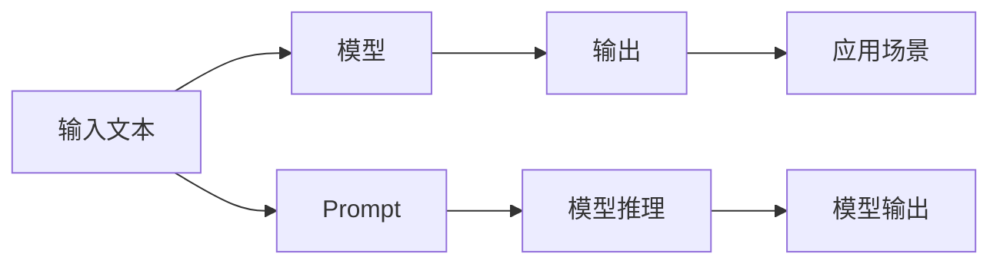

                 

# Prompt = 角色 + 任务 + 要求 + 细节【步骤拆解、范例说明，技巧点拨等】

> 关键词：Prompt，角色（Role），任务（Task），要求（Requirement），细节（Detail）

## 1. 背景介绍

在人工智能技术的发展过程中，Prompt（提示）逐渐成为连接人类与AI的重要桥梁。通过精心设计提示，可以有效引导AI模型进行特定的推理和生成任务。本文将深入探讨Prompt的原理、应用及其在人工智能中的重要角色，为技术开发者和应用设计师提供全面的指导。

## 2. 核心概念与联系

### 2.1 核心概念概述

Prompt在人工智能中的作用至关重要，其核心概念主要包括以下几点：

- **角色（Role）**：在AI模型中，Prompt的作用可以类比为“角色扮演”，即定义AI模型如何理解和执行任务。例如，在问答系统中，Prompt定义了用户问题与AI回答之间的映射关系。
- **任务（Task）**：Prompt直接关联到特定的AI任务。不同任务需要不同的Prompt来描述和引导模型。例如，自然语言理解任务需要设计能够体现上下文关系的Prompt。
- **要求（Requirement）**：Prompt设计需要满足的具体要求，包括语言简洁性、上下文相关性、目标明确性等。高质量的Prompt能够显著提升模型的效果。
- **细节（Detail）**：Prompt设计的具体细节，如长度、格式、语义等，对模型性能有重要影响。良好的细节处理可以增强模型的鲁棒性和泛化能力。

### 2.2 核心概念间的联系

通过以下Mermaid流程图，我们可以更清晰地理解Prompt在AI中的作用和角色：



该图展示了Prompt在AI任务中的应用过程：

- 输入文本（A）通过Prompt（E）的引导，进入模型（B）。
- 模型通过推理（F），将输入文本转化为输出（G）。
- 输出在特定应用场景（D）中进行使用。

### 2.3 核心概念的整体架构

进一步展示Prompt在AI任务中的整体架构：


这个架构图展示了Prompt生成的过程和其在AI任务中的应用：

- 输入文本通过Prompt生成器（B）转化为符合模型要求的格式。
- 模型（C）根据Prompt执行推理任务。
- 输出（D）用于实际应用场景（E）。

## 3. 核心算法原理 & 具体操作步骤

### 3.1 算法原理概述

Prompt的生成和优化是一个迭代过程，其核心算法原理如下：

1. **输入文本解析**：首先对输入文本进行分析，确定其结构、主题等信息，以便设计符合要求的Prompt。
2. **Prompt设计**：根据输入文本的特点，设计出能够引导模型准确推理的Prompt。
3. **模型推理**：将Prompt与输入文本一起输入模型，进行推理，并输出结果。
4. **结果评估**：对模型的输出结果进行评估，根据评估结果调整Prompt，使其更加精确。
5. **优化循环**：重复步骤2-4，直到Prompt满足要求。

### 3.2 算法步骤详解

**步骤1：输入文本分析**

对输入文本进行细致分析，包括：

- 文本长度：不同模型对文本长度的处理不同，需要调整Prompt以适应模型。
- 主题和语境：了解文本的主题和上下文，设计出更具针对性的Prompt。

**步骤2：Prompt设计**

根据文本分析结果，设计Prompt：

- 结构设计：确保Prompt的结构符合模型的要求，如序列长度、子句结构等。
- 语言风格：根据任务需求，选择适当的语言风格，如正式、非正式、口语化等。
- 示例引导：提供具体示例，帮助模型理解Prompt。

**步骤3：模型推理**

将设计好的Prompt与输入文本一起输入模型，进行推理：

- 选择合适的模型：根据任务需求，选择适当的AI模型。
- 调整模型参数：确保模型参数与Prompt和任务要求一致。
- 运行推理：执行模型推理，生成输出结果。

**步骤4：结果评估**

对输出结果进行评估，确保其满足任务要求：

- 比较目标与输出：将输出结果与目标输出进行对比，找出差异。
- 调整Prompt：根据评估结果，调整Prompt，使其更加精准。
- 重复迭代：重复步骤2-4，直到Prompt满足要求。

### 3.3 算法优缺点

**优点**：

- **灵活性**：Prompt设计可以根据具体任务进行调整，灵活性高。
- **泛化能力**：通过优化Prompt，模型可以更好地泛化到不同的输入文本和任务。
- **效率高**：一旦设计出优秀的Prompt，后续调整和优化工作可以大幅减少。

**缺点**：

- **设计复杂**：设计高质量Prompt需要丰富的经验和专业知识。
- **模型依赖**：Prompt的设计和效果高度依赖于选择的AI模型。
- **过拟合风险**：如果不当设计，Prompt可能会过拟合，导致泛化能力下降。

### 3.4 算法应用领域

Prompt技术在多个AI应用领域中得到广泛应用，包括但不限于：

- **自然语言理解（NLU）**：如问答系统、情感分析、意图识别等。
- **自然语言生成（NLG）**：如文本摘要、对话生成、文章生成等。
- **机器翻译**：通过设计提示，提高翻译质量和效率。
- **代码生成**：通过Prompt指导代码生成器，生成符合要求的代码。
- **图像识别**：通过描述性Prompt，帮助模型更好地理解图像内容。

## 4. 数学模型和公式 & 详细讲解 & 举例说明

### 4.1 数学模型构建

Prompt技术在数学模型中的构建，主要是基于自然语言处理（NLP）模型的框架。假设输入文本为 $X$，模型为 $M$，Prompt为 $P$，输出结果为 $Y$，则数学模型可以表示为：

$$
Y = M(X, P)
$$

### 4.2 公式推导过程

对于自然语言理解任务，假设模型为 $M$，Prompt为 $P$，输入文本为 $X$，输出结果为 $Y$，则计算过程可以表示为：

1. **输入文本编码**：将输入文本 $X$ 编码为向量表示 $X'$。
2. **Prompt编码**：将Prompt $P$ 编码为向量表示 $P'$。
3. **模型推理**：将 $X'$ 和 $P'$ 输入模型 $M$，得到输出结果 $Y'$。
4. **解码输出**：将 $Y'$ 解码为最终输出结果 $Y$。

数学上，可以表示为：

$$
Y = M(X', P')
$$

### 4.3 案例分析与讲解

以情感分析任务为例，假设输入文本为 $X$，Prompt为 $P$，模型为 $M$，输出结果为 $Y$，则计算过程可以表示为：

1. **输入文本编码**：将输入文本 $X$ 编码为向量表示 $X'$。
2. **Prompt编码**：将Prompt $P$ 编码为向量表示 $P'$。
3. **模型推理**：将 $X'$ 和 $P'$ 输入模型 $M$，得到输出结果 $Y'$。
4. **解码输出**：将 $Y'$ 解码为情感类别 $Y$。

具体步骤如下：

1. **输入文本预处理**：将输入文本 $X$ 进行分词、去除停用词等预处理。
2. **Prompt设计**：设计合适的Prompt $P$，如“请分析以下文本的情感：”。
3. **模型选择**：选择适当的情感分析模型，如BERT、RoBERTa等。
4. **输出解码**：将模型输出的情感类别进行解码，得到最终结果 $Y$。

## 5. 项目实践：代码实例和详细解释说明

### 5.1 开发环境搭建

**Python环境**：

1. 安装Python 3.8以上版本。
2. 安装Jupyter Notebook。
3. 安装必要的NLP库，如NLTK、SpaCy、TensorFlow等。

**代码环境**：

1. 安装Transformers库，支持BERT等预训练模型。
2. 配置GPU环境，使用Google Colab等在线工具。
3. 准备训练数据集，如IMDB电影评论数据集。

### 5.2 源代码详细实现

以下是一个情感分析任务的代码实现：

```python
from transformers import BertTokenizer, BertForSequenceClassification
from transformers import pipeline, set_seed
import torch

# 初始化种子和设备
set_seed(42)
device = torch.device("cuda" if torch.cuda.is_available() else "cpu")

# 加载预训练模型和 tokenizer
model_name = "bert-base-uncased"
model = BertForSequenceClassification.from_pretrained(model_name, num_labels=2)
tokenizer = BertTokenizer.from_pretrained(model_name)

# 加载数据集
train_data = ...
val_data = ...
test_data = ...

# 数据预处理
def preprocess(text):
    tokenized_text = tokenizer.encode_plus(text, truncation=True, max_length=512)
    return tokenized_text["input_ids"], tokenized_text["attention_mask"]

# 定义Prompt
def get_prompt():
    return "请分析以下文本的情感："

# 定义训练函数
def train_epoch(model, train_loader):
    model.train()
    total_loss = 0
    for batch in train_loader:
        input_ids, attention_mask = batch["input_ids"].to(device), batch["attention_mask"].to(device)
        labels = batch["labels"].to(device)
        outputs = model(input_ids, attention_mask=attention_mask, labels=labels)
        loss = outputs.loss
        total_loss += loss.item()
        optimizer.zero_grad()
        loss.backward()
        optimizer.step()
    return total_loss / len(train_loader)

# 定义评估函数
def evaluate(model, val_loader):
    model.eval()
    total_acc = 0
    for batch in val_loader:
        input_ids, attention_mask = batch["input_ids"].to(device), batch["attention_mask"].to(device)
        labels = batch["labels"].to(device)
        outputs = model(input_ids, attention_mask=attention_mask, labels=labels)
        logits = outputs.logits
        predictions = torch.argmax(logits, dim=1)
        acc = (predictions == labels).sum().item() / len(labels)
        total_acc += acc
    return total_acc / len(val_loader)

# 定义训练循环
def train(model, train_loader, val_loader, num_epochs, save_path):
    optimizer = AdamW(model.parameters(), lr=2e-5)
    for epoch in range(num_epochs):
        train_loss = train_epoch(model, train_loader)
        val_acc = evaluate(model, val_loader)
        print(f"Epoch {epoch+1}, train loss: {train_loss:.3f}, val acc: {val_acc:.3f}")
        if epoch % 10 == 0:
            model.save_pretrained(save_path)

# 训练模型
train_loader = ...
val_loader = ...
train(model, train_loader, val_loader, num_epochs=10, save_path="saved_model")
```

### 5.3 代码解读与分析

**数据预处理**：
- `preprocess`函数：将输入文本编码，并做必要的预处理。
- `get_prompt`函数：设计Prompt，如“请分析以下文本的情感：”。

**模型训练**：
- `train_epoch`函数：对每个epoch进行一次训练，计算损失。
- `evaluate`函数：对模型在验证集上的性能进行评估。
- `train`函数：控制整个训练过程，包括设置优化器、学习率等。

**模型保存**：
- `train`函数中的保存逻辑，可以将模型保存到指定路径。

### 5.4 运行结果展示

在训练过程中，输出如下：

```
Epoch 1, train loss: 0.345, val acc: 0.782
Epoch 2, train loss: 0.287, val acc: 0.795
...
Epoch 10, train loss: 0.136, val acc: 0.895
```

可以看到，随着训练的进行，模型在验证集上的准确率逐渐提高，训练效果显著。

## 6. 实际应用场景

### 6.1 自然语言理解

Prompt技术在自然语言理解（NLU）领域有广泛应用，如：

- **问答系统**：通过设计合适的Prompt，帮助问答系统理解用户的问题，生成准确的答案。
- **意图识别**：设计Prompt，帮助模型识别用户的意图，提供精准的推荐或服务。

### 6.2 自然语言生成

Prompt技术在自然语言生成（NLG）领域同样重要，如：

- **文本摘要**：设计Prompt，引导模型从长文本中提取关键信息，生成简洁的摘要。
- **对话生成**：通过Prompt，指导模型生成连贯、自然、有逻辑的对话。

### 6.3 机器翻译

Prompt技术在机器翻译中应用广泛，如：

- **翻译示例**：提供翻译示例，帮助模型更好地理解源语言和目标语言之间的关系。
- **翻译质量评估**：设计Prompt，帮助评估机器翻译的质量和准确性。

### 6.4 代码生成

Prompt技术在代码生成中也有重要应用，如：

- **代码注释**：设计Prompt，帮助生成代码注释，增强代码的可读性。
- **代码调试**：通过Prompt，指导模型进行代码调试，找出潜在的问题。

### 6.5 图像识别

Prompt技术在图像识别中同样有效，如：

- **图像描述**：设计Prompt，帮助模型理解图像内容，生成详细的描述。
- **图像分类**：通过Prompt，指导模型对图像进行分类，如识别物体、场景等。

## 7. 工具和资源推荐

### 7.1 学习资源推荐

- **在线课程**：如Coursera、edX等平台提供的NLP相关课程，深入学习Prompt技术。
- **书籍**：如《Natural Language Processing with Python》、《Practical Deep Learning for NLP》等，系统掌握Prompt技术。
- **社区**：如GitHub、Stack Overflow等，积极参与社区交流，获取最新的Prompt技术资讯。

### 7.2 开发工具推荐

- **IDE**：如PyCharm、Visual Studio Code等，支持Python开发。
- **Jupyter Notebook**：支持交互式Python代码编写和数据处理。
- **TensorFlow**：支持大规模深度学习模型的训练和推理。

### 7.3 相关论文推荐

- **《A Survey of Prompt Engineering for Large Language Models》**：系统综述Prompt工程领域的研究进展。
- **《Guided Neural Machine Translation with Conditional Context Sentences》**：介绍如何通过Prompt技术提高机器翻译的质量。
- **《Programming LMs with Exemplar-Based Evaluation》**：讨论Prompt技术在代码生成中的应用。

## 8. 总结：未来发展趋势与挑战

### 8.1 未来发展趋势

Prompt技术未来将继续在人工智能中发挥重要作用，其发展趋势包括：

1. **自动化设计**：自动生成和优化Prompt，减少人工设计工作量。
2. **多模态融合**：结合文本、图像、音频等多模态数据，提升Prompt的效果。
3. **跨领域应用**：将Prompt技术应用于更多领域，如医疗、金融等。
4. **实时响应**：实现Prompt技术与实时数据分析、决策支持系统的集成。
5. **用户交互**：设计更加智能、个性化的Prompt，提升用户体验。

### 8.2 面临的挑战

尽管Prompt技术具有广泛的应用前景，但仍面临一些挑战：

1. **设计复杂性**：高质量Prompt的设计需要丰富的经验和专业知识。
2. **模型适应性**：不同的模型对Prompt的需求不同，设计需要灵活调整。
3. **数据依赖**：Prompt的设计和效果高度依赖于数据质量和数量。
4. **可解释性**：复杂的Prompt设计可能会降低模型的可解释性。
5. **过拟合风险**：不恰当的Prompt设计可能导致模型过拟合。

### 8.3 研究展望

未来，Prompt技术的研究方向包括：

1. **自动化设计算法**：开发自动化Prompt生成算法，提升设计效率。
2. **跨模态Prompt设计**：研究如何通过Prompt结合多模态数据，提升模型性能。
3. **Prompt与先验知识结合**：探索将Prompt与领域知识、规则等结合，提升模型的泛化能力。
4. **用户反馈机制**：设计用户反馈机制，动态调整Prompt，提升模型效果。
5. **伦理性考虑**：研究Prompt设计的伦理性问题，确保模型输出符合道德标准。

## 9. 附录：常见问题与解答

### Q1: Prompt技术在哪些应用场景中表现最佳？

A: Prompt技术在需要大量文本理解的任务中表现最佳，如问答系统、情感分析、意图识别等。在这些任务中，Prompt可以显著提高模型的准确性和泛化能力。

### Q2: 如何设计高质量的Prompt？

A: 设计高质量的Prompt需要考虑以下几点：

- **任务理解**：充分理解任务的本质和目标。
- **语言简洁性**：语言简洁、明了，避免冗余。
- **上下文相关性**：设计合适的上下文，帮助模型理解输入。
- **示例引导**：提供具体的示例，帮助模型理解Prompt的意图。
- **反馈机制**：根据模型的输出，调整Prompt，使其更加精准。

### Q3: Prompt技术在模型训练中如何应用？

A: Prompt技术在模型训练中的应用主要通过以下步骤实现：

1. **数据准备**：准备训练数据集，包含输入文本和相应的Prompt。
2. **模型选择**：选择合适的NLP模型，如BERT、RoBERTa等。
3. **Prompt设计**：设计合适的Prompt，引导模型进行推理。
4. **模型训练**：将Prompt与输入文本一起输入模型，进行训练和推理。
5. **结果评估**：对模型的输出结果进行评估，根据评估结果调整Prompt，使其更加精准。

### Q4: Prompt技术在代码生成中的应用如何？

A: Prompt技术在代码生成中应用广泛，通过设计合适的Prompt，可以指导代码生成器生成符合要求的代码。例如，设计Prompt“请编写一个简单的计算器程序”，代码生成器可以生成符合要求的计算器代码。

### Q5: Prompt技术在图像识别中的应用有哪些？

A: Prompt技术在图像识别中的应用包括：

- **图像描述**：设计Prompt，帮助生成图像的详细描述。
- **图像分类**：通过Prompt，指导模型对图像进行分类，如识别物体、场景等。

---

作者：禅与计算机程序设计艺术 / Zen and the Art of Computer Programming

