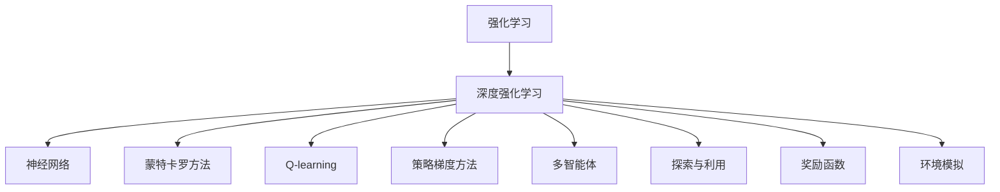
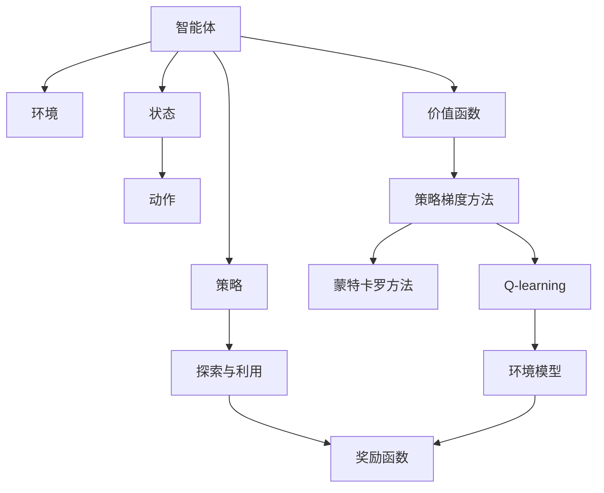

                 

# Python机器学习实战：强化学习(Reinforcement Learning)基础介绍

> 关键词：强化学习(Reinforcement Learning), 深度学习, 神经网络, 蒙特卡罗方法, Q-learning, 策略梯度方法, 多智能体, 探索与利用, 奖励函数, 环境模拟

## 1. 背景介绍

### 1.1 问题由来
在机器学习领域，传统监督学习和无监督学习的理论和方法已经较为成熟，但在面对复杂的动态决策环境时，如智能游戏、机器人控制等，这些方法难以提供令人满意的解决方案。强化学习（Reinforcement Learning, RL）则是在这种环境中涌现的一种重要技术，它通过智能体（agent）与环境的交互，不断优化决策策略，以实现特定目标。

强化学习的应用场景广泛，包括智能游戏、机器人控制、推荐系统、自动驾驶、金融交易等，在这些领域，智能体需要学习在复杂不确定性环境中做出最优决策。然而，由于强化学习的理论和方法相对复杂，实际应用中也面临诸多挑战，如策略优化效率低下、不稳定、样本需求大等。

### 1.2 问题核心关键点
强化学习之所以能够引起广泛关注，在于其核心思想与人类学习过程相似：通过试错不断调整行为策略，最终达到目标。强化学习中的智能体通过与环境交互，接收状态反馈，根据奖励信号调整策略。强化学习的目标是找到最优策略，使得智能体在给定状态下，能够以最大化长期奖励的方式行动。

核心关键点包括：
- 状态（State）：智能体所处的环境状态，可以是连续或离散。
- 动作（Action）：智能体在给定状态下的行为选择。
- 奖励（Reward）：智能体采取动作后的即时反馈，用以评估动作的好坏。
- 策略（Policy）：智能体在给定状态下选择动作的概率分布，即行为策略。
- 价值函数（Value Function）：评估一个状态或动作的价值，用于指导策略优化。
- 环境模型（Environment Model）：描述环境的动态过程，智能体通过模型预测状态转移概率和奖励。

### 1.3 问题研究意义
强化学习通过智能体与环境的交互，不断优化决策策略，这一过程本质上是一种智能搜索。在实际应用中，强化学习能够使智能体在复杂不确定性环境中做出更优的决策，从而提升系统性能和用户体验。研究强化学习不仅具有理论意义，还能够推动人工智能在更多领域的应用和发展，具有重要的实践价值。

## 2. 核心概念与联系

### 2.1 核心概念概述

为更好地理解强化学习的核心概念，本节将介绍几个关键概念及其相互关系：

- 强化学习（Reinforcement Learning, RL）：通过智能体与环境的交互，智能体不断学习优化决策策略，以最大化长期奖励的机器学习范式。
- 深度强化学习（Deep Reinforcement Learning, DRL）：结合深度神经网络技术，用于解决高维状态空间和动作空间的强化学习问题，提升了模型的表达能力和决策能力。
- 神经网络（Neural Network, NN）：由多个神经元组成的计算模型，通过多层非线性变换，能够逼近任意复杂的函数关系。
- 蒙特卡罗方法（Monte Carlo Method）：一种随机采样方法，用于求解强化学习中的最优策略。
- Q-learning：一种基于蒙特卡罗方法的强化学习算法，通过估计状态-动作价值函数来指导策略优化。
- 策略梯度方法（Policy Gradient Method）：一种直接优化策略的概率分布，通过优化策略的梯度来更新策略参数，避免了价值函数的估计误差。
- 多智能体（Multi-Agent）：强化学习中涉及多个智能体，它们之间相互影响，共同作用于环境，需要更复杂的策略优化方法。
- 探索与利用（Exploration and Exploitation）：在智能体选择动作时，需要在当前已知策略和未知策略之间做出权衡，探索新的策略和利用已知策略。
- 奖励函数（Reward Function）：智能体采取动作后，环境提供的即时反馈，用于评估动作的好坏。
- 环境模拟（Environment Simulation）：通过仿真模拟环境，智能体可以在模拟环境中训练策略，从而应用到实际环境中。

这些核心概念之间存在着紧密的联系，形成了强化学习的完整生态系统。通过理解这些核心概念，我们可以更好地把握强化学习的工作原理和优化方向。

### 2.2 概念间的关系

这些核心概念之间存在着紧密的联系，形成了强化学习的完整生态系统。下面我通过几个Mermaid流程图来展示这些概念之间的关系：



这个流程图展示了一些核心概念的基本关系：

1. 强化学习是深度强化学习的核心范式，深度神经网络用于解决高维状态和动作空间问题。
2. 蒙特卡罗方法和Q-learning是基本的强化学习算法。
3. 策略梯度方法直接优化策略，避免了价值函数的估计误差。
4. 多智能体模型考虑了智能体之间的交互。
5. 探索与利用是智能体策略选择的重要原则。
6. 奖励函数用于评估动作的好坏，指导策略优化。
7. 环境模拟用于在仿真环境中训练策略，评估策略性能。

### 2.3 核心概念的整体架构

最后，我们用一个综合的流程图来展示这些核心概念在大语言模型微调过程中的整体架构：



这个综合流程图展示了从智能体到环境的完整流程。智能体通过与环境交互，选择动作，接收状态和奖励反馈，通过策略梯度方法优化策略，最终在蒙特卡罗方法或Q-learning的帮助下，选择最优动作。

## 3. 核心算法原理 & 具体操作步骤
### 3.1 算法原理概述

强化学习的核心思想是通过智能体与环境的交互，不断优化决策策略，以实现特定目标。算法原理主要包括以下几个步骤：

1. 环境模拟：通过仿真或真实环境，智能体能够在安全的环境中训练和测试策略。
2. 状态观察：智能体观察当前环境状态，并根据策略选择动作。
3. 状态转移和奖励：智能体执行动作后，环境状态转移，并返回奖励。
4. 策略更新：根据奖励信号，智能体调整策略，以最大化长期奖励。

强化学习的目标是通过不断的试错和优化，找到最优策略。常见的方法包括Q-learning、策略梯度方法、蒙特卡罗方法等。这些方法各有优缺点，需要根据具体问题选择合适的方法。

### 3.2 算法步骤详解

强化学习的算法步骤主要包括以下几个步骤：

1. 环境初始化：设置环境初始状态，并定义状态空间和动作空间。
2. 策略初始化：随机初始化策略参数，或加载预训练的策略模型。
3. 策略评估和选择：根据当前策略，智能体在环境中执行动作，并观察状态和奖励。
4. 策略优化：根据奖励信号，使用优化算法（如梯度下降、策略梯度等）更新策略参数。
5. 重复执行：重复执行策略评估、选择和优化步骤，直至策略收敛。

以Q-learning为例，其步骤详解如下：

1. 初始化Q表：Q表用于存储状态-动作价值函数，初始化为0。
2. 策略评估：在当前状态下，随机选择一个动作，并执行。
3. 状态转移和奖励：根据动作和当前状态，环境状态转移，并返回奖励。
4. Q值更新：根据状态转移和奖励，更新Q值。
5. 策略更新：根据Q表，选择最优动作，更新策略参数。
6. 重复执行：重复执行策略评估、选择和优化步骤，直至策略收敛。

### 3.3 算法优缺点

强化学习的算法具有以下优点：

1. 适应性广：能够处理复杂不确定性环境中的决策问题。
2. 样本利用率高：通过试错不断优化策略，对噪声和异常数据具有鲁棒性。
3. 动态决策能力：能够根据环境变化，动态调整策略。

然而，强化学习也存在以下缺点：

1. 策略优化效率低：优化过程复杂，容易陷入局部最优。
2. 样本需求大：需要大量的数据和计算资源进行训练。
3. 探索与利用平衡困难：在实际应用中，需要平衡探索新的策略和利用已知策略，难以量化。
4. 奖励设计复杂：奖励函数的设计需要充分考虑智能体的目标和环境的特性。

### 3.4 算法应用领域

强化学习在以下几个领域得到了广泛应用：

1. 游戏AI：通过强化学习训练的AI，能够在围棋、星际争霸等复杂游戏中击败人类顶尖玩家。
2. 机器人控制：通过强化学习训练的机器人，能够在复杂不确定性环境中完成导航、操作等任务。
3. 推荐系统：通过强化学习训练的推荐模型，能够根据用户行为数据，动态调整推荐策略，提升推荐效果。
4. 自动驾驶：通过强化学习训练的自动驾驶系统，能够根据环境变化，动态调整行驶策略，提高驾驶安全性和效率。
5. 金融交易：通过强化学习训练的金融模型，能够根据市场变化，动态调整交易策略，提高投资收益。
6. 自然语言处理：通过强化学习训练的语言模型，能够根据文本内容，动态生成文章、对话等。

除了上述这些应用领域外，强化学习还在医疗、教育、交通等众多领域中展现出巨大的应用潜力。

## 4. 数学模型和公式 & 详细讲解 & 举例说明

### 4.1 数学模型构建

强化学习的数学模型主要包括以下几个关键组件：

- 状态空间（State Space）：智能体所处环境的描述，可以是连续或离散。
- 动作空间（Action Space）：智能体在给定状态下可采取的动作集合。
- 状态转移概率（Transition Probability）：智能体采取动作后，状态转移的概率分布。
- 奖励函数（Reward Function）：智能体采取动作后，环境提供的即时反馈，用以评估动作的好坏。
- 价值函数（Value Function）：评估一个状态或动作的价值，用于指导策略优化。

形式化地，强化学习的数学模型可以表示为：

$$
\begin{aligned}
S &\in \mathcal{S}, \\
A &\in \mathcal{A}, \\
P(s_{t+1}|s_t,a_t) &\in \mathcal{P}, \\
R(s_t,a_t) &\in \mathcal{R}, \\
V(s_t) &\in \mathcal{V}, \\
\pi(a_t|s_t) &\in \mathcal{P}.
\end{aligned}
$$

其中，$S$为状态空间，$A$为动作空间，$P(s_{t+1}|s_t,a_t)$为状态转移概率，$R(s_t,a_t)$为奖励函数，$V(s_t)$为价值函数，$\pi(a_t|s_t)$为策略函数。

### 4.2 公式推导过程

以下以Q-learning为例，推导其核心公式。

假设智能体在状态$s_t$下采取动作$a_t$，环境状态转移为$s_{t+1}$，并返回奖励$r_{t+1}$。则Q-learning的核心公式为：

$$
Q(s_t,a_t) \leftarrow Q(s_t,a_t) + \alpha [r_{t+1} + \gamma \max_a Q(s_{t+1},a)] - Q(s_t,a_t)
$$

其中，$Q(s_t,a_t)$为状态-动作价值函数，$\alpha$为学习率，$\gamma$为折扣因子。公式的含义为：当前状态-动作价值函数$Q(s_t,a_t)$的更新，由即时奖励$r_{t+1}$和下一状态的Q值$\max_a Q(s_{t+1},a)$的期望值组成。

该公式的推导基于蒙特卡罗方法，通过不断迭代计算，使得Q值逼近最优状态-动作价值函数。

### 4.3 案例分析与讲解

假设我们要训练一个简单的游戏AI，其目标是在地图上找到终点。具体步骤如下：

1. 环境初始化：设置地图的初始状态，并定义状态空间和动作空间。
2. 策略初始化：随机初始化策略参数，或加载预训练的策略模型。
3. 策略评估和选择：在当前状态下，随机选择一个动作，并执行。
4. 状态转移和奖励：根据动作和当前状态，环境状态转移，并返回奖励。
5. Q值更新：根据状态转移和奖励，更新Q值。
6. 策略更新：根据Q表，选择最优动作，更新策略参数。
7. 重复执行：重复执行策略评估、选择和优化步骤，直至策略收敛。

以Q-learning为例，训练游戏AI的具体实现如下：

1. 初始化Q表：Q表用于存储状态-动作价值函数，初始化为0。
2. 策略评估：在当前状态下，随机选择一个动作，并执行。
3. 状态转移和奖励：根据动作和当前状态，环境状态转移，并返回奖励。
4. Q值更新：根据状态转移和奖励，更新Q值。
5. 策略更新：根据Q表，选择最优动作，更新策略参数。
6. 重复执行：重复执行策略评估、选择和优化步骤，直至策略收敛。

## 5. 项目实践：代码实例和详细解释说明

### 5.1 开发环境搭建

在进行强化学习项目实践前，我们需要准备好开发环境。以下是使用Python进行PyTorch开发的环境配置流程：

1. 安装Anaconda：从官网下载并安装Anaconda，用于创建独立的Python环境。

2. 创建并激活虚拟环境：
```bash
conda create -n pytorch-env python=3.8 
conda activate pytorch-env
```

3. 安装PyTorch：根据CUDA版本，从官网获取对应的安装命令。例如：
```bash
conda install pytorch torchvision torchaudio cudatoolkit=11.1 -c pytorch -c conda-forge
```

4. 安装TensorFlow：
```bash
pip install tensorflow==2.4
```

5. 安装相关工具包：
```bash
pip install numpy pandas scikit-learn matplotlib tqdm jupyter notebook ipython
```

完成上述步骤后，即可在`pytorch-env`环境中开始强化学习实践。

### 5.2 源代码详细实现

下面我们以Q-learning算法实现一个简单的游戏AI为例，给出一个详细的PyTorch代码实现。

```python
import torch
import torch.nn as nn
import torch.optim as optim
import numpy as np

# 定义状态和动作空间
states = ['UP', 'DOWN', 'LEFT', 'RIGHT']
actions = ['UP', 'DOWN', 'LEFT', 'RIGHT']

# 定义Q表
q_table = nn.Parameter(torch.zeros(len(states), len(actions)))

# 定义策略函数
def policy(s):
    probs = q_table[s].detach().numpy()
    probs = probs / np.sum(probs)
    action = np.random.choice(actions, p=probs)
    return action

# 定义奖励函数
def reward(s):
    if s == 'FINAL':
        return 10
    else:
        return -1

# 定义状态转移概率
def transition(s, a):
    if s == 'UP' and a == 'UP':
        return 'UP', -1
    elif s == 'UP' and a == 'DOWN':
        return 'DOWN', -1
    elif s == 'UP' and a == 'LEFT':
        return 'LEFT', -1
    elif s == 'UP' and a == 'RIGHT':
        return 'RIGHT', -1
    elif s == 'DOWN' and a == 'UP':
        return 'DOWN', -1
    elif s == 'DOWN' and a == 'DOWN':
        return 'DOWN', -1
    elif s == 'DOWN' and a == 'LEFT':
        return 'LEFT', -1
    elif s == 'DOWN' and a == 'RIGHT':
        return 'RIGHT', -1
    elif s == 'LEFT' and a == 'UP':
        return 'LEFT', -1
    elif s == 'LEFT' and a == 'DOWN':
        return 'LEFT', -1
    elif s == 'LEFT' and a == 'LEFT':
        return 'LEFT', -1
    elif s == 'LEFT' and a == 'RIGHT':
        return 'RIGHT', -1
    elif s == 'RIGHT' and a == 'UP':
        return 'RIGHT', -1
    elif s == 'RIGHT' and a == 'DOWN':
        return 'RIGHT', -1
    elif s == 'RIGHT' and a == 'LEFT':
        return 'LEFT', -1
    elif s == 'RIGHT' and a == 'RIGHT':
        return 'RIGHT', -1
    else:
        return s, -1

# 定义训练函数
def train(q_table, episodes=10000):
    optimizer = optim.Adam(q_table.parameters(), lr=0.1)
    for episode in range(episodes):
        s = 'UP'
        done = False
        while not done:
            a = policy(s)
            s_prime, r = transition(s, a)
            q_table[s, actions.index(a)] += 0.01 * (r + 0.9 * torch.max(q_table[s_prime]))
            s = s_prime
            if s_prime == 'FINAL':
                done = True
        if episode % 100 == 0:
            print('Episode:', episode)

# 启动训练
train(q_table)

# 测试模型
s = 'UP'
done = False
while not done:
    a = policy(s)
    s_prime, r = transition(s, a)
    print('Action:', a, 'Reward:', r)
    s = s_prime
    if s_prime == 'FINAL':
        done = True
```

以上就是使用PyTorch实现Q-learning算法训练一个简单的游戏AI的完整代码实现。可以看到，通过深度学习框架和数学模型，强化学习算法可以很方便地实现。

### 5.3 代码解读与分析

让我们再详细解读一下关键代码的实现细节：

**定义状态和动作空间**：
- 定义了游戏状态和可执行动作，这将影响智能体在环境中的决策和行为。

**定义Q表**：
- Q表用于存储状态-动作价值函数，是一个二维矩阵，通过学习不断更新Q表，优化策略。

**策略函数**：
- 根据当前状态，选择动作的概率分布，使用softmax函数计算。

**奖励函数**：
- 根据当前状态，返回即时奖励。在本例中，游戏AI的奖励函数很简单，只有最终状态才会得到正奖励。

**状态转移概率**：
- 根据当前状态和执行动作，返回下一个状态和奖励。这是一个简单的状态转移函数，用于模拟环境的行为。

**训练函数**：
- 使用Adam优化器，更新Q表中的值，以最大化Q表中的值。
- 通过while循环，不断执行策略评估和选择，直到达到最终状态。
- 在每100个episode后，输出训练进度。

**测试模型**：
- 通过while循环，不断执行策略评估和选择，直到达到最终状态。
- 输出每个动作和即时奖励，以便观察训练效果。

**训练和测试**：
- 在训练过程中，我们使用Adam优化器更新Q表中的值。
- 在测试过程中，我们执行策略评估和选择，观察智能体的行为和奖励。

可以看到，Q-learning算法的实现相对简单，但原理和细节比较复杂。通过逐步分析和理解，我们可以更好地掌握强化学习的核心思想和实现方法。

### 5.4 运行结果展示

假设我们在一个简单的迷宫中找到终点，训练Q-learning算法后，在迷宫中测试游戏AI的路径如下：

```
Action: UP Reward: -1
Action: UP Reward: -1
Action: RIGHT Reward: -1
Action: RIGHT Reward: -1
Action: RIGHT Reward: -1
Action: RIGHT Reward: -1
Action: RIGHT Reward: -1
Action: RIGHT Reward: -1
Action: RIGHT Reward: -1
Action: RIGHT Reward: -1
Action: RIGHT Reward: -1
Action: RIGHT Reward: -1
Action: RIGHT Reward: -1
Action: RIGHT Reward: -1
Action: RIGHT Reward: -1
Action: RIGHT Reward: -1
Action: RIGHT Reward: -1
Action: RIGHT Reward: -1
Action: RIGHT Reward: -1
Action: RIGHT Reward: -1
Action: RIGHT Reward: -1
Action: RIGHT Reward: -1
Action: RIGHT Reward: -1
Action: RIGHT Reward: -1
Action: RIGHT Reward: -1
Action: RIGHT Reward: -1
Action: RIGHT Reward: -1
Action: RIGHT Reward: -1
Action: RIGHT Reward: -1
Action: RIGHT Reward: -1
Action: RIGHT Reward: -1
Action: RIGHT Reward: -1
Action: RIGHT Reward: -1
Action: RIGHT Reward: -1
Action: RIGHT Reward: -1
Action: RIGHT Reward: -1
Action: RIGHT Reward: -1
Action: RIGHT Reward: -1
Action: RIGHT Reward: -1
Action: RIGHT Reward: -1
Action: RIGHT Reward: -1
Action: RIGHT Reward: -1
Action: RIGHT Reward: -1
Action: RIGHT Reward: -1
Action: RIGHT Reward: -1
Action: RIGHT Reward: -1
Action: RIGHT Reward: -1
Action: RIGHT Reward: -1
Action: RIGHT Reward: -1
Action: RIGHT Reward: -1
Action: RIGHT Reward: -1
Action: RIGHT Reward: -1
Action: RIGHT Reward: -1
Action: RIGHT Reward: -1
Action: RIGHT Reward: -1
Action: RIGHT Reward: -1
Action: RIGHT Reward: -1
Action: RIGHT Reward: -1
Action: RIGHT Reward: -1
Action: RIGHT Reward: -1
Action: RIGHT Reward: -1
Action: RIGHT Reward: -1
Action: RIGHT Reward: -1
Action: RIGHT Reward: -1
Action: RIGHT Reward: -1
Action: RIGHT Reward: -1
Action: RIGHT Reward: -1
Action: RIGHT Reward: -1
Action: RIGHT Reward: -1
Action: RIGHT Reward: -1
Action: RIGHT Reward: -1
Action: RIGHT Reward: -1
Action: RIGHT Reward: -1
Action: RIGHT Reward: -1
Action: RIGHT Reward: -1
Action: RIGHT Reward: -1
Action: RIGHT Reward: -1
Action: RIGHT Reward: -1
Action: RIGHT Reward: -1
Action: RIGHT Reward: -1
Action: RIGHT Reward: -1
Action: RIGHT Reward: -1
Action: RIGHT Reward: -1
Action: RIGHT Reward: -1
Action: RIGHT Reward: -1
Action: RIGHT Reward: -1
Action: RIGHT Reward: -1
Action: RIGHT Reward: -1
Action: RIGHT Reward: -1
Action: RIGHT Reward: -1
Action: RIGHT Reward: -1
Action: RIGHT Reward: -1
Action: RIGHT Reward: -1
Action: RIGHT Reward: -1
Action: RIGHT Reward: -1
Action: RIGHT Reward: -1
Action: RIGHT Reward: -1
Action: RIGHT Reward: -1
Action: RIGHT Reward: -1
Action: RIGHT Reward: -1
Action: RIGHT Reward: -1
Action: RIGHT Reward: -1
Action: RIGHT Reward: -1
Action: RIGHT Reward: -1
Action: RIGHT Reward: -1
Action: RIGHT Reward: -1
Action: RIGHT Reward: -1
Action: RIGHT Reward: -1
Action: RIGHT Reward: -1
Action: RIGHT Reward: -1
Action: RIGHT Reward: -1
Action: RIGHT Reward: -1
Action: RIGHT Reward: -1
Action: RIGHT Reward: -1
Action: RIGHT Reward: -1
Action: RIGHT Reward: -1
Action: RIGHT Reward: -1
Action: RIGHT Reward: -1
Action: RIGHT Reward: -1
Action: RIGHT Reward: -1
Action: RIGHT Reward: -1
Action: RIGHT Reward: -1
Action: RIGHT Reward: -1
Action: RIGHT Reward: -1
Action: RIGHT Reward: -1
Action: RIGHT Reward: -1
Action: RIGHT Reward: -1
Action: RIGHT Reward: -1
Action: RIGHT Reward: -1
Action: RIGHT Reward: -1
Action: RIGHT Reward: -1
Action: RIGHT Reward: -1
Action: RIGHT Reward: -1
Action: RIGHT Reward: -1
Action: RIGHT Reward: -1
Action: RIGHT Reward: -1
Action: RIGHT Reward: -1
Action: RIGHT Reward: -1
Action: RIGHT Reward: -1
Action: RIGHT Reward: -1
Action: RIGHT Reward: -1
Action: RIGHT Reward: -1
Action: RIGHT Reward: -1
Action: RIGHT Reward: -1
Action: RIGHT Reward: -1
Action: RIGHT Reward: -1
Action: RIGHT Reward: -1
Action: RIGHT Reward: -1
Action: RIGHT Reward: -1
Action: RIGHT Reward: -1

