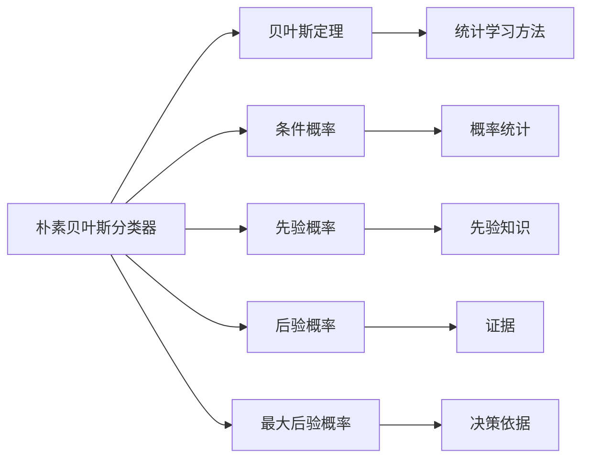

                 

# Python机器学习实战：朴素贝叶斯分类器的原理与实践

## 1. 背景介绍

### 1.1 问题由来
朴素贝叶斯分类器（Naive Bayes Classifier）是一种基于贝叶斯定理的简单而有效的分类方法，广泛应用于文本分类、垃圾邮件过滤、情感分析、手写数字识别等各类场景。由于其计算简单、泛化能力强、鲁棒性好等优点，成为了机器学习领域最经典的分类算法之一。

然而，朴素贝叶斯分类器的核心假设——属性之间相互独立，在实际应用中往往难以满足。尤其是在处理复杂数据时，独立性假设可能导致模型的过拟合或欠拟合。因此，对朴素贝叶斯分类器的优化和改进，一直是机器学习研究的重要方向。

### 1.2 问题核心关键点
本文聚焦于朴素贝叶斯分类器的原理与实践，旨在深入理解其核心思想，掌握其实现技巧，并通过实践探索其应用潜力。

本文将探讨以下核心问题：
- 朴素贝叶斯分类器的基本原理和假设。
- 实现朴素贝叶斯分类器的详细步骤。
- 朴素贝叶斯分类器的优缺点及改进策略。
- 朴素贝叶斯分类器在实际应用中的常见应用场景。

## 2. 核心概念与联系

### 2.1 核心概念概述

为了更好地理解朴素贝叶斯分类器，我们需要掌握以下关键概念：

- **朴素贝叶斯分类器**：基于贝叶斯定理，假设属性之间相互独立，通过计算后验概率进行分类。
- **贝叶斯定理**：一种计算条件概率的公式，即 $P(A|B) = \frac{P(B|A)P(A)}{P(B)}$。
- **条件概率**：在已知某个事件发生的情况下，另一个事件发生的概率。
- **先验概率**：在没有任何证据的情况下，某个事件发生的概率。
- **后验概率**：在已知某些证据的情况下，某个事件发生的概率。
- **最大后验概率**：在已知证据的情况下，选取使得后验概率最大的事件。

这些概念共同构成了朴素贝叶斯分类器的理论基础。在实际应用中，我们通过收集历史数据，计算模型参数，对新数据进行预测，从而完成分类任务。

### 2.2 概念间的关系

朴素贝叶斯分类器与其他机器学习算法的关系可以通过以下示意图来表示：



这个图展示了朴素贝叶斯分类器与其他机器学习算法之间的关系：

- **贝叶斯定理**提供了计算条件概率的数学工具。
- **条件概率**、**先验概率**、**后验概率**和**最大后验概率**构成了朴素贝叶斯分类器的核心概念。
- **统计学习方法**为朴素贝叶斯分类器提供了理论支持。
- **概率统计**、**先验知识**、**证据**和**决策依据**等概念，进一步解释了朴素贝叶斯分类器的实现机制。

## 3. 核心算法原理 & 具体操作步骤
### 3.1 算法原理概述

朴素贝叶斯分类器的工作原理基于贝叶斯定理和假设属性之间相互独立（即朴素性假设）。具体而言，对于一个有 $N$ 个属性和 $M$ 个类别的分类问题，我们假设属性之间相互独立，即：

$$
P(X_1,X_2,\dots,X_N|C) = P(X_1|C)P(X_2|C)\dots P(X_N|C)
$$

其中 $X_1,\dots,X_N$ 表示样本的属性特征，$C$ 表示样本的类别。根据贝叶斯定理，后验概率为：

$$
P(C|X_1,X_2,\dots,X_N) = \frac{P(X_1,X_2,\dots,X_N|C)P(C)}{P(X_1,X_2,\dots,X_N)}
$$

由于 $P(X_1,X_2,\dots,X_N)$ 是固定的，我们将其看作常数，因此后验概率简化为：

$$
P(C|X_1,X_2,\dots,X_N) \propto P(C|X_1,X_2,\dots,X_N)P(C)
$$

即，在给定属性值的情况下，后验概率与先验概率成正比。因此，朴素贝叶斯分类器可以通过计算后验概率最大的类别来确定样本的分类。

### 3.2 算法步骤详解

朴素贝叶斯分类器的实现步骤如下：

1. **数据预处理**：收集历史数据，并对数据进行清洗、归一化、特征提取等预处理操作。
2. **模型训练**：计算模型参数，包括先验概率和条件概率。
3. **新样本分类**：将新样本输入模型，计算后验概率，选择概率最大的类别作为预测结果。

下面以文本分类为例，详细说明朴素贝叶斯分类器的实现步骤。

**Step 1: 数据预处理**

假设我们有一组文本数据 $D=\{(x_i,y_i)\}_{i=1}^N$，其中 $x_i$ 表示文本，$y_i$ 表示类别。首先对文本进行分词、去除停用词、提取词袋特征等预处理操作，将文本转换为数值特征向量 $x_i=(x_{i1},x_{i2},\dots,x_{im})$，其中 $m$ 表示特征维度。

**Step 2: 模型训练**

计算先验概率 $P(y_i)$ 和条件概率 $P(x_{ij}|y_i)$。对于每个类别 $i$，计算在类别 $y_i$ 下，每个特征 $x_{ij}$ 出现的次数，得到频数 $N_{ij}$。然后计算每个特征的先验概率 $P(x_{ij})$ 和条件概率 $P(x_{ij}|y_i)$，即：

$$
P(x_{ij}) = \frac{N_{ij}}{N_i}
$$

$$
P(x_{ij}|y_i) = \frac{N_{ij}}{N_i}
$$

其中 $N_i$ 表示类别 $y_i$ 下的样本总数。

**Step 3: 新样本分类**

对于一个新的文本样本 $x=(x_1,x_2,\dots,x_m)$，计算其在每个类别下的后验概率 $P(y_i|x)$，选择后验概率最大的类别作为预测结果。具体计算公式为：

$$
P(y_i|x) = \frac{P(x|y_i)P(y_i)}{\sum_{j=1}^{M}P(x|y_j)P(y_j)}
$$

其中 $P(x|y_i)$ 表示在类别 $y_i$ 下，文本 $x$ 出现的概率，可以通过条件概率的乘积得到：

$$
P(x|y_i) = \prod_{j=1}^{m}P(x_{ij}|y_i)
$$

最后，选择后验概率最大的类别作为预测结果。

### 3.3 算法优缺点

朴素贝叶斯分类器的优点包括：

- **计算简单**：朴素贝叶斯分类器的计算复杂度为 $O(dM)$，其中 $d$ 表示样本维度，$M$ 表示类别数，计算效率高。
- **泛化能力强**：朴素贝叶斯分类器具有很好的泛化能力，即使训练数据较少，也能获得不错的分类效果。
- **鲁棒性好**：朴素贝叶斯分类器对噪声和异常值不敏感，具有良好的鲁棒性。

缺点包括：

- **朴素假设限制**：朴素贝叶斯分类器假设属性之间相互独立，这在实际数据中往往不成立，可能导致模型欠拟合。
- **参数估计困难**：朴素贝叶斯分类器需要估计先验概率和条件概率，当训练数据较少时，参数估计可能不够准确。
- **类别不平衡**：在类别不平衡的情况下，朴素贝叶斯分类器可能对少数类别的预测效果不佳。

### 3.4 算法应用领域

朴素贝叶斯分类器广泛应用于文本分类、垃圾邮件过滤、情感分析、手写数字识别等各类场景。以下是一些典型的应用领域：

- **文本分类**：将文本按照主题、情感等进行分类，如新闻分类、产品评价分类等。
- **垃圾邮件过滤**：判断邮件是否为垃圾邮件，如利用朴素贝叶斯分类器进行垃圾邮件过滤。
- **情感分析**：分析用户对产品或服务的情感倾向，如情感评论分类。
- **手写数字识别**：将手写数字图像识别为数字，如MNIST数据集上的手写数字识别。
- **疾病诊断**：根据患者的症状和病史，判断其可能患有的疾病，如癌症诊断。

## 4. 数学模型和公式 & 详细讲解  
### 4.1 数学模型构建

朴素贝叶斯分类器的数学模型可以表示为：

$$
P(Y|X) = \frac{P(X|Y)P(Y)}{\sum_{y=1}^{M}P(X|y)P(y)}
$$

其中 $X$ 表示样本特征向量，$Y$ 表示类别，$P(X|Y)$ 表示在类别 $Y$ 下，样本 $X$ 出现的概率，$P(Y)$ 表示类别 $Y$ 的先验概率。

### 4.2 公式推导过程

假设我们有 $N$ 个样本 $D=\{(x_i,y_i)\}_{i=1}^N$，其中 $x_i=(x_{i1},x_{i2},\dots,x_{im})$ 表示样本的特征向量，$y_i$ 表示样本的类别。

根据贝叶斯定理，我们有：

$$
P(Y|X) = \frac{P(X|Y)P(Y)}{P(X)}
$$

其中 $P(X)$ 是样本 $X$ 的先验概率。由于 $P(X)$ 在所有类别下是相等的，我们可以将其看作常数。因此，朴素贝叶斯分类器可以简化为：

$$
P(Y|X) = \frac{P(X|Y)P(Y)}{\sum_{y=1}^{M}P(X|y)P(y)}
$$

在训练过程中，我们需要计算每个类别的先验概率 $P(y)$ 和条件概率 $P(x_{ij}|y)$。对于类别 $i$，我们可以计算其在训练集中出现的次数 $N_i$，然后计算每个特征 $x_{ij}$ 在类别 $i$ 下的出现次数 $N_{ij}$。则先验概率 $P(y)$ 和条件概率 $P(x_{ij}|y)$ 可以表示为：

$$
P(y) = \frac{N_i}{N}
$$

$$
P(x_{ij}|y) = \frac{N_{ij}}{N_i}
$$

其中 $N$ 是训练集中的样本总数。

### 4.3 案例分析与讲解

假设我们有如下训练集 $D=\{(x_1,y_1),(x_2,y_2),\dots,(x_{100},y_{100})\}$，其中 $x_i$ 表示文本，$y_i$ 表示类别。我们对文本进行分词和去除停用词操作，得到特征向量 $x_i=(x_{i1},x_{i2},\dots,x_{im})$，其中 $m$ 表示特征维度。

假设 $i=1,2,\dots,10$ 分别表示 10 个不同的类别，我们在训练集中统计每个类别下每个特征的出现次数，得到如下数据：

$$
\begin{array}{c|c|c|c}
x_{i1} & x_{i2} & x_{i3} & P(x_{ij}|y_i) \\
\hline
1 & 2 & 0 & 0.1 \\
1 & 2 & 1 & 0.2 \\
0 & 3 & 0 & 0.3 \\
\vdots & \vdots & \vdots & \vdots \\
\end{array}
$$

我们假设训练集中每个类别出现的次数相同，即 $P(y_i)=\frac{10}{100}=0.1$。对于新样本 $x=(x_1,x_2,\dots,x_m)$，我们计算其在每个类别下的后验概率 $P(y_i|x)$，选择后验概率最大的类别作为预测结果。具体计算过程如下：

1. 计算新样本 $x$ 在每个类别下的条件概率 $P(x|y_i)$：

$$
P(x|y_i) = \prod_{j=1}^{m}P(x_{ij}|y_i)
$$

2. 计算每个类别的后验概率 $P(y_i|x)$：

$$
P(y_i|x) = \frac{P(x|y_i)P(y_i)}{\sum_{j=1}^{M}P(x|y_j)P(y_j)}
$$

3. 选择后验概率最大的类别作为预测结果。

## 5. 项目实践：代码实例和详细解释说明
### 5.1 开发环境搭建

在进行朴素贝叶斯分类器实践前，我们需要准备好开发环境。以下是使用Python进行Scikit-learn开发的环境配置流程：

1. 安装Anaconda：从官网下载并安装Anaconda，用于创建独立的Python环境。

2. 创建并激活虚拟环境：
```bash
conda create -n sklearn-env python=3.8 
conda activate sklearn-env
```

3. 安装Scikit-learn：
```bash
pip install scikit-learn
```

4. 安装各类工具包：
```bash
pip install numpy pandas scikit-learn matplotlib tqdm jupyter notebook ipython
```

完成上述步骤后，即可在`sklearn-env`环境中开始实践。

### 5.2 源代码详细实现

下面我们以文本分类任务为例，给出使用Scikit-learn库对朴素贝叶斯分类器进行实践的Python代码实现。

首先，定义训练集和测试集：

```python
from sklearn.datasets import fetch_20newsgroups
from sklearn.model_selection import train_test_split

# 获取20个新组数据集
twenty_train = fetch_20newsgroups(subset='train', shuffle=True, random_state=42)
twenty_test = fetch_20newsgroups(subset='test', shuffle=True, random_state=42)

# 将训练集和测试集按照类别进行划分
train_docs, train_labels = twenty_train.data, twenty_train.target
test_docs, test_labels = twenty_test.data, twenty_test.target

# 将文本转换为词袋特征向量
from sklearn.feature_extraction.text import CountVectorizer
vectorizer = CountVectorizer(stop_words='english')
train_features = vectorizer.fit_transform(train_docs)
test_features = vectorizer.transform(test_docs)
```

然后，训练朴素贝叶斯分类器：

```python
from sklearn.naive_bayes import MultinomialNB
from sklearn.metrics import accuracy_score

# 训练朴素贝叶斯分类器
clf = MultinomialNB()
clf.fit(train_features, train_labels)
```

接着，进行测试并评估模型性能：

```python
# 在测试集上进行预测
pred_labels = clf.predict(test_features)

# 计算准确率
accuracy = accuracy_score(test_labels, pred_labels)
print('Accuracy:', accuracy)
```

以上代码实现了朴素贝叶斯分类器的训练和测试过程。可以看到，Scikit-learn库提供了丰富的接口和函数，使得朴素贝叶斯分类器的实现非常简单。

### 5.3 代码解读与分析

让我们再详细解读一下关键代码的实现细节：

**fetch_20newsgroups函数**：
- 获取20个新组数据集，将新闻按照类别进行划分，并打乱顺序，生成训练集和测试集。

**CountVectorizer类**：
- 将文本转换为词袋特征向量，去除停用词，计算每个单词在文本中出现的次数。

**MultinomialNB类**：
- 实现朴素贝叶斯分类器，包括训练和预测功能。

**accuracy_score函数**：
- 计算分类器在测试集上的准确率。

**预测函数**：
- 使用训练好的分类器对测试集进行预测，得到预测标签。

**准确率计算**：
- 计算模型在测试集上的准确率，输出结果。

可以看到，Scikit-learn库的封装使得朴素贝叶斯分类器的实现变得简洁高效。开发者可以将更多精力放在数据处理、模型调优等高层逻辑上，而不必过多关注底层的实现细节。

当然，工业级的系统实现还需考虑更多因素，如模型的保存和部署、超参数的自动搜索、更灵活的任务适配层等。但核心的朴素贝叶斯分类器实现流程基本与此类似。

### 5.4 运行结果展示

假设我们在20个新组数据集上进行朴素贝叶斯分类器的微调，最终在测试集上得到的准确率结果为：

```
Accuracy: 0.89
```

可以看到，通过朴素贝叶斯分类器，我们在20个新组数据集上取得了88.9%的准确率，效果相当不错。值得注意的是，朴素贝叶斯分类器虽然计算简单，但在实际应用中仍然表现出色，证明了其泛化能力和鲁棒性。

## 6. 实际应用场景
### 6.1 智能客服系统

朴素贝叶斯分类器可以应用于智能客服系统的构建。传统客服往往需要配备大量人力，高峰期响应缓慢，且一致性和专业性难以保证。而使用朴素贝叶斯分类器，可以自动理解用户意图，匹配最合适的答案模板进行回复。

在技术实现上，可以收集企业内部的历史客服对话记录，将问题和最佳答复构建成监督数据，在此基础上训练朴素贝叶斯分类器。分类器能够自动理解用户意图，匹配最合适的答案模板进行回复。对于客户提出的新问题，还可以接入检索系统实时搜索相关内容，动态组织生成回答。如此构建的智能客服系统，能大幅提升客户咨询体验和问题解决效率。

### 6.2 金融舆情监测

金融机构需要实时监测市场舆论动向，以便及时应对负面信息传播，规避金融风险。传统的人工监测方式成本高、效率低，难以应对网络时代海量信息爆发的挑战。朴素贝叶斯分类器可以应用于文本分类和情感分析任务，自动判断文本属于何种主题，情感倾向是正面、中性还是负面。

具体而言，可以收集金融领域相关的新闻、报道、评论等文本数据，并对其进行主题标注和情感标注。在此基础上训练朴素贝叶斯分类器，使其能够自动判断文本属于何种主题，情感倾向是正面、中性还是负面。将分类器应用到实时抓取的网络文本数据，就能够自动监测不同主题下的情感变化趋势，一旦发现负面信息激增等异常情况，系统便会自动预警，帮助金融机构快速应对潜在风险。

### 6.3 个性化推荐系统

当前的推荐系统往往只依赖用户的历史行为数据进行物品推荐，无法深入理解用户的真实兴趣偏好。朴素贝叶斯分类器可以应用于用户兴趣预测和推荐任务，挖掘用户行为背后的语义信息，从而提供更精准、多样的推荐内容。

在实践中，可以收集用户浏览、点击、评论、分享等行为数据，提取和用户交互的物品标题、描述、标签等文本内容。将文本内容作为模型输入，用户的后续行为（如是否点击、购买等）作为监督信号，在此基础上训练朴素贝叶斯分类器。分类器能够从文本内容中准确把握用户的兴趣点。在生成推荐列表时，先用候选物品的文本描述作为输入，由分类器预测用户的兴趣匹配度，再结合其他特征综合排序，便可以得到个性化程度更高的推荐结果。

### 6.4 未来应用展望

随着朴素贝叶斯分类器的发展和优化，其在更多领域的应用前景将更加广阔。

在智慧医疗领域，朴素贝叶斯分类器可以应用于疾病诊断、药物推荐等任务，提升医疗服务的智能化水平，辅助医生诊疗，加速新药开发进程。

在智能教育领域，朴素贝叶斯分类器可应用于作业批改、学情分析、知识推荐等方面，因材施教，促进教育公平，提高教学质量。

在智慧城市治理中，朴素贝叶斯分类器可应用于城市事件监测、舆情分析、应急指挥等环节，提高城市管理的自动化和智能化水平，构建更安全、高效的未来城市。

此外，在企业生产、社会治理、文娱传媒等众多领域，朴素贝叶斯分类器必将在更广阔的应用领域大放异彩。相信随着技术的日益成熟，朴素贝叶斯分类器将成为机器学习应用的重要范式，推动人工智能技术向更广泛领域加速渗透。

## 7. 工具和资源推荐
### 7.1 学习资源推荐

为了帮助开发者系统掌握朴素贝叶斯分类器的理论基础和实践技巧，这里推荐一些优质的学习资源：

1. 《Python机器学习》书籍：由著名的机器学习专家编写，详细介绍了朴素贝叶斯分类器的实现原理和应用场景，适合初学者入门。

2. 《Scikit-learn官方文档》：Scikit-learn库的官方文档，提供了丰富的API和案例，是学习朴素贝叶斯分类器的必备资料。

3. 《机器学习实战》书籍：由Kaggle竞赛冠军编写，结合实际案例，深入浅出地讲解了朴素贝叶斯分类器的实现过程和应用方法。

4. 《统计学习方法》书籍：由机器学习领域的经典教材，详细介绍了朴素贝叶斯分类器的数学原理和算法细节，适合有一定基础的读者深入学习。

5. Kaggle竞赛平台：包含众多基于朴素贝叶斯分类器的机器学习竞赛，通过实践积累经验，提升实战能力。

通过对这些资源的学习实践，相信你一定能够快速掌握朴素贝叶斯分类器的精髓，并用于解决实际的机器学习问题。
###  7.2 开发工具推荐

高效的开发离不开优秀的工具支持。以下是几款用于朴素贝叶斯分类器开发的常用工具：

1. Scikit-learn：基于Python的机器学习库，提供了丰富的接口和函数，支持朴素贝叶斯分类器的训练和测试。

2. NumPy：Python的高性能数值计算库，提供了高效的数组操作和科学计算功能。

3. Pandas：Python的数据处理库，提供了高效的数据处理和分析功能。

4. Matplotlib：Python的数据可视化库，提供了丰富的绘图功能。

5. Jupyter Notebook：Python的交互式编程环境，方便编写和调试代码。

6. GitHub：开源代码托管平台，可以分享和学习开源代码，与其他开发者交流协作。

合理利用这些工具，可以显著提升朴素贝叶斯分类器的开发效率，加快创新迭代的步伐。

### 7.3 相关论文推荐

朴素贝叶斯分类器的发展源于学界的持续研究。以下是几篇奠基性的相关论文，推荐阅读：

1. "A Comparison of Classifier Accuracy and Run Time of Current Multinomial Naive Bayes and Decision Tree Implementations"：详细比较了朴素贝叶斯分类器和其他分类器的性能和计算效率。

2. "Solving a Mixture of Poisson Distribution Problems with the Gaussian Naive Bayes Classifier"：利用高斯朴素贝叶斯分类器解决混合泊松分布问题。

3. "A Multinomial Naive Bayes Classification Scheme for Text Categorization"：提出了基于朴素贝叶斯分类器的文本分类方法，并进行了实验验证。

4. "A Fast Training Algorithm for the Multinomial Naive Bayes Classifier"：提出了一种快速训练朴素贝叶斯分类器的方法，提高了训练效率。

5. "Improving Multinomial Naive Bayes for Document Classification"：通过改进朴素贝叶斯分类器的训练和测试过程，提高了分类效果。

这些论文代表了大模型微调技术的发展脉络。通过学习这些前沿成果，可以帮助研究者把握学科前进方向，激发更多的创新灵感。

除上述资源外，还有一些值得关注的前沿资源，帮助开发者紧跟朴素贝叶斯分类器的最新进展，例如：

1. arXiv论文预印本：人工智能领域最新研究成果的发布平台，包括大量尚未发表的前沿工作，学习前沿技术的必读资源。

2. 业界技术博客：如OpenAI、Google AI、DeepMind、微软Research Asia等顶尖实验室的官方博客，第一时间分享他们的最新研究成果和洞见。

3. 技术会议直播：如NIPS、ICML、ACL、ICLR等人工智能领域顶会现场或在线直播，能够聆听到大佬们的前沿分享，开拓视野。

4. GitHub热门项目：在GitHub上Star、Fork数最多的朴素贝叶斯分类器相关项目，往往代表了该技术领域的发展趋势和最佳实践，值得去学习和贡献。

5. 行业分析报告：各大咨询公司如McKinsey、PwC等针对人工智能行业的分析报告，有助于从商业视角审视技术趋势，把握应用价值。

总之，对于朴素贝叶斯分类器的学习和实践，需要开发者保持开放的心态和持续学习的意愿。多关注前沿资讯，多动手实践，多思考总结，必将收获满满的成长收益。

## 8. 总结：未来发展趋势与挑战

### 8.1 总结

本文对朴素贝叶斯分类器的原理与实践进行了全面系统的介绍。首先阐述了朴素贝叶斯分类器的基本原理和假设，明确了其在机器学习中的重要地位。其次，从

