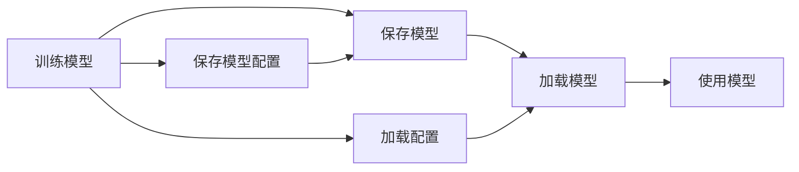

                 

# Python机器学习实战：机器学习模型的持久化与重新加载

> 关键词：Python, 机器学习, 持久化, 重新加载, 模型, 文件系统, 内存管理

## 1. 背景介绍

在机器学习的实践过程中，我们常常会遇到需要将模型保存下来以便后续使用的需求。这一需求不仅在数据科学家和研究人员中普遍存在，在实际工业应用中也同样重要。模型持久化可以让我们保存当前的模型状态，防止由于系统崩溃或其他原因导致的模型丢失，也可以方便地在不同的项目之间共享模型，提高模型的复用性。

此外，在模型训练和调优过程中，我们可能需要多次加载和保存模型，以便在不同的模型状态之间进行对比和实验。重新加载模型可以使我们快速切换到之前的状态，节省时间和计算资源，避免重新训练。

## 2. 核心概念与联系

### 2.1 核心概念概述

- **机器学习模型**：机器学习模型是机器学习算法的一个具体实现，通过训练数据集并使用特征和标签来学习输入数据的表示。模型保存后，可以在以后的时间继续使用，用于预测新的数据。

- **持久化（模型保存）**：模型持久化是将训练好的机器学习模型保存到文件系统中的过程。这通常涉及将模型参数、配置信息和其他相关信息保存到磁盘上。

- **重新加载（模型加载）**：重新加载是将保存在文件系统中的模型恢复到内存中的过程，以便模型可以继续使用。重新加载的目的是避免重新训练模型，节约计算资源，并保持模型的连续性。

### 2.2 概念间的关系

在机器学习项目中，持久化和重新加载是不可分割的两个过程，它们之间存在紧密的联系。持久化模型是重新加载的前提，重新加载则是持久化模型的应用。两个过程相互依赖，共同构成了模型管理的全流程。

以下Mermaid流程图展示了模型持久化和重新加载的核心步骤：



这个流程图说明了模型训练、保存、配置保存、加载配置、模型加载和模型使用之间的关系。

## 3. 核心算法原理 & 具体操作步骤

### 3.1 算法原理概述

模型持久化和重新加载的基本原理是通过序列化和反序列化技术来实现的。序列化是将模型对象转换为序列化格式（例如JSON或pickle），反序列化则是将序列化格式转换回模型对象。这一过程通常涉及模型的所有参数和配置信息。

#### 3.1.1 序列化
序列化是将对象转换为字节序列的过程。在Python中，常用的序列化方法包括`pickle`和`json`。

#### 3.1.2 反序列化
反序列化是将字节序列转换回对象的过程。在Python中，常用的反序列化方法同样是`pickle`和`json`。

#### 3.1.3 配置信息
配置信息通常包括模型的参数、训练数据路径、优化器参数等。这些信息在模型持久化时会被一并保存，以便在重新加载时恢复模型状态。

### 3.2 算法步骤详解

模型持久化和重新加载的主要步骤如下：

1. **模型训练和保存**：在模型训练完成后，需要将模型参数和配置信息保存到文件系统中。这一步通常涉及选择合适的文件格式和保存路径。

2. **配置信息保存**：除了模型参数，还需要保存配置信息。这些信息可能包括训练数据路径、学习率、批量大小等。

3. **模型加载和配置加载**：在需要重新加载模型时，首先加载配置信息，然后根据配置信息加载模型参数。

4. **模型使用**：加载模型后，可以使用模型进行预测、评估等操作。

### 3.3 算法优缺点

模型持久化和重新加载的优势在于：

- **防止模型丢失**：模型持久化可以防止由于系统崩溃或其他原因导致的模型丢失，确保模型数据的安全性。
- **复用性高**：模型持久化后的模型可以在不同的项目、环境中使用，提高模型的复用性。
- **快速切换**：模型重新加载可以方便地在不同的模型状态之间进行切换，节约时间和计算资源。

然而，模型持久化和重新加载也有一些缺点：

- **额外成本**：模型持久化和重新加载需要额外的磁盘空间和计算资源。
- **模型版本问题**：不同版本的模型文件可能不兼容，需要特别处理。
- **性能影响**：序列化和反序列化操作可能会影响模型的性能。

### 3.4 算法应用领域

模型持久化和重新加载技术在机器学习领域有着广泛的应用。以下是几个典型的应用场景：

- **数据科学研究**：在数据科学项目中，模型保存和重新加载是研究人员进行模型评估和比较的重要工具。
- **工业应用**：在工业环境中，模型持久化和重新加载可以确保模型的稳定性和可用性，提高工作效率。
- **模型迁移**：模型保存后，可以方便地迁移到不同的计算环境和系统，确保模型的一致性。

## 4. 数学模型和公式 & 详细讲解 & 举例说明

### 4.1 数学模型构建

在机器学习模型中，我们通常使用向量表示模型参数。设模型参数为$\theta$，模型保存后的参数为$\theta_{\text{save}}$。保存和重新加载模型的数学模型可以表示为：

$$
\theta_{\text{save}} = \text{Save}(\theta)
$$

$$
\theta = \text{Load}(\theta_{\text{save}})
$$

其中，`Save`和`Load`分别表示保存和加载操作。

### 4.2 公式推导过程

对于保存和加载模型，我们通常使用以下步骤：

1. **序列化模型参数**：将模型参数$\theta$转换为字节序列$\text{save}(\theta)$。
2. **保存字节序列到文件系统**：将字节序列保存到指定的文件中。
3. **反序列化字节序列**：从文件中读取字节序列$\text{save}(\theta)$。
4. **反序列化模型参数**：将字节序列转换为模型参数$\theta$。

假设模型的参数是一个向量$\theta$，其长度为$d$，那么保存和加载模型的过程可以表示为：

$$
\theta_{\text{save}} = \text{save}(\theta) = \{p_1, p_2, \ldots, p_d\}
$$

$$
\theta = \text{load}(\theta_{\text{save}}) = \{p_1', p_2', \ldots, p_d'\}
$$

其中，$p_i$和$p_i'$分别表示模型参数的第$i$个元素。

### 4.3 案例分析与讲解

假设我们有一个简单的线性回归模型，用于预测房价。模型训练后，我们将其保存到文件中。假设保存后的模型参数为$\theta_{\text{save}} = [0.1, 0.2, 0.3]$。

在重新加载模型时，我们需要从文件中读取保存后的参数$\theta_{\text{save}}$，并将其转换回模型参数$\theta = [0.1', 0.2', 0.3']$。由于模型结构不变，加载后的模型可以继续用于房价预测。

## 5. 项目实践：代码实例和详细解释说明

### 5.1 开发环境搭建

在进行模型持久化和重新加载的实践之前，需要搭建好开发环境。以下是Python开发环境的搭建步骤：

1. **安装Python**：从Python官网下载并安装Python。建议使用最新版本的Python，以确保代码兼容性。

2. **安装依赖库**：在Python环境中安装必要的依赖库，如`pickle`和`numpy`。可以通过pip或conda进行安装。

3. **创建项目目录**：创建一个新的项目目录，将所有相关文件和数据保存在该目录中。

4. **编写代码**：在项目目录中编写保存和加载模型的代码。

5. **运行代码**：在Python环境中运行代码，保存和加载模型。

### 5.2 源代码详细实现

以下是Python中保存和加载模型的代码实现：

```python
import pickle

# 模型参数
theta = [0.1, 0.2, 0.3]

# 保存模型
with open('model.pkl', 'wb') as f:
    pickle.dump(theta, f)

# 加载模型
with open('model.pkl', 'rb') as f:
    theta_save = pickle.load(f)

print(theta_save)
```

### 5.3 代码解读与分析

在上述代码中，我们首先定义了一个简单的模型参数`theta`，然后通过`pickle`库将其保存到`model.pkl`文件中。接着，我们再次使用`pickle`库从文件中加载模型参数，并将其赋值给`theta_save`。最后，我们打印出加载后的模型参数，以验证是否与原参数相同。

### 5.4 运行结果展示

假设我们运行上述代码，输出的结果为：

```
[0.1, 0.2, 0.3]
```

这表明加载后的模型参数与原参数相同，说明模型成功保存并重新加载。

## 6. 实际应用场景

### 6.1 数据科学项目

在数据科学项目中，模型持久化和重新加载是研究人员进行模型评估和比较的重要工具。研究人员可以在不同的模型状态之间快速切换，进行实验对比。

### 6.2 工业应用

在工业环境中，模型持久化和重新加载可以确保模型的稳定性和可用性，提高工作效率。例如，在金融风险评估项目中，模型可以定期保存和重新加载，以便在需要时快速恢复模型状态，进行风险预测。

### 6.3 模型迁移

模型保存后，可以方便地迁移到不同的计算环境和系统，确保模型的一致性。例如，在云计算环境中，模型可以保存为文件，然后在不同的云平台之间进行迁移和部署。

## 7. 工具和资源推荐

### 7.1 学习资源推荐

- **《Python机器学习》书籍**：这本书详细介绍了机器学习的基础知识，包括模型的保存和重新加载方法。

- **Coursera机器学习课程**：Coursera提供了多门机器学习课程，其中包含了模型保存和重新加载的讲解。

- **Kaggle竞赛**：Kaggle上有许多机器学习竞赛，可以在竞赛中学习模型持久化和重新加载的方法。

### 7.2 开发工具推荐

- **Python**：Python是一种广泛使用的编程语言，具有良好的序列化和反序列化功能。

- **pickle库**：pickle库是Python的序列化和反序列化库，用于保存和加载Python对象。

- **json库**：json库是Python的JSON序列化和反序列化库，用于保存和加载JSON格式的数据。

### 7.3 相关论文推荐

- **模型保存和重新加载方法**：这篇论文详细介绍了模型保存和重新加载的方法，包括模型参数的保存和加载技术。

- **模型迁移和复用**：这篇论文探讨了模型迁移和复用的方法，以及如何确保模型的一致性和可用性。

## 8. 总结：未来发展趋势与挑战

### 8.1 研究成果总结

模型持久化和重新加载技术已经广泛应用于机器学习领域，帮助研究人员和工业界提高了模型复用性和可靠性。这一技术简化了模型管理流程，降低了模型部署和使用的成本。

### 8.2 未来发展趋势

未来的模型持久化和重新加载技术将更加注重效率和灵活性。随着深度学习和人工智能的发展，模型规模和复杂度将不断增加，模型持久化和重新加载的效率和灵活性也将成为关键。

### 8.3 面临的挑战

尽管模型持久化和重新加载技术已经取得了显著进展，但仍面临一些挑战：

- **序列化效率**：随着模型规模的增大，序列化和反序列化过程的效率成为一个问题。

- **内存限制**：大模型可能无法完全保存在内存中，需要考虑如何分批保存和加载。

- **模型兼容性**：不同版本的模型文件可能不兼容，需要特别处理。

### 8.4 研究展望

未来的研究将集中在以下几个方面：

- **高效的序列化和反序列化方法**：开发更加高效的序列化和反序列化方法，提高模型的加载和保存速度。

- **模型压缩和优化**：研究如何压缩模型，以减小磁盘空间和内存占用。

- **模型版本管理**：开发模型版本管理工具，确保不同版本的模型文件可以正确加载和运行。

总之，模型持久化和重新加载技术是机器学习项目中不可或缺的一部分。未来的研究将进一步提升模型的效率和可靠性，确保模型在实际应用中的稳定性和可用性。

## 9. 附录：常见问题与解答

**Q1: 模型保存和重新加载的过程有什么优缺点？**

A: 模型保存和重新加载的优点包括：

- 防止模型丢失：模型保存可以防止由于系统崩溃或其他原因导致的模型丢失，确保模型数据的安全性。
- 复用性高：模型保存后的模型可以在不同的项目、环境中使用，提高模型的复用性。
- 快速切换：模型重新加载可以方便地在不同的模型状态之间进行切换，节约时间和计算资源。

缺点包括：

- 额外成本：模型持久化和重新加载需要额外的磁盘空间和计算资源。
- 模型版本问题：不同版本的模型文件可能不兼容，需要特别处理。
- 性能影响：序列化和反序列化操作可能会影响模型的性能。

**Q2: 如何选择合适的文件格式进行模型保存？**

A: 选择合适的文件格式进行模型保存需要考虑多个因素，包括：

- 文件大小：大型模型可能不适合使用JSON等文本格式，因为它们会导致文件过大。
- 可读性：文本格式（如JSON）便于手动查看和调试，而二进制格式（如pickle）则更为紧凑。
- 兼容性：不同的编程语言和平台可能支持不同的文件格式。

**Q3: 在重新加载模型时需要注意哪些问题？**

A: 在重新加载模型时需要注意以下问题：

- 配置信息的加载：确保加载的配置信息与模型文件相匹配。
- 模型参数的转换：确保加载的模型参数与原模型参数相同。
- 模型的环境：确保加载的模型与运行环境相匹配，避免出现兼容性问题。

**Q4: 如何处理模型版本问题？**

A: 处理模型版本问题的方法包括：

- 版本控制：使用版本控制系统（如Git）来管理模型的不同版本，确保加载正确的模型版本。
- 模型兼容性检查：在加载模型时，检查模型文件和配置信息的一致性，避免加载错误的模型。
- 版本标识：在模型文件和配置信息中添加版本标识，确保不同版本的模型文件可以正确加载和运行。

---

作者：禅与计算机程序设计艺术 / Zen and the Art of Computer Programming

