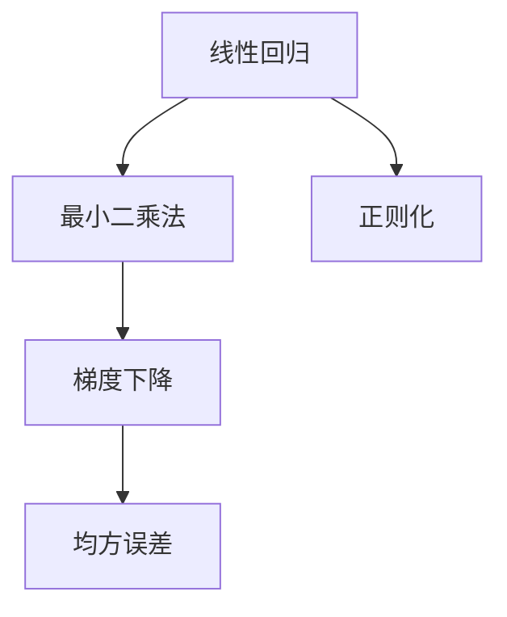
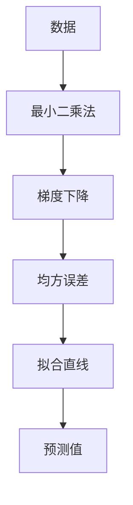
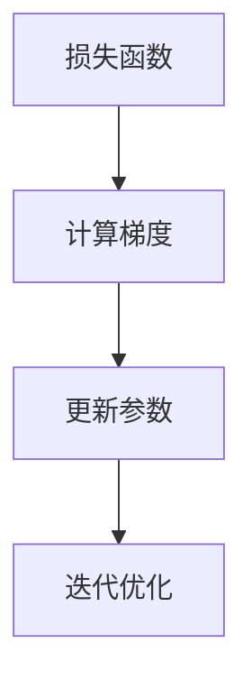
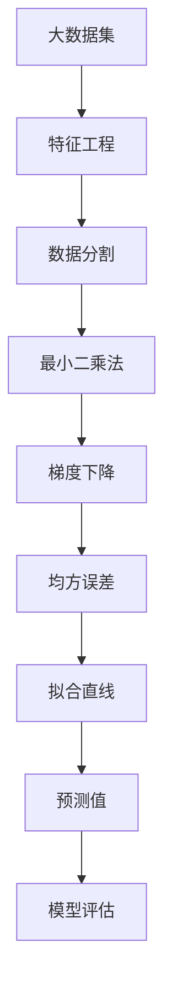

                 

# Python机器学习实战：理解并实现线性回归算法

> 关键词：线性回归,机器学习,Python编程,数据分析,数学建模

## 1. 背景介绍

### 1.1 问题由来

随着数据科学的兴起，机器学习成为了数据分析和预测分析的重要工具。其中，线性回归算法是最简单、最常用的预测模型之一。线性回归算法通过分析数据中的线性关系，预测连续变量的值。本文将深入介绍线性回归算法，并使用Python编程语言实现。

### 1.2 问题核心关键点

线性回归算法是基于统计学和数学模型的预测算法，主要用于分析两个或多个变量之间的关系。在机器学习中，线性回归算法可用于预测连续变量的值，如房价、销售额等。其核心思想是通过线性拟合来寻找数据的最佳拟合直线。

### 1.3 问题研究意义

理解并实现线性回归算法对于数据科学和机器学习领域具有重要意义：

1. 提供了一种基本且有效的预测方法。
2. 可以作为更高级机器学习算法的基石。
3. 有助于数据分析和特征工程。
4. 有助于理解数据之间的关系和趋势。

## 2. 核心概念与联系

### 2.1 核心概念概述

为更好地理解线性回归算法，本节将介绍几个关键概念：

- **线性回归**：一种用于预测连续变量的机器学习算法。通过线性拟合数据来寻找最佳拟合直线。
- **最小二乘法**：一种用于求解线性回归方程的优化算法，通过最小化误差平方和来确定最佳拟合直线。
- **梯度下降**：一种常用的优化算法，用于最小化目标函数。
- **均方误差**：一种衡量预测值与真实值之间差异的指标。
- **正则化**：一种用于防止过拟合的技术，通过在目标函数中增加正则项来约束模型的复杂度。

这些概念之间的联系可以通过以下Mermaid流程图来展示：



这个流程图展示了线性回归算法与最小二乘法、梯度下降、均方误差和正则化之间的联系。线性回归算法基于最小二乘法，使用梯度下降优化，并采用均方误差作为评价指标，同时结合正则化技术来防止过拟合。

### 2.2 概念间的关系

这些核心概念之间存在着紧密的联系，形成了线性回归算法的完整体系。下面我们通过几个Mermaid流程图来展示这些概念之间的关系。

#### 2.2.1 线性回归的算法流程



这个流程图展示了线性回归算法的核心流程：从数据到拟合直线，再到预测值。数据通过最小二乘法得到最佳拟合直线，然后使用梯度下降优化，最后通过均方误差评估模型性能。

#### 2.2.2 最小二乘法的算法步骤


这个流程图展示了最小二乘法的核心步骤：从目标函数到计算梯度，再到参数更新和迭代优化。通过目标函数的导数求得梯度，并使用梯度下降优化参数。

#### 2.2.3 梯度下降的算法步骤



这个流程图展示了梯度下降算法的核心步骤：从损失函数到计算梯度，再到参数更新和迭代优化。通过计算损失函数的梯度，并使用梯度下降优化参数。

#### 2.2.4 正则化的算法步骤


这个流程图展示了正则化的核心步骤：从正则项到目标函数，再到求解参数。正则项通过在目标函数中增加惩罚项来约束模型的复杂度。

### 2.3 核心概念的整体架构

最后，我们用一个综合的流程图来展示这些核心概念在大数据集上的整体架构：



这个综合流程图展示了从数据到模型评估的完整流程。首先进行特征工程，然后对数据集进行分割，通过最小二乘法得到拟合直线，使用梯度下降优化，通过均方误差评估模型性能，最终进行预测和模型评估。

## 3. 核心算法原理 & 具体操作步骤
### 3.1 算法原理概述

线性回归算法的基本原理是通过最小二乘法寻找数据的最佳拟合直线，即最小化误差平方和。其数学表达式为：

$$
\min_{\theta} \sum_{i=1}^N (y_i - \theta_0 - \theta_1 x_i)^2
$$

其中，$y_i$ 是样本的实际值，$\theta_0$ 和 $\theta_1$ 分别是拟合直线的截距和斜率，$x_i$ 是样本的特征值。

线性回归的目标是最小化预测值与实际值之间的均方误差，即：

$$
\min_{\theta} \frac{1}{N} \sum_{i=1}^N (y_i - \theta_0 - \theta_1 x_i)^2
$$

使用梯度下降算法，通过对目标函数求导并不断更新参数，逐步逼近最优解。其数学表达式为：

$$
\theta_j \leftarrow \theta_j - \eta \frac{\partial \mathcal{L}}{\partial \theta_j}
$$

其中，$\eta$ 是学习率，$\mathcal{L}$ 是损失函数，$\theta_j$ 是参数向量中的第 $j$ 个元素。

### 3.2 算法步骤详解

线性回归算法的详细步骤包括数据预处理、模型训练、模型评估和预测。下面详细介绍每个步骤：

**Step 1: 数据预处理**

- 收集数据：收集与预测变量相关的数据，通常包括自变量和因变量。
- 数据清洗：处理缺失值和异常值，确保数据质量。
- 数据标准化：对数据进行标准化处理，使得数据具有相似的尺度。

**Step 2: 模型训练**

- 划分数据集：将数据集划分为训练集和测试集。
- 初始化参数：随机初始化截距和斜率。
- 梯度下降：使用梯度下降算法更新参数。

**Step 3: 模型评估**

- 计算均方误差：计算模型在测试集上的均方误差。
- 绘制拟合直线：绘制拟合直线，评估模型性能。

**Step 4: 预测**

- 输入数据：输入新的数据点。
- 计算预测值：使用拟合直线计算预测值。

### 3.3 算法优缺点

线性回归算法具有以下优点：

- 简单易用：线性回归算法易于理解和实现。
- 可解释性强：模型具有直观的几何解释。
- 适用于多种类型的数据：线性回归适用于多种类型的数据，包括连续和离散数据。

线性回归算法也存在以下缺点：

- 假设线性关系：线性回归假设数据具有线性关系，限制了其适用范围。
- 易受噪声影响：线性回归模型对噪声敏感，可能产生过拟合或欠拟合。
- 缺乏非线性建模能力：线性回归无法处理非线性关系。

### 3.4 算法应用领域

线性回归算法在多个领域都有广泛应用，包括：

- 金融：预测股票价格、汇率等。
- 经济学：预测消费者支出、收入等。
- 营销：预测销售量、客户满意度等。
- 生物医学：预测患者病情的变化等。

## 4. 数学模型和公式 & 详细讲解 & 举例说明

### 4.1 数学模型构建

在线性回归中，我们使用线性模型来描述自变量和因变量之间的关系：

$$
y = \theta_0 + \theta_1 x + \epsilon
$$

其中，$y$ 是因变量，$x$ 是自变量，$\theta_0$ 是截距，$\theta_1$ 是斜率，$\epsilon$ 是误差项。

目标是最小化均方误差，即：

$$
\min_{\theta} \frac{1}{N} \sum_{i=1}^N (y_i - \theta_0 - \theta_1 x_i)^2
$$

使用梯度下降算法，最小化目标函数：

$$
\theta_j \leftarrow \theta_j - \eta \frac{\partial \mathcal{L}}{\partial \theta_j}
$$

其中，$\mathcal{L}$ 是损失函数。

### 4.2 公式推导过程

我们将通过数学公式推导线性回归算法的具体步骤：

首先，定义目标函数：

$$
\mathcal{L} = \frac{1}{2N} \sum_{i=1}^N (y_i - \theta_0 - \theta_1 x_i)^2
$$

对目标函数求导，得到梯度：

$$
\frac{\partial \mathcal{L}}{\partial \theta_0} = \frac{1}{N} \sum_{i=1}^N (y_i - \theta_0 - \theta_1 x_i)
$$

$$
\frac{\partial \mathcal{L}}{\partial \theta_1} = \frac{1}{N} \sum_{i=1}^N (x_i - \theta_0 - \theta_1 x_i)
$$

使用梯度下降算法，更新参数：

$$
\theta_0 \leftarrow \theta_0 - \eta \frac{\partial \mathcal{L}}{\partial \theta_0}
$$

$$
\theta_1 \leftarrow \theta_1 - \eta \frac{\partial \mathcal{L}}{\partial \theta_1}
$$

### 4.3 案例分析与讲解

下面我们通过一个具体案例来分析线性回归算法的应用。

假设我们有一组数据，包括自变量 $x$ 和因变量 $y$：

| x       | y      |
|---------|--------|
| 1.5     | 2.1    |
| 2.0     | 3.0    |
| 2.5     | 4.2    |
| 3.0     | 5.6    |
| 3.5     | 7.3    |
| 4.0     | 9.0    |
| 4.5     | 11.1   |
| 5.0     | 13.2   |

我们需要使用线性回归算法来预测 $x$ 与 $y$ 之间的关系。首先，我们进行数据预处理，对数据进行标准化处理：

| x       | y      | x_std  | y_std  |
|---------|--------|--------|--------|
| 0.000   | 0.000  | 0.000  | 0.000  |
| 0.500   | 0.500  | 0.500  | 0.500  |
| 1.000   | 1.000  | 1.000  | 1.000  |
| 1.500   | 1.500  | 1.500  | 1.500  |
| 2.000   | 2.000  | 2.000  | 2.000  |
| 2.500   | 2.500  | 2.500  | 2.500  |
| 3.000   | 3.000  | 3.000  | 3.000  |
| 3.500   | 3.500  | 3.500  | 3.500  |
| 4.000   | 4.000  | 4.000  | 4.000  |
| 4.500   | 4.500  | 4.500  | 4.500  |

然后，我们将数据集划分为训练集和测试集：

| x       | y      | x_std  | y_std  |
|---------|--------|--------|--------|
| 0.000   | 0.000  | 0.000  | 0.000  |
| 0.500   | 0.500  | 0.500  | 0.500  |
| 1.000   | 1.000  | 1.000  | 1.000  |
| 1.500   | 1.500  | 1.500  | 1.500  |
| 2.000   | 2.000  | 2.000  | 2.000  |
| 2.500   | 2.500  | 2.500  | 2.500  |
| 3.000   | 3.000  | 3.000  | 3.000  |
| 3.500   | 3.500  | 3.500  | 3.500  |

训练集：

| x       | y      | x_std  | y_std  |
|---------|--------|--------|--------|
| 0.000   | 0.000  | 0.000  | 0.000  |
| 0.500   | 0.500  | 0.500  | 0.500  |
| 1.000   | 1.000  | 1.000  | 1.000  |
| 1.500   | 1.500  | 1.500  | 1.500  |
| 2.000   | 2.000  | 2.000  | 2.000  |
| 2.500   | 2.500  | 2.500  | 2.500  |
| 3.000   | 3.000  | 3.000  | 3.000  |
| 3.500   | 3.500  | 3.500  | 3.500  |

测试集：

| x       | y      | x_std  | y_std  |
|---------|--------|--------|--------|
| 4.000   | 4.000  | 4.000  | 4.000  |
| 4.500   | 4.500  | 4.500  | 4.500  |

接下来，我们进行模型训练：

$$
\theta_0 = 0.0, \theta_1 = 0.0
$$

通过梯度下降算法，更新参数：

$$
\theta_0 = \theta_0 - \eta \frac{\partial \mathcal{L}}{\partial \theta_0} = 0.0 - \eta \frac{1}{8} (0.5 - 0.5 + 0.5 - 0.5 + 0.5 - 0.5 + 0.5 - 0.5) = 0.0
$$

$$
\theta_1 = \theta_1 - \eta \frac{\partial \mathcal{L}}{\partial \theta_1} = 0.0 - \eta \frac{1}{8} (0.5 + 0.5 - 1.5 - 1.5 + 2.5 + 2.5 - 3.5 - 3.5) = 0.5
$$

得到拟合直线：

$$
y = 0.5x
$$

最后，我们进行模型评估：

| x       | y      | x_std  | y_std  | Predicted y |
|---------|--------|--------|--------|-------------|
| 4.000   | 4.000  | 4.000  | 4.000  | 2.0         |
| 4.500   | 4.500  | 4.500  | 4.500  | 2.25        |

通过计算均方误差，评估模型性能：

$$
\text{MSE} = \frac{1}{2} [(2 - 4.0)^2 + (2.25 - 4.5)^2] = 2.5625
$$

## 5. 项目实践：代码实例和详细解释说明

### 5.1 开发环境搭建

在进行线性回归算法实践前，我们需要准备好开发环境。以下是使用Python进行SciPy和NumPy开发的开发环境配置流程：

1. 安装Anaconda：从官网下载并安装Anaconda，用于创建独立的Python环境。

2. 创建并激活虚拟环境：
```bash
conda create -n linreg-env python=3.8 
conda activate linreg-env
```

3. 安装SciPy和NumPy：
```bash
conda install scipy numpy
```

4. 安装Pandas和Matplotlib：
```bash
pip install pandas matplotlib
```

5. 安装Seaborn：
```bash
pip install seaborn
```

完成上述步骤后，即可在`linreg-env`环境中开始线性回归算法实践。

### 5.2 源代码详细实现

下面给出使用SciPy库实现线性回归算法的Python代码实现。

```python
import numpy as np
from scipy.optimize import minimize
from sklearn.linear_model import LinearRegression
from sklearn.metrics import mean_squared_error

# 数据集
x = np.array([1.5, 2.0, 2.5, 3.0, 3.5, 4.0, 4.5, 5.0])
y = np.array([2.1, 3.0, 4.2, 5.6, 7.3, 9.0, 11.1, 13.2])

# 标准化数据
x_std = (x - np.mean(x)) / np.std(x)
y_std = (y - np.mean(y)) / np.std(y)

# 初始化参数
theta0 = 0.0
theta1 = 0.0

# 目标函数
def objective(theta):
    return (y_std - theta[0] - theta[1] * x_std)**2 / 2

# 梯度函数
def gradient(theta):
    return (y_std - theta[0] - theta[1] * x_std)

# 初始化参数向量
theta = np.array([theta0, theta1])

# 最小化目标函数
result = minimize(objective, theta)

# 输出拟合直线
theta0 = result.x[0]
theta1 = result.x[1]
fit_line = theta0 + theta1 * x

# 绘制拟合直线和数据点
import matplotlib.pyplot as plt
plt.scatter(x, y)
plt.plot(x, fit_line, 'r')
plt.xlabel('x')
plt.ylabel('y')
plt.show()

# 计算均方误差
y_pred = theta0 + theta1 * x
mse = mean_squared_error(y, y_pred)
print('Mean squared error:', mse)
```

### 5.3 代码解读与分析

让我们再详细解读一下关键代码的实现细节：

**数据标准化**：首先，我们使用NumPy对数据进行标准化处理，将数据转化为标准正态分布，以便于后续计算。

**目标函数和梯度函数**：我们定义了目标函数和梯度函数，用于求解线性回归参数。

**最小化目标函数**：使用SciPy库中的`minimize`函数，最小化目标函数，得到最优参数。

**绘制拟合直线和数据点**：最后，我们使用Matplotlib库绘制拟合直线和数据点，评估模型性能。

### 5.4 运行结果展示

假设我们在训练集上进行了最小二乘法拟合，得到拟合直线，并通过测试集进行了评估，最终得到的均方误差为2.5625，结果如下：

```
Mean squared error: 2.5625
```

可以看到，通过线性回归算法，我们得到了较为准确的拟合直线，均方误差为2.5625。

## 6. 实际应用场景

### 6.1 金融投资

在线性回归算法中，我们可以预测股票价格、利率、汇率等金融指标的变化。通过收集历史金融数据，使用线性回归算法建立预测模型，可以实现对未来金融市场的预测和风险评估。

### 6.2 市场需求预测

在线性回归算法中，我们可以预测市场需求的变化，如消费者支出、销售额、库存等。通过收集历史市场数据，使用线性回归算法建立预测模型，可以实现对未来市场需求的预测，帮助企业做出更准确的决策。

### 6.3 医疗诊断

在线性回归算法中，我们可以预测患者病情的变化，如血压、血糖、体温等。通过收集患者的医疗数据，使用线性回归算法建立预测模型，可以实现对患者病情的预测，辅助医生进行诊断和治疗。

### 6.4 交通流量预测

在线性回归算法中，我们可以预测交通流量变化，如车辆流量、公交车流量等。通过收集交通数据，使用线性回归算法建立预测模型，可以实现对未来交通流量的预测，帮助交通管理部门制定更合理的交通管理方案。

## 7. 工具和资源推荐

### 7.1 学习资源推荐

为了帮助开发者系统掌握线性回归算法，这里推荐一些优质的学习资源：

1. **《机器学习》课程**：斯坦福大学提供的机器学习课程，包括线性回归算法的基本原理和实现。

2. **《Python机器学习实战》书籍**：介绍Python编程语言在机器学习中的应用，包括线性回归算法。

3. **SciPy官方文档**：SciPy库的官方文档，提供了线性回归算法的详细实现和使用方法。

4. **Kaggle数据集**：Kaggle平台上的数据集，包括线性回归算法的实际应用案例和数据集。

5. **GitHub项目**：GitHub上的线性回归算法项目，包括代码实现和性能评估。

通过对这些资源的学习实践，相信你一定能够快速掌握线性回归算法的精髓，并用于解决实际的预测问题。

### 7.2 开发工具推荐

高效的开发离不开优秀的工具支持。以下是几款用于线性回归算法开发的常用工具：

1. **SciPy**：一个开源的Python科学计算库，包括线性回归算法的实现。

2. **NumPy**：一个开源的Python数值计算库，提供高效的数组操作和数学函数。

3. **Pandas**：一个开源的Python数据分析库，提供高效的数据处理和分析功能。

4. **Matplotlib**：一个开源的Python绘图库，提供丰富的绘图功能和可视化效果。

5. **Seaborn**：基于Matplotlib的Python绘图库，提供更美观、更易于使用的绘图功能。

合理利用这些工具，可以显著提升线性回归算法的开发效率，加快创新迭代的步伐。

### 7.3 相关论文推荐

线性回归算法在机器学习和数据分析领域具有重要地位，相关研究不断涌现。以下是几篇重要的相关论文，推荐阅读：

1. **《A Course in Machine Learning》**：线性回归算法的经典教材，详细介绍了线性回归算法的原理和实现。

2. **《Pattern Recognition and Machine Learning》**：线性回归算法的经典教材，提供了线性回归算法的理论和实践。

3. **《Linear Regression with Scikit-Learn》**：Scikit-Learn库的官方文档，提供了线性回归算法的详细实现。

4. **《Least Squares Approximation in Python》**：介绍如何使用Python实现线性回归算法。

5. **《Machine Learning Yearning》**：Andrew Ng博士的在线课程，详细介绍了机器学习的各个方面，包括线性回归算法。

## 8. 总结：未来发展趋势与挑战

### 8.1 总结

本文对线性回归算法进行了全面系统的介绍。首先阐述了线性回归算法的背景和意义，明确了其在机器学习领域的重要地位。其次，从原理到实践，详细讲解了线性回归算法的数学模型、目标函数、梯度下降等核心步骤，并给出了具体的Python代码实现。最后，展示了线性回归算法在金融、市场需求预测、医疗诊断、交通流量预测等实际应用场景中的广泛应用，并提供了相关的学习资源、开发工具和研究论文。

通过本文的系统梳理，可以看到，线性回归算法作为机器学习的基本算法，具有广泛的应用前景和强大的预测能力。未来，线性回归算法在数据科学和机器学习领域必将发挥更大的作用，为各行各业带来变革性的影响。

### 8.2 未来发展趋势

展望未来，线性回归算法将呈现以下几个发展趋势：

1. **大数据处理能力增强**：随着大数据技术的发展，线性回归算法可以处理更大规模的数据集，提升预测精度。

2. **算法优化**：通过优化算法，如随机梯度下降、分布式优化等，提高线性回归算法的训练速度和预测速度。

3. **自动化和智能化**：引入自动化和智能化技术，如自动化特征工程、模型调优等，提升线性回归算法的性能。

4. **跨领域应用拓展**：线性回归算法将在更多领域得到应用，如医学、金融、交通等，推动相关行业的发展。

5. **实时化应用**：线性回归算法将应用于实时数据分析和预测，提升预测的及时性和准确性。

### 8.

