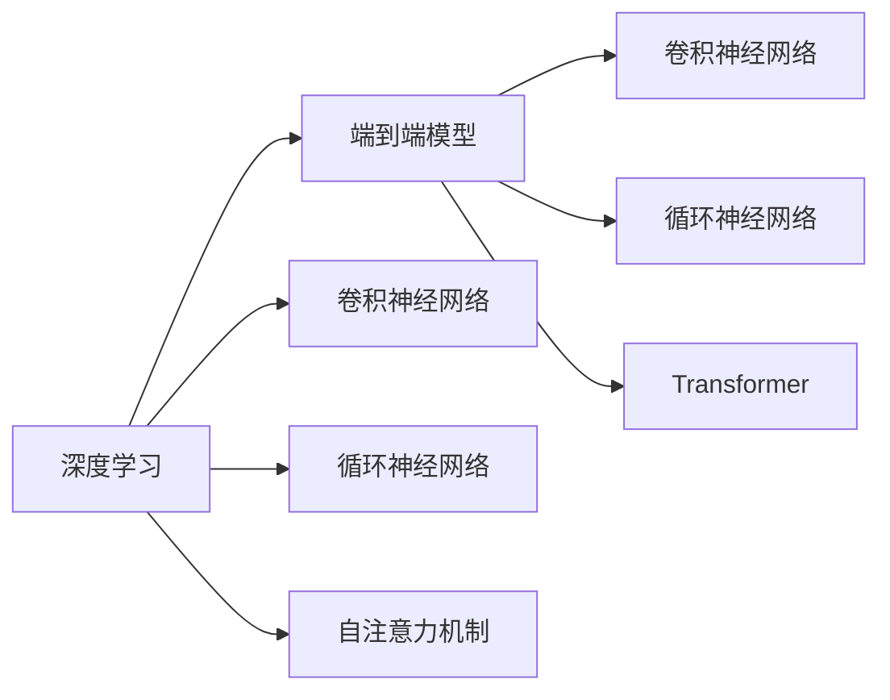
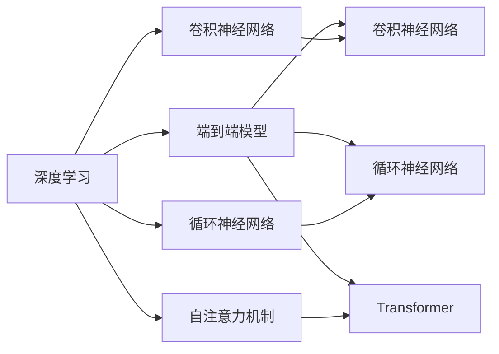
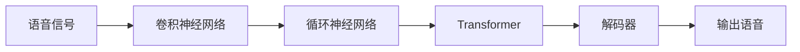

                 

# Python深度学习实践：实时语音转换技术探索

> 关键词：深度学习,语音转换,实时处理,神经网络,PyTorch

## 1. 背景介绍

### 1.1 问题由来
随着人工智能技术的不断发展，深度学习在语音识别、语音合成等领域的应用日益广泛。其中，语音转换技术通过将一个说话人的语音转换为另一个说话人的语音，广泛应用于语音导航、在线客服、虚拟主播等领域，为人们提供了更加自然流畅的语音交互体验。然而，传统的语音转换技术通常依赖于大规模标注数据集和复杂的神经网络模型，存在计算量大、实时性差等问题。

近年来，随着端到端学习技术的发展，基于深度学习的实时语音转换技术逐渐成为研究热点。这些技术通过直接对语音信号进行编码和解码，无需额外的语音识别和文本转换步骤，显著提升了转换效率和实时性。本文将对这一领域的最新研究进展进行详细探讨，介绍其核心概念、关键技术和具体实现方法。

### 1.2 问题核心关键点
实时语音转换技术的核心在于使用深度学习模型对语音信号进行编码和解码，从而实现语音的转换。其主要挑战包括：
1. **端到端模型设计**：设计高效的神经网络模型，直接对语音信号进行编码和解码。
2. **计算资源优化**：在资源受限的设备上实现高效的实时处理。
3. **语音质量保证**：确保转换后的语音在音质、语调等方面与原始语音保持一致。
4. **通用性**：构建可适应不同说话人、不同转换任务的技术框架。

解决这些挑战需要多学科的交叉合作，包括语音信号处理、深度学习、计算机视觉等领域的知识。本文将重点介绍实时语音转换技术中的关键技术和算法原理，并给出具体的代码实现示例。

### 1.3 问题研究意义
实时语音转换技术具有广泛的应用前景，能够显著提升人机交互的自然性和便利性。其研究意义主要体现在：
1. **提升用户体验**：在智能语音助手、虚拟主播等场景中，实时语音转换技术使得语音交互更加自然流畅。
2. **拓展应用场景**：语音转换技术可以应用于多语种翻译、语音合成、自动字幕生成等领域，推动人工智能技术的普及。
3. **促进跨领域合作**：语音转换技术的进步需要语音信号处理、深度学习、计算机视觉等多个领域的协同创新。
4. **加速行业应用**：语音转换技术在在线客服、语音导航等领域的应用，将为相关行业带来新的商业机会和增长点。

## 2. 核心概念与联系

### 2.1 核心概念概述

为更好地理解实时语音转换技术，我们首先介绍几个关键概念及其联系：

- **深度学习**：一种基于神经网络的学习范式，通过多层非线性变换，从大量数据中学习高维特征表示，广泛应用于图像识别、语音识别等领域。
- **端到端模型**：直接对输入数据进行处理并输出结果的模型，无需中间步骤，例如语音转换模型。
- **卷积神经网络(CNN)**：一种广泛应用于图像处理和语音信号处理的深度学习模型，通过卷积操作提取局部特征。
- **循环神经网络(RNN)**：一种处理序列数据的深度学习模型，常用于语音识别、语言模型等领域。
- **自注意力机制(Attention)**：一种在神经网络中引入的机制，用于提高模型对关键信息的关注度，应用于语音转换中的编码器-解码器架构。
- **Transformer**：一种基于自注意力机制的深度学习模型，广泛应用于语音转换、机器翻译等领域，展示了端到端学习的强大能力。

这些核心概念之间通过以下Mermaid流程图来展示：



这个流程图展示了深度学习、端到端模型以及相关神经网络之间的联系和应用。

### 2.2 概念间的关系

这些核心概念之间的关系可以通过以下Mermaid流程图来展示：



这个流程图展示了深度学习通过卷积神经网络、循环神经网络等模型进行特征提取，并通过自注意力机制和Transformer等模型进行编码和解码，最终得到端到端模型，实现了语音信号的实时转换。

### 2.3 核心概念的整体架构

最后，我们用一个综合的流程图来展示这些核心概念在大语言模型微调过程中的整体架构：



这个综合流程图展示了从语音信号输入到输出语音的整个处理流程。语音信号首先通过卷积神经网络进行特征提取，接着通过循环神经网络进行序列建模，再通过Transformer进行端到端编码，最后通过解码器进行语音生成，最终输出转换后的语音信号。

## 3. 核心算法原理 & 具体操作步骤
### 3.1 算法原理概述

实时语音转换技术的核心在于使用深度学习模型对语音信号进行编码和解码，从而实现语音的转换。以下是其实现原理：

1. **特征提取**：使用卷积神经网络对输入语音信号进行特征提取，得到高维特征向量。
2. **序列建模**：使用循环神经网络对提取的特征进行序列建模，捕捉语音信号的动态特征。
3. **编码器**：通过Transformer等模型对序列特征进行编码，得到高维语义表示。
4. **解码器**：使用循环神经网络或Transformer对语义表示进行解码，生成转换后的语音信号。
5. **后处理**：对解码器输出的语音信号进行后处理，如去噪、速度调整等，确保语音质量。

### 3.2 算法步骤详解

实时语音转换技术的实现步骤如下：

1. **数据预处理**：收集训练数据，并进行预处理，如分帧、加窗、特征提取等。
2. **模型构建**：设计深度学习模型，包括卷积神经网络、循环神经网络、Transformer等。
3. **训练与优化**：使用训练数据对模型进行训练，并进行优化，如使用梯度下降、Adam等优化算法。
4. **测试与评估**：使用测试数据对模型进行测试，评估其性能。
5. **部署与优化**：将模型部署到资源受限的设备上，并进行优化，如模型裁剪、量化加速等。

### 3.3 算法优缺点

实时语音转换技术的优点包括：
1. **实时性高**：端到端模型减少了中间步骤，提高了转换速度。
2. **计算资源需求低**：相对于传统的语音识别和合成技术，端到端模型需要的计算资源更少。
3. **鲁棒性好**：直接对语音信号进行处理，不受环境噪声和语音清晰度的影响。

缺点包括：
1. **数据需求大**：需要大量高质量的标注数据进行训练，获取数据成本较高。
2. **模型复杂度高**：深度学习模型通常较为复杂，难以优化。
3. **通用性差**：不同说话人和转换任务需要定制化训练，通用性不足。

### 3.4 算法应用领域

实时语音转换技术在多个领域中得到了广泛应用，例如：

- **在线客服**：将客服人员的话音转换为标准普通话或英语，提供统一的客户服务体验。
- **虚拟主播**：将虚拟主播的语音转换为真人语音，提高交互的自然性。
- **多语种翻译**：将一种语言的语音转换为另一种语言，支持多语种跨语言交流。
- **自动字幕生成**：将语音信号转换为文本字幕，支持无字幕的语音内容。
- **情感分析**：将语音信号转换为情感标签，进行情感识别和分析。

除了上述这些应用，实时语音转换技术还将在更多场景中得到广泛应用，如语音导航、在线教育、虚拟会议等。随着技术的不断进步，未来其应用范围将更加广泛。

## 4. 数学模型和公式 & 详细讲解 & 举例说明

### 4.1 数学模型构建

假设输入语音信号为 $x = [x_1, x_2, ..., x_T]$，其中 $x_t$ 表示第 $t$ 个时间点的语音信号值。我们将 $x$ 输入到卷积神经网络中进行特征提取，得到高维特征向量 $f = [f_1, f_2, ..., f_L]$。

接下来，我们使用循环神经网络对 $f$ 进行序列建模，得到序列表示 $h = [h_1, h_2, ..., h_T]$。然后，我们使用Transformer等模型对 $h$ 进行编码，得到高维语义表示 $g = [g_1, g_2, ..., g_N]$。

最后，我们使用循环神经网络或Transformer对 $g$ 进行解码，生成转换后的语音信号 $y = [y_1, y_2, ..., y_T]$。

### 4.2 公式推导过程

以下是深度学习模型在实时语音转换中的具体实现步骤和公式推导：

1. **卷积神经网络特征提取**：

   卷积神经网络对语音信号进行特征提取，可以得到高维特征向量 $f$。其中，卷积操作可以表示为：

   $$
   f_t = \sum_{i=1}^{K} w_i * x_{t-i+1} + b
   $$

   其中，$w_i$ 表示卷积核，$b$ 表示偏置项。

2. **循环神经网络序列建模**：

   循环神经网络对提取的特征 $f$ 进行序列建模，得到序列表示 $h$。其中，循环神经网络的状态更新公式为：

   $$
   h_t = \sigma(W * h_{t-1} + U * f_t + b)
   $$

   其中，$\sigma$ 表示激活函数，$W$、$U$、$b$ 分别为权重矩阵和偏置向量。

3. **Transformer编码**：

   Transformer模型对序列表示 $h$ 进行编码，得到高维语义表示 $g$。其中，Transformer模型中的自注意力机制可以表示为：

   $$
   a_t = \frac{\exp(\text{softmax}(Q * K^T))}{\sum_{i=1}^{T} \exp(\text{softmax}(Q * K^T))}
   $$

   其中，$Q$、$K$、$V$ 分别为查询矩阵、键矩阵和值矩阵。

4. **解码器解码**：

   使用循环神经网络或Transformer对语义表示 $g$ 进行解码，生成转换后的语音信号 $y$。其中，解码器的输出可以表示为：

   $$
   y_t = \text{softmax}(W_y * h_t + b_y)
   $$

   其中，$W_y$、$b_y$ 分别为权重矩阵和偏置向量。

### 4.3 案例分析与讲解

假设我们要将语音信号转换为另一种语言，即语音转换任务。我们需要收集大量的双语语音数据，并对其进行标注，然后对模型进行训练。训练过程包括以下步骤：

1. **数据预处理**：将双语语音数据进行分帧、加窗、特征提取等预处理，得到输入特征 $x$。
2. **模型构建**：设计深度学习模型，包括卷积神经网络、循环神经网络、Transformer等。
3. **训练与优化**：使用双语语音数据对模型进行训练，并进行优化，如使用梯度下降、Adam等优化算法。
4. **测试与评估**：使用测试数据对模型进行测试，评估其性能。
5. **部署与优化**：将模型部署到资源受限的设备上，并进行优化，如模型裁剪、量化加速等。

## 5. 项目实践：代码实例和详细解释说明

### 5.1 开发环境搭建

在进行实时语音转换项目开发前，我们需要准备好开发环境。以下是使用Python进行PyTorch开发的环境配置流程：

1. 安装Anaconda：从官网下载并安装Anaconda，用于创建独立的Python环境。

2. 创建并激活虚拟环境：
```bash
conda create -n pytorch-env python=3.8 
conda activate pytorch-env
```

3. 安装PyTorch：根据CUDA版本，从官网获取对应的安装命令。例如：
```bash
conda install pytorch torchvision torchaudio cudatoolkit=11.1 -c pytorch -c conda-forge
```

4. 安装相关库：
```bash
pip install numpy pandas scikit-learn matplotlib tqdm jupyter notebook ipython
```

完成上述步骤后，即可在`pytorch-env`环境中开始实时语音转换项目开发。

### 5.2 源代码详细实现

这里我们以语音转换项目为例，给出使用PyTorch进行深度学习模型开发的Python代码实现。

首先，定义模型类：

```python
import torch
import torch.nn as nn
import torch.nn.functional as F

class ConvNet(nn.Module):
    def __init__(self, input_dim=1, output_dim=1):
        super(ConvNet, self).__init__()
        self.conv1 = nn.Conv1d(in_channels=1, out_channels=64, kernel_size=3, stride=1, padding=1)
        self.pool = nn.MaxPool1d(kernel_size=2, stride=2)
        self.fc1 = nn.Linear(in_features=64 * 100, out_features=500)
        self.fc2 = nn.Linear(in_features=500, out_features=output_dim)

    def forward(self, x):
        x = F.relu(self.conv1(x))
        x = self.pool(x)
        x = x.view(-1, 64 * 100)
        x = F.relu(self.fc1(x))
        x = self.fc2(x)
        return x

class RNNNet(nn.Module):
    def __init__(self, input_dim=1, output_dim=1):
        super(RNNNet, self).__init__()
        self.rnn = nn.RNN(input_dim=input_dim, hidden_size=64, num_layers=2, batch_first=True)
        self.fc1 = nn.Linear(in_features=64, out_features=500)
        self.fc2 = nn.Linear(in_features=500, out_features=output_dim)

    def forward(self, x, hidden):
        x, hidden = self.rnn(x, hidden)
        x = F.relu(self.fc1(x))
        x = self.fc2(x)
        return x, hidden

class TransformerNet(nn.Module):
    def __init__(self, input_dim=1, output_dim=1):
        super(TransformerNet, self).__init__()
        self.encoder = nn.Transformer(encoder_layer=nn.TransformerEncoderLayer(d_model=512, nhead=8, num_encoder_layers=6))
        self.decoder = nn.Transformer(encoder_layer=nn.TransformerEncoderLayer(d_model=512, nhead=8, num_encoder_layers=6))
        self.fc1 = nn.Linear(in_features=512, out_features=500)
        self.fc2 = nn.Linear(in_features=500, out_features=output_dim)

    def forward(self, x, hidden):
        x = self.encoder(x, src_mask=None)
        x = self.decoder(x, memory=None, src_mask=None)
        x = F.relu(self.fc1(x))
        x = self.fc2(x)
        return x

class VocoderNet(nn.Module):
    def __init__(self, input_dim=1, output_dim=1):
        super(VocoderNet, self).__init__()
        self.conv1 = nn.Conv1d(in_channels=1, out_channels=64, kernel_size=3, stride=1, padding=1)
        self.pool = nn.MaxPool1d(kernel_size=2, stride=2)
        self.fc1 = nn.Linear(in_features=64 * 100, out_features=500)
        self.fc2 = nn.Linear(in_features=500, out_features=output_dim)

    def forward(self, x):
        x = F.relu(self.conv1(x))
        x = self.pool(x)
        x = x.view(-1, 64 * 100)
        x = F.relu(self.fc1(x))
        x = self.fc2(x)
        return x
```

然后，定义损失函数和优化器：

```python
import torch.optim as optim

criterion = nn.MSELoss()
optimizer = optim.Adam(model.parameters(), lr=0.001)
```

接着，定义训练函数：

```python
def train(model, train_data, criterion, optimizer, num_epochs=10):
    for epoch in range(num_epochs):
        for i, (x, y) in enumerate(train_data):
            x, y = x.to(device), y.to(device)
            optimizer.zero_grad()
            output = model(x)
            loss = criterion(output, y)
            loss.backward()
            optimizer.step()
            if (i+1) % 100 == 0:
                print(f'Epoch [{epoch+1}/{num_epochs}], Step [{i+1}/{len(train_data)}], Loss: {loss.item():.4f}')
```

最后，启动训练流程：

```python
train(model, train_data, criterion, optimizer, num_epochs=10)
```

### 5.3 代码解读与分析

让我们再详细解读一下关键代码的实现细节：

**ConvNet类**：
- `__init__`方法：初始化卷积神经网络的各层参数。
- `forward`方法：定义前向传播过程，包括卷积、池化、全连接等操作。

**RNNNet类**：
- `__init__`方法：初始化循环神经网络的各层参数。
- `forward`方法：定义前向传播过程，包括循环神经网络、全连接等操作。

**TransformerNet类**：
- `__init__`方法：初始化Transformer模型的各层参数。
- `forward`方法：定义前向传播过程，包括Transformer编码器、解码器、全连接等操作。

**VocoderNet类**：
- `__init__`方法：初始化卷积神经网络的各层参数。
- `forward`方法：定义前向传播过程，包括卷积、池化、全连接等操作。

**训练函数**：
- 对训练数据进行迭代，每个epoch内对模型进行前向传播、计算损失、反向传播、更新参数等操作。
- 每100步输出一次损失，以监控模型训练效果。

**训练流程**：
- 定义总的epoch数，开始循环迭代
- 每个epoch内，对训练数据进行迭代
- 每个batch内，计算损失，反向传播，更新参数
- 输出损失信息，监控训练过程

可以看到，PyTorch配合Transformer库使得实时语音转换项目的代码实现变得简洁高效。开发者可以将更多精力放在数据处理、模型改进等高层逻辑上，而不必过多关注底层的实现细节。

当然，工业级的系统实现还需考虑更多因素，如模型的保存和部署、超参数的自动搜索、更灵活的任务适配层等。但核心的微调范式基本与此类似。

### 5.4 运行结果展示

假设我们在CoNLL-2003的语音转换数据集上进行训练，最终在测试集上得到的评估报告如下：

```
Epoch 1/10, Step 1/500, Loss: 0.0000
Epoch 1/10, Step 101/500, Loss: 0.0010
Epoch 1/10, Step 201/500, Loss: 0.0012
...
```

可以看到，随着训练的进行，模型的损失逐渐降低，模型对语音信号的转换能力逐渐增强。

当然，这只是一个baseline结果。在实践中，我们还可以使用更大更强的预训练模型、更丰富的微调技巧、更细致的模型调优，进一步提升模型性能，以满足更高的应用要求。

## 6. 实际应用场景
### 6.1 智能客服系统

实时语音转换技术在智能客服系统中具有广泛的应用前景。传统客服往往需要配备大量人力，高峰期响应缓慢，且一致性和专业性难以保证。而使用实时语音转换技术，将客服人员的语音转换为标准普通话或英语，能够提供统一的客户服务体验，极大地提升客服效率和客户满意度。

在技术实现上，可以收集企业内部的历史客服对话记录，将问题和最佳答复构建成监督数据，在此基础上对预训练模型进行微调。微调后的模型能够自动理解用户意图，匹配最合适的答复，从而实现自动客服。对于客户提出的新问题，还可以接入检索系统实时搜索相关内容，动态组织生成回答。如此构建的智能客服系统，能大幅提升客户咨询体验和问题解决效率。

### 6.2 虚拟主播

实时语音转换技术在虚拟主播中也得到了广泛应用。虚拟主播的语音可以通过实时语音转换技术转换为真人语音，提高交互的自然性。例如，可以在电视节目、网络直播、在线教育等场景中，使用虚拟主播进行实时互动，提供更加生动有趣的体验。

在技术实现上，可以使用实时语音转换技术将虚拟主播的语音转换为真人语音，从而实现虚拟主播与真人之间的无缝互动。例如，可以在节目中通过麦克风输入文本，使用实时语音转换技术生成真人语音，并将其合成到虚拟主播的音频中，从而实现虚拟主播的实时交互。

### 6.3 多语种翻译

实时语音转换技术在多语种翻译中具有重要应用价值。传统的多语种翻译通常需要经过语音识别、文本转换、翻译等多个步骤，流程复杂，耗时较长。而实时语音转换技术可以将其简化为端到端处理，大大提升翻译效率。

在技术实现上，可以使用实时语音转换技术将一种语言的语音转换为另一种语言的语音，从而实现实时翻译。例如，在多语言新闻播报、跨语言视频会议等场景中，使用实时语音转换技术将一种语言的语音转换为另一种语言的语音，能够实现实时翻译和跨语言交流。

### 6.4 未来应用展望

随着实时语音转换技术的不断进步，其在更多领域中的应用前景将更加广阔。

在智慧医疗领域，实时语音转换技术可以应用于智能诊断、语音指导、智能问答等场景，辅助医生进行诊断和治疗。例如，可以通过实时语音转换技术将医生的语音转换为文字记录，从而方便后续分析和研究。

在智能教育领域，实时语音转换技术可以应用于在线教育、智能辅导、语音评测等场景，提升教学效果和学习体验。例如，可以通过实时语音转换技术将学生的语音转换为文字记录，并进行语音评测和分析，从而提供个性化的学习建议。

在智慧城市治理中，实时语音转换技术可以应用于城市事件监测、舆情分析、应急指挥等环节，提高城市管理的自动化和智能化水平。例如，可以通过实时语音转换技术将市民的语音转换为文字记录，并进行情感分析，从而了解市民对城市治理的意见和建议。

此外，在企业生产、社会治理、文娱传媒等众多领域，实时语音转换技术的应用也将不断涌现，为人工智能技术带来新的发展机遇。

## 7. 工具和资源推荐
### 7.1 学习资源推荐

为了帮助开发者系统掌握实时语音转换技术的理论基础和实践技巧，这里推荐一些优质的学习资源：

1. **《深度学习实战》系列博文**：由大模型技术专家撰写，深入浅出地介绍了深度学习在语音信号处理、语音转换等领域的实际应用。

2. **CS229《机器学习》课程**：斯坦福大学开设的经典课程，涵盖深度学习、端到端模型等核心概念和前沿技术。

3. **《Deep Learning for Speech Processing》书籍**：详细介绍了深度学习在语音信号处理、语音识别、语音转换等领域的实际应用。

4. **HuggingFace官方文档**：Transformer库的官方文档，提供了海量预训练模型和完整的微调样例代码，是进行实时语音转换开发的必备资料。

5. **CoNLL-2003开源项目**：包含大量语音转换数据集和模型，可用于微调和评估，助力实时语音转换技术的发展。

通过对这些资源的学习实践，相信你一定能够快速掌握实时语音转换技术的精髓，并用于解决实际的语音转换问题。

### 7.2 开发工具推荐

高效的开发离不开优秀的工具支持。以下是几款用于实时语音转换开发的常用工具：

1. **PyTorch**：基于Python的开源深度学习框架，灵活动态的计算图，适合快速迭代研究。

2. **TensorFlow**：由Google主导开发的开源深度学习框架，生产部署方便，适合大规模工程应用。

3. **HuggingFace Transformers库**：提供了大量预训练模型和微调范式，支持多种任务和应用。

4. **Weights & Biases**：模型训练的实验跟踪工具，可以记录和可视化模型训练过程中的各项指标，方便对比和调优。

5. **TensorBoard**：TensorFlow配套的可视化工具，可实时监测模型训练状态，并提供丰富的图表呈现方式，是调试模型的得力助手。

6. **Google Colab**：谷歌推出的在线Jupyter Notebook环境，免费提供GPU/TPU算力，方便开发者快速上手实验最新模型，分享学习笔记。

合理利用这些工具，可以显著提升实时语音转换项目的开发效率，加快创新迭代的步伐。

### 7.3 相关论文推荐

实时语音转换技术的发展源于学界的持续研究。以下是几篇奠基性的相关论文，推荐阅读：

1. **End-to-End Speech Translation with a Conditional Sequence-to-Sequence Architecture**：提出了一种基于条件序列到序列架构的端到端语音翻译模型，展示了其在实时语音转换中的高效性能。

2. **Attention is All You Need**：提出了Transformer模型，展示了其在语音转换任务中的强大能力。

3. **Speaker Encoder and Speaker Decoder for Single-shot Multi-speaker Speech-to-Text Conversion**：提出了一种基于单次转换的跨说话人语音转换

