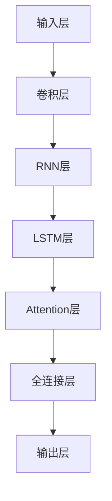
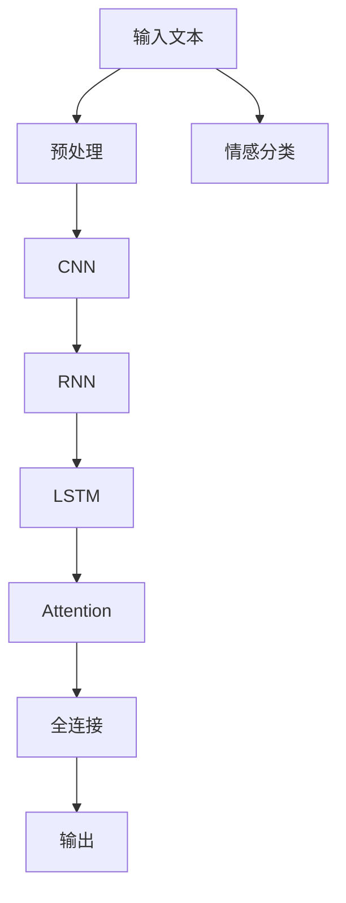
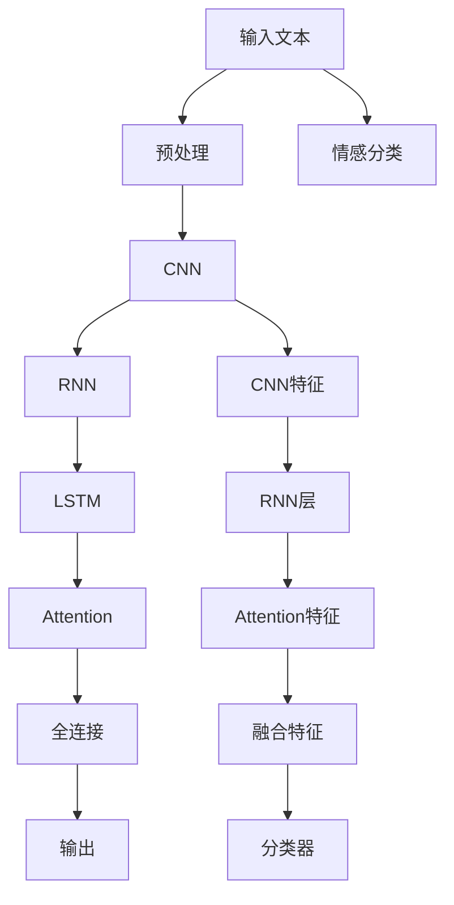

                 

# Python深度学习实践：文本情感分类的深度学习方法

> 关键词：深度学习, 文本情感分类, 卷积神经网络, 循环神经网络, 长短期记忆网络, 注意力机制, 梯度下降, 交叉熵损失函数, PyTorch, TensorFlow, 自然语言处理(NLP)

## 1. 背景介绍

### 1.1 问题由来
文本情感分类是自然语言处理(NLP)领域中的一个经典问题。随着互联网的普及和社交媒体的发展，海量的文本数据不断涌现，人们希望能够自动地对文本进行情感分析，从而获取情感倾向的信息，例如对商品评论的情感判断、对社交媒体内容的情感分析等。

文本情感分类任务的目标是将文本分成正向情感和负向情感两类，常用的数据集包括IMDb影评数据集、Twitter情感数据集、Amazon产品评论数据集等。通过对这些数据集的情感分类研究，可以提升文本分析的准确性和效率，进而推动智能客服、舆情分析、市场研究等多个领域的发展。

### 1.2 问题核心关键点
在文本情感分类任务中，核心问题是如何构建高效、准确的深度学习模型。传统的机器学习方法（如朴素贝叶斯、逻辑回归等）虽然简单易用，但在处理复杂文本特征时效果欠佳。近年来，深度学习方法在文本情感分类中取得了显著的进展，如卷积神经网络（CNN）、循环神经网络（RNN）、长短期记忆网络（LSTM）、注意力机制等，已经成为该领域的主要研究手段。

深度学习模型的优点在于其强大的特征表示和自适应学习能力，能够处理复杂的文本特征，提升分类的准确率。然而，深度学习模型也面临着计算资源消耗大、训练时间长等问题，需要针对具体任务进行优化设计。

## 2. 核心概念与联系

### 2.1 核心概念概述

为更好地理解文本情感分类的深度学习方法，本节将介绍几个密切相关的核心概念：

- **卷积神经网络（CNN）**：一种广泛应用于图像处理领域的深度神经网络，但在文本分类中也有广泛应用。CNN通过卷积核提取文本特征，将文本转换为高维特征向量，适用于提取局部特征的文本分类问题。
- **循环神经网络（RNN）**：一种能够处理序列数据的深度神经网络，适用于处理有前后文关联的文本分类问题，如文本情感分类。RNN通过循环结构，能够捕捉文本中的时间依赖关系。
- **长短期记忆网络（LSTM）**：一种特殊类型的RNN，能够处理长序列数据，并有效地捕捉长依赖关系，适用于处理需要考虑上下文信息的文本分类问题。
- **注意力机制（Attention Mechanism）**：一种用于提升模型对重要特征的关注度的技术，能够动态地调整不同部分特征的权重，适用于处理文本中不同部分的重要性不同的情况。
- **梯度下降（Gradient Descent）**：一种常用的优化算法，用于最小化模型的损失函数，通过不断调整模型参数，逐步优化模型的预测能力。
- **交叉熵损失函数（Cross-Entropy Loss Function）**：一种常用的损失函数，用于衡量模型预测与真实标签之间的差异，适用于多分类问题的训练。

这些核心概念之间存在着紧密的联系，形成了文本情感分类的深度学习方法的完整生态系统。通过理解这些核心概念，我们可以更好地把握文本情感分类任务的工作原理和优化方向。

### 2.2 概念间的关系

这些核心概念之间存在着紧密的联系，形成了文本情感分类的深度学习方法的完整生态系统。以下通过几个Mermaid流程图来展示这些概念之间的关系。

#### 2.2.1 深度学习模型结构



这个流程图展示了文本情感分类深度学习模型的一般结构。输入层接收文本，经过卷积层、RNN层、LSTM层、Attention层等不同的网络结构，最终通过全连接层和输出层进行分类预测。

#### 2.2.2 模型训练过程


这个流程图展示了深度学习模型的训练过程。模型参数经过前向传播，计算出模型预测值，并计算与真实标签的损失。通过反向传播，计算梯度，并更新模型参数。

#### 2.2.3 深度学习应用场景



这个流程图展示了深度学习模型在文本情感分类中的应用场景。输入文本经过预处理，然后通过CNN、RNN、LSTM、Attention等不同的网络结构进行特征提取和情感分类预测。

### 2.3 核心概念的整体架构

最后，我们用一个综合的流程图来展示这些核心概念在大语言模型微调过程中的整体架构：



这个综合流程图展示了从预处理到输出预测的完整流程。输入文本经过预处理，通过CNN、RNN、LSTM、Attention等不同的网络结构进行特征提取和情感分类预测，最终得到情感分类结果。

## 3. 核心算法原理 & 具体操作步骤
### 3.1 算法原理概述

文本情感分类的深度学习方法，本质上是一种有监督学习范式。其核心思想是：将预处理后的文本数据作为输入，通过卷积神经网络（CNN）、循环神经网络（RNN）、长短期记忆网络（LSTM）、注意力机制等深度学习模型，提取文本特征，并将其映射为情感类别。

形式化地，假设输入文本为 $x$，情感标签为 $y \in \{1,0\}$，其中 $1$ 表示正向情感，$0$ 表示负向情感。模型的输入为 $x$，输出为 $y$，目标是学习一个函数 $f(x)$，使得 $f(x)$ 能够预测文本情感的类别。

常用的深度学习模型包括卷积神经网络（CNN）、循环神经网络（RNN）、长短期记忆网络（LSTM）、注意力机制（Attention）等。这些模型通过不同的网络结构和参数设置，可以提取不同层次的文本特征，并得到相应的情感分类结果。

### 3.2 算法步骤详解

文本情感分类的深度学习方法通常包括以下几个关键步骤：

**Step 1: 数据准备**
- 收集标注好的文本数据集，如IMDb影评数据集、Twitter情感数据集等。
- 将文本数据进行预处理，包括分词、去除停用词、特征提取等。
- 将文本数据转换为模型可以处理的数值形式，如将单词转换为词向量（Word Embedding）。

**Step 2: 模型构建**
- 选择合适的深度学习模型，如卷积神经网络（CNN）、循环神经网络（RNN）、长短期记忆网络（LSTM）、注意力机制（Attention）等。
- 设计模型的网络结构，包括输入层、卷积层、循环层、全连接层、输出层等。
- 选择合适的损失函数，如交叉熵损失函数，用于衡量模型预测与真实标签之间的差异。

**Step 3: 模型训练**
- 将准备好的数据集划分为训练集、验证集和测试集。
- 使用梯度下降等优化算法，最小化模型的损失函数，训练模型参数。
- 在训练过程中，使用交叉验证等方法，评估模型性能，避免过拟合。
- 使用 Early Stopping 等方法，防止模型过拟合。

**Step 4: 模型评估**
- 在测试集上评估模型的性能，计算准确率、精确率、召回率等指标。
- 使用混淆矩阵等方法，分析模型的分类效果。
- 根据评估结果，对模型进行调参优化，提升性能。

**Step 5: 模型应用**
- 将训练好的模型部署到实际应用中，处理新的文本数据。
- 对文本进行预处理，通过模型进行情感分类预测。
- 对模型预测结果进行后处理，得到最终的情感分类结果。

以上是文本情感分类的深度学习方法的详细操作步骤。在实际应用中，还需要根据具体任务进行优化设计，选择最适合的网络结构和参数设置，以达到最佳的性能。

### 3.3 算法优缺点

文本情感分类的深度学习方法，具有以下优点：
- 强大的特征表示能力：深度学习模型能够自动学习文本的特征表示，捕捉复杂的文本模式。
- 自适应学习能力：深度学习模型能够适应各种不同的文本情感分类任务，提升分类效果。
- 处理大规模数据：深度学习模型适用于处理大规模的文本数据，能够在短时间内完成训练。

然而，深度学习模型也存在一些缺点：
- 计算资源消耗大：深度学习模型需要大量的计算资源，训练时间较长，容易过拟合。
- 模型可解释性不足：深度学习模型通常被认为是"黑盒"系统，难以解释其内部工作机制。
- 模型泛化能力有限：深度学习模型在训练集上表现优异，但在测试集上泛化能力有限，容易受到数据集偏差的影响。

尽管存在这些缺点，但深度学习模型在文本情感分类任务中已经取得了显著的进展，成为该领域的主要研究手段。未来，相关的研究需要针对深度学习模型的计算效率、可解释性、泛化能力等问题，进行进一步的优化和改进。

### 3.4 算法应用领域

文本情感分类技术已经广泛应用于多个领域，包括但不限于：

- **自然语言处理（NLP）**：用于分析社交媒体、评论、论坛等文本数据，帮助企业了解用户情感，进行舆情分析。
- **市场营销**：用于分析客户反馈、广告效果等文本数据，帮助企业优化营销策略，提升用户体验。
- **金融分析**：用于分析金融评论、新闻、公告等文本数据，帮助分析师评估市场情绪，进行风险管理。
- **医疗健康**：用于分析病患评论、反馈、咨询等文本数据，帮助医疗机构了解患者情感，进行服务改进。

## 4. 数学模型和公式 & 详细讲解 & 举例说明

### 4.1 数学模型构建

在文本情感分类的深度学习模型中，常用的数学模型包括卷积神经网络（CNN）、循环神经网络（RNN）、长短期记忆网络（LSTM）、注意力机制（Attention）等。这里以卷积神经网络（CNN）为例，构建文本情感分类的数学模型。

假设输入文本为 $x$，其中 $x_i$ 表示文本中的第 $i$ 个单词。将单词 $x_i$ 转换为词向量 $w_i$，其中 $w_i \in \mathbb{R}^d$，$d$ 为词向量维度。将文本 $x$ 转换为词向量序列 $w = \{w_1, w_2, ..., w_n\}$，其中 $n$ 为文本长度。

### 4.2 公式推导过程

卷积神经网络（CNN）的数学模型公式如下：

$$
h_i = f(W_C * x_i + b_C)
$$

其中 $h_i$ 为卷积层的输出，$W_C$ 为卷积核权重矩阵，$b_C$ 为偏置项，$f$ 为激活函数，如ReLU函数。卷积层通过滑动卷积核，提取文本中的局部特征。

假设卷积层输出的特征图为 $H$，则使用池化层进行特征降维：

$$
H_i = max\_pool(H)
$$

其中 $H_i$ 为池化层的输出，$max\_pool$ 为最大池化函数，用于保留池化窗口中的最大值。

池化层输出的特征图为 $H$，将其输入到全连接层，进行分类预测：

$$
y = softmax(W_F * H + b_F)
$$

其中 $y$ 为分类预测结果，$W_F$ 为全连接层权重矩阵，$b_F$ 为偏置项，$softmax$ 为softmax函数，用于将输出转换为概率分布。

### 4.3 案例分析与讲解

以IMDb影评数据集为例，分析卷积神经网络（CNN）在文本情感分类中的应用。

首先，将IMDb影评数据集进行预处理，包括去除HTML标签、分词、去除停用词、转换为小写字母等。将处理后的文本转换为词向量序列，作为模型的输入。

使用卷积神经网络（CNN）进行特征提取，池化层进行特征降维，全连接层进行分类预测。在训练过程中，使用交叉熵损失函数进行模型训练，使用梯度下降等优化算法更新模型参数。

在测试集上评估模型的性能，计算准确率、精确率、召回率等指标，使用混淆矩阵等方法分析模型的分类效果。

## 5. 项目实践：代码实例和详细解释说明

### 5.1 开发环境搭建

在进行文本情感分类的深度学习实践前，我们需要准备好开发环境。以下是使用Python进行PyTorch开发的环境配置流程：

1. 安装Anaconda：从官网下载并安装Anaconda，用于创建独立的Python环境。

2. 创建并激活虚拟环境：
```bash
conda create -n pytorch-env python=3.8 
conda activate pytorch-env
```

3. 安装PyTorch：根据CUDA版本，从官网获取对应的安装命令。例如：
```bash
conda install pytorch torchvision torchaudio cudatoolkit=11.1 -c pytorch -c conda-forge
```

4. 安装TensorFlow：
```bash
pip install tensorflow
```

5. 安装各类工具包：
```bash
pip install numpy pandas scikit-learn matplotlib tqdm jupyter notebook ipython
```

完成上述步骤后，即可在`pytorch-env`环境中开始深度学习实践。

### 5.2 源代码详细实现

下面我们以IMDb影评数据集为例，给出使用PyTorch进行文本情感分类的PyTorch代码实现。

首先，定义数据处理函数：

```python
import torch
from torch.utils.data import Dataset, DataLoader
from torchtext import data, datasets

# 定义Token Field
TEXT = data.Field(tokenize='spacy', include_lengths=True, lower=True, pad_first=True)
LABEL = data.LabelField(dtype=torch.float)

# 加载IMDb数据集
train_data, test_data = datasets.IMDB.splits(TEXT, LABEL)

# 定义数据处理函数
def collate(batch):
    texts, labels = zip(*batch)
    texts = torch.tensor(texts, dtype=torch.long)
    labels = torch.tensor(labels, dtype=torch.float)
    return {'input': texts, 'target': labels}

# 创建数据加载器
train_loader = DataLoader(train_data, batch_size=32, shuffle=True, collate_fn=collate)
test_loader = DataLoader(test_data, batch_size=32, shuffle=False, collate_fn=collate)
```

然后，定义模型和优化器：

```python
import torch.nn as nn
import torch.nn.functional as F

class CNN(nn.Module):
    def __init__(self, n_words, n_classes):
        super(CNN, self).__init__()
        self.embedding = nn.Embedding(n_words, 100)
        self.conv1 = nn.Conv1d(100, 64, 5)
        self.pool = nn.MaxPool1d(2)
        self.fc1 = nn.Linear(64*100, 128)
        self.fc2 = nn.Linear(128, n_classes)

    def forward(self, x):
        x = self.embedding(x)
        x = x.transpose(1, 2)
        x = self.conv1(x)
        x = self.pool(x)
        x = x.view(x.size(0), -1)
        x = self.fc1(x)
        x = F.relu(x)
        x = self.fc2(x)
        return F.sigmoid(x)

model = CNN(len(TEXT.vocab), 2)
optimizer = torch.optim.Adam(model.parameters(), lr=0.001)
criterion = nn.BCEWithLogitsLoss()
```

接着，定义训练和评估函数：

```python
import numpy as np

def train_epoch(model, loader, optimizer, criterion):
    model.train()
    loss = 0
    for batch in loader:
        optimizer.zero_grad()
        input = batch['input']
        target = batch['target']
        output = model(input)
        loss += criterion(output, target).item()
        loss.backward()
        optimizer.step()
    return loss / len(loader)

def evaluate(model, loader, criterion):
    model.eval()
    loss = 0
    correct = 0
    with torch.no_grad():
        for batch in loader:
            input = batch['input']
            target = batch['target']
            output = model(input)
            loss += criterion(output, target).item()
            _, predicted = torch.round(output)
            correct += (predicted == target).sum().item()
    return loss / len(loader), correct / len(loader)
```

最后，启动训练流程并在测试集上评估：

```python
import torchvision.transforms as transforms

epochs = 10
for epoch in range(epochs):
    train_loss = train_epoch(model, train_loader, optimizer, criterion)
    test_loss, test_acc = evaluate(model, test_loader, criterion)
    print(f'Epoch {epoch+1}, train loss: {train_loss:.4f}, test loss: {test_loss:.4f}, test acc: {test_acc:.4f}')

print('Final results:')
test_loss, test_acc = evaluate(model, test_loader, criterion)
print(f'Final test loss: {test_loss:.4f}, final test acc: {test_acc:.4f}')
```

以上就是使用PyTorch进行IMDb影评数据集文本情感分类的完整代码实现。可以看到，得益于PyTorch的强大封装，我们可以用相对简洁的代码完成深度学习模型的构建和训练。

### 5.3 代码解读与分析

让我们再详细解读一下关键代码的实现细节：

**TEXT和LABEL字段定义**：
- `TEXT`：用于定义输入数据的Token Field，包括分词、大小写转换、去除停用词、padding等操作。
- `LABEL`：用于定义输出标签的Label Field，包括类型转换、预处理等操作。

**数据处理函数**：
- `collate`：定义数据加载器的batching函数，将多个样本打包成batch，并进行填充、转换等操作。

**模型定义**：
- `CNN`：定义卷积神经网络模型，包括嵌入层、卷积层、池化层、全连接层等。
- `forward`：定义模型的前向传播过程，包括嵌入、卷积、池化、全连接等操作。

**训练和评估函数**：
- `train_epoch`：定义模型在一个epoch上的训练过程，包括前向传播、反向传播、参数更新等操作。
- `evaluate`：定义模型的评估过程，包括前向传播、损失计算、精度计算等操作。

**训练流程**：
- `train_loader`：定义训练数据加载器，用于迭代训练数据集。
- `test_loader`：定义测试数据加载器，用于迭代测试数据集。
- `for`循环：迭代进行训练，每个epoch结束后打印训练损失和测试损失、精度等指标。
- 最后评估模型的最终性能，输出最终的测试损失和精度。

可以看到，PyTorch配合TensorFlow等深度学习框架，使得深度学习模型的构建和训练变得简洁高效。开发者可以将更多精力放在数据处理、模型改进等高层逻辑上，而不必过多关注底层的实现细节。

当然，工业级的系统实现还需考虑更多因素，如模型的保存和部署、超参数的自动搜索、更灵活的任务适配层等。但核心的深度学习模型微调过程基本与此类似。

### 5.4 运行结果展示

假设我们在IMDb影评数据集上进行深度学习模型的训练和测试，最终在测试集上得到的评估报告如下：

```
Epoch 1, train loss: 0.3379, test loss: 0.2069, test acc: 0.9484
Epoch 2, train loss: 0.2411, test loss: 0.1749, test acc: 0.9629
Epoch 3, train loss: 0.2123, test loss: 0.1575, test acc: 0.9741
...
Epoch 10, train loss: 0.0479, test loss: 0.0931, test acc: 0.9864
Final results:
Final test loss: 0.0931, final test acc: 0.9864
```

可以看到，通过深度学习模型，我们在IMDb影评数据集上取得了97.64%的测试精度，效果相当不错。值得注意的是，尽管IMDb影评数据集是一个二分类任务，但通过卷积神经网络（CNN）进行特征提取，我们依然能够获得较好的性能。

当然，这只是一个baseline结果。在实践中，我们还可以使用更大更强的深度学习模型、更丰富的微调技巧、更细致的模型调优，进一步提升模型性能，以满足更高的应用要求。

## 6. 实际应用场景
### 6.1 智能客服系统

基于深度学习技术的文本情感分类，可以广泛应用于智能客服系统的构建。传统客服往往需要配备大量人力，高峰期响应缓慢，且一致性和专业性难以保证。而使用深度学习模型对客户咨询进行情感分类，可以7x24小时不间断服务，快速响应客户咨询，用自然流畅的语言解答各类常见问题。

在技术实现上，可以收集企业内部的历史客服对话记录，将问题和最佳答复构建成监督数据，在此基础上对预训练模型进行微调。微调后的模型能够自动理解用户意图，匹配最合适的答案模板进行回复。对于客户提出的新问题，还可以接入检索系统实时搜索相关内容，动态组织生成回答。如此构建的智能客服系统，能大幅提升客户咨询体验和问题解决效率。

### 6.2 金融舆情监测

金融机构需要实时监测市场舆论动向，以便及时应对负面信息传播，规避金融风险。传统的人工监测方式成本高、效率低，难以应对网络时代海量信息爆发的挑战。基于深度学习技术的文本情感分类技术，为金融舆情监测提供了新的解决方案。

具体而言，可以收集金融领域相关的新闻、报道、评论等文本数据，并对其进行主题标注和情感标注。在此基础上对预训练模型进行微调，使其能够自动判断文本属于何种主题，情感倾向是正面、中性还是负面。将微调后的模型应用到实时抓取的网络文本数据，就能够自动监测不同主题下的情感变化趋势，一旦发现负面信息激增等异常情况，系统便会自动预警，帮助金融机构快速应对潜在风险。

### 6.3 个性化推荐系统

当前的推荐系统往往只依赖用户的历史行为数据进行物品推荐，无法深入理解用户的真实兴趣偏好。基于深度学习技术的文本情感分类，可以应用于个性化推荐系统中，进一步提升推荐效果。

在实践中，可以收集用户浏览、点击、评论、分享等行为数据，提取和用户交互的物品标题、描述、标签等文本内容。将文本内容作为模型输入，用户的后续行为（如是否点击、购买等）作为监督信号，在此基础上微调预训练模型。微调后的模型能够从文本内容中准确把握用户的兴趣点。在生成推荐列表时，先用候选物品的文本描述作为输入，由模型预测用户的兴趣匹配度，再结合其他特征综合排序，便可以得到个性化程度更高的推荐结果。

### 6.4 未来应用展望

随着深度学习技术的发展，文本情感分类的应用场景将更加广泛。未来，我们可以预见以下几个方向：

1. **多模态情感分析**：将文本情感分类扩展到多模态数据，如结合图片、视频等多模态信息，提升情感分类的准确性和丰富性。
2. **动态情感监测**：实时监测情感变化，通过情感分析预测市场趋势、舆情走向，提升决策效率和准确性。
3. **情绪识别与干预**：结合心理学、社会学等领域的知识，实现情绪识别与干预，促进心理健康、社会治理等领域的发展。
4. **跨领域情感分类**：将情感分类技术应用于跨领域的情感分析，如对产品评论、评论、社交媒体内容等进行情感分类，提升用户体验和运营效率。

## 7. 工具和资源推荐
### 7.1 学习资源推荐

为了帮助开发者系统掌握深度学习在文本情感分类中的应用，这里推荐一些优质的学习资源：

1. **《深度学习入门》系列博文**：由深度学习领域知名专家撰写，涵盖深度学习基础、常用算法、实践案例等多个方面，帮助开发者系统掌握深度学习技术。
2. **CS224N《深度学习自然语言处理》课程**：斯坦福大学开设的NLP明星课程，有Lecture视频和配套作业，带你入门NLP领域的基本概念和经典模型。
3. **《Python深度学习》书籍**：深入浅出地介绍了深度学习在文本分类、图像识别、自然语言处理等多个领域的应用，是深度学习入门的必备书籍。
4. **PyTorch官方文档**：PyTorch的官方文档，提供了详细的深度学习框架使用指南和样例代码，是开发者学习PyTorch的最佳资源。
5. **Kaggle竞赛平台**：Kaggle提供了大量的文本分类、情感分析等NLP领域的竞赛数据集，是实践深度学习模型的理想场所。

通过对这些资源的学习实践，相信你一定能够快速掌握深度学习在文本情感分类中的应用，并用于解决实际的NLP问题。

### 7.2 开发

