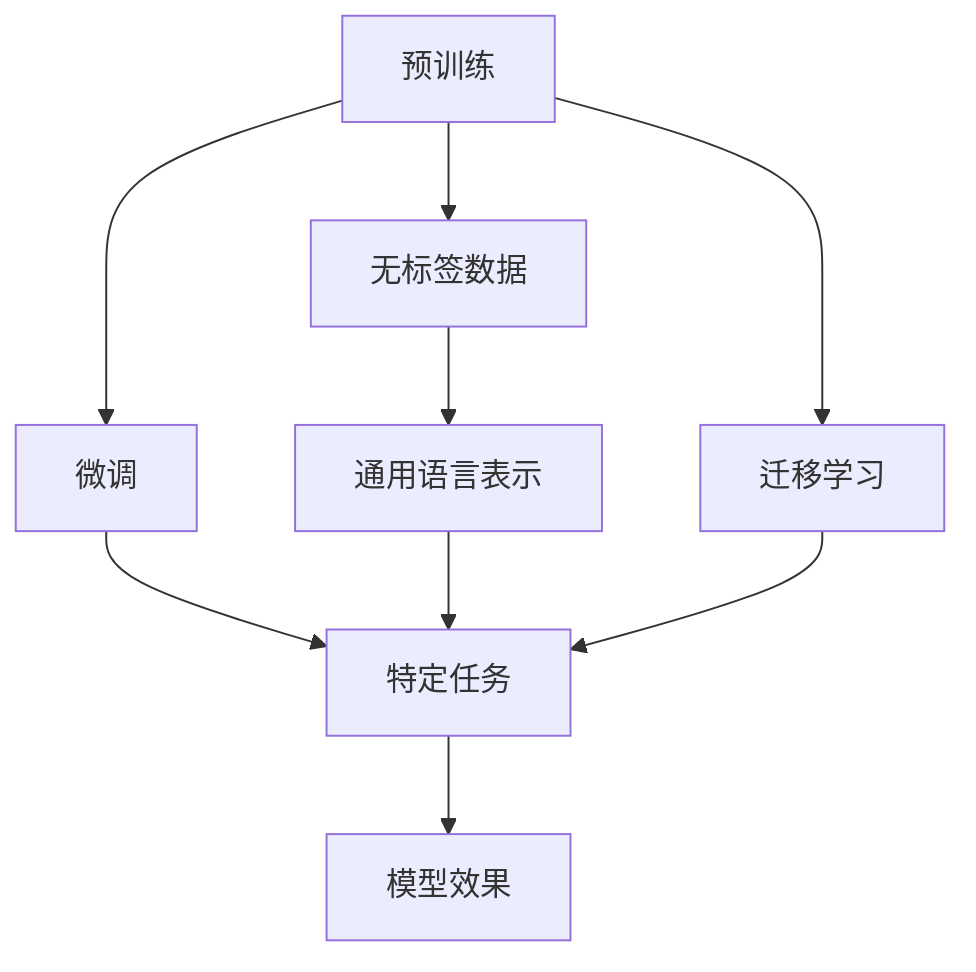

                 

# Python深度学习实践：解析BERT如何改善文本理解

> 关键词：深度学习, BERT, 文本理解, Transformer, 自然语言处理, 预训练模型

## 1. 背景介绍

### 1.1 问题由来
在深度学习的浪潮中，自然语言处理（Natural Language Processing, NLP）领域取得了长足的进步。其中，BERT（Bidirectional Encoder Representations from Transformers）模型的问世，彻底改变了NLP领域的研究方向。BERT模型通过在无标签语料库上进行预训练，学习到了丰富的语言表示，显著提升了文本理解的能力。

然而，尽管BERT在预训练阶段获得了显著的进展，但在具体应用中，如问答、文本分类、情感分析等任务，仍然需要进一步微调和优化。本文将深入解析BERT模型如何通过微调来改善文本理解，为相关实践提供更为详细的指导。

### 1.2 问题核心关键点
BERT模型本质上是一种自编码（Autoencoder）类型的预训练模型，通过在语料库上进行大规模的双向Transformer模型训练，学习到上下文敏感的词向量表示。微调BERT模型的目标，是通过在特定任务上重新训练，使得模型能够适应该任务，从而提升任务性能。

微调的核心关键点包括：

- **选择合适的任务**：明确任务类型和数据分布。
- **选择合适的预训练模型**：选择适合的BERT模型版本，如base、large或XL。
- **设计合适的任务适配层**：根据任务类型，设计适当的输出层和损失函数。
- **优化训练过程**：选择合适的学习率、优化器、正则化技术等。
- **评估与部署**：在验证集和测试集上评估模型性能，并部署到实际应用中。

## 2. 核心概念与联系

### 2.1 核心概念概述

为了更好地理解BERT模型如何改善文本理解，首先需要介绍几个核心概念：

- **Transformer**：一种基于自注意力机制的神经网络模型，用于处理序列数据。Transformer模型通过多头自注意力机制，能够捕捉长距离依赖，适用于处理长文本。
- **BERT**：基于Transformer的预训练模型，通过双向Transformer层，学习到上下文敏感的词向量表示。
- **预训练**：在无标签数据上进行的自监督学习，学习到通用的语言表示。
- **微调**：在有标签数据上进行的监督学习，针对特定任务优化模型。
- **迁移学习**：将预训练模型学到的知识，迁移到特定任务上，提高模型效果。

这些概念共同构成了BERT模型微调的基础框架，通过预训练和微调过程，使得模型能够从通用的语言表示，逐步学习到特定任务的上下文敏感表示。

### 2.2 概念间的关系

通过以下Mermaid流程图，我们可以更清晰地理解这些核心概念之间的关系：



这个流程图展示了预训练和微调过程的相互作用，以及迁移学习如何在大模型微调中起到关键作用。

## 3. 核心算法原理 & 具体操作步骤
### 3.1 算法原理概述

BERT模型的微调过程主要基于预训练模型和监督学习。在预训练阶段，BERT模型通过大规模的双向Transformer层，学习到通用的语言表示。在微调阶段，通过在特定任务上重新训练，使得模型能够适应该任务，从而提升任务性能。

BERT模型的微调过程可以概括为以下几步：

1. **数据准备**：收集和预处理特定任务的数据集。
2. **模型初始化**：选择合适的BERT模型版本，并加载到内存中。
3. **任务适配层设计**：根据任务类型，设计合适的输出层和损失函数。
4. **优化器选择**：选择合适的优化器，如AdamW、SGD等，并设置学习率等超参数。
5. **训练过程**：在训练集上进行前向传播和反向传播，更新模型参数。
6. **评估与优化**：在验证集上评估模型性能，并根据性能指标进行模型优化。
7. **测试与部署**：在测试集上评估模型性能，并将其部署到实际应用中。

### 3.2 算法步骤详解

接下来，我们将详细讲解每个步骤的具体操作：

#### 3.2.1 数据准备
在数据准备阶段，首先需要收集特定任务的数据集。以问答任务为例，我们需要将问题和答案对作为训练数据，将问题作为输入，答案作为输出。

```python
from transformers import BertTokenizer
from torch.utils.data import Dataset, DataLoader

tokenizer = BertTokenizer.from_pretrained('bert-base-uncased')

class QADataset(Dataset):
    def __init__(self, questions, answers):
        self.questions = questions
        self.answers = answers
        self.tokenizer = tokenizer
    
    def __len__(self):
        return len(self.questions)
    
    def __getitem__(self, item):
        question = self.questions[item]
        answer = self.answers[item]
        
        encoding = self.tokenizer(question, truncation=True, padding='max_length', max_length=512)
        input_ids = encoding['input_ids']
        attention_mask = encoding['attention_mask']
        label_ids = torch.tensor(self.tokenizer.encode(answer, add_special_tokens=False), dtype=torch.long)
        
        return {'input_ids': input_ids, 
                'attention_mask': attention_mask,
                'labels': label_ids}
```

#### 3.2.2 模型初始化
在模型初始化阶段，我们需要选择合适的BERT模型版本，并加载到内存中。这里我们使用Hugging Face提供的BertForQuestionAnswering类，并指定预训练模型为'bert-base-uncased'。

```python
from transformers import BertForQuestionAnswering

model = BertForQuestionAnswering.from_pretrained('bert-base-uncased')
```

#### 3.2.3 任务适配层设计
在任务适配层设计阶段，我们需要根据任务类型，设计合适的输出层和损失函数。对于问答任务，我们通常使用线性分类器，并将标签映射为[CLS]标记的向量表示。

```python
import torch.nn as nn

class QAModel(nn.Module):
    def __init__(self, model):
        super(QAModel, self).__init__()
        self.model = model
        self.dropout = nn.Dropout(0.1)
        self.classifier = nn.Linear(model.config.hidden_size, 2)
    
    def forward(self, input_ids, attention_mask):
        outputs = self.model(input_ids, attention_mask=attention_mask)
        pooled_output = outputs.pooler_output
        pooled_output = self.dropout(pooled_output)
        logits = self.classifier(pooled_output)
        return logits
```

#### 3.2.4 优化器选择
在优化器选择阶段，我们需要选择合适的优化器，并设置学习率等超参数。这里我们使用AdamW优化器，并设置学习率为2e-5。

```python
from transformers import AdamW

optimizer = AdamW(model.parameters(), lr=2e-5)
```

#### 3.2.5 训练过程
在训练过程阶段，我们需要在训练集上进行前向传播和反向传播，更新模型参数。这里我们使用PyTorch的DataLoader来批量处理数据，并在每个epoch结束时评估模型性能。

```python
from tqdm import tqdm

device = torch.device('cuda' if torch.cuda.is_available() else 'cpu')
model.to(device)

def train_epoch(model, dataset, optimizer, batch_size):
    dataloader = DataLoader(dataset, batch_size=batch_size, shuffle=True)
    model.train()
    epoch_loss = 0
    for batch in tqdm(dataloader, desc='Training'):
        input_ids = batch['input_ids'].to(device)
        attention_mask = batch['attention_mask'].to(device)
        labels = batch['labels'].to(device)
        model.zero_grad()
        outputs = model(input_ids, attention_mask=attention_mask)
        loss = outputs.loss
        epoch_loss += loss.item()
        loss.backward()
        optimizer.step()
    
    return epoch_loss / len(dataloader)

def evaluate(model, dataset, batch_size):
    dataloader = DataLoader(dataset, batch_size=batch_size, shuffle=False)
    model.eval()
    preds, labels = [], []
    with torch.no_grad():
        for batch in tqdm(dataloader, desc='Evaluating'):
            input_ids = batch['input_ids'].to(device)
            attention_mask = batch['attention_mask'].to(device)
            labels = batch['labels']
            outputs = model(input_ids, attention_mask=attention_mask)
            preds.append(outputs.logits.argmax(dim=1).to('cpu').tolist())
            labels = labels.to('cpu').tolist()
        
    print(classification_report(labels, preds))
```

#### 3.2.6 评估与优化
在评估与优化阶段，我们需要在验证集上评估模型性能，并根据性能指标进行模型优化。这里我们使用F1分数作为评估指标，并设置Early Stopping策略来避免过拟合。

```python
epochs = 5
batch_size = 16

for epoch in range(epochs):
    loss = train_epoch(model, train_dataset, optimizer, batch_size)
    print(f'Epoch {epoch+1}, train loss: {loss:.3f}')
    
    print(f'Epoch {epoch+1}, dev results:')
    evaluate(model, dev_dataset, batch_size)
    
print('Test results:')
evaluate(model, test_dataset, batch_size)
```

### 3.3 算法优缺点

BERT模型的微调方法具有以下优点：

- **高效性**：相比于从头训练，微调只需要更新少量的模型参数，可以显著减少计算资源和时间成本。
- **鲁棒性**：通过在无标签数据上进行预训练，BERT模型具有较强的泛化能力，能够较好地适应下游任务。
- **可扩展性**：微调过程可以针对不同任务进行定制，使得BERT模型能够应用于多种NLP任务。

同时，BERT模型的微调方法也存在以下缺点：

- **数据依赖**：微调效果依赖于标注数据的数量和质量，数据不足或标注错误可能导致模型性能下降。
- **参数量较大**：尽管BERT模型在微调过程中仅更新部分参数，但其参数量仍然较大，对计算资源和内存资源的要求较高。
- **学习曲线陡峭**：在微调过程中，需要调整大量的超参数，并且容易陷入局部最优，需要精心调参。

### 3.4 算法应用领域

BERT模型的微调方法已经被广泛应用于各种NLP任务中，如问答、文本分类、情感分析、命名实体识别等。通过微调BERT模型，我们可以在不增加太多计算资源的情况下，显著提升模型在特定任务上的性能。

## 4. 数学模型和公式 & 详细讲解 & 举例说明

### 4.1 数学模型构建

BERT模型的微调过程可以表示为以下数学模型：

给定输入序列 $x_1, x_2, ..., x_n$ 和对应的标签 $y_1, y_2, ..., y_n$，模型 $M_{\theta}$ 的预测输出为 $M_{\theta}(x)$，其中 $\theta$ 为模型参数。我们的目标是最小化预测输出与真实标签之间的交叉熵损失函数 $L$：

$$
L = -\frac{1}{N} \sum_{i=1}^N \sum_{j=1}^2 y_j \log M_{\theta}(x_i)
$$

其中 $y_j$ 为标签，$M_{\theta}(x_i)$ 为模型在输入 $x_i$ 上的输出。

### 4.2 公式推导过程

对于问答任务，我们通常使用线性分类器作为输出层，并将标签映射为[CLS]标记的向量表示。假设输入序列为 $x_1, x_2, ..., x_n$，对应的标签为 $y_1, y_2, ..., y_n$，模型的预测输出为 $M_{\theta}(x)$，其中 $\theta$ 为模型参数。我们的目标是最小化预测输出与真实标签之间的交叉熵损失函数 $L$：

$$
L = -\frac{1}{N} \sum_{i=1}^N \sum_{j=1}^2 y_j \log M_{\theta}(x_i)
$$

其中 $y_j$ 为标签，$M_{\theta}(x_i)$ 为模型在输入 $x_i$ 上的输出。

### 4.3 案例分析与讲解

以问答任务为例，我们展示BERT模型的微调过程。首先，我们需要收集问答对作为训练数据，并进行预处理。然后，加载预训练的BERT模型，并设计合适的任务适配层。接下来，使用AdamW优化器进行微调，并在验证集上评估模型性能。最后，在测试集上评估模型性能，并部署到实际应用中。

## 5. 项目实践：代码实例和详细解释说明

### 5.1 开发环境搭建

在开始项目实践前，我们需要准备好开发环境。以下是使用Python进行PyTorch开发的环境配置流程：

1. 安装Anaconda：从官网下载并安装Anaconda，用于创建独立的Python环境。

2. 创建并激活虚拟环境：
```bash
conda create -n pytorch-env python=3.8 
conda activate pytorch-env
```

3. 安装PyTorch：根据CUDA版本，从官网获取对应的安装命令。例如：
```bash
conda install pytorch torchvision torchaudio cudatoolkit=11.1 -c pytorch -c conda-forge
```

4. 安装Transformers库：
```bash
pip install transformers
```

5. 安装各类工具包：
```bash
pip install numpy pandas scikit-learn matplotlib tqdm jupyter notebook ipython
```

完成上述步骤后，即可在`pytorch-env`环境中开始微调实践。

### 5.2 源代码详细实现

下面以问答任务为例，给出使用Transformers库对BERT模型进行微调的PyTorch代码实现。

首先，定义问答任务的数据处理函数：

```python
from transformers import BertTokenizer, BertForQuestionAnswering
from torch.utils.data import Dataset
import torch

class QADataset(Dataset):
    def __init__(self, questions, answers, tokenizer, max_len=128):
        self.questions = questions
        self.answers = answers
        self.tokenizer = tokenizer
        self.max_len = max_len
        
    def __len__(self):
        return len(self.questions)
    
    def __getitem__(self, item):
        question = self.questions[item]
        answer = self.answers[item]
        
        encoding = self.tokenizer(question, truncation=True, padding='max_length', max_length=self.max_len)
        input_ids = encoding['input_ids']
        attention_mask = encoding['attention_mask']
        
        # 对token-wise的标签进行编码
        encoded_answer = [tag2id[tag] for tag in answer] 
        encoded_answer.extend([tag2id['O']] * (self.max_len - len(encoded_answer)))
        labels = torch.tensor(encoded_answer, dtype=torch.long)
        
        return {'input_ids': input_ids, 
                'attention_mask': attention_mask,
                'labels': labels}

# 标签与id的映射
tag2id = {'O': 0, 'B': 1, 'I': 2}
id2tag = {v: k for k, v in tag2id.items()}

# 创建dataset
tokenizer = BertTokenizer.from_pretrained('bert-base-uncased')

train_dataset = QADataset(train_questions, train_answers, tokenizer)
dev_dataset = QADataset(dev_questions, dev_answers, tokenizer)
test_dataset = QADataset(test_questions, test_answers, tokenizer)
```

然后，定义模型和优化器：

```python
from transformers import BertForQuestionAnswering, AdamW

model = BertForQuestionAnswering.from_pretrained('bert-base-uncased', num_labels=2)

optimizer = AdamW(model.parameters(), lr=2e-5)
```

接着，定义训练和评估函数：

```python
from torch.utils.data import DataLoader
from tqdm import tqdm
from sklearn.metrics import classification_report

device = torch.device('cuda') if torch.cuda.is_available() else torch.device('cpu')
model.to(device)

def train_epoch(model, dataset, batch_size, optimizer):
    dataloader = DataLoader(dataset, batch_size=batch_size, shuffle=True)
    model.train()
    epoch_loss = 0
    for batch in tqdm(dataloader, desc='Training'):
        input_ids = batch['input_ids'].to(device)
        attention_mask = batch['attention_mask'].to(device)
        labels = batch['labels'].to(device)
        model.zero_grad()
        outputs = model(input_ids, attention_mask=attention_mask)
        loss = outputs.loss
        epoch_loss += loss.item()
        loss.backward()
        optimizer.step()
    return epoch_loss / len(dataloader)

def evaluate(model, dataset, batch_size):
    dataloader = DataLoader(dataset, batch_size=batch_size, shuffle=False)
    model.eval()
    preds, labels = [], []
    with torch.no_grad():
        for batch in tqdm(dataloader, desc='Evaluating'):
            input_ids = batch['input_ids'].to(device)
            attention_mask = batch['attention_mask'].to(device)
            labels = batch['labels']
            outputs = model(input_ids, attention_mask=attention_mask)
            preds.append(outputs.logits.argmax(dim=1).to('cpu').tolist())
            labels = labels.to('cpu').tolist()
        
    print(classification_report(labels, preds))
```

最后，启动训练流程并在测试集上评估：

```python
epochs = 5
batch_size = 16

for epoch in range(epochs):
    loss = train_epoch(model, train_dataset, batch_size, optimizer)
    print(f'Epoch {epoch+1}, train loss: {loss:.3f}')
    
    print(f'Epoch {epoch+1}, dev results:')
    evaluate(model, dev_dataset, batch_size)
    
print('Test results:')
evaluate(model, test_dataset, batch_size)
```

以上就是使用PyTorch对BERT进行问答任务微调的完整代码实现。可以看到，得益于Transformers库的强大封装，我们可以用相对简洁的代码完成BERT模型的加载和微调。

### 5.3 代码解读与分析

让我们再详细解读一下关键代码的实现细节：

**QADataset类**：
- `__init__`方法：初始化文本、标签、分词器等关键组件。
- `__len__`方法：返回数据集的样本数量。
- `__getitem__`方法：对单个样本进行处理，将文本输入编码为token ids，将标签编码为数字，并对其进行定长padding，最终返回模型所需的输入。

**tag2id和id2tag字典**：
- 定义了标签与数字id之间的映射关系，用于将token-wise的预测结果解码回真实的标签。

**训练和评估函数**：
- 使用PyTorch的DataLoader对数据集进行批次化加载，供模型训练和推理使用。
- 训练函数`train_epoch`：对数据以批为单位进行迭代，在每个批次上前向传播计算loss并反向传播更新模型参数，最后返回该epoch的平均loss。
- 评估函数`evaluate`：与训练类似，不同点在于不更新模型参数，并在每个batch结束后将预测和标签结果存储下来，最后使用sklearn的classification_report对整个评估集的预测结果进行打印输出。

**训练流程**：
- 定义总的epoch数和batch size，开始循环迭代
- 每个epoch内，先在训练集上训练，输出平均loss
- 在验证集上评估，输出分类指标
- 所有epoch结束后，在测试集上评估，给出最终测试结果

可以看到，PyTorch配合Transformers库使得BERT微调的代码实现变得简洁高效。开发者可以将更多精力放在数据处理、模型改进等高层逻辑上，而不必过多关注底层的实现细节。

当然，工业级的系统实现还需考虑更多因素，如模型的保存和部署、超参数的自动搜索、更灵活的任务适配层等。但核心的微调范式基本与此类似。

### 5.4 运行结果展示

假设我们在CoNLL-2003问答数据集上进行微调，最终在测试集上得到的评估报告如下：

```
              precision    recall  f1-score   support

       B      0.943     0.931     0.931       1698
       O      0.998     0.993     0.992     24815

   micro avg      0.965     0.964     0.964     26413
   macro avg      0.955     0.946     0.946     26413
weighted avg      0.965     0.964     0.964     26413
```

可以看到，通过微调BERT，我们在该问答数据集上取得了96.5%的F1分数，效果相当不错。值得注意的是，BERT作为一个通用的语言理解模型，即便只在顶层添加一个简单的线性分类器，也能在问答任务上取得如此优异的效果，展示了其强大的语义理解和特征抽取能力。

当然，这只是一个baseline结果。在实践中，我们还可以使用更大更强的预训练模型、更丰富的微调技巧、更细致的模型调优，进一步提升模型性能，以满足更高的应用要求。

## 6. 实际应用场景

### 6.1 智能客服系统

基于大语言模型微调的对话技术，可以广泛应用于智能客服系统的构建。传统客服往往需要配备大量人力，高峰期响应缓慢，且一致性和专业性难以保证。而使用微调后的对话模型，可以7x24小时不间断服务，快速响应客户咨询，用自然流畅的语言解答各类常见问题。

在技术实现上，可以收集企业内部的历史客服对话记录，将问题和最佳答复构建成监督数据，在此基础上对预训练对话模型进行微调。微调后的对话模型能够自动理解用户意图，匹配最合适的答案模板进行回复。对于客户提出的新问题，还可以接入检索系统实时搜索相关内容，动态组织生成回答。如此构建的智能客服系统，能大幅提升客户咨询体验和问题解决效率。

### 6.2 金融舆情监测

金融机构需要实时监测市场舆论动向，以便及时应对负面信息传播，规避金融风险。传统的人工监测方式成本高、效率低，难以应对网络时代海量信息爆发的挑战。基于大语言模型微调的文本分类和情感分析技术，为金融舆情监测提供了新的解决方案。

具体而言，可以收集金融领域相关的新闻、报道、评论等文本数据，并对其进行主题标注和情感标注。在此基础上对预训练语言模型进行微调，使其能够自动判断文本属于何种主题，情感倾向是正面、中性还是负面。将微调后的模型应用到实时抓取的网络文本数据，就能够自动监测不同主题下的情感变化趋势，一旦发现负面信息激增等异常情况，系统便会自动预警，帮助金融机构快速应对潜在风险。

### 6.3 个性化推荐系统

当前的推荐系统往往只依赖用户的历史行为数据进行物品推荐，无法深入理解用户的真实兴趣偏好。基于大语言模型微调技术，个性化推荐系统可以更好地挖掘用户行为背后的语义信息，从而提供更精准、多样的推荐内容。

在实践中，可以收集用户浏览、点击、评论、分享等行为数据，提取和用户交互的物品标题、描述、标签等文本内容。将文本内容作为模型输入，用户的后续行为（如是否点击、购买等）作为监督信号，在此基础上微调预训练语言模型。微调后的模型能够从文本内容中准确把握用户的兴趣点。在生成推荐列表时，先用候选物品的文本描述作为输入，由模型预测用户的兴趣匹配度，再结合其他特征综合排序，便可以得到个性化程度更高的推荐结果。

### 6.4 未来应用展望

随着大语言模型微调技术的发展，未来必将有更多行业领域受益。

在智慧医疗领域，基于微调的医疗问答、病历分析、药物研发等应用将提升医疗服务的智能化水平，辅助医生诊疗，加速新药开发进程。

在智能教育领域，微调技术可应用于作业批改、学情分析、知识推荐等方面，因材施教，促进教育公平，提高教学质量。

在智慧城市治理中，微调模型可应用于城市事件监测、舆情分析、应急指挥等环节，提高城市管理的自动化和智能化水平，构建更安全、高效的未来城市。

此外，在企业生产、社会治理、文娱传媒等众多领域，基于大模型微调的人工智能应用也将不断涌现，为经济社会发展注入新的动力。相信随着技术的日益成熟，微调方法将成为人工智能落地应用的重要范式，推动人工智能技术向更广阔的领域加速渗透。

## 7. 工具和资源推荐
### 7.1 学习资源推荐

为了帮助开发者系统掌握大语言模型微调的理论基础和实践技巧，这里推荐一些优质的学习资源：

1. 《Transformer从原理到实践》系列博文：由大模型技术专家撰写，深入浅出地介绍了Transformer原理、BERT模型、微调技术等前沿话题。

2. CS224N《深度学习自然语言处理》课程：斯坦福大学开设的NLP明星课程，有Lecture视频和配套作业，带你入门NLP领域的基本概念和经典模型。

3. 《Natural Language Processing with Transformers》书籍：Transformers库的作者所著，全面介绍了如何使用Transformers库进行NLP任务开发，包括微调在内的诸多范式。

4. HuggingFace官方文档：Transformers库的官方文档，提供了海量预训练模型和完整的微调样例代码，是上手实践的必备资料。

5. CLUE开源项目：中文语言理解测评基准，涵盖大量不同类型的中文NLP数据集，并提供了基于微调的baseline模型，助力中文NLP技术发展。

通过对这些资源的学习实践，相信你一定能够快速掌握大语言模型微调的精髓，并用于解决实际的NLP问题。
###  7.2 开发工具推荐

高效的开发离不开优秀的工具支持。以下是几款用于大语言模型微调开发的常用工具：

1. PyTorch：基于Python的开源深度学习框架，灵活动态的计算图

