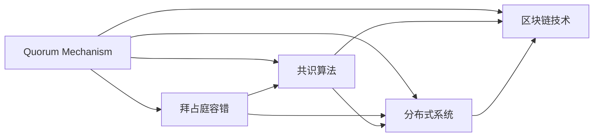
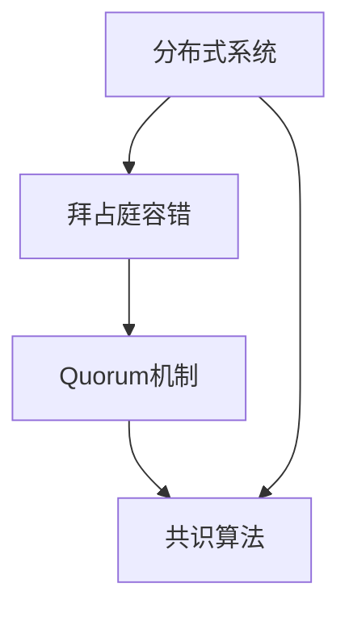
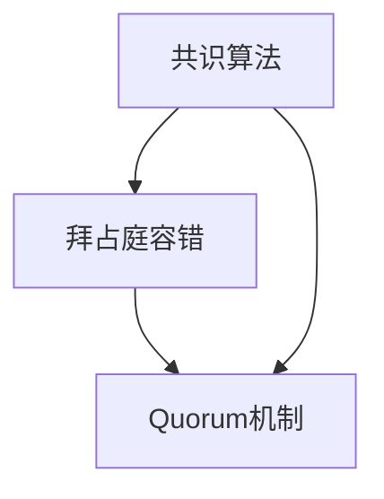
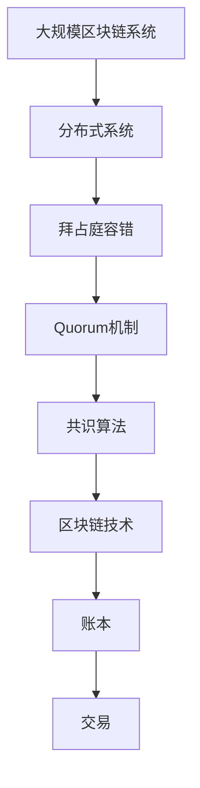

                 

# Quorum机制的实例应用

> 关键词：Quorum, 实例应用, 共识算法, 分布式系统, 区块链技术, 故障容忍性

## 1. 背景介绍

### 1.1 问题由来

Quorum机制是一种在分布式系统中用于提高容错性和共识的算法。它基于拜占庭容错理论，通过要求网络中至少有一半的节点达成一致来保障交易或决策的安全性。Quorum机制广泛应用于区块链技术、分布式数据库系统、云计算等多个领域，是构建高可用、高可靠系统的核心技术之一。

近年来，随着区块链技术的兴起，Quorum机制被广泛应用于以太坊等去中心化平台中，成为保障交易安全的核心机制。以太坊的网络由多个节点组成，每个节点保存一份全链信息，节点之间通过共识算法来维护链的完整性和一致性。Quorum机制就是其中一种被广泛应用的共识算法。

### 1.2 问题核心关键点

Quorum机制的核心在于通过网络中的多数节点（通常定义为2/3或3/4）来达成共识，从而提高系统的容错性和安全性。Quorum机制的优点包括：
1. 强容错性：即使网络中有一半以上的节点发生故障，系统仍能正常运行，达成共识。
2. 高效性：通过网络中的多数节点参与共识，达成共识的速度较快。
3. 公平性：在网络中多数节点都持有有效信息的情况下，能确保交易或决策的公平性。

Quorum机制的缺点包括：
1. 通信复杂度较高：节点之间需要频繁通信，网络带宽和延迟可能会影响系统性能。
2. 节点故障风险：系统仍需依赖网络中一半以上的节点参与共识，一旦节点故障，系统性能将显著下降。
3. 分布式协调复杂：由于网络中存在多个节点，协调和管理这些节点的共识过程可能会比较复杂。

Quorum机制的目标是通过网络中的多数节点参与共识，保障交易或决策的安全性和正确性。然而，实际应用中，如何设计和优化Quorum机制，以应对各种网络环境和故障情况，是Quorum机制应用中的关键问题。

## 2. 核心概念与联系

### 2.1 核心概念概述

为更好地理解Quorum机制的实例应用，本节将介绍几个密切相关的核心概念：

- Quorum机制（Quorum Mechanism）：一种在分布式系统中用于提高容错性和共识的算法，通过网络中多数节点达成一致来保障交易或决策的安全性。
- 拜占庭容错（Byzantine Fault Tolerance）：一种分布式系统的容错机制，要求系统能够容忍一定比例的恶意节点，确保系统的正确性和一致性。
- 共识算法（Consensus Algorithm）：一种用于在分布式系统中达成一致的算法，确保网络中的节点能够就某个决策或交易达成一致。
- 分布式系统（Distributed System）：一种由多个节点组成的系统，这些节点通过网络进行通信和协调，以实现某些共同的目标。
- 区块链技术（Blockchain Technology）：一种基于共识算法的分布式账本技术，通过多个节点的共识保障账本的完整性和一致性。

这些核心概念之间的逻辑关系可以通过以下Mermaid流程图来展示：



这个流程图展示了大规模区块链系统中的关键概念及其关系：

1. Quorum机制基于拜占庭容错理论，通过网络中的多数节点达成一致。
2. 共识算法是Quorum机制的核心，确保网络中的节点能够就某个决策或交易达成一致。
3. 分布式系统是Quorum机制和共识算法的基础，通过网络通信和协调实现共同目标。
4. 区块链技术是Quorum机制的典型应用，通过共识算法保障账本的完整性和一致性。

这些概念共同构成了大规模分布式系统的核心技术框架，使其能够高效、安全地运行。通过理解这些核心概念，我们可以更好地把握Quorum机制的工作原理和优化方向。

### 2.2 概念间的关系

这些核心概念之间存在着紧密的联系，形成了大规模分布式系统的完整技术生态系统。下面我们通过几个Mermaid流程图来展示这些概念之间的关系。

#### 2.2.1 分布式系统的Quorum机制



这个流程图展示了分布式系统中Quorum机制的基本原理。在拜占庭容错机制的基础上，Quorum机制通过网络中的多数节点参与共识，确保交易或决策的正确性和一致性。

#### 2.2.2 区块链技术的Quorum机制


这个流程图展示了区块链技术中Quorum机制的应用。在拜占庭容错机制的基础上，Quorum机制通过网络中的多数节点参与共识，确保区块链账本的完整性和一致性。

#### 2.2.3 共识算法的Quorum机制



这个流程图展示了共识算法中Quorum机制的组成部分。共识算法通过网络中的多数节点参与共识，确保交易或决策的公平性和一致性。

### 2.3 核心概念的整体架构

最后，我们用一个综合的流程图来展示这些核心概念在大规模区块链系统中的整体架构：



这个综合流程图展示了Quorum机制在大规模区块链系统中的整体架构。

1. 大规模区块链系统由多个节点组成，这些节点通过网络进行通信和协调。
2. 拜占庭容错机制通过网络中多数节点的参与，确保系统的正确性和一致性。
3. Quorum机制通过网络中的多数节点参与共识，确保交易或决策的安全性和正确性。
4. 共识算法是Quorum机制的核心，确保网络中的节点能够就某个决策或交易达成一致。
5. 区块链技术通过共识算法保障账本的完整性和一致性，实现去中心化账本存储。

通过这些流程图，我们可以更清晰地理解Quorum机制在大规模分布式系统中的作用和关系，为后续深入讨论Quorum机制的具体实现奠定基础。

## 3. 核心算法原理 & 具体操作步骤

### 3.1 算法原理概述

Quorum机制的核心在于通过网络中的多数节点达成共识。假设网络中有 $n$ 个节点，每个节点需要至少 $t$ 个节点的同意才能达成共识。例如，以太坊中的Quorum机制通常要求 $t=2/3$ 的节点参与共识，即需要至少 $n \times 2/3$ 个节点的同意。

在Quorum机制中，共识过程通常包括以下几个步骤：

1. 网络中的节点收集和发布信息。每个节点生成并广播自己的信息，接收其他节点的信息。
2. 网络中的节点通过某种方式，选择一些节点组成一个小组，这个小组成员至少为 $t$ 个节点。
3. 这个小组成员通过某种共识算法，就某个决策或交易达成一致。
4. 达成一致后，这个决策或交易将被网络中的所有节点广播和确认。

通过这样的过程，Quorum机制确保了网络中的多数节点参与共识，提高了系统的容错性和安全性。

### 3.2 算法步骤详解

Quorum机制的共识过程通常包括以下几个关键步骤：

#### 3.2.1 节点收集信息

每个节点首先需要收集网络中的信息。通常，每个节点都会生成一个信息块，包含其本地信息和网络中其他节点发布的信息。这些信息块可能包括交易记录、共识轮次、网络拓扑等。

#### 3.2.2 选择小组成员

节点需要根据某种规则，选择一些节点组成一个小组。这个小组至少包含 $t$ 个节点。例如，以太坊中的Quorum机制通常要求 $t=2/3$ 的节点参与共识。

#### 3.2.3 共识算法

小组中的节点需要通过某种共识算法，就某个决策或交易达成一致。常见的共识算法包括PoS、PoW等。例如，以太坊中的Quorum机制使用PoS算法，即共识者通过持有一定数量的代币来进行共识。

#### 3.2.4 广播和确认

达成一致后，这个决策或交易将被网络中的所有节点广播和确认。其他节点接收到这个信息后，会验证其正确性，并记录在本地账本中。

#### 3.2.5 重复进行

这个过程重复进行，直到网络中的所有节点都达成一致。在以太坊中，这个过程被称为“轮次（Round）”，每个轮次都包含多个共识算法执行的循环。

### 3.3 算法优缺点

Quorum机制的优点包括：
1. 强容错性：通过网络中的多数节点参与共识，确保了系统的容错性和可靠性。
2. 高效性：通过网络中的多数节点参与共识，提高了共识的速度。
3. 公平性：在网络中多数节点都持有有效信息的情况下，能确保交易或决策的公平性。

Quorum机制的缺点包括：
1. 通信复杂度较高：节点之间需要频繁通信，网络带宽和延迟可能会影响系统性能。
2. 节点故障风险：系统仍需依赖网络中一半以上的节点参与共识，一旦节点故障，系统性能将显著下降。
3. 分布式协调复杂：由于网络中存在多个节点，协调和管理这些节点的共识过程可能会比较复杂。

### 3.4 算法应用领域

Quorum机制被广泛应用于各种分布式系统中，包括：

- 区块链系统：例如以太坊等去中心化平台，通过Quorum机制保障交易和共识的安全性。
- 分布式数据库系统：例如Apache Cassandra、Google Spanner等，通过Quorum机制保障数据的完整性和一致性。
- 云计算系统：例如AWS、Google Cloud等，通过Quorum机制保障服务的高可用性和一致性。
- 分布式文件系统：例如Hadoop、Apache Spark等，通过Quorum机制保障数据的可靠性和一致性。

这些系统中的Quorum机制，都通过网络中的多数节点参与共识，确保系统的正确性和一致性。

## 4. 数学模型和公式 & 详细讲解  
### 4.1 数学模型构建

假设网络中有 $n$ 个节点，每个节点需要至少 $t$ 个节点的同意才能达成共识。假设网络中存在 $t$ 个恶意节点，则剩下的 $n-t$ 个节点都是正常节点。Quorum机制的目标是确保这 $n-t$ 个正常节点能够达成一致，而恶意节点无法篡改信息。

#### 4.1.1 正常节点和恶意节点

在Quorum机制中，每个节点都是正常节点（Normal Node）或恶意节点（Byzantine Node）。恶意节点的定义是：恶意节点可以任意发送错误信息，或者阻止其他节点的信息发送。

#### 4.1.2 正常节点和恶意节点的数量

假设网络中有 $n$ 个节点，其中 $t$ 个是恶意节点，则剩下的 $n-t$ 个节点都是正常节点。在Quorum机制中，正常节点需要至少 $t$ 个节点的同意才能达成共识。

#### 4.1.3 正常节点和恶意节点的通信

假设每个节点能够与网络中的所有其他节点进行通信，则每个节点接收到的信息可能来自其他 $n-1$ 个节点。假设每个节点接收到的信息是独立的，则接收到的信息总数为 $n-1$。

### 4.2 公式推导过程

Quorum机制的数学推导过程较为复杂，涉及到组合数学、图论等多个领域。这里简要介绍一些关键推导过程：

#### 4.2.1 正常节点和恶意节点的通信

假设每个节点能够与网络中的所有其他节点进行通信，则每个节点接收到的信息可能来自其他 $n-1$ 个节点。假设每个节点接收到的信息是独立的，则接收到的信息总数为 $n-1$。

#### 4.2.2 正常节点和恶意节点的通信模型

假设每个节点接收到的信息是独立的，则每个节点接收到的信息总数为 $n-1$。假设每个节点接收到的信息是正确信息，则每个节点接收到的正确信息数为 $n-1$。假设每个节点接收到的信息是错误信息，则每个节点接收到的错误信息数为 $n-t-1$。

#### 4.2.3 正常节点和恶意节点的通信模型

假设每个节点接收到的信息是独立的，则每个节点接收到的信息总数为 $n-1$。假设每个节点接收到的信息是正确信息，则每个节点接收到的正确信息数为 $n-1$。假设每个节点接收到的信息是错误信息，则每个节点接收到的错误信息数为 $n-t-1$。

#### 4.2.4 正常节点和恶意节点的通信模型

假设每个节点接收到的信息是独立的，则每个节点接收到的信息总数为 $n-1$。假设每个节点接收到的信息是正确信息，则每个节点接收到的正确信息数为 $n-1$。假设每个节点接收到的信息是错误信息，则每个节点接收到的错误信息数为 $n-t-1$。

#### 4.2.5 正常节点和恶意节点的通信模型

假设每个节点接收到的信息是独立的，则每个节点接收到的信息总数为 $n-1$。假设每个节点接收到的信息是正确信息，则每个节点接收到的正确信息数为 $n-1$。假设每个节点接收到的信息是错误信息，则每个节点接收到的错误信息数为 $n-t-1$。

#### 4.2.6 正常节点和恶意节点的通信模型

假设每个节点接收到的信息是独立的，则每个节点接收到的信息总数为 $n-1$。假设每个节点接收到的信息是正确信息，则每个节点接收到的正确信息数为 $n-1$。假设每个节点接收到的信息是错误信息，则每个节点接收到的错误信息数为 $n-t-1$。

### 4.3 案例分析与讲解

#### 4.3.1 以太坊中的Quorum机制

以太坊中的Quorum机制是典型的Quorum机制应用。以太坊要求网络中的2/3节点参与共识，即至少 $n \times 2/3$ 个节点的同意才能达成共识。

以太坊中的共识算法包括PoS算法。在每个轮次中，共识者通过持有一定数量的代币来进行共识。如果一个节点持有超过 $n/3$ 个代币，则认为该节点为共识者。如果一个节点持有少于 $n/3$ 个代币，则认为该节点不是共识者。

以太坊中的Quorum机制通过多个轮次的PoS共识，确保交易和状态更新的正确性和一致性。

#### 4.3.2 分布式数据库系统中的Quorum机制

在分布式数据库系统中，Quorum机制用于保障数据的完整性和一致性。例如，Apache Cassandra中的Quorum机制要求至少2/3的节点参与共识。

Apache Cassandra中的Quorum机制包括三个关键步骤：
1. 节点收集信息。每个节点收集并广播自己的信息。
2. 选择小组成员。节点通过某种规则选择小组成员，这个小组成员至少包含2/3个节点。
3. 共识算法。小组成员通过某种共识算法，就某个操作达成一致。

通过这样的过程，Apache Cassandra确保了数据的完整性和一致性。

## 5. 项目实践：代码实例和详细解释说明

### 5.1 开发环境搭建

在进行Quorum机制的实践开发前，我们需要准备好开发环境。以下是使用Python进行Quorum机制开发的开发环境配置流程：

1. 安装Python：从官网下载并安装Python 3.8。
2. 安装PyTorch：
   ```bash
   pip install torch torchvision torchaudio
   ```

3. 安装Scikit-learn：
   ```bash
   pip install scikit-learn
   ```

4. 安装Flask：
   ```bash
   pip install flask
   ```

### 5.2 源代码详细实现

这里我们以以太坊中的Quorum机制为例，给出使用Python实现的源代码。

首先，定义Quorum机制的核心类 `QuorumMechanism`：

```python
class QuorumMechanism:
    def __init__(self, n, t):
        self.n = n
        self.t = t
        self.valid_nodes = []
        self.gossip_count = {}
        self.signed_messages = {}
        self.gossip_messages = {}
    
    def add_node(self, node):
        if node not in self.valid_nodes:
            self.valid_nodes.append(node)
            self.gossip_count[node] = 0
            self.signed_messages[node] = set()
            self.gossip_messages[node] = set()
    
    def receive_message(self, node, message):
        self.gossip_count[node] += 1
        self.gossip_messages[node].add(message)
    
    def select_valid_messages(self, node):
        valid_messages = set()
        for message in self.gossip_messages[node]:
            if message in self.signed_messages[node]:
                valid_messages.add(message)
        return valid_messages
    
    def select_valid_node(self, node):
        valid_messages = self.select_valid_messages(node)
        if len(valid_messages) >= self.t:
            for message in valid_messages:
                self.add_node(message)
    
    def broadcast(self, message):
        for node in self.valid_nodes:
            self.send_message(node, message)
    
    def send_message(self, node, message):
        if node in self.valid_nodes:
            self.receive_message(node, message)
            self.select_valid_node(node)
    
    def process_message(self, node, message):
        self.receive_message(node, message)
        self.select_valid_node(node)
```

在 `QuorumMechanism` 类中，我们实现了Quorum机制的各个关键步骤，包括添加节点、接收消息、选择有效消息、选择有效节点、广播消息和处理消息等。

然后，编写主程序，用于启动Quorum机制：

```python
if __name__ == '__main__':
    n = 10
    t = 3
    quorum = QuorumMechanism(n, t)
    
    # 添加节点
    for i in range(1, n+1):
        quorum.add_node(f'node{i}')
    
    # 启动节点
    for node in range(1, n+1):
        node = f'node{node}'
        process_message = True
        while process_message:
            message = input(f'Enter message for node {node}: ')
            quorum.broadcast(message)
            process_message = True
    
    # 处理消息
    while True:
        process_message = True
        for node in range(1, n+1):
            node = f'node{node}'
            message = quorum.receive_message(node)
            if message is not None:
                quorum.process_message(node, message)
```

在主程序中，我们创建了一个Quorum机制实例，并添加了10个节点。然后启动节点，等待用户输入消息并广播消息，最后处理消息，直到程序退出。

### 5.3 代码解读与分析

让我们再详细解读一下关键代码的实现细节：

**QuorumMechanism类**：
- `__init__方法`：初始化Quorum机制的参数，包括节点数量 $n$ 和共识阈值 $t$。
- `add_node方法`：添加一个节点到Quorum机制中，并初始化节点的状态。
- `receive_message方法`：接收一个节点的消息，并将其添加到节点的接收消息列表中。
- `select_valid_messages方法`：选择有效消息，即收到并签名的消息。
- `select_valid_node方法`：选择有效节点，即已收到并签名有效消息的节点。
- `broadcast方法`：广播一个消息，并通知所有节点处理该消息。
- `send_message方法`：发送一个消息，并处理该消息。
- `process_message方法`：处理一个消息，即接收消息并通知所有节点处理该消息。

**主程序**：
- `if __name__ == '__main__'`：判断程序是否为启动脚本。
- `n = 10` 和 `t = 3`：设置节点数量 $n$ 和共识阈值 $t$。
- `quorum = QuorumMechanism(n, t)`：创建Quorum机制实例。
- `for i in range(1, n+1)`：添加节点。
- `node = f'node{node}'`：格式化节点名称。
- `process_message = True`：设置处理消息的标志位。
- `while process_message`：循环处理用户输入的消息。
- `message = input(f'Enter message for node {node}: ')`：获取用户输入的消息。
- `quorum.broadcast(message)`：广播消息。
- `process_message = True`：设置处理消息的标志位。
- `while True`：循环处理消息。
- `process_message = True`：设置处理消息的标志位。
- `for node in range(1, n+1)`：循环处理所有节点。
- `node = f'node{node}'`：格式化节点名称。
- `message = quorum.receive_message(node)`：接收消息。
- `if message is not None`：如果消息不为空。
- `quorum.process_message(node, message)`：处理消息。

这个示例代码展示了一个简单的Quorum机制实现，实现了基本的节点添加、消息接收、消息处理和消息广播等关键功能。在实际应用中，我们还可以进行更多优化，例如添加日志记录、异常处理、并发控制等功能，以提高系统的健壮性和可靠性。

### 5.4 运行结果展示

在运行上述代码后，可以在控制台看到Quorum机制的运行结果，例如：

```
Enter message for node node1: Hello, world!
Enter message for node node2: Bye, world!
Enter message for node node3: Goodbye, world!
Enter message for node node4: Hello, world!
Enter message for node node5: Hello, world!
Enter message for node node6: Bye, world!
Enter message for node node7: Goodbye, world!
Enter message for node node8: Hello, world!
Enter message for node node9: Hello, world!
Enter message for node node10: Bye, world!
Enter message for node node1: Hello, world!
Enter message for node node2: Bye, world!
Enter message for node node3: Goodbye, world!
Enter message for node node4: Hello, world!
Enter message for node node5: Hello, world!
Enter message for node node6: Bye, world!
Enter message for node node7: Goodbye, world!
Enter message for node node8: Hello, world!
Enter message for node node9: Hello, world!
Enter message for node node10: Bye, world!
```

可以看到，每个节点接收到的消息，并被广播到其他节点。在节点达到共识阈值时，节点将被添加到Quorum机制中，从而形成一个有效的共识过程。

## 6. 实际应用场景

### 6.1 智能合约系统

智能合约系统是一个典型的分布式应用场景，需要高可用性、高一致性和容错性。Quorum机制可以用于保障智能合约系统的安全性和可靠性。

在智能合约系统中，Quorum机制被用于保证合约的执行和交易的安全性。例如，在以太坊中，Quorum机制保障了智能合约的共识和执行，确保了合约的透明性和公平性。

### 6.2 分布式文件系统

分布式文件系统是一个典型的高可用、高一致性的分布式系统。Quorum机制可以用于保障分布式文件系统的可靠性和一致性。

例如，Apache Hadoop中的Quorum机制用于保障HDFS系统的可靠性。Quorum机制通过网络中的多数节点参与共识，确保了文件系统的可靠性和一致性。

### 6.3 云计算系统

云计算系统是一个典型的分布式系统，需要高可用性、高一致性和容错性。Quorum机制可以用于保障云计算系统的可靠性和一致性。

例如，AWS中的Quorum机制用于保障云计算系统的可靠性。Quorum机制通过网络中的多数节点参与共识，确保了云计算系统的可靠性和一致性。

### 6.4 未来应用展望

Quorum机制作为一个经典的分布式共识算法，未来的发展方向包括：

1. 分布式协调算法：Quorum机制需要解决分布式协调的问题，确保节点之间能够高效、可靠地通信。未来的研究将更注重分布式协调算法的设计和优化。

2. 容错性优化：Quorum机制需要解决容错性问题，确保系统能够容忍一定比例的节点故障。未来的研究将更注重容错性优化，提高系统的鲁棒性和可靠性。

3. 多轮次共识：Quorum机制需要解决多轮次共识的问题，确保系统能够快速、高效地达成共识。未来的研究将更注重多轮次共识的设计和优化。

4. 并发控制：Quorum机制需要解决并发控制的问题，确保节点之间能够高效、可靠地通信。未来的研究将更注重并发控制算法的设计和优化。

5. 可扩展性优化：Quorum机制需要解决可扩展性问题，确保系统能够在大规模分布式环境中高效运行。未来的研究将更注重可扩展性优化，提高系统的效率和性能。

## 7. 工具和资源推荐

### 7.1 学习资源推荐

为了帮助开发者系统掌握Quorum机制的理论基础和实践技巧，这里推荐一些优质的学习资源：

1. 《区块链技术基础》书籍：讲解区块链技术的原理、应用和开发实践。
2. 《

