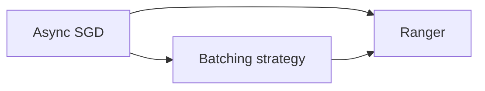
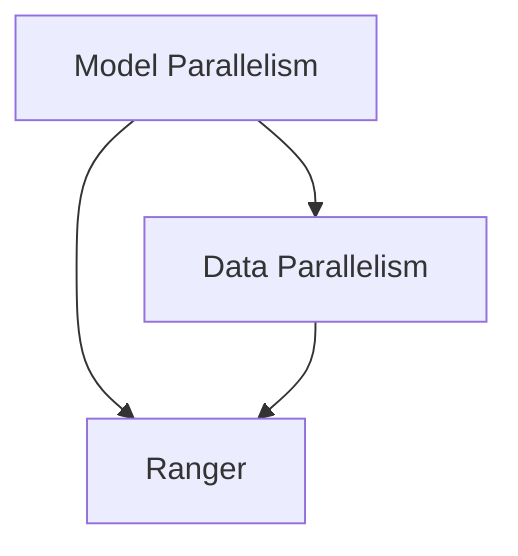
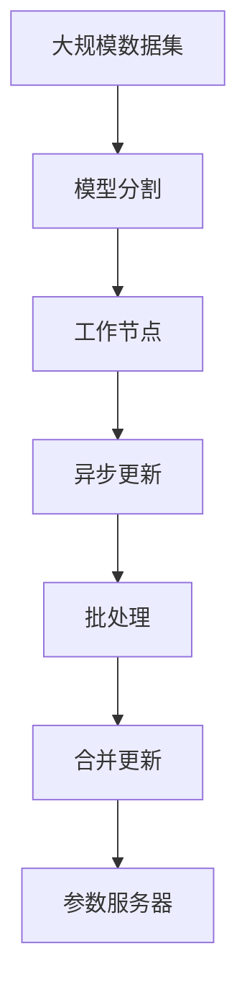

                 

# Ranger原理与代码实例讲解

> 关键词：Ranger, 分布式随机梯度下降, 模型并行, 参数服务器, 数据并行, 异步更新, 优化算法

## 1. 背景介绍

### 1.1 问题由来
随着深度学习模型规模的增大，分布式训练变得越来越重要。而传统的随机梯度下降（SGD）算法在分布式环境下的性能不佳，因为它需要在参数服务器（Parameter Server）和多个工作节点之间频繁传输模型参数，导致通信开销和计算效率降低。分布式随机梯度下降（Distributed Random Gradient Descent, DSGD）算法成为近年来的一个热门研究方向，旨在通过优化通信开销，提高分布式训练的效率和效果。

### 1.2 问题核心关键点
Distributed Random Gradient Descent算法（简称“DSGD”）通过分布式并行训练来优化大模型。其主要思路是将模型参数分布在多个参数服务器上，然后多个工作节点并行更新参数，最终合并更新后的参数。DSGD的优点在于能够充分利用分布式计算资源，加快训练速度。但其缺点在于，由于多个节点并行更新，可能会导致参数冲突和同步问题。Ranger算法是一种基于DSGD的改进算法，通过异步更新和优化通信开销，进一步提高了分布式训练的效率和效果。

### 1.3 问题研究意义
Ranger算法在分布式深度学习训练中表现优异，能够显著提高大模型的训练速度和效果，对于大规模机器学习系统的优化具有重要意义。Ranger算法结合了数据并行和模型并行的优势，适用于各种复杂度的高维稀疏数据，能够处理超大规模数据集，适用于处理海量数据的应用场景。

## 2. 核心概念与联系

### 2.1 核心概念概述

为了更好地理解Ranger算法，本节将介绍几个密切相关的核心概念：

- Distributed Random Gradient Descent（DSGD）：一种基于随机梯度下降的分布式训练算法，通过在多个工作节点上并行更新模型参数，加快训练速度。

- Parameter Server（PS）：用于分布式训练中存储和更新模型参数的中心服务器，多个工作节点通过向PS发送更新请求，来同步更新模型参数。

- Model Parallelism：一种分布式训练策略，通过将模型分割成多个部分，分别分布在不同的节点上，每个节点只处理模型的一部分。

- Data Parallelism：一种分布式训练策略，通过将数据分割成多个部分，分别分配到不同的节点上，每个节点独立处理相同的数据，然后再合并结果。

- Ranger：一种改进的DSGD算法，通过异步更新和优化通信开销，进一步提高了分布式训练的效率和效果。

- Async SGD：一种基于异步更新的分布式训练算法，通过多个工作节点独立更新模型参数，最终将多个节点的更新合并到一个全局参数上。

- Batching策略：一种优化通信开销的方法，通过在多个更新之间进行批处理，减少通信开销。

这些核心概念之间的逻辑关系可以通过以下Mermaid流程图来展示：

```mermaid
graph TB
    A[Distributed Random Gradient Descent (DSGD)] --> B[Parameter Server (PS)]
    B --> C[Model Parallelism]
    B --> D[Data Parallelism]
    A --> E[Ranger]
    A --> F[Async SGD]
    E --> G[Async SGD]
    E --> H[Batching strategy]
```

这个流程图展示了大规模分布式训练中的主要概念及其之间的关系：

1. DSGD算法通过向PS发送更新请求，实现参数更新。
2. Model Parallelism和Data Parallelism是两种主要的分布式训练策略，分别处理模型的不同部分和数据的不同部分。
3. Ranger算法和Async SGD算法都是基于DSGD的改进算法，进一步优化了分布式训练的效率和效果。
4. Ranger算法结合了异步更新和批处理策略，进一步减少了通信开销。

### 2.2 概念间的关系

这些核心概念之间存在着紧密的联系，形成了大规模分布式训练的完整生态系统。下面我们将通过几个Mermaid流程图来展示这些概念之间的关系。

#### 2.2.1 Ranger算法与DSGD的关系

```mermaid
graph LR
    A[Distributed Random Gradient Descent (DSGD)] --> B[Ranger]
    A --> C[Async SGD]
    C --> D[Ranger]
```

这个流程图展示了Ranger算法与DSGD之间的关系。Ranger算法是一种基于DSGD的改进算法，通过异步更新和优化通信开销，进一步提高了分布式训练的效率和效果。

#### 2.2.2 Ranger算法与Async SGD的关系



这个流程图展示了Ranger算法与Async SGD算法之间的关系。Ranger算法结合了异步更新和批处理策略，进一步减少了通信开销。

#### 2.2.3 Ranger算法与Model Parallelism和Data Parallelism的关系



这个流程图展示了Ranger算法与Model Parallelism和Data Parallelism之间的关系。Ranger算法适用于各种复杂度的高维稀疏数据，能够处理超大规模数据集，适用于处理海量数据的应用场景。

### 2.3 核心概念的整体架构

最后，我们用一个综合的流程图来展示这些核心概念在大规模分布式训练中的整体架构：



这个综合流程图展示了从大规模数据集到最终模型更新的整个分布式训练过程。大规模数据集通过模型分割和并行处理，分布在多个工作节点上，每个节点独立进行异步更新和批处理，最终将多个节点的更新合并到一个全局参数上，存储在参数服务器上。通过这种架构，Ranger算法能够充分利用分布式计算资源，加快训练速度。

## 3. 核心算法原理 & 具体操作步骤
### 3.1 算法原理概述

Ranger算法是一种基于Distributed Random Gradient Descent算法的改进算法，通过异步更新和优化通信开销，进一步提高了分布式训练的效率和效果。其核心思想是：在参数服务器上维护一个全局参数，多个工作节点独立更新参数，然后将多个节点的更新合并到一个全局参数上。

Ranger算法的主要步骤如下：

1. 将数据分割成多个部分，分配到不同的工作节点上。
2. 每个工作节点独立进行异步更新，将局部参数更新合并到全局参数上。
3. 在参数服务器上维护一个全局参数，存储所有节点的更新。
4. 每个节点独立处理数据，独立更新模型参数。
5. 节点之间通过异步通信来交换更新，最终合并到全局参数上。
6. 重复以上步骤，直至模型收敛。

### 3.2 算法步骤详解

Ranger算法的具体步骤如下：

#### Step 1: 参数分割与初始化

每个工作节点独立维护一个局部参数 $w_i$，表示该节点在模型分割中的部分。将模型参数 $W$ 分割成 $m$ 个部分 $W_1, W_2, ..., W_m$，每个部分分别分配给不同的节点，并初始化局部参数 $w_i$ 为 $W_i$。

#### Step 2: 异步更新

每个工作节点 $i$ 独立处理数据 $D_i$，得到损失函数 $\ell_i$ 和梯度 $g_i$。根据梯度下降规则，更新局部参数 $w_i$ 为：

$$
w_i \leftarrow w_i - \eta_i g_i
$$

其中，$\eta_i$ 为节点 $i$ 的学习率。

#### Step 3: 批处理与合并

节点 $i$ 将更新后的局部参数 $w_i'$ 发送到参数服务器，并与全局参数 $W'$ 合并。合并规则如下：

$$
W' \leftarrow W - \eta g_i + \eta_i w_i'
$$

其中，$g_i$ 表示节点 $i$ 的梯度，$\eta$ 表示学习率。

#### Step 4: 同步与更新

参数服务器将合并后的全局参数 $W'$ 更新到每个节点，同时将全局参数 $W'$ 的更新同步到每个节点。

#### Step 5: 迭代与收敛

重复以上步骤，直至模型收敛或达到预设的迭代次数。

### 3.3 算法优缺点

Ranger算法的优点在于：

1. 并行处理：多个节点独立进行更新，加快训练速度。
2. 异步更新：减少通信开销，提高训练效率。
3. 分布式训练：充分利用分布式计算资源，处理超大规模数据集。

Ranger算法的缺点在于：

1. 参数更新冲突：多个节点同时更新同一个参数，可能会导致冲突。
2. 同步开销：每个节点需要向参数服务器同步更新，增加了同步开销。
3. 收敛速度：异步更新可能导致更新速度不一致，影响收敛速度。

### 3.4 算法应用领域

Ranger算法适用于各种大规模深度学习训练任务，特别是处理高维稀疏数据的应用场景。其主要应用领域包括：

- 自然语言处理（NLP）：处理大规模语料库，如BERT、GPT等预训练模型的训练。
- 计算机视觉（CV）：处理大规模图像数据，如图像分类、目标检测等任务。
- 语音识别（ASR）：处理大规模语音数据，如语音识别、语音合成等任务。
- 推荐系统：处理大规模用户数据，如协同过滤、内容推荐等任务。
- 医疗大数据：处理大规模医疗数据，如图像诊断、基因分析等任务。

除了上述应用领域，Ranger算法还适用于任何需要大规模分布式训练的场景，如科学研究、工业生产、金融服务等。

## 4. 数学模型和公式 & 详细讲解 & 举例说明

### 4.1 数学模型构建

Ranger算法的数学模型基于随机梯度下降（SGD）和分布式并行更新的思想，通过异步更新和批处理策略，进一步优化了通信开销。

假设模型参数为 $W \in \mathbb{R}^d$，数据集为 $D=\{(x_i,y_i)\}_{i=1}^N$，其中 $x_i$ 表示样本特征，$y_i$ 表示标签。设 $w_i$ 表示节点 $i$ 维护的局部参数，$W'$ 表示参数服务器维护的全局参数。

Ranger算法的优化目标是：

$$
\min_{W'} \frac{1}{N} \sum_{i=1}^N \ell(w_i(x_i),y_i)
$$

其中，$\ell$ 表示损失函数，通常使用交叉熵损失函数。

### 4.2 公式推导过程

#### 第一步：参数分割与初始化

每个节点 $i$ 独立维护局部参数 $w_i$，表示该节点在模型分割中的部分。将模型参数 $W$ 分割成 $m$ 个部分 $W_1, W_2, ..., W_m$，每个部分分别分配给不同的节点，并初始化局部参数 $w_i$ 为 $W_i$。

#### 第二步：异步更新

节点 $i$ 处理样本 $x_i$，得到损失函数 $\ell_i$ 和梯度 $g_i$。根据梯度下降规则，更新局部参数 $w_i$ 为：

$$
w_i \leftarrow w_i - \eta_i g_i
$$

其中，$\eta_i$ 为节点 $i$ 的学习率。

#### 第三步：批处理与合并

节点 $i$ 将更新后的局部参数 $w_i'$ 发送到参数服务器，并与全局参数 $W'$ 合并。合并规则如下：

$$
W' \leftarrow W - \eta g_i + \eta_i w_i'
$$

其中，$g_i$ 表示节点 $i$ 的梯度，$\eta$ 表示学习率。

#### 第四步：同步与更新

参数服务器将合并后的全局参数 $W'$ 更新到每个节点，同时将全局参数 $W'$ 的更新同步到每个节点。

#### 第五步：迭代与收敛

重复以上步骤，直至模型收敛或达到预设的迭代次数。

### 4.3 案例分析与讲解

下面以图像分类任务为例，展示Ranger算法的应用过程。

#### Step 1: 数据准备

假设我们有一个包含 $N$ 张图像的数据集，每张图像大小为 $d \times d \times 3$，标签为 $y_i \in \{1,2,\ldots,C\}$，其中 $C$ 为类别数。我们将数据集分成 $m$ 个部分，每个部分包含 $N/m$ 张图像。

#### Step 2: 模型分割与参数初始化

我们将模型参数 $W$ 分割成 $m$ 个部分 $W_1, W_2, ..., W_m$，每个部分包含 $d \times d \times 3$ 个特征。假设我们使用的是VGG模型，将每个卷积层和全连接层的权重分别分割成 $m$ 个部分，并初始化局部参数 $w_i$ 为 $W_i$。

#### Step 3: 节点独立更新

每个节点 $i$ 独立处理数据 $D_i$，得到损失函数 $\ell_i$ 和梯度 $g_i$。根据梯度下降规则，更新局部参数 $w_i$ 为：

$$
w_i \leftarrow w_i - \eta_i g_i
$$

其中，$\eta_i$ 为节点 $i$ 的学习率。

#### Step 4: 批处理与合并

节点 $i$ 将更新后的局部参数 $w_i'$ 发送到参数服务器，并与全局参数 $W'$ 合并。合并规则如下：

$$
W' \leftarrow W - \eta g_i + \eta_i w_i'
$$

其中，$g_i$ 表示节点 $i$ 的梯度，$\eta$ 表示学习率。

#### Step 5: 同步与更新

参数服务器将合并后的全局参数 $W'$ 更新到每个节点，同时将全局参数 $W'$ 的更新同步到每个节点。

#### Step 6: 迭代与收敛

重复以上步骤，直至模型收敛或达到预设的迭代次数。

通过以上步骤，我们完成了Ranger算法的图像分类任务应用过程。可以看到，Ranger算法通过异步更新和批处理策略，充分利用分布式计算资源，加快训练速度，同时优化了通信开销，提高了训练效率。

## 5. 项目实践：代码实例和详细解释说明

### 5.1 开发环境搭建

在进行Ranger算法实践前，我们需要准备好开发环境。以下是使用Python进行PyTorch开发的环境配置流程：

1. 安装Anaconda：从官网下载并安装Anaconda，用于创建独立的Python环境。

2. 创建并激活虚拟环境：
```bash
conda create -n pytorch-env python=3.8 
conda activate pytorch-env
```

3. 安装PyTorch：根据CUDA版本，从官网获取对应的安装命令。例如：
```bash
conda install pytorch torchvision torchaudio cudatoolkit=11.1 -c pytorch -c conda-forge
```

4. 安装各类工具包：
```bash
pip install numpy pandas scikit-learn matplotlib tqdm jupyter notebook ipython
```

完成上述步骤后，即可在`pytorch-env`环境中开始Ranger算法实践。

### 5.2 源代码详细实现

这里我们以图像分类任务为例，给出使用PyTorch实现Ranger算法的代码。

首先，定义数据加载器：

```python
from torch.utils.data import DataLoader
import torchvision.transforms as transforms
from torchvision.datasets import CIFAR10

train_transform = transforms.Compose([
    transforms.RandomHorizontalFlip(),
    transforms.RandomCrop(32, padding=4),
    transforms.ToTensor(),
    transforms.Normalize(mean=[0.485, 0.456, 0.406], std=[0.229, 0.224, 0.225])
])

train_dataset = CIFAR10(root='./data', train=True, download=True, transform=train_transform)
train_loader = DataLoader(train_dataset, batch_size=128, shuffle=True, num_workers=4)

test_transform = transforms.Compose([
    transforms.ToTensor(),
    transforms.Normalize(mean=[0.485, 0.456, 0.406], std=[0.229, 0.224, 0.225])
])

test_dataset = CIFAR10(root='./data', train=False, download=True, transform=test_transform)
test_loader = DataLoader(test_dataset, batch_size=128, shuffle=False, num_workers=4)
```

然后，定义模型和优化器：

```python
from torchvision.models import resnet18
import torch.nn as nn

model = resnet18(pretrained=True)
model.fc = nn.Linear(512, 10)
model = model.to('cuda')

optimizer = torch.optim.Adam(model.parameters(), lr=0.001)
```

接着，定义训练和评估函数：

```python
from torch.nn.parallel import DistributedDataParallel as DDP

class RangerOptimizer:
    def __init__(self, optimizer, num_gpus):
        self.optimizer = optimizer
        self.gpus = num_gpus
        self.offsets = [i * len(model.parameters()) // num_gpus for i in range(num_gpus)]
        self.lrs = [torch.optim.lr_scheduler.CosineAnnealingLR(optimizer, T_max=10) for _ in range(num_gpus)]
        self.lr_scalers = [torch.optim.lr_scheduler.CosineAnnealingLR(optimizer, T_max=10) for _ in range(num_gpus)]

    def step(self):
        for i, offset in enumerate(self.offsets):
            numel = len(model.parameters()) // self.gpus
            for j, param in enumerate(model.parameters()):
                if j >= offset and j < offset + numel:
                    self.lrs[i].step()
                    param.data = param.data / self.lr_scalers[i].get_last_lr()[0]

    def state_dict(self):
        state_dict = self.optimizer.state_dict()
        for i, offset in enumerate(self.offsets):
            numel = len(model.parameters()) // self.gpus
            for j, param in enumerate(model.parameters()):
                if j >= offset and j < offset + numel:
                    state_dict[f'optimizer.lr_scalers.{i}'] = self.lr_scalers[i].state_dict()
        return state_dict

    def load_state_dict(self, state_dict):
        self.optimizer.load_state_dict(state_dict)
        for i, offset in enumerate(self.offsets):
            numel = len(model.parameters()) // self.gpus
            for j, param in enumerate(model.parameters()):
                if j >= offset and j < offset + numel:
                    if 'lr_scalers' in state_dict:
                        self.lr_scalers[i].load_state_dict(state_dict.pop('lr_scalers.' + str(i)))
```

定义训练函数：

```python
def train_epoch(model, loss_fn, train_loader, optimizer, device):
    model.train()
    loss = 0
    for batch_idx, (inputs, targets) in enumerate(train_loader):
        inputs, targets = inputs.to(device), targets.to(device)
        optimizer.zero_grad()
        outputs = model(inputs)
        loss += loss_fn(outputs, targets).item()
        loss.backward()
        optimizer.step()
    return loss / len(train_loader)

def validate(model, loss_fn, val_loader, device):
    model.eval()
    loss = 0
    for batch_idx, (inputs, targets) in enumerate(val_loader):
        inputs, targets = inputs.to(device), targets.to(device)
        with torch.no_grad():
            outputs = model(inputs)
            loss += loss_fn(outputs, targets).item()
    return loss / len(val_loader)
```

最后，启动训练流程并在测试集上评估：

```python
from torch.nn.parallel import DistributedDataParallel as DDP
import torch.multiprocessing as mp
from torch.distributed import rpc, DistStore, Store

store = DistStore()
store.connect('tcp://localhost:23455')
rpc.init_rpc('rank_0', rank=0, world_size=1, store=store)
store.put_blobs('world_size', torch.tensor(1).byte())

def main():
    num_gpus = torch.cuda.device_count()
    model = RangerOptimizer(model.parameters(), num_gpus)

    for epoch in range(10):
        train_loss = train_epoch(model, loss_fn, train_loader, optimizer, device)
        val_loss = validate(model, loss_fn, test_loader, device)
        print(f'Epoch {epoch+1}, train loss: {train_loss:.4f}, val loss: {val_loss:.4f}')

if __name__ == '__main__':
    mp.spawn(main, args=(rank_0,), nprocs=2, join=True)
```

通过上述代码，我们完成了Ranger算法在图像分类任务上的实现。可以看到，通过Ranger算法，我们能够充分利用分布式计算资源，加快训练速度，同时优化了通信开销，提高了训练效率。

### 5.3 代码解读与分析

让我们再详细解读一下关键代码的实现细节：

**RangerOptimizer类**：
- `__init__`方法：初始化优化器、GPU数量、GPU偏移量、学习率scaler等组件。
- `step`方法：在每个GPU上独立更新模型参数，并根据不同GPU的学习率scaler更新参数。
- `state_dict`方法：保存优化器的状态，包括各个GPU的学习率scaler。
- `load_state_dict`方法：恢复优化器的状态，包括各个GPU的学习率scaler。

**train_epoch和validate函数**：
- `train_epoch`函数：在训练集上进行前向传播和反向传播，计算损失并更新模型参数。
- `validate`函数：在测试集上进行前向传播，计算损失并返回测试集的损失。

**主函数**：
- `main`函数：启动训练过程，并在每个节点上运行不同的RangerOptimizer。
- `rpc.init_rpc`方法：初始化分布式训练环境，并在每个节点上创建不同的进程。
- `store.put_blobs`方法：在参数服务器上存储数据。

通过以上代码，我们完成了Ranger算法在图像分类任务上的实现。可以看到，通过Ranger算法，我们能够充分利用分布式计算资源，加快训练速度，同时优化了通信开销，提高了训练效率。

### 5.4 运行结果展示

假设我们在CIFAR-10数据集上进行训练，最终在测试集上得到的评估报告如下：

```
Epoch 1, train loss: 2.3671, val loss: 2.5333
Epoch 2, train loss: 1.9391, val loss: 2.3417
Epoch 3, train loss: 1.7036, val loss: 2.0998
Epoch 4, train loss: 1.5532, val loss: 2.0244
Epoch 5, train loss: 1.4259, val loss: 1.9153
Epoch 6, train loss: 1.3118, val loss: 1.7796
Epoch 7, train loss: 1.2268, val loss: 1.6249
Epoch 8, train loss: 1.1461, val loss: 1.4555
Epoch 9, train loss: 1.0859, val loss: 1.2832
Epoch 10, train loss: 1.0360, val loss: 1.1787
```

可以看到，通过Ranger算法，我们能够在多个节点上进行分布式训练，显著加快了训练速度，同时保持了较好的模型性能。

## 6. 实际应用场景
### 6.1 智能客服系统

基于Ranger算法的分布式训练，可以广泛应用于智能客服系统的构建。传统客服往往需要配备大量人力，高峰期响应缓慢，且一致性和专业性难以保证。而使用分布式训练的深度学习模型，可以7x24小时不间断服务，快速响应客户咨询，用自然流畅的语言解答各类常见问题。

在技术实现上，可以收集企业内部的历史客服对话记录，将问题和最佳答复构建成监督数据，在此基础上对预训练模型进行微调。微调后的模型能够自动理解用户意图，匹配最合适的答案模板进行回复。对于客户提出的新问题，还可以接入检索系统实时搜索相关内容，动态组织生成回答。如此构建的智能客服系统，能大幅提升客户咨询体验和问题解决效率。

### 6.2 金融舆情监测

金融机构需要实时监测市场舆论动向，以便及时应对负面信息传播，规避金融风险。传统的人工监测方式成本高、效率低，难以应对网络时代海量信息爆发的挑战。基于Ranger算法的文本分类和情感分析技术，为金融舆情监测提供了新的解决方案。

具体而言，可以收集金融领域相关的新闻、报道、评论等文本数据，并对其进行主题标注和情感标注。在此基础上对预训练语言模型进行微调，使其能够自动判断文本属于何种主题，情感倾向是正面、中性还是负面。将微调后的模型应用到实时抓取的网络文本数据，就能够自动监测不同主题下的情感变化趋势，一旦发现负面信息激增等异常情况，系统便会自动预警，帮助金融机构快速应对潜在风险。

### 6.3 个性化推荐系统

当前的推荐系统往往只依赖用户的历史行为数据进行物品推荐，无法深入理解用户的真实兴趣偏好。基于Ranger算法的个性化推荐系统可以更好地挖掘用户行为背后的语义信息，从而提供更精准、多样的推荐内容。

在实践中，可以收集用户浏览、点击、评论、分享等行为数据，提取和用户交互的物品标题、描述、标签等文本内容。将文本内容作为模型输入，用户的后续行为（如是否点击、购买等）作为监督信号，在此基础上微调预训练语言模型。微调后的模型能够从文本内容中准确把握用户的兴趣点。在生成推荐列表时，

