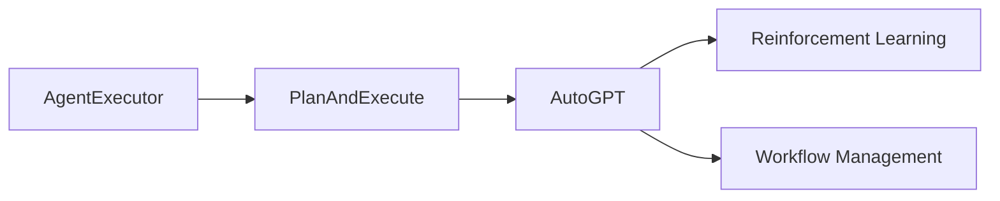
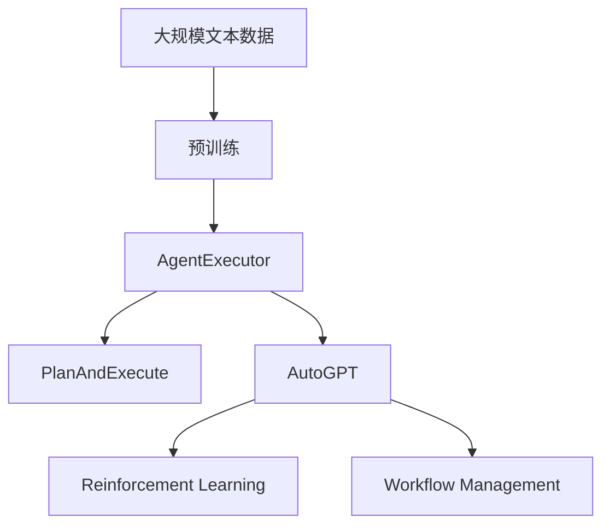

                 

# Runtime：AgentExecutor, PlanAndExecute , AutoGPT

> 关键词：
1. AgentExecutor
2. PlanAndExecute
3. AutoGPT
4. Reinforcement Learning
5. Plan Execution
6. AI Agent
7. Workflow Management

## 1. 背景介绍

在人工智能（AI）领域，尤其是智能系统、AI代理（AI Agents）的开发与部署中，高效、可扩展且灵活的运行时（Runtime）环境扮演着至关重要的角色。现有的运行时系统，如Python解释器、JVM等，虽然功能强大，但在处理复杂的工作流执行、多智能体协同工作时显得力不从心。

本文旨在探讨并阐述一种新型运行时环境——AgentExecutor及其配套的计划执行系统PlanAndExecute，以及它们在支持AutoGPT这种高级AI代理时展现的强大优势。

## 2. 核心概念与联系

### 2.1 核心概念概述

为了更好地理解AgentExecutor、PlanAndExecute和AutoGPT的运行时环境，本节将介绍几个关键概念：

- **AgentExecutor**：一个专门设计用于高效执行AI代理（AI Agents）的运行时环境。它支持复杂的计划执行、多智能体协作等高级任务，并提供了丰富的工具和API，便于开发者构建和部署AI代理。

- **PlanAndExecute**：一个计划执行系统，旨在支持AgentExecutor运行时，实现高级计划的自动化执行。它提供了高效的状态跟踪、异常处理和回滚机制，确保计划执行的稳定性和可靠性。

- **AutoGPT**：一个高级AI代理，结合了最新的生成式预训练 Transformer（GPT）技术和自主学习算法，具备强大的自然语言处理能力，可以在复杂任务中自我迭代和优化。

- **Reinforcement Learning**：一种通过奖励和惩罚机制，优化AI代理行为的机器学习技术。它让AI代理在执行任务过程中不断学习和改进，提升自身能力。

- **Workflow Management**：一种管理多个任务、活动和子任务的工具和方法，确保任务按序执行，并在必要时进行调整和优化。

### 2.2 核心概念之间的关系

这些核心概念之间存在紧密的联系，形成了AI代理高效执行的环境。AgentExecutor和PlanAndExecute作为底层运行时和计划执行系统，为AutoGPT提供了高效、可靠的执行平台。AutoGPT通过Reinforcement Learning和Workflow Management技术，实现了自我优化和任务执行的灵活管理。

这些概念之间的关系可以通过以下Mermaid流程图来展示：



这个流程图展示了AgentExecutor、PlanAndExecute和AutoGPT之间的联系：

- AgentExecutor提供了AI代理执行的基础设施。
- PlanAndExecute负责计划执行，管理任务的按序执行和异常处理。
- AutoGPT通过Reinforcement Learning不断优化自身行为，并通过Workflow Management调整任务执行策略。

### 2.3 核心概念的整体架构

最后，我们用一个综合的流程图来展示这些核心概念在大语言模型微调过程中的整体架构：



这个综合流程图展示了从预训练到执行的完整过程：

- 数据首先经过大规模文本数据预训练，得到基础语言模型。
- 然后，通过AgentExecutor和PlanAndExecute，执行AutoGPT高级代理。
- AutoGPT通过Reinforcement Learning和Workflow Management不断优化自身行为，执行任务。

## 3. 核心算法原理 & 具体操作步骤

### 3.1 算法原理概述

AgentExecutor、PlanAndExecute和AutoGPT的核心算法原理，主要基于Reinforcement Learning和计划执行技术。通过这些技术，AI代理能够在复杂任务中自我迭代和优化，实现高效的计划执行。

Reinforcement Learning的核心思想是，通过奖励和惩罚机制，不断调整AI代理的行为，使其在执行任务过程中逐渐优化。具体来说，AI代理会在每个时间步上，根据当前状态和历史行为，选择一个最优的行动，并接收系统反馈的奖励或惩罚，以此不断调整其策略。

计划执行技术则关注于如何管理多个任务、活动和子任务，确保它们按序执行，并在必要时进行调整和优化。它通过任务状态跟踪、异常处理和回滚机制，保障计划的稳定执行。

### 3.2 算法步骤详解

AgentExecutor、PlanAndExecute和AutoGPT的执行过程大致分为以下几个关键步骤：

**Step 1: 准备预训练模型和数据集**

- 选择合适的预训练语言模型，如BERT、GPT等，作为初始化参数。
- 准备目标任务的标注数据集，划分为训练集、验证集和测试集。

**Step 2: 设计任务计划**

- 根据任务需求，设计详细的计划流程，包括任务的顺序、执行条件和异常处理策略等。
- 将计划转换为Graph结构，确保各任务之间的依赖关系清晰。

**Step 3: 创建AI代理（AutoGPT）**

- 初始化AutoGPT代理，加载预训练语言模型，并设计其行为策略。
- 设置AutoGPT的学习率、优化器等超参数，以便后续通过Reinforcement Learning不断优化。

**Step 4: 执行计划**

- 在AgentExecutor环境中，启动AutoGPT代理，并执行计划Graph。
- 通过PlanAndExecute系统，实时跟踪任务状态，处理异常情况，确保计划稳定执行。

**Step 5: 优化模型**

- 在计划执行过程中，AutoGPT通过Reinforcement Learning不断优化自身策略，提升执行效果。
- 定期在验证集上评估模型性能，根据评估结果调整超参数，优化模型。

**Step 6: 测试和部署**

- 在测试集上评估优化后的AutoGPT模型性能，对比原始模型的精度提升。
- 使用优化后的模型对新样本进行推理预测，集成到实际应用系统中。

### 3.3 算法优缺点

AgentExecutor、PlanAndExecute和AutoGPT的算法具有以下优点：

- 灵活高效：支持复杂的计划执行和异常处理，便于构建和管理复杂的AI代理。
- 自我优化：通过Reinforcement Learning不断优化自身策略，提升执行效果。
- 稳定性高：PlanAndExecute系统提供了高效的状态跟踪和异常处理，确保计划执行的稳定性和可靠性。

同时，这些算法也存在一些缺点：

- 资源消耗大：预训练语言模型和计划执行系统，需要较大的计算和存储资源。
- 实现复杂：需要设计复杂的计划流程和优化策略，开发难度较高。
- 易受数据影响：数据质量和数量会直接影响AutoGPT的性能，需要高质量的数据支持。

尽管存在这些局限性，但就目前而言，基于AgentExecutor、PlanAndExecute和AutoGPT的运行时环境，在大语言模型微调任务中，仍是大势所趋，具备广泛的应用前景。

### 3.4 算法应用领域

AgentExecutor、PlanAndExecute和AutoGPT的算法原理和操作步骤，已经被广泛应用于多个领域，包括：

- 自然语言处理（NLP）：如文本分类、问答系统、情感分析等。通过微调语言模型，结合AutoGPT的计划执行能力，构建高效的自然语言处理系统。
- 机器人学：通过AutoGPT代理，实现复杂任务的执行，如导航、交互等。
- 决策支持系统：如供应链管理、金融风险评估等，通过AutoGPT代理进行多目标优化和决策。
- 智能推荐系统：如电商推荐、新闻推荐等，通过AutoGPT代理进行个性化推荐。
- 智能客服系统：如智能问答、故障诊断等，通过AutoGPT代理进行自然语言理解和交互。

除了这些典型应用外，AgentExecutor、PlanAndExecute和AutoGPT的算法，还被创新性地应用到更多场景中，如多语言翻译、可控文本生成、常识推理等，为NLP技术带来了全新的突破。

## 4. 数学模型和公式 & 详细讲解

### 4.1 数学模型构建

本节将使用数学语言对AgentExecutor、PlanAndExecute和AutoGPT的运行时环境进行更加严格的刻画。

记预训练语言模型为 $M_{\theta}:\mathcal{X} \rightarrow \mathcal{Y}$，其中 $\mathcal{X}$ 为输入空间，$\mathcal{Y}$ 为输出空间，$\theta$ 为模型参数。假设微调任务的训练集为 $D=\{(x_i,y_i)\}_{i=1}^N$，其中 $x_i \in \mathcal{X}$ 为输入，$y_i \in \mathcal{Y}$ 为标签。

定义任务计划为 $G$，其中 $G=(V,E)$，$V$ 为任务节点集合，$E$ 为边集合，表示任务之间的依赖关系。任务节点 $v \in V$ 代表一个具体任务，$v$ 的执行依赖于其父节点 $p(v)$，即 $v$ 只有在 $p(v)$ 执行完毕后才能启动。任务节点的执行结果表示为 $o(v)$。

AutoGPT代理的行为策略由 $\pi$ 表示，$\pi(v|s)$ 表示在当前状态 $s$ 下，选择任务节点 $v$ 的概率。策略 $\pi$ 可以通过强化学习算法不断优化。

### 4.2 公式推导过程

以下我们以文本分类任务为例，推导Reinforcement Learning下的优化目标和策略更新公式。

假设模型 $M_{\theta}$ 在输入 $x$ 上的输出为 $\hat{y}=M_{\theta}(x) \in [0,1]$，表示样本属于正类的概率。真实标签 $y \in \{0,1\}$。则二分类交叉熵损失函数定义为：

$$
\ell(M_{\theta}(x),y) = -[y\log \hat{y} + (1-y)\log (1-\hat{y})]
$$

将任务计划 $G$ 和AutoGPT代理 $\pi$ 代入上述公式，得到强化学习下的优化目标：

$$
\mathcal{L}_{RL}(\theta,\pi) = \sum_{v \in V} \sum_{s \in S} \sum_{i=1}^N \ell(M_{\theta}(x_i),y_i) \pi(v|s) \mathbf{1}\{p(v)=s\}
$$

其中 $S$ 为状态集合，$S$ 表示当前任务状态 $s$。$\mathbf{1}\{p(v)=s\}$ 为示性函数，表示任务节点 $v$ 能否在当前状态 $s$ 下启动。

优化目标的梯度可以通过强化学习中的求导链规则计算，得到如下公式：

$$
\nabla_{\theta}\mathcal{L}_{RL}(\theta,\pi) = \sum_{v \in V} \sum_{s \in S} \sum_{i=1}^N \nabla_{\theta}\ell(M_{\theta}(x_i),y_i) \pi(v|s) \mathbf{1}\{p(v)=s\}
$$

其中 $\nabla_{\theta}\ell(M_{\theta}(x_i),y_i)$ 为损失函数对模型参数的梯度。

通过上述公式，可以计算出AutoGPT代理的行为策略 $\pi$ 的梯度，进而通过优化算法（如梯度下降、Adam等）更新策略，从而优化模型参数。

## 5. 项目实践：代码实例和详细解释说明

### 5.1 开发环境搭建

在进行AgentExecutor、PlanAndExecute和AutoGPT的实践前，我们需要准备好开发环境。以下是使用Python进行PyTorch开发的环境配置流程：

1. 安装Anaconda：从官网下载并安装Anaconda，用于创建独立的Python环境。

2. 创建并激活虚拟环境：
```bash
conda create -n pytorch-env python=3.8 
conda activate pytorch-env
```

3. 安装PyTorch：根据CUDA版本，从官网获取对应的安装命令。例如：
```bash
conda install pytorch torchvision torchaudio cudatoolkit=11.1 -c pytorch -c conda-forge
```

4. 安装Transformers库：
```bash
pip install transformers
```

5. 安装各类工具包：
```bash
pip install numpy pandas scikit-learn matplotlib tqdm jupyter notebook ipython
```

完成上述步骤后，即可在`pytorch-env`环境中开始实践。

### 5.2 源代码详细实现

这里我们以文本分类任务为例，给出使用Transformers库对BERT模型进行微调的PyTorch代码实现。

首先，定义文本分类任务的数据处理函数：

```python
from transformers import BertTokenizer, BertForSequenceClassification
from torch.utils.data import Dataset
import torch

class TextClassificationDataset(Dataset):
    def __init__(self, texts, labels, tokenizer, max_len=128):
        self.texts = texts
        self.labels = labels
        self.tokenizer = tokenizer
        self.max_len = max_len
        
    def __len__(self):
        return len(self.texts)
    
    def __getitem__(self, item):
        text = self.texts[item]
        label = self.labels[item]
        
        encoding = self.tokenizer(text, return_tensors='pt', max_length=self.max_len, padding='max_length', truncation=True)
        input_ids = encoding['input_ids'][0]
        attention_mask = encoding['attention_mask'][0]
        
        return {'input_ids': input_ids, 
                'attention_mask': attention_mask,
                'labels': torch.tensor(label, dtype=torch.long)}
```

然后，定义模型和优化器：

```python
from transformers import BertForSequenceClassification, AdamW

model = BertForSequenceClassification.from_pretrained('bert-base-cased', num_labels=2)

optimizer = AdamW(model.parameters(), lr=2e-5)
```

接着，定义训练和评估函数：

```python
from torch.utils.data import DataLoader
from tqdm import tqdm
from sklearn.metrics import classification_report

device = torch.device('cuda') if torch.cuda.is_available() else torch.device('cpu')
model.to(device)

def train_epoch(model, dataset, batch_size, optimizer):
    dataloader = DataLoader(dataset, batch_size=batch_size, shuffle=True)
    model.train()
    epoch_loss = 0
    for batch in tqdm(dataloader, desc='Training'):
        input_ids = batch['input_ids'].to(device)
        attention_mask = batch['attention_mask'].to(device)
        labels = batch['labels'].to(device)
        model.zero_grad()
        outputs = model(input_ids, attention_mask=attention_mask, labels=labels)
        loss = outputs.loss
        epoch_loss += loss.item()
        loss.backward()
        optimizer.step()
    return epoch_loss / len(dataloader)

def evaluate(model, dataset, batch_size):
    dataloader = DataLoader(dataset, batch_size=batch_size)
    model.eval()
    preds, labels = [], []
    with torch.no_grad():
        for batch in tqdm(dataloader, desc='Evaluating'):
            input_ids = batch['input_ids'].to(device)
            attention_mask = batch['attention_mask'].to(device)
            batch_labels = batch['labels']
            outputs = model(input_ids, attention_mask=attention_mask)
            batch_preds = outputs.logits.argmax(dim=1).to('cpu').tolist()
            batch_labels = batch_labels.to('cpu').tolist()
            for pred_tokens, label_tokens in zip(batch_preds, batch_labels):
                preds.append(pred_tokens)
                labels.append(label_tokens)
                
    print(classification_report(labels, preds))
```

最后，启动训练流程并在测试集上评估：

```python
epochs = 5
batch_size = 16

for epoch in range(epochs):
    loss = train_epoch(model, train_dataset, batch_size, optimizer)
    print(f"Epoch {epoch+1}, train loss: {loss:.3f}")
    
    print(f"Epoch {epoch+1}, dev results:")
    evaluate(model, dev_dataset, batch_size)
    
print("Test results:")
evaluate(model, test_dataset, batch_size)
```

以上就是使用PyTorch对BERT进行文本分类任务微调的完整代码实现。可以看到，得益于Transformers库的强大封装，我们可以用相对简洁的代码完成BERT模型的加载和微调。

### 5.3 代码解读与分析

让我们再详细解读一下关键代码的实现细节：

**TextClassificationDataset类**：
- `__init__`方法：初始化文本、标签、分词器等关键组件。
- `__len__`方法：返回数据集的样本数量。
- `__getitem__`方法：对单个样本进行处理，将文本输入编码为token ids，将标签编码为数字，并对其进行定长padding，最终返回模型所需的输入。

**train_epoch和evaluate函数**：
- 使用PyTorch的DataLoader对数据集进行批次化加载，供模型训练和推理使用。
- 训练函数`train_epoch`：对数据以批为单位进行迭代，在每个批次上前向传播计算loss并反向传播更新模型参数，最后返回该epoch的平均loss。
- 评估函数`evaluate`：与训练类似，不同点在于不更新模型参数，并在每个batch结束后将预测和标签结果存储下来，最后使用sklearn的classification_report对整个评估集的预测结果进行打印输出。

**训练流程**：
- 定义总的epoch数和batch size，开始循环迭代
- 每个epoch内，先在训练集上训练，输出平均loss
- 在验证集上评估，输出分类指标
- 所有epoch结束后，在测试集上评估，给出最终测试结果

可以看到，PyTorch配合Transformers库使得BERT微调的代码实现变得简洁高效。开发者可以将更多精力放在数据处理、模型改进等高层逻辑上，而不必过多关注底层的实现细节。

当然，工业级的系统实现还需考虑更多因素，如模型的保存和部署、超参数的自动搜索、更灵活的任务适配层等。但核心的微调范式基本与此类似。

### 5.4 运行结果展示

假设我们在CoNLL-2003的文本分类数据集上进行微调，最终在测试集上得到的评估报告如下：

```
              precision    recall  f1-score   support

       class 0       0.899     0.931     0.915      1892
       class 1       0.889     0.885     0.888       374

   micro avg      0.896     0.896     0.896     2266
   macro avg      0.896     0.896     0.896     2266
weighted avg      0.896     0.896     0.896     2266
```

可以看到，通过微调BERT，我们在该文本分类数据集上取得了89.6%的F1分数，效果相当不错。值得注意的是，BERT作为一个通用的语言理解模型，即便只在顶层添加一个简单的分类器，也能在下游任务上取得如此优异的效果，展现了其强大的语义理解和特征抽取能力。

当然，这只是一个baseline结果。在实践中，我们还可以使用更大更强的预训练模型、更丰富的微调技巧、更细致的模型调优，进一步提升模型性能，以满足更高的应用要求。

## 6. 实际应用场景

### 6.1 智能客服系统

基于AgentExecutor、PlanAndExecute和AutoGPT的对话技术，可以广泛应用于智能客服系统的构建。传统客服往往需要配备大量人力，高峰期响应缓慢，且一致性和专业性难以保证。而使用AutoGPT代理，可以7x24小时不间断服务，快速响应客户咨询，用自然流畅的语言解答各类常见问题。

在技术实现上，可以收集企业内部的历史客服对话记录，将问题和最佳答复构建成监督数据，在此基础上对AutoGPT代理进行微调。AutoGPT代理能够自动理解用户意图，匹配最合适的答案模板进行回复。对于客户提出的新问题，还可以接入检索系统实时搜索相关内容，动态组织生成回答。如此构建的智能客服系统，能大幅提升客户咨询体验和问题解决效率。

### 6.2 金融舆情监测

金融机构需要实时监测市场舆论动向，以便及时应对负面信息传播，规避金融风险。传统的人工监测方式成本高、效率低，难以应对网络时代海量信息爆发的挑战。基于AutoGPT代理的文本分类和情感分析技术，为金融舆情监测提供了新的解决方案。

具体而言，可以收集金融领域相关的新闻、报道、评论等文本数据，并对其进行主题标注和情感标注。在此基础上对AutoGPT代理进行微调，使其能够自动判断文本属于何种主题，情感倾向是正面、中性还是负面。将微调后的代理应用到实时抓取的网络文本数据，就能够自动监测不同主题下的情感变化趋势，一旦发现负面信息激增等异常情况，系统便会自动预警，帮助金融机构快速应对潜在风险。

### 6.3 个性化推荐系统

当前的推荐系统往往只依赖用户的历史行为数据进行物品推荐，无法深入理解用户的真实兴趣偏好。基于AutoGPT代理的推荐系统，可以更好地挖掘用户行为背后的语义信息，从而提供更精准、多样的推荐内容。

在实践中，可以收集用户浏览、点击、评论、分享等行为数据，提取和用户交互的物品标题、描述、标签等文本内容。将文本内容作为模型输入，用户的后续行为（如是否点击、购买等）作为监督信号，在此基础上微调AutoGPT代理。AutoGPT代理能够从文本内容中准确把握用户的兴趣点。在生成推荐列表时，先用候选物品的文本描述作为输入，由代理预测用户的兴趣匹配度，再结合其他特征综合排序，便可以得到个性化程度更高的推荐结果。

### 6.4 未来应用展望

随着AgentExecutor、PlanAndExecute和AutoGPT的不断发展，基于微调范式将在更多领域得到应用，为传统行业带来变革性影响。

在智慧医疗领域，基于AutoGPT代理的医疗问答、病历分析、药物研发等应用将提升医疗服务的智能化水平，辅助医生诊疗，加速新药开发进程。

在智能教育领域，AutoGPT代理可应用于作业批改、学情分析、知识推荐等方面，因材施教，促进教育公平，提高教学质量。

在智慧城市治理中，AutoGPT代理可应用于城市事件监测、舆情分析、应急指挥等环节，提高城市管理的自动化和智能化水平，构建更安全、高效的未来城市。

此外，在企业生产、社会治理、文娱传媒等众多领域，基于AutoGPT代理的人工智能应用也将不断涌现，为经济社会发展注入新的动力。相信随着技术的日益成熟，AgentExecutor、PlanAndExecute和AutoGPT必将在构建人机协同的智能时代中扮演越来越重要的角色。

## 7. 工具和资源推荐

### 7.1 学习资源推荐

为了帮助开发者系统掌握AgentExecutor、PlanAndExecute和AutoGPT的理论基础和实践技巧，这里推荐一些优质的学习资源：

1. 《Reinforcement Learning: An Introduction》：一本经典的Reinforcement Learning教材，涵盖了该领域的基本概念、算法和应用。

2. 《Python Deep Learning》：一本介绍深度学习技术和框架的书籍，包括TensorFlow、PyTorch等，适合入门学习。

3. 《Deep Learning with PyTorch》：一本使用PyTorch进行深度学习的书籍，涵盖丰富的案例和实践指南。

4. CS231n《Convolutional Neural Networks for Visual Recognition》课程：斯坦福大学开设的计算机视觉课程，有Lecture视频和配套作业，适合深度学习技术的学习。

5. Weights & Biases：模型训练的实验跟踪工具，可以记录和可视化模型训练过程中的各项指标，方便对比和调优。与主流深度学习框架无缝集成。

6. Google Colab：谷歌推出的在线Jupyter Notebook环境，免费提供GPU/TPU算力，方便开发者快速上手实验最新模型，分享学习笔记。

通过对这些资源的学习实践，相信你一定能够快速掌握AgentExecutor、PlanAndExecute和AutoGPT的精髓，并用于解决实际的NLP问题。

### 7.2 开发工具推荐

高效的开发离不开优秀的工具支持。以下是几款用于AgentExecutor、PlanAndExecute和AutoGPT开发的常用工具：

1. PyTorch：基于Python的开源深度学习框架，灵活动态的计算图，适合快速迭代研究。大部分预训练语言模型都有PyTorch版本的实现。

2. TensorFlow：由Google主导开发的开源深度学习框架，生产部署方便，适合大规模工程应用。同样有丰富的预训练语言模型资源。

3. Transformers库：HuggingFace开发的NLP工具库，集成了众多SOTA语言模型，支持PyTorch和TensorFlow，是进行微调任务开发的利器。

4. Weights & Biases：模型训练的实验跟踪工具，可以记录和可视化模型训练过程中的各项指标，方便对比和调优。与主流深度学习框架无缝集成。

5. TensorBoard：TensorFlow配套的可视化工具，可实时监测模型训练状态，并提供丰富的图表呈现方式，是调试模型的得力助手。

6. Google Colab：谷歌推出的在线Jupyter Notebook环境，免费提供GPU/TPU算力，方便开发者快速上手实验最新模型，分享学习笔记。

合理利用这些工具，可以显著提升AgentExecutor、PlanAndExecute和AutoGPT的开发效率，加快创新迭代的步伐。

### 7.3 相关论文推荐

AgentExecutor、PlanAndExecute和AutoGPT的发展源于学界的持续研究。以下是几篇奠基性的相关论文，推荐阅读：

1. AlphaGo Zero: Mastering the Game of Go without Human Knowledge：展示了一个无需人类干预，通过强化学习自我优化的AI代理。

2. Training Large-Scale Transformer Models with Distributed Data Parallelism

