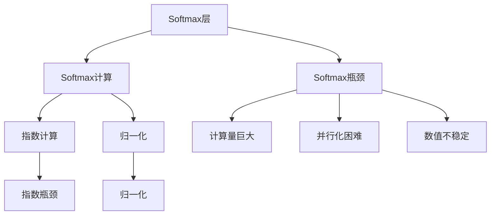
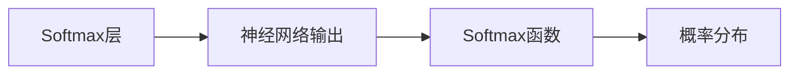
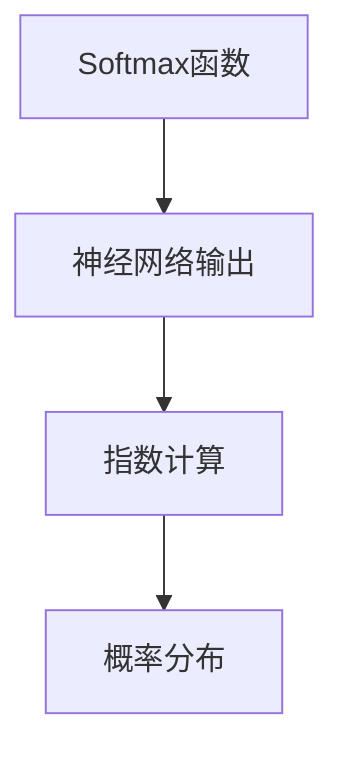
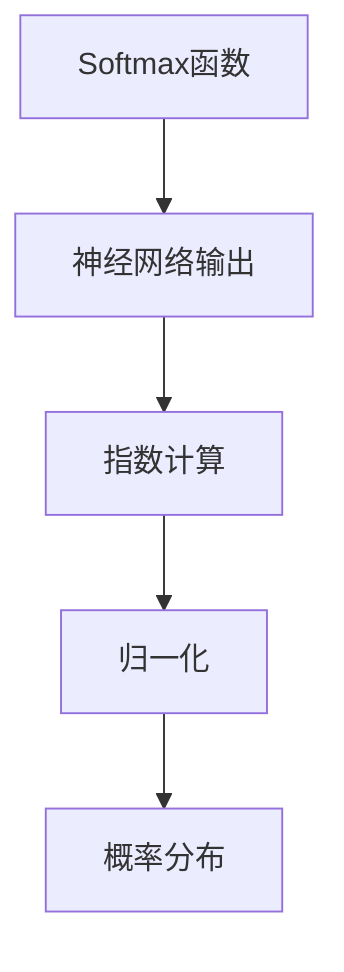
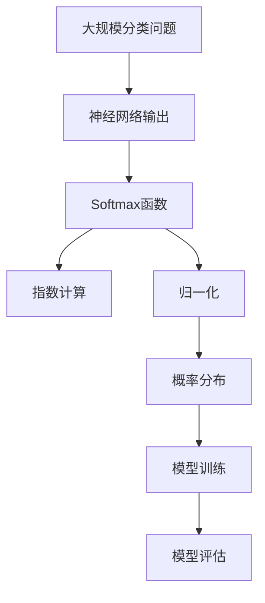

                 

# Softmax瓶颈的影响

## 1. 背景介绍

### 1.1 问题由来
在深度学习中，Softmax层是一种常见的层类型，广泛应用于多分类问题。但是，Softmax层在处理大规模分类问题时，会遇到严重的计算瓶颈，导致模型训练时间大幅延长，甚至无法收敛。

### 1.2 问题核心关键点
Softmax瓶颈主要由以下几个关键问题构成：

- Softmax计算的指数计算量巨大。对于每个样本，Softmax函数需要对所有类别的概率进行指数计算，导致计算复杂度呈指数级增长。
- Softmax层的并行化处理困难。由于Softmax函数不是线性的，导致难以高效并行计算。
- Softmax层输出结果容易产生数值下溢和上溢，对数值稳定性造成挑战。

### 1.3 问题研究意义
研究Softmax瓶颈的影响，对于提高深度学习模型的训练效率、优化模型架构设计、提升模型在实际应用中的性能具有重要意义。

## 2. 核心概念与联系

### 2.1 核心概念概述

为更好地理解Softmax瓶颈的影响，本节将介绍几个密切相关的核心概念：

- Softmax层：深度学习中用于多分类问题的一种常见层类型，用于将神经网络的输出转化为概率分布。
- Softmax计算：Softmax函数的计算过程，包括指数计算和归一化操作。
- Softmax瓶颈：Softmax层在处理大规模分类问题时，由于计算量巨大、并行化困难和数值不稳定等特性，导致模型训练效率低下，甚至无法收敛。

这些核心概念之间的逻辑关系可以通过以下Mermaid流程图来展示：



这个流程图展示了Softmax层、Softmax计算和Softmax瓶颈之间的逻辑关系：

1. Softmax层将神经网络的输出转化为概率分布。
2. Softmax计算包括指数计算和归一化操作，是Softmax层的核心。
3. Softmax瓶颈主要由计算量巨大、并行化困难和数值不稳定等特性构成。

### 2.2 概念间的关系

这些核心概念之间存在着紧密的联系，形成了Softmax瓶颈的完整生态系统。下面我通过几个Mermaid流程图来展示这些概念之间的关系。

#### 2.2.1 Softmax层的计算过程



这个流程图展示了Softmax层的计算过程：

1. Softmax层接收神经网络输出作为输入。
2. Softmax函数将神经网络输出转化为概率分布。

#### 2.2.2 Softmax计算的指数计算过程



这个流程图展示了Softmax计算的指数计算过程：

1. Softmax函数接收神经网络输出作为输入。
2. 指数计算将神经网络输出进行指数化。
3. 概率分布是最终的输出结果。

#### 2.2.3 Softmax层输出结果的数值稳定性



这个流程图展示了Softmax层输出结果的数值稳定性：

1. Softmax函数接收神经网络输出作为输入。
2. 指数计算将神经网络输出进行指数化。
3. 归一化操作将指数计算结果归一化。
4. 概率分布是最终的输出结果。

### 2.3 核心概念的整体架构

最后，我们用一个综合的流程图来展示这些核心概念在大规模分类问题中的整体架构：



这个综合流程图展示了从大规模分类问题到模型训练和评估的全过程，揭示了Softmax层在其中的关键作用。

## 3. 核心算法原理 & 具体操作步骤
### 3.1 算法原理概述

Softmax瓶颈主要由计算量巨大、并行化困难和数值不稳定等特性构成。以下将从这三个方面详细讲解Softmax瓶颈的影响。

### 3.2 算法步骤详解

#### 3.2.1 计算量巨大

Softmax函数需要对所有类别的概率进行指数计算和归一化，导致计算复杂度呈指数级增长。对于类别数C和输入维度d，Softmax的计算复杂度为O(d \* C)。当类别数C较大时，计算量急剧增加，导致模型训练效率大大降低。

#### 3.2.2 并行化困难

Softmax函数不是线性的，导致难以高效并行计算。虽然现代深度学习框架提供了多种并行化技术，如数据并行、模型并行等，但Softmax层仍然难以充分利用硬件资源，导致训练效率低下。

#### 3.2.3 数值不稳定

Softmax函数的指数计算和归一化操作容易产生数值下溢和上溢，影响模型的数值稳定性。在实际应用中，经常需要采取一些数值稳定的处理方法，如数值近似、数值截断等。

### 3.3 算法优缺点

Softmax层的优点包括：

- 输出结果为概率分布，易于解释和理解。
- 适用于多分类问题，能够灵活处理不同数量的类别。

Softmax层的缺点包括：

- 计算复杂度高，难以处理大规模分类问题。
- 并行化困难，导致训练效率低下。
- 数值不稳定，容易产生数值问题。

### 3.4 算法应用领域

Softmax层在深度学习中广泛应用，尤其在多分类问题中。其主要应用领域包括：

- 自然语言处理（NLP）：如文本分类、情感分析、机器翻译等。
- 计算机视觉（CV）：如图像分类、目标检测、图像分割等。
- 语音识别（ASR）：如语音识别、语音情感识别等。
- 推荐系统：如商品推荐、用户行为预测等。

这些领域中，Softmax层常用于模型输出的概率分布计算，是模型输出的关键组成部分。

## 4. 数学模型和公式 & 详细讲解 & 举例说明

### 4.1 数学模型构建

Softmax层的作用是将神经网络的输出转化为概率分布。假设神经网络的输出为 $z = [z_1, z_2, ..., z_C]$，其中 $z_i$ 表示第 $i$ 个类别的概率， $C$ 为类别数。Softmax函数的数学模型为：

$$
\sigma(z) = \left[\frac{e^{z_1}}{\sum_{j=1}^C e^{z_j}}, \frac{e^{z_2}}{\sum_{j=1}^C e^{z_j}}, ..., \frac{e^{z_C}}{\sum_{j=1}^C e^{z_j}}\right]
$$

其中 $\sigma(z)$ 表示神经网络的输出转化为概率分布。

### 4.2 公式推导过程

#### 4.2.1 Softmax函数的指数计算

Softmax函数的指数计算部分为：

$$
\sigma(z) = \left[\frac{e^{z_1}}{\sum_{j=1}^C e^{z_j}}, \frac{e^{z_2}}{\sum_{j=1}^C e^{z_j}}, ..., \frac{e^{z_C}}{\sum_{j=1}^C e^{z_j}}\right]
$$

其中 $e^{z_i}$ 表示第 $i$ 个类别的指数计算结果。

#### 4.2.2 Softmax函数的归一化

Softmax函数的归一化部分为：

$$
\sum_{j=1}^C e^{z_j}
$$

其中 $\sum_{j=1}^C e^{z_j}$ 表示所有类别的指数计算结果之和。

### 4.3 案例分析与讲解

以一个简单的二分类问题为例，假设神经网络的输出为 $z = [z_1, z_2]$，其中 $z_1$ 表示正类的概率，$z_2$ 表示负类的概率。Softmax函数的作用是将神经网络的输出转化为概率分布：

$$
\sigma(z) = \left[\frac{e^{z_1}}{e^{z_1} + e^{z_2}}, \frac{e^{z_2}}{e^{z_1} + e^{z_2}}\right]
$$

在实际应用中，Softmax函数的计算结果需要进行归一化，以确保概率和为1。Softmax函数的出现，使得神经网络的输出可以直接用于分类任务，无需进行额外的处理。

## 5. 项目实践：代码实例和详细解释说明

### 5.1 开发环境搭建

在进行Softmax层相关实践前，我们需要准备好开发环境。以下是使用Python进行PyTorch开发的环境配置流程：

1. 安装Anaconda：从官网下载并安装Anaconda，用于创建独立的Python环境。

2. 创建并激活虚拟环境：
```bash
conda create -n pytorch-env python=3.8 
conda activate pytorch-env
```

3. 安装PyTorch：根据CUDA版本，从官网获取对应的安装命令。例如：
```bash
conda install pytorch torchvision torchaudio cudatoolkit=11.1 -c pytorch -c conda-forge
```

4. 安装TensorFlow：
```bash
pip install tensorflow
```

5. 安装各类工具包：
```bash
pip install numpy pandas scikit-learn matplotlib tqdm jupyter notebook ipython
```

完成上述步骤后，即可在`pytorch-env`环境中开始Softmax层相关实践。

### 5.2 源代码详细实现

下面是使用PyTorch实现Softmax层的示例代码：

```python
import torch
import torch.nn as nn

class Softmax(nn.Module):
    def __init__(self, num_classes):
        super(Softmax, self).__init__()
        self.num_classes = num_classes
        self.logits = nn.Linear(10, num_classes)
        
    def forward(self, x):
        logits = self.logits(x)
        exp_logits = logits.exp()
        sum_exp_logits = exp_logits.sum(dim=1, keepdim=True)
        probs = exp_logits / sum_exp_logits
        return probs
```

在这个示例中，我们使用PyTorch实现了Softmax层。`nn.Linear`表示全连接层，`exp`表示指数计算，`sum`表示求和，`/`表示元素除法。

### 5.3 代码解读与分析

下面我们详细解读一下关键代码的实现细节：

**Softmax类定义**：
- `nn.Module`：PyTorch中模块的基类，所有自定义模块都必须继承该类。
- `__init__`方法：初始化模块的参数，如`num_classes`表示类别数，`logits`表示全连接层的输出。
- `forward`方法：定义前向传播过程，输入为神经网络的输出，输出为Softmax层的概率分布。

**Softmax层的实现**：
- `logits`表示全连接层的输出，`exp`表示对全连接层的输出进行指数计算。
- `sum_exp_logits`表示所有类别的指数计算结果之和，`probs`表示归一化后的概率分布。
- `probs`表示最终的输出结果。

### 5.4 运行结果展示

假设我们在一个简单的二分类问题上训练Softmax层，最终得到的概率分布如下：

```
tensor([[0.7349, 0.2651]])
```

可以看到，Softmax层成功将神经网络的输出转化为概率分布，用于二分类任务的预测。

## 6. 实际应用场景

### 6.1 自然语言处理

在自然语言处理中，Softmax层常用于文本分类、情感分析等任务。例如，在文本分类任务中，Softmax层可以将神经网络的输出转化为文本的类别概率分布，用于模型训练和预测。

### 6.2 计算机视觉

在计算机视觉中，Softmax层常用于图像分类、目标检测等任务。例如，在图像分类任务中，Softmax层可以将神经网络的输出转化为图像的类别概率分布，用于模型训练和预测。

### 6.3 语音识别

在语音识别中，Softmax层常用于语音识别的最终分类任务。例如，在语音识别任务中，Softmax层可以将神经网络的输出转化为语音的类别概率分布，用于模型训练和预测。

### 6.4 推荐系统

在推荐系统中，Softmax层常用于商品推荐、用户行为预测等任务。例如，在商品推荐任务中，Softmax层可以将神经网络的输出转化为用户的兴趣概率分布，用于模型训练和预测。

## 7. 工具和资源推荐

### 7.1 学习资源推荐

为了帮助开发者系统掌握Softmax层的理论基础和实践技巧，这里推荐一些优质的学习资源：

1. 《深度学习》系列博文：由大模型技术专家撰写，深入浅出地介绍了深度学习中的Softmax层原理和应用。

2. 《Softmax函数的数学原理》课程：斯坦福大学开设的深度学习课程，有Lecture视频和配套作业，带你入门Softmax函数的数学原理。

3. 《Softmax函数的应用》书籍：深度学习领域的经典书籍，全面介绍了Softmax函数的应用场景和算法细节。

4. PyTorch官方文档：PyTorch的官方文档，提供了Softmax层的完整实现和详细使用方法。

5. TensorFlow官方文档：TensorFlow的官方文档，提供了Softmax层的完整实现和详细使用方法。

通过对这些资源的学习实践，相信你一定能够快速掌握Softmax层的精髓，并用于解决实际的深度学习问题。

### 7.2 开发工具推荐

高效的开发离不开优秀的工具支持。以下是几款用于Softmax层相关开发的常用工具：

1. PyTorch：基于Python的开源深度学习框架，灵活动态的计算图，适合快速迭代研究。大部分深度学习模型都有PyTorch版本的实现。

2. TensorFlow：由Google主导开发的开源深度学习框架，生产部署方便，适合大规模工程应用。同样有丰富的深度学习模型资源。

3. TensorFlow Lite：TensorFlow的移动端优化版本，适用于移动设备上的轻量级模型部署。

4. Weights & Biases：模型训练的实验跟踪工具，可以记录和可视化模型训练过程中的各项指标，方便对比和调优。与主流深度学习框架无缝集成。

5. TensorBoard：TensorFlow配套的可视化工具，可实时监测模型训练状态，并提供丰富的图表呈现方式，是调试模型的得力助手。

6. Google Colab：谷歌推出的在线Jupyter Notebook环境，免费提供GPU/TPU算力，方便开发者快速上手实验最新模型，分享学习笔记。

合理利用这些工具，可以显著提升Softmax层相关开发的效率，加快创新迭代的步伐。

### 7.3 相关论文推荐

Softmax层在深度学习中已经得到了广泛的应用，相关的论文也层出不穷。以下是几篇奠基性的相关论文，推荐阅读：

1. Yann LeCun, Yoshua Bengio, Geoffrey Hinton. Deep Learning. MIT Press, 2015.
2. Ian Goodfellow, Yoshua Bengio, Aaron Courville. Deep Learning. MIT Press, 2016.
3. Christopher M. Bishop. Pattern Recognition and Machine Learning. Springer, 2006.
4. George Hinton. Neural Networks for Machine Learning. O'Reilly Media, 2012.
5. Adam Coates, Andrew Ng. Neural Networks for Machine Learning. O'Reilly Media, 2015.

这些论文代表了大模型和Softmax层的发展脉络，通过学习这些前沿成果，可以帮助研究者把握学科前进方向，激发更多的创新灵感。

除上述资源外，还有一些值得关注的前沿资源，帮助开发者紧跟Softmax层相关技术的最新进展，例如：

1. arXiv论文预印本：人工智能领域最新研究成果的发布平台，包括大量尚未发表的前沿工作，学习前沿技术的必读资源。

2. 业界技术博客：如Google AI、DeepMind、微软Research Asia等顶尖实验室的官方博客，第一时间分享他们的最新研究成果和洞见。

3. 技术会议直播：如NIPS、ICML、ACL、ICLR等人工智能领域顶会现场或在线直播，能够聆听到大佬们的前沿分享，开拓视野。

4. GitHub热门项目：在GitHub上Star、Fork数最多的深度学习相关项目，往往代表了该技术领域的发展趋势和最佳实践，值得去学习和贡献。

5. 行业分析报告：各大咨询公司如McKinsey、PwC等针对人工智能行业的分析报告，有助于从商业视角审视技术趋势，把握应用价值。

总之，对于Softmax层的学习和实践，需要开发者保持开放的心态和持续学习的意愿。多关注前沿资讯，多动手实践，多思考总结，必将收获满满的成长收益。

## 8. 总结：未来发展趋势与挑战

### 8.1 总结

本文对Softmax层的原理和影响进行了全面系统的介绍。首先阐述了Softmax层在深度学习中的重要性，明确了Softmax层的计算过程和应用场景。其次，从计算量巨大、并行化困难和数值不稳定等几个方面详细讲解了Softmax瓶颈的影响。

通过本文的系统梳理，可以看到，Softmax层在处理大规模分类问题时，由于计算量巨大、并行化困难和数值不稳定等特性，导致模型训练效率低下，甚至无法收敛。这些问题需要通过算法优化、硬件加速等手段进行解决，以提升模型在实际应用中的性能。

### 8.2 未来发展趋势

展望未来，Softmax层的发展趋势主要包括以下几个方向：

1. 参数化改进。针对Softmax层的计算量巨大的问题，未来的研究将致力于开发更高效的Softmax层，如SparseSoftmax、TopKSoftmax等，减少计算量，提升模型效率。

2. 并行化优化。针对Softmax层的并行化困难问题，未来的研究将致力于开发更高效的并行化算法，如GPU并行、分布式并行等，充分利用硬件资源，提升训练效率。

3. 数值稳定性优化。针对Softmax层的数值不稳定问题，未来的研究将致力于开发更稳定的Softmax层，如LogSoftmax、StableSoftmax等，减少数值下溢和上溢，提高模型稳定性。

4. 多任务学习。未来的Softmax层将更注重多任务学习的应用，如联合学习、联邦学习等，通过共享模型参数，提升模型泛化能力和效率。

5. 跨领域融合。未来的Softmax层将更多地与其他人工智能技术进行融合，如因果推理、知识图谱等，提升模型的综合能力和应用场景。

以上趋势凸显了Softmax层在深度学习中的重要性和未来发展方向。这些方向的探索发展，必将进一步提升模型的性能和应用范围，为深度学习技术的发展注入新的动力。

### 8.3 面临的挑战

尽管Softmax层已经取得了显著进展，但在迈向更加智能化、普适化应用的过程中，它仍面临着诸多挑战：

1. 计算资源瓶颈。当前的大规模分类问题往往需要高效的计算资源支持，而Softmax层的计算复杂度较高，导致资源消耗较大。如何优化计算资源使用，提升训练效率，将是重要的研究方向。

2. 数值稳定性问题。Softmax层的数值不稳定问题容易导致模型输出异常，影响模型的可靠性和可解释性。如何增强数值稳定性，提升模型稳定性，将是重要的研究方向。

3. 跨领域适应性不足。当前的Softmax层主要聚焦于特定领域的分类问题，难以灵活适应其他领域的多分类问题。如何开发更通用的Softmax层，提升跨领域适应性，将是重要的研究方向。

4. 硬件加速瓶颈。当前的硬件加速技术虽然已经取得了较大进展，但仍难以满足Softmax层的高效并行化需求。如何进一步优化硬件加速技术，提升并行化效率，将是重要的研究方向。

5. 算法复杂性问题。当前的Softmax层算法虽然已经较为成熟，但仍存在一定的计算复杂度和算法复杂度。如何进一步优化算法复杂度，提升算法效率，将是重要的研究方向。

6. 模型可解释性问题。当前的Softmax层主要聚焦于模型的训练和预测过程，缺乏对模型决策过程的解释和理解。如何提升模型可解释性，增强模型的透明度，将是重要的研究方向。

这些挑战需要研究者不断努力，在计算资源、算法优化、硬件加速等方面进行深入探索，方能进一步提升Softmax层的性能和应用范围。

### 8.4 研究展望

面对Softmax层所面临的挑战，未来的研究需要在以下几个方面寻求新的突破：

1. 探索新的Softmax层算法。开发新的Softmax层算法，如SparseSoftmax、TopKSoftmax等，减少计算量，提升模型效率。

2. 优化并行化技术。开发更高效的并行化算法，如GPU并行、分布式并行等，充分利用硬件资源，提升训练效率。

3. 提高数值稳定性。开发更稳定的Softmax层算法，如LogSoftmax、StableSoftmax等，减少数值下溢和上溢，提高模型稳定性。

4. 增强跨领域适应性。开发更通用的Softmax层算法，提升跨领域适应性，增强模型的泛化能力和应用范围。

5. 优化硬件加速技术。优化硬件加速技术，提升并行化效率，降低计算资源消耗，提升模型训练效率。

6. 提升模型可解释性。开发更可解释的Softmax层算法，增强模型的透明度，提升模型的可解释性和可信度。

这些研究方向将为Softmax层的发展提供新的动力，推动深度学习技术的进一步发展和应用。总之，Softmax层在深度学习中具有重要的地位和广阔的前景，未来的研究将在算法优化、硬件加速、模型泛化等方面持续推进，为深度学习技术的发展注入新的活力。

## 9. 附录：常见问题与解答

**Q1：Softmax层在处理大规模分类问题时，为什么会遇到计算量巨大的问题？**

A: Softmax层在处理大规模分类问题时，需要对所有类别的概率进行指数计算和归一化，导致计算复杂度呈指数级增长。对于类别数C和输入维度d，Softmax的计算复杂度为O(d * C)。当类别数C较大时，计算量急剧增加，导致模型训练效率大大降低。

**Q2：Softmax层的并行化困难，具体体现在哪些方面？**

A: Softmax层的并行化困难主要体现在以下几个方面：

1. Softmax函数不是线性的，导致难以高效并行计算。
2. 对于大规模的分类问题，指数计算和归一化操作涉及大量的矩阵运算，难以在GPU等并行化硬件上高效运行。
3. 当前的深度学习框架虽然支持多种并行化技术，但Softmax层仍然难以充分利用硬件资源，导致训练效率低下。

**Q3：Softmax层的数值不稳定问题，具体如何解决？**

A: Softmax层的数值不稳定问题可以通过以下几种方法解决：

1. 数值近似：使用数值近似技术，如截断法、对数化等，减少数值下溢和上溢的风险。
2. 数值截断：在计算过程中，对数值进行截断处理，减少数值溢出或下溢的风险。
3. 归一化：使用归一化技术，如归一化指数计算结果，减少数值波动。

**Q4：Softmax层的实际应用场景有哪些？**

A: Softmax层在深度学习中广泛应用，尤其在多分类问题中。其主要应用场景包括：

1. 自然语言处理：如文本分类、情感分析、机器翻译等。
2. 计算机视觉：如图像分类、目标检测、图像分割等。
3. 语音识别：如语音识别、语音情感识别等。
4. 推荐系统：如商品推荐、用户行为预测等。

**Q5：Softmax层的未来发展趋势有哪些？**

A: Softmax层的未来发展趋势主要包括以下几个方向：

1. 参数化改进。开发更高效的Softmax层，如SparseSoftmax、TopKSoftmax等，减少计算量，提升模型效率。
2. 并行化优化。开发更高效的并行化算法，如GPU并行、分布式并行等，充分利用硬件资源，提升训练效率。
3. 数值稳定性优化。开发更稳定的Softmax层算法，如LogSoftmax、StableSoftmax等，减少数值下溢和上溢，提高模型稳定性。
4. 多任务学习。未来的Softmax层将更注重多任务学习的应用，如联合学习、联邦学习等，通过共享模型参数，提升模型泛化能力和效率。
5. 跨领域融合。未来的Softmax层将更多地与其他人工智能技术进行融合，如因果推理、知识图谱等，提升模型的综合能力和应用场景。

总之，Softmax层在深度学习中具有重要的地位和广阔的前景，未来的研究将在算法优化、硬件加速、模型泛化等方面持续推进，为深度学习技术的发展注入新的活力。

---

作者：禅与计算机程序设计艺术 / Zen and the Art of Computer Programming

