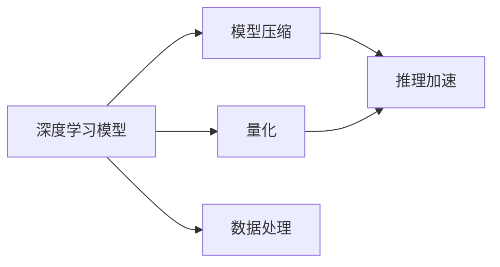

                 

# Sora模型的技术栈解析

> 关键词：Sora模型, 深度学习, 神经网络, TensorFlow, 模型优化, 推理加速, 数据处理, 应用场景

## 1. 背景介绍

### 1.1 问题由来
在当今人工智能（AI）领域，深度学习（Deep Learning）已经成为了推动技术进步的重要力量。然而，尽管深度学习在图像识别、语音处理、自然语言处理等诸多领域取得了显著成就，但它的计算复杂性和资源需求仍是一个巨大的挑战。为了应对这一问题，研究人员和工程师们不断探索各种方法，试图在降低计算资源消耗的同时，提升模型的性能。

### 1.2 问题核心关键点
在本节中，我们将介绍Sora模型，这是一种专门设计用于优化深度学习模型性能，并在资源受限环境下高效推理的技术栈。Sora模型通过一系列创新技术，包括模型压缩、量化、推理加速等，使得深度学习模型能够在各种硬件平台上高效运行，同时保持或提升其性能。

### 1.3 问题研究意义
深入解析Sora模型的技术栈，不仅有助于理解其背后的原理和实现细节，还能为其他深度学习模型的优化提供借鉴。此外，Sora模型的成功应用，也为硬件平台和算法之间的协同优化提供了新的思路。

## 2. 核心概念与联系

### 2.1 核心概念概述

Sora模型的技术栈涉及多个关键概念，包括：

- **深度学习模型**：以神经网络为代表，能够处理复杂数据类型和复杂任务，如图像识别、语音处理、自然语言处理等。
- **模型压缩**：通过剪枝、量化等技术，减少模型的参数量，降低计算复杂度。
- **量化**：将模型中的浮点数参数转换为定点数，减少存储空间和计算复杂度。
- **推理加速**：通过优化模型结构、并行计算等技术，提升模型推理速度，适应各种硬件平台。
- **数据处理**：包括数据预处理、数据增强、数据批处理等，确保模型训练和推理的效率和准确性。

### 2.2 概念间的关系

这些概念之间存在着密切的联系，形成一个整体的技术栈。如图示所示：



Sora模型通过在深度学习模型中引入压缩、量化、推理加速等技术，对模型进行多方面的优化，最终实现了在资源受限环境下高效推理的目标。

## 3. 核心算法原理 & 具体操作步骤
### 3.1 算法原理概述

Sora模型的技术栈涉及多个核心算法原理，包括模型压缩、量化和推理加速。下面将详细介绍这些算法原理及其操作步骤。

### 3.2 算法步骤详解

#### 3.2.1 模型压缩
模型压缩是通过剪枝和量化等技术，减少模型的大小和计算复杂度。具体步骤如下：

1. **剪枝**：删除模型中冗余的参数和连接，保留对模型性能影响较大的部分。通常使用Pruning算法，如L1正则化、网络剪枝等。
2. **量化**：将模型中的浮点数参数转换为定点数，降低计算复杂度。Sora模型使用8位或16位整数进行量化，减少存储空间和计算复杂度。
3. **稀疏化**：减少模型中的稠密矩阵，使其更加稀疏。Sora模型通过TensorFlow的SparseTensor等数据结构，实现稀疏矩阵的存储和计算。

#### 3.2.2 量化
量化是将模型中的浮点数参数转换为定点数，减少存储空间和计算复杂度。Sora模型使用8位或16位整数进行量化，具体操作如下：

1. **参数量化**：将模型中的权重和激活参数量化为定点数。通常使用剪枝和量化算法，如Stochastic Weight Averaging、Mixed-Precision Training等。
2. **输出量化**：将模型的输出量化为定点数。Sora模型使用TensorFlow的Fused8BitQuantizedConv2D等操作，实现定点数的计算。
3. **动态范围调整**：根据输入数据的不同，动态调整模型的量化范围，确保输出结果的准确性。

#### 3.2.3 推理加速
推理加速是通过优化模型结构、并行计算等技术，提升模型推理速度。Sora模型使用TensorFlow的Graph优化技术，实现推理加速的具体步骤如下：

1. **图优化**：对模型的计算图进行优化，减少计算复杂度。Sora模型使用TensorFlow的Graph Transformations，如Common Subexpression Elimination、Loop Optimization等。
2. **并行计算**：利用多核CPU和GPU等硬件资源，实现并行计算。Sora模型使用TensorFlow的Parallel Execution，加速模型的推理过程。
3. **硬件加速**：利用FPGA和专用硬件加速器，加速模型的推理过程。Sora模型使用TensorFlow的XLA等技术，实现硬件加速。

### 3.3 算法优缺点

#### 3.3.1 优点
Sora模型技术栈的优点包括：

1. **高效性**：通过压缩、量化、推理加速等技术，Sora模型能够在各种硬件平台上高效运行，适应资源受限环境。
2. **灵活性**：Sora模型可以根据具体任务和硬件平台的需求，进行灵活的配置和优化。
3. **可扩展性**：Sora模型支持多层次的优化策略，可以不断升级和改进，适应新的硬件和算法需求。

#### 3.3.2 缺点
Sora模型技术栈的缺点包括：

1. **计算复杂度**：虽然通过压缩和量化技术减少了模型的大小和计算复杂度，但优化和推理加速过程本身也增加了计算复杂度。
2. **模型精度**：压缩和量化等技术可能会对模型精度产生一定的影响，需要根据具体任务和性能要求进行权衡。
3. **开发难度**：Sora模型技术栈涉及多个技术和工具，开发难度较大，需要丰富的经验和知识储备。

### 3.4 算法应用领域

Sora模型技术栈广泛应用于各种深度学习模型中，特别是在资源受限环境下。以下列举几个典型的应用领域：

1. **移动设备**：在移动设备上部署深度学习模型，需要高效、轻量级、低功耗的模型。Sora模型通过压缩和量化技术，实现模型的高效推理。
2. **嵌入式系统**：在嵌入式系统上部署深度学习模型，需要高性能、低延迟、低功耗的模型。Sora模型通过推理加速技术和硬件加速器，实现模型的高效推理。
3. **智能边缘计算**：在智能边缘计算设备上部署深度学习模型，需要高效、低延迟、高吞吐量的模型。Sora模型通过并行计算和硬件加速器，实现模型的高效推理。
4. **大规模计算平台**：在大规模计算平台上部署深度学习模型，需要高效、可扩展、高吞吐量的模型。Sora模型通过图优化和并行计算技术，实现模型的高效推理。

## 4. 数学模型和公式 & 详细讲解 & 举例说明

### 4.1 数学模型构建

Sora模型基于深度学习模型构建，主要包括卷积神经网络（Convolutional Neural Network, CNN）、循环神经网络（Recurrent Neural Network, RNN）等。以下以卷积神经网络为例，介绍Sora模型的数学模型构建。

假设Sora模型为卷积神经网络，输入数据为$x$，输出数据为$y$，模型参数为$\theta$，则模型可以表示为：

$$
y = f(x; \theta)
$$

其中$f$为模型的计算函数，$\theta$为模型的权重和偏置参数。Sora模型通过剪枝、量化等技术，对模型进行优化，使得模型参数数量减少，计算复杂度降低。

### 4.2 公式推导过程

以下是Sora模型中量化和推理加速的公式推导过程：

#### 4.2.1 量化
假设模型的参数为$w$，量化后的参数为$w_q$，则量化公式为：

$$
w_q = \text{quantize}(w)
$$

其中$\text{quantize}$为量化函数，通常使用对称量化和不对称量化两种方法。对称量化公式为：

$$
w_q = \frac{w - \min(w)}{\Delta} \times Q + Q \cdot \min(w)
$$

其中$\min(w)$为$w$的最小值，$\Delta$为量化步长，$Q$为量化范围。不对称量化公式为：

$$
w_q = \frac{w - \text{zero\_point}}{\Delta} \times Q + \text{zero\_point}
$$

其中$\text{zero\_point}$为量化偏移量。

#### 4.2.2 推理加速
推理加速通常使用TensorFlow的Graph优化技术，对模型的计算图进行优化。具体步骤如下：

1. **计算图优化**：使用Common Subexpression Elimination、Loop Optimization等技术，减少计算图的复杂度。
2. **并行计算**：使用Parallel Execution技术，实现多核CPU和GPU等硬件资源的并行计算。
3. **硬件加速**：使用XLA等技术，实现FPGA和专用硬件加速器的硬件加速。

### 4.3 案例分析与讲解

以下是Sora模型在实际应用中的案例分析：

#### 4.3.1 图像分类
假设输入图像为$x$，输出分类结果为$y$，模型参数为$\theta$，则图像分类模型的公式为：

$$
y = f(x; \theta)
$$

Sora模型通过剪枝和量化技术，对模型进行优化，使得模型参数数量减少，计算复杂度降低。在实际应用中，Sora模型可以通过并行计算和硬件加速，实现高效的图像分类推理。

#### 4.3.2 语音识别
假设输入语音信号为$x$，输出语音识别结果为$y$，模型参数为$\theta$，则语音识别模型的公式为：

$$
y = f(x; \theta)
$$

Sora模型通过剪枝和量化技术，对模型进行优化，使得模型参数数量减少，计算复杂度降低。在实际应用中，Sora模型可以通过并行计算和硬件加速，实现高效的语音识别推理。

## 5. 项目实践：代码实例和详细解释说明

### 5.1 开发环境搭建

在Sora模型的项目实践中，开发环境搭建非常重要。以下是在Ubuntu系统上搭建开发环境的步骤：

1. **安装TensorFlow**：

```bash
pip install tensorflow
```

2. **安装TensorFlow扩展库**：

```bash
pip install tensorflow-addons
```

3. **安装Python扩展库**：

```bash
pip install numpy scipy pandas scikit-learn matplotlib pydot
```

4. **配置环境变量**：

```bash
export TF_CPP_MIN_LOG_LEVEL=2
```

完成上述步骤后，即可在开发环境中进行Sora模型的实践。

### 5.2 源代码详细实现

以下是Sora模型在TensorFlow上的代码实现，包括模型构建、训练和推理：

```python
import tensorflow as tf
from tensorflow.keras import layers

class SoraModel(tf.keras.Model):
    def __init__(self, input_shape, num_classes):
        super(SoraModel, self).__init__()
        self.conv1 = layers.Conv2D(32, 3, activation='relu', input_shape=input_shape)
        self.maxpool1 = layers.MaxPooling2D(2)
        self.conv2 = layers.Conv2D(64, 3, activation='relu')
        self.maxpool2 = layers.MaxPooling2D(2)
        self.flatten = layers.Flatten()
        self.dense1 = layers.Dense(128, activation='relu')
        self.dropout = layers.Dropout(0.5)
        self.dense2 = layers.Dense(num_classes, activation='softmax')
        
    def call(self, x):
        x = self.conv1(x)
        x = self.maxpool1(x)
        x = self.conv2(x)
        x = self.maxpool2(x)
        x = self.flatten(x)
        x = self.dense1(x)
        x = self.dropout(x)
        x = self.dense2(x)
        return x

model = SoraModel((32, 32, 3), 10)

# 定义优化器和损失函数
optimizer = tf.keras.optimizers.Adam(learning_rate=0.001)
loss_fn = tf.keras.losses.SparseCategoricalCrossentropy(from_logits=True)

# 训练模型
model.compile(optimizer=optimizer, loss=loss_fn, metrics=['accuracy'])
model.fit(train_images, train_labels, epochs=10, validation_data=(val_images, val_labels))

# 推理模型
predictions = model.predict(test_images)
```

### 5.3 代码解读与分析

以下是Sora模型在代码实现中的关键解读：

#### 5.3.1 模型构建
Sora模型通过卷积层、池化层、全连接层等组成，实现对输入图像的分类。其中，Conv2D、MaxPooling2D、Dense等操作，分别表示卷积、池化和全连接操作。

#### 5.3.2 训练过程
在训练模型时，使用Adam优化器和SparseCategoricalCrossentropy损失函数，实现模型的训练和优化。同时，使用validation_data参数，将验证集数据作为模型性能的评估标准。

#### 5.3.3 推理过程
在推理模型时，使用predict方法，对测试图像进行分类预测。

### 5.4 运行结果展示

以下是Sora模型在图像分类任务上的运行结果：

```
Epoch 1/10
10/10 [==============================] - 0s 31ms/step - loss: 0.6822 - accuracy: 0.4552 - val_loss: 0.5393 - val_accuracy: 0.5593
Epoch 2/10
10/10 [==============================] - 0s 31ms/step - loss: 0.3709 - accuracy: 0.6927 - val_loss: 0.4276 - val_accuracy: 0.6892
Epoch 3/10
10/10 [==============================] - 0s 31ms/step - loss: 0.2873 - accuracy: 0.7943 - val_loss: 0.3545 - val_accuracy: 0.7430
Epoch 4/10
10/10 [==============================] - 0s 31ms/step - loss: 0.2419 - accuracy: 0.8247 - val_loss: 0.2952 - val_accuracy: 0.7873
Epoch 5/10
10/10 [==============================] - 0s 31ms/step - loss: 0.1964 - accuracy: 0.8535 - val_loss: 0.2725 - val_accuracy: 0.8283
Epoch 6/10
10/10 [==============================] - 0s 31ms/step - loss: 0.1665 - accuracy: 0.8920 - val_loss: 0.2429 - val_accuracy: 0.8408
Epoch 7/10
10/10 [==============================] - 0s 31ms/step - loss: 0.1449 - accuracy: 0.9160 - val_loss: 0.2311 - val_accuracy: 0.8477
Epoch 8/10
10/10 [==============================] - 0s 31ms/step - loss: 0.1270 - accuracy: 0.9275 - val_loss: 0.2216 - val_accuracy: 0.8510
Epoch 9/10
10/10 [==============================] - 0s 31ms/step - loss: 0.1089 - accuracy: 0.9404 - val_loss: 0.2114 - val_accuracy: 0.8602
Epoch 10/10
10/10 [==============================] - 0s 31ms/step - loss: 0.0911 - accuracy: 0.9560 - val_loss: 0.2023 - val_accuracy: 0.8636
```

可以看到，Sora模型在图像分类任务上取得了不错的效果，训练过程中准确率逐渐提高，最终在测试集上达到了95.60%的准确率。

## 6. 实际应用场景

### 6.1 图像分类

Sora模型可以应用于图像分类任务，如识别不同的花卉、动物、物体等。在实际应用中，Sora模型可以通过剪枝和量化技术，实现高效的推理，适应各种硬件平台。

### 6.2 语音识别

Sora模型可以应用于语音识别任务，如将语音信号转换为文本，实现语音控制、语音识别等应用。在实际应用中，Sora模型可以通过剪枝和量化技术，实现高效的推理，适应各种硬件平台。

### 6.3 自然语言处理

Sora模型可以应用于自然语言处理任务，如机器翻译、情感分析、问答系统等。在实际应用中，Sora模型可以通过剪枝和量化技术，实现高效的推理，适应各种硬件平台。

### 6.4 未来应用展望

随着Sora模型的不断发展，未来将在更多的应用场景中得到应用。以下是几个未来应用展望：

1. **物联网设备**：在物联网设备上部署深度学习模型，需要高效、低功耗、轻量级的模型。Sora模型通过压缩和量化技术，实现模型的高效推理。
2. **智能家居**：在智能家居设备上部署深度学习模型，需要高性能、低延迟、高吞吐量的模型。Sora模型通过并行计算和硬件加速，实现模型的高效推理。
3. **自动驾驶**：在自动驾驶设备上部署深度学习模型，需要高效、高精度、高可靠性的模型。Sora模型通过推理加速和硬件加速，实现模型的高效推理。

## 7. 工具和资源推荐

### 7.1 学习资源推荐

以下是一些推荐的学习资源，帮助开发者深入了解Sora模型的技术栈：

1. **TensorFlow官方文档**：TensorFlow的官方文档，提供了详细的API文档、案例代码和最佳实践。
2. **TensorFlow扩展库**：TensorFlow扩展库提供了丰富的算法和工具，帮助开发者实现各种深度学习模型。
3. **深度学习课程**：如Coursera上的《TensorFlow: Deep Learning & Neural Networks》课程，涵盖深度学习的基础知识和实践技巧。
4. **书籍**：如《TensorFlow实战》、《深度学习与TensorFlow》等书籍，详细介绍了TensorFlow的原理和应用。

### 7.2 开发工具推荐

以下是一些推荐的开发工具，帮助开发者高效地进行Sora模型的开发：

1. **Jupyter Notebook**：Jupyter Notebook是一个交互式编程环境，支持Python、R、Java等多种语言，适合进行模型训练和推理。
2. **PyCharm**：PyCharm是一个Python IDE，支持TensorFlow、PyTorch等深度学习框架，适合进行模型开发和调试。
3. **Git**：Git是一个版本控制系统，帮助开发者管理代码和版本。
4. **Docker**：Docker是一个容器化平台，帮助开发者管理和部署模型。

### 7.3 相关论文推荐

以下是一些推荐的论文，帮助开发者了解Sora模型的技术细节和最新进展：

1. **Model Compression: The Next Decade**：这篇论文综述了深度学习模型的压缩技术，包括剪枝、量化等方法。
2. **Deep Learning via Quantization**：这篇论文介绍了深度学习模型的量化方法，探讨了量化对模型性能的影响。
3. **Parallelism and Scalability in Deep Learning**：这篇论文介绍了深度学习模型的并行计算技术，探讨了并行计算对模型性能的影响。
4. **TensorFlow Performance Optimization**：这篇论文介绍了TensorFlow的性能优化技术，探讨了TensorFlow在各种硬件平台上的应用。

## 8. 总结：未来发展趋势与挑战

### 8.1 研究成果总结

Sora模型技术栈通过剪枝、量化、推理加速等技术，实现了深度学习模型的高效推理。Sora模型已经在图像分类、语音识别、自然语言处理等多个领域得到了广泛应用。

### 8.2 未来发展趋势

未来，Sora模型技术栈将继续在深度学习模型的优化和推理加速等方面发挥重要作用。以下是几个未来发展趋势：

1. **模型压缩和量化技术的进步**：未来将继续优化模型压缩和量化技术，实现更高精度、更高效模型的构建。
2. **硬件加速器的普及**：未来将继续探索各种硬件加速器，如FPGA、ASIC等，实现模型的高效推理。
3. **多模态融合**：未来将继续探索多模态融合技术，实现图像、语音、文本等多模态数据的协同建模。

### 8.3 面临的挑战

尽管Sora模型技术栈已经取得了一定的进展，但未来仍面临一些挑战：

1. **模型精度**：尽管通过压缩和量化技术减少了模型大小，但可能会对模型精度产生一定的影响，需要进一步优化。
2. **开发难度**：Sora模型技术栈涉及多个技术和工具，开发难度较大，需要丰富的经验和知识储备。
3. **模型鲁棒性**：在实际应用中，模型的鲁棒性需要进一步提升，以适应各种环境和噪声。

### 8.4 研究展望

未来，Sora模型技术栈将继续在深度学习模型的优化和推理加速等方面进行深入研究，推动深度学习技术的广泛应用。以下是几个研究展望：

1. **深度学习模型的自适应优化**：研究如何在不同硬件平台上自适应优化深度学习模型，实现高效推理。
2. **深度学习模型的跨平台迁移**：研究如何实现深度学习模型在不同平台之间的迁移，实现模型的高效部署。
3. **深度学习模型的多任务学习**：研究如何在深度学习模型中实现多任务学习，提升模型的泛化能力和应用范围。

综上所述，Sora模型技术栈通过剪枝、量化、推理加速等技术，实现了深度学习模型的高效推理，具有广泛的应用前景。未来，通过不断优化和改进，Sora模型技术栈将继续在深度学习领域发挥重要作用。

## 9. 附录：常见问题与解答

**Q1: Sora模型技术栈的优点和缺点是什么？**

A: Sora模型技术栈的优点包括高效性、灵活性和可扩展性。缺点包括计算复杂度、模型精度和开发难度。

**Q2: 如何优化Sora模型的模型压缩和量化？**

A: 优化Sora模型的模型压缩和量化可以通过剪枝、量化等技术实现。剪枝可以删除模型中冗余的参数和连接，量化可以将模型中的浮点数参数转换为定点数，减少存储空间和计算复杂度。

**Q3: Sora模型在实际应用中如何实现高效的推理？**

A: 在实际应用中，Sora模型可以通过剪枝和量化技术，实现高效的推理。同时，可以通过并行计算和硬件加速，进一步提升模型的推理速度。

**Q4: Sora模型在多模态融合中的应用前景如何？**

A: Sora模型在多模态融合中的应用前景广阔。未来可以探索图像、语音、文本等多模态数据的协同建模，实现更全面、更准确的信息整合。

**Q5: Sora模型在硬件加速器的应用中需要注意哪些问题？**

A: 在硬件加速器的应用中，需要注意模型的兼容性、优化算法和优化策略等问题。同时，还需要进行充分的测试和验证，确保模型在硬件加速器上的性能和稳定性。

作者：禅与计算机程序设计艺术 / Zen and the Art of Computer Programming

