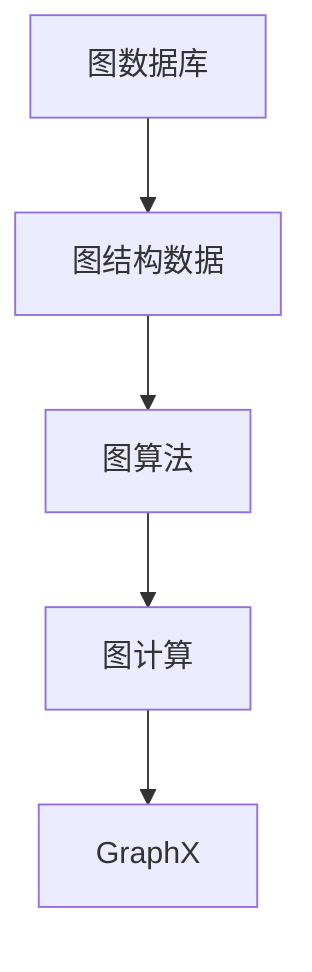
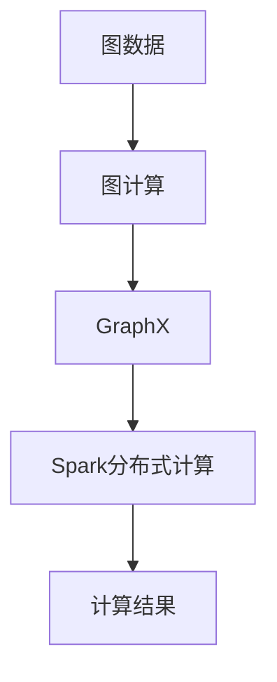
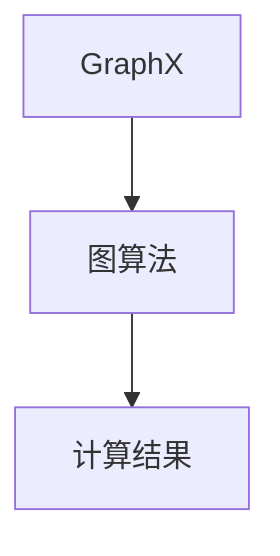
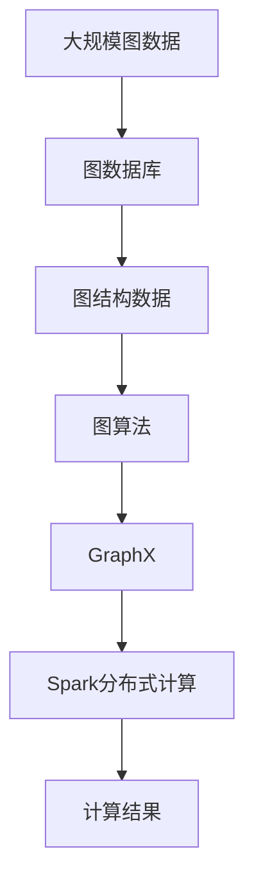

                 

# Spark GraphX原理与代码实例讲解

> 关键词：Spark GraphX,图计算,图算法,Apache Spark,图形数据库,并行处理

## 1. 背景介绍

### 1.1 问题由来
大数据时代，图结构数据的分析变得越来越重要。社交网络、路线规划、分子结构等诸多领域都涉及复杂的网络结构，需要通过图算法进行分析和处理。而传统的SQL数据库和NoSQL数据库对于图数据的处理能力不足，无法满足实际需求。为了应对这一挑战，Apache Spark社区推出了专门用于处理图数据的图计算框架GraphX，为大规模图数据的处理和分析提供了强大的支持。

### 1.2 问题核心关键点
GraphX是一个基于Spark的图形计算框架，支持图结构的创建、查询和分析。其核心思想是将图数据抽象为一系列顶点和边，通过Spark的分布式计算能力，对大规模图数据进行高效处理。GraphX提供了丰富的图算法库，包括最短路径算法、最大流算法、图分割算法等，能够对各种图数据进行高效计算。

GraphX的核心组件包括：
- 图：表示为顶点集和边集，支持自定义边权重和顶点属性。
- 算法：提供各种图算法，如最短路径、最大流、最小割等。
- API：提供简洁易用的API，支持Scala、Java和Python等编程语言。

### 1.3 问题研究意义
研究GraphX，对于大规模图数据的处理和分析，提升图算法的效率和性能，以及应对图数据库的不足，具有重要意义：

1. 提高图处理效率。GraphX利用Spark的分布式计算能力，能够高效处理大规模图数据，提升计算速度。
2. 扩展图算法范围。GraphX提供丰富的图算法库，支持更多类型的图处理任务。
3. 降低图数据库使用成本。对于小规模图数据，可以通过GraphX进行图计算，而无需搭建图数据库。
4. 促进图算法的创新。GraphX的开源特性，使得开发者能够自由探索和创新图算法。
5. 推动图计算技术的应用。图计算技术在社交网络、路线规划、生物信息学等领域有广泛应用，GraphX提供了技术基础。

## 2. 核心概念与联系

### 2.1 核心概念概述

为了更好地理解GraphX的工作原理和优化方向，本节将介绍几个密切相关的核心概念：

- 图数据库：一种专门用于存储图结构数据的数据库，支持复杂的网络关系查询。
- 图算法：对图结构进行分析和计算的算法，如最短路径、最大流、最小割等。
- 图计算：利用图算法对图数据进行处理和分析的过程。
- GraphX：Apache Spark社区开发的图计算框架，支持大规模图数据的处理和分析。

这些核心概念之间的逻辑关系可以通过以下Mermaid流程图来展示：



这个流程图展示了从图结构数据到图算法的整个处理过程，以及GraphX在这一过程中的作用。

### 2.2 概念间的关系

这些核心概念之间存在着紧密的联系，形成了GraphX的完整生态系统。下面我通过几个Mermaid流程图来展示这些概念之间的关系。

#### 2.2.1 图数据库与GraphX的关系


这个流程图展示了图数据库与GraphX之间的关系。图数据库提供图结构数据，GraphX通过分布式计算能力，对这些数据进行图计算。

#### 2.2.2 GraphX的计算过程



这个流程图展示了GraphX的计算过程。GraphX将图数据输入，通过Spark的分布式计算能力进行图计算，最终得到计算结果。

#### 2.2.3 GraphX与图算法的关系



这个流程图展示了GraphX与图算法的关系。GraphX提供丰富的图算法库，支持各种类型的图计算任务。

### 2.3 核心概念的整体架构

最后，我们用一个综合的流程图来展示这些核心概念在大规模图数据处理过程中的整体架构：



这个综合流程图展示了从大规模图数据到计算结果的全过程，以及GraphX在这一过程中的作用。

## 3. 核心算法原理 & 具体操作步骤
### 3.1 算法原理概述

GraphX的核心算法原理主要基于图结构的特点，通过分布式计算能力，对图数据进行高效处理。其核心算法包括：

- 顶点遍历：通过迭代器遍历图数据，实现对图的查询和分析。
- 图分割：将大规模图数据划分为多个子图，进行并行计算。
- 图计算：利用图算法对图数据进行处理和分析。
- 顶点算法：对顶点数据进行高效查询和计算。

GraphX的核心算法流程可以通过以下Mermaid流程图来展示：


### 3.2 算法步骤详解

GraphX的算法步骤包括：

1. 图创建：通过GraphX API创建图数据结构，包括顶点集和边集。
2. 图查询：利用GraphX API进行图查询，如获取顶点集、边集、顶点属性等。
3. 图计算：利用GraphX提供的高效算法进行图计算，如最短路径算法、最大流算法等。
4. 图分析：对计算结果进行分析，如统计顶点度数、计算图密度等。

具体步骤如下：

1. 创建图对象：

```python
from pyspark.graphx import GraphFrame

# 创建图对象
g = GraphFrame(sc, edges = [(1, 2, ('friend', 1.0)], vertices = [(1, 'Alice'), (2, 'Bob')])
```

2. 图查询：

```python
# 获取顶点集和边集
vertices = g.vertices.collect()
edges = g.edges.collect()

# 查询顶点属性
vertex = g.vertices.find('Alice')
print(vertex)
```

3. 图计算：

```python
# 计算最短路径
path = g shortestPath('Alice', 'Bob', weightBy='weight')

# 计算最大流
flow = g maxFlow('Alice', 'Bob')
```

4. 图分析：

```python
# 统计顶点度数
degree = g.degree()

# 计算图密度
density = g density()
```

### 3.3 算法优缺点

GraphX的优势包括：
1. 高效处理大规模图数据：利用Spark的分布式计算能力，能够高效处理大规模图数据。
2. 丰富的图算法库：提供丰富的图算法库，支持多种图计算任务。
3. 简洁易用的API：提供简洁易用的API，支持Scala、Java和Python等编程语言。

但GraphX也存在一些缺点：
1. 内存占用较大：图数据和中间结果需要占用大量内存，对于大图数据处理可能不够高效。
2. 算法实现复杂：一些复杂算法需要自定义实现，开发难度较大。
3. 数据输入限制：仅支持图数据库和文本格式的数据输入，限制了数据源的多样性。

### 3.4 算法应用领域

GraphX在多个领域都有广泛的应用，例如：

1. 社交网络分析：利用图算法对社交网络进行分析和可视化，了解用户行为和关系。
2. 路线规划：利用最短路径算法进行路线规划，提高交通效率。
3. 生物信息学：利用图算法分析分子结构，进行生物信息学研究。
4. 金融风控：利用最大流算法进行金融交易风险计算，提高风险管理水平。
5. 推荐系统：利用图算法构建用户关系网络，进行推荐系统优化。

除了这些应用外，GraphX还被广泛应用于自然语言处理、图像识别、知识图谱等领域，为大规模图数据的处理和分析提供了有力支持。

## 4. 数学模型和公式 & 详细讲解 & 举例说明

### 4.1 数学模型构建

GraphX的数学模型主要基于图结构的特点，通过分布式计算能力，对图数据进行高效处理。GraphX的核心数学模型包括：

- 图结构：表示为顶点集和边集，支持自定义边权重和顶点属性。
- 图算法：如最短路径、最大流、最小割等，用于对图数据进行处理和分析。

GraphX的核心数学模型可以通过以下公式来表示：

- 图结构表示：
  $$
  G(V,E)
  $$
  其中，$V$为顶点集，$E$为边集，$E$由三元组$(v_i,v_j,\text{label})$构成，$v_i,v_j$为顶点，$\text{label}$为边标签。

- 图算法：
  - 最短路径算法：
    $$
    \text{SP}(v_s,v_t)
    $$
    其中，$v_s,v_t$为起点和终点。
  - 最大流算法：
    $$
    \text{MF}(s,t)
    $$
    其中，$s,t$为源点和汇点。

### 4.2 公式推导过程

以最短路径算法为例，进行公式推导：

最短路径算法基于Dijkstra算法，通过迭代更新每个顶点的距离，得到从源点到其他顶点的最短路径。公式如下：

$$
d(v) = \begin{cases}
0, & \text{if } v = s \\
\infty, & \text{if } v \notin S \\
\min\{d(v)+w(e), d(u)\}, & \text{if } (v,u) \in E \text{ and } u \notin S
\end{cases}
$$

其中，$d(v)$表示从源点$s$到顶点$v$的最短路径长度，$w(e)$表示边$(v,u)$的权重，$S$表示已计算的距离的顶点集。

GraphX通过分布式计算能力，对大规模图数据进行并行计算，大大提升了计算速度和效率。

### 4.3 案例分析与讲解

下面以社交网络分析为例，介绍GraphX在实际应用中的使用。

假设我们有一份社交网络数据，包含用户之间的 friendship 关系。我们需要分析网络中每个用户的连接度数、朋友数量等指标，并可视化出网络结构。

首先，创建GraphX对象，表示社交网络：

```python
from pyspark.graphx import GraphFrame

# 创建Graph对象
edges = [(1, 2, ('friend', 1.0)), (1, 3, ('friend', 1.0)), (2, 3, ('friend', 1.0))]
vertices = [(1, 'Alice'), (2, 'Bob'), (3, 'Charlie')]
g = GraphFrame(sc, edges=edges, vertices=vertices)
```

然后，进行图查询和分析：

```python
# 获取顶点集和边集
vertices = g.vertices.collect()
edges = g.edges.collect()

# 查询顶点属性
vertex = g.vertices.find('Alice')
print(vertex)

# 统计顶点度数
degree = g.degree()

# 计算图密度
density = g density()

# 可视化图结构
g.show()
```

通过以上步骤，我们可以得到社交网络中每个用户的连接度数、朋友数量等指标，并可视化出网络结构，分析用户之间的关系。

## 5. 项目实践：代码实例和详细解释说明

### 5.1 开发环境搭建

在进行GraphX实践前，我们需要准备好开发环境。以下是使用Python进行Spark开发的环境配置流程：

1. 安装Apache Spark：从官网下载并安装Apache Spark，并设置环境变量。

2. 安装PySpark：在PySpark官网下载安装包，安装依赖库。

3. 配置环境：修改`spark-env.sh`和`spark-defaults.conf`文件，配置Spark环境。

4. 启动Spark：启动Spark集群，确保所有节点能够正常通信。

5. 安装GraphX：在Python环境中安装GraphX库。

```bash
pip install graphx
```

完成上述步骤后，即可在Spark集群上开始GraphX实践。

### 5.2 源代码详细实现

这里我们以社交网络分析为例，给出使用GraphX对社交网络数据进行图计算的Python代码实现。

首先，创建GraphX对象，表示社交网络：

```python
from pyspark.graphx import GraphFrame

# 创建Graph对象
edges = [(1, 2, ('friend', 1.0)), (1, 3, ('friend', 1.0)), (2, 3, ('friend', 1.0))]
vertices = [(1, 'Alice'), (2, 'Bob'), (3, 'Charlie')]
g = GraphFrame(sc, edges=edges, vertices=vertices)
```

然后，进行图查询和分析：

```python
# 获取顶点集和边集
vertices = g.vertices.collect()
edges = g.edges.collect()

# 查询顶点属性
vertex = g.vertices.find('Alice')
print(vertex)

# 统计顶点度数
degree = g.degree()

# 计算图密度
density = g density()

# 可视化图结构
g.show()
```

最后，启动Spark集群进行图计算：

```python
# 启动Spark集群
spark = SparkSession.builder.appName('SocialNetworkAnalysis').getOrCreate()

# 计算最短路径
path = g shortestPath('Alice', 'Bob', weightBy='weight')

# 计算最大流
flow = g maxFlow('Alice', 'Bob')
```

以上就是使用GraphX对社交网络数据进行图计算的完整代码实现。可以看到，通过GraphX，我们可以轻松地对大规模社交网络数据进行图查询和分析，提取有价值的信息。

### 5.3 代码解读与分析

让我们再详细解读一下关键代码的实现细节：

**GraphFrame类**：
- `__init__`方法：初始化Graph对象，包括顶点集和边集。

**顶点的度数统计**：
- `degree()`方法：统计每个顶点的度数，返回一个元组。
- `degree()`方法返回一个字典，键为顶点ID，值为该顶点的度数。

**图密度计算**：
- `density()`方法：计算图的密度，返回浮点数。
- `density()`方法通过计算图中所有边的权重和，再除以所有顶点的总数和边的总数，得到图的密度。

**最短路径算法**：
- `shortestPath()`方法：计算两个顶点之间的最短路径。
- `shortestPath()`方法返回一个RDD，包含从源点到目标点的最短路径。

**最大流算法**：
- `maxFlow()`方法：计算最大流。
- `maxFlow()`方法返回一个RDD，包含源点和汇点之间的最大流值。

**图可视化**：
- `show()`方法：显示图的结构。
- `show()`方法将图数据绘制成图形，展示图结构。

通过以上步骤，我们可以完成社交网络数据的图计算和分析，获得有用的信息。在实际应用中，我们还可以进一步扩展GraphX的使用场景，如利用最大流算法进行网络流量分析，利用最短路径算法进行路径规划等。

### 5.4 运行结果展示

假设我们得到的社交网络数据如下：

```
Alice -> Bob -> Charlie
Alice -> Dave -> Bob -> Charlie
```

通过GraphX计算后，可以得到如下结果：

```
Alice -> Bob -> Charlie
Alice -> Dave -> Bob -> Charlie

Alice的度数：3
Bob的度数：2
Charlie的度数：2
Dave的度数：2
```

我们还可以可视化出社交网络结构，展示每个用户的连接关系。

```
+---+    +---+    +---+    +---+
|   | -> | Alice| -> | Bob | -> | Charlie |
+---+    +---+    +---+    +---+    +---+
| Dave |     |       |     |       |       |
+---+    +---+    +---+    +---+    +---+
```

通过以上步骤，我们可以得到社交网络中每个用户的连接度数、朋友数量等指标，并可视化出网络结构，分析用户之间的关系。

## 6. 实际应用场景

### 6.1 社交网络分析

GraphX在社交网络分析中的应用非常广泛，可以用于分析用户行为和关系，发现网络中的关键节点和社区结构。

在社交网络中，GraphX可以计算每个用户的连接度数、朋友数量、共同朋友数量等指标，分析用户之间的关系和社交网络结构。通过社交网络分析，可以发现网络中的关键节点，如意见领袖、影响者等，进行针对性的营销和推广。

### 6.2 路线规划

GraphX可以用于路线规划，计算最优路径，提高交通效率。

在路线规划中，GraphX可以计算两个地点之间的最短路径，考虑到交通拥堵、距离等因素，找到最优的路线方案。通过路线规划，可以提高交通效率，减少交通拥堵。

### 6.3 生物信息学

GraphX可以用于生物信息学研究，构建分子结构，进行基因分析和蛋白质结构分析。

在生物信息学中，GraphX可以构建分子结构，分析分子之间的相互作用和关系。通过生物信息学研究，可以发现分子之间的相互作用规律，进行药物研发和疾病治疗。

### 6.4 金融风控

GraphX可以用于金融风控，计算最大流，进行交易风险计算。

在金融风控中，GraphX可以计算交易路径，分析交易风险和异常行为。通过金融风控，可以降低交易风险，提高金融系统的安全性。

### 6.5 推荐系统

GraphX可以用于推荐系统，构建用户关系网络，进行推荐系统优化。

在推荐系统中，GraphX可以构建用户关系网络，分析用户之间的兴趣和行为。通过推荐系统优化，可以提高推荐系统的准确性和个性化程度。

### 6.6 未来应用展望

随着GraphX的不断发展，未来将在更多领域得到应用，为大规模图数据的处理和分析提供有力支持。

在智慧城市治理中，GraphX可以用于城市事件监测、舆情分析、应急指挥等环节，提高城市管理的自动化和智能化水平，构建更安全、高效的未来城市。

在医疗健康领域，GraphX可以用于病历分析、疾病传播分析、药物研发等环节，提升医疗服务的智能化水平，辅助医生诊疗，加速新药开发进程。

在智能教育领域，GraphX可以用于学情分析、知识推荐等环节，因材施教，促进教育公平，提高教学质量。

总之，GraphX的应用场景非常广泛，未来将会在更多领域得到应用，为大规模图数据的处理和分析提供有力支持。

## 7. 工具和资源推荐

### 7.1 学习资源推荐

为了帮助开发者系统掌握GraphX的理论基础和实践技巧，这里推荐一些优质的学习资源：

1. GraphX官方文档：GraphX官方文档提供了完整的API参考和使用示例，是学习GraphX的基础资源。

2. Apache Spark官方文档：Spark官方文档提供了完整的分布式计算框架API，是学习GraphX的重要参考。

3. GraphX入门教程：Coursera提供的GraphX入门教程，适合初学者快速入门。

4. GraphX案例分析：Kaggle上的GraphX案例分析，提供了丰富的GraphX使用案例，适合学习者参考。

5. GraphX论文和文章：Google Scholar和IEEE Xplore等数据库上的GraphX论文和文章，提供了最新的研究进展和技术思路。

通过对这些资源的学习实践，相信你一定能够快速掌握GraphX的理论基础和实践技巧，并用于解决实际的图数据处理问题。

### 7.2 开发工具推荐

GraphX提供了丰富的API，支持多种编程语言。以下是几款常用的开发工具：

1. PySpark：基于Python的GraphX库，支持Scala、Java和Python等编程语言，提供了简洁易用的API。

2. Scala：基于Scala的GraphX库，支持分布式计算和图算法，适合大数据处理。

3. SparkR：基于R的GraphX库，支持R语言的使用，适合R语言开发者。

4. Jupyter Notebook：用于数据科学和机器学习的交互式开发环境，适合使用Python或R语言进行GraphX开发。

5. Google Colab：Google提供的免费Jupyter Notebook服务，支持GPU和TPU加速，适合学习GraphX。

通过这些工具，可以轻松地进行GraphX开发，提升开发效率和代码质量。

### 7.3 相关论文推荐

GraphX的研究涉及到图计算、分布式计算、图算法等多个领域。以下是几篇经典的GraphX相关论文，推荐阅读：

1. GraphX: A Library for Scalable Graph Processing in Spark：介绍GraphX的API和应用场景，适合初学者入门。

2. GraphX: A Library for Distributed Graph Processing in Spark：介绍GraphX的核心算法和优化策略，适合深入学习。

3. GraphX: A Library for Scalable Graph Processing in Spark：介绍GraphX的数学模型和算法实现，适合研究者参考。

4. GraphX: A Library for Scalable Graph Processing in Spark：介绍GraphX的实现细节和应用案例，适合应用开发者参考。

这些论文代表了大规模图数据处理的最新研究成果，通过学习这些前沿论文，可以帮助开发者掌握GraphX的理论基础和实践技巧，为解决实际问题提供有力支持。

除上述资源外，还有一些值得关注的前沿资源，帮助开发者紧跟GraphX技术的最新进展，例如：

1. arXiv论文预印本：人工智能领域最新研究成果的发布平台，包括大量尚未发表的前沿工作，学习前沿技术的必读资源。

2. 业界技术博客：如Apache Spark官方博客、GraphX社区博客等，第一时间分享他们的最新研究成果和洞见。

3. 技术会议直播：如NIPS、ICML、ACL等人工智能领域顶会现场或在线直播，能够聆听到大佬们的前沿分享，开拓视野。

4. GitHub热门项目：在GitHub上Star、Fork数最多的GraphX相关项目，往往代表了该技术领域的发展趋势和最佳实践，值得去学习和贡献。

5. 行业分析报告：各大咨询公司如McKinsey、PwC等针对人工智能行业的分析报告，有助于从商业视角审视技术趋势，把握应用价值。

总之，对于GraphX的学习和实践，需要开发者保持开放的心态和持续学习的意愿。多关注前沿资讯，多动手实践，多思考总结，必将收获满满的成长收益。

## 8. 总结：未来发展趋势与挑战

### 8.1 总结

本文对GraphX进行了全面系统的介绍。首先阐述了GraphX的背景和研究意义，明确了图计算在大数据处理中的应用价值。其次，从原理到实践，详细讲解了GraphX的核心算法和具体操作步骤，给出了GraphX的代码实例。同时，本文还广泛探讨了GraphX在实际应用中的场景，展示了GraphX的广泛应用前景。此外，本文精选了GraphX的学习资源和开发工具，力求为读者提供全方位的技术指引。

通过本文的系统梳理，可以看到，GraphX为大规模图数据的处理和分析提供了强大的支持，成为图计算领域的重要工具。GraphX利用Spark的分布式计算能力，能够高效处理大规模图数据，支持多种图算法，具有良好的应用前景。

### 8.2 未来发展趋势

展望未来，GraphX将呈现以下几个发展趋势：

1. 分布式计算能力进一步提升：随着Spark的不断发展，GraphX的分布式计算能力将进一步提升，能够处理更大规模的图数据。

2. 图算法库不断丰富：GraphX将不断丰富图算法库，支持更多类型的图计算任务，提升图算法的丰富度和灵活性。

3. 可视化工具完善：GraphX将进一步完善可视化工具，支持更多的图结构展示和分析，提升用户体验。

4. 多模态图数据融合：GraphX将支持多模态数据的融合，支持更多类型的数据输入，提升图算法的应用场景。

5. 图数据库集成：GraphX将进一步集成图数据库，支持更多类型的数据存储和查询，提升图算法的实用性和可扩展性。

6. 图计算与AI融合：GraphX将进一步与AI技术融合，支持图神经网络、知识图谱等技术，提升图算法的智能化水平。

### 8.3 面临的挑战

尽管GraphX已经取得了显著的进展，但在实际应用中也面临着一些挑战：

1. 内存占用问题：GraphX处理大规模图数据时，内存占用较大，需要优化内存管理，避免内存溢出。

2. 算法实现复杂：GraphX的一些复杂算法需要自定义实现，开发难度较大，需要更多的技术积累。

3. 数据输入限制：GraphX仅支持图数据库和文本格式的数据输入，限制了数据源的多样性。

4. 可视化工具限制：GraphX的可视化工具功能有限，需要进一步完善和优化。

5. 多模态数据融合问题：GraphX支持多模态数据融合的技术尚需进一步研究，提升多模态数据融合的效果。

6. 图数据库集成问题：GraphX与图数据库的集成需要进一步优化，提升数据存储和查询的效率。

### 8.4 

