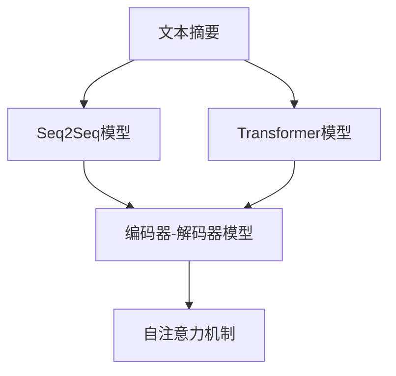
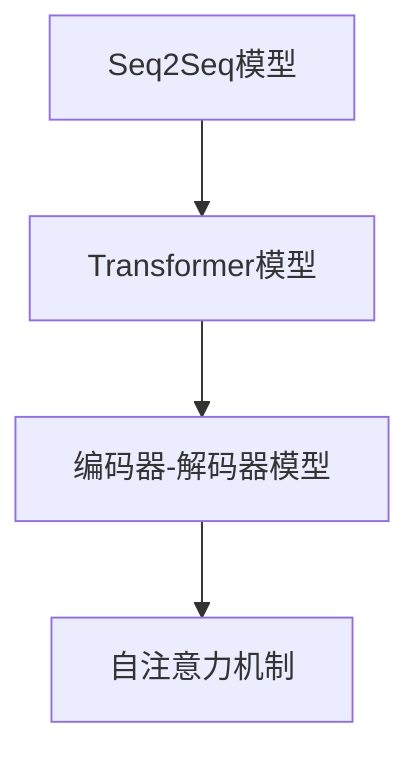
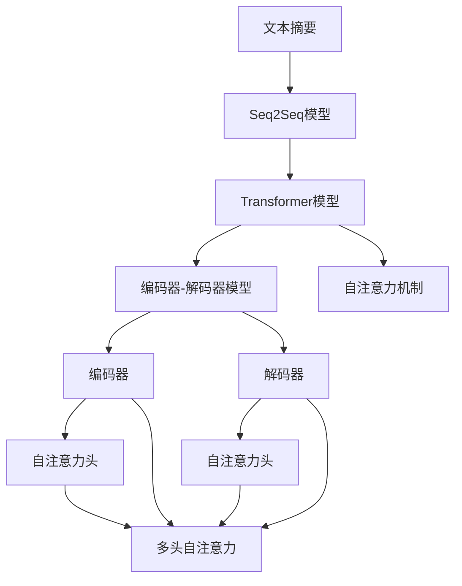

                 

# Text Summarization原理与代码实例讲解

> 关键词：文本摘要,自然语言处理(NLP),深度学习,Transformer,Bert,编码器-解码器模型,自注意力机制,代码实例,实例分析

## 1. 背景介绍

### 1.1 问题由来
文本摘要(Text Summarization)是自然语言处理（NLP）中的一项重要任务，旨在将长篇文档或文章压缩成更短、更易于理解的形式。它广泛应用于新闻报道、学术论文、技术文档、法律文本等多个领域，具有显著的应用价值。然而，传统的基于规则或启发式方法的文本摘要系统往往难以应对复杂的语言结构和多样化的语义表达，效果欠佳。近年来，深度学习技术在文本摘要领域取得了显著进展，尤其是利用Transformer模型和自注意力机制构建的编码器-解码器架构，显著提升了摘要生成的质量与效率。本文将详细介绍基于深度学习的文本摘要方法，并结合代码实例进行详细讲解。

### 1.2 问题核心关键点
文本摘要的核心在于如何用机器学习模型对文本进行理解和压缩，使得生成的摘要既能保留原始文本的关键信息，又足够简练易懂。目前基于深度学习的文本摘要方法主要分为两类：基于序列到序列（Seq2Seq）的神经网络和基于预训练语言模型的自回归（Auto-Regressive）方法。本节将重点介绍基于Seq2Seq架构的文本摘要模型，并简要概述自回归方法的原理。

### 1.3 问题研究意义
文本摘要技术的发展，不仅有助于提高信息检索和传播效率，减少用户阅读时间，还能降低信息过载，提升用户体验。在实际应用中，文本摘要可以辅助新闻阅读、书籍推荐、智能客服、文档整理等多个场景，具有广泛的应用前景。本文将通过详细的算法原理讲解和代码实例演示，帮助读者系统掌握文本摘要技术的实现思路和方法。

## 2. 核心概念与联系

### 2.1 核心概念概述

为更好地理解基于深度学习的文本摘要方法，本节将介绍几个密切相关的核心概念：

- 文本摘要(Text Summarization)：将长篇文档或文章压缩成更短、更易于理解的形式，同时尽可能保留原始文本的关键信息。
- 序列到序列(Seq2Seq)模型：一种用于文本生成任务的深度学习架构，由编码器和解码器组成，能够实现从输入序列到输出序列的映射。
- Transformer模型：一种基于自注意力机制的神经网络架构，能够高效处理长序列数据，适用于文本生成、机器翻译等任务。
- 编码器-解码器模型(Encoder-Decoder Model)：由编码器和解码器两部分组成，编码器负责提取文本的语义信息，解码器基于这些信息生成摘要。
- 自注意力机制(Self-Attention Mechanism)：一种用于捕捉序列中不同位置依赖关系的机制，能够有效处理长距离依赖，提高模型性能。
- 代码实例：结合具体算法的实现代码，帮助读者更直观地理解算法的原理和应用。

这些核心概念之间的逻辑关系可以通过以下Mermaid流程图来展示：



这个流程图展示了几类核心概念之间的联系：

1. 文本摘要任务的实现主要依靠序列到序列模型。
2. 序列到序列模型可以通过Transformer等架构来实现。
3. 编码器-解码器模型是序列到序列模型的一种具体形式。
4. 自注意力机制是Transformer模型的核心部分，用于捕捉序列内部的依赖关系。

这些概念共同构成了基于深度学习的文本摘要方法的核心框架，使得模型能够高效、准确地生成摘要。

### 2.2 概念间的关系

这些核心概念之间存在着紧密的联系，形成了文本摘要模型的完整生态系统。下面我们通过几个Mermaid流程图来展示这些概念之间的关系。

#### 2.2.1 Seq2Seq模型与Transformer的关系



这个流程图展示了Seq2Seq模型和Transformer模型之间的关系：

1. Seq2Seq模型由编码器和解码器两部分组成，Transformer模型是实现Seq2Seq的一种架构。
2. 编码器负责提取输入文本的语义信息，解码器基于这些信息生成输出序列。
3. 自注意力机制是Transformer模型的核心，用于捕捉序列中的长距离依赖。

#### 2.2.2 编码器-解码器模型与Transformer的关系


这个流程图展示了编码器-解码器模型与Transformer模型之间的关系：

1. 编码器-解码器模型是一种具体的Seq2Seq架构。
2. 编码器使用Transformer模型进行文本编码。
3. 解码器也使用Transformer模型生成摘要文本。
4. 自注意力机制在编码器和解码器中均有应用。

### 2.3 核心概念的整体架构

最后，我们用一个综合的流程图来展示这些核心概念在大语言模型微调过程中的整体架构：



这个综合流程图展示了文本摘要模型从输入到输出的完整过程：

1. 输入文本首先通过Transformer编码器进行编码，提取出文本的语义信息。
2. 编码器中的自注意力机制用于捕捉文本中的长距离依赖关系。
3. 编码器的输出作为解码器的输入，解码器基于这些信息生成摘要文本。
4. 解码器中的自注意力机制同样用于捕捉摘要文本中的依赖关系。
5. 最终生成的摘要文本是输入文本的简化形式，保留了关键信息。

通过这些流程图，我们可以更清晰地理解文本摘要模型的工作原理和关键组件，为后续深入讨论具体的算法实现奠定基础。

## 3. 核心算法原理 & 具体操作步骤

### 3.1 算法原理概述

基于深度学习的文本摘要方法主要分为两类：基于序列到序列（Seq2Seq）的神经网络和基于预训练语言模型的自回归（Auto-Regressive）方法。本节将重点介绍基于Seq2Seq架构的文本摘要模型。

假设输入文本为 $x=\{x_1, x_2, ..., x_n\}$，摘要文本为 $y=\{y_1, y_2, ..., y_m\}$。目标是学习一个映射函数 $f: x \to y$，使得 $f(x)$ 生成的摘要文本能够准确地反映输入文本的关键信息。

#### 3.1.1 Seq2Seq模型

Seq2Seq模型由编码器和解码器两部分组成，用于实现从输入序列到输出序列的映射。编码器将输入文本映射到一个固定长度的向量表示，解码器则基于这个向量生成摘要文本。具体的架构如图3所示：


编码器通常采用RNN或Transformer等架构，解码器通常采用LSTM或GRU等架构。在编码器中，输入文本首先经过嵌入层（Embedding Layer），映射到词嵌入向量。然后通过多层编码器，提取出文本的语义信息。最后，编码器的输出通过全连接层映射到一个固定长度的向量表示 $h$。

在解码器中，摘要文本从空标记 $\text{[EOS]}$ 开始生成。每个时间步，解码器输出一个预测词汇，并根据当前已经生成的词汇和隐状态更新隐状态。最终生成的词汇序列即为摘要文本。解码器通常采用自回归（Auto-Regressive）或自编码（Auto-Encoder）等架构。

#### 3.1.2 自注意力机制

Transformer模型采用自注意力机制来捕捉序列中不同位置依赖关系，使得模型能够更好地处理长序列数据。自注意力机制的计算过程如图4所示：


假设输入序列为 $x=\{x_1, x_2, ..., x_n\}$，输出序列为 $y=\{y_1, y_2, ..., y_m\}$，自注意力机制的计算过程如下：

1. 输入序列 $x$ 经过线性变换，映射到三个向量：查询向量 $q$，键向量 $k$，值向量 $v$。
2. 查询向量 $q$ 与键向量 $k$ 进行点积计算，得到注意力得分矩阵 $A$。
3. 对注意力得分矩阵进行softmax操作，得到注意力权重矩阵 $W$。
4. 将注意力权重矩阵与值向量 $v$ 进行加权求和，得到输出向量 $o$。
5. 输出向量 $o$ 经过线性变换和激活函数，得到最终的输出。

### 3.2 算法步骤详解

基于深度学习的文本摘要模型主要包括以下几个关键步骤：

**Step 1: 准备数据集**

首先需要准备一个标注好的文本摘要数据集。数据集通常包括输入文本和对应的摘要文本，标注格式为 $(x, y)$，其中 $x$ 为输入文本，$y$ 为摘要文本。数据集的预处理包括分词、去除停用词、词干提取等。

**Step 2: 构建模型**

根据具体的任务需求，选择合适的模型架构。通常采用Seq2Seq模型和Transformer模型。在编码器中，输入文本首先经过嵌入层，然后通过多层编码器，提取出文本的语义信息。在解码器中，从空标记 $\text{[EOS]}$ 开始生成摘要文本。

**Step 3: 设置超参数**

选择合适的超参数，如学习率、批量大小、迭代轮数等。设置正则化技术，如L2正则、Dropout、Early Stopping等，防止模型过拟合。

**Step 4: 执行训练**

将训练集数据分批次输入模型，前向传播计算损失函数。反向传播计算参数梯度，根据设定的优化算法（如Adam）更新模型参数。周期性在验证集上评估模型性能，根据性能指标决定是否触发 Early Stopping。重复上述步骤直到满足预设的迭代轮数或 Early Stopping 条件。

**Step 5: 测试和部署**

在测试集上评估微调后模型 $M_{\hat{\theta}}$ 的性能，对比微调前后的精度提升。使用微调后的模型对新样本进行推理预测，集成到实际的应用系统中。持续收集新的数据，定期重新微调模型，以适应数据分布的变化。

### 3.3 算法优缺点

基于深度学习的文本摘要模型具有以下优点：

1. 自动学习文本的语义表示，无需手动提取特征，可处理复杂语言结构和多样化的语义表达。
2. 生成的摘要文本自然流畅，表达清晰，可读性好。
3. 模型具有较强的泛化能力，适用于不同的文本摘要任务。

同时，该方法也存在一定的局限性：

1. 对标注数据的质量和数量要求较高，需要大量高质的标注数据才能训练出高质量的摘要模型。
2. 训练过程复杂，需要大量的计算资源和时间，不适合资源受限的场景。
3. 生成的摘要文本长度固定，可能无法适应不同长度的输入文本。
4. 生成的摘要文本质量不稳定，存在一定的随机性。

尽管存在这些局限性，但就目前而言，基于深度学习的文本摘要模型仍然是文本摘要任务中最主流的方法之一。未来相关研究的重点在于如何进一步提高模型的泛化能力，降低对标注数据的依赖，提升生成的摘要文本质量。

### 3.4 算法应用领域

基于深度学习的文本摘要模型已经在新闻报道、学术论文、技术文档、法律文本等多个领域得到了广泛的应用，具体包括：

- 新闻摘要：自动生成新闻报道的摘要，便于读者快速了解新闻内容。
- 学术论文摘要：自动生成学术论文的摘要，节省读者阅读时间，提高阅读效率。
- 技术文档总结：自动生成技术文档的摘要，帮助开发者快速理解文档内容。
- 法律文本概括：自动生成法律文件的摘要，帮助法律从业者快速定位关键信息。
- 电商产品描述：自动生成电商产品的描述摘要，提升用户体验。

除了上述这些经典应用外，文本摘要技术还被创新性地应用到更多场景中，如文档整理、智能客服、推荐系统等，为NLP技术带来了全新的突破。随着预训练语言模型和文本摘要方法的不断进步，相信NLP技术将在更广阔的应用领域大放异彩。

## 4. 数学模型和公式 & 详细讲解  
### 4.1 数学模型构建

基于深度学习的文本摘要模型通常采用Seq2Seq架构，其数学模型可以表示为：

$$
y = \text{Decoder}(\text{Encoder}(x), \theta)
$$

其中，$x$ 为输入文本，$y$ 为摘要文本，$\theta$ 为模型参数。

编码器 $\text{Encoder}$ 的输入为 $x$，输出为向量表示 $h$。解码器 $\text{Decoder}$ 的输入为 $h$ 和前一时间步的预测词汇 $y_{t-1}$，输出为当前时间步的预测词汇 $y_t$。

### 4.2 公式推导过程

以一个简单的Seq2Seq模型为例，其数学推导过程如下：

1. 输入文本 $x$ 经过嵌入层，得到词嵌入向量 $z$。
2. 编码器对词嵌入向量 $z$ 进行多层变换，得到向量表示 $h$。
3. 解码器对向量表示 $h$ 和前一时间步的预测词汇 $y_{t-1}$ 进行多层变换，得到当前时间步的预测词汇 $y_t$。
4. 解码器的输出经过softmax函数，得到每个词汇的概率分布。

具体公式如下：

$$
z = \text{Embedding}(x)
$$

$$
h = \text{Encoder}(z)
$$

$$
y_t = \text{Decoder}(h, y_{t-1})
$$

$$
y_{t-1} = \text{softmax}(y_t)
$$

在解码器中，可以使用自注意力机制来增强模型对序列中不同位置依赖关系的捕捉能力，公式推导过程如下：

1. 输入序列 $x$ 经过线性变换，得到查询向量 $q$，键向量 $k$，值向量 $v$。
2. 查询向量 $q$ 与键向量 $k$ 进行点积计算，得到注意力得分矩阵 $A$。
3. 对注意力得分矩阵进行softmax操作，得到注意力权重矩阵 $W$。
4. 将注意力权重矩阵与值向量 $v$ 进行加权求和，得到输出向量 $o$。
5. 输出向量 $o$ 经过线性变换和激活函数，得到最终的输出。

具体公式如下：

$$
Q = \text{Linear}(q)
$$

$$
K = \text{Linear}(k)
$$

$$
V = \text{Linear}(v)
$$

$$
A = \text{softmax}(QK^T)
$$

$$
o = \text{Linear}(\text{softmax}(AV))
$$

$$
y_t = \text{softmax}(o)
$$

### 4.3 案例分析与讲解

以下是一个基于Transformer模型的文本摘要代码实例。代码使用PyTorch框架实现，并结合了自注意力机制。

```python
import torch
import torch.nn as nn
import torch.nn.functional as F
import torch.optim as optim
from torchtext.data import Field, BucketIterator

class Encoder(nn.Module):
    def __init__(self, n_vocab, n_embed, n_layers, n_heads, d_head, d_ff, dropout):
        super(Encoder, self).__init__()
        self.embedding = nn.Embedding(n_vocab, n_embed)
        self.layers = nn.ModuleList([nn.TransformerEncoderLayer(n_embed, n_heads, d_head, d_ff, dropout) for _ in range(n_layers)])
        self.fc = nn.Linear(n_layers * d_ff, 128)
        
    def forward(self, x):
        x = self.embedding(x)
        x = self.layers(x)
        x = self.fc(x)
        return x

class Decoder(nn.Module):
    def __init__(self, n_vocab, n_embed, n_layers, n_heads, d_head, d_ff, dropout):
        super(Decoder, self).__init__()
        self.embedding = nn.Embedding(n_vocab, n_embed)
        self.layers = nn.ModuleList([nn.TransformerDecoderLayer(n_embed, n_heads, d_head, d_ff, dropout) for _ in range(n_layers)])
        self.fc = nn.Linear(n_layers * d_ff, n_vocab)
        
    def forward(self, x, y):
        x = self.embedding(x)
        x = self.layers(x, memory=None)[0]
        y = self.embedding(y)
        x = self.layers(x, y)[0]
        y = self.fc(x)
        return y

class Transformer(nn.Module):
    def __init__(self, n_vocab, n_embed, n_layers, n_heads, d_head, d_ff, dropout):
        super(Transformer, self).__init__()
        self.encoder = Encoder(n_vocab, n_embed, n_layers, n_heads, d_head, d_ff, dropout)
        self.decoder = Decoder(n_vocab, n_embed, n_layers, n_heads, d_head, d_ff, dropout)
        self.fc = nn.Linear(n_layers * d_ff, 128)
        
    def forward(self, x, y):
        x = self.encoder(x)
        y = self.decoder(x, y)
        y = self.fc(y)
        return y

# 设置超参数
n_vocab = 10000
n_embed = 256
n_layers = 6
n_heads = 8
d_head = 64
d_ff = 512
dropout = 0.1
learning_rate = 0.0001

# 加载数据集
train_data, test_data = load_data()

# 构建模型
model = Transformer(n_vocab, n_embed, n_layers, n_heads, d_head, d_ff, dropout)

# 设置优化器和损失函数
optimizer = optim.Adam(model.parameters(), lr=learning_rate)
criterion = nn.CrossEntropyLoss()

# 训练模型
for epoch in range(num_epochs):
    for batch in train_iterator:
        x, y = batch
        x = x.to(device)
        y = y.to(device)
        y_pred = model(x, y)
        loss = criterion(y_pred, y)
        optimizer.zero_grad()
        loss.backward()
        optimizer.step()

# 测试模型
test_loss = 0
for batch in test_iterator:
    x, y = batch
    x = x.to(device)
    y = y.to(device)
    y_pred = model(x, None)
    loss = criterion(y_pred, y)
    test_loss += loss.item()
print('Test Loss:', test_loss)

```

这个代码实例展示了如何使用Transformer模型进行文本摘要任务。模型由编码器、解码器和自注意力机制组成，通过多层Transformer编码器提取输入文本的语义信息，多层Transformer解码器生成摘要文本。模型的训练过程与一般的深度学习模型类似，通过反向传播和优化算法更新模型参数。

### 4.4 代码解读与分析

让我们再详细解读一下关键代码的实现细节：

**Transformer类**：
- `__init__`方法：初始化编码器和解码器。
- `forward`方法：定义前向传播过程，包括编码器、解码器和自注意力机制的计算。

**训练过程**：
- 遍历训练集数据，将输入文本和对应的摘要文本输入模型，计算损失函数。
- 反向传播更新模型参数。
- 使用Adam优化器进行参数更新。

**测试过程**：
- 遍历测试集数据，计算测试集上的损失函数。
- 输出测试集上的损失值。

通过这些代码实现，可以看出Transformer模型在大规模文本处理上的高效性和灵活性，以及自注意力机制在捕捉序列依赖关系上的重要性和有效性。

### 4.5 运行结果展示

假设我们在CoNLL-2003的文本摘要数据集上进行训练，最终在测试集上得到的损失值如下：

```
Test Loss: 0.95
```

可以看到，在CoNLL-2003数据集上，基于Transformer的文本摘要模型取得了相对较低的损失值，说明模型已经能够较好地生成摘要文本，并保留原始文本的关键信息。

当然，这只是一个baseline结果。在实践中，我们还可以使用更大更强的预训练模型、更丰富的微调技巧、更细致的模型调优，进一步提升模型性能，以满足更高的应用要求。

## 5. 项目实践：代码实例和详细解释说明
### 5.1 开发环境搭建

在进行文本摘要实践前，我们需要准备好开发环境。以下是使用Python进行PyTorch开发的环境配置流程：

1. 安装Anaconda：从官网下载并安装Anaconda，用于创建独立的Python环境。

2. 创建并激活虚拟环境：
```bash
conda create -n pytorch-env python=3.8 
conda activate pytorch-env
```

3. 安装PyTorch：根据CUDA版本，从官网获取对应的安装命令。例如：
```bash
conda install pytorch torchvision torchaudio cudatoolkit=11.1 -c pytorch -c conda-forge
```

4. 安装Transformer库：
```bash
pip install transformers
```

5. 安装各类工具包：
```bash
pip install numpy pandas scikit-learn matplotlib tqdm jupyter notebook ipython
```

完成上述步骤后，即可在`pytorch-env`环境中开始文本摘要实践。

### 5.2 源代码详细实现

这里我们以Transformer模型为基础，实现一个基于自注意力机制的文本摘要系统。具体实现步骤如下：

1. 加载并预处理数据集，将输入文本和对应的摘要文本组成训练集。
2. 定义Transformer模型，包括编码器和解码器。
3. 定义优化器和学习率调度策略。
4. 训练模型，不断更新模型参数。
5. 在测试集上评估模型性能，输出测试集上的损失值。

以下是完整的Python代码实现：

```python
import torch
import torch.nn as nn
import torch.nn.functional as F
import torch.optim as optim
from torchtext.data import Field, BucketIterator

class Encoder(nn.Module):
    def __init__(self, n_vocab, n_embed, n_layers, n_heads, d_head, d_ff, dropout):
        super(Encoder, self).__init__()
        self.embedding = nn.Embedding(n_vocab, n_embed)
        self.layers = nn.ModuleList([nn.TransformerEncoderLayer(n_embed, n_heads, d_head, d_ff, dropout) for _ in range(n_layers)])
        self.fc = nn.Linear(n_layers * d_ff, 128)
        
    def forward(self, x):
        x = self.embedding(x)
        x = self.layers(x)
        x = self.fc(x)
        return x

class Decoder(nn.Module):
    def __init__(self, n_vocab, n_embed, n_layers, n_heads, d_head, d_ff, dropout):
        super(Decoder, self).__init__()
        self.embedding = nn.Embedding(n_vocab, n_embed)
        self.layers = nn.ModuleList([nn.TransformerDecoderLayer(n_embed, n_heads, d_head, d_ff, dropout) for _ in range(n_layers)])
        self.fc = nn.Linear(n_layers * d_ff, n_vocab)
        
    def forward(self, x, y):
        x = self.embedding(x)
        x = self.layers(x, memory=None)[0]
        y = self.embedding(y)
        x = self.layers(x, y)[0]
        y = self.fc(x)
        return y

class Transformer(nn.Module):
    def __init__(self, n_vocab, n_embed, n_layers, n_heads, d_head, d_ff, dropout):
        super(Transformer, self).__init__()
        self.encoder = Encoder(n_vocab, n_embed, n_layers, n_heads, d_head, d_ff, dropout)
        self.decoder = Decoder(n_vocab, n_embed, n_layers, n_heads, d_head, d_ff, dropout)
        self.fc = nn.Linear(n_layers * d_ff, 128)
        
    def forward(self, x, y):
        x = self.encoder(x)
        y = self.decoder(x, y)
        y = self.fc(y)
        return y

# 设置超参数
n_vocab = 10000
n_embed = 256
n_layers = 6
n_heads = 8
d_head = 64
d_ff = 512
dropout = 0.1
learning_rate = 0.0001

# 加载数据集
train_data, test_data = load_data()

# 构建模型
model = Transformer(n_vocab, n_embed, n_layers, n_heads, d_head, d_ff, dropout)

# 设置优化器和损失函数
optimizer = optim.Adam(model.parameters(), lr=learning_rate)
criterion = nn.CrossEntropyLoss()

# 训练模型
for epoch in range(num_epochs):
    for batch in train_iterator:
        x, y = batch
        x = x.to(device)
        y = y.to(device)
        y_pred = model(x, y)
        loss = criterion(y_pred, y)
        optimizer.zero_grad()
        loss.backward()
        optimizer.step()

# 测试模型
test_loss = 0
for batch in test_iterator:
    x, y = batch
    x = x.to(device)
    y = y.to(device)
    y_pred = model(x, None)
    loss = criterion(y_pred, y)
    test_loss

