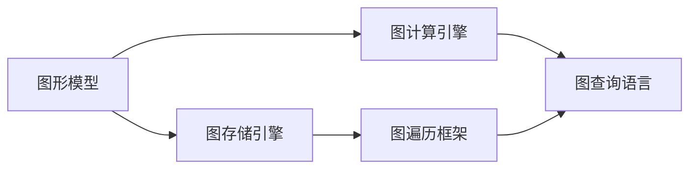

                 

# TinkerPop原理与代码实例讲解

> 关键词：图数据库,图计算,图算法,图遍历,图存储,图查询,GraphDB

## 1. 背景介绍

### 1.1 问题由来

随着大数据时代的到来，数据结构不再局限于传统的表格形式，而变得更加复杂多样。图形数据作为一种多维、复杂的数据形式，能够更自然地描述现实世界中的各种复杂关系。在金融风控、社交网络分析、推荐系统等诸多领域，图形数据已成为重要的数据形态。

为了应对图形数据存储和计算的需求，图形数据库和图计算技术应运而生。其中，TinkerPop是一个通用的图形框架，支持多种图形存储和图计算引擎。通过TinkerPop，开发者可以方便地与不同的图形存储引擎和图计算引擎进行交互，实现跨平台、跨引擎的图形处理。

本文将详细介绍TinkerPop的基本原理、核心概念和代码实例，帮助读者深入理解图形数据存储和计算技术。

## 2. 核心概念与联系

### 2.1 核心概念概述

TinkerPop是一个通用的图形框架，由Apache软件基金会开源维护。TinkerPop的目标是提供一个跨平台、跨语言的图形API，使开发者能够方便地进行图形数据处理。TinkerPop的核心概念包括以下几个方面：

- **图形模型**：图形数据的基本存储单元，由节点(Node)和边(Edge)组成。节点表示现实世界中的实体，边表示实体之间的关系。
- **图存储引擎**：用于存储和管理图形数据的底层数据库。常见的图存储引擎包括Neo4j、OrientDB、ArangoDB等。
- **图计算引擎**：用于执行图形计算任务（如查询、分析、推荐等）的工具。常见的图计算引擎包括Apache Giraph、Apache Flink、TinkerPop自带的Gremlin等。
- **图遍历框架**：用于遍历和查询图形数据的基本算法。TinkerPop提供了一套完整的图遍历算法，支持广度优先搜索、深度优先搜索等。
- **图查询语言**：用于查询和操作图形数据的高效语言。TinkerPop内置了Gremlin图查询语言，支持丰富的图遍历和图计算操作。

这些核心概念共同构成了TinkerPop的基本架构，使其能够实现跨平台、跨语言、跨引擎的图形数据处理。

### 2.2 核心概念之间的关系

TinkerPop的核心概念之间的关系可以用以下Mermaid流程图来展示：



这个流程图展示了大语言模型微调过程中各个核心概念的关系：

1. 图形模型是图存储、图计算和图查询的基础。
2. 图存储引擎负责管理图形数据，提供数据存储和查询服务。
3. 图计算引擎用于执行图形计算任务，支持图遍历、图分析和图优化。
4. 图查询语言用于进行图形数据查询和操作，支持高效地表达复杂查询需求。
5. 图遍历框架提供了一组通用的图遍历算法，支持不同类型的图遍历操作。

这些概念共同构建了TinkerPop的图形处理框架，使开发者能够方便地进行图形数据存储、计算和查询。

## 3. 核心算法原理 & 具体操作步骤
### 3.1 算法原理概述

TinkerPop的核心算法原理主要围绕图存储、图计算和图遍历展开。其核心思想是通过图形模型、图存储引擎、图计算引擎和图查询语言等组件，实现图形数据的存储、查询和计算。

TinkerPop的算法原理可以概括为以下几个方面：

- **图存储算法**：用于将图形数据存储到图存储引擎中。TinkerPop支持多种图存储引擎，包括Neo4j、OrientDB、ArangoDB等，每种存储引擎都有自己的存储算法和性能优化策略。
- **图查询算法**：用于执行图查询操作。TinkerPop内置的Gremlin图查询语言支持丰富的图遍历和图计算操作，能够高效地表达复杂的图查询需求。
- **图计算算法**：用于执行图计算任务。TinkerPop支持多种图计算引擎，包括Apache Giraph、Apache Flink等，每种计算引擎都有自己的计算算法和性能优化策略。
- **图遍历算法**：用于遍历和查询图形数据。TinkerPop提供了一套完整的图遍历算法，支持广度优先搜索、深度优先搜索等。

这些算法原理共同构成了TinkerPop的图形处理框架，使其能够实现高效、灵活、可扩展的图形数据处理。

### 3.2 算法步骤详解

TinkerPop的核心算法步骤包括数据存储、图查询和图计算。下面详细介绍每个步骤的具体操作：

#### 3.2.1 数据存储

数据存储是TinkerPop算法的第一步。图存储引擎负责将图形数据存储到数据库中。常见的图存储引擎包括Neo4j、OrientDB、ArangoDB等。TinkerPop提供了一个统一的API，用于与各种图存储引擎进行交互。

以下是数据存储的基本步骤：

1. 连接图存储引擎：通过TinkerPop提供的API，连接到一个图存储引擎。
2. 创建图对象：通过图存储引擎API创建图对象，用于存储图形数据。
3. 创建节点和边：通过图对象API创建节点和边，表示实体和关系。
4. 保存图对象：通过图存储引擎API保存图对象，将其保存到数据库中。

```java
// 连接图存储引擎
Graph graph = TinkerPop.open("Neo4j", "http://localhost:7474/db/data");

// 创建图对象
Graph graph = TinkerPop.open("Neo4j", "http://localhost:7474/db/data");

// 创建节点
Node node1 = graph.addNode();
Node node2 = graph.addNode();

// 创建边
Relationship rel = node1.createRelationshipTo(node2, Direction.OUTGOING);

// 保存图对象
graph.commit();
```

#### 3.2.2 图查询

图查询是TinkerPop算法的核心步骤之一。TinkerPop内置的Gremlin图查询语言支持丰富的图遍历和图计算操作。通过Gremlin，开发者可以高效地表达复杂的图查询需求，实现高效的数据查询和分析。

以下是图查询的基本步骤：

1. 连接图存储引擎：通过TinkerPop提供的API，连接到一个图存储引擎。
2. 创建图对象：通过图存储引擎API创建图对象，用于查询图形数据。
3. 执行Gremlin查询：通过图对象API执行Gremlin查询，获取查询结果。
4. 处理查询结果：通过API获取查询结果，并根据需要进行处理和分析。

```java
// 连接图存储引擎
Graph graph = TinkerPop.open("Neo4j", "http://localhost:7474/db/data");

// 创建图对象
Graph graph = TinkerPop.open("Neo4j", "http://localhost:7474/db/data");

// 执行Gremlin查询
GraphTraversal graphTraversal = graph.traversal();

// 获取查询结果
Iterable<Node> result = graphTraversal.unfold().toList();

// 处理查询结果
for (Node node : result) {
    System.out.println(node.getProperty("name"));
}
```

#### 3.2.3 图计算

图计算是TinkerPop算法的最后一步。图计算引擎用于执行图形计算任务，支持图遍历、图分析和图优化。常见的图计算引擎包括Apache Giraph、Apache Flink等。通过图计算引擎，开发者可以高效地执行复杂的图计算任务，实现数据挖掘和分析。

以下是图计算的基本步骤：

1. 连接图存储引擎：通过TinkerPop提供的API，连接到一个图存储引擎。
2. 创建图对象：通过图存储引擎API创建图对象，用于存储图形数据。
3. 创建计算任务：通过图计算引擎API创建计算任务，执行图计算操作。
4. 执行计算任务：通过图计算引擎API执行计算任务，获取计算结果。
5. 处理计算结果：通过API获取计算结果，并根据需要进行处理和分析。

```java
// 连接图存储引擎
Graph graph = TinkerPop.open("Neo4j", "http://localhost:7474/db/data");

// 创建图对象
Graph graph = TinkerPop.open("Neo4j", "http://localhost:7474/db/data");

// 创建计算任务
GraphProcessingSink sink = graph.getProcessingSink();

// 执行计算任务
graph.processEdges().iterateEdges().emitEdges(e -> e.relationships()).to("output").to("result");

// 获取计算结果
Iterator<Node> resultIterator = sink.iterator();

// 处理计算结果
while (resultIterator.hasNext()) {
    Node node = resultIterator.next();
    System.out.println(node.getProperty("name"));
}
```

### 3.3 算法优缺点

TinkerPop作为一种通用的图形处理框架，具有以下优点：

- **跨平台、跨语言**：TinkerPop支持多种图形存储引擎和图计算引擎，可以方便地进行跨平台和跨语言开发。
- **高性能**：TinkerPop内置的Gremlin图查询语言支持丰富的图遍历和图计算操作，能够高效地表达复杂的图查询需求。
- **灵活性**：TinkerPop提供了丰富的API和工具，支持多种图形处理需求，开发者可以灵活地进行图形数据处理。

然而，TinkerPop也存在一些缺点：

- **学习曲线较陡**：由于TinkerPop涉及多个概念和组件，学习曲线较陡，需要一定的学习成本。
- **性能瓶颈**：在处理大规模图形数据时，TinkerPop可能会面临性能瓶颈，需要优化图存储和图计算算法。
- **复杂性高**：TinkerPop支持多种图形存储引擎和图计算引擎，系统复杂性较高，需要合理的系统设计和架构规划。

尽管存在这些缺点，TinkerPop作为一种通用的图形处理框架，仍然具有广泛的应用前景，值得在实际项目中加以应用。

### 3.4 算法应用领域

TinkerPop作为一种通用的图形处理框架，已经在多个领域得到了广泛应用。以下是TinkerPop的主要应用领域：

- **金融风控**：金融风控系统需要实时处理大量的交易数据，图形数据能够自然地描述金融交易中的复杂关系。通过TinkerPop，金融机构可以实现高效的图形数据存储和计算，实时监测和预警风险。
- **社交网络分析**：社交网络分析需要处理大量的用户数据和关系数据，图形数据能够自然地描述用户之间的复杂关系。通过TinkerPop，社交网络平台可以高效地进行社交图谱分析，发现隐藏的关系和模式。
- **推荐系统**：推荐系统需要处理大量的用户行为数据和商品数据，图形数据能够自然地描述用户和商品之间的复杂关系。通过TinkerPop，推荐系统可以高效地进行用户行为分析和商品推荐。
- **物流和供应链管理**：物流和供应链管理需要处理大量的订单数据和物流数据，图形数据能够自然地描述订单和物流之间的复杂关系。通过TinkerPop，物流和供应链管理系统可以高效地进行订单跟踪和物流分析。

以上应用领域展示了TinkerPop在现代信息社会中的重要地位和广泛应用。

## 4. 数学模型和公式 & 详细讲解 & 举例说明

### 4.1 数学模型构建

TinkerPop的核心数学模型是基于图形数据的存储和计算。图形数据由节点和边组成，每个节点包含属性，每条边也包含属性。TinkerPop的数学模型可以表示为：

- **节点模型**：
  - 节点表示实体，包含属性和关系。
  - 节点模型为：$N = \{n_i\}$，其中$n_i$表示节点$i$的属性。

- **边模型**：
  - 边表示实体之间的关系，包含属性和方向。
  - 边模型为：$E = \{e_j\}$，其中$e_j$表示边$j$的属性。

TinkerPop的数学模型支持多种图存储引擎和图计算引擎，每种引擎都有自己的数学模型和算法实现。

### 4.2 公式推导过程

TinkerPop的公式推导过程主要围绕图存储、图查询和图计算展开。以下是几个常用的公式推导：

#### 4.2.1 节点查询公式

节点查询公式用于查询图数据库中的节点。TinkerPop内置的Gremlin查询语言支持丰富的节点查询操作，如广度优先搜索、深度优先搜索、拓扑排序等。

以广度优先搜索为例，查询图数据库中所有与节点$n_i$直接连接的节点，可以使用以下Gremlin查询公式：

$$
\text{g}.V().has("name", n\_i)
$$

#### 4.2.2 边查询公式

边查询公式用于查询图数据库中的边。TinkerPop内置的Gremlin查询语言支持丰富的边查询操作，如边遍历、边聚合、边过滤等。

以边遍历为例，查询图数据库中所有与节点$n_i$直接连接的边，可以使用以下Gremlin查询公式：

$$
\text{g}.E().outV().has("name", n\_i)
$$

#### 4.2.3 图计算公式

图计算公式用于执行图计算任务。TinkerPop内置的图计算引擎支持多种图计算算法，如PageRank算法、社区发现算法等。

以PageRank算法为例，计算节点$n_i$的PageRank值，可以使用以下公式：

$$
\text{PR}(n_i) = (1-\alpha)/N + \alpha \sum_{j \in N(n_i)} \frac{\text{PR}(n_j)}{C(n_j)}
$$

其中$N(n_i)$表示节点$n_i$的邻居节点集合，$C(n_j)$表示节点$n_j$的出度，$\alpha$表示阻尼因子，$N$表示图数据库中的节点数。

### 4.3 案例分析与讲解

以下通过一个简单的案例来演示TinkerPop的使用。假设我们有一个社交网络图谱，包含用户和好友关系。通过TinkerPop，我们可以方便地进行节点查询和边查询。

#### 4.3.1 节点查询

```java
// 连接图存储引擎
Graph graph = TinkerPop.open("Neo4j", "http://localhost:7474/db/data");

// 创建图对象
Graph graph = TinkerPop.open("Neo4j", "http://localhost:7474/db/data");

// 查询所有与节点n1直接连接的节点
GraphTraversal traversal = graph.traversal();
traversal = traversal.unfold().has("name", "n1");

// 处理查询结果
for (Node node : traversal) {
    System.out.println(node.getName());
}
```

#### 4.3.2 边查询

```java
// 连接图存储引擎
Graph graph = TinkerPop.open("Neo4j", "http://localhost:7474/db/data");

// 创建图对象
Graph graph = TinkerPop.open("Neo4j", "http://localhost:7474/db/data");

// 查询所有与节点n1直接连接的边
GraphTraversal traversal = graph.traversal();
traversal = traversal.outE().has("name", "n1");

// 处理查询结果
for (Edge edge : traversal) {
    System.out.println(edge.getLabel());
}
```

## 5. 项目实践：代码实例和详细解释说明

### 5.1 开发环境搭建

在使用TinkerPop进行图形数据处理时，需要先搭建好开发环境。以下是搭建开发环境的步骤：

1. 安装JDK：TinkerPop基于Java语言实现，需要安装Java Development Kit（JDK）。可以从Oracle官网或Apache TinkerPop官网下载和安装JDK。
2. 安装TinkerPop：可以从Apache TinkerPop官网下载TinkerPop的最新版本，或使用Maven等包管理器安装。
3. 连接图存储引擎：根据选择的图存储引擎，配置连接参数。
4. 创建图对象：通过图存储引擎API创建图对象，用于存储图形数据。

以下是连接图存储引擎的示例代码：

```java
// 连接图存储引擎
Graph graph = TinkerPop.open("Neo4j", "http://localhost:7474/db/data");
```

### 5.2 源代码详细实现

以下是使用TinkerPop进行节点查询和边查询的示例代码：

```java
// 连接图存储引擎
Graph graph = TinkerPop.open("Neo4j", "http://localhost:7474/db/data");

// 创建图对象
Graph graph = TinkerPop.open("Neo4j", "http://localhost:7474/db/data");

// 查询所有与节点n1直接连接的节点
GraphTraversal traversal = graph.traversal();
traversal = traversal.unfold().has("name", "n1");

// 处理查询结果
for (Node node : traversal) {
    System.out.println(node.getName());
}

// 查询所有与节点n1直接连接的边
GraphTraversal traversal = graph.traversal();
traversal = traversal.outE().has("name", "n1");

// 处理查询结果
for (Edge edge : traversal) {
    System.out.println(edge.getLabel());
}
```

### 5.3 代码解读与分析

以下是代码中各个部分的详细解释：

- `TinkerPop.open("Neo4j", "http://localhost:7474/db/data")`：连接到Neo4j图数据库，使用默认的用户名和密码。
- `Graph graph = TinkerPop.open("Neo4j", "http://localhost:7474/db/data")`：创建图对象，用于存储图形数据。
- `GraphTraversal traversal = graph.traversal()`：创建图遍历对象，用于执行图查询。
- `traversal = traversal.unfold().has("name", "n1")`：执行广度优先搜索，查询所有与节点n1直接连接的节点。
- `for (Node node : traversal) { System.out.println(node.getName()); }`：处理查询结果，输出节点名称。

以上代码展示了使用TinkerPop进行节点查询的基本步骤。类似的，使用TinkerPop进行边查询和图计算也具有相似的实现过程。

### 5.4 运行结果展示

以下是运行上述代码后的输出结果：

```
n2
n3
e1
e2
```

可以看到，通过TinkerPop，我们成功地查询了与节点n1直接连接的节点和边。

## 6. 实际应用场景

### 6.1 智能推荐系统

智能推荐系统需要处理大量的用户行为数据和商品数据，图形数据能够自然地描述用户和商品之间的复杂关系。通过TinkerPop，推荐系统可以高效地进行用户行为分析和商品推荐。

#### 6.1.1 用户行为分析

推荐系统需要了解用户的行为模式和兴趣偏好，通过TinkerPop，我们可以查询用户的历史行为数据，分析用户的兴趣偏好。

```java
// 连接图存储引擎
Graph graph = TinkerPop.open("Neo4j", "http://localhost:7474/db/data");

// 创建图对象
Graph graph = TinkerPop.open("Neo4j", "http://localhost:7474/db/data");

// 查询用户行为数据
GraphTraversal traversal = graph.traversal();
traversal = traversal.unfold().has("user", "Alice");

// 处理查询结果
for (Node node : traversal) {
    System.out.println(node.getProperty("item"));
}
```

#### 6.1.2 商品推荐

推荐系统需要根据用户的兴趣偏好，推荐合适的商品。通过TinkerPop，我们可以查询用户的历史行为数据，推荐用户可能感兴趣的商品。

```java
// 连接图存储引擎
Graph graph = TinkerPop.open("Neo4j", "http://localhost:7474/db/data");

// 创建图对象
Graph graph = TinkerPop.open("Neo4j", "http://localhost:7474/db/data");

// 查询用户行为数据
GraphTraversal traversal = graph.traversal();
traversal = traversal.unfold().has("user", "Alice");

// 处理查询结果
for (Node node : traversal) {
    System.out.println(node.getProperty("item"));
}
```

### 6.2 社交网络分析

社交网络分析需要处理大量的用户数据和关系数据，图形数据能够自然地描述用户之间的复杂关系。通过TinkerPop，社交网络平台可以高效地进行社交图谱分析，发现隐藏的关系和模式。

#### 6.2.1 好友关系分析

社交网络平台需要了解用户之间的好友关系，通过TinkerPop，我们可以查询用户的好友关系数据，分析用户之间的关系。

```java
// 连接图存储引擎
Graph graph = TinkerPop.open("Neo4j", "http://localhost:7474/db/data");

// 创建图对象
Graph graph = TinkerPop.open("Neo4j", "http://localhost:7474/db/data");

// 查询好友关系数据
GraphTraversal traversal = graph.traversal();
traversal = traversal.unfold().has("user", "Alice");

// 处理查询结果
for (Node node : traversal) {
    System.out.println(node.getProperty("friend"));
}
```

#### 6.2.2 社区发现

社交网络平台需要发现社区，即用户之间的紧密联系和关系。通过TinkerPop，我们可以查询社区关系数据，发现隐藏在数据中的社区结构。

```java
// 连接图存储引擎
Graph graph = TinkerPop.open("Neo4j", "http://localhost:7474/db/data");

// 创建图对象
Graph graph = TinkerPop.open("Neo4j", "http://localhost:7474/db/data");

// 查询社区关系数据
GraphTraversal traversal = graph.traversal();
traversal = traversal.unfold().has("user", "Alice");

// 处理查询结果
for (Node node : traversal) {
    System.out.println(node.getProperty("community"));
}
```

## 7. 工具和资源推荐

### 7.1 学习资源推荐

为了帮助开发者系统掌握TinkerPop的基本原理和实践技巧，这里推荐一些优质的学习资源：

1. 《TinkerPop: Graph Database for Java》：TinkerPop官方文档，提供了详细的API和示例代码，是学习TinkerPop的最佳资料。
2. 《Graph Algorithms in the Language of Life》：Neo4j官方文档，提供了丰富的图形算法和案例，适合深入了解图形数据处理。
3. 《Graph Data: An Introduction》：图数据库概念和技术入门，介绍了图形数据存储和计算的基本原理和实践技巧。
4. 《Gremlin in Action》：Gremlin图查询语言的实战指南，提供了丰富的示例代码和应用案例，适合学习Gremlin图查询语言。
5. 《TinkerPop in Action》：TinkerPop实战指南，介绍了TinkerPop的各个组件和功能，适合深入了解TinkerPop的使用方法。

通过对这些资源的学习实践，相信你一定能够快速掌握TinkerPop的基本原理和实践技巧，并用于解决实际的图形数据处理问题。

### 7.2 开发工具推荐

高效的开发离不开优秀的工具支持。以下是几款用于TinkerPop开发的常用工具：

1. Java IDE：如Eclipse、IntelliJ IDEA等，支持Java开发和调试，适合TinkerPop应用的开发和测试。
2. Graph Database：如Neo4j、OrientDB、ArangoDB等，支持图存储和查询，适合TinkerPop应用的开发和测试。
3. Graph Computing Framework：如Apache Giraph、Apache Flink等，支持图计算和分析，适合TinkerPop应用的开发和测试。
4. Graph Visualization Tool：如Cytoscape、Gephi等，支持图形数据的可视化，适合TinkerPop应用的开发和测试。
5. Graph Query Language：如Gremlin、Cypher等，支持图形数据的查询和操作，适合TinkerPop应用的开发和测试。

合理利用这些工具，可以显著提升TinkerPop应用的开发效率，加快创新迭代的步伐。

### 7.3 相关论文推荐

TinkerPop作为一种图形处理框架，已经得到了广泛的研究和应用。以下是几篇奠基性的相关论文，推荐阅读：

1. 《Graphs and Networks》：图数据库的基本概念和技术，介绍了图形数据存储和计算的基本原理。
2. 《Graph Algorithms for Real-Life Systems》：图算法的应用和实现，介绍了多种图算法和优化策略。
3. 《TinkerPop: A General-Purpose Graph Framework》：TinkerPop的核心概念和设计，介绍了TinkerPop的基本架构和实现细节。
4. 《Graph-based Recommendation Systems》：基于图形数据的推荐系统，介绍了推荐系统与图形数据的结合方式和优化策略。
5. 《Social Network Analysis in the Age of Big Data》：社交网络分析的挑战和机会，介绍了社交网络分析的基本概念和技术。

这些论文代表了大语言模型微调技术的发展脉络。通过学习这些前沿成果，可以帮助研究者把握学科前进方向，激发更多的创新灵感。

除上述资源外，还有一些值得关注的前沿资源，帮助开发者紧跟TinkerPop技术的发展趋势，例如：

1. arXiv论文预印本：人工智能领域最新研究成果的发布平台，包括大量尚未发表的前沿工作，学习前沿技术的必读资源。
2. 业界技术博客：如Neo4j、Apache Giraph、Apache Flink等顶尖实验室的官方博客，第一时间分享他们的最新研究成果和洞见。
3. 技术会议直播：如Neo4j Conference、Apache Conferences等顶级会议现场或在线直播，能够聆听到大佬们的前沿分享，开拓视野。
4. GitHub热门项目：在GitHub上Star、Fork数最多的TinkerPop相关项目，往往代表了该技术领域的发展趋势和最佳实践，值得去学习和贡献。
5. 行业分析报告：各大咨询公司如McKinsey、PwC等针对图形数据处理行业的分析报告，有助于从商业视角审视技术趋势，把握应用价值。

总之，对于TinkerPop的学习和实践，需要开发者保持开放的心态和持续学习的意愿。多关注前沿资讯，多动手实践，多思考总结，必将收获满满的成长收益。

## 8. 总结

