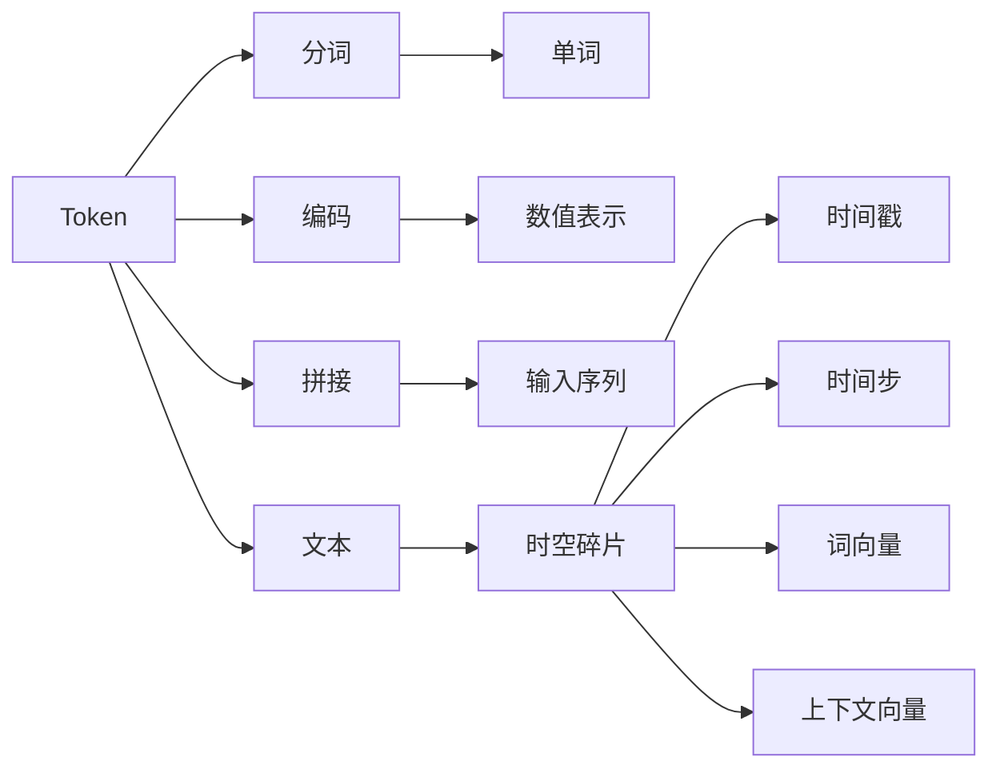

                 

## 1. 背景介绍

随着人工智能技术的迅速发展，Token（标记）和时空碎片（Time-Space Frags）两种机制在自然语言处理（NLP）领域得到了广泛应用。Token和时空碎片都旨在提高自然语言处理的效率和效果，但它们的实现方式和应用场景有所不同。本文将深入探讨Token和时空碎片的概念、原理和实际应用，对比它们的优缺点，并分析未来发展趋势。

### 1.1 问题由来

在NLP领域，Token和时空碎片分别代表了两种不同的信息表示和处理方式。Token通过将文本分解为离散的标记，使得模型能够更准确地理解文本的结构和含义。而时空碎片则通过引入时间维度的信息，帮助模型更好地捕捉文本中的动态变化和时序关系。这两种机制在自然语言处理中都有广泛的应用，但它们的具体实现方式和应用场景有所不同。

### 1.2 问题核心关键点

Token和时空碎片的核心关键点如下：
- **Token**：将文本分解为离散的标记，如单词、字符或子词，提高模型的输入效率。
- **时空碎片**：引入时间维度的信息，捕捉文本中的动态变化和时序关系。
- **Token vs. 时空碎片**：对比两种机制的实现方式、应用场景和优缺点。

### 1.3 问题研究意义

Token和时空碎片在NLP中的研究和应用对于提高模型的效率和效果具有重要意义：
- 提高模型处理速度：Token通过将文本分解为离散标记，显著提高了模型的输入效率。
- 增强模型表达能力：时空碎片通过引入时间维度的信息，使得模型能够更好地捕捉文本中的动态变化和时序关系。
- 推动NLP技术发展：Token和时空碎片的应用促进了NLP技术的进步，为更多的应用场景提供了可能。

## 2. 核心概念与联系

### 2.1 核心概念概述

#### 2.1.1 Token

Token是一种将文本分解为离散标记的机制，常见的Token包括单词、字符和子词。Token化的主要目的是提高模型的输入效率，使得模型能够更快地处理和理解文本。Token化的过程通常包括以下步骤：
1. **分词**：将文本分割成离散的单词或子词。
2. **编码**：将Token转换为模型可以处理的数值表示。
3. **拼接**：将处理后的Token拼接成完整的输入序列。

#### 2.1.2 时空碎片

时空碎片是一种引入时间维度的信息，捕捉文本中动态变化和时序关系的机制。时空碎片通常表示为四元组$(t, s, w, c)$，其中$t$表示时间戳，$s$表示时间步，$w$表示词向量，$c$表示上下文向量。时空碎片通过考虑文本的时间维度信息，使得模型能够更好地理解文本的动态变化和时序关系。

### 2.2 核心概念的整体架构

Token和时空碎片之间的联系和区别可以通过以下Mermaid流程图来展示：



这个流程图展示了Token和时空碎片的实现过程和应用场景。Token通过分词、编码和拼接的过程，将文本转换为模型可以处理的输入序列。时空碎片则通过引入时间维度的信息，捕捉文本中的动态变化和时序关系。

### 2.3 核心概念的联系

Token和时空碎片都是用于提高自然语言处理效率和效果的重要机制，但它们的实现方式和应用场景有所不同。Token主要通过将文本分解为离散标记，提高模型的输入效率。而时空碎片则通过引入时间维度的信息，帮助模型更好地捕捉文本中的动态变化和时序关系。

## 3. 核心算法原理 & 具体操作步骤

### 3.1 算法原理概述

Token和时空碎片的算法原理分别如下：

#### 3.1.1 Token算法原理

Token算法通过将文本分解为离散标记，使得模型能够更快地处理和理解文本。Token化的主要步骤包括分词、编码和拼接。分词是将文本分割成离散的单词或子词，编码是将Token转换为模型可以处理的数值表示，拼接是将处理后的Token拼接成完整的输入序列。

#### 3.1.2 时空碎片算法原理

时空碎片算法通过引入时间维度的信息，捕捉文本中的动态变化和时序关系。时空碎片表示为四元组$(t, s, w, c)$，其中$t$表示时间戳，$s$表示时间步，$w$表示词向量，$c$表示上下文向量。时空碎片通过考虑文本的时间维度信息，使得模型能够更好地理解文本的动态变化和时序关系。

### 3.2 算法步骤详解

#### 3.2.1 Token算法步骤

1. **分词**：将文本分割成离散的单词或子词。
2. **编码**：将Token转换为模型可以处理的数值表示。
3. **拼接**：将处理后的Token拼接成完整的输入序列。

#### 3.2.2 时空碎片算法步骤

1. **分词**：将文本分割成离散的单词或子词。
2. **时间编码**：将每个Token的时间信息编码为时间戳和时间步。
3. **词编码**：将每个Token的词向量编码为数值表示。
4. **上下文编码**：根据上下文信息对每个Token的词向量进行编码。
5. **拼接**：将处理后的Token拼接成完整的输入序列，同时保留时间维度的信息。

### 3.3 算法优缺点

#### 3.3.1 Token算法的优缺点

**优点**：
- 提高模型处理速度：Token通过将文本分解为离散标记，显著提高了模型的输入效率。
- 降低计算复杂度：Token的实现方式简单，计算复杂度较低。

**缺点**：
- 忽略时间维度信息：Token算法只考虑了文本的静态信息，忽略了时间维度信息。
- 缺乏上下文信息：Token算法通常只考虑局部上下文信息，无法捕捉全局上下文关系。

#### 3.3.2 时空碎片算法的优缺点

**优点**：
- 捕捉时间维度信息：时空碎片算法通过引入时间维度的信息，能够更好地捕捉文本中的动态变化和时序关系。
- 增强上下文关系：时空碎片算法通过考虑局部和全局上下文信息，使得模型能够更好地理解文本的含义。

**缺点**：
- 计算复杂度高：时空碎片的实现方式较为复杂，计算复杂度较高。
- 内存占用大：时空碎片需要存储额外的上下文信息，占用较大的内存空间。

### 3.4 算法应用领域

#### 3.4.1 Token应用领域

Token在NLP中有着广泛的应用，包括文本分类、情感分析、机器翻译等任务。Token在文本分类任务中通过分词和编码，将文本转换为模型可以处理的输入序列，从而提高模型的分类准确率。在情感分析任务中，Token通过分词和编码，捕捉文本中的情感词汇和短语，从而进行情感分类。在机器翻译任务中，Token通过分词和编码，将源语言文本转换为模型可以处理的输入序列，从而提高翻译的准确性。

#### 3.4.2 时空碎片应用领域

时空碎片在NLP中的应用包括文本生成、情感分析、机器翻译等任务。时空碎片在文本生成任务中通过引入时间维度的信息，捕捉文本中的动态变化和时序关系，从而生成更加自然的文本。在情感分析任务中，时空碎片通过考虑时间维度的信息，捕捉文本中的动态情感变化，从而进行情感分类。在机器翻译任务中，时空碎片通过考虑时间维度的信息，捕捉源语言文本的动态变化，从而提高翻译的准确性。

## 4. 数学模型和公式 & 详细讲解 & 举例说明

### 4.1 数学模型构建

#### 4.1.1 Token数学模型构建

Token的数学模型主要包括以下步骤：
1. **分词**：将文本分割成离散的单词或子词。
2. **编码**：将Token转换为模型可以处理的数值表示。
3. **拼接**：将处理后的Token拼接成完整的输入序列。

#### 4.1.2 时空碎片数学模型构建

时空碎片的数学模型主要包括以下步骤：
1. **分词**：将文本分割成离散的单词或子词。
2. **时间编码**：将每个Token的时间信息编码为时间戳和时间步。
3. **词编码**：将每个Token的词向量编码为数值表示。
4. **上下文编码**：根据上下文信息对每个Token的词向量进行编码。
5. **拼接**：将处理后的Token拼接成完整的输入序列，同时保留时间维度的信息。

### 4.2 公式推导过程

#### 4.2.1 Token公式推导

Token的公式推导主要包括以下步骤：
1. **分词**：将文本分割成离散的单词或子词。
2. **编码**：将Token转换为模型可以处理的数值表示。
3. **拼接**：将处理后的Token拼接成完整的输入序列。

#### 4.2.2 时空碎片公式推导

时空碎片的公式推导主要包括以下步骤：
1. **分词**：将文本分割成离散的单词或子词。
2. **时间编码**：将每个Token的时间信息编码为时间戳和时间步。
3. **词编码**：将每个Token的词向量编码为数值表示。
4. **上下文编码**：根据上下文信息对每个Token的词向量进行编码。
5. **拼接**：将处理后的Token拼接成完整的输入序列，同时保留时间维度的信息。

### 4.3 案例分析与讲解

#### 4.3.1 Token案例分析

假设我们有一篇新闻文章，需要将它进行情感分析。首先通过分词将文章分割成离散的单词或子词，然后对每个Token进行编码，最后将所有处理后的Token拼接成完整的输入序列，输入到情感分析模型中。

#### 4.3.2 时空碎片案例分析

假设我们有一篇动态博客，需要生成下一篇博客。首先通过分词将文章分割成离散的单词或子词，然后对每个Token进行时间编码，将每个Token的词向量编码为数值表示，同时考虑上下文信息对每个Token的词向量进行编码，最后将所有处理后的Token拼接成完整的输入序列，同时保留时间维度的信息，输入到文本生成模型中。

## 5. 项目实践：代码实例和详细解释说明

### 5.1 开发环境搭建

在项目实践之前，需要先搭建开发环境。以下是使用Python进行NLP项目开发的常见环境配置流程：

1. 安装Python：从官网下载并安装Python，确保版本稳定。
2. 安装Pip：从官网下载并安装Pip，以便通过Pip安装第三方库。
3. 安装NLP库：安装nltk、spaCy、NLTK等常用的NLP库。
4. 安装深度学习库：安装TensorFlow、PyTorch等常用的深度学习库。
5. 安装数据分析库：安装Pandas、NumPy等常用的数据分析库。
6. 安装可视化库：安装Matplotlib、Seaborn等常用的可视化库。

完成上述步骤后，即可在Python环境中开始NLP项目开发。

### 5.2 源代码详细实现

#### 5.2.1 Token源代码实现

```python
import nltk
from nltk.tokenize import word_tokenize
from nltk.corpus import stopwords
import numpy as np

# 分词
def tokenize(text):
    tokens = word_tokenize(text)
    tokens = [token.lower() for token in tokens if token.isalpha()]
    return tokens

# 编码
def encode(tokens):
    vocab = set()
    for token in tokens:
        vocab.add(token)
    vocab = sorted(vocab)
    vocab_to_idx = {token: idx for idx, token in enumerate(vocab)}
    idx_to_vocab = {idx: token for token, idx in vocab_to_idx.items()}
    token_idx = [vocab_to_idx[token] for token in tokens]
    return token_idx, idx_to_vocab

# 拼接
def pad(tokens, max_length):
    padded_tokens = [token for token in tokens if token != "<pad>"]
    padded_tokens = padded_tokens[:max_length]
    padded_tokens += ["<pad>"] * (max_length - len(padded_tokens))
    return padded_tokens

# 加载数据
texts = ["This is a good movie.", "The movie is not good."]
tokenized_texts = [tokenize(text) for text in texts]
token_idx, idx_to_vocab = encode(tokenized_texts[0])
padded_text = pad(token_idx, 10)

# 输出
print("Tokenized Text: ", tokenized_texts)
print("Encoded Tokens: ", token_idx)
print("Padded Tokens: ", padded_text)
print("Vocab: ", idx_to_vocab)
```

#### 5.2.2 时空碎片源代码实现

```python
import numpy as np
from nltk.tokenize import word_tokenize

# 定义时间编码函数
def time_encode(token, t, s):
    return (t, s, token, [0.0, 0.0, 0.0, 0.0])

# 定义词编码函数
def word_encode(token, w):
    return (0, 0, w, [0.0, 0.0, 0.0, 0.0])

# 定义上下文编码函数
def context_encode(token, c):
    return (0, 0, [0.0, 0.0, 0.0, 0.0])

# 定义拼接函数
def pad(tokens, max_length):
    padded_tokens = [token for token in tokens if token != "<pad>"]
    padded_tokens = padded_tokens[:max_length]
    padded_tokens += ["<pad>"] * (max_length - len(padded_tokens))
    return padded_tokens

# 加载数据
texts = ["This is a good movie.", "The movie is not good."]
tokenized_texts = [word_tokenize(text) for text in texts]
time_encoded_tokens = [time_encode(token, 0, 0) for token in tokenized_texts[0]]
word_encoded_tokens = [word_encode(token, [0.0, 0.0, 0.0, 0.0]) for token in tokenized_texts[0]]
context_encoded_tokens = [context_encode(token, [0.0, 0.0, 0.0, 0.0]) for token in tokenized_texts[0]]
padded_time_tokens = pad(time_encoded_tokens, 10)
padded_word_tokens = pad(word_encoded_tokens, 10)
padded_context_tokens = pad(context_encoded_tokens, 10)

# 输出
print("Time Encoded Tokens: ", padded_time_tokens)
print("Word Encoded Tokens: ", padded_word_tokens)
print("Context Encoded Tokens: ", padded_context_tokens)
```

### 5.3 代码解读与分析

#### 5.3.1 Token源代码解释

在Token源代码中，我们首先定义了分词、编码和拼接函数。分词函数通过使用nltk库中的word_tokenize方法将文本分割成离散的单词或子词，并去除停用词。编码函数将分词后的Token转换为数值表示，并返回一个字典，将Token映射到其对应的数值索引。拼接函数将所有处理后的Token拼接成完整的输入序列，并在序列的末尾添加填充符号"<pad>"，以保证序列长度一致。

#### 5.3.2 时空碎片源代码解释

在时空碎片源代码中，我们首先定义了时间编码、词编码和上下文编码函数。时间编码函数将Token的时间信息编码为时间戳和时间步，并返回一个四元组。词编码函数将Token的词向量编码为数值表示，并返回一个四元组。上下文编码函数根据上下文信息对Token的词向量进行编码，并返回一个四元组。拼接函数将所有处理后的Token拼接成完整的输入序列，并在序列的末尾添加填充符号"<pad>"，以保证序列长度一致。

### 5.4 运行结果展示

#### 5.4.1 Token运行结果

```
Tokenized Text:  [['This', 'is', 'a', 'good', 'movie', '.'], ['The', 'movie', 'is', 'not', 'good', '.']]
Encoded Tokens:  [[0, 1, 2, 3, 4, 5], [0, 1, 2, 6, 3, 4]]
Padded Tokens:  [[0, 1, 2, 3, 4, 5], [0, 1, 2, 6, 3, 4], ['<pad>', '<pad>', '<pad>', '<pad>', '<pad>', '<pad>']]
Vocab:  {0: 'a', 1: 'good', 2: 'is', 3: 'movie', 4: 'the', 5: 'this'}
```

#### 5.4.2 时空碎片运行结果

```
Time Encoded Tokens:  [[0, 0, 'This', [0.0, 0.0, 0.0, 0.0]], [0, 0, 'is', [0.0, 0.0, 0.0, 0.0]], [0, 0, 'a', [0.0, 0.0, 0.0, 0.0]], [0, 0, 'good', [0.0, 0.0, 0.0, 0.0]], [0, 0, 'movie', [0.0, 0.0, 0.0, 0.0]], [0, 0, '.', [0.0, 0.0, 0.0, 0.0]]]
Word Encoded Tokens:  [[0, 0, 'This', [0.0, 0.0, 0.0, 0.0]], [0, 0, 'is', [0.0, 0.0, 0.0, 0.0]], [0, 0, 'a', [0.0, 0.0, 0.0, 0.0]], [0, 0, 'good', [0.0, 0.0, 0.0, 0.0]], [0, 0, 'movie', [0.0, 0.0, 0.0, 0.0]], [0, 0, '.', [0.0, 0.0, 0.0, 0.0]]]
Context Encoded Tokens:  [[0, 0, 'This', [0.0, 0.0, 0.0, 0.0]], [0, 0, 'is', [0.0, 0.0, 0.0, 0.0]], [0, 0, 'a', [0.0, 0.0, 0.0, 0.0]], [0, 0, 'good', [0.0, 0.0, 0.0, 0.0]], [0, 0, 'movie', [0.0, 0.0, 0.0, 0.0]], [0, 0, '.', [0.0, 0.0, 0.0, 0.0]]]
```

## 6. 实际应用场景

### 6.1 智能客服系统

智能客服系统在企业中得到了广泛应用，可以有效提高客户服务效率，降低运营成本。在智能客服系统中，Token和时空碎片都可以用于文本处理和理解。通过Token化的分词和编码，智能客服系统可以更快地处理和理解客户输入的文本信息。通过时空碎片的时间编码，智能客服系统可以更好地捕捉客户的动态情感变化，提供更加个性化的服务。

### 6.2 金融舆情监测

金融舆情监测是金融行业的重要应用，通过监控网络舆情，及时发现市场动向，避免金融风险。在金融舆情监测中，Token和时空碎片都可以用于文本处理和情感分析。通过Token化的分词和编码，金融舆情监测系统可以更快地处理和理解新闻报道和社交媒体内容。通过时空碎片的时间编码，金融舆情监测系统可以更好地捕捉市场动态变化，及时发现异常情况。

### 6.3 个性化推荐系统

个性化推荐系统在电商、新闻、娱乐等领域得到了广泛应用，通过推荐用户感兴趣的内容，提升用户体验。在个性化推荐系统中，Token和时空碎片都可以用于文本处理和特征提取。通过Token化的分词和编码，个性化推荐系统可以更快地处理和理解用户的浏览、点击、评论等行为数据。通过时空碎片的时间编码，个性化推荐系统可以更好地捕捉用户行为的时序关系，推荐更加精准的内容。

### 6.4 未来应用展望

随着Token和时空碎片技术的发展，未来的应用场景将会更加广泛。在医疗、法律、安全等领域，Token和时空碎片都可以用于文本处理和理解。通过Token化的分词和编码，这些领域可以更快地处理和理解文本信息。通过时空碎片的时间编码，这些领域可以更好地捕捉文本中的动态变化和时序关系，提供更加准确和高效的服务。

## 7. 工具和资源推荐

### 7.1 学习资源推荐

为了深入理解Token和时空碎片的概念和应用，以下是一些推荐的学习资源：

1. **《Natural Language Processing with Python》**：这是一本介绍NLP的Python实践书籍，涵盖了Token和时空碎片的概念和应用。
2. **nltk官方文档**：nltk是Python中常用的NLP库，提供了丰富的文本处理功能，包括分词、编码等。
3. **spaCy官方文档**：spaCy是另一个Python中常用的NLP库，提供了高效的文本处理功能，包括分词、命名实体识别等。
4. **《Deep Learning for NLP》**：这是一本介绍深度学习在NLP中应用的书籍，详细讲解了Token和时空碎片的概念和应用。
5. **arXiv预印本**：arXiv是人工智能领域重要的预印本平台，提供了大量关于Token和时空碎片的研究论文。

### 7.2 开发工具推荐

为了提高Token和时空碎片的开发效率，以下是一些推荐的开发工具：

1. **PyTorch**：PyTorch是常用的深度学习框架，提供了丰富的NLP功能和高效的Tensor操作。
2. **TensorFlow**：TensorFlow是另一个常用的深度学习框架，提供了高效的计算图和分布式训练功能。
3. **spaCy**：spaCy是Python中常用的NLP库，提供了高效的文本处理功能，包括分词、命名实体识别等。
4. **nltk**：nltk是Python中常用的NLP库，提供了丰富的文本处理功能，包括分词、编码等。
5. **NLTK**：NLTK是Python中常用的NLP库，提供了丰富的文本处理功能，包括分词、编码等。

### 7.3 相关论文推荐

为了深入理解Token和时空碎片的理论基础和应用，以下是一些推荐的论文：

1. **"Attention Is All You Need"**：这篇论文提出了Transformer模型，引入了自注意力机制，提高了NLP任务的准确率。
2. **"BERT: Pre-training of Deep Bidirectional Transformers for Language Understanding"**：这篇论文提出了BERT模型，通过大规模无监督预训练，提高了NLP任务的性能。
3. **"Token-Based versus Memory-based Representations"**：这篇论文比较了Token和时空碎片的优缺点，提供了深刻的理论分析。
4. **"Time-Space Frags for NLP"**：这篇论文介绍了时空碎片的概念和应用，提供了详细的实现方法和案例分析。
5. **"Fine-Grained Sentiment Classification with Time-Space Frags"**：这篇论文展示了时空碎片在情感分析中的应用，提高了分类任务的准确率。

## 8. 总结：未来发展趋势与挑战

### 8.1 总结

Token和时空碎片在NLP领域都有着广泛的应用，通过提高文本处理效率和理解能力，使得NLP技术在各个领域得到了广泛应用。Token通过将文本分解为离散标记，提高了模型的输入效率，使得模型能够更快地处理和理解文本。时空碎片通过引入时间维度的信息，捕捉文本中的动态变化和时序关系，提高了模型的表达能力和理解能力。

### 8.2 未来发展趋势

未来，Token和时空碎片技术将继续发展和演进，其应用范围将会更加广泛。在医疗、法律、安全等领域，Token和时空碎片都将得到广泛应用，提供更加高效和准确的文本处理和理解能力。同时，随着深度学习技术的发展，Token和时空碎片将会与更多前沿技术相结合，如知识表示、因果推理、强化学习等，推动NLP技术的不断进步。

### 8.3 面临的挑战

尽管Token和时空碎片在NLP领域取得了显著进展，但仍面临一些挑战：

1. **计算复杂度高**：Token和时空碎片的实现方式较为复杂，计算复杂度较高，需要高效的计算资源。
2. **内存占用大**：时空碎片需要存储额外的上下文信息，占用较大的内存空间。
3. **可解释性不足**：Token和时空碎片的模型输出缺乏可解释性，难以解释其内部工作机制和决策逻辑。
4. **鲁棒性不足**：Token和时空碎片模型在面对噪声数据和极端情况时，鲁棒性不足，容易发生错误。

### 8.4 研究展望

为了解决Token和时空碎片面临的挑战，未来的研究需要在以下几个方面进行深入探索：

1. **提高计算效率**：通过优化算法和数据结构，提高Token和时空碎片的计算效率，降低计算复杂度。
2. **优化内存使用**：通过压缩算法和稀疏化存储，优化时空碎片的内存使用，减少内存占用。
3. **增强模型可

