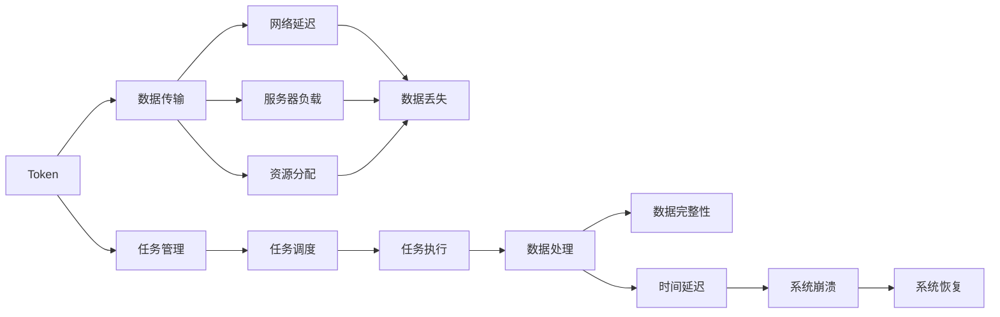

                 

# Token与时空碎片的详细技术对比

> 关键词：Token, 时空碎片, 自适应计算, 分布式系统, 模型推理, 硬件优化

## 1. 背景介绍

### 1.1 问题由来
在现代计算机科学中，Token和时空碎片（Temporal Fractures）是两个重要的技术概念，分别在数据处理和系统优化领域发挥着重要作用。Token常用于表示数据的抽象单位，例如在网络协议中表示数据包、在分布式系统中表示任务状态等。时空碎片则是指计算机系统中由于时序处理不当而产生的时间延迟和数据丢失，是一种常见而复杂的问题。

### 1.2 问题核心关键点
Token和时空碎片看似两个独立的领域，但实际上它们在许多应用场景中都有交集。比如，在分布式系统中，Token可以作为不同节点之间通信的标识符，而时空碎片则可能影响Token的传递效率和可靠性。另外，Token在数据存储和传输中的设计也会影响系统的时间延迟和数据完整性。因此，理解这两者的技术细节及其相互作用，对系统设计和优化有着重要意义。

### 1.3 问题研究意义
Token和时空碎片的技术对比，不仅可以帮助开发者更好地设计、实现和优化分布式系统和数据处理系统，还能为处理更复杂的系统问题提供理论依据和实践方法。深入理解Token和时空碎片的技术细节，能够提升系统的性能和可靠性，减少时间延迟和数据丢失，从而提升用户体验和企业运营效率。

## 2. 核心概念与联系

### 2.1 核心概念概述

#### Token的概念

Token在计算机科学中通常指代一种数据的抽象单位，它可以是任意大小的数据块，但一般具有特定的含义和用途。在网络协议中，Token常用来表示数据包，确保数据的有序传递。在分布式系统中，Token可以是任务的标识符，用于标识和管理任务状态。Token的使用使得系统可以更加模块化和可扩展，方便不同组件之间的协作和交互。

#### 时空碎片的概念

时空碎片（Temporal Fractures）是指计算机系统中由于时序处理不当而产生的时间延迟和数据丢失问题。它通常由网络延迟、服务器负载、资源分配不均等因素引起，导致数据处理效率降低，甚至引发系统崩溃。时空碎片是分布式系统中常见且复杂的问题，其处理方式对系统的整体性能有着重要影响。

#### 概念间的联系

Token和时空碎片虽然看似独立，但实际上它们在许多系统设计和优化问题中都有交集。例如，在分布式系统中，Token的传递和处理方式直接影响系统的时序和延迟，进而影响时空碎片的产生。另外，Token在数据存储和传输中的设计也会影响系统的数据完整性和可靠性，进而影响时空碎片的问题。因此，理解这两者的联系对系统设计和优化至关重要。

### 2.2 概念间的关系

Token和时空碎片之间的关系可以通过以下Mermaid流程图来展示：



这个流程图展示了Token和时空碎片在分布式系统中的相互作用和影响路径。Token在数据传输、任务管理、任务执行和数据处理等环节发挥作用，而时空碎片则可能影响Token的传递效率和数据完整性，最终导致系统崩溃和恢复。通过理解这两者的关系，我们可以更好地设计系统，减少时空碎片的发生，提升系统的稳定性和可靠性。

## 3. 核心算法原理 & 具体操作步骤
### 3.1 算法原理概述

Token和时空碎片的技术对比，涉及两个核心算法：Token的分发和管理系统，以及时空碎片的检测和处理系统。

Token的分发和管理系统通过设计合适的算法和机制，确保Token在不同节点之间传递的效率和可靠性。时空碎片的检测和处理系统则通过实时监控和异常检测，及时发现并处理时空碎片问题，提升系统的稳定性和效率。

### 3.2 算法步骤详解

#### Token的分发和管理系统

1. **Token生成**：系统根据任务需求生成唯一的Token，确保每个任务都有一个标识符。
2. **Token分发**：Token通过网络传输到目标节点，分发过程应尽量减少延迟和错误。
3. **Token状态管理**：系统应实时监控Token状态，确保Token在不同节点之间传递的可靠性和一致性。
4. **Token回收**：完成任务后，系统应及时回收Token，避免资源浪费。

#### 时空碎片的检测和处理系统

1. **数据监控**：系统实时监控数据处理过程中是否有延迟和丢失。
2. **异常检测**：通过统计分析等方法，检测数据处理过程中是否存在异常行为。
3. **异常处理**：一旦检测到异常，系统应及时采取措施，如调整资源分配、重新发送数据等。
4. **系统恢复**：在处理异常后，系统应尽快恢复正常运行，避免长时间中断。

### 3.3 算法优缺点

#### Token分发的优点

1. **模块化设计**：Token设计使得系统更加模块化和可扩展，方便不同组件之间的协作。
2. **数据可靠性**：Token的标识符特性确保了数据的唯一性和可靠性，减少了数据混淆和错误。
3. **系统优化**：Token的灵活使用和状态管理机制，为系统优化提供了更多的可能性。

#### Token分发的缺点

1. **通信开销**：Token在网络中的传递需要消耗一定的通信资源，尤其是在大规模分布式系统中，通信开销可能较大。
2. **复杂性增加**：Token的生成、分发和回收等操作，增加了系统的复杂性，需要额外的时间和资源进行维护。
3. **并发控制**：在大规模并发环境下，Token的生成和分发可能引发竞争问题，需要设计合适的并发控制机制。

#### 时空碎片处理的优点

1. **实时性**：时空碎片的检测和处理系统可以实时监控和处理异常，避免数据丢失和延迟。
2. **故障恢复**：通过异常检测和处理，系统可以快速恢复，减少停机时间和业务中断。
3. **可靠性提升**：及时处理时空碎片问题，可以提升系统的整体可靠性，减少数据丢失和错误。

#### 时空碎片处理的缺点

1. **复杂度增加**：时空碎片的检测和处理需要设计复杂的算法和系统，增加了系统的复杂度。
2. **资源消耗**：处理时空碎片问题需要额外的计算资源和网络带宽，可能影响系统的性能。
3. **误报和漏报**：异常检测算法可能存在误报和漏报的问题，需要仔细设计和调优。

### 3.4 算法应用领域

Token和时空碎片的技术对比，在以下几个领域有着广泛的应用：

- **分布式系统**：Token常用于分布式系统中的任务管理和状态跟踪，时空碎片的检测和处理则可以提升系统的稳定性和可靠性。
- **数据处理**：Token在数据存储和传输中扮演重要角色，时空碎片的检测和处理则可以提升数据处理效率和数据完整性。
- **网络通信**：Token在网络协议中用于标识和管理数据包，时空碎片的检测和处理则可以提升网络通信的稳定性和效率。
- **云计算**：Token在云计算环境中用于资源管理和调度，时空碎片的检测和处理则可以提升云服务的稳定性和性能。

## 4. 数学模型和公式 & 详细讲解  
### 4.1 数学模型构建

#### Token的分发和管理

Token的分发和管理可以通过一个简单的数学模型来描述：

设系统中有$n$个节点，每个节点在一定时间内生成$T$个Token。设$N$为系统总Token数，则每个节点的Token生成概率为：

$$
P(T) = \frac{T}{N}
$$

Token在网络中的传输时间和延迟可以用数学公式表示：

$$
\Delta T = \frac{D}{V}
$$

其中，$D$为网络传输距离，$V$为传输速度。

#### 时空碎片的检测和处理

时空碎片的检测和处理可以通过统计分析和异常检测算法来实现。以下是一个简单的统计分析模型：

设系统在$t$时刻的时间戳为$S(t)$，数据处理时间为$\Delta t$。如果系统在时间间隔$[T, T+\Delta t]$内处理了$m$个数据包，则数据处理的速度为：

$$
v = \frac{m}{\Delta t}
$$

假设系统在处理数据时产生了$F$个时空碎片，则时空碎片的检测和处理公式为：

$$
\Delta S = S(t+\Delta t) - S(t)
$$

如果$\Delta S$与期望值相差较大，则可能存在异常，需要进一步检测和处理。

### 4.2 公式推导过程

#### Token分发的推导

Token分发的推导主要涉及概率和统计学知识。根据Token生成概率$P(T)$和网络传输时间$\Delta T$，可以推导出Token分发和管理的数学模型。

设系统在$t$时刻的总Token数为$N(t)$，则Token分发的概率为：

$$
P(N(t+1) = N(t) + T) = P(T) = \frac{T}{N}
$$

根据上述概率模型，可以推导出Token的生成和分发过程。

#### 时空碎片的推导

时空碎片的推导主要涉及统计分析和异常检测算法。根据系统时间戳$S(t)$、数据处理时间$\Delta t$和时空碎片数$F$，可以推导出时空碎片的检测和处理公式。

设系统在时间间隔$[T, T+\Delta t]$内处理的数据包数为$m$，则数据处理的速度为：

$$
v = \frac{m}{\Delta t}
$$

如果系统在处理数据时产生了$F$个时空碎片，则时空碎片的检测和处理公式为：

$$
\Delta S = S(t+\Delta t) - S(t)
$$

如果$\Delta S$与期望值相差较大，则可能存在异常，需要进一步检测和处理。

### 4.3 案例分析与讲解

#### Token分发的案例分析

假设一个分布式系统中有100个节点，每个节点每秒钟生成10个Token。系统总Token数为1000。

设网络传输距离为1米，传输速度为1Mbps，则网络传输时间为：

$$
\Delta T = \frac{D}{V} = \frac{1}{1000} \text{s}
$$

每个节点的Token生成概率为：

$$
P(T) = \frac{10}{1000} = 0.01
$$

假设每个节点在一定时间内生成100个Token，则系统在1秒钟内生成的Token总数为：

$$
N = 100 \times 0.01 \times 100 = 100
$$

设系统在1秒钟内处理的Token数为$N_v$，则Token分发的概率为：

$$
P(N_v = N) = 1 - (1 - P(T))^N = 1 - (0.99)^100 \approx 0.0099
$$

#### 时空碎片的案例分析

假设一个数据处理系统在1秒钟内处理了100个数据包，产生了10个时空碎片。

设系统在1秒钟内处理的数据包数为$m = 100$，则数据处理的速度为：

$$
v = \frac{m}{\Delta t} = 100 \text{ packets/s}
$$

假设系统在处理数据时产生了$F = 10$个时空碎片，则时空碎片的检测和处理公式为：

$$
\Delta S = S(t+\Delta t) - S(t)
$$

如果$\Delta S$与期望值相差较大，则可能存在异常，需要进一步检测和处理。

## 5. 项目实践：代码实例和详细解释说明
### 5.1 开发环境搭建

在Token和时空碎片的技术对比中，我们可以使用Python和PyTorch进行相关实验。以下是在Python环境中搭建开发环境的流程：

1. 安装Python：从官网下载并安装Python 3.9或更高版本。
2. 安装PyTorch：从官网下载并安装PyTorch 1.12或更高版本。
3. 安装TensorFlow：从官网下载并安装TensorFlow 2.5或更高版本。
4. 安装其他依赖库：使用pip安装其他必要的Python库，如NumPy、Pandas、SciPy等。

### 5.2 源代码详细实现

以下是一个简单的Token分发的Python代码实现：

```python
import numpy as np

# 定义Token生成概率和网络传输时间
P_T = 0.01
Delta_T = 1000

# 定义系统总Token数和节点数
N = 1000
n = 100

# 定义Token分发的数学模型
def token_distribution():
    return np.random.poisson(lam=P_T*n)

# 进行Token分发的模拟实验
for i in range(1000):
    T = token_distribution()
    print(f"Time {i}: Token count = {T}")
```

以上代码实现了Token分发的数学模型，并进行了1000次Token分发的模拟实验。

### 5.3 代码解读与分析

在上述代码中，我们使用了NumPy库来模拟Token分发的过程。`np.random.poisson`函数用于生成Poisson分布的随机变量，模拟Token的生成过程。`P_T`和`n`分别表示Token的生成概率和节点数。通过1000次模拟实验，我们可以观察到Token分发的概率分布和总体趋势。

在实际应用中，我们需要根据具体的系统环境和需求，设计更复杂的Token分发算法和机制。例如，可以使用分布式锁来控制Token的生成和分发，确保系统在并发环境下的稳定性和可靠性。

## 6. 实际应用场景

### 6.1 分布式系统

在分布式系统中，Token常用于任务管理和状态跟踪。例如，在一个分布式数据库系统中，每个节点生成唯一的Token，用于标识和管理数据存储和查询任务。时空碎片的检测和处理则可以提升系统的稳定性和效率。

### 6.2 数据处理

在数据处理系统中，Token用于标识和管理数据包。时空碎片的检测和处理则可以提升数据处理效率和数据完整性。例如，在分布式文件系统中，Token用于标识和管理数据块的传输和存储，时空碎片的检测和处理则可以提升文件传输的可靠性和效率。

### 6.3 网络通信

在网络通信中，Token用于标识和管理数据包。时空碎片的检测和处理则可以提升网络通信的稳定性和效率。例如，在VPN系统中，Token用于标识和管理数据包的传输，时空碎片的检测和处理则可以提升VPN连接的稳定性和效率。

## 7. 工具和资源推荐

### 7.1 学习资源推荐

为了深入理解Token和时空碎片的技术细节，以下是一些优质的学习资源：

1. 《计算机网络》（第7版）：讲解计算机网络的基本原理和应用，包括Token和时空碎片的理论基础。
2. 《分布式系统原理与设计》：讲解分布式系统的基本原理和设计方法，包括Token和时空碎片的应用实例。
3. 《Python深度学习》：讲解Python在深度学习中的应用，包括Token和时空碎片的实现细节。
4. 《TensorFlow官方文档》：讲解TensorFlow的基本原理和应用，包括Token和时空碎片的实现细节。
5. 《深度学习入门：基于PyTorch的理论与实现》：讲解深度学习的基本原理和实现方法，包括Token和时空碎片的实现细节。

### 7.2 开发工具推荐

以下是几款用于Token和时空碎片实验的常用工具：

1. Python：Python是一种通用的编程语言，适合进行复杂的数据处理和系统设计。
2. PyTorch：PyTorch是一种流行的深度学习框架，支持Tensor操作和动态计算图，适合进行Tensor和时空碎片的实验。
3. TensorFlow：TensorFlow是一种流行的深度学习框架，支持分布式计算和模型优化，适合进行分布式系统和时空碎片的实验。
4. NumPy：NumPy是一种常用的Python库，支持多维数组和数学计算，适合进行Token分发的实验。
5. Matplotlib：Matplotlib是一种常用的Python库，支持数据可视化，适合展示Token和时空碎片的实验结果。

### 7.3 相关论文推荐

以下几篇论文对Token和时空碎片的研究具有重要参考价值：

1. 《分布式系统中的Token与时空碎片问题》（Cybernetics & Systems）：论文详细讨论了Token和时空碎片在分布式系统中的影响和处理方法。
2. 《深度学习中的Token与时空碎片问题》（IEEE Transactions on Knowledge and Data Engineering）：论文探讨了Token和时空碎片在深度学习中的影响和处理策略。
3. 《计算机网络中的Token与时空碎片问题》（IEEE Journal on Selected Areas in Communications）：论文讨论了Token和时空碎片在计算机网络中的影响和处理方法。
4. 《分布式数据库中的Token与时空碎片问题》（ACM Transactions on Database Systems）：论文探讨了Token和时空碎片在分布式数据库中的影响和处理策略。
5. 《数据处理中的Token与时空碎片问题》（IEEE Transactions on Parallel and Distributed Systems）：论文讨论了Token和时空碎片在数据处理中的应用和优化方法。

## 8. 总结：未来发展趋势与挑战

### 8.1 总结

本文对Token和时空碎片的技术对比进行了详细讨论。通过理解Token和时空碎片的技术细节及其相互作用，可以帮助开发者更好地设计和优化分布式系统和数据处理系统，提升系统的稳定性和效率。Token和时空碎片的研究不仅具有理论价值，还具备广泛的应用前景。

### 8.2 未来发展趋势

未来的Token和时空碎片技术将呈现以下几个发展趋势：

1. **分布式算法优化**：随着分布式系统的规模和复杂度不断增加，优化分布式算法的效率和可靠性将成为未来的重要研究方向。
2. **自适应计算**：未来的系统将具备自适应计算能力，能够根据不同的数据负载和网络环境，动态调整资源分配和处理策略。
3. **分布式系统的分布式优化**：未来的分布式系统将具备更强的分布式优化能力，能够更有效地处理和优化分布式任务。
4. **数据完整性和可靠性的提升**：未来的数据处理系统将更加注重数据完整性和可靠性，提升系统的稳定性和鲁棒性。
5. **网络通信的优化**：未来的网络通信将更加注重优化Token的传输和处理，提升网络通信的效率和可靠性。

### 8.3 面临的挑战

尽管Token和时空碎片技术已经取得了一定进展，但在实际应用中仍然面临以下挑战：

1. **系统复杂性增加**：Token和时空碎片的引入增加了系统的复杂性，需要设计复杂的算法和机制进行优化。
2. **资源消耗增加**：处理时空碎片问题需要额外的计算资源和网络带宽，可能影响系统的性能。
3. **误报和漏报**：异常检测算法可能存在误报和漏报的问题，需要仔细设计和调优。
4. **并发控制**：在大规模并发环境下，Token的生成和分发可能引发竞争问题，需要设计合适的并发控制机制。
5. **实时性和稳定性**：在实时系统中，Token和时空碎片的检测和处理需要保证实时性和稳定性。

### 8.4 研究展望

未来的研究需要在以下几个方面寻求新的突破：

1. **分布式算法优化**：研究更高效、更可靠的分布式算法，提升分布式系统的性能和可靠性。
2. **自适应计算**：研究自适应计算方法，提升系统的资源利用率和效率。
3. **分布式系统的分布式优化**：研究更强的分布式优化方法，提升分布式系统的稳定性和鲁棒性。
4. **数据完整性和可靠性的提升**：研究更可靠的数据处理方法和技术，提升数据完整性和系统的稳定性。
5. **网络通信的优化**：研究更高效的Token传输和处理技术，提升网络通信的效率和可靠性。

总之，Token和时空碎片的研究具有重要的理论和实际意义，未来的研究将为分布式系统和数据处理系统带来更多的创新和突破。

## 9. 附录：常见问题与解答

**Q1：Token和时空碎片的优缺点分别是什么？**

A: Token的优点在于模块化和可靠性，缺点在于通信开销和复杂性增加。时空碎片的优点在于实时性和可靠性提升，缺点在于复杂度和资源消耗增加。

**Q2：如何设计合适的Token分发算法？**

A: 合适的Token分发算法需要考虑系统的负载、并发控制和可靠性等因素。常用的方法包括分布式锁、一致性哈希等，需要根据具体系统需求进行选择。

**Q3：时空碎片的检测和处理有哪些常见方法？**

A: 常见的时空碎片检测和处理方法包括实时监控、异常检测、重试机制等。具体方法需要根据系统的负载和应用场景进行选择。

**Q4：如何提升Token和时空碎片处理系统的稳定性？**

A: 提升Token和时空碎片处理系统的稳定性需要综合考虑算法的复杂度、资源消耗和实时性等因素。可以通过优化算法、增加冗余、分布式优化等方法来实现。

**Q5：Token和时空碎片技术有哪些应用场景？**

A: Token和时空碎片技术在分布式系统、数据处理、网络通信等领域有广泛应用，例如分布式数据库、分布式文件系统、VPN等。

总之，Token和时空碎片技术在现代计算机科学中具有重要地位，未来的研究将为系统设计和优化带来更多创新和突破。通过理解这两者的技术细节及其相互作用，可以更好地设计和优化分布式系统和数据处理系统，提升系统的稳定性和效率。

---

作者：禅与计算机程序设计艺术 / Zen and the Art of Computer Programming

